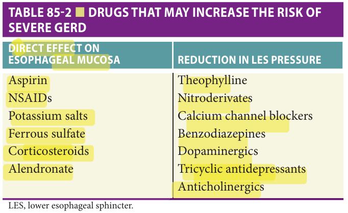

Study summary of Chapter 85 - Upper Gastrointestinal Disorders; the book and the full chapter are the reference.

# Chapter 85 Study: Upper Gastrointestinal Disorders

## Summary

**Presentation & diagnosis**
- GERD and ulcers may present with anemia, anorexia, vomiting or weight loss rather than typical pain; mild symptoms can accompany severe esophagitis (p1315–1317).
- The chapter advises great caution with empiric PPI diagnosis in older adults and generally favors endoscopic evaluation rather than relying on symptom response (p1315, p1317).
- Peptic ulcer risk reflects H. pylori, mucosa-damaging drugs and impaired mucosal defenses; review NSAIDs and antithrombotic exposure (p1315).

**Acid suppression & H. pylori**
- PPIs heal erosive esophagitis more effectively than H2 blockers. Studied daily regimens include omeprazole **20 mg** and pantoprazole **40 mg** (p1319).
- Reassess the indication for ongoing acid suppression; the chapter explicitly includes deprescribing when warranted (p1315).
- H. pylori tests can be falsely negative during antisecretory or antibiotic treatment and with gastric atrophy; biopsy location matters (p1327).
- Confirm eradication, generally at least **1 month** after treatment, using breath/stool testing or endoscopy when clinically indicated (p1327).
- The chapter describes PPI-based antibiotic combinations and notes greater eradication with **14** versus **7 days**, while acknowledging limited older-adult evidence for the longer regimen (p1328).

**Upper GI bleeding**
- UGIB originates proximal to the ligament of Treitz; it may cause hematemesis, melena, hematochezia or occult blood loss/anemia (p1331).
- Assess hemodynamics immediately and resuscitate as needed; review previous bleeding, ulcerogenic drugs, anticoagulants, blood count and coagulation studies (p1332–1333).
- The book's transfusion threshold is hemoglobin at most **8 g/dL**; it also advises transfusion above that level with volume depletion or severe comorbidity (p1333).
- Pre-endoscopy omeprazole/pantoprazole **80 mg IV bolus**, then **8 mg/hour**, may reduce endoscopic treatment requirements but does not improve final clinical outcomes (p1333).
- After endoscopic hemostasis of high-risk ulcer stigmata, the chapter describes **72 hours** of IV PPI; cited meta-analysis found oral and IV therapy similarly effective (p1333).

**Exam traps**
- Cirrhosis does not prove variceal bleeding: more than **50%** of UGIB in cirrhosis is nonvariceal in the cited text (p1332).
- Autoimmune atrophic gastritis can cause achlorhydria and pernicious anemia; diagnosis rests on corpus/fundus histology (p1335).

## Exam-cited book images

Book images cited by past exams. Tap an image to zoom.

## Table 85-2 — book image

[2024-May Q73](?chapter=bank&q=mcq-b9c4a66523aee26652ec01e3)

## Exam questions

Past-exam questions linked to this chapter (1):

- [2024-May Q73](?chapter=bank&q=mcq-b9c4a66523aee26652ec01e3)
