# Hazzard's Geriatric Medicine and Gerontology, 8e - Chapter 85: Upper Gastrointestinal Disorders

Alberto Pilotto, Marilisa Franceschi

> **Status.** Fast build from the book; not lane-reviewed.

> **Source and method.** Printed pages 1315-1336, from the marked 8th-edition copy (PDF page = printed page + 34). Prose follows its text layer; tables and figures are source-page crops. The book is canonical.

**[p. 1315]**

## INTRODUCTION

Upper gastrointestinal disorders (UGIDs) are highly prevalent in the aging population and may influence greatly nutrition, general well-being, and quality of life of older people. This chapter discusses the pathophysiology, clinical features, diagnostic approaches, and treatments of UGIDs, focusing on gastroesophageal reflux disease (GERD), peptic ulcer disease (PUD) including considerations on Helicobacter pylori infection and its eradication, and upper gastrointestinal bleeding (UGIB). Particular attention is given to pharmacology of UGIDs, both as a causal mechanism, as in the use of nonsteroidal anti-inflammatory drugs (NSAIDs) alone or in combination with anticoagulants/ antiplatelet agents, but also in the treatment of acid-related disorders. Special attention is given to situations when deprescription of widely used antisecretory drugs, mainly proton pump inhibitors, is warranted. UGIDs may present insidiously in older adults, who often have nonspecific symptoms, independently of whether esophageal and/or gastroduodenal lesions are demonstrated on instrumental diagnostic evaluations. Since UGIDs often require an interdisciplinary approach including endoscopists, radiologists, gastroenterologists, and surgeons, scenarios when referral to a specialist is recommended are also described.

#### Learning Objectives

- Identify the presentation of gastroesophageal reflux disease (GERD) in older adults and select the most appropriate therapeutic strategies.

- Employ management strategies that reduce the risk of peptic ulcer disease (PUD) in older adults including limiting the use of nonsteroidal anti-inflammatory drugs and eradicating H pylori when indicated.

- Ascertain the mechanisms that ensure proper use of proton pump inhibitors (PPI) in preventing PUD and UGIB with appropriate discontinuation of PPI therapy when not needed, making use of good clinical practice guidelines including multidimensional approach and noninvasive gastric function tests.

#### Key Clinical Points

1. GERD is common in older adults with an incidence of 5 per 1000 person years in the United Kingdom and United States. Symptoms may not correlate with the severity of esophageal findings on endoscopy so a trial of proton pump inhibitors (PPIs) should rarely be done without endoscopy for suspected GERD in older adults. PPIs are more effective than H2-blockers, but prokinetic agents have not been shown to be superior to placebo.

2. The prevalence of PUD increases with age, likely due to H pylori infection, use of mucosa-damaging drugs, and an imbalance between mucosal erosive and protective factors. Treatment of H pylori reduces PUD relapse, but many older adults go untested and untreated. H pylori eradication after treatment should be documented with a breath test or stool antigen.

## GASTROESOPHAGEAL REFLUX DISEASE

Definition GERD is defined by symptoms and/or histopathologic alterations (esophagitis) caused by reflux of gastric contents into the esophagus. Manifestations of GERD range from mild episodes of heartburn and acid regurgitation without esophagitis, commonly defined as nonerosive reflux disease (NERD), to chronic mucosal inflammation with erosive esophagitis and ulceration, complicated in severe cases by stricture and bleeding.

Epidemiology GERD is a frequent condition with worldwide distribution. The prevalence of GERD is estimated to be 12% in Australia, 7.8% in East Asia, 8.8% to 26% in Europe, 8.7% to 33% in the Middle East, 18% to 28% in North America, and 23% in South America. A large US nationwide cohort

**[p. 1316]**

3. Upper GI bleeding (UGIB) occurs in older adults due to the same pathologies as seen in young adults, but may present with exacerbation of underlying disease (eg, cardiac disease) or non-GI symptoms such as syncope.

4. PPIs interact with many drugs prescribed for older adults, and long-term PPI use has been associated with multiple adverse outcomes, especially in frail older adults. Thus, long-term PPI use should be avoided unless there are clear indications, and deprescription should be enacted whenever possible.

study reported that the prevalence of GERD is increasing overall, but seemingly this increase is not seen in subjects older than 70 years, whose proportion of GERD patients remains stable around 15% during the time period from 2006 to 2016. Indeed, GERD prevalence remains higher amongst subjects older than 70 years, but as prevalence of GERD in those age 30 to 39 is increasing, the proportion of GERD patients older than 70 years is decreasing.

While it is still unclear whether the incidence and the prevalence of GERD symptoms increase with advancing age, the frequency of esophagitis is higher in older versus younger adults. Indeed, older age was found to be a significant risk factor in the development of severe forms of GERD in both epidemiologic and clinical studies from the United States, Japan, and Europe. Consistently, GERD was the sixth most common disorder in a retrospective cross sectional study of almost 20,000 long-term care residents of nursing homes older than 65 years, with an overall prevalence of 23%. In summary, GERD is a highly prevalent disorder in older adults, and associated with more severe and advanced disease than in young adults.

Pathophysiology Pathophysiologic changes in esophageal function that occur with aging, the so-called presbyesophagus, are summarized in Table 85-1 and may be responsible, at least in part, for the high prevalence of GERD in old age. Older patients have a high prevalence of other risk factors that predispose the aging esophagus to lesions (also see Table 85-1): (1) difficulty in maintaining an upright position after meals due to the modifications of the thorax anatomy linked to the dorsal kyphosis and collapse of the dorsal vertebrae; and (2) hiatus hernia associated with both repeated episodes of acid reflux and with more severe diseases such as Barrett esophagus. Older adults often use drugs that may have a directly damaging effect on esophageal mucosa or an indirect effect on reducing lower esophageal sphincter (LES) pressure (Table 85-2). Delayed esophageal transit time of many drugs in older

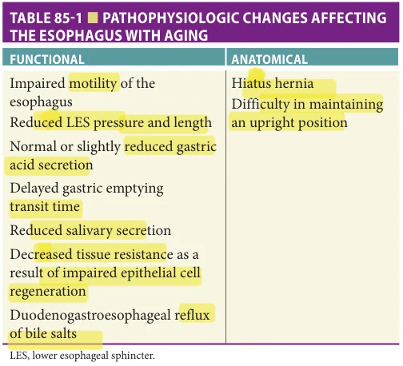

*TABLE 85-1 ■ PATHOPHYSIOLOGIC CHANGES AFFECTING THE ESOPHAGUS WITH AGING*

people creates a potentially dangerous situation when it coexists with acid reflux, as reported for alendronate and NSAIDs.

Presentation Particular attention has been given to the clinical presentation of GERD in older adults since important differences have been reported when compared to younger individuals. Older patients report fewer typical symptoms of heartburn, acid regurgitation, and epigastric pain (Figure 85-1). Atypical symptoms also are relatively rare in older adults (Table 85-3). In contrast, the prevalence of nonspecific symptoms of vomiting, anorexia, weight loss, and anemia increase with age (Figure 85-2). Reflux esophagitis in older adults may thus be missed, and a substantial number of patients may suffer subclinical relapses of the disease. The cause of such a different clinical expression of GERD in older adults is not clear, but a diminished sensitivity to visceral pain has been documented in older adults. Moreover, 24-hour esophageal pH monitoring and endoscopy examinations demonstrate an age-related reduction in acid chemosensitivity and a reduced symptom severity despite a

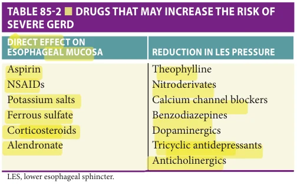

*TABLE 85-2 ■ DRUGS THAT MAY INCREASE THE RISK OF SEVERE GERD*

**[p. 1317]**

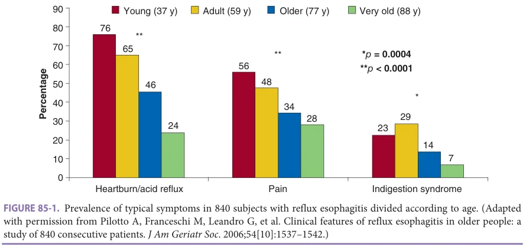

*FIGURE 85-1. Prevalence of typical symptoms in 840 subjects with reflux esophagitis divided according to age. (Adapted with permission from Pilotto A, Franceschi M, Leandro G, et al. Clinical features of reflux esophagitis in older people: a study of 840 consecutive patients. J Am Geriatr Soc. 2006;54[10]:1537–1542.)*

tendency toward increased severity of esophageal mucosal injury.

Evaluation Since the presentation of GERD is often nonspecific in older adults, endoscopy should be undertaken early as the initial diagnostic test in any older patient suspected of having GERD. Early endoscopy is very useful in diagnosing the presence and the grade of severity of esophagitis (Figure 85-3) and/or hiatus hernia, which are important prognostic factors to be considered in long-term treatment, especially if the hernia is greater than 3 cm. Endoscopy also identifies GERD complications, especially esophageal strictures and Barrett esophagus, and concomitant gastroduodenal diseases including gastric or duodenal ulcers and/ or H pylori infection. Barium radiography of the esophagus is a useful test to establish the presence of a hiatus hernia and is indicated as part of the evaluation of the patient with suspected motility abnormalities or peptic stricture.

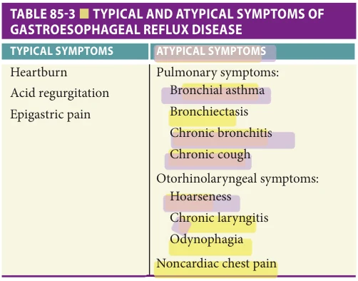

*TABLE 85-3 ■ TYPICAL AND ATYPICAL SYMPTOMS OF GASTROESOPHAGEAL REFLUX DISEASE*

A barium study may also identify rings, webs, or other obstructive lesions. The barium swallow test is also a key test in studying older patients with dysphagia, and it should be performed in conjunction with endoscopy in all older patients with this symptomatology. Moreover, coupled with videofluoroscopic swallowing studies, barium swallow (esophagram) allows the identification of Zenker diverticulum and cricopharyngeal dysfunction. Barium studies are widely available and usually well tolerated by older people. Esophageal 24-hour pH testing is helpful before antireflux surgery and in those patients not responsive to medical treatment. In the patient with persistent symptoms and a negative endoscopy, an abnormal esophageal pH test may suggest the need for more aggressive drug therapy, whereas a normal test may indicate the presence of a functional disorder. In the patient with persistent esophagitis, a normal test could differentiate pathophysiologic mechanisms, that is, a drug-induced esophagitis from acid reflux disease or biliary reflux. Esophageal manometry is useful in identifying abnormalities of LES pressure or esophageal motility. In older patients, its major use in GERD is reserved for the localization of LES before pH testing and for obtaining preoperative information on esophageal peristalsis.

A therapeutic trial with PPI has been suggested as a useful diagnostic test in patients with GERD. Meta-analyses of clinical studies demonstrated that an empiric PPI trial has 78% sensitivity and 54% specificity in confirming the diagnosis of GERD when compared with endoscopy or 24-hour esophageal pH monitoring. In patients with noncardiac chest pain, sensitivity and specificity are reported to be 80% and 74%, respectively. Since typical (heartburn, acid regurgitation) and extraesophageal symptoms (pulmonary, otorhinolaryngeal, noncardiac chest pain) of GERD are less frequent in older than in younger patients, the older patient’s history is less reliable, and there is a high prevalence of severe esophagitis despite mild symptoms; a trial of PPIs should be used with great caution

**[p. 1318]**

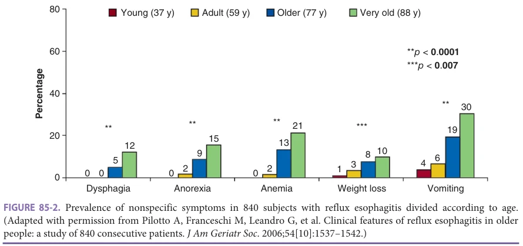

*FIGURE 85-2. Prevalence of nonspecific symptoms in 840 subjects with reflux esophagitis divided according to age. (Adapted with permission from Pilotto A, Franceschi M, Leandro G, et al. Clinical features of reflux esophagitis in older people: a study of 840 consecutive patients. J Am Geriatr Soc. 2006;54[10]:1537–1542.)*

in older patients, possibly only after endoscopy as a first diagnostic test.

Management The objectives of GERD treatment are (1) relief of symptoms, (2) esophagitis healing, (3) prevention of relapse, and (4) prevention of complications.

Nonpharmacological Although there is clinical and physiologic evidence that smoking, alcohol, chocolate, peppermint, coffee, fatty, or citrus intake may adversely affect symptoms or esophageal pH, there is little evidence that cessation of these agents will improve GERD variables.

Elevation of the head of the bed and weight loss, however, have been associated with improvement in GERD variables in case-control studies. Medications that decrease LES pressure and promote gastroesophageal reflux as well as drugs that may cause direct esophageal injury (see Table 85-2) should be avoided when possible or used with caution in older patients with GERD. In any case, these drugs must be taken while maintaining an upright position and with a full glass of water.

Drugs

Short-Term Therapy Antacids and alginic acid provide symptomatic relief in mild, nonerosive esophagitis. Possible

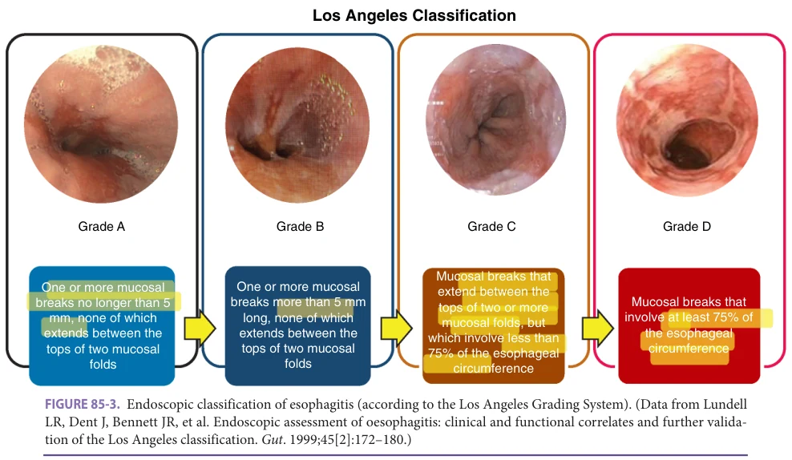

*FIGURE 85-3. Endoscopic classification of esophagitis (according to the Los Angeles Grading System). (Data from Lundell LR, Dent J, Bennett JR, et al. Endoscopic assessment of oesophagitis: clinical and functional correlates and further valida- tion of the Los Angeles classification. Gut. 1999;45[2]:172–180.)*

**[p. 1319]**

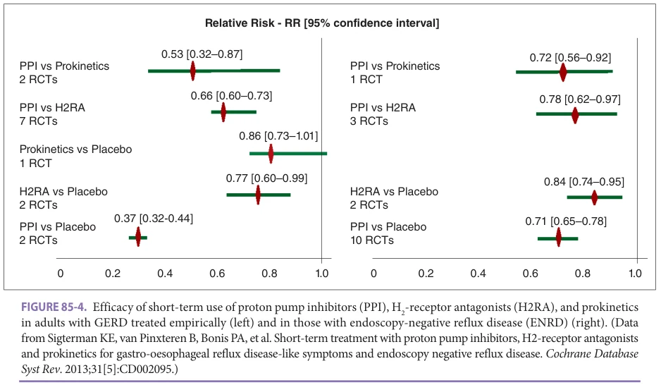

*FIGURE 85-4. Efficacy of short-term use of proton pump inhibitors (PPI), H2-receptor antagonists (H2RA), and prokinetics in adults with GERD treated empirically (left) and in those with endoscopy-negative reflux disease (ENRD) (right). (Data from Sigterman KE, van Pinxteren B, Bonis PA, et al. Short-term treatment with proton pump inhibitors, H2-receptor antagonists and prokinetics for gastro-oesophageal reflux disease-like symptoms and endoscopy negative reflux disease. Cochrane Database Syst Rev. 2013;31[5]:CD002095.)*

side effects of antacids include salt overload, constipation, hypercalcemia, and interference with the absorption of other drugs, particularly antibiotics such as tetracycline, azithromycin, and quinolones. Caution is warranted in patients with chronic kidney disease or liver failure, not only because of reduced clearance but also because of modified electrolyte metabolism.

Prokinetic drugs, including metoclopramide, clebopride, domperidone, and levosulpiride, either alone or in combination with antisecretory drugs, are only moderately effective in GERD. Unfortunately, no controlled clinical trials have evaluated the role of these drugs specifically in the treatment of GERD in older adults. However, older patients treated with prokinetic drugs are more likely than younger subjects to have adverse events such as tardive dyskinesia, mental confusion, drowsiness, and age-related renal dysfunction, which may require dose reduction and close clinical monitoring. Thus, antireflux therapy is focused largely on suppressing gastric acid secretion with H2-blockers and PPIs.

A series of meta-analyses of 34 trials including 1314 participants demonstrated that PPIs were more effective than H2-blockers and prokinetics in relieving heartburn both in patients with GERD who were treated empirically and in patients with endoscopy-negative reflux disease (ENRD) (Figure 85-4). Moreover, a meta-analysis of 134 trials involving 35,978 patients with esophagitis demonstrated benefit for standard dose PPI therapy and H2-blockers but not prokinetics compared to placebo in healing of esophagitis. In addition, 26 trials evaluating 4032 participants reported that there was benefit for PPI therapy compared to H2-blockers or H2-blockers plus prokinetics in healing of esophagitis. Thus, PPI is the most effective therapy

for heartburn relief and healing of esophagitis, and H2-blocker therapy is also effective. However, the effectiveness of prokinetics over placebo is marginal (Figure 85-5).

Currently, six PPIs are available: omeprazole, lansoprazole, dexlansoprazole (lansoprazole’s R-enantiomer), rabeprazole, pantoprazole, and esomeprazole. Some age-associated differences in pharmacokinetics and pharmacodynamics of PPIs have been reported. However, it is unknown if these differences are associated with different clinical effects, particularly in older patients. Indeed, a series of meta-analyses evaluating acute therapy of esophagitis reported that the PPIs were superior to ranitidine and placebo in healing erosive esophagitis, without differences in efficacy between omeprazole 20 mg daily and lansoprazole 30 mg daily or pantoprazole 40 mg daily or rabeprazole 20 mg daily. A systematic review and meta-analysis of randomized controlled trials comparing effectiveness and acceptability of the FDA-licensed PPIs for esophagitis reported that esomeprazole 40 mg provided higher healing rates than omeprazole 20 mg, lansoprazole 30 mg, pantoprazole 40 mg, and rabeprazole 20 mg at 4 weeks and omeprazole 20 mg, lansoprazole 30 mg, and rabeprazole 20 mg at 8 weeks (Figure 85-6). In terms of acceptability, only dexlansoprazole 60 mg had significantly more all-cause discontinuation than omeprazole 20 mg, pantoprazole 40 mg, and lansoprazole 30 mg (Figure 85-7).

Long-Term Maintenance Therapy GERD is a chronic disease with a 70% to 90% annual relapse rate after the interruption of an effective antisecretory regimen. Risk factors for relapse are shown in Table 85-4. Maintenance therapy with antisecretory drugs reduces relapse of GERD in older patients. Also PPIs have higher efficacy than H2-blockers

**[p. 1320]**

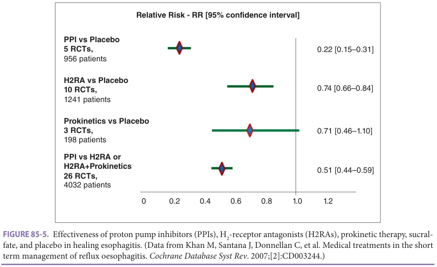

*FIGURE 85-5. Effectiveness of proton pump inhibitors (PPIs), H2-receptor antagonists (H2RAs), prokinetic therapy, sucral- fate, and placebo in healing esophagitis. (Data from Khan M, Santana J, Donnellan C, et al. Medical treatments in the short term management of reflux oesophagitis. Cochrane Database Syst Rev. 2007;[2]:CD003244.)*

and prokinetics in maintaining mucosal healing after an episode of esophagitis. There are two main approaches to maintenance drug therapy for GERD: step-up and stepdown. In the step-up approach, therapy is initiated with weak inhibition of gastric acid (eg, an H2-blocker or half dosage of a PPI), and progresses to a higher degree of acid inhibition (standard and then escalating doses of PPI), until adequate symptom control is obtained. The step-down

approach involves starting with the most effective regimen (full dosage of a PPI) and switching to lower doses of PPI for maintenance therapy once symptoms are under control. This latter approach is perhaps more rational, based on evidence showing superior efficacy of PPIs over H2-blockers across all grades of severity of GERD. Withdrawal of maintenance therapy with PPI after 6 months reduces the remission rate of esophagitis at 1 year from 95% to 33% in patients

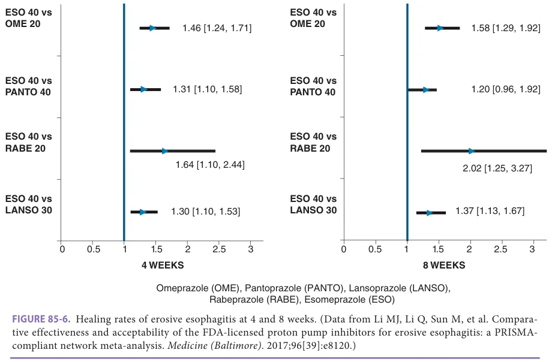

*FIGURE 85-6. Healing rates of erosive esophagitis at 4 and 8 weeks. (Data from Li MJ, Li Q, Sun M, et al. Compara- tive effectiveness and acceptability of the FDA-licensed proton pump inhibitors for erosive esophagitis: a PRISMA- compliant network meta-analysis. Medicine (Baltimore). 2017;96[39]:e8120.)*

**[p. 1321]**

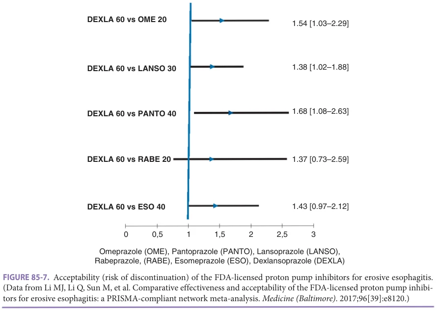

*FIGURE 85-7. Acceptability (risk of discontinuation) of the FDA-licensed proton pump inhibitors for erosive esophagitis. (Data from Li MJ, Li Q, Sun M, et al. Comparative effectiveness and acceptability of the FDA-licensed proton pump inhibi- tors for erosive esophagitis: a PRISMA-compliant network meta-analysis. Medicine (Baltimore). 2017;96[39]:e8120.)*

older than 65 years (Figure 85-8). Presently, no comparative studies have been carried out to evaluate which strategy (step-down vs step-up) is more cost-effective in older subjects. As chronic PPI use without reassessment contributes to polypharmacy and puts subjects at risk of experiencing drug interactions and adverse events (see below), deprescribing should be a goal of treatment. A Cochrane review, however, found that although effectively reducing costs and medication intake, deprescription strategies

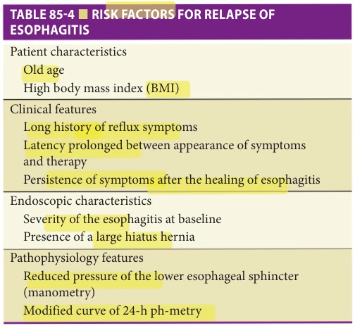

*TABLE 85-4 ■ RISK FACTORS FOR RELAPSE OF ESOPHAGITIS*

including on-demand PPI intake versus continuous indefinite use, are associated with patient dissatisfaction due to symptomatic disease relapse. Unfortunately, studies carried out specifically in older people are lacking. Figure 85-9 summarizes the therapeutic schemes for short-term and

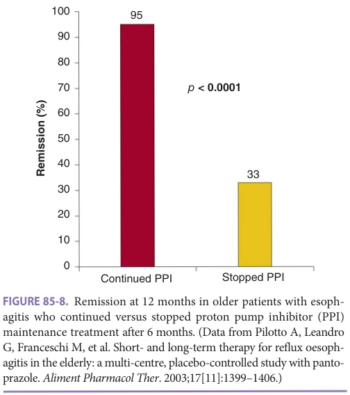

*FIGURE 85-8. Remission at 12 months in older patients with esoph- agitis who continued versus stopped proton pump inhibitor (PPI) maintenance treatment after 6 months. (Data from Pilotto A, Leandro G, Franceschi M, et al. Short- and long-term therapy for reflux oesoph- agitis in the elderly: a multi-centre, placebo-controlled study with panto- prazole. Aliment Pharmacol Ther. 2003;17[11]:1399–1406.)*

**[p. 1322]**

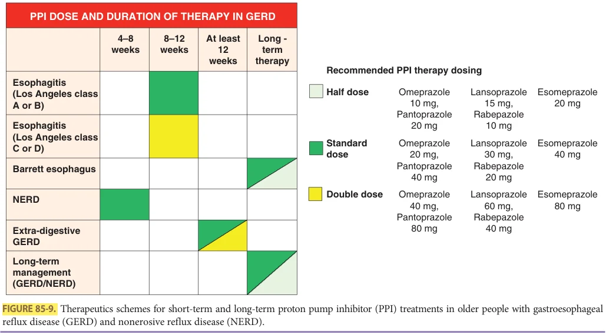

*FIGURE 85-9. Therapeutics schemes for short-term and long-term proton pump inhibitor (PPI) treatments in older people with gastroesophageal reflux disease (GERD) and nonerosive reflux disease (NERD).*

long-term PPI treatment in older people with GERD and NERD.

Safety of Long-Term Antisecretory Treatment PPIs represent a very effective class of drugs widely prescribed in all age populations, including older subjects, and often for prolonged periods of time. The potential adverse effects of long-term PPI use are widespread, as illustrated in Figure 85-10. Thus, safety evaluation of long-term treatment with PPIs is emerging as a major topic in clinical practice.

PPIs and esophageal and gastric histologic changes. There is presently no evidence supporting the hypothesis that long-term PPI therapy may increase the risk of neoplastic degeneration in patients with Barrett esophagus. Conversely, based on meta-analysis of observational studies, the long-term use of PPIs was associated with a decreased risk of esophageal adenocarcinoma and/or high-grade dysplasia in patients with Barrett esophagus. As regards PPI long-term use and the risk of gastric cancer, conflicting data have been reported. A positive association between fundic gland polyps (FGPs) and acid suppression has been reported. Although this constitutes a frequent endoscopic finding, it is not associated with risk of neoplastic disease and lacks clinical significance.

PPIs and hypergastrinemia. The physiologic role of gastrin is to stimulate gastric enterochromaffin-like (ECL) cells to secrete histamine, which in turn stimulates the secretion of hydrochloric acid from gastric parietal cells. Since PPIs inhibit the final step of gastric acid secretion by irreversible binding to the parietal cell H+K+ATPase (the proton pump), secondary hypergastrinemia may occur in subjects

treated long-term with PPIs. Indeed, an increase in the average serum gastrin level as well as a diffuse (simple) or linear/micronodular (focal) ECL-cell hyperplasia has been observed in patients continuously using PPIs. The clinical relevance of these findings is currently uncertain.

PPIs and iron and vitamin B12 deficiencies. While gastric acid suppression may decrease iron absorption, it remains uncertain whether iron-deficiency anemia may result from chronic PPI therapy.

Long-term use of gastric acid suppressant drugs, particularly PPIs, is associated with the development of vitamin B12 deficiency, especially in older subjects. Thus, it is appropriate to assess vitamin B12 status in long-term users of PPIs, especially in older subjects who may have poor nutrition (and therefore low vitamin B12 intake) and/ or in patients requiring life-long PPI treatments, such as those with Zollinger-Ellison syndrome.

PPIs and magnesium. Long-term PPI use can be associated with a subclinical magnesium deficiency, as has been observed in hospitalized adult patients. Thus, the FDA has suggested monitoring serum magnesium levels in patients on PPI therapy.

PPIs, bone metabolism, osteoporosis, and risk of fractures. Antisecretory drugs may interfere with calcium absorption through induction of hypochlorhydria; PPIs, moreover, may reduce bone resorption through inhibition of the osteoclastic vacuolar proton pump. Indeed, long-term PPI therapy has been associated with an increased risk of hip, wrist, or spine fractures. The risk of fracture is higher in patients who receive multiple daily doses of PPIs and when therapy

**[p. 1323]**

is prolonged for a period of 1 year or longer. Additional risk factors for osteoporosis, such as old age and female gender, may also contribute to increase the risk of fractures in longterm acid suppression drug users.

PPIs and enteric infections. Inhibition of acid secretion may induce an increase of the bacterial flora at the gastrointestinal level with potential to increase the incidence of systemic infections particularly in immune depressed older subjects. Indeed, the use of antisecretory drugs has been associated with an increased risk of infections of the lower gastrointestinal tract, mainly because of Salmonella species and Clostridium difficile. In a large population-based study, subjects treated with acid-lowering drugs had a threefold higher risk of developing bacterial diarrhea than those taking hypotensive or antiasthmatic medications. In older patients this susceptibility is increased, particularly for Salmonella and Campylobacter infections. Some data suggest that widespread use of PPIs, especially in the hospital setting, may contribute to the current in-hospital epidemic of C difficile infections. Indeed, a meta-analysis of 56 studies involving 356,683 patients provided strong evidence that PPI use is associated with a double risk for development of C difficile infection without differences in subgroup analyses for age less than 65 years versus equal or more than 65 years.

PPIs and community-acquired pneumonia. A series of observational studies have suggested that the use of PPIs could increase

the risk of hospitalization for community-acquired pneumonia (CAP), particularly in older subjects. The potential presence of confounding factors, however, seems to limit the conclusions of these studies. Indeed, meta-analyses have demonstrated that PPI and H2-blocker long-term use is not associated with an increased risk of hospitalization for CAP.

PPIs and COVID-19. The recent pandemic due to SARSCoV-2 has prompted examination of PPI use and risk of adverse outcomes of COVID-19. Two meta-analyses found that PPI use is associated with higher risk for becoming infected with COVID-19, but not significantly (5 studies; odds ratio [OR], 1.33) and with significantly higher risk for severe outcomes of COVID-19, including intensive care unit admission or death (9 studies; OR, 1.67). In another meta-analysis, PPI use was associated with significantly higher risk for severe outcomes of COVID-19 (3 studies; OR, 1.46) and for developing secondary infections (2 studies; OR, 2.91). Although a causal relation between PPI use and susceptibility to COVID-19 or worse COVID-19 outcomes has not been proven, a plausible biological mechanism might involve facilitated gut viral entry due to abated acidic gastric production.

PPIs and microbioma/microbiota. As it is becoming more evident that gut microbiota is markedly different at different life stages and in health versus in the presence of diseases, the association between medications and the microbiome is

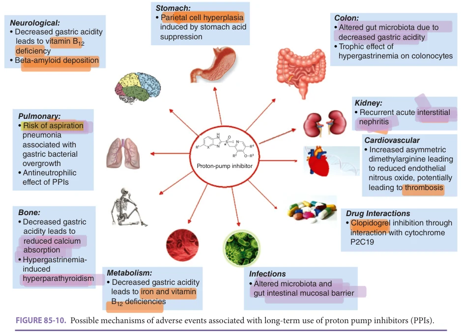

*FIGURE 85-10. Possible mechanisms of adverse events associated with long-term use of proton pump inhibitors (PPIs).*

**[p. 1324]**

being explored. It is becoming clear that greater diversity of gut microbiota is associated with good health, and that the predominance of certain bacterial species over others is a hallmark of certain conditions. Among older hospitalized patients compared to healthy subjects, polypharmacy was significantly associated with gut microbiota dysbiosis, that is, reduction in species richness and significant variations in the average relative abundance of a large number of taxa, including Helicobacter. Importantly, dysbiosis also exhibited a significant association with mortality at follow-up. Healthy-active older subjects without polypharmacy did not exhibit dysbiosis. Of note, among specific drug classes, PPIs, antipsychotics, and antidepressants had the strongest associations with gut microbiota composition.

PPIs, frailty, and mortality. Chronic use of PPIs has been reported to be associated with a higher risk of functional decline in frail older subjects. Moreover, in older patients discharged from acute care hospitals, the use of highdose PPIs was associated with increased 1-year mortality. Although further studies are needed, these data suggest caution when continuing PPIs following an episode of hospitalization in older adults.

Bioavailability and metabolism of other agents. Due to the profound and long-lasting elevation of intragastric pH, it is not surprising that PPIs interfere with the absorption of concurrent medications, as drug solubility may be substantially reduced at neutral pH compared with acidic conditions. PPIs reduce the bioavailability of many drugs (eg, ketoconazole, atazanavir) by 50% or more compared with the control values. Moreover, omeprazole has been associated with 30% and 10% reductions in systemic clearance of diazepam and phenytoin, respectively. Since PPIs are mainly metabolized by the cytochrome P450 (CYP), particularly the subfamily CYP2C19, clinically relevant drug interactions may occur in case of concomitant administration of CYP2C19-metabolized drugs.

Due to omeprazole’ and esomeprazole’s competitive interference with the conversion of clopidogrel to its active metabolite through the CYP2C19 pathway, their concomitant use is discouraged. Although evidence of safety regarding concomitant use of clopidogrel and other PPIs including pantoprazole, rabeprazole, and lansoprazole is still lacking, at present these drugs are not contraindicated in patients on antiplatelet therapy, but caution is warranted, and an individualized approach which assesses the real need for PPI therapy is recommended. Drug interactions have also been described between PPIs and warfarin, phenytoin, ledipasvir, sofosbuvir, methotrexate, digoxin, nelfinavir, and rilpivirine, amongst others.

Overutilization of acid inhibitors. Acid inhibitors are among the most commonly used pharmaceuticals. United States trends in PPI prescriptions indicate that PPI users increased from 5.70% in 2002–2003 to 6.73% in 2016–2017, especially in adults aged 65 and older, and those who were obese. A previous study of 946 PPI users showed that 35%

were prescribed PPI for a documented upper GI disorder, 10% for empirical symptomatic treatment, and 18% for gastric protection while on NSAIDs or antiplatelet drugs, while up to 36% of subjects had no documented appropriate indication for PPI therapy. Other studies have reported that PPIs are frequently prescribed during hospitalization, especially in older adults, and that as many as 50% of such prescriptions may be continued after discharge without clear indications. All these data suggest that older patients on long-term PPI therapy should be periodically evaluated for the indications for continued therapy.

The role of surgery The role of surgery in the treatment of GERD is controversial. Laparoscopic fundoplication has greatly reduced the morbidity and mortality of antireflux surgery, and this is also true for older adults. Indications for surgery are evolving; at present, evidence suggests that surgery may be indicated in older patients who (1) are medical treatment failures; (2) have severe complications, such as strictures not treatable by endoscopy; (3) have severe dysphagia, aspiration, or atypical symptoms associated with a large hiatal hernia; and/or (4) have preneoplastic lesions, that is, Barrett esophagus with high-grade dysplasia. Randomized clinical studies are needed to compare the outcome of antireflux surgery with that of medical therapy in older adults. Furthermore, surgery for GERD should be centralized to units specialized in these techniques to reduce surgical complications and improve successful clinical outcomes.

## PEPTIC ULCER DISEASE

Definition Peptic ulcer is a break of the mucosa lining the stomach or the duodenum. According to their anatomical location, peptic ulcers are divided into gastric ulcers, that is, peptic ulcers of the gastric fundus, body, or antrum; prepyloric and pyloric ulcers, that is, located within 3 cm from the pyloric ring and in the pyloric ring, respectively; and duodenal ulcers, that is, located in the bulb or in the second portion of the duodenum (Figure 85-11).

Epidemiology The prevalence of PUD worldwide ranges from 0.1% to 4.7%, with an annual incidence ranging from 0.19% to 0.3%. Duodenal ulcers are most common in Western populations, and gastric ulcers are more frequent in Asia. Overall, the prevalence and incidence of PUD are declining, but the incidence of PUD and its complications increases with advancing age (Figure 85-12). Indeed, the rates of hospitalization for complicated peptic ulcer (Figure 85-13) and mortality rates for upper GI complications (Figure 85-14) remain very high in older patients.

Pathophysiology and Classification Two main factors that might explain the observed increase in PUD in older patients are the high prevalence

**[p. 1325]**

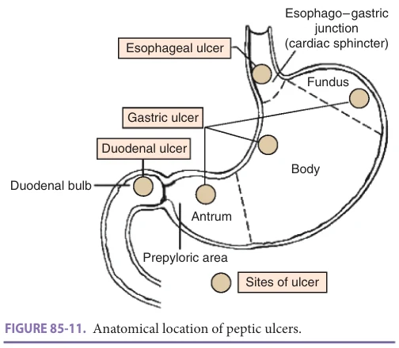

*FIGURE 85-11. Anatomical location of peptic ulcers.*

of H pylori infection and the frequent use of mucosa-damaging drugs, such as NSAIDs and aspirin. Nevertheless, in older subjects, around 20% of all peptic ulcers are not associated with either of these risk factors (Figure 85-15). The pathophysiology of “idiopathic” non-NSAID, non-H pylori peptic ulcers is still uncertain, but a critical disequilibrium between protective and erosive factors in the gastric or duodenal mucosa seems to be involved. Advancing age is associated with a reduction of the gastric mucosal barrier, that is, the capacity to resist external damage owing to secretion of gastric mucus, bicarbonate secretion, mucosal prostaglandins, gastric mucosal proliferation, and/or mucosal blood flow. Moreover, in older patients with PUD, normal or high levels of gastric acid and pepsin secretions have been observed. Although advancing age is independently

related to chronic atrophic gastritis and a functional status of hypo/achlorhydria, the atrophic changes of the gastric mucosa appear to be associated with H pylori infection rather than with aging. Emotional stress, smoking tobacco, and/or alcohol use are potential risk factors that may contribute to the development of PUD in predisposed subjects.

H pylori–associated peptic ulcer disease Approximately, 70% of older peptic ulcer patients are H pylori positive (see Figure 85-15). Treatment of H pylori infection heals ulcers in more than 95% of older patients and improves symptoms in more than 85%. Moreover, the eradication of H pylori infection improves clinical outcomes, reducing ulcer recurrences and symptoms. Health programs leading to widespread eradication of H pylori infection in symptomatic patients have reduced the prevalence of PUD, particularly of duodenal ulcer, both in Europe and in the Far East. Unfortunately, the percentage of older patients with PUD who are treated for their H pylori infection is still quite low. In one US study, only 40% to 56% of patients older than 65 years who were hospitalized for PUD were tested for H pylori infection; among the H pylori positive patients, only 50% to 73% were treated with specific antibiotic-based anti-H pylori therapy.

NSAID/aspirin-associated peptic ulcer disease In older patients, approximately 25% of duodenal ulcers and 40% of gastric ulcers are associated with the use of NSAIDs and/or aspirin (see Figure 85-15). The risk of NSAID-related peptic ulcers and their severe complications tends to increase linearly with age and becomes particularly high in the presence of disability, comorbidity, and polypharmacy. A casecontrol study performed in more than 3000 older patients who underwent an endoscopy documented that subjects undergoing treatment with NSAIDs and/or aspirin had a higher prevalence of gastric and duodenal ulcers compared

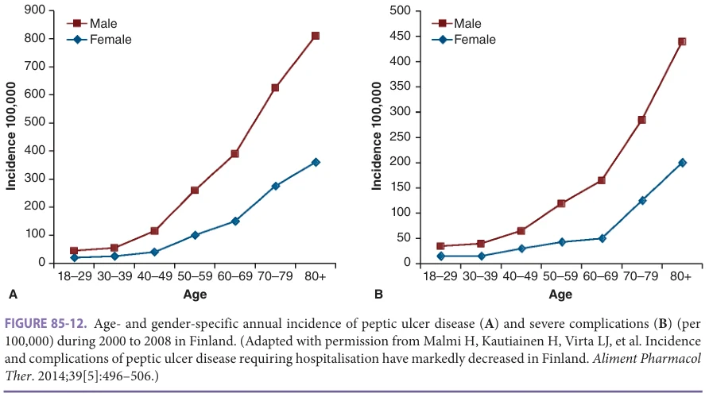

*FIGURE 85-12. Age- and gender-specific annual incidence of peptic ulcer disease (A) and severe complications (B) (per 100,000) during 2000 to 2008 in Finland. (Adapted with permission from Malmi H, Kautiainen H, Virta LJ, et al. Incidence and complications of peptic ulcer disease requiring hospitalisation have markedly decreased in Finland. Aliment Pharmacol Ther. 2014;39[5]:496–506.)*

**[p. 1326]**

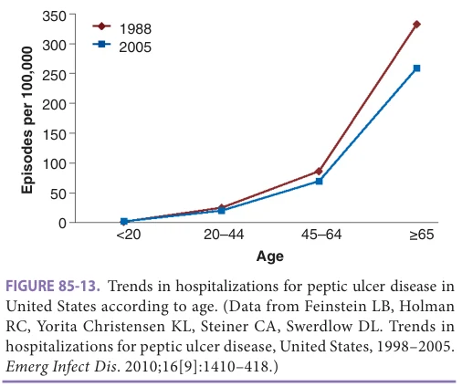

*FIGURE 85-13. Trends in hospitalizations for peptic ulcer disease in United States according to age. (Data from Feinstein LB, Holman RC, Yorita Christensen KL, Steiner CA, Swerdlow DL. Trends in hospitalizations for peptic ulcer disease, United States, 1998–2005. Emerg Infect Dis. 2010;16[9]:1410–418.)*

to nonuser control subjects. Moreover, the risk of PUD is significantly higher in acute than chronic users of NSAIDs or aspirin (Figure 85-16). The injurious gastroduodenal effects of NSAIDs and aspirin are mainly caused by the inhibition of COX-1 and its role in mucosal defense mechanisms, but also through the inhibition of thromboxane A2, which reduces platelet function, resulting in a higher risk of bleeding. However, a direct effect on gastroduodenal mucosal surface cannot be excluded especially by those NSAIDs that have a high acid/base pK ratio.

Different NSAIDs are associated with distinct GI adverse events; nevertheless, none of them shows an absolutely safe profile. Drug-related pharmacodynamic and pharmacokinetic properties may explain the individual variability observed in terms of adverse effects on the upper GI tract. A genetic predisposition due to polymorphism of cytochrome P4502C9 that reduces the metabolism of some NSAIDs with a prolonged duration of drug

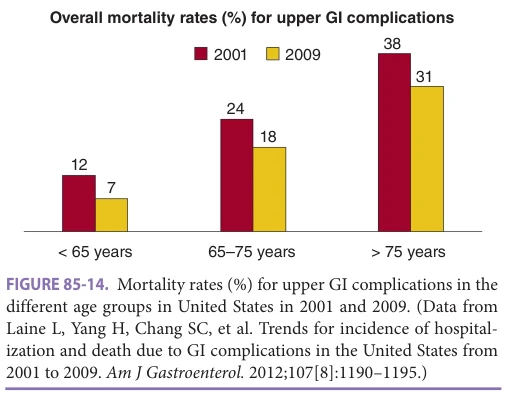

*FIGURE 85-14. Mortality rates (%) for upper GI complications in the different age groups in United States in 2001 and 2009. (Data from Laine L, Yang H, Chang SC, et al. Trends for incidence of hospital- ization and death due to GI complications in the United States from 2001 to 2009. Am J Gastroenterol. 2012;107[8]:1190–1195.)*

levels, enhancing the risk of GI mucosal damage, has been reported as a potential factor influencing the ulcerogenic effect of the different NSAIDs.

Presentation In older adults, PUD is often difficult to diagnose, as symptoms may be atypical. The patient’s concomitant diseases and treatments may cause symptoms that mask those of the ulcer. In patients older than 60 years, only one-third suffered from typical epigastric pain, and twothirds experienced vague abdominal pain as a main symptom. Moreover, the intensity of pain may be less severe in older subjects and therefore may not receive the full attention of the physician or may not be taken seriously by the patient. Frequently, symptomatology includes nausea, vomiting, weight loss, and/or anorexia as the first, or even the only, symptom of PUD in older adults. Unfortunately, the first symptom might be a severe complication, especially bleeding or stenosis. Because of the insidious clinical presentation of the disease in older patients, the

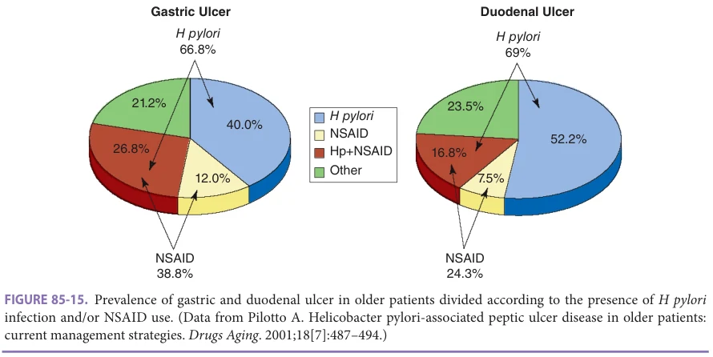

*FIGURE 85-15. Prevalence of gastric and duodenal ulcer in older patients divided according to the presence of H pylori infection and/or NSAID use. (Data from Pilotto A. Helicobacter pylori-associated peptic ulcer disease in older patients: current management strategies. Drugs Aging. 2001;18[7]:487–494.)*

**[p. 1327]**

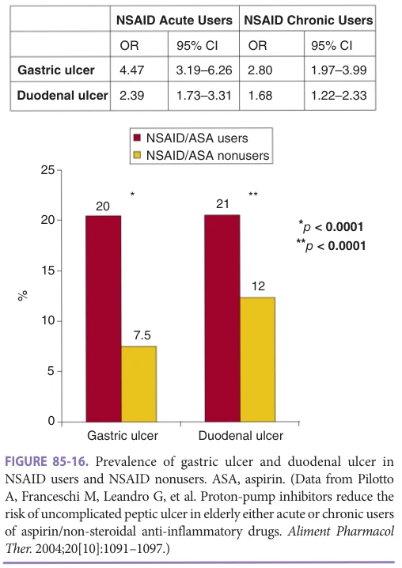

*FIGURE 85-16. Prevalence of gastric ulcer and duodenal ulcer in NSAID users and NSAID nonusers. ASA, aspirin. (Data from Pilotto A, Franceschi M, Leandro G, et al. Proton-pump inhibitors reduce the risk of uncomplicated peptic ulcer in elderly either acute or chronic users of aspirin/non-steroidal anti-inflammatory drugs. Aliment Pharmacol Ther. 2004;20[10]:1091–1097.)*

consequences of PUD are more serious than those in younger subjects.

Evaluation Upper GI endoscopy is always indicated for older subjects with new abdominal symptoms because of the high prevalence of serious gastric diseases in this age group. Upper GI endoscopy is safe and well tolerated in older adults. By direct visual identification, the location and size of an ulcer can be described. Peptic ulcer is a round to oval mucosal defect, from 5 mm to even 4 cm in diameter, with a smooth base and perpendicular borders. A series of biopsies to exclude malignancy is mandatory both in the center and on the borders of the gastric ulcer, even if they are not elevated or irregular as in ulcerative forms of advanced gastric cancer. Gastric biopsies allow for identifying the presence and the severity of chronic gastritis and/or the presence of H pylori infection. Endoscopic healing is the gold standard for evaluating treatment success in clinical trials. The surrounding mucosa may present radial folds, as a consequence of the parietal scarring.

Barium radiography of the stomach and duodenum is indicated as part of second-line evaluation of the patient with suspected motility disorders, peptic strictures, or fistulas in which gastrografin may be used as an alternative to barium in contrast studies. Radiography is contraindicated

in the presence of bleeding, severe vomiting with a high risk of pulmonary aspiration, or in cases of suspected gastric or duodenal perforation. If a peptic ulcer perforates, air will leak from the inside of the gastrointestinal tract to the peritoneal cavity. This leads to “free gas” within the peritoneal cavity that may be observed underneath the diaphragm on an erect or supine lateral abdominal x-ray.

Testing for H pylori infection Helicobacter pylori infection may be diagnosed by means of either histology evaluation, rapid urease test, or culture performed on gastric biopsies taken during endoscopy (Table 85-5). However, the biopsy site needs to be selected with care, since H pylori may only be found in the fundus or body and not in the antral mucosa of older patients who are taking antisecretory drugs. Moreover, the presence of chronic atrophic gastritis as a result of a past colonization of H pylori may be associated with a lower prevalence of the bacterium in the gastric biopsy specimens in older than in younger patients. For the same reasons, the rapid urease test performed on gastric biopsies has lower sensitivity in subjects 60 years and older compared with younger patients.

The presence and severity of histologically proven gastritis can be investigated through the histological evaluation of morphological parameters of the gastric mucosa at two sites. All these findings suggest that in older adults (1) it is advisable to perform gastric biopsies from both the antrum and the body of the stomach; and (2) a second test for H pylori should be performed in this age group if a urease-based or histologic test is negative.

Posttreatment H pylori evaluation Successful eradication should always be confirmed by a noninvasive or an invasive test if endoscopy is clinically indicated. Older patients with a diagnosis of peptic ulcer (especially gastric ulcer), gastric mucosa-associated lymphoid tissue, lymphoma, or severe gastritis should be evaluated by endoscopy and gastric mucosal histology after completion of anti-H pylori therapy. Most experts agree that this evaluation must be carried out at least 1 month after completion of therapy in order to minimize false-negative results. Older patients with mild or moderate forms of chronic gastritis may be evaluated after therapy by a noninvasive test. The 13C-urea breath test demonstrated higher sensitivity, specificity, and diagnostic accuracy than serology (IgG anti-H pylori antibodies) in older subjects. An H pylori–stool antigen (HpSA) test for the detection of H pylori has been suggested as a valuable option with a high-potential role in the diagnosis after eradication therapy. In hospitalized frail older patients, the HpSA was less accurate than the 13C-urea breath test, while antibiotic therapy and corpus atrophy decreased the positivity rate.

Other noninvasive tests Serum pepsinogen I and II levels (sPGI, sPGII), which are biomarkers of inflammation, are known to increase in the presence of H pylori-related nonatrophic gastritis. sPGII levels are higher in subjects with both gastric and duodenal ulcer, and levels correlate with the

**[p. 1328]**

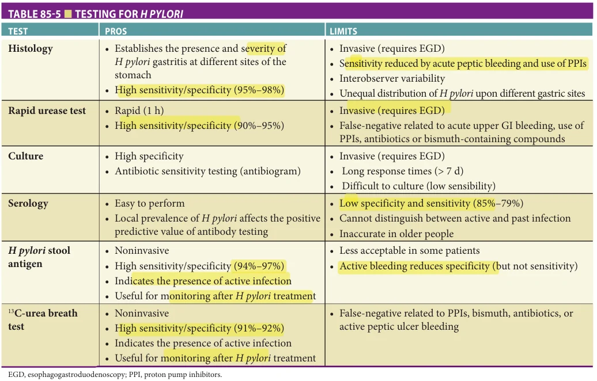

*TABLE 85-5 ■ TESTING FOR H PYLORI*

severity of inflammation. A study in older people reported that sPGII levels decreased significantly after a successful H pylori cure. Moreover, sPGI or the ratio of sPGI/sPGII measurements may be useful to identify atrophic gastritis of the gastric corpus. Assays for gastrin (particularly gastrin-17) could be an indicator of the morphological status of the antral mucosa.

## Management

Eradication of H pylori infection There is currently a worldwide consensus that the first-line therapy for eradication of H pylori infection should be triple therapy with a PPI twice daily combined with clarithromycin 500 mg twice daily and amoxicillin 1 g twice daily or nitroimidazole 500 mg twice daily for a minimum of 7 days. The cumulative results of clinical trials evaluating anti-H pylori therapies in older subjects confirmed that PPI-based triple therapies for 1 week were highly effective and well tolerated. Adverse event rates of less than 13% were reported, with less than 6% of patients discontinuing therapy owing to these effects (Table 85-6). In older patients, a reduction of the dosage of the PPI from a twice to once daily standard dose did not influence cure rates of the PPI-triple therapies. Since aging may modify the pharmacokinetic distribution of clarithromycin, independent of renal function, clinical trials evaluated the efficacy of PPI-based triple therapies including clarithromycin at a low dose of 250 mg twice daily in older patients. Results demonstrated no significant differences in

cure rates and tolerability between clarithromycin 250 mg versus 500 mg twice daily. All these findings suggest that in older patients, 1-week PPI-based triple therapies should include low doses of both PPIs and clarithromycin, in combination with standard doses of either amoxicillin or a nitroimidazole, to obtain excellent cure rates and tolerability. Increasing the duration of treatment from 7 days to 14 days is associated with higher eradication rates. At present, however, no studies have evaluated the clinical usefulness of these 2-week triple therapy regimens specifically in older patients. Studies of a 10-day sequential regimen of 5 days of PPI plus amoxicillin followed by five additional days with PPI plus clarithromycin and tinidazole have reported higher eradication rates in comparison with standard triple therapy in both geriatric and adult patients.

Low compliance and antibiotic resistance are the two major reasons for treatment failure. Primary resistance to amoxicillin remains uncommon, but the frequency of clarithromycin resistance has reached rates above 70% in some countries including China, nearly 50% in Portugal and Iran, and approximately 16% in the United States. Metronidazole resistance ranges between 20% and 30%, and is more frequent among women and in developing countries. Consensus exists in using clarithromycin and metronidazole for H pylori eradication therapies when prevalence of antibiotic resistance is lower than 15% and 40%, respectively.

Because failure of therapy is often associated with secondary antibiotic resistance, retreatment should ideally

**[p. 1329]**

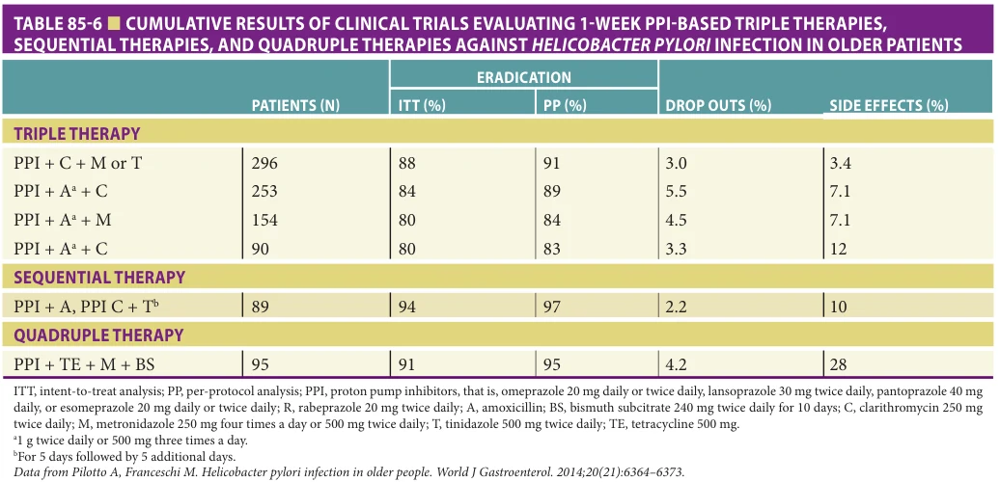

*TABLE 85-6 ■ CUMULATIVE RESULTS OF CLINICAL TRIALS EVALUATING 1-WEEK PPI-BASED TRIPLE THERAPIES, SEQUENTIAL THERAPIES, AND QUADRUPLE THERAPIES AGAINST HELICOBACTER PYLORI INFECTION IN OLDER PATIENTS*

be guided by data on susceptibility. Since such information is often unavailable, the choice of a second-line treatment depends on which treatment was used initially. Indeed, eradication of H pylori infection is more difficult when a first treatment attempt has failed, and the optimal strategy for retreatment has not yet been established in older patients. Thus, specialist referral should be made in this situation.

NSAID-related PUD

Drug Treatment NSAID- or aspirin-associated peptic ulcers usually heal after 4 to 8 weeks of treatment with a PPI. Healing rates are higher if NSAID or aspirin treatments are stopped. Presently, no consensus exists on the clinical usefulness of maintenance therapy with antisecretory drugs in patients who stopped NSAID or aspirin treatment after healing an NSAID-related peptic ulcer.

Prevention The following strategies have been suggested to prevent NSAID- or aspirin-related gastroduodenal peptic ulcer in older adults (Figure 85-17).

Identifying high-risk patients (multidimensional assessment). Current strategies to reduce ulcer relapse and/or complications are considered cost-effective in high-risk patients. Great importance is placed, therefore, on defining those patients who are at high risk for peptic ulcer and its complications when they are treated with gastro-damaging drugs. A history of upper GI symptoms, PUD, and/or bleeding; the presence of multimorbidity and concomitant medications, particularly oral steroids, antiplatelet drugs, antithrombotic therapies (ie, low-molecular-weight heparins), and oral anticoagulants increase the risk of NSAID-related PUD and its complications. Moreover, functional and cognitive impairment, malnutrition, immobilization, and social factors, that is, the main determinants of multidimensional

frailty, may negatively influence the outcomes and trajectories of drug-related PUD and its complications. Thus, a comprehensive geriatric assessment may be useful in the evaluation of the multidimensional risk of older patients.

Reduce dosage and use of less GI-toxic NSAIDs. The risk of peptic ulcer and its complications appears to be directly related to the dose of the given NSAID or coxib. Lower risk of upper GI damage has been reported with NSAIDs with a short plasma half-life versus those with a prolonged plasma halftime. Furthermore, slow-release formulations present an augmented risk of ulcer complications.

Co-treatment with gastroprotective drugs. Misoprostol and PPIs are more effective than H2-blockers in preventing severe gastric and duodenal damage. However, misoprostol administered at effective doses of 200 μg four times daily has higher adverse effects, particularly diarrhea, than PPIs. PPIs are very effective in preventing gastroduodenal injuries in both acute and chronic older users of NSAIDs (Figure 85-18). Similarly, PPIs prevent PUD and its complications in older patients treated with low-dose aspirin as antiplatelet therapy, independent of the presence of H pylori infection.

Eradication of H pylori infection. NSAID use and H pylori infection are independent risk factors for PUD and gastroduodenal bleeding in older subjects. In H pylori–positive patients who are starting long-term treatment with NSAIDs, the cure of H pylori infection reduces the 6-month risk of PUD. In older high-risk patients, however, the use of PPIs concomitantly with the NSAID reduces the occurrence of both acute and chronic NSAID-related gastroduodenal damage more effectively than the eradication of H pylori infection alone. Moreover, after the eradication of H pylori, maintenance treatment with a PPI is effective in the prevention of ulcer bleeding in older patients. All these findings suggest

**[p. 1330]**

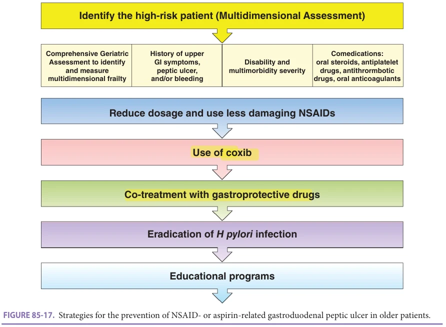

*FIGURE 85-17. Strategies for the prevention of NSAID- or aspirin-related gastroduodenal peptic ulcer in older patients.*

that H pylori eradication may be a useful strategy to prevent NSAID-related peptic ulcer. Consequently, H pylori infection should be tested for and treated in older people in whom prolonged NSAID use is anticipated.

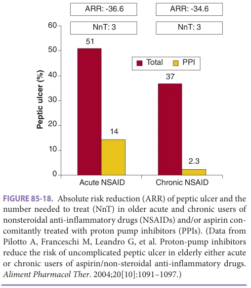

*FIGURE 85-18. Absolute risk reduction (ARR) of peptic ulcer and the number needed to treat (NnT) in older acute and chronic users of nonsteroidal anti-inflammatory drugs (NSAIDs) and/or aspirin con- comitantly treated with proton pump inhibitors (PPIs). (Data from Pilotto A, Franceschi M, Leandro G, et al. Proton-pump inhibitors reduce the risk of uncomplicated peptic ulcer in elderly either acute or chronic users of aspirin/non-steroidal anti-inflammatory drugs. Aliment Pharmacol Ther. 2004;20[10]:1091–1097.)*

Educational programs. A crucial strategy in the prevention of NSAID-related adverse events is the discontinuation of NSAID therapy. Indeed, studies from Canada and the United States reported an estimated 37% to over 50% of unnecessary, that is, inappropriate, NSAID prescriptions in older patients with osteoarthritis. Active interventions to improve appropriateness of drug prescription, particularly in older adults, demonstrated a reduction in NSAID prescriptions. For example, a significant reduction in rehospitalization rates for PUD as well as mortality rates within 1 year was observed in older subjects who participated in a quality improvement project in the United States that involved counseling of patients and their caregivers about NSAID toxicity.

Non-NSAID, non–H pylori PUD Antisecretory therapy remains the cornerstone of treatment to promote ulcer healing. Standard doses of PPIs should be prescribed at least for 4 weeks in patients with duodenal ulcers and for 8 weeks in patients with gastric ulcers. Generally, patients respond well to these therapies, and no established evidence supports the need for a longer duration or higher dose of antisecretory therapy in uncomplicated idiopathic ulcer. Older nonresponders should be investigated for any possible underlying pathophysiology, including medication noncompliance, acid hypersecretory state, or use of damaging drugs. Noninvasive evaluation of gastric function tests and referral to a specialist in gastroenterology are advised in case of H pylori-unrelated, persistent ulcers unresponsive to optimized PPI treatment.

**[p. 1331]**

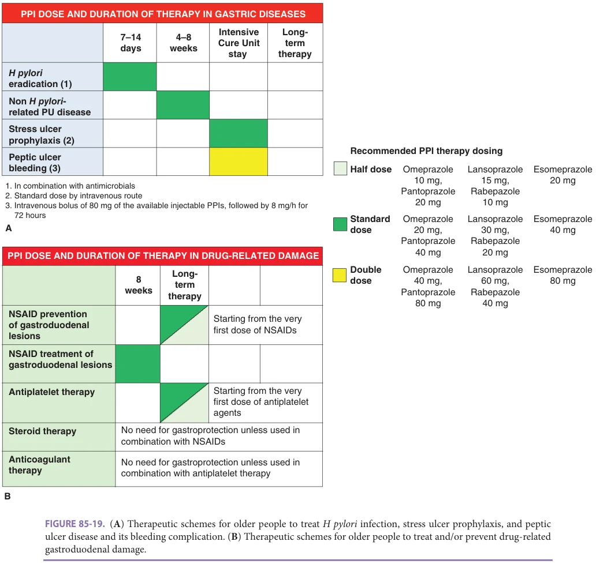

*FIGURE 85-19. (A) Therapeutic schemes for older people to treat H pylori infection, stress ulcer prophylaxis, and peptic ulcer disease and its bleeding complication. (B) Therapeutic schemes for older people to treat and/or prevent drug-related gastroduodenal damage.*

Figures 85-19A and B summarize the therapeutic schemes for older people with PUD and its bleeding complication and drug-related gastroduodenal damage.

## UPPER GASTROINTESTINAL BLEEDING

Definition Upper gastrointestinal bleeding (UGIB) is defined as bleeding derived from a source proximal to the ligament of Treitz, and can be categorized as variceal or nonvariceal hemorrhage. UGIB can be classified as acute (presenting with hematemesis, melena and/or hematochezia) or chronic, suspected because of the detection of occult gastrointestinal blood loss or anemia.

Epidemiology There has been a decrease in both the incidence and mortality rates due to UGIB across all age groups in the United States. However, UGIB remains a significant cause of hospital admission and mortality in older subjects. Indeed, the rates of admission for acute UGIB increase 30-fold between the third and ninth decades, and 70% of acute UGIB episodes occur in subjects older than 60 years. Moreover, in older US residents, the risk of hospitalization for UGIB is associated with age above 80 years, limited instrumental activities of daily living, multiple comorbidities, and polypharmacy.

The mortality of patients who present with variceal hemorrhage has historically exceeded 30%, but

**[p. 1332]**

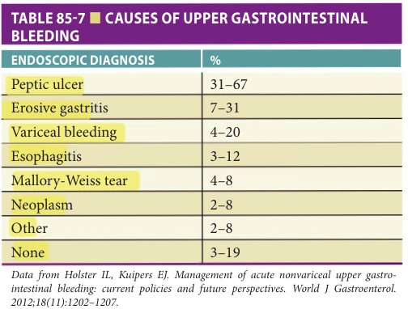

*TABLE 85-7 ■ CAUSES OF UPPER GASTROINTESTINAL BLEEDING*

has decreased over time, possibly as a result of advances in medical and endoscopic therapy; however, these data come from cohorts of patients with a mean age well below 65 years, and extensive data about older patients with variceal bleeding are lacking.

Pathophysiology UGIB can be caused by peptic ulcers, gastric erosions, esophageal varices, and other causes such as gastric cancer (Table 85-7).

Peptic ulcer disease PUD is the most frequent cause of major, life-threatening acute UGIB. Significant hemorrhage results from erosion of an underlying artery, and the magnitude of bleeding is related to the size of the arterial defect and the diameter of the artery. Consequently, bleeding may be particularly severe from large posterior duodenal ulcers which erode the gastroduodenal artery as well as from lesser curve gastric ulcers involving branches of the left gastric artery.

The high incidence of acute UGIB in older people has been attributed to many factors, including an increase in the use of NSAIDs as well as a high prevalence of upper GI disorders including GERD and PUD. Moreover, advanced age has been consistently identified as a risk factor for mortality among patients presenting with UGIB, presumably because of the high prevalence of frailty, comorbid illnesses, and polypharmacy in older adults as compared with younger patients.

Esophageal varices and portal hypertensive gastropathy Esophageal and gastric varices are caused by increased venous collateral flow from the portal circulation through the gastric coronary veins, usually because of portal hypertension. Variceal hemorrhage can occur when the hepatic venous pressure gradient exceeds 12 mm Hg. Features predictive of variceal hemorrhage include large variceal size and the presence of red “wale” marks on varices. The vessels may leak blood or even rupture, causing life-threatening bleeding. Portal hypertensive gastropathy results from venous congestion of the gastric

mucosa; in most patients, this is caused by portal hypertension from cirrhosis.

Esophagitis and erosive gastritis These are superficial mucosal injuries in the esophagus and stomach, respectively. These lesions are most commonly caused by hypersecretion of gastric acid and/or erosive medications, such as NSAIDs and alendronate (see GERD section).

Mallory-Weiss tears These occur at the esophagogastric junction and are due to prolonged retching. Alcohol abuse is the usual cause, but other causes including vomiting (eg, chemotherapy, digoxin toxicity, renal failure, advanced malignancy) may be responsible. Bleeding usually stops spontaneously, and active endoscopic or surgical intervention is seldom required.

Presentation Hematemesis, bloody gastric aspirate, or melena usually indicates bleeding from the upper GI tract. Older people with UGIB may have specific aspects of clinical presentation that need a comprehensive clinical approach. Indeed, an UGIB may initially present with symptoms such as light-headedness, syncope, or postural hypotension; neurologic symptoms including transient ischemic attack and/ or stroke; cardiovascular symptoms, including ischemic heart disease; or even a delirium episode or behavioral disorders due to the UGIB-related acute anemia or hypotension. These general symptoms are more frequent in frail, comorbid, and multitreated older subjects.

Evaluation The initial evaluation of the older patient presenting with features of acute UGIB includes a complete medical history, physical examination, and laboratory assessment including serum electrolyte and coagulation parameters, liver biochemical tests, and a complete blood count with the goal of assessing the severity of the bleeding. Details should be documented of prior UGIB episodes, previous abdominal surgery and current medication use, particularly aspirin, NSAIDs and oral anticoagulants, that is, warfarin or the newer oral anticoagulants (NOACs). Life-threatening peptic ulcer bleeding, with all-cause mortality rates as high as 12%, has been observed in patients on NOACs, especially in the presence of comorbidities such as coronary artery disease, stroke, peripheral vascular disease, and heart failure. High-dose dabigatran (150 mg bid), rivaroxaban, and high-dose edoxaban (60 mg daily) are associated with a higher risk of UGIB than warfarin. Other risk factors for NOAC-related UGIB include concomitant use of ulcerogenic agents, older age, renal impairment, H pylori infection, and previous history of UGIB. UGIB in cirrhotic patients has a nonvariceal origin in over 50% of cases. Physical findings of chronic liver disease are suggestive of underlying portal hypertension.

Upper GI endoscopy has three main purposes: (1) to provide an accurate diagnosis, (2) to give prognostic

**[p. 1333]**

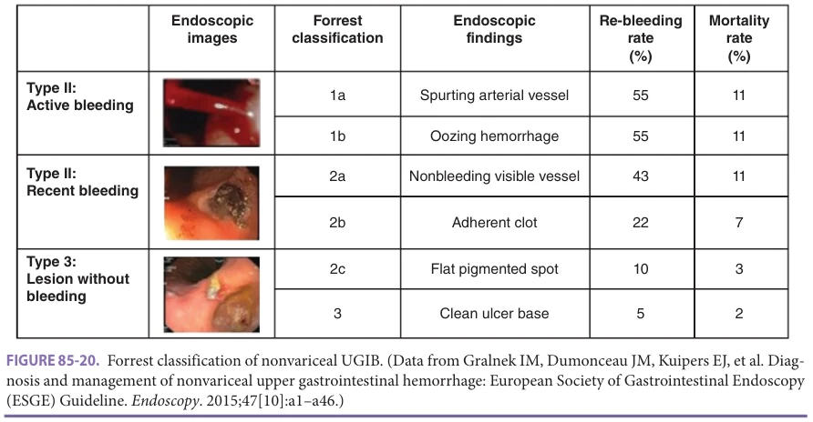

*FIGURE 85-20. Forrest classification of nonvariceal UGIB. (Data from Gralnek IM, Dumonceau JM, Kuipers EJ, et al. Diag- nosis and management of nonvariceal upper gastrointestinal hemorrhage: European Society of Gastrointestinal Endoscopy (ESGE) Guideline. Endoscopy. 2015;47[10]:a1–a46.)*

information, and (3) to carry out endoscopic therapy. Early endoscopic examination allows precise identification of the site and nature of the bleeding, and provides prognostic information. Indeed, stigmata of recent hemorrhage, according to endoscopy Forrest classification, predict risk of further bleeding and guide management decisions (Figure 85-20).

Endoscopy performed within 24 to 48 hours from the bleeding episode reveals an actual or potential site of bleeding in the majority of patients; 15% to 30% of all lesions are actively bleeding at the time of endoscopy. In any case, endoscopy should not be carried out until the patient is adequately resuscitated and in stable clinical conditions. Routine second-look endoscopy, in which repeated endoscopy is performed 24 hours after initial endoscopic hemostatic therapy, is not recommended. A second-look endoscopy however should be performed in patients with clinical evidence of recurrent bleeding.

## Management

General management Hemodynamic status should be assessed immediately upon presentation and resuscitative measures begun as needed. Blood transfusions should always be carried out with hemoglobin levels less than or equal to 8 g/dL. In older patients with higher hemoglobin levels, blood transfusions should be performed when clinical evidence of intravascular volume depletion or severe comorbidities, such as coronary artery disease, pulmonary diseases, and renal insufficiency, are present. Risk assessment should be performed to stratify patients into higher and lower risk categories, which may assist in initial decisions such as timing of endoscopy, time of discharge, and level of care.

Peptic ulcer bleeding The best management of acute bleeding ulcer includes a combination treatment with endoscopy

(eg, bipolar electrocoagulation, heater probe, clips, and/or injection of sclerosant or vasoactive drugs) and intravenous PPI with a bolus followed by continuous infusion. These treatments reduce the rates of rebleeding and surgical interventions, but short- and long-term mortality rates are not reduced (Table 85-8). Endoscopic therapy for peptic ulcer hemorrhage seems to be well tolerated in older adults.

Pre-endoscopic PPI (80 mg omeprazole or pantoprazole bolus followed by 8 mg/h infusion) seems to decrease the need for endoscopic therapy but does not improve the final clinical outcome. After successful endoscopic hemostasis, continuous intravenous PPI therapy for 72 hours should be administered to patients who have an ulcer with active bleeding, a nonbleeding visible vessel, or an adherent clot. However, a meta-analysis found that oral and IV PPIs have similar efficacy after endoscopic treatment in controlling recurrent bleeding, the requirement for surgery, and mortality in patients with peptic ulcer bleeding. Thus, oral PPIs may be a useful and cost-saving alternative.

Recurrent bleeding after endoscopic therapy is treated with a second endoscopic treatment; if bleeding persists or recurs, treatment with surgery or interventional radiology is undertaken. In case of NOAC-related UGIB, initial management includes withholding the anticoagulant, followed by delayed endoscopic treatment. In severe bleeding, additional measures include the use of specific reversal agents such as idarucizumab for dabigatran and andexanet alfa for factor Xa inhibitors (rivaroxaban, apixaban, edoxaban), and urgent endoscopic management.

Variceal bleeding Endoscopic variceal band ligation has supplanted injection sclerotherapy under endoscopy, due to a lower rate of complications. The use of nonselective β-blockers seems to be effective for primary prophylaxis of variceal hemorrhage; however, older patients should be monitored closely for adverse effects, which include

**[p. 1334]**

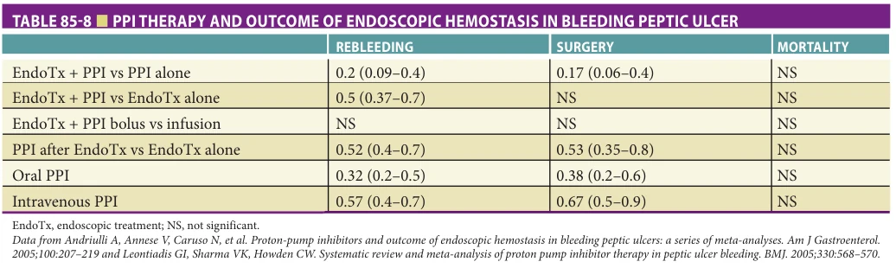

*TABLE 85-8 ■ PPI THERAPY AND OUTCOME OF ENDOSCOPIC HEMOSTASIS IN BLEEDING PEPTIC ULCER*

orthostasis, fatigue, and affective disturbance. Vasoactive drugs (somatostatin or its analogue, octreotide; vasopressin or its analogue, terlipressin) should be initiated as soon as variceal hemorrhage is suspected. Selected patients at high risk of liver failure or rebleeding may be considered for an “early” (within 72 hours) trans-jugular intrahepatic portosystemic shunt (TIPS). However, TIPS placement for control of variceal bleeding may be associated with higher mortality and hospitalization rates in older compared to younger patients. Thus, the decision regarding use of TIPS should be made in consultation with a gastroenterologist.

UGIB in patients affected by portal hypertensive gastropathy is usually chronic and occult rather than overt and hemodynamically significant. Reduction of portal venous pressure with a nonselective β-blocker might be beneficial for these patients; however, the data to support this indication are limited, especially in older subjects.

Prognostic evaluation of the older patient with UGIB Early stratification of patients into groups with different risk of rebleeding and mortality may be useful to support clinicians in the management of UGIB and in the choice of the most appropriate treatment, that is, medical, endoscopic, or surgical interventions. Indeed, prognostic scores have been developed that include endoscopy-based analysis of bleeding lesions, preendoscopic clinical scores, and combined clinical and endoscopic evaluation.

The Forrest classification is an endoscopy-based tool useful to stratify patients with UGIB into high- and lowrisk categories for mortality and rebleeding, and it has been used to evaluate the endoscopic intervention modalities.

It is increasingly evident, however, that the prognosis of older patients with UGIB is strongly affected by a multiplicity of factors, including functional status, cognition, nutrition, multimorbidity, and polypharmacy, which are not directly related to the UGIB itself, suggesting that any prognostic model for these patients should be multidimensional in nature. Three such models are described below and a summary is provided in Table 85-9.

The Glasgow-Blatchford score (GBS) is a screening tool to assess the likelihood that a patient with UGIB will need blood transfusion or endoscopic intervention. A score

of 0 identifies low-risk patients who might be suitable for outpatient management; a patient with a GBS greater than 0 is considered at high risk, and should receive clinical evaluation and surveillance.

The Rockall score (RS) categorizes patients into risk groups. Patients with clinical RS (ie, before endoscopy) greater than 0 and patients with complete RS (ie, after endoscopy) greater than 2 are considered to be at intermediate or high risk for developing recurrent bleeding and death.

The Multidimensional Prognostic Index (MPI) is a prognostic tool based on a standard comprehensive geriatric assessment that predicts short- and long-term mortality in older subjects. As shown in Table 85-9, the MPI values range from 0 (low risk) to 1 (severe risk of mortality). The MPI can also be expressed as three grades of risk. Patients with higher MPI grades have higher risk of in-hospital stay and institutionalization after hospital discharge.

## Prevention

Long-term prevention of recurrent bleeding peptic ulcers Prevention is based on the etiology of the bleeding ulcer. Patients with H pylori-associated, NSAID-associated, or idiopathic bleeding ulcers should receive therapy as outlined in the previous section. In patients who must resume NSAIDs, a COX-2–selective NSAID at the lowest effective dose plus daily PPI is recommended.

In patients with low-dose ASA-associated bleeding ulcers, the need for aspirin should be assessed. If given for secondary prevention (ie, established cardiovascular disease), aspirin should be resumed as soon as possible after bleeding ceases in most patients: ideally within 1 to 3 days and certainly within 7 days. Long-term daily PPI therapy should also be provided. If given for primary prevention (ie, no established cardiovascular disease), antiplatelet therapy likely should not be resumed in most patients.

Long-term prevention of recurrent variceal bleeding Although β-blockers have an established role as primary prophylaxis (ie, reducing the risk of variceal bleeding in patients who have never bled), their use as secondary prophylaxis (preventing variceal rebleeding) is not established, and

**[p. 1335]**

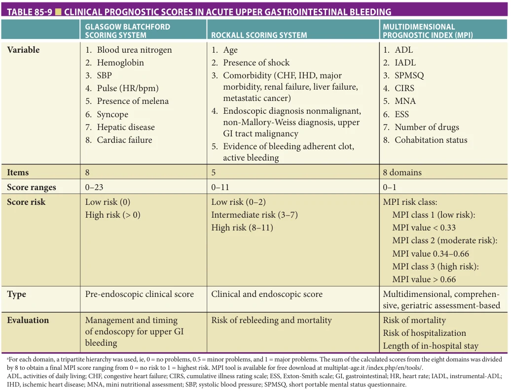

*TABLE 85-9 ■ CLINICAL PROGNOSTIC SCORES IN ACUTE UPPER GASTROINTESTINAL BLEEDING*

endoscopic variceal ablation by a program of repeated variceal banding is the treatment of choice.

## AUTOIMMUNE ATROPHIC GASTRITIS

Autoimmune atrophic gastritis (AAG) may be found during endoscopic evaluation of patients for PUD or UGIB. It is a chronic progressive inflammatory condition that results in the replacement of the normal cell mass by atrophic and metaplastic mucosa. It represents an insidious condition that may go undiagnosed for many years, especially in older people. AAG is more common in women than men (3:1 ratio). There is an age-related increase in the prevalence of AAG, from 2.5% in the third decade to 12% in the eighth decade. Although the trigger for this disease is incompletely understood, autoantibodies against parietal cells and against intrinsic factor result in achlorhydria and pernicious anemia, respectively. Diagnosis of AAG is based on the presence of mucosal atrophy of the gastric corpus/fundus in biopsy histological samples obtained during esophago-gastro-duodenoscopy. A composite serological test using serum levels of gastrin-17, pepsinogen I and II, and antibodies against H pylori has

been reported to be useful to identify AAG, demonstrating a negative predictive value of over 95% and a positive predictive value of above 95%. After serological diagnosis of atrophic gastritis, endoscopic evaluation with biopsy sample obtainment allows for exclusion of eventual neoplastic lesions, which are more frequent in patients with AAG.

AAG has been reported in approximately 20% to 30% cases of iron-deficiency anemia refractory to iron supplementation and vitamin B12 deficiency. Concerning clinical features of AAG, nearly half of subjects are asymptomatic, especially in the initial phases. However, when present, symptoms tend to be nonspecific and often misleading such as early satiety, postprandial fullness, and also reflux symptoms, most probably linked to nonacid reflux. Importantly, PPIs are frequently prescribed in these patients, representing a clear case of inappropriate prescription.

Once the diagnosis of AAG has been established, endoscopic surveillance is suggested at 3-year intervals, with the goal of early gastric cancer detection, and referral to a gastroenterologist for follow-up is recommended. Concomitant autoimmune diseases including thyroiditis and diabetes must be excluded, and parenteral supplementation of vitamin B12 must be ensured.

**[p. 1336]**

## FURTHER READING

Barkun AN, Almadi M, Kuipers EJ, et al. Management of

nonvariceal upper gastrointestinal bleeding: guideline recommendations from the International Consensus Group. Ann Intern Med. 2019;171:805–822. Boghossian TA, Rashid FJ, Thompson W, et al. Deprescrib-

ing versus continuation of chronic proton pump inhibitor use in adults. Cochrane Database Syst Rev. 2017; 3(3):CD011969. Costable NJ, Greenwald DA. Upper gastrointestinal bleed-

ing. Clin Geriatr Med. 2021;37(1):155–172. Coxib and Traditional NSAID Trialists’ (CNT) Collab-

oration, Bhala N, Emberson J, Merhi A, et al. Vascular and upper gastrointestinal effects of non-steroidal anti-inflammatory drugs: meta-analyses of individual participant data from randomised trials. Lancet. 2013;382:769–779. Deutsch D, Romegoux P, Boustière C, et al. Clinical and

endoscopic features of severe acute gastrointestinal bleeding in elderly patients treated with direct oral anticoagulants: a multicentre study. Therap Adv Gastroenterol. 2019;12:1756284819851677. Kamada T, Satoh K, Itoh T, et al. Evidence-based clin-

ical practice guidelines for peptic ulcer disease 2020. J Gastroenterol. 2021;56(4):303–322.

Kurin M, Fass R. Management of gastroesophageal reflux

disease in the elderly patient. Drugs Aging. 2019;36(12): 1073–1081. Malfertheiner P, Megraud F, O’Morain CA, et al. European

Helicobacter and Microbiota Study Group and Consensus panel. Management of Helicobacter pylori infectionthe Maastricht V/Florence Consensus Report. Gut. 2017;66(1):6–30. Mishuk AU, Chen L, Gaillard P, et al. National trends in

prescription proton pump inhibitor use and expenditure in the United States in 2002-2017. Science Pract Res. 2021;61(1):87–94. Pilotto A, Custodero C, Maggi S, et al. A multidimensional

approach to frailty in older people. Ageing Res Rev. 2020; 60:101047. Pilotto A, Franceschi M. Helicobacter pylori infection in

older people. World J Gastroenterol. 2014;20:6364–6373. Tursi A, De Bastiani R, Franceschi M, et al. Non-invasive

assessment of gastric secretory function in centenarians. Geriatric Care. 2017;3:6682. Yamasaki T, Hemond C, Eisa M, et al. The changing epi-

demiology of gastroesophageal reflux disease: are patients getting younger? J Neurogastroenterol Motil. 2018;24(4):559–569.
