# Hazzard's Geriatric Medicine and Gerontology, 8e - Chapter 86: Hepatic, Pancreatic, and Biliary Diseases

Dylan Stanfield, Mark Benson, Michael R. Lucey

> **Status.** Fast build from the book; not lane-reviewed.

> Cited in the 2020-22 past papers (Hazzard 7e, linked by chapter).

> **Source and method.** Printed pages 1337-1352, from the marked 8th-edition copy (PDF page = printed page + 34). Prose follows its text layer; tables and figures are source-page crops. The book is canonical.

**[p. 1337]**

## INTRODUCTION

The liver and pancreas are remarkable in their ability to preserve function despite advanced age. Older patients are at an increased risk of more severe hepatic injury when exposed to hepatic insults. This increased risk is likely related to the liver’s age-related decrease in regenerative capacity. The aging pancreas can alter its morphology and function, but often times this can be asymptomatic in the older individual. Throughout this chapter we will review the hepatobiliary and pancreatic changes that are known to occur with aging and their pathologic consequences of disease in older patients.

#### Learning Objectives

- Learn aging-associated changes in hepatic function, epidemiology, genetics, pathogenesis, and pathology of common hepatic diseases in older adults.

- Understand the prevalence, common clinical presentations, diagnosis, and treatment of hepatotropic viruses, autoimmune liver diseases, chronic fatty liver diseases, and drug-induced injury in older patients.

- Appreciate the challenges older persons encounter when living with chronic liver disease, including consideration of liver transplantation in older adults.

- Learn the epidemiology, genetics, etiology, and pathogenesis of common biliary and pancreatic diseases in older adults.

- Understand the common and atypical manifestations, and tests to diagnose common gallbladder and pancreatic diseases in older patients.

- Learn state-of-the-art and emerging treatments for biliary and pancreatic disorders in older population.

- Acquire knowledge about the symptoms, diagnosis, and treatment of gallbladder and pancreatic cancers in older adults.

#### Key Clinical Points

1. Older adults are more prone to hepatic injury due to aging-associated changes, including a reduction in regenerative capacity, functional hepatocyte volume, and hepatic blood flow.

2. Patients with metabolic syndrome are at high risk for developing nonalcoholic fatty liver disease (NAFLD).

3. Drug-induced liver injury occurs more frequently in older patients and tends to be more severe.

4. Chronic fatty liver diseases, alcohol-related and non-alcohol-related, are the two most (Continued)

As will be discussed multiple times in this chapter, most of the therapies available for younger patients are safe and appropriate for use in the geriatric population. However, older patients with advanced pancreatic, liver, or biliary disease may not be eligible for curative treatments in some circumstances. For example, due to comorbid disease, few patients older than 70 years meet entry criteria for liver transplantation. Similarly, geriatric patients with newly diagnosed neoplasms of the pancreas or hepatobiliary system may not tolerate the extensive surgery that may be appropriate in a younger patient. Palliative care for patients with advanced pancreatic and hepatobiliary disease has become a well-recognized subspecialty and provides valuable therapies and counseling to alleviate suffering near the end of life.

## LIVER DISEASE

### Liver Morphology

For a number of years, liver volume was thought to decrease with age. More recently, it was determined that liver volume remains unchanged over time when adjusting for body surface area. Tagged albumin scans have shown that while corrected liver volume remains constant with age, functional hepatocyte volume decreases significantly. There is also a contemporaneous decrease in hepatic blood flow by approximately 35% to 40%. The cause of decreased blood flow is likely multifactorial—as a result of changes in cardiovascular output, diminished splanchnic blood flow, reduced portal vein blood flow, and increased resistance to

**[p. 1338]**

common causes of end-stage liver disease in older patients in the developed world. The advent of direct-acting antiviral agents for the treatment of hepatitis C virus (HCV) has changed the landscape of chronic liver disease.

5. Age is a major risk factor for gallstones,

which are more common among older adults, especially women.

6. Acute cholecystitis may present atypically

in older patients without fever, nausea, vomiting, or severe abdominal pain.

7. Ultrasound is the initial diagnostic test of

choice, and incidental discovery of gallstones is not an indication for treatment. When appropriate, early laparoscopic cholecystectomy is the treatment of choice in older patients.

8. In the absence of gallstones and alcohol use

disorder, the most common cause of acute pancreatitis in older adults is malignancy.

9. Alcohol use disorder is the most com-

mon cause of chronic pancreatitis in older patients.

10. The significance of alcohol use disorder in patients presenting with alcohol-related liver or pancreatic disease is frequently not recognized, and the opportunity to intervene with treatment of alcohol use disorder is missed.

portal flow. On the cellular level, both hepatocytes and the mitochondria of hepatocytes become hypertrophied, but decrease in overall number with age. Hepatocytes accumulate lipofuscin with age while undergoing a decrease in the concentration of smooth endoplasmic reticulum (SER), telomere length, and the activity of several liver microsomal enzymes.

### Liver Function

Despite the observed changes in functional hepatocyte volume and blood flow, age-related changes to hepatic function are less evident in clinical practice (Table 86-1). The capacity to sustain liver function during aging is reflected in the ability to successfully transplant livers from older deceased donors. Traditional liver chemistry tests, including serum aminotransferases, bilirubin, alkaline phosphatase, and gamma-glutamyl transpeptidase, do not change with age. Likewise, there are no significant changes in coagulation factors. Serum albumin slightly decreases with age, but typically remains within the normal range. Serum cholesterol

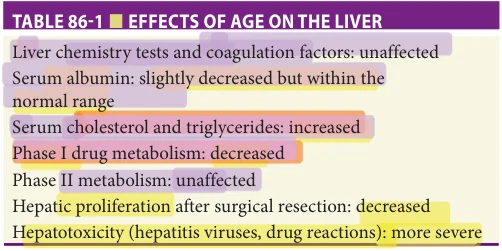

*TABLE 86-1 ■ EFFECTS OF AGE ON THE LIVER*

*Owner annotations/highlights are from the marked source copy, not the book.*

and triglycerides increase with age since there is a gradual decline in the metabolism of low-density lipoprotein (LDL) cholesterol.

There are age-related changes in the hepatic metabolism of certain medications, which is important since more than 30% of prescription drugs are prescribed to older men and women. The incidence of adverse drug reactions significantly increases with increasing age. Phase I drug metabolism relies on microsomal enzymes and results in metabolism by oxidation, reduction, demethylation, and hydrolysis. Phase II drug metabolism relies on cytosolic enzymes and results in metabolism by conjugation with several different polar ligands. Phase I reactions are usually catalyzed by the cytochrome P450 system in the hepatocyte SER. There is a significant decrease in the phase I metabolism of several medications by as much as 50% with increasing age. Interestingly, medications that undergo phase II metabolism remain unaffected by aging. The activity of phase I metabolism is dependent on oxygen delivery. Thus, some of the age-related decreases in phase I metabolism could be explained by decreased hepatic blood flow as well as by decreased SER concentration. Medications with known phase I metabolism should be started at a low dose and titrated slowly in order to circumvent the problems associated with adverse drug reactions in older patients (Table 86-2).

Another important aspect of the effects of aging on hepatic function is the diminished ability of the liver to

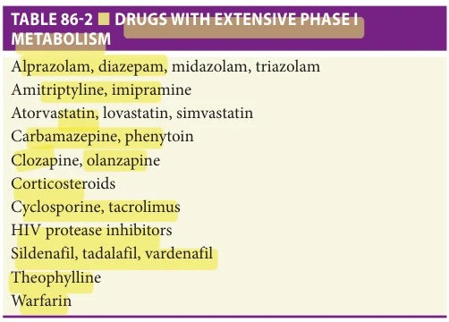

*TABLE 86-2 ■ DRUGS WITH EXTENSIVE PHASE I METABOLISM*

*Owner annotations/highlights are from the marked source copy, not the book.*

**[p. 1339]**

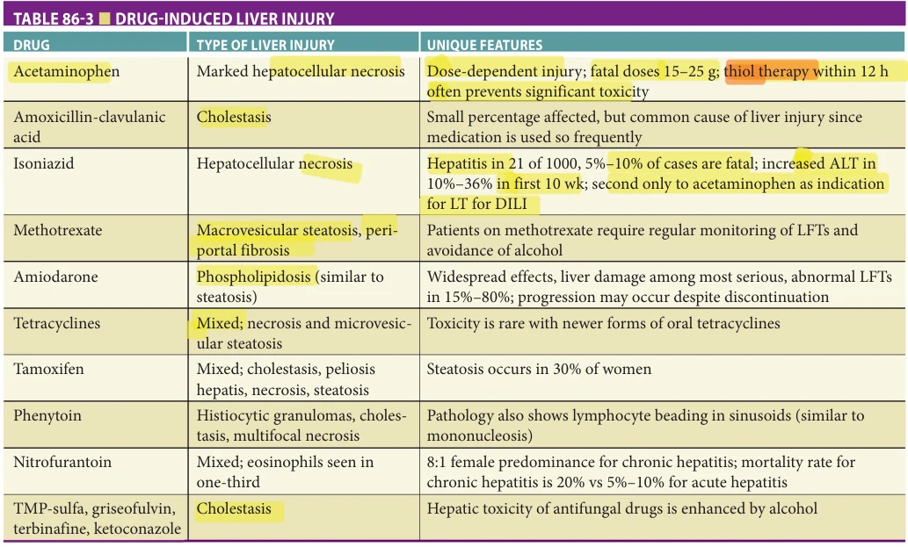

*TABLE 86-3 ■ DRUG-INDUCED LIVER INJURY*

*Owner annotations/highlights are from the marked source copy, not the book.*

ALT, alanine aminotransferase; DILI, drug-induced liver injury; LFT, liver function test; LT, liver transplantation; TMP, trimethoprim.

recover and regenerate in response to injury. There is an age-related proliferative decline in the rate at which partial living donor livers regenerate. Also, there is a higher mortality in older patients after partial hepatic resection. Lastly, the hepatotoxic effects of hepatitis viruses and medications like acetaminophen and amoxicillin-clavulanate are more pronounced in older adults. Drug-induced liver injury will be discussed later. Refer to Table 86-3 and Figure 86-1 for information on patterns of drug injury and pathology findings, respectively.

### Fatty Liver Disease

Nonalcoholic fatty liver disease Older persons have not been spared from the rising prevalence of obesity seen throughout the developed world. In 2010, the predicted prevalence of obesity in Americans, 60 years and older was 37%. This tsunami of obesity has gone hand in hand with rising prevalence of metabolic syndrome, which is comprised of systemic hypertension, insulin resistance, central adiposity, elevated BMI, and dyslipidemia. Patients with metabolic syndrome are at high risk for developing nonalcoholic fatty liver disease (NAFLD). NAFLD is defined as the presence of more than 5% hepatic steatosis on imaging or liver histology without evidence of steatohepatitis or fibrosis and after other causes of liver injury have been ruled out. A minority of patients with NAFLD have nonalcoholic steatohepatitis or NASH which is defined as the presence of greater than 5% hepatic steatosis plus inflammation with

hepatocyte injury. Whereas NAFLD without NASH is a relatively benign condition, NASH may progress to fibrosis and ultimately cirrhosis, portal hypertension, and liver failure. Patients with NASH may develop hepatocellular carcinoma (HCC), which is usually associated with cirrhosis, although NASH-associated HCC in the absence of cirrhosis does occur. In one cross-sectional multicenter study from the United States, when compared to younger patients with NAFLD, older NAFLD patients had a higher prevalence of NASH (56% vs 72%) and advanced fibrosis (25% vs 44%).

NAFLD and NASH have the same presentation in older and younger persons, often as elevated liver-related chemistries and increased fat observed on liver imaging in the setting of metabolic syndrome. The keys to evaluation are the exclusion of secondary causes of liver injury (eg, heavy alcohol use, drug-related, viral hepatitis, metabolic disease), and the discrimination of NASH from NAFLD without NASH. The latter determination can start with noninvasive testing based on blood tests such as the FIB-4 test, followed by estimates of liver fibrosis using elastography.

Patients with fibrosis in the NASH setting are candidates for therapy. In patients with metabolic syndrome and elevated BMI, weight loss is the most effective way to reverse fibrosis and improve liver chemistries. Although diet, exercise, and risk factor modification are widely advocated, they are difficult to accomplish. Weight loss of more than 10% improves insulin sensitivity and liver tests. Although not yet demonstrated unequivocally, weight

**[p. 1340]**

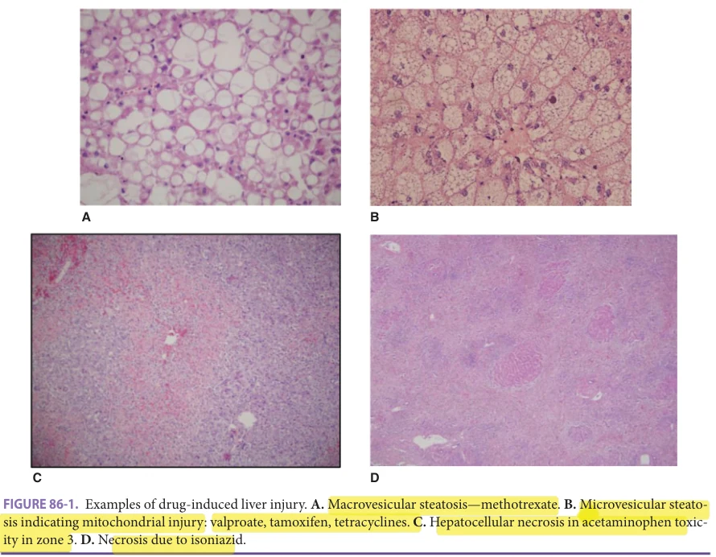

*FIGURE 86-1. Examples of drug-induced liver injury. A. Macrovesicular steatosis—methotrexate. B. Microvesicular steatosis indicating mitochondrial injury: valproate, tamoxifen, tetracyclines. C. Hepatocellular necrosis in acetaminophen toxicity in zone 3. D. Necrosis due to isoniazid.*

*Owner annotations/highlights are from the marked source copy, not the book.*

loss may also reverse fibrosis. Bariatric surgery is appropriate in selected patients with NASH-associated liver fibrosis.

NASH cirrhosis has become the second most common indication for liver transplantation in the United States, and the most common in women. The specific issues related to liver transplantation in older persons is discussed elsewhere.

Alcohol-associated liver disease Almost 50% of the adults older than 65 years and almost 25% of persons older than 85 years drink alcohol. Alcohol use disorder (AUD) in older persons has been called “the silent epidemic.” AUDs afflict 1% to 3% of older subjects and represent a cause of physical and psychiatric morbidity and social distress. In addition, up to 30% of older patients hospitalized in divisions of general medicine, and up to 50% of those hospitalized in psychiatric divisions present AUDs. Unfortunately, AUD is often underreported or even unrecognized in these clinical settings. Questionnaires such as AUDIT and AUDIT-C are simple tools that when used on a regular basis will greatly increase the recognition of underlying AUD.

Alcohol-associated liver disease (ALD) refers to a continuum of liver injury ranging from benign deposition of fat to cirrhosis, portal hypertension, and liver failure. In common with NAFLD, ALD causing cirrhosis is associated with HCC. In contrast with NAFLD, ALD may also present with an acute form of liver failure called alcoholic hepatitis. Alcoholic hepatitis is a syndrome of jaundice and

a systemic inflammatory reaction in the setting of recent consumption of alcohol. When severe, AH can result in multisystem organ failure (sometimes referred to as acute on chronic liver failure) and death.

Abstinence from alcohol is the sine qua non of all treatment of ALD. Unfortunately, ALD patients, whether younger or older, rarely receive formal treatment for AUD. Sustained abstinence can result in remarkable improvements in ALD, even after decompensating events such as ascites or variceal hemorrhage. Brief courses of corticosteroids offer a modest, albeit short-term, improvement for severe AH. ALD is the most common indication for liver transplantation in North America and Europe.

### Viral Hepatitis

Unvaccinated older adults are susceptible to viral hepatitis, which can cause severe illness. Key aspects of the different types of viral hepatitis are summarized in Table 86-4. This section will focus on the three most common types of viral hepatitis occurring in older people.

Hepatitis A Hepatitis A virus (HAV) is an RNA virus spread via fecal-oral transmission. Acute HAV infection is diagnosed by the demonstration of HAV IgM antibodies within the serum in symptomatic patients. As the acute illness resolves, anti-HAV IgG antibodies develop conferring lifelong immunity. With the development of improved

**[p. 1341]**

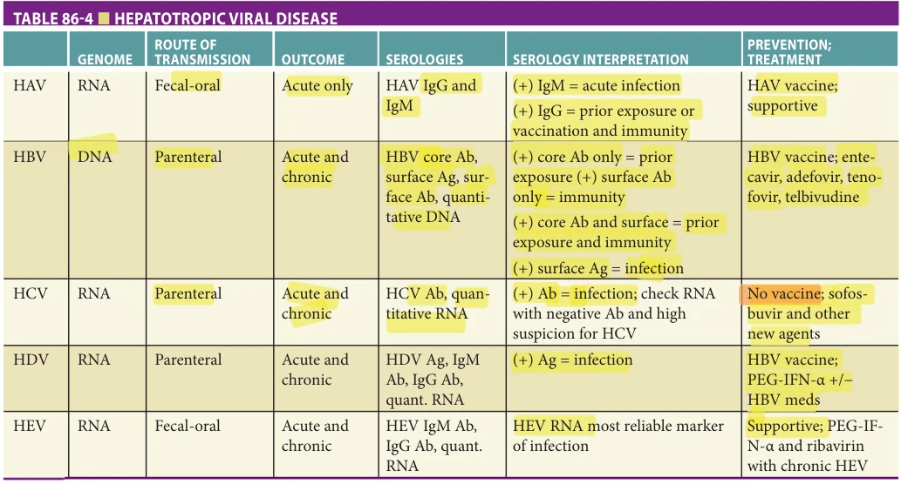

*TABLE 86-4 ■ HEPATOTROPIC VIRAL DISEASE*

*Owner annotations/highlights are from the marked source copy, not the book.*

sanitation, the proportion of adults lacking immunity to HAV has increased. There is a safe and effective vaccine for HAV. Providers should screen and vaccinate older patients traveling to endemic areas. No outbreaks of hepatitis A have been reported at nursing facilities to date. While HAV vaccination is not required for most geriatric patients, it is safe and simple, and providers should have a low threshold for vaccinating susceptible patients of any age.

Hepatitis B Hepatitis B virus (HBV) is a DNA virus and blood-borne pathogen. Nearly 1.2 million people in the United States and over 350 million people worldwide are infected with chronic hepatitis B. Less than 5% of acute HBV infections arising de novo in adults living in the United States will lead to chronic infections. Acute HBV infection is relatively rare in older adults, as the primary risk factors associated with transmission are intravenous drug use and high-risk sexual behavior. There is an increased risk of becoming a chronic HBV carrier with increasing age at acquisition, which is possibly related to an age-related decline in cellular immunity. Chronic HBV infection is a risk factor for hepatocellular carcinoma, and this risk increases with age. With regards to therapy, entecavir and adefovir are safe to use irrespective of age. Lastly, there is a significant age-related decreased antibody response rate after immunization with the HBV vaccine. Older patients might require an additional injection in order to improve immunogenic HBV vaccine response.

Hepatitis C Hepatitis C virus (HCV) is an RNA virus and blood-borne pathogen. Prevalence data varies widely, but it is estimated 71 million people are infected with chronic hepatitis C worldwide. Acute HCV infections in the

United States are almost exclusively confined to persons injecting street drugs. Chronic HCV infection develops in 50% to 80% of infected individuals with the subsequent development of cirrhosis in a significant proportion of these patients. Chronic HCV-related cirrhosis is associated with the development of hepatocellular carcinoma, and this risk is increased significantly with age. Also, the severity of liver disease among patients with chronic HCV infection is worse with increasing age. Similarly, the progression to cirrhosis is faster in older patients, and the serum HCV viral load is significantly higher when compared to younger adults. The older population should be screened for HCV, especially patients who used intravenous or intranasal drugs or received blood products prior to 1992.

In the developed world, the landscape of HCV has been changed radically by the development of highly effective, direct-acting, oral antivirals. These agents are easy to use, often for as little as an 8-week course, and have few side effects in most patients. The AASLD-IDSA clinical guideline is an excellent resource for practitioners who are not familiar with using these agents. Eradication of HCV is achieved in more than 90% of patients. The presence of cirrhosis is one factor that impairs responsiveness. Eradication of HCV in patients with established cirrhosis diminishes but does not remove the risk of development of HCC, and surveillance should be continued (see HCC below). Global challenges to the goal of HCV eradication include educating patients and treatment providers on the need to screen for HCV, increasing screening and diagnosis, as well as ensuring these efficacious medications are accessible and available.

**[p. 1342]**

### Drug-Induced Liver Injury

Older patients consume the largest portion of both prescription and over-the-counter medications. Both age and polypharmacy are risk factors for drug-induced hepatotoxicity. Older patients often have altered pharmacokinetics and pharmacodynamics caused by changes in renal, hepatic, cardiovascular, and pulmonary function and decreased body mass. Drug-induced liver toxicity occurs more frequently in older patients and tends to be more severe. Clinically, drug-induced hepatotoxicity presents with nonspecific symptoms or subclinically, reflected only in serum laboratory abnormalities. Some medications have a well-recognized increased risk of liver toxicity with age. For example, isoniazid frequently causes some evidence of liver toxicity in patients older than 50 years, yet, rarely causes liver damage in patients younger than 20 years. Health care providers taking care of older patients should be aware of this increased risk of drug-induced hepatotoxicity and should be vigilant in assessing for hepatic inflammation. Medications that are heavily metabolized by the liver, some of which are listed in Table 86-2, should be initiated at a dose 30% to 40% lower than average doses used in middle-aged adults. LiverTox is a very helpful website sponsored by the National Institutes of Health for drug-specific information (http://livertox.nih.gov/). Refer to Table 86-3 and Figure 86-1 for information on patterns of drug injury and pathology findings, respectively.

### Primary Biliary Cholangitis

Primary biliary cholangitis (PBC) is characterized by an immune-mediated destruction of the intralobular biliary system. It is predominantly regarded as a disease affecting middle-aged women, but since many patients with PBC live into old age, it is seen both as a new diagnosis or a continuing diagnosis in older patients. Many patients remain asymptomatic and are diagnosed on the basis of an incidentally found elevated alkaline phosphatase level, though pruritus or lassitude may present as early symptoms. Patients with PBC have a higher incidence of other autoimmune conditions such as thyroiditis, Sjögren syndrome, and celiac disease. Disruption of the metabolism of the fat-soluble vitamins leads to an increased risk for developing osteoporosis. The antimitochondrial M2 antibody is a highly sensitive and specific serologic test for PBC, so that liver biopsy is rarely required for diagnosis. PBC is a slowly progressive disease that leads to portal hypertension and cholestatic liver failure in some patients. Treatment is directed to symptom management of pruritus, correction of malabsorption of fat-soluble vitamins, and arresting progression using ursodeoxycholic acid. A small minority of patients may benefit from adding obeticholic acid to ursodeoxycholic acid, although this agent exacerbates pruritis and is contraindicated in patients with decompensated liver failure. Liver transplantation remains the ultimate therapy and should be considered in well-selected geriatric patients.

### Autoimmune Hepatitis

Autoimmune hepatitis is a condition of unknown etiology leading to chronic hepatic inflammation and destruction, with resultant cirrhosis in untreated patients (see Mack et al. for a recent comprehensive review). Autoimmune hepatitis has a bimodal onset, with a second peak of presentation in persons in their sixth decade or older. While autoimmune hepatitis may be present with elevated serum aminotransferases that are discovered incidentally in an otherwise healthy older person, it has a wide spectrum of presentation including new-onset severe liver injury with markedly elevated aminotransferases. Initial serologic workup should include IgG antibody level, antinuclear antibody, and antismooth muscle antibody, and exclusion of other causes of liver injury. Liver biopsy is essential for making the diagnosis. Autoimmune hepatitis generally responds well to immunosuppressive therapy. Patient who have features of both autoimmune hepatitis and PBC or PSC, so-called “cross-over syndromes,” present a diagnostic and therapeutic challenge. For years, prednisone and azathioprine have been the cornerstones of treatment. More recently, budesonide has replaced prednisone in many cases for both initiation and maintenance therapy, thereby limiting the systemic side effects of corticosteroids. Budesonide is not recommended in patients with established cirrhosis. Older patients receiving chronic therapy with corticosteroids need to be monitored closely for serious side effects such as osteoporosis, glucose intolerance, and cataract formation. Prognosis is likely similar between older patients and younger adults.

### Primary Sclerosing Cholangitis (PSC)

PSC is a chronic condition of inflammation and scarring of medium and large-sized bile ducts. Up to 70% of patients with PSC involving both large and medium-size ducts have accompanying chronic inflammatory bowel disease, usually ulcerative colitis, whereas 10% of persons with IBD of the colon will have PSC at some point in their clinical illness. Some other variants are often included under the rubric of PSC including IgG4 cholangiopathy, and cross-over syndromes autoimmune hepatitis. Chronic inflammation and structuring of the smaller bile ducts are sometimes called “small duct PSC.” It is not associated with IBD and may represent a form of AMA-negative PBC. PSC should be distinguished from forms of secondary biliary sclerosis, which may have vascular, infectious, malignant, or drug-induced origin. Typically, PSC presents in younger persons, but presentation in older age occurs also. Pruritus’ may be a prominent symptom. Elevation of the serum markers of cholestasis (alkaline phosphatase and later total bilirubin) is chrematistic. In contrast to PBC and autoimmune hepatitis, autoantibodies are of little clinical utility. Diagnosis is made by cholangiography, initially MRCP. ERCP may be both diagnostic and therapeutic. While PSC causes characteristic changes in the liver (peribiliary sclerosis or “onion skinning”), small intralobular bile ducts are often less affected, and the liver biopsy features

**[p. 1343]**

are often nonspecific and are rarely required to make the diagnosis. There is no approved medical treatment for PSC. The keys to management are:

1. Control of symptoms, particularly itching 2. Recognition and treatment of episodic ascending cholangitis 3. Endoscopic management of dominant biliary strictures, when possible 4. Surveillance for cholangiocarcinoma

Approximately half of all patients with PSC will develop dominant biliary strictures leading to clinically significant obstructions. The specter of cholangiocarcinoma hangs over all patients with PSC and most cholangiocarcinomas develop within dominant bile duct strictures. Interventional endoscopists are able to treat dominant strictures through endoscopic dilation and stenting, and to survey suspicious strictures with cytology, ERCP-guided trans-papillary biopsy, endoscopic ultrasound with fine needle aspiration, and cholangioscopy with direct biopsy. There is no established guideline for interval surveillance, but annual MRI/MRCP (where available) is a good option. Ultimately, liver transplantation is the treatment of choice in selected individuals.

### Living With Chronic Liver Disease

Cirrhosis of the liver results in derangements in three interconnected clinical aspects of liver physiology: liver blood flow, hepatic metabolism, and the formation and secretion of bile. Perturbations to these functions may cause greater problems for older patients than for their younger counterparts. Nowadays, many patients with established liver disease survive past 70 years and experience a combination of frailty and portal hypertension with recurrent ascites or hydrothorax, encephalopathy, and fatigue. Often, the process of injury to the liver continues unabated while the patient experiences these decompensating symptoms. Excessive alcohol consumption, or increased body mass in the setting of metabolic syndrome are just two common explanations for how liver injury can progress despite clinical deterioration. The resistance to portal blood flow due to pre- and intrasinusoidal injury in cirrhosis proceeds silently at first. The asymptomatic cirrhotic patient may have porto-systemic varices, splenomegaly, and thrombocytopenia. The most common first clinical manifestation of portal hypertension is ascites, or its variant portal hypertensive hydrothorax. The consequences of portal hypertension and liver failure which are called “decompensation” (ie, ascites, hydrothorax, encephalopathy, variceal hemorrhage, slow gastrointestinal hemorrhage from gastropathy) can prove difficult to manage in an older patient, particularly if he or she has other systemic diseases such as impaired kidney function or COPD. There has been an increasing recognition of the adverse effects of advancing cirrhosis on muscle mass.

The first and most important step in assisting older patients with decompensated liver disease is to have a frank

discussion with them and their caregivers about the prospects for improvement in symptoms and prognosis, and then to set their goals of therapy. Wherever possible, we advocate that the injurious process be arrested, for example by institution of robust abstinence from alcohol in alcohol-associated liver failure.

Next, we aim to find a balance between the symptoms and the distress caused by treatment. A brief review of treatment of recurrent ascites or encephalopathy in an older patient illustrates the special challenges posed by the combination of liver failure and advanced age. Recurrent ascites due to portal hypertension with or without hydrothorax causes pain, dyspnea, and immobility and carries the risk of spontaneous bacterial peritonitis. Many older patients find it difficult to adhere to dietary salt restriction. The standard next step is to increase free water clearance with diuretics. Older patients may not tolerate diuretics because of urinary incontinence or impaired kidney function. When diuretics fail or induce rising creatinine, or electrolyte disturbance (hyponatremia, hyperkalemia), the choices are limited and unsatisfactory: intermittent large-volume paracentesis which requires transport, is painful, and may lead to infection; or a transjugular intrahepatic portosystemic shunt (TIPS), which is confounded by encephalopathy. In a comfort-directed clinical plan, placement of an indwelling intraperitoneal catheter is reasonable, but should be viewed as an option for no more than a few final weeks.

Hepatic encephalopathy in an older patient is both difficult to improve and to live with. It complicates other forms of age-related changes in memory and mental acuity, making it difficult to determine the contribution of progressive dementia and what is metabolic. Hepatic encephalopathy shows capricious variability. One of the biggest issues for some patients is the recommendation that they stop driving. Each new episode of encephalopathy necessitates a search for a precipitating event: variceal hemorrhage, electrolyte disturbance, inadvertent misuse of sedatives or other medicines that alter the sensorium, clandestine intracranial hemorrhage, and infection (such as SPB). Treatment of hepatic encephalopathy is less than satisfactory. Many patients find lactulose to be unpalatable, and they dislike the accompanying loose stools. Other patients may choose to stop lactulose on account of the taste or to avoid flatulence and fecal incontinence.

Frail patients with recurrent ascites or encephalopathy may be too ill to manage at home and require skilled nursing. Liver transplantation is an appropriate consideration in carefully selected patients, and age alone is not a contraindication. However, a careful assessment of comorbidities typically shows that many older patients, particularly after age 70, are not suitable candidates for liver transplantation. When in doubt, it is always appropriate for the primary care provider or geriatrician to contact their liver transplant center and discuss referring their patient. Similarly, other interventions such as TIPS are more hazardous in the over-70 cohort. There is a growing consensus

**[p. 1344]**

that palliative care directed at improving symptom management and quality of life needs to become a priority in the care of patients with chronic liver disease.

## HEPATOBILIARY CANCER

### Hepatocellular Carcinoma

In Western Europe and North America, hepatocellular carcinoma (HCC) usually occurs in older patients, although the age of presentation is lower in communities where hepatitis B viral infection is endemic. HCC arises typically as a consequence of chronic inflammation of the liver that has resulted in cirrhosis. Consequently, in the individual patient, the prognosis of HCC is intertwined with the clinical stage and prognosis of cirrhosis (see the discussion of living with cirrhosis). Patients with cirrhosis should undergo surveillance for HCC with serial imaging and measurement of serum alpha feto protein (AFP). While controversial, we recommend sonography and AFP every 6 months, until clinical judgement suggests that further surveillance lacks utility. Treatment of carefully selected geriatric patients with HCC, whether by surgical resection, liver transplantation, or by anticancer therapies such as radiofrequency ablation, chemoembolization (TACE), radioembolization (yttrium-90), or chemotherapy, appears to have a similar morbidity and mortality as compared to similar treatment given to younger patients. Thus, age should not be a contraindication for therapy for HCC in the appropriate older patient. In many tertiary centers, management of HCC is conducted in a team approach involving the subspecialities of hepatology, medical and radiation oncology, surgical oncology, surgical transplantation, and interventional radiology.

### Cholangiocarcinoma

Cholangiocarcinoma may arise de novo, in association with PSC, or more rarely with secondary forms of chronic biliary inflammation. Cholangiocarcinoma affecting the large bile ducts may be discovered on surveillance in PSC or on presentation of ascending cholangitis or biliary obstruction. It is often difficult to make the diagnosis of cholangiocarcinoma since the tumor is hypocellular, arises in a desmoid scar, and usually is difficult to access. Treatment for cure is also challenging, although a minority of cases respond to surgery (Whipple procedure, or liver transplantation after extensive directed radio- and chemotherapy).

### Gallbladder Cancer

Cancer of the gallbladder is uncommon in the United States and carries a poor prognosis. Often, this diagnosis is not made until late in its course. The 5-year survival for local disease is 42%, but drops to 0.7% with distant spread of disease. SEER data show that gallbladder cancer occurs primarily in older adults. Approximately 75% of cases occur in patients older than 65 years. It has been noted that 80% of patients with gallbladder cancer have a history of cholelithiasis. Chronic inflammation from gallstones is thought to

induce metaplasia of the gallbladder. Prophylactic cholecystectomy in certain higher risk groups is controversial. Among those who may benefit from this procedure include patients with a porcelain gallbladder, gallbladder polyps greater than or equal to 1 cm and patients with a congenital defect in the junction of the pancreatobiliary duct.

## BILIARY DISEASE

### Cholelithiasis

Table 86-5 outlines the risk factors associated with gallstone formation. Age is a major factor, although the reasons are unclear. By the ninth decade of life, the prevalence of gallstones is 38% in women and 22% in men. The prevalence of gallstones in the US population increases by 1% per year in women and by 0.5% per year in men after age 15. The increase in risk in women is related to increased biliary cholesterol excretion by estrogen. Approximately 500,000 people in the United States develop symptomatic gallstones each year. The incidence of gallstones is increasing within the United States due to the increasing incidence of obesity.

The majority of patients with gallstones are asymptomatic, and the gallstones are found incidentally when a patient undergoes abdominal imaging. It is often a challenge to determine whether symptoms such as chronic nonsevere abdominal pain are causally related to the newly discovered gallstones. Serious complications that may arise from cholelithiasis include severe abdominal pain (“biliary colic”), acute cholecystitis, chronic cholecystitis, or cancer of the gallbladder. These complications can be especially problematic in older patients with comorbid conditions.

### Choledocholithiasis

With gallbladder contraction, gallstones can enter and potentially obstruct the common bile duct. Such obstructions can lead to pain, jaundice, ascending cholangitis, liver abscess, and acute pancreatitis. The prevalence of stones in the common bile duct increases with age. Although dilatation of the common bile duct correlates with choledocholithiasis, the common bile duct may become dilated as a result of the normal aging process or following a cholecystectomy due to the reservoir effect. Comparison to previous imaging studies to evaluate for interval change is important when available.

The classical signs and symptoms of biliary obstruction are called biliary colic and include epigastric or right

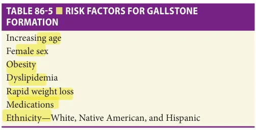

*TABLE 86-5 ■ RISK FACTORS FOR GALLSTONE FORMATION*

*Owner annotations/highlights are from the marked source copy, not the book.*

**[p. 1345]**

upper quadrant pain, nausea, vomiting, and pruritus. Patients may develop dark urine and acholic stools. The presence of fever and jaundice is concerning for ascending cholangitis. The constellation of abdominal pain, jaundice, and fever, known as Charcot triad, is helpful in making the diagnosis of ascending cholangitis.

### Acute Cholecystitis

Approximately 50% to 70% of cases of acute cholecystitis occur in the geriatric population. This condition is characterized by prolonged obstruction of the cystic duct by one or more gallstones. This leads to ischemia, inflammation, and possibly infection of the gallbladder. Acalculous cholecystitis, which occurs in 5% to 10% of cases, refers to inflammation of the gallbladder in the absence of gallstones. It is usually idiopathic, but tends to occur in debilitated and or vasculopathic patients. The severity of cholecystitis varies from mild gallbladder wall edema to severe inflammation and, at its most catastrophic, necrosis or perforation of the gallbladder.

Acute cholecystitis has several classic clinical manifestations. The usual symptoms include abdominal pain, especially in the right upper quadrant or epigastrium, which may radiate to the back or shoulder. It is typically continuous and severe. Patients may notice the onset of such pain after eating a fatty meal. Fevers, chills, nausea, and vomiting are common as well.

Acute cholecystitis may present atypically in older adults and with delayed recognition results in a greater risk of complications. Older patients usually have right upper quadrant or epigastric pain and tenderness, but other signs and symptoms may be lacking. Older patients present without fever, nausea, or vomiting in more than 50% of acute cases. These signs may not be present in 33%, even in the setting of gallbladder gangrene or perforation. Acalculous cholecystitis is more common in older adults, and diagnosis of such cases may be more difficult because of the lack of stones on imaging studies.

### Chronic Cholecystitis

Chronic cholecystitis refers to biliary pain caused by recurrent episodes of cystic duct obstruction or direct irritation

of the gallbladder wall due to stones leading to a chronic inflammatory response. Ultimately this may lead to scarring, fibrosis, and gallbladder dysfunction. On ultrasound or CT imaging, chronic cholecystitis has a more subtle appearance than acute cholecystitis. As with acute cholecystitis, elective cholecystectomy is the treatment of choice.

### Investigations

In acute cholecystitis, ultrasound typically shows gallstones and pericholecystic fluid and/or edema. A sonographic Murphy sign is helpful in establishing the diagnosis. Ultrasonography will demonstrate the presence of stones with an accuracy of 90%. A HIDA (99mtechnetium-N-substituted hepatoiminodiacetic acid) scan will show opacification of the bile ducts, but not of the gallbladder, in cholecystitis.

Ultrasound is the usual initial diagnostic test of choice for choledocholithiasis with a sensitivity of 20% to 38% and specificity of 80% to 100% (Table 86-6). It has the advantage of being noninvasive, easily tolerated by the patient, widely available, and inexpensive. Abdominal CT has higher sensitivity than ultrasound (50%–88%), but often fails to identify stones less than 5 mm. Magnetic resonance cholangiopancreatography (MRCP) allows for visualization of biliary anatomy as well as stones and has sensitivity of 57% to 100% and specificity of 73% to 100% for common bile duct stones. It also has the advantage of being noninvasive, but its disadvantages include cost and potential patient discomfort from claustrophobia.

Endoscopic ultrasound (EUS) is a useful imaging modality in cases where the presence of stones in the common bile duct is suspected, but remains uncertain. EUS has sensitivity and specificity of 94% and 95%, respectively, and sedation needs are similar to an upper endoscopy. Endoscopic retrograde cholangiopancreatography (ERCP) is a therapeutic modality for treatment of choledocholithiasis. The injection of contrast into the biliary tree to obtain a cholangiogram allows visualization of all but very small stones. A biliary sphincterotomy is routinely performed to remove common bile duct stones and to prevent recurrent obstruction. In the case of cholangitis, a stent may be left in the common bile duct to drain purulent material, stones,

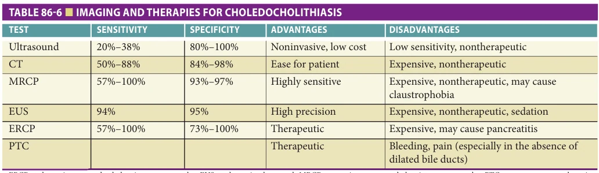

*TABLE 86-6 ■ IMAGING AND THERAPIES FOR CHOLEDOCHOLITHIASIS*

*Owner annotations/highlights are from the marked source copy, not the book.*

ERCP, endoscopic retrograde cholangiopancreatography; EUS, endoscopic ultrasound; MRCP, magnetic resonance cholangiopancreatography; PTC, percutaneous transhepatic cholangiography.

**[p. 1346]**

and sludge. The disadvantages of ERCP include the potential for procedural complications such as acute pancreatitis, technical and infrastructural requirements to complete the procedure, and cost. However, ERCP poses no greater risk in older adults than in the younger population. One study of ERCP in the geriatric population showed no difference in the rate of therapeutic ERCP complications in patients older than 80 years (6.8%) versus those younger than 80 years (5.1%). In a retrospective cohort between 2002 and 2005, there were no significant differences in successful biliary drainage, complications, or mortality in a group of 178 patients older than 75 years compared to 159 patients less than 75 years. Another study evaluated the safety of ERCP in patients older than 90 years, and the complication rate in this age group was 6.3% compared to 8.4% in patients aged 70 to 89. Therefore, ERCP is a safe procedure even in those with very advanced age. The rate of recurrence of symptomatic CBD stones after ERCP was higher in patients older than 80 years (20%) versus 4% in patients 50 years old or younger. Thus, older adults are at higher risk for needing a repeat ERCP. Despite this increased procedural burden, the American Society of Gastrointestinal Endoscopy (ASGE) does not list advanced age as an independent risk factor for the development of post-ERCP pancreatitis, infection or higher bleeding rates. Refer to Figure 86-2 for review of multiple ERCP images.

### Treatment

Incidental discovery of gallstones is not an indication for therapy. Because asymptomatic gallstones tend to follow a benign course, cholecystectomy should be considered primarily in those with symptoms or complications.

Prompt treatment of acute cholecystitis is warranted to prevent clinical deterioration, complications, and progression to chronic cholecystitis. In addition to intravenous fluids, antibiotics, and pain control, surgery is the mainstay of treatment. Each patient’s clinical status and comorbidities must be considered in the decision to proceed with general anesthesia and surgery. Laparoscopic cholecystectomy has several advantages over open cholecystectomy including less discomfort, shorter hospital stay, and lower cost. Complications from this procedure often involve biliary trauma. Age and comorbidities are predictors of surgical outcomes. Timing of intervention is also important with better outcomes in patients who undergo early laparoscopic cholecystectomy for acute cholecystitis. Whenever possible, this should be performed within the same hospital stay for definitive treatment of gallstone disease.

As discussed above, in older patients with acute cholecystitis who are felt to be suitable surgical candidates, laparoscopic cholecystectomy is a reasonable option. However, for older patients who are very ill or have significant comorbidities, gallbladder drainage prior to surgery may be a viable alternative. Percutaneous cholecystostomy drainage is an effective and often definitive treatment for both acute cholecystitis as well as acalculous cholecystitis in select cases. Patients with symptomatic gallstone who

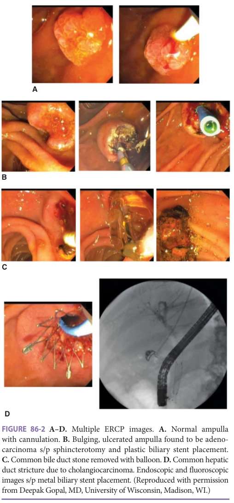

*FIGURE 86-2 A–D. Multiple ERCP images. A. Normal ampulla with cannulation. B. Bulging, ulcerated ampulla found to be adenocarcinoma s/p sphincterotomy and plastic biliary stent placement. C. Common bile duct stone removed with balloon. D. Common hepatic duct stricture due to cholangiocarcinoma. Endoscopic and fluoroscopic images s/p metal biliary stent placement. (Reproduced with permission from Deepak Gopal, MD, University of Wisconsin, Madison, WI.)*

*Owner annotations/highlights are from the marked source copy, not the book.*

cannot or do not wish to undergo invasive procedures may benefit from dissolution of gallstones with ursodiol. This medication is only useful in the setting of cholesterol gallstones. However, at least 50% of patients treated with ursodiol for gallstones will have recurrent stone formation.

## PANCREATIC DISEASE

### Anatomy and Physiology

Figure 86-3 shows the gross anatomy of the pancreas. The pancreas can be divided into the endocrine and the

**[p. 1347]**

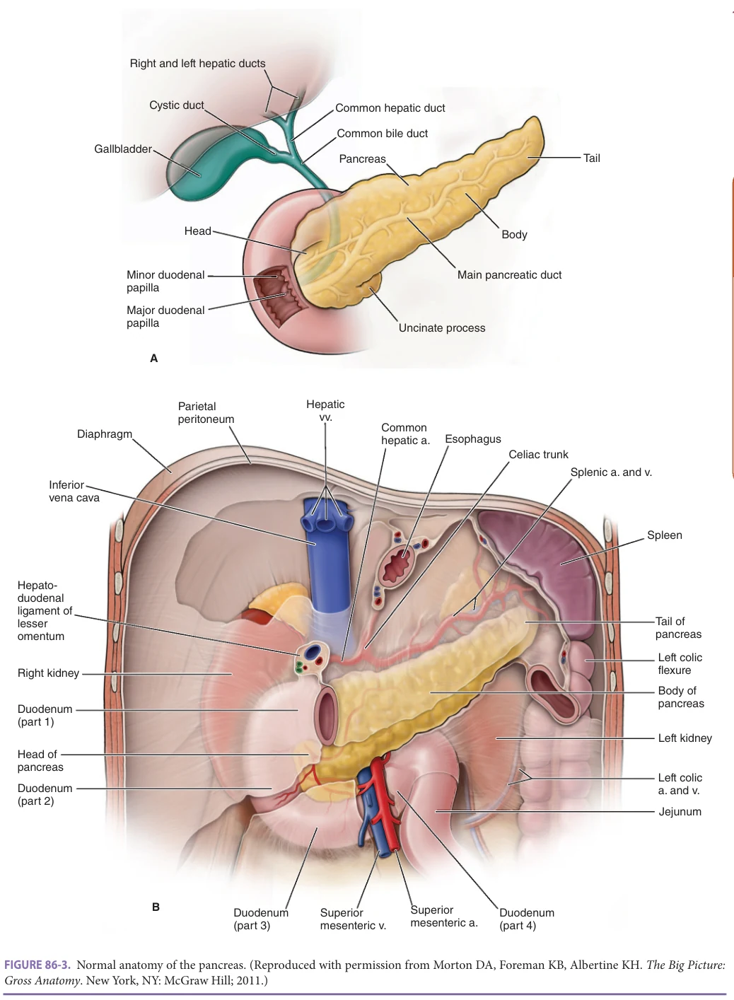

*FIGURE 86-3. Normal anatomy of the pancreas. (Reproduced with permission from Morton DA, Foreman KB, Albertine KH. The Big Picture: Gross Anatomy. New York, NY: McGraw Hill; 2011.)*

*Owner annotations/highlights are from the marked source copy, not the book.*

**[p. 1348]**

exocrine pancreas. Four different types of islet cells comprising the endocrine pancreas produce hormones such as insulin, glucagon, pancreatic polypeptide, and somatostatin. The exocrine pancreas is composed primarily of acinar cells and duct cells. The acinar cells produce the digestive enzymes. The key enzyme is trypsinogen. The duct cells produce the bicarbonate-rich fluid for secretion. The exocrine pancreas has proteases, lipases, glycosidases (amylase), and nucleases. Most proteases and the nucleases are stored in an inactive form. Trypsinogen, the primary protease, is activated to trypsin in the duodenum by enterokinase. Trypsin subsequently activates the other digestive enzymes and, in the presence of calcium, activates trypsinogen to trypsin. In the absence of calcium, trypsin has negative feedback by degrading other trypsin molecules.

There are two additional important mechanisms regulating pancreatic function. First, acid in the duodenum stimulates secretion of the hormone secretin and through vagal mediation leads to the duct cells of the pancreas to secrete bicarbonate. The second regulatory mechanism involves the cholecystokinin (CCK) feedback loop. Human pancreatic acini lack CCK receptors. The presence of protein in the duodenum effectively increases cholecystokinin releasing factor (CCK RF), which stimulates CCK release. The elevated CCK level is recognized by the brain, leading to vagal stimulation of the acinar cells of the pancreas to secrete more digestive enzymes.

### Aging and the Pancreas

Table 86-7 outlines the age-related changes of the pancreas. The maximal volume of pancreatic juice excreted in response to secretin and CCK stimulation increases until the fifth decade and thereafter decreases steadily. Bicarbonate decreases steadily after the fourth decade of life. Also, in ERCP studies, a slight increase in size of the pancreatic duct in the head and body but not the tail has been noted with aging. Despite these anatomic and physiologic changes, only rare cases of pancreatic exocrine deficiency are clinically apparent in healthy older adults.

Over and above the normal changes of aging, advanced age poses other threats to pancreatic structure and function. Pancreatitis secondary to alcohol tends to be a disease of middle age, while gallstone disease continues to have a relatively high incidence in older cohorts.

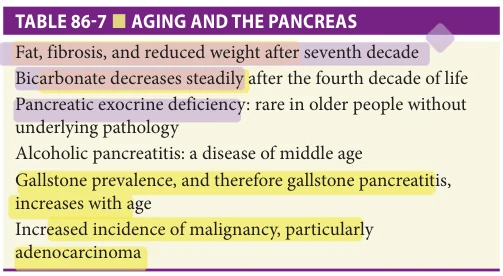

*TABLE 86-7 ■ AGING AND THE PANCREAS*

*Owner annotations/highlights are from the marked source copy, not the book.*

The biggest risk in the older population is an increased incidence of malignancy, particularly adenocarcinoma. In addition, during imaging studies of the abdomen, incidental small cystic and solid lesions of the pancreas are now frequently found.

### Acute Pancreatitis

Acute pancreatitis has a variety of etiologies, but all eventually lead to activation of the digestive enzymes particularly trypsin in the pancreatic acinar cells. The most common etiologies for acute pancreatitis are gallstones and alcohol. However, in an older patient without gallstones or a history of chronic excessive use of alcohol, the suspicion for underlying malignancy needs to be especially high. Inherited defects in the trypsinogen to trypsin pathway may lead to rare forms of acute pancreatitis, termed “hereditary pancreatitis.” Obstruction of the pancreatic duct by a gallstone is an important mechanism of initiating pancreatic injury. Alcohol, on the other hand, causes mitochondrial dysfunction, which allows for increased levels of intracellular calcium and subsequent activation of trypsin. Hypertriglyceridemia is often overlooked as a cause of acute pancreatitis. Triglycerides should be measured on admission to hospital because levels will often quickly decrease with bowel rest and fluids. Although many medications may cause acute pancreatitis, medication-induced acute pancreatitis is uncommon. See Table 86-8 for etiologies of acute pancreatitis.

The incidence of acute pancreatitis is increasing in the United States. The predominant symptom of acute pancreatitis is epigastric pain, commonly with radiation into the back. Nausea and vomiting are also frequently present. Acute pancreatitis is a clinical diagnosis with support from elevated serum amylase and lipase. Serum amylase or lipase levels at least 3 times the upper limit of normal are typical of acute pancreatitis. Lipase is more sensitive than amylase and will stay elevated for a longer period of time. Many other conditions cause minor elevations in amylase or lipase. Radiographic studies have little role in diagnosis, but

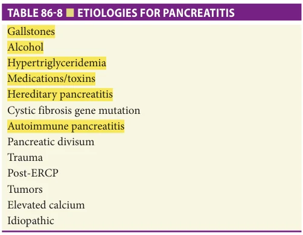

*TABLE 86-8 ■ ETIOLOGIES FOR PANCREATITIS*

*Owner annotations/highlights are from the marked source copy, not the book.*

**[p. 1349]**

do play important roles in evaluating etiology (gallstones, neoplasia, pancreatic calcification indicating chronic pancreatitis) and complications such as necrosis, and pseudocysts. Acute pancreatitis can be divided clinically into mild (absence of organ failure or local complications), moderate (transient organ failure), and severe (persistent organ failure). The range of disease can be from self-limited mild disease to multiorgan failure and death. Approximately 20% of patients with acute pancreatitis will have severe disease due to pancreas necrosis. The overall mortality for patients with acute pancreatitis is 5%. Older patients with comorbid cardiopulmonary diseases are at increased risk of clinical complications due to acute pancreatitis. A variety of grading prognostic systems including Ranson criteria, Apache score, Glasgow score, and the Baltazar CT grade ± necrosis do correlate with morbidity and mortality.

Treatment of mild pancreatitis is accomplished with bowel rest, intravenous fluids, and pain control. Intravenous fluids, when given within the first 72 hours of presentation, can lead to improved clinical outcomes. Gallstone pancreatitis is treated with ERCP, biliary sphincterotomy, and stone extraction if cholangitis or evidence of biliary obstruction is present. However, the routine use of urgent ERCP is not recommended in patients with acute biliary pancreatitis without cholangitis. In patients with severe pancreatitis due to gallstones, cholecystectomy should be undertaken during the initial hospital admission.

Severe pancreatitis often becomes management of multiorgan failure within an ICU setting. Although the use of prophylactic antibiotics is not advised solely because of predicted severe AP and necrotizing pancreatitis, evidence of infected necrosis on CT scan warrants intravenous antibiotics with good pancreatic penetration such as imipenem. Patients who develop sepsis in the setting of pancreatic necrosis should be surveyed by interventional radiology or interventional gastroenterology for biopsy, gram stain, and culture of the necrotic area to help tailor antibiotic therapy. Evidence of infected pancreas necrosis may require temporary percutaneous or endoscopic drain placement or surgical debridement. In patients with acute alcohol-related pancreatitis, brief intervention to address alcohol use disorder is appropriate during admission, and follow-up referral to a formal addiction program is recommended.

The presentation of acute pancreatitis due to alcohol is an opportunity to initiate therapy for alcohol use disorder. Unfortunately, AUD is often overlooked, and this is a particular risk for older persons. The patient with combined pancreatitis and alcohol use disorder should be offered brief therapeutic intervention for AUD while an inpatient and referred for formal treatment of AUD on discharge.

Pseudocyst formation is an important complication of acute pancreatitis. Approximately 10% of patients with acute pancreatitis proceed to formation of these fluid collections. Most pseudocysts resolve with time; however, if symptoms are present (early satiety, pain, infection,

bleeding), then drainage via interventional radiology, endoscopic cystogastrostomy, or surgery may be necessary.

### Chronic Pancreatitis

Since 2016, the major pancreas societies have adopted a new “mechanistic definition” of chronic pancreatitis that affirms the characteristics of end-stage disease as pancreatic atrophy, fibrosis, pain syndromes, duct distortion and strictures, calcifications, pancreatic exocrine dysfunction, pancreatic endocrine dysfunction, and dysplasia, but also addresses the disease mechanism as a pathologic fibroinflammatory syndrome of the pancreas in individuals with genetic, environmental, and/or other risk factors who develop persistent pathologic responses to parenchymal injury or stress. Alcohol use disorder accounts for approximately 70% of chronic pancreatitis. Idiopathic causes are the second most common cause of chronic pancreatitis. In older adults, it is important to evaluate for tumors compressing the pancreatic duct as a possible etiology.

The diagnosis of chronic pancreatitis can be challenging to make in the early stages of the disease. Approximately 85% of patients will have epigastric postprandial pain. Amylase and lipase can be mildly elevated or normal. Structural changes, such as pancreas atrophy, ductal dilation, and calcifications, can be detected by ultrasound, x-ray, or CT scan and are found in 30% to 40% of cases, leading to a diagnosis. Often, more advanced imaging studies such as ERCP, MRCP, or EUS are used to evaluate the anatomy of the pancreas and give a diagnosis. The major features of chronic pancreatitis include pain, malabsorption, and frequently diabetes.

Treatment is based on resolving malabsorption with pancreatic enzyme replacement. Narcotic pain medication is often needed. If a dilated main pancreatic duct is present, a pancreaticojejunostomy (Puestow procedure) can be helpful. In some cases, near total pancreatectomy is needed with or without islet cell transplantation.

### Pancreatic Cancer

Approximately 34,000 new cases of pancreatic cancer will be diagnosed, and 33,000 patients will die secondary to pancreatic cancer each year. Approximately 87% of patients will be older than age 55 at diagnosis with the median age being 72. The overall 5-year survival is 5%. Unfortunately, little progress has been made to change the mortality from this disease over the last several decades. The genetics have now been further elucidated showing that 85% of adenocarcinomas of the pancreas have an activating point mutation in the K-ras oncogene. In addition, 95% have an inactivated p16 tumor-suppressor gene. Genetic changes and new knowledge about the cytokine milieu are continued areas of active research.

More than 70% of adenocarcinomas arise in the head of the pancreas, which leads to common presentations including jaundice, gastric outlet obstruction, and pain. Approximately 15% of lesions do not have vasculature

**[p. 1350]**

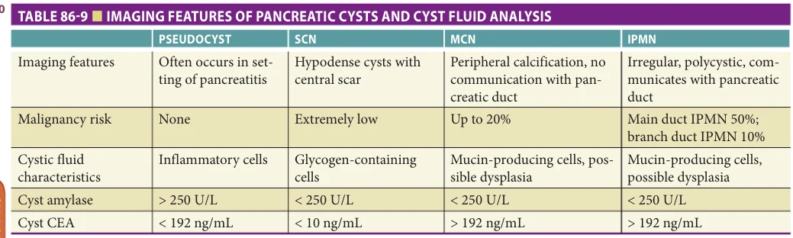

*TABLE 86-9 ■ IMAGING FEATURES OF PANCREATIC CYSTS AND CYST FLUID ANALYSIS*

*Owner annotations/highlights are from the marked source copy, not the book.*

CEA, carcinoembryonic antigen.

invasion or metastatic disease on presentation making surgical resection possible, with curative intent. The 5-year survival in this population is approximately 20%. Staging with CT scans and EUS to evaluate for metastatic disease and vascular invasion is thus important.

Other tumors exist in the pancreas including neuroendocrine tumors and many types of cystic lesions of the pancreas. Neuroendocrine tumors of the pancreas are typically solid tumors. Evaluation by EUS with or without FNA and surgical resection are often performed except in multiple endocrine neoplasia (MEN) 1, where the pancreatic lesions are often multifocal in nature.

### Pancreatic Cysts

Cystic lesions of the pancreas are becoming increasingly recognized because of more widespread abdominal imaging (Table 86-9). Incidental pancreatic cysts are noted on 1% of abdominal CT scans obtained for any reason. These lesions include pseudocysts, congenital cysts (also known as simple cysts), and cystic neoplasms including serous

cystadenomas (SCN), mucinous cystic neoplasms (MCN), cystadenocarcinomas, and intraductal papillary mucinous neoplasm (IPMN). According to guidelines from the American Society of Gastrointestinal Endoscopy, cystic lesions of the pancreas, even when found incidentally, may represent malignant or premalignant neoplasms and require diagnostic evaluation regardless of size. Pancreatic pseudocysts and congenital cysts have no malignant potential. Serous cystadenomas represent nearly 30% of pancreatic cystic neoplasms and are most commonly found in women older than 70 years. After a lesion is identified on imaging studies, EUS with FNA is used to obtain fluid for cytologic evaluation and for tumor markers and amylase in order to classify pancreatic cystic lesions (see Table 86-9 and Figure 86-4). Given the high malignant potential, mucinous cystic neoplasms and main duct IPMNs are managed with surgical resection in geriatric patients who are healthy enough to tolerate surgery. Branch duct IPMNs may be surgically resected as well, though serial imaging is often appropriate based on current guidelines.

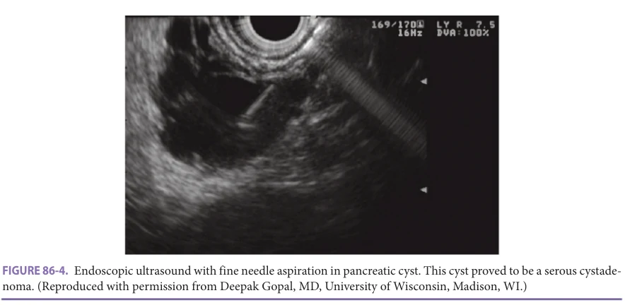

*FIGURE 86-4. Endoscopic ultrasound with fine needle aspiration in pancreatic cyst. This cyst proved to be a serous cystadenoma. (Reproduced with permission from Deepak Gopal, MD, University of Wisconsin, Madison, WI.)*

*Owner annotations/highlights are from the marked source copy, not the book.*

**[p. 1351]**

## FURTHER READING

Agarwal PD, Phillips P, Hillman L, et al. Multidisciplin-

ary management of hepatocellular carcinoma improves access to therapy and patient survival. J Clin Gastroenterol. 2017;51(9):845–859. ASGE Standards of Practice Committee, Buxbaum JL,

Abbas Fehmi SM, et al. ASGE guideline on the role of endoscopy in the evaluation and management of choledocholithiasis. Gastrointest Endosc. 2019;89(6): 1075–1105 e15. Blazer DG, Wu LT. The epidemiology of at-risk and binge

drinking among middle-aged and elderly community adults: National Survey on Drug Use and Health. Am J Psychiatry. 2009;166(10):1162–1169. Caputo F, Vignoli T, Leggio L, Addolorato G, Zoli G,

Bernardi M. Alcohol use disorders in the elderly: a brief overview from epidemiology to treatment options. Exp Gerontol. 2012;47(6):411–416. Chalasani N, Younossi Z, Lavine JE, et al. The diagnosis and

management of nonalcoholic fatty liver disease: practice guidance from the American Association for the Study of Liver Diseases. Hepatology. 2018;67(1):328–357. Crabb DW, Im GY, Szabo G, Mellinger JL, Lucey MR.

Diagnosis and treatment of alcohol-associated liver diseases: 2019 Practice Guidance From the American Association for the Study of Liver Diseases. Hepatology. 2020;71(1):306–333. Crockett SD, Wani S, Gardner TB, Falck-Ytter Y, Barkun

AN, American Gastroenterological Association Institute Clinical Guidelines Committee. American Gastroenterological Association Institute Guideline on Initial Management of Acute Pancreatitis. Gastroenterol. 2018;154(4):1096–1101. Gardner TB, Adler DG, Forsmark CE, Sauer BG, Taylor JR,

Whitcomb DC. ACG Clinical Guideline: chronic pancreatitis. Am J Gastroenterol. 2020;115(3):322–339. Ghany MG, Morgan TR, AASLD-IDSA Hepatitis C Guid-

ance Panel. Hepatitis C Guidance 2019 Update: American Association for the Study of Liver Diseases-Infectious

Diseases Society of America recommendations for testing, managing, and treating hepatitis C virus infection. Hepatology. 2020;71(2):686–721. Lindor KD, Bowlus CL, Boyer J, Levy C, Mayo M. Primary

biliary cholangitis: 2018 Practice Guidance from the American Association for the Study of Liver Diseases. Hepatology. 2019;69(1):394–419. Mack CL, Adams D, Assis DN, et al. Diagnosis and man-

agement of autoimmune hepatitis in adults and children: 2019 Practice Guidance and Guidelines From the American Association for the Study of Liver Diseases. Hepatology. 2020;72(2):671–722. Mathus-Vliegen EM. Obesity and the elderly. J Clin Gas-

troenterol. 2012;46(7):533–544. Noureddin M, Yates KP, Vaughn IA, et al. Clinical and his-

tological determinants of nonalcoholic steatohepatitis and advanced fibrosis in elderly patients. Hepatology. 2013;58(5):1644–1654. Tandon P, Montano-Loza AJ, Lai JC, Dasarathy S, Merli M.

Sarcopenia and frailty in decompensated cirrhosis. J Hepatol. 2021;75 (Suppl 1):S147–S162. Tandon P, Walling A, Patton H, Taddei T. AGA clinical prac-

tice update on palliative care management in cirrhosis: expert review. Clin Gastroenterol Hepatol. 2021;19(4): 646–656 e3. Terrault NA, Lok ASF, McMahon BJ, et al. Update on pre-

vention, diagnosis, and treatment of chronic hepatitis B: AASLD 2018 Hepatitis B Guidance. Clin Liver Dis (Hoboken). 2018;12(1):33–34. Vege SS, Ziring B, Jain R, Moayyedi P, Clinical Guidelines

Committee; American Gastroenterology Association. American gastroenterological association institute guideline on the diagnosis and management of asymptomatic neoplastic pancreatic cysts. Gastroenterol. 2015;148(4):819–822; quize12-3. Zeeh J, Platt D. The aging liver: structural and functional

changes and their consequences for drug treatment in old age. Gerontology. 2002;48(3):121–127.

**[p. 1352]**
