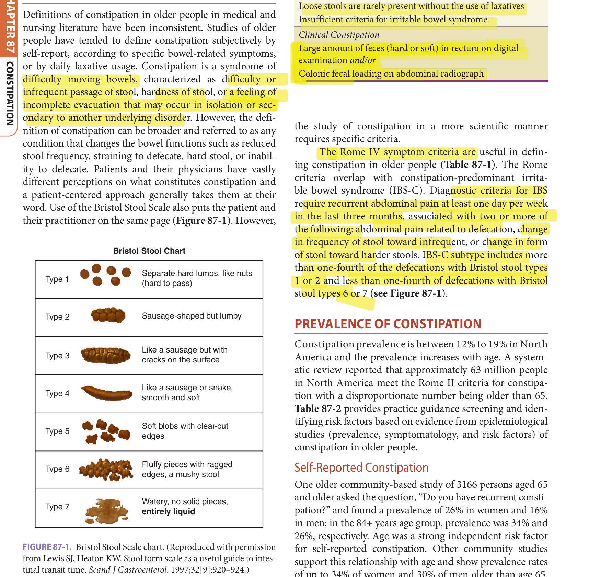
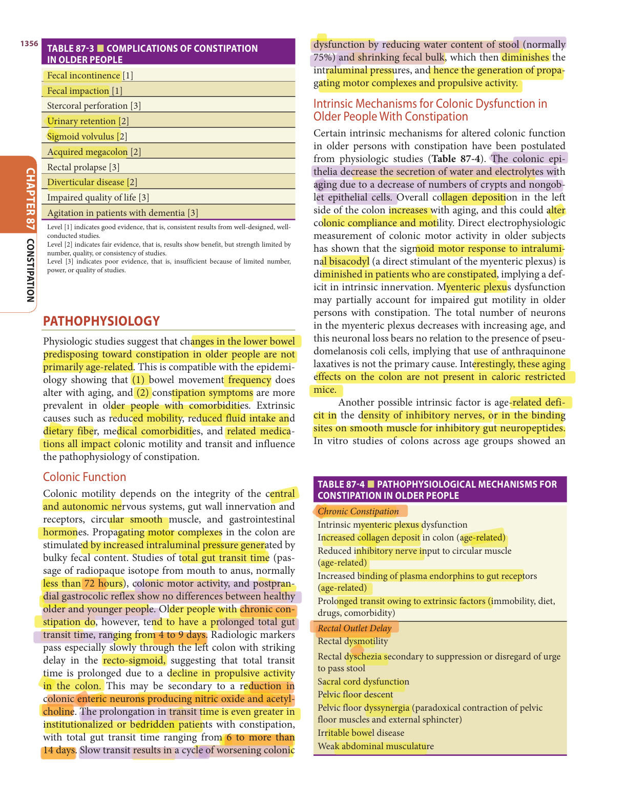
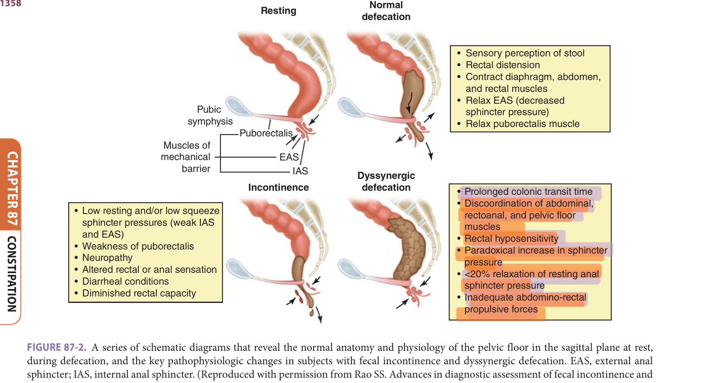
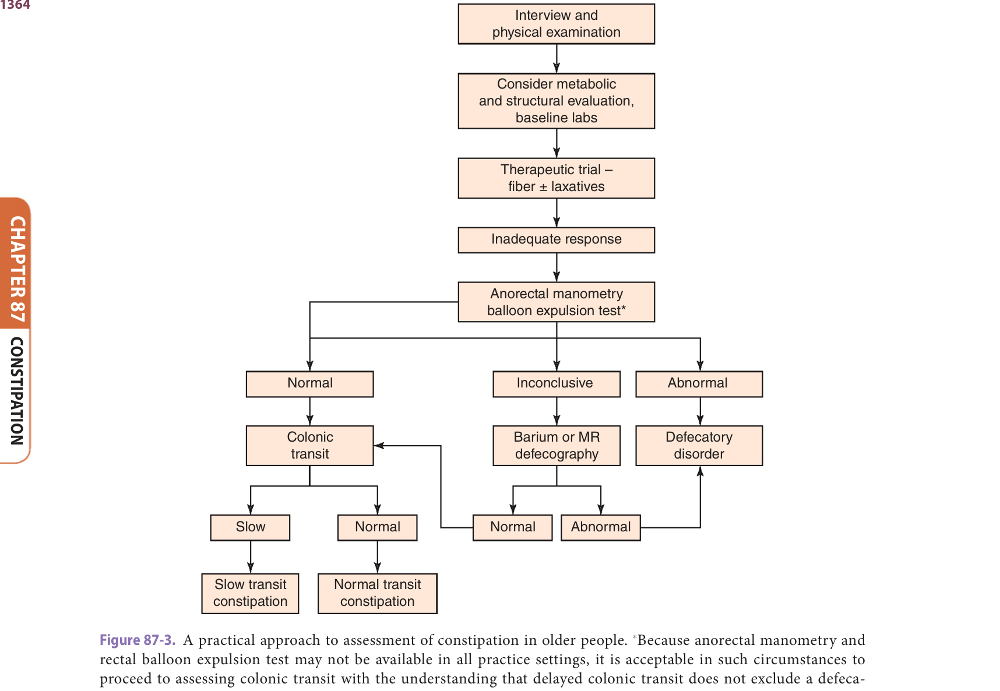
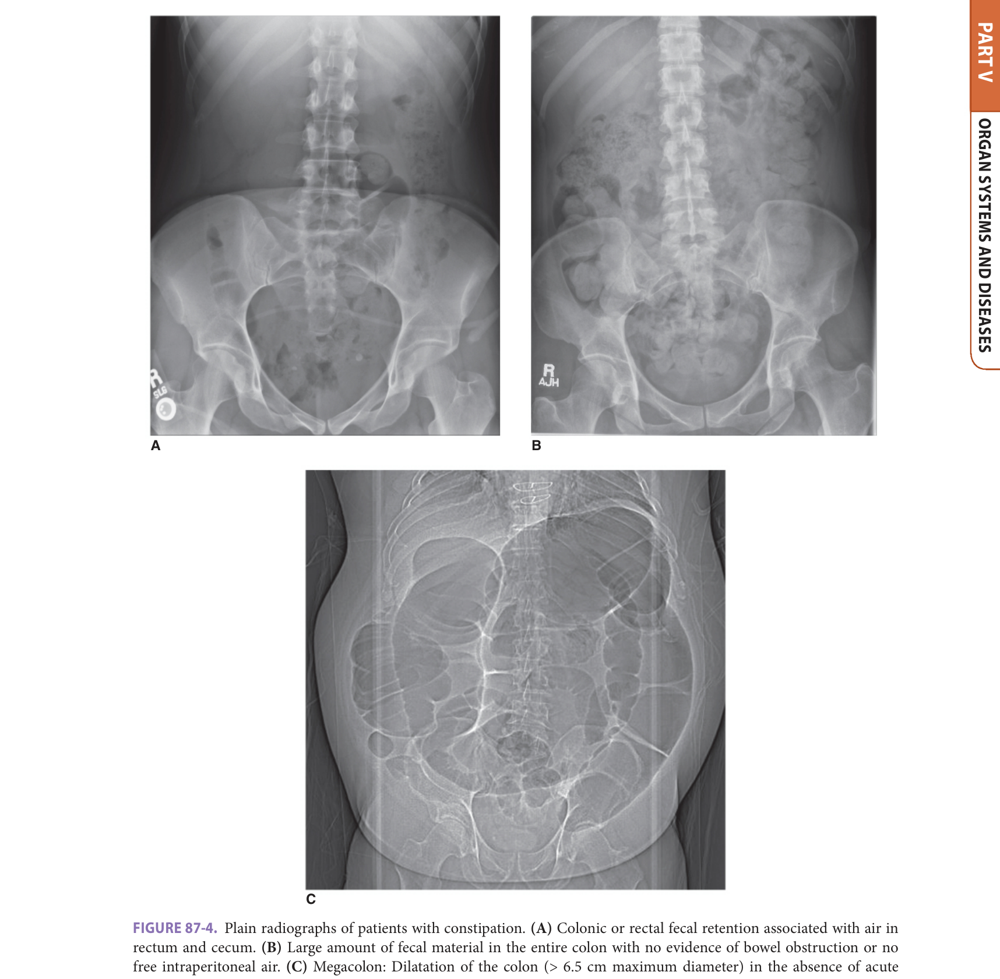
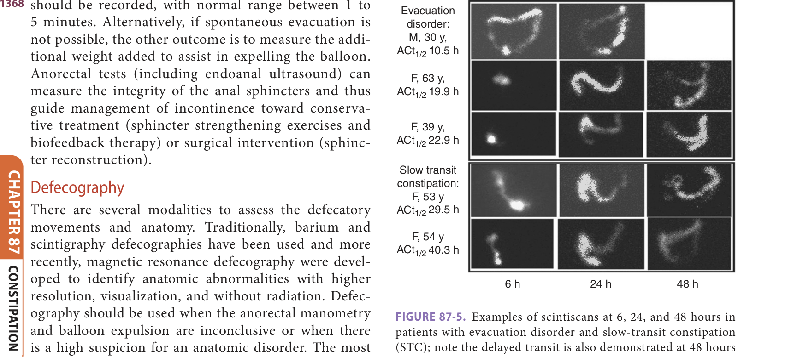
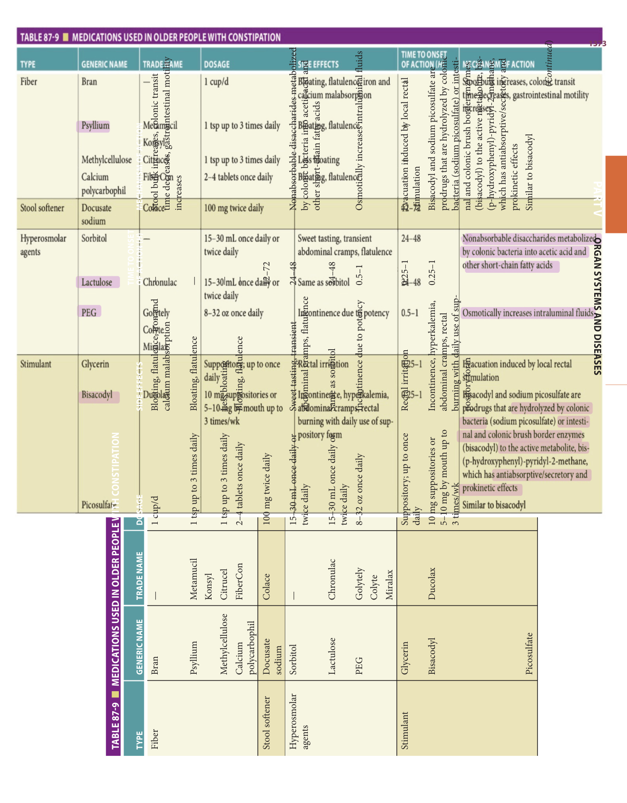
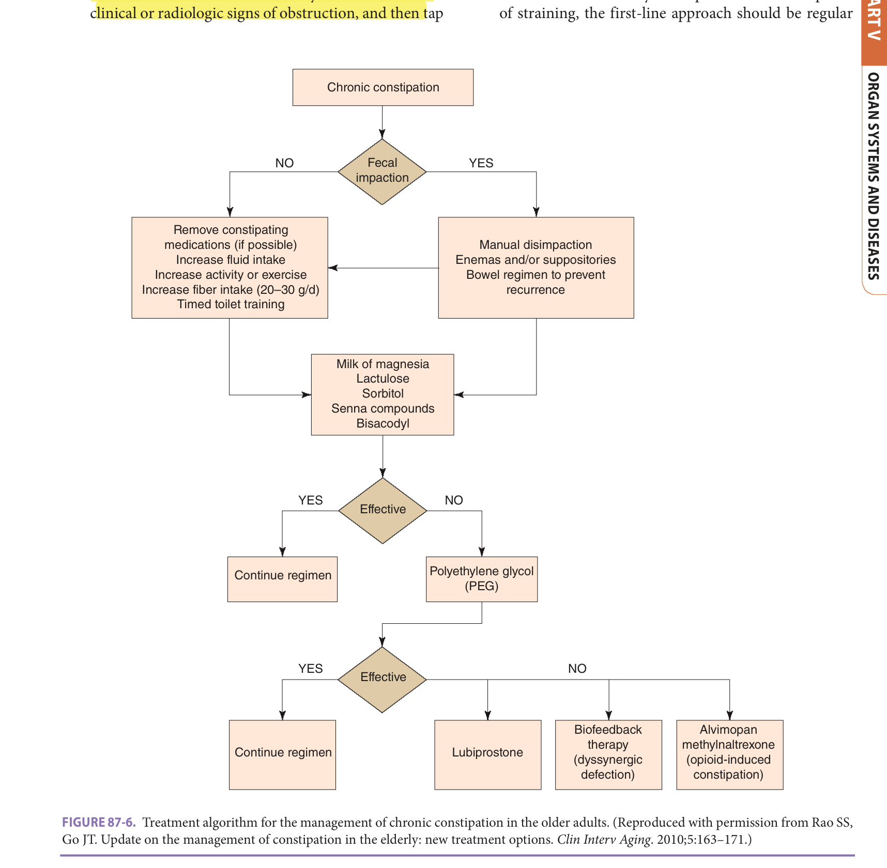

# Hazzard's Geriatric Medicine and Gerontology, 8e — Chapter 87: Constipation

Gerardo Calderon, Andres Acosta

> **Fast build from the book, 22 Sep; not lane-reviewed.**

**[p. 1353]**

#### Learning Objectives

- Define and identify the prevalence of constipation in the older adult.
- Describe the pathophysiology of constipation in the older adult.
- Understand how to diagnose and classify constipation in the older adult.
- Explain the assessment and management of constipation in the older adult.
- List complications of constipation in the older adult.

#### Key Clinical Points

1. Constipation is a common problem in the older adult.
2. Constipation is an expensive condition, with high costs ranging from laxative expenditure to nursing time.
3. Health care providers should routinely inquire about constipation symptoms in older people and be alert to the presence of clinical constipation in individuals unable to communicate.
4. In many older people with constipation symptoms, lifestyle advice (diet, fluids,
5. In higher-risk patients, a stepwise approach to prescribing laxatives, suppositories, or enemas should be used, with the goal of achieving comfortable and regular evacuation.
6. Rectal evacuation difficulties should be specifically addressed in order to identify conditions that may require additional interventions.

## Introduction

Constipation is a frequent health concern for older people in every health care setting. Primary care visits for constipation increase markedly in people older than 60 years, as does regular use of laxatives. Self-reported constipation in older people is associated with anxiety, depression, and poor health perception, while clinical constipation in vulnerable individuals may lead to complications such as fecal impaction, overflow incontinence, sigmoid volvulus, and urinary - retention. Constipation is an expensive condition, with high costs ranging from laxative expenditure to nursing time. For instance, it is estimated that 80% of community nurses working with older people in the United Kingdom are managing constipation (particularly fecal impaction). An Australian study used in-depth, semi-structured interviews to explore older individuals’ experiences with constipation, and their findings largely summed up feelings and problems, no doubt, shared by many older people across the developed world:

- They feel “not right” in themselves when they are constipated.

- Physicians can have a dismissive attitude about constipation and do not consider the problem seriously.

- Patients are keen to find a solution, but feel useful and empathic advice and information are generally unavailable.

- At the same time, they have a strong imperative for self-management including use of over-the-counter laxatives.

- There are some barriers to lifestyle approaches, for example, expense of fruit and vegetables, fear of urinary incontinence with increased fluid intake, or reluctance to walk out alone.

- One-quarter still need to do self-manual removal despite measures taken.

This chapter will describe the definition, epidemiology, risk factors, clinical presentation, assessment, and treatment of constipation in older adults. Data sources were searched of the English language literature (1966–2020), systematic review including the Cochrane database, reference lists from recent systematic reviews and book chapters, and expert committee reports, society guidelines, and

**[p. 1354]**

- expert opinion. Levels of evidence are as used by the US Preventive Services Task Force:

   - Good evidence, Level 1: consistent results from well-designed, well-conducted studies

   - Fair evidence, Level 2: results show benefit, but strength limited by number, quality, or consistency of studies

   - Poor evidence, Level 3: insufficient because of limited number, power, or quality of studies

## Definitions

Definitions of constipation in older people in medical and nursing literature have been inconsistent. Studies of older people have tended to define constipation subjectively by self-report, according to specific bowel-related symptoms, or by daily laxative usage. Constipation is a syndrome of difficulty moving bowels, characterized as difficulty or infrequent passage of stool, hardness of stool, or a feeling of incomplete evacuation that may occur in isolation or secondary to another underlying disorder. However, the definition of constipation can be broader and referred to as any condition that changes the bowel functions such as reduced stool frequency, straining to defecate, hard stool, or inability to defecate. Patients and their physicians have vastly different perceptions on what constitutes constipation and a patient-centered approach generally takes them at their word. Use of the Bristol Stool Scale also puts the patient and their practitioner on the same page ( **Figure 87-1** ). However,

<!-- Start of picture text -->
Bristol Stool Chart Separate hard lumps, like nuts Type 1 •••• (hard to pass) Type 2 - ••  Sausage-shaped but lumpy Like a sausage but with Type 3 cracks on the surface Like a sausage or snake, Type 4 smooth and soft Soft blobs with clear-cut Type 5 edges Fluffy pieces with ragged Type 6 edges, a mushy stool Watery, no solid pieces, Type 7 entirely liquid <!-- End of picture text -->

> *FIGURE 87-1. Bristol Stool Scale chart. (Reproduced with permission from Lewis SJ, Heaton KW. Stool form scale as a useful guide to intestinal transit time. _Scand J Gastroenterol_ . 1997;32[9]:920–924.)*

> Highlighting is the owner's annotation, not the book's.

**Table 87-1 — Definitions of constipation**

- *Constipation (Rome IV Criteria)*: Two or more of the following symptoms present on more than 25% of occasions for at least 12 wk in the last 12 mo: Two or less bowel movements per week Straining at stool Hard stools (Bristol Stool Form Scale 1-2)–See **Figure 87-1** Sensation of incomplete evacuation Sensation of anorectal obstruction Manual maneuvers to facilitate defecations Loose stools are rarely present without the use of laxatives Insufficient criteria for irritable bowel syndrome
- *Clinical Constipation*: <mark>Large amount of feces (hard or soft) in rectum on digital examination</mark>
- *<mark>and/or</mark>*: <mark>Colonic fecal loading on abdominal radiograph</mark>

the study of constipation in a more scientific manner requires specific criteria.

The Rome IV symptom criteria are useful in defining constipation in older people ( **Table 87-1** ). The Rome criteria overlap with

constipation-predominant irritable bowel syndrome (IBS-C). Diagnostic criteria for IBS require recurrent abdominal pain at least one day per week in the last three months, associated with two or more of the following: abdominal pain related to defecation, change in frequency of stool toward infrequent, or change in form of stool toward harder stools. IBS-C subtype includes more than one-fourth of the defecations with Bristol stool types 1 or 2 and less than one-fourth of defecations with Bristol stool types 6 or 7 ( **see Figure 87-1** ).

## Prevalence Of Constipation

Constipation prevalence is between 12% to 19% in North America and the prevalence increases with age. A systematic review reported that approximately 63 million people in North America meet the Rome II criteria for constipation with a disproportionate number being older than 65. **Table 87-2** provides practice guidance screening and identifying risk factors based on evidence from epidemiological studies (prevalence, symptomatology, and risk factors) of constipation in older people.

### Self-Reported Constipation

One older community-based study of 3166 persons aged 65 and older asked the question, “Do you have recurrent constipation?” and found a prevalence of 26% in women and 16% in men; in the 84+ years age group, prevalence was 34% and 26%, respectively. Age was a strong independent risk factor for self-reported constipation. Other community studies support this relationship with age and show prevalence rates of up to 34% of women and 30% of men older than age 65.

**[p. 1355]**

**Table 87-2 — Practice guidance based on epidemiological evidence**

_Screening_ Constipation symptoms should be routinely asked about in patients aged 65+ in view of the high prevalence of the condition in this population [2]. Men and women in their eighth decade and beyond should be regularly screened for constipation symptoms, as prevalence increases with advancing age [2]. Periodic objective assessment for constipation in older nursing home residents should be incorporated into routine nursing and medical care [2]. Patients unable to report symptoms … *(table text runs longer in the printed book; not fully reproduced in this fast build)*

##### _Identifying Risk Factors_

The identification of risk factors for constipation in older people is critical to effectively managing the condition [2].

Systematic identification of multiple risk factors in vulnerable older people with constipation should be incorporated into good practice guidelines in all health care settings [3].

Patients at increased risk of constipation from recognized comorbidities (eg, Parkinson disease, diabetes) should be regularly assessed for the condition [2].

##### _Assessment_

Identifying specific bowel symptoms in older individuals reporting constipation is important to guide appropriate management of this common complaint [2].

Reduced bowel movement frequency is not a sensitive clinical indicator for constipation in older people [2], though it is specific [3].

Difficulty with evacuation and rectal outlet delay are primary symptoms in older individuals [2].

An objective assessment should be undertaken in frail older people with constipation as these patients are at increased risk of developing complications [2].

Older patients being prescribed laxatives on a daily basis should be regularly reviewed for symptoms of constipation and the appropriateness of long-term laxative therapy [3].

Level [1] indicates good evidence, that is, consistent results from well-designed, wellconducted studies.

Level [2] indicates fair evidence, that is, results show benefit, but strength limited by number, quality, or consistency of studies. Level [3] indicates poor evidence, that is, insufficient because of limited number, power, or quality of studies.

The preponderance of women over men reporting constipation tends to equalize after the age of 80 years. The incidence rate of new-onset constipation is 7% in nursing home residents with screening every 3 months.

### Infrequent Bowel Movements

Two or fewer bowel movements per week are below normal range and tend to signify slow-transit constipation.

Weekly frequency of bowel movements is not changed with age, in contrast to self-reporting of constipation. In - community-based studies:

- Only 1% to 7% of both younger and older communitydwelling individuals report two or fewer bowel movements a week.

- This consistent bowel pattern across age groups persists even after statistical adjustment for the greater number of laxatives used by older people.

- Among older people complaining of constipation, less than 10% report two or fewer weekly bowel movements, and more than 50% move their bowels daily.

### Difficult Evacuation

Symptoms other than infrequent bowel movements drive self-reporting of constipation in older people. These symptoms are predominantly straining and passage of hard stools. Of older people reporting constipation in a US community study, 65% had persistent straining and 39% had passage of hard bowel movements. Difficult rectal evacuation is a primary cause of constipation in older people. -- Twenty-one percent of community-dwelling people aged 65 and older had rectal outlet delay (according to Rome II criteria), and many describe the need to self-evacuate. Among frailer individuals, difficult evacuation can lead to rectal impaction and fecal soiling.

### Constipation In The Acute Care Setting

According to the updated 2019 report from the Bowel Interest Group, 71,430 people in England were admitted to hospital with constipation between 2017 and 2018, which is equivalent to 196 people a day. The cost of treating constipation was £162 million. Also, the prescription cost of laxatives in England during this same period of time was £91 million, without considering over-the-counter laxatives.

### Constipation In The Long-Term Care Setting

Long-term care residents are at increased risk of developing complications of constipation ( **Table 87-3** ) that may precipitate acute hospital admissions. Physical frailty in older persons does increase the prevalence of infrequent bowel movements, with 17% of nursing home residents reporting two or fewer bowel movements a week. Among the total population of long-term care residents self-reporting constipation, 33% have two or fewer bowel movements a week. A Finnish study showed the prevalence of chronic constipation and/or rectal outlet delay to be 57% in women and 64% in men living in residential homes, and 79% and - 81% respectively in the nursing home setting. A UK study found that 64% of nursing home residents taking laxatives still reported straining on more than one in four occasions. This and the fact that 50% to 74% of long-term care residents use daily laxatives suggest that rectal evacuation difficulties are not being well managed in this population.

**[p. 1356]**
**Table 87-3 — Complications of constipation in older people**

|Fecal incontinence [1]| |---| |Fecal impaction [1]| |Stercoral perforation [3]| |Urinary retention [2]| |Sigmoid volvulus [2]| |Acquired megacolon [2]| |Rectal prolapse [3]| |Diverticular disease [2]| |Impaired quality of life [3]| |Agitation in patients with dementia [3]| |Level [1] indicates good evidence, that is, consistent results from well-designed, well- conducted studies. Level [2] indicates fair evidence, that is, results show benefit, but strength limited by number, quality, … *(table text runs longer in the printed book; not fully reproduced in this fast build)*

## Pathophysiology

Physiologic studies suggest that changes in the lower bowel predisposing toward constipation in older people are not primarily age-related. This is compatible with the epidemiology showing that (1) bowel movement frequency does alter with aging, and (2) constipation symptoms are more prevalent in older people with comorbidities. Extrinsic causes such as reduced mobility, reduced fluid intake and dietary fiber, medical comorbidities, and related medications all impact colonic motility and transit and influence the pathophysiology of constipation.

### Colonic Function

> Colonic motility depends on the integrity of the central - and autonomic nervous systems, gut wall innervation and receptors, circular smooth muscle, and gastrointestinal hormones. Propagating motor complexes in the colon are stimulated by increased intraluminal pressure generated by bulky fecal content. Studies of total gut transit time (passage of radiopaque isotope from mouth to anus, normally less than 72 hours), colonic motor activity, and postprandial gastrocolic reflex show no differences between healthy older and younger people. Older people with chronic constipation do, however, tend to have a prolonged total gut transit time, ranging from 4 to 9 days. Radiologic markers pass especially slowly through the left colon with striking delay in the recto-sigmoid, suggesting that total transit time is prolonged due to a decline in propulsive activity -,I in the colon. This may be secondary to a reduction in colonic enteric neurons producing nitric oxide and acetylcholine. The prolongation in transit time is even greater in institutionalized or bedridden patients with constipation, with total gut transit time ranging from 6 to more than 14 days. Slow transit results in a cycle of worsening colonic

dysfunction by reducing water content of stool (normally 75%) and shrinking fecal bulk, which then diminishes the intraluminal pressures, and hence the generation of propagating motor complexes and propulsive activity.

### Intrinsic Mechanisms For Colonic Dysfunction In Older People With Constipation

Certain intrinsic mechanisms for altered colonic function in older persons with constipation have been postulated from physiologic studies ( **Table 87-4** ). The colonic epithelia decrease the secretion of water and electrolytes with aging due to a decrease of numbers of crypts and nongoblet epithelial cells. Overall collagen deposition in the left - side of the colon increases with aging, and this could alter colonic compliance and motility. Direct electrophysiologic .......-. measurement of colonic motor activity in older subjects has shown that the sigmoid motor response to intraluminal bisacodyl (a direct stimulant of the myenteric plexus) is diminished in patients who are constipated, implying a deficit in intrinsic innervation. Myenteric plexus dysfunction may partially account for impaired gut motility in older persons with constipation. The total number of neurons in the myenteric plexus decreases with increasing age, and this neuronal loss bears no relation to the presence of pseudomelanosis coli cells, implying that use of anthraquinone laxatives is not the primary cause. Interestingly, these aging effects on the colon are not present in caloric restricted mice.

> Another possible intrinsic factor is age-related deficit in the density of inhibitory nerves, or in the binding sites on smooth muscle for inhibitory gut neuropeptides. In vitro studies of colons across age groups showed an

**Table 87-4 — Pathophysiological mechanisms for constipation in older people**

- *Chronic Constipation*: |

> *Table 87-4 reproduced as a page image (printed p. 1356) — the grid did not extract reliably as text for this fast build.*

> Highlighting is the owner's annotation, not the book's.

|
- *Rectal Outlet Delay*: |

> *Table 87-4 reproduced as a page image (printed p. 1356) — the grid did not extract reliably as text for this fast build.*

> Highlighting is the owner's annotation, not the book's.

**[p. 1357]**

age-related reduction in the amplitude of inhibitory junction potentials, but no decrease in the levels of inhibitory gut neuropeptides. This age-related decline occurs ear

lier in women as compared with men. Such a decrease in inhibitory nerve input to the circular smooth muscle could result in segmental motor incoordination, which may lengthen transit time and promote constipation in older persons with other predisposing risk factors. Individuals older than age 60 have higher plasma concentrations of beta-endorphin with increased binding to opiate receptors in the gut wall and myenteric plexus. Higher opiate binding has the effect of relaxing colonic tone, reducing motility, and inhibiting the gastrocolic reflex. - Constipation is more prevalent in patients with nonulcer dyspepsia, as both conditions involve gastrointestinal hypomotility.

### Anorectal Function

In normal defecation, colonic activity propels stool into the rectal ampulla causing distension and intrinsically mediated relaxation of the smooth muscle of the internal anal sphincter (or anal canal). This is followed promptly by reflex contraction of the external anal sphincter and pelvic floor muscles, which are skeletal muscles innervated by the pudendal nerve. The brain registers a desire to defecate, the external sphincter is voluntarily relaxed, and the rectum is evacuated with assistance from abdominal wall muscle contraction.

### Age-Related Changes In Anorectal Function

> There is a tendency toward an age-related decline in internal - -- sphincter tone, particularly in the eighth decade onward.

> Clinically, this predisposes older individuals to fecal incontinence, particularly with loose stools. There is a more definite age-related decline (greater in women than men) in external anal sphincter and pelvic muscle strength, which can contribute toward evacuation difficulties. Failure of the anorectal angle to open and excessive perineal descent in older women can lead to constipation. In simulated defecation studies, 37% of non-constipated older subjects were unable to evacuate a small solid sphere. Consequent prolonged straining may compress the pudendal nerve, further exacerbating any preexisting weakness. There appears to be a reduction in rectal motility with normal aging, again in oldest age groups. Rectal sensation does not alter with normal aging.

### Anorectal Dysfunction In Older Persons

The most common form of anorectal dysfunction in older people is _rectal dysmotility,_ characterized by reduced rectal motility, increased rectal compliance with a variable degree of rectal dilatation, and impaired rectal sensation such that the urge to pass stool is blunted (see **Table 87-4** ). Over time, an increasing degree of rectal distension is required to reflexly trigger the defecation mechanism. These patients have rectal retention of hard or soft stool on digital

examination of which they may be unaware. The resulting rectal distension leads to relaxation of the internal sphincter and hence to fecal soiling. One study showed that rectal contractions could be elicited in only 14% of older people with a history of rectal impaction. One postulated cause for rectal dysmotility is diminished parasympathetic outflow as a result of impaired sacral cord function, for example, from ischemia or spinal stenosis. Rectal dysmotility can also develop through a persistent disregard or suppression of the urge to defecate that can occur with dementia, depression, immobility, or painful anorectal conditions. Voluntary increase in intra-abdominal pressure during defecation could overcome rectal dysmotility to produce enough of an increase in rectal pressure for evacuation to occur, but older people often have weakened abdominal musculature, limiting their ability to compensate in this way.

_Pelvic floor dyssynergia_ , though more common in younger women, can cause rectal outlet delay in older people ( **Figure 87-2** ). This is caused by paradoxical contraction or failure to relax the pelvic floor and external anal sphincter muscles during defecation. Manometric studies show paradoxical increases in anal canal pressure on straining. This abnormal expulsion pattern occurs in individuals with severe and long-standing symptoms of rectal outlet delay and in patients with Parkinson disease.

## Risk Factors For Constipation In Older People

Both the epidemiology and pathophysiology of constipation in older people point to the enormous importance of identifying predisposing causes for the condition in each affected individual. One prospective study examined baseline characteristics predictive of new-onset constipation in older nursing home residents, using the US Minimum Data Set. Seven percent ( _n_ = 1291) developed constipation over a 3-month period. Independent predictors were White race, poor consumption of fluids, pneumonia, Parkinson disease, allergies, decreased bed mobility, arthritis, greater than five medications, dementia, hypothyroidism, and hypertension. The authors postulated that allergies, arthritis, and hypertension were associated primarily because of the constipating effect of drugs used to treat these conditions. Other studies have shown that institutionalization itself is an independent risk factor for symptom-based constipation in older people. **Table 87-5** summarizes evidence-based risk factors of constipation in the older population.

### Reduced Mobility

Impaired mobility is a common risk factor for constipation in older people. Greater physical activity (including regular walking) is associated with less self-reported and symptomspecific constipation in older people living both at home and in long-term care. Reduced mobility is the strongest independent correlate of heavy laxative use among nursing

**[p. 1358]**
<!-- Start of picture text -->
Normal Resting defecation • Sensory perception of stool • Rectal distension • Contract diaphragm, abdomen,  and rectal muscles • Relax EAS (decreased Pubic   sphincter pressure) symphysis • Relax puborectalis muscle Puborectalis Muscles of mechanical EAS barrier IAS Dyssynergic Incontinence defecation • Prolonged colonic transit time • Discoordination of abdominal, • Low resting and/or low squeeze  rectoanal, and pelvic floor  sphincter pressures (weak IAS  muscles  and EAS) • Rectal hyposensitivity • Weakness of puborectalis • Paradoxical increase in sphincter • Neuropathy  pressure • Altered rectal or anal sensation • <20% relaxation of resting anal • Diarrheal conditions  sphincter pressure • Diminished rectal capacity • Inadequate abdomino-rectal  propulsive forces <!-- End of picture text -->

> *FIGURE 87-2. A series of schematic diagrams that reveal the normal anatomy and physiology of the pelvic floor in the sagittal plane at rest, during defecation, and the key pathophysiologic changes in subjects with fecal incontinence and dyssynergic defecation. EAS, external anal sphincter; IAS, internal anal sphincter. (Reproduced with permission from Rao SS. Advances in diagnostic assessment of fecal incontinence and dyssynergic defecation. _Clin Gastroenterol Hepatol._ 2010;8[11]:910–919.)*

> Highlighting is the owner's annotation, not the book's.

home residents, following adjustment for age, comorbidity, and other relevant clinical factors. Gut transit time in older subjects was 3 days in ambulant patients and 3 weeks in bedridden patients, although comorbid factors were likely to be contributory. A study of healthy young male volunteers showed that after only 1 week of bed rest, both transit through the sigmoid colon and stool frequency were reduced. It is well documented that exercise increases colonic propulsive activity (“joggers diarrhea”), especially when measured after eating. In a population survey of younger women (36–61 years), daily physical activity was associated with less constipation (defined as two or fewer bowel movements per week), and the association strengthened with increased frequency of physical activity. This suggests that increasing physical activity in adulthood may reduce the likelihood of constipation problems in older age.

### Drug Side Effects

Polypharmacy increases the risk of constipation in older patients, particularly in nursing homes where each individual takes an average of six to nine prescribed medications per day. _Anticholinergic medications_ reduce contractility of the smooth muscle of the gut via an antimuscarinic effect at acetylcholine receptor sites, and in some cases (eg, patients with schizophrenia taking neuroleptics), long-term use may result in chronic megacolon. In two cross-sectional studies of nursing home residents, anticholinergic antidepressants

were independently associated with daily laxative use following adjustment for age, gender, function, and cognition. Anticholinergic neuroleptics and antihistamines were also independently associated in one of the studies; nonanticholinergic sedatives, however, were not found to be constipating. A study of 532 community-dwelling older US veterans found that among the 27% using anticholinergic drugs, the rate of constipation (42%) was significantly greater than among those not using the drugs.

While older people are very susceptible to the constipating effects of _opiate analgesia_ , a study of nursing home residents with persistent nonmalignant pain found that there was no increased rate of constipation in chronic opiate users over a 6-month period compared to those not taking opiates. They also observed a general improvement in functional status and social engagement. Constipation in chronic opiate users can be effectively managed (by diet and laxative or suppository co-prescription where needed)—an important finding as chronic pain is often undertreated in older people perhaps owing to fear of the adverse effects of analgesic drugs. Community-based studies of adults receiving opiates for chronic pain have shown equal constipation risk for all sustained-release oral preparations. Transdermal patches (eg, fentanyl), however, are associated with lower risk of constipation than oral preparations.

All types of _iron supplements_ (sulfate, fumarate, and gluconate) cause constipation, the constipating factor being

**[p. 1359]**

**Table 87-5 — Risk factors for constipation in older people**

Medications Polypharmacy (≥ 5 medications) [2] - Anticholinergic drugs (tricyclics, antipsychotics, antihistamines, antiemetics, drugs for detrusor hyperactivity) [1] - Opiates [2] Iron supplements [3] Calcium channel antagonists (nifedipine and verapamil) [2] Calcium supplements [2] Nonsteroidal anti-inflammatory drugs [2] Impaired mobility [2] Nursing home residency [2] Neurologic conditions Dementia [2] Parkinson disease [1] Diabetes mellitus [1] Autonomic neuropathy [2] Stroke [3] … *(table text runs longer in the printed book; not fully reproduced in this fast build)*

es. Level [2] indicates fair evidence, that is, results show benefit, but strength limited by number, quality, or consistency of studies. Level [3] indicates poor evidence, that is, insufficient because of limited number, power, or quality of studies.

the amount of elemental iron absorbed. Slow-release preparations have a lesser impact on the large bowel, but this is because they tend to carry the iron past the first part of the duodenum into an area of the gut where elemental iron absorption is poorer. Administration of iron sulfate in doses greater than 325 mg per day does not substantially increase iron absorption in older people and may significantly increase gastrointestinal side effects. Intravenous iron does not cause constipation and may be an alternative in patients with chronic anemia (eg, chronic kidney disease) who have symptomatic constipation on oral iron.

In a 5-year study of _calcium supplementation_ in older women, the only side effect was constipation (treatment - 13% vs placebo 9.1%). The study showed that calcium

supplementation reduced bone loss and turnover and fracture rates in older women who took it, but long-term compliance was poor, and constipation may have contributed to this.

_Calcium channel antagonists_ impair lower gut motility, particularly in the rectosigmoid, by inhibiting calcium uptake into smooth muscle cells and altering intraluminal electrolyte and water transportation. Severe constipation has been reported in older patients taking calcium channel antagonists, with nifedipine and verapamil being the most potent inhibitors of gut motility in this class of drugs.

> _Nonsteroidal anti-inflammatory drugs (NSAIDs)_ - increase the risk of constipation in older people, most likely through prostaglandin inhibition. In a large case-controlled primary care study, constipation and straining were more common reasons for stopping NSAIDs than dyspepsia. NSAIDs have also been implicated in causing stercoral perforation in patients with chronic constipation.

_Aluminum antacids_ have been associated with constipation in older people living in both nursing homes and in the community.

### Dietary Factors

**Fiber** Low consumption of wheat bran, fiber, vegetables, fruit, rice, and calories can all predispose toward constipation. A UK survey showed that consumption of fruit, vegetables, and bread decreases with advancing age. The prevalence of constipation is likely rising in part because modern food processing produces refined food with low roughage. Community studies of older Europeans who eat a Mediterranean diet rich in fruit, vegetables, and olive oil show a low prevalence of constipation (4.4% in people aged 50+). Conversely, a German questionnaire survey of adults with and without constipation reported that chocolate, white bread, and bananas were the foodstuffs most strongly perceived to harden stools.

**Calories** Low calorie intake in older people (adjusted for fiber intake) is associated with constipation. One study looked at nutritional factors across all nursing homes in Finland and found that malnutrition and constipation were associated. This may be a two-way association in that marked constipation or fecal impaction can cause anorexia, while low calorie intake can promote constipation.

**Enteral nutrition** Constipation is a recognized problem in patients receiving enteral nutrition. A recent prospective -- multicenter longitudinal study from Spain followed adult patients (mean age 70 in males, 72 in females) receiving home enteral nutrition for a 4-month period and identified an IR of 1.9 and 1.1 in males and females, respectively. Another common complication seen in this study was diarrhea (IR 1.6 in males, 0.6 in females), although not as frequent as constipation. Diarrhea is usually associated due to the feed volume or its osmolarity.

### Fluid Intake

**Amount** Low fluid intake in older adults has been associated with symptomatic constipation in epidemiologic

**[p. 1360]**
surveys and to slow colonic transit. In patients with Parkinson disease, low water has been associated with severity of constipation. Withholding fluids over a 1-week period in young male volunteers significantly reduces stool output. Older people are at greater risk of dehydration and resulting constipation because of:

- Impaired thirst sensation

- Less effective hormonal responses to hypertonicity

- Limited access to drinks because of coexisting physical or cognitive impairments

- Voluntary fluid restriction in an attempt to control urinary incontinence

**Alcohol and coffee** A large Japanese survey of constipation symptoms found that alcohol consumption was a preventive factor in men. A population survey of middle-aged women in the United States showed that daily alcohol consumption (exceeding 12 g/d) and low-moderate caffeine intake were independently inversely related to infrequent bowel movements. Black coffee has been shown to increase colonic motility specifically in the rectosigmoid within 4 minutes of ingestion in young healthy volunteers (a reaction not observed with ingestion of hot water), implying that caffeine triggers the gastrocolic reflex.

### Parkinson Disease

Patients with Parkinson disease suffer from three primary pathologies that lead to constipation:

- Primary degeneration of dopaminergic neurons in the myenteric plexus resulting in prolonged colorectal transit

- Pelvic dyssynergia causing rectal outlet delay and prolonged straining

- Small increases in intra-abdominal pressures on straining (compared with age-matched controls)

Constipation can become prominent early in the course of the disease, even 10 to 20 years prior to motor symptoms. In a 24-year longitudinal study in Honolulu, less than one bowel movement a day was associated with a threefold risk of future Parkinson disease in men. A study of patients at a Parkinson disease clinic found that 59% were constipated according to the Rome criteria (vs 21% in agematched control group without neurologic disease), and 33% were very concerned by their bowel problem. Antiparkinsonian drugs can further exacerbate constipation. Pelvic dyssynergia affects 60% of people with Parkinson disease and may be hard to treat. Botulinum toxin injected into the puborectalis muscle has been used to improve rectal emptying in Parkinson disease patients with good effect, though repeat injections every 3 months are required to maintain clinical benefit.

### Dementia

Dementia predisposes individuals to rectal dysmotility, partly through ignoring the urge to defecate. A study

in which young men deliberately suppressed defecation resulted in prolonged transit through the rectosigmoid with a marked reduction in frequency of bowel movements. Epidemiological studies show a significant association between cognitive impairment and nurse-documented constipation in nursing home residents. Patients with nonAlzheimer dementias (Parkinson disease, Lewy body, vascular dementia) compared to those with Alzheimer dementia are more likely to suffer from autonomic symptoms, including - constipation.

### Mood-Related Disorders

Depression, psychological distress, and anxiety are all associated with increased self-reporting of constipation in older persons. In certain cases, the symptom of constipation is a somatic manifestation of psychiatric illness. A careful assessment is required to differentiate subjective complaints from clinical constipation in depressed or anxious patients.

### Stroke

Constipation affects 60% of those recovering from stroke while undergoing rehabilitation, and a high number of these have combined rectal outlet delay and slow-transit constipation. For stroke survivors living in the community, difficulties accessing the toilet due to residual functional impairment can worsen problems with bowel evacuation. Weakness of abdominal and pelvic muscles following stroke also contributes to problems with evacuation.

### Spinal Cord Injury/disease

Constipation affects the majority of people with spinal cord disease or injury. Age and duration of injury interact to promote complications of chronic constipation such as acquired megacolon, which affects more than half of patients with spinal cord injury. Lumbar stenosis in older people caused by degenerative joint disease may lead to cauda equina problems with severe rectal outlet delay. One study in younger people showed that an average of 27 of rectosigmoid emptying was achieved with each defecation in patients with cauda equina syndromes, versus 81% in healthy controls.

### Diabetes Mellitus

A Turkish study of outpatients with type 2 diabetes showed that 56% complained of constipation (vs 30% of controls). Neuropathy symptom scores are correlated with laxative usage and straining. Diabetic patients with autonomic neuropathy are more likely to be constipated because of markedly slowed transit throughout the colon and impairment of the gastrocolic reflex. However, one-third of diabetic patients with constipation do not have neuropathic symptoms, so additional potentially reversible factors should be considered particularly in older people (eg, drugs, mobility, fluids). For example, a US community study found that constipation and/or laxative use was increased in type 1 versus type 2 diabetic men, but this difference was associated with use of calcium channel blockers rather than

**[p. 1361]**
with neuropathy symptoms. Acute hyperglycemia inhibits the gastrocolic reflex and colonic peristalsis, so glycemic control may be an important factor in the genesis of constipation. Colonic transit time in immobile older people with diabetes is extremely prolonged at 200 ± 144 hours. An Israeli study showed that this very long transit time in long-term care residents with diabetes can be significantly reduced by administering acarbose, an alpha-glucosidase inhibitor with a potential adverse effect of causing diarrhea. Overall, gut dysmotility can lead to bacterial overgrowth and the clinical problem of explosive diarrhea; treatment with erythromycin and long-term motility agents such as metoclopramide should be considered in these individuals. The risk of developing tardive dyskinesia, a known adverse reaction from metoclopramide, is increased in the older individual. In order to decrease the risk, older adults should be advised to avoid continuous treatment for longer - than 12 weeks. A drug holidays of 2 weeks or a decrease of metoclopramide dose as tolerated, with tight blood glucose control, is encouraged whenever clinically possible.

### Metabolic Disorders

_Hypokalemia_ produces neuronal dysfunction that minimizes acetylcholine stimulation of gut smooth muscle and so prolongs transit through the gut. Hypokalemia should - be excluded in cases of colonic pseudo-obstruction and sigmoid volvulus. _Hypercalcemia_ causes conduction delay within the extrinsic and intrinsic innervation of the gut. Surgical treatment of hyperparathyroidism reverses the neuromuscular bowel dysfunction seen with this condition. Patients with _myxedema_ have been observed to have edema of the gut wall with mucopolysaccharide deposition, although whether this contributes to the colonic hypomotility seen commonly in _clinical hypothyroidism_ is uncertain. Patients on _long-term renal dialysis_ have prolonged age-adjusted transit time, more so in hemodialysis than peritoneal dialysis. In a questionnaire study in Japan, 63% of hemodialysis patients complained of constipation. Important contributors to this problem were high (49%), including use of resin to avoid hyperkalemia, suppression of the defecation urge while undergoing dialysis, and low fiber intake. Resin administration also places older inpatients at risk of fecal impaction.

### Colorectal Cancer

Colorectal cancer has been associated with both constipation and use of laxatives, although this risk association is likely to be confounded by the influence of underlying habits. One study, adjusted for age and potential confounders, found that having fewer than three reported bowel movements a week was associated with a greater than twofold risk of colon cancer, with the association being most strong in Black women. As the prevalence of colorectal cancer increases with age, index of suspicion should be higher in older adults. Constipation alone, however, is not an indication for proceeding to colonoscopy (see below).

### Rectocele

Posterior vaginal wall prolapse and rectocele are common in older multiparous women. These individuals have an increased risk of rectal outlet delay, particularly incomplete emptying and need for digital evacuation. This is presumably caused by mechanical obstruction, as this association is not seen in women with anterior pelvic prolapse.

## Complications Of Constipation In Older People

### Fecal Incontinence

Constipation is a common, treatable, preventable, and often overlooked cause of fecal incontinence in older people (see **Table 87-4** ). Few medical symptoms are as distressing and social isolating for older people as fecal incontinence, a condition that places them at greater risk of morbidity, mortality, dependency, and nursing home placement. All too often, untreated overflow leads to hospitalization of vulnerable older patients. Many older individuals in the community with fecal incontinence will not volunteer the problem to their physician and, regrettably, physicians and nurses do not routinely inquire about the symptom. This “hidden problem” therefore leads to social isolation and a downward spiral of psychological distress, dependency, and poor health. Even when health care professionals identify older people with fecal incontinence, it is often poorly assessed and passively managed, especially in the long-term care setting where it is most prevalent.

In one study, overflow (continuous fecal soiling and fecal impaction on rectal examination) was the underlying problem in 52% of frail nursing home residents with longstanding fecal incontinence. A therapeutic intervention consisting of enemas until no further response followed by lactulose achieved complete resolution of incontinence in 94% with full treatment adherence. Notably, this study showed that only 4% of nursing home residents with longstanding fecal incontinence had been referred for further assessment, reflecting a tendency toward unnecessarily conservative nursing management (eg, use of pads and undergarments only). Another nursing home study found that daily lactulose and suppositories plus weekly enemas only effectively resolved overflow incontinence when complete rectal emptying was consistently achieved over a period of 2 months. An effective therapeutic program for overflow incontinence depends on the following:

- Regular toileting (ideally every 2 hours, which also - promotes mobility)

- Monitoring of treatment effect by rectal examination and bowel chart

- Responsive stepwise drug and dosage changes

- Prolonged treatment (at least 2 weeks)

- Subsequent maintenance regimen to prevent recurrences

**[p. 1362]**
### Fecal Impaction

Fecal impaction is an important cause of comorbidity in older patients, increasing the risk of hospitalization and of potentially fatal complications. A survey of patients admitted to acute geriatric units in the United Kingdom over 1 year reported that fecal impaction was a primary reason for hospitalization in 27%. In frail patients, fecal impaction may present as a nonspecific clinical deterioration; specific symptoms may include anorexia, vomiting, and abdominal pain. Findings on physical examination may include fever, delirium, abdominal distension, reduced bowel sounds, arrhythmias, and tachypnea secondary to splinting of the diaphragm. The mechanism for the fever and leukocytosis response is thought to be microscopic stercoral ulcerations of the colon. A plain abdominal radiograph will show colonic or rectal fecal retention associated with lower bowel dilatation. Presence of fluid levels in the large or small bowel suggests advanced obstruction; the closer the fecal impaction is to the ileocecal valve, the greater the number of fluid levels seen in the small bowel. People with fecal impaction may also be predisposed to vasovagal reactions when the bowel is evacuated, which can cause complications such as syncope, vomiting, and aspiration.

### Urinary Retention/lower Urinary Tract Symptoms

Rectosigmoid fecal loading may impinge on the bladder neck causing some degree of urinary retention. Two Finnish studies of older women and men showed an independent association between constipation and lower urinary tract symptoms (LUTS) in both genders. A case-control study in hospitalized women aged 65 and older found that after adjustment for relevant confounders, constipation was the primary predictor of urinary retention, increasing the risk of retention fourfold as measured by portable ultrasound postvoid residual (PVR) > 100 mL (other predictors were urinary tract infection and previous urinary retention). Urinary symptoms of difficult voiding were unreliable in diagnosing retention in this study, suggesting that it is good practice to do screening PVRs in hospitalized older women with constipation, particularly in the context of coexisting urinary tract infection. A prospective cohort study examined the impact of treating chronic constipation on coexisting urinary symptoms in older people (mean age 72). After 4 months, there was a significant improvement in constipation, as well as urgency, frequency, and voiding difficulty, mean PVR (reduced from 85–30 mL), and fewer urinary tract infections. There are also case reports in frail older people ·- of bilateral hydronephrosis associated with renal failure - that resolved following fecal disimpaction. Other urinary symptoms, including those of overactive bladder may be caused by stimulation of pelvic nerves by the distended rectum. Thus, bowel management is a key aspect of managing urinary incontinence in older people.

### Stercoral Perforation

Fecal impaction increases the risk of stercoral perforation of the wall of the colon (usually sigmoid) secondary to - ischemic necrosis. Stercoral perforation can also occur in chronically constipated persons where pressure from a hard fecaloma produces an ulcer with characteristically necrotic and inflammatory edges; these individuals tend to present with sudden onset of acute abdominal pain. Prompt surgical intervention and rigorous treatment of peritonitis are needed to prevent the high mortality rate associated with this condition. A case-control study found that the most prevalent risk factor for colon ischemia in 700 cases was the use of drugs that cause constipation (one in three cases compared to only one in nine controls).

### Sigmoid Volvulus

Chronic constipation in frail older people is the leading cause of sigmoid volvulus in the developed world. Volvulus is:

- The third most common cause of large bowel obstruction in the United States

- More likely in constipated patients with Parkinson disease and neuropathic colon (eg, from spinal cord disease or long-term neuroleptic treatment)

- Associated with hypokalemia

- Treated initially by sigmoidoscopic deflation but with a high recurrence rate

- Managed surgically, usually by partial colectomy, when sigmoidoscopic deflation fails

### Colonic Pseudo-Obstruction

Acute colonic pseudo-obstruction (Ogilvie syndrome) is most likely to occur in hospitalized frail older people with a history of chronic constipation who are acutely medically ill, or in postoperative phase. It presents with abdominal distension and colonic dilatation on x-ray, with a cecal diameter of 10 cm or more. Nothing by mouth, flatus r-~ - tube, and correction of electrolyte imbalances (particularly potassium and magnesium) are initial treatments, pro-~ gressing to neostigmine (if no cardiac contraindications), and then endoscopic decompression if dilatation persists. I - - - - _- I ___a.. Administration of polyethylene glycol after initial resolution of colonic dilatation has been shown to reduce the likelihood of recurrence requiring escalation of therapy. ----

### Rectal Prolapse

Prolonged straining at stool in constipated patients can result in rectal prolapse of varying degrees, and older people are more at risk from developing fecal soiling as a result. Surgery should be considered for full-thickness prolapses, and laparoscopic versus transabdominal repair is now an effective treatment (including improving bowelrelated symptoms) with a low recurrence rate.

**[p. 1363]**

### Diverticular Disease

Left-sided diverticulosis coli affects 30% to 60% of people older than 60 in developed countries. The etiology has been attributed to high intraluminal pressures while straining at stool in people who have a low fiber diet. A case-control study of patients mean age 68 with acute uncomplicated diverticulitis showed 74% to have prolonged transit (longest in those with constipation symptoms), and 59% had small intestinal bacterial overgrowth. Newer approaches to preventing recurrence of symptomatic flare-ups of diverticular disease are use of mesalazine and _Lactobacillus casei_ , separately or in combination.

### Impact On Quality Of Life

Functional bowel symptoms in older people can impair quality of life, even following adjustment for other chronic illnesses. Patients with constipation generally have an impaired quality of life compared with the general population, though few studies have looked at this specifically in older people. A Hong Kong study of community-living people aged 70 and older showed an independent association between constipation and low morale as measured by the Philadelphia Geriatric Morale Scale. A Canadian study of the general population found an association between constipation and a low SF-36 score, with the rate of physician visits for constipation being strongly associated with the physical component of the SF-36. The Patient Assessment of Constipation Quality of Life questionnaire is a validated tool for assessing quality of life over time in older adults in long-term care; scores correlate with abdominal pain and constipation severity. Patients whose constipation is associated with abdominal pain or other irritable bowel symptoms score even lower on quality of life measures, plus have poor general health perception. Constipation in long-term care residents unable to communicate because of dementia has been linked to physically aggressive behavior. A US study of almost 9000 nursing home residents examined characteristics associated with the development of wandering behavior over a 1-year period and found that constipation increased the risk almost twofold. The authors postulated that residents with dementia may wander to alleviate constipation-related discomfort, and nursing home health professionals should be alert to this.

## Clinical Evaluation

### General Assessment

Older patients with constipation should have an assessment focusing on predisposing causes. In addition to bowel symptoms, the history should include over-the-counter medications, diet, and fluid intake. Physical examination should include cognition, mood, and function in addition to abdominal and rectal examinations. Laboratory tests when indicated include complete blood count; plasma electrolytes; calcium; glucose; and liver and thyroid function tests.

**Figure 87-3** illustrates a recommended approach to the patient with chronic constipation.

### History

**Table 87-6** lists the important aspects of the bowel history in older people who complain of constipation. It is essential to identify rectal evacuation difficulties in order to manage the patient effectively. Although constipation may be underestimated in older patients with dementia and depression, studies have shown that adults complaining of constipation frequently underestimate the number of bowel movements. Thus it may be helpful to have them keep a stool chart for a week to document frequency and characteristics of their bowel movements and associated symptoms. The Bristol Stool Form Scale, a validated tool to assess for stool consistency, may be used when the duration of constipation is not clear during history taking (see **Figure 87-1** ). Bristol stool type 1 and 2 indicate hard or lumpy stool consistency respectively and may be a more reliable indicator of colonic transit than stool frequency. Patients may also complain of straining, use of manual maneuvers, and incontinence.

A recent history of altered bowel habit should prompt an exploration of precipitants (eg, new medications, changes in diet), and where unexplained, an evaluation for colorectal cancer. Family history of colorectal cancer should be obtained. Abdominal pain, rectal bleeding, and certainly any systemic features such as weight loss and anemia should prompt further investigations for underlying neoplasm.

Perianal fecal soiling is a common and embarrassing symptom that patients are reluctant to volunteer. In one large nursing home study, 38% of older individuals who complained of constipation reported fecal soiling of undergarments. Overflow fecal incontinence typically presents as frequent passive leakage of watery stool, sometimes confusing patients and caregivers who think they have “diarrhea” rather than constipation. Fecal impaction must be ruled out in the presence of fecal soiling or incontinence. The other important diagnoses to consider in older people are loose stools caused by inappropriate laxative use, other drug side effects, or undiagnosed bowel disease.

IBS should be a diagnosis of exclusion in older people and only made in those with a many-year history of intermittent symptoms such as abdominal distension or pain relieved by defecation, passage of mucus, and feeling of incomplete emptying (Rome criteria). Rectal pain associated with defecation should alert the physician to rectal ischemia as well as to other more common anorectal conditions. Rectal bleeding should prompt further evaluation for an underlying tumor, unless examination clearly reveals bright red blood from anal fissure or hemorrhoids. Lower urinary tract symptoms may be exacerbated by constipation and should be documented.

A person’s attitude toward their bowel problem (positive, acceptance, denial, distress, apathy) and the impact on their quality of life should be included when

**[p. 1364]**
<!-- Start of picture text -->
Interview and physical examination Consider metabolic and structural evaluation, baseline labs Therapeutic trial – fiber ± laxatives Inadequate response Anorectal manometry balloon expulsion test* Normal Inconclusive Abnormal Colonic Barium or MR Defecatory transit defecography disorder Slow Normal Normal Abnormal Slow transit Normal transit constipation constipation <!-- End of picture text -->

> *FIGURE 87-3. A practical approach to assessment of constipation in older people.* Because anorectal manometry and rectal balloon expulsion test may not be available in all practice settings, it is acceptable in such circumstances to proceed to assessing colonic transit with the understanding that delayed colonic transit does not exclude a defecatory disorder. (Reproduced with permission from American Gastroenterological Association, Bharucha AE, Dorn SD, et al. American Gastroenterological Association medical position statement on constipation. _Gastroenterology_ . 2013;144[1]:211–217.)*

> Highlighting is the owner's annotation, not the book's.

taking a history. Some health care providers share the generally held belief that constipation is an inevitable consequence of aging, and patients may feel that their problem is not taken seriously. A thorough clinical history and assessment is an important first step in developing a sound patient–physician partnership, which enhances successful outcomes in managing what is usually a chronic condition.

### Digital Rectal Examination

Digital rectal examination is required in all patients who report constipation to reveal rectal impaction, rectal dilatation, hemorrhoids, anorectal disease, and perianal fecal soiling. Retained stool in rectal impaction does not have to be hard; loading with soft stool is common in older people taking laxatives who have problems with rectal outlet delay. Absence of stool on rectal examination does not exclude the diagnosis of constipation. A dilated rectum with diminished sensation and retained stool suggests rectal dysmotility. External sphincter tone is

assessed by asking the patient to “squeeze and pull up” around the examining finger. Indicators of reduced internal anal tone are easy insertion of the finger into the anal canal and gaping of the anus on applying gentle traction to the anal margin. Anal sphincter weakness should prompt (1) careful prescribing to avoid causing fecal leakage though excessive laxative-induced softness of stool, and (2) instruction in exercises to strengthen the anal sphincter ( **Table 87-7** ). Absent cutaneous-anal reflex (gentle scratching of the anal margin should normally induce a visible contraction of the external sphincter) and, in particular, perianal anesthesia point to significant sacral cord dysfunction with associated rectal dysmotility. Proctoscopy is a simple, quick, and useful test for diagnosing internal hemorrhoids and abnormalities of the rectal wall.

### Pelvic Floor And Rectal Prolapse

Excessive perineal descent can be observed by asking the patient to “bear down” while lying in the lateral position.

**[p. 1365]**

**Table 87-6 — Diagnosis of constipation in older people**

- *Bowel History*: Number of bowel movements per week Stool consistency Straining/symptoms of rectal outlet delay Duration of constipation Fecal incontinence/soiling Irritable bowel syndrome symptoms (abdominal pain, bloating, passage of mucus) Rectal pain or bleeding Laxative use, prior and current Psychological and quality of life impact of bowel problem Urinary incontinence/lower urinary tract symptoms
- *General History*: Mood/cognition Symptoms of systemic illness (weight loss, anemia) Relevant comorbidities (eg, diabetes, neurologic disease) Mobility Diet Medications Toilet access (location of bathroom, manual dexterity, vision)
- *Specific Physical Examination*: Digital rectal examination including external and internal sphincter tone Perianal sensation/cutaneous anal reflex Rectal prolapse/hemorrhoids Pelvic floor descent/rectocele Abdominal palpation, auscultation Neurologic, cognitive,

and functional examination

##### _Tests_

Indications for plain abdominal radiograph Empty rectum with clinical suspicion of constipation Evaluation for fecal impaction

- Persistent fecal incontinence despite clearing of any rectal impaction

- Evaluation of abdominal distension, pain, or acute discomfort

- Persisting complaints of constipation with increasing laxative usage

Indications for colonoscopy Systemic illness (weight loss, anemia, etc.) Bleeding per rectum

Recent change in bowel habit without obvious risk factors

- Indications for anorectal function tests

Severe or persistent symptoms of rectal outlet delay

Persistent fecal incontinence with clinical evidence of anal sphincter weakness

Normal perineal descent is less than 4 cm (can be eyeballed by drawing an imaginary line between that ischeal prominences). Rectal prolapse may also be observed in this manner, though lesser degrees of prolapse may only

be identified by having the patient strain while sitting on a toilet or commode. An examination for posterior vaginal prolapse (bearing down in the gynecological position) is appropriate in all women with constipation, especially those reporting incomplete rectal emptying and the need to manually evacuate their rectum.

### Plain Abdominal X-Ray

Clinical diagnosis can often be made by a thorough history and examination. However, a plain abdominal radiograph is useful in patients without rectal impaction in whom colonic loading is suspected because of a high-risk profile, constipation-related symptoms, or fecal incontinence. In those patients who continue to report troublesome constipation-related symptoms despite regular laxative use, it can guide management by showing the following:

- No stool—patient may require education about what constitutes a normal bowel habit and no increase and possibly a reduction in laxative usage.

- Colonic fecal loading—patient requires education on lifestyle measures and a change in type or increased dose of laxative.

- Rectal loading with a clear colon—patient requires suppositories or enemas, and no increase and possibly a reduction in laxatives.

Rectal air with marked fecal loading in the descending colon may correlate with normal-transit constipation or an evacuation disorder ( **Figure 87-4A** ). Marked fecal loading in the ascending and transverse colon correlates well with prolonged transit time, or slow-transit constipation, as does the presence of feces rather than air in the cecum

( **Figure 87-4B** ). Dilatation of the colon (> 6.5 cm maximum diameter) in the absence of acute obstruction points toward megacolon ( **Figure 87-4C)** . Rectal dilatation (> 4 cm) implies dysmotility and evacuation problems. Finally, in patients with abdominal distension and/or pain, an abdominal radiograph is necessary to rule out acute problems such as sigmoid volvulus and small bowel obstruction secondary to severe impaction.

### Anorectal Function Tests

Anorectal function tests should be considered in assessment of constipation in older people if a rectal evacuation disorder is suspected (see **Figure 87-2** ). Anorectal manometry and balloon expulsion should be considered as initial assessment in patients who have not responded to fiber. They may be indicated in patients with severe and persistent rectal outlet delay, in order to diagnose pelvic dyssynergia, which is more effectively treated by biofeedback than laxatives. Another indication is fecal incontinence of formed stool that persists despite clearing of fecal impaction. Balloon expulsion is a simple procedure that evaluated the ability to defecate a water-filled balloon. During the balloon expulsion, the time required to expel the balloon

**[p. 1366]**
**Table 87-7 — Patient education**

- *Toilet Habits and Positioning*: Do not delay having a bowel movement when you feel the urge.

Put aside a particular time each day (we would advise after breakfast) when you can sit on the toilet without being in a hurry. A relaxed attitude to bowel evacuation will especially help if you have problems with straining or a feeling of anal blockage. If straining is a problem, it is helpful to have a footstool under your feet while sitting on the toilet as this increases the ability of your abdominal muscles to help evacuation of stool.
- *Abdominal Massage*: Lie on the bed with pillows under your head and shoulders.

Your knees should be bent up with a pillow underneath them for support.

Cover your abdomen with a light sheet.

Massage your abdomen with firm but gentle circular movements starting at the right side and working across to the left side. Continue the massage for approxim

ately 10 min.

This massage should be a pleasant experience—if you feel any discomfort then stop.

##### _Diet_

To help prevent constipation you should eat more of the foods from List A and less of the foods from List B. Foods in List A tend to make the stool softer and easier to pass, because they are high in fiber. Foods in List B tend to make the stool harder, because they bind together the contents of the bowel.

List A: Fresh fruit, prunes and other dried fruit, whole meal bread, bran cereals and porridge, salad, cooked vegetables (with skin where possible), beans, lentils.

List B: Milk, hard cheese, yogurt, white bread or crackers, refined cereals, cakes, pancakes, noodles, white rice, chocolate, creamed soups.

You should increase your fiber intake gradually because sudden change in fiber content may cause temporary bloating and irregularity. It is important to eat the foods that contain fiber all through the day and not just at one meal such as breakfast. Increase the amount of fluid that you drink gradually up to 8–10 glasses a day. Try to drink more water, fruit juices, and fizzy drinks.

_Sphincter Strengthening_

Learning to do your exercises

Sit in a comfortable position with your knees slightly apart. Now imagine that you are trying to stop yourself passing wind from the bowel. To do this you must squeeze the muscle around the back passage. Try squeezing and lifting that muscle as tightly as you can. You should be able to feel the muscle move. Your buttocks, abdomen, and legs should not move at all. You should be aware of the skin around the back passage tightening and being pulled up and away from your chair. Really try to feel this. You are now exercising your anal sphincter muscles. (You do not need to hold your breath when you tighten the muscles!)

Practicing your exercises

Tighten and pull up the anal sphincter muscles as tightly as you can. Hold tightened for at least 5 seconds, then relax for at least 10 sec.

Repeat this exercise at least 5 times. This will work on the strength of your muscles.

Next, pull the muscles to approximately half of their maximum squeeze. See how long you can hold this for. Then relax for at least 10 sec.

Repeat at least 5 times. This will work on the endurance or staying power of your muscles.

Pull up the muscles as quickly and tightly as you can and then relax and then pull up again, and see how many times you can do this before you get tired. Try for at least 5 quick pull-ups. Try this quick pull-up exercise at least 10 times each day.

Do all these exercises as hard as you can and at least 5 times a day. As the muscles get stronger, you will find that you can do more pull-ups each time without the muscle getting tired.

It takes time for exercises to make muscle stronger. You may need to exercise regularly for several months before the muscles gain their full strength.

##### _Instructions for Using Suppositories_

These may be inserted into your rectum (back passage) by your nurse or caregiver or yourself if you are physically able to do it. If necessary go to the toilet and empty your bowels if you can. Wash your hands.

Remove any foil or wrapping from the suppository.

 **[p. 1367]**
**Table 87-7 — Patient education **(** **_continued_ )**

Either lie on your side with your lower leg straight and your upper leg bent toward your waist or squat. Gently but firmly insert the suppository, narrow end first, into the rectum using a finger. Push far enough (approximately 1 inch) so that it does not come out again. You may find your body wanting to push out the suppository. Close your legs and keep still for a few minutes. Try not to empty your bowels for at least 10–20 min. aSee Constipation (Aftercare Instructions)—What You Need to … *(table text runs longer in the printed book; not fully reproduced in this fast build)*

> *FIGURE 87-4. Plain radiographs of patients with constipation. **(A)** Colonic or rectal fecal retention associated with air in rectum and cecum. **(B)** Large amount of fecal material in the entire colon with no evidence of bowel obstruction or no free intraperitoneal air. **(C)** Megacolon: Dilatation of the colon (> 6.5 cm maximum diameter) in the absence of acute obstruction.*

> Highlighting is the owner's annotation, not the book's.

**[p. 1368]**

> should be recorded, with normal range between 1 to 5 minutes. Alternatively, if spontaneous evacuation is not possible, the other outcome is to measure the additional weight added to assist in expelling the balloon. Anorectal tests (including endoanal ultrasound) can measure the integrity of the anal sphincters and thus guide management of incontinence toward conservative treatment (sphincter strengthening exercises and biofeedback therapy) or surgical intervention (sphincter reconstruction).

### Defecography

There are several modalities to assess the defecatory movements and anatomy. Traditionally, barium and scintigraphy defecographies have been used and more recently, magnetic resonance defecography were developed to identify anatomic abnormalities with higher resolution, visualization, and without radiation. Defecography should be used when the anorectal manometry and balloon expulsion are inconclusive or when there is a high suspicion for an anatomic disorder. The most relevant findings in defecography are inadequate or excessive perineal descent during defecation, excessive straining, internal intussusception, solitary rectal ulcers, rectoceles, and rectal prolapse. Unfortunately, these tests are not widely available.

<!-- Start of picture text -->
Evacuation disorder: M, 30 y, ACt1/2 10.5 h F, 63 y, ACt1/2 19.9 h F, 39 y, ACt1/2 22.9 h Slow transit constipation: F, 53 y ACt1/2 29.5 h F, 54 y ACt1/2 40.3 h 6 h 24 h 48 h <!-- End of picture text -->

> *FIGURE 87-5. Examples of scintiscans at 6, 24, and 48 hours in patients with evacuation disorder and slow-transit constipation (STC); note the delayed transit is also demonstrated at 48 hours in the patients with STC and the retention of isotope in the left colon in patients with evacuation disorder. (Reproduced with permission from Nullens S, Nelsen T, Camilleri M, et al. Regional colon transit in patients with dys-synergic defaecation or slow transit in patients with constipation. _Gut_ . 2012;61[8]:1132–1139.)*

> Highlighting is the owner's annotation, not the book's.

### Colonic Transit

Colonic transit is the rate at which fecal residue moves through the colon. There are several approved methods to measure colonic transit. The most common and inexpensive measurement is using radiopaque markers - (sitzmarks), which consist of the Hinton Technique. A capsule containing 24 radiopaque markers is swallowed and in 5 days, five or less markers should remain in the colon on an abdominal radiograph. Radionucleotide gamma scintigraphy or wireless pH-pressure capsule are other well-validated methods but less commonly used. The benefit of scintigraphy is that results can be obtained in 48 hours when compared to radiopaque markers. Colonic transit studies are useful to differentiate patients with slow-transit constipation versus normal -transit constipation ( **Figure 87-5** ).

### Colonoscopy

Chronic constipation alone is not an appropriate indication for colonoscopy; the range of neoplasia found is similar to that in asymptomatic patients undergoing primary colorectal cancer screening. A meta-analysis showed that the presence of constipation as the primary indication for colonoscopy was associated with a significantly lower prevalence of colorectal cancer. Further investigation is warranted in the context of systemic illness or laboratory abnormalities. Barium enema is no longer used as the first line of testing. Colonoscopy causes significantly less discomfort than does a barium

enema and is diagnostically more sensitive. A review of 400 colonoscopies in octogenarians and upwards showed a good safety profile but low cancer detection rate for symptoms (eg, constipation, abdominal pain) other than bleeding (2% vs 12%). Inadequate colonoscopies are common in older people because of poor bowel preparation. Older age, constipation, reported laxative use, tricyclic antidepressants, stroke, and dementia have been associated with inadequate preparation and thus taking longer to instrument the cecum. Clear instruction (such as booklets, visual aids, cell phone apps), split preparations instructions added by pharmacy to the product, pre-procedure phones calls, and availability of at least two alternative bowel preparation options are methods used to reduce poor bowel preparation and improve compliance in the older adults. There are no specific bowel preparation regimens for older patients recommended by the current guidelines. The most common ones in the general population include polyethylene glycol electrolyte lavage solution or sodium phosphate type laxatives. Magnesium citrate should be used cautiously in the older adults given age-related electrolyte derangement (increased levels of sodium, potassium, and magnesium). Older patients with cardiovascular disease may have increased risk of ischemic colitis when taking bisacodyl. Lastly, older patients with reduced renal function should avoid sodium phosphate as it has been associated with tubular toxicity from calcium phosphate.

**[p. 1369]**

## Nonpharmacologic Management

Nonpharmacologic treatments for constipation are underused as first-line management in constipation that is not acute or severe, and as adjunctive treatment even when laxatives are deemed necessary. Symptoms of difficult evacuation may be particularly amenable to nonpharmacologic management such as stool softening and bulking through increasing fiber and fluid intake, pelvic muscle strengthening exercises, and footstool elevation of the legs during evacuation (see below). A systematic review examining nonpharmacologic treatment of chronic constipation in older people found no studies evaluating the effect of exercise therapy and only a few nonrandomized trials examining fiber and fluid supplementation, and there has been little further research in this area since then. However, a study of older patients from two nursing homes in Ismailia, Egypt, reported that lifestyle modification (fluid intake included, with 87% taking > 1.5 L compared to 39% preintervention) improved symptoms and quality of life. Available data, expert opinion, and practical recommendations are summarized below.

### Education

Educating patients as to what constitutes normal bowel habit should be one of the first steps in managing selfreported constipation. Patients with no or mild symptoms of constipation should be encouraged to discontinue chronic laxative therapy. Patients who require laxative treatment for constipation should be told to aim for regular, comfortable evacuation rather than daily evacuation, which is often their preconceived norm. Educational interventions promoting lifestyle changes for patients with chronic constipation should focus on exercise and diet. In order to persuade older people with constipation to change their lifestyle, they need to be convinced that:

- Their current behaviors are “bad for their bowels.”

- Bowel-related and general health improvements associated with recommended measures are worth the trouble and expense of changing.

- It is they who are responsible for what they eat and how much exercise they engage in.

- They have the skills and knowledge to modify their own lifestyle to improve their constipation, if they choose to do so.

It is important to provide people with clearly written educational materials. A randomized controlled trial in stroke survivors with constipation evaluated the impact of a one-off nurse-led assessment (with feedback to primary care physician) and an educational session including provision of a booklet (Bowels and bladder | Heart and Stroke Foundation from https://www.heartandstroke.ca/stroke/recoveryand-support/physical-changes/bowels-and-bladder). At 6 months after intervention, subjects reported improved

bowel function in terms of number and normality of bowel movements; at 1 year, they were more likely to be altering their diet and fluid intake to control their bowel problem. **Table 87-7** illustrates some of the patient-centered instructions from this study booklet, which are relevant to all older people with constipation.

Other trials have sought to influence fiber intake at a population level. Nutrition newsletters sent to older Americans in their homes significantly improved their dietary fiber intake. Another community intervention used media and social marketing in educational targeting of small retirement communities under the theme “Bread: It’s a Great Way to Go,” and reported a result of a 49% decrease in laxative sales and 58% increase in sales of whole meal and whole grain bread.

Educating caregivers on maintaining fecal continence in patients with dementia (with focus on constipation and other contributing factors) is crucial, and the same applies for patients with chronic neurologic diseases other than dementia, such as Parkinson disease, stroke, and neuropathic bowel (Constipation-Medical and physical issues-Caring for someone with dementia-Living with dementia-Alzheimer Europe [alzheimer-europe.org] from https://www.alzheimer-europe.org/Living-with-dementia/ Caring-for-someone-with-dementia/Medical-and-physical-issues/Constipation#fragment1; Constipation and Faecal Impaction - Information Sheet IS41 [alzscot.org] from https:// www.alzscot.org/sites/default/files/images/0000/0175/constipation-and-faecal-impaction.pdf).

## Diet

Fiber increases stool frequency either by accelerating time or by increasing stool bulk. A systematic review of six randomized controlled trials (four with soluble fiber, and two with insoluble fiber) showed that soluble fiber led to improvements of global symptoms, straining, pain on defecation, and stool consistency. Also, there was an increase in stool frequency per week. Mixed fiber and psyllium were compared in a randomized controlled trial with both equally improving constipation and quality of life; mixed fiber was more effective in relieving flatulence, bloating and dissolved better. A meta-analysis of 20 nonrandomized studies in younger adults with constipation associated additional wheat bran with increased stool weight and decreased transit time. Evidence for the effectiveness of fiber in treatment of constipation in older people is more equivocal. In one community study, higher fiber intake was associated with lower laxative use among older women, but in another study, higher intake of bran was associated with no reduction in constipation symptoms and greater fecal loading in the colon on abdominal radiography. In older hospitalized patients, daily bran supplementation increased weekly bowel movement frequency and improved overall symptoms as compared with placebo. There have been several “before and after” studies in nursing home residents

**[p. 1370]**

> reporting that addition of dietary fiber (ranging from bran to processed pea hull) or fruit mixtures (apple puree to fruit porridge) to the daily diet improved bowel movement frequency and consistency and reduced laxative intake and the need for nursing intervention. Bias cannot be excluded from these nursing home studies, including that of concomitant increased fluid intake contributing to these positive results. Despite these reservations, these observational studies emphasize the usefulness of increasing dietary fiber, fluid, and fruit in older people at high risk of constipation. Additional benefits may be observed; for instance, adding oat bran to the diet in one study reduced cholesterol levels more markedly in older versus younger women.

risk of constipation. Additional benefits may be observed; for instance, adding oat bran to the diet in one study reduced cholesterol levels more markedly in older versus younger women. The recommended daily fiber intake is 20 to 35 g per day with patients starting at a low dose of 3 to 4 g daily and increasing gradually as tolerated. While coarse bran rather than refined fiber is more effective in increasing stool fluid weight, it is far less palatable, and is more likely to cause initial symptoms of increased bloating, flatulence, and irregular bowel movements. Fiber should therefore be recommended to older individuals in the form of foods such as whole meal or whole grain bread, porridge, fresh fruit (preferably unpeeled), seeded berries, raw or cooked vegetables, beans, and lentils. A crossover trial in subjects aged 60 and older that entailed taking a daily kiwi fruit resulted in bulkier and softer stools and increased bowel movement frequency. Fiber supplementation should also be culturally appropriate. Chinese food is typically low in fiber, and dietary additives such as konjac glucomannan can serve as “natural laxatives.” Other examples of natural laxatives are aloe vera and rhubarb, both of which contain stimulant anthraquinone derivatives similar to senna.

### Fluids

A randomized controlled trial in adults aged 18 to 50 with chronic constipation showed that the beneficial effect of increased dietary fiber was significantly enhanced by increasing fluid intake to 1.5 to 2 L daily. This level of fluid intake is often not practical or acceptable to frail older patients, many of whom restrict fluid intake because of overactive bladder symptoms. Upping fluid intake by two 8-ounce beverages a day for 5 weeks in dependent nursing home residents significantly increased bowel movement frequency and reduced laxative use. This “hydration program” used a colorful beverage cart and four beverage choices to stimulate residents’ interest in drinking. Caffeine - is known to increase both bowel and bladder smooth muscle activity, though its impact on constipation in older people is not documented.

### Physical Activity

A randomized controlled trial in middle-aged inactive patients with chronic constipation showed that regular physical activity (30-min brisk walk and 11-min home exercises a day) decreased colonic and rectosigmoid transit

time and improved defecation. A systematic review and meta-analysis of eight studies involving aerobic exercise and one study involving anaerobic exercise indicated that exercise may be an effective treatment for constipation. A review of physical activity interventions in older adults concluded that incorporating exercise naturally into a person’s day tends to provide the most effective means for increasing activity levels. Studies conducted in older nursing home patients showed the following outcome:

- Six months of moderate-intensity exercise training had no impact on constipation symptoms or habitual physical activity randomized controlled trial (RCT).

- Six months of 2 hourly prompted toileting improved measures of daily physical activity and functional performance but did not alter bowel movement frequency (RCT).

- Daily exercise in bed and the use of abdominal massage reduced laxative and enema use in chair-fast patients, although transit time was unaffected (non-RCT).

Existing evidence would tend to support exercise programs to influence constipation in nursing home residents and older community-dwelling people within the context of addressing other risk factors also. For some frail older people, exercise is difficult, but even short time periods of walking or other mobility exercises may be feasible and helpful.

### Abdominal Massage

Abdominal massage added to the standard bowel regimen in spinal cord patients has been shown to shorten colonic transit time and increase weekly bowel movement -- frequency. A vibrating device that applied kneading force to the abdomen once a day for 20 minutes was evaluated in older constipated nursing home residents, and after 12 weeks resulted in softening of stool, increased bowel movement frequency, and a 47% reduction in transit time. Case reports show that physiotherapists can incorporate daily 10-minute abdominal massage into home activity programs for community-dwelling people suffering from constipation with good effect.

### Biofeedback: Pelvic Floor Rehabilitation And Sphincter Strengthening Exercises

Biofeedback focuses on sensory and muscular retraining of the rectum and pelvic floor with the goals of improving sensation, muscular relaxation or strengthening, and improving the defecation dynamics (see **Figure 87-2** ). Biofeedback is not well standardized and the best approach is unclear. A Cochrane review of 17 eligible studies with a total of 931 participants showed that because of the heterogeneity of the different samples and large range of different outcome measures, meta-analysis was not possible. However, the larger studies are summarized here:

**[p. 1371]**

- 70% (21/30) of biofeedback patients had improved constipation compared to 23% (7/30) of diazepam patients at 3-month follow-up (relative risk [RR] 3.00, 95% CI 1.51–5.98).

- In a 52-patient study, patients receiving manometry biofeedback had 4.6 complete spontaneous bowel movements (CSBM) per week compared to 2.8 CSBM for sham biofeedback or standard therapy consisting of diet, exercise, and laxatives at 3 months (mean difference 1.80, 95% CI 1.25–2.35; 52 patients).

- In a study of EMG biofeedback reported at both 6 and 12 months, 80% (43/54) of biofeedback patients reported clinical improvement compared to 22% (12/55) of laxative-treated patients (RR 3.65, 95% CI 2.17–6.13).

The evidence recommended for these studies overall is low because the majority of trials are of poor methodologic quality and subject to bias.

A randomized controlled trial showed that homebased biofeedback improved the number of CSBM per week and quality of life with similar efficacy to office-based biofeedback and was a cost-effective treatment.

Where rectal outlet delay and/or persistent straining is associated with excessive pelvic floor descent, pelvic strengthening exercises should be employed. In women, it is helpful to do the teaching while undertaking a pelvic examination (with the examining hand resting on the posterior vaginal wall), so that positive verbal feedback can be given when the patient correctly contracts the pelvic floor. Pelvic floor retraining can help rectal outlet symptoms, but a greater degree of perineal descent is predictive of poorer treatment responses. Patients with fecal soiling and/or weak external sphincter should be taught sphincterstrengthening exercises (see **Table 87-7** ).

Biofeedback and pelvic strengthening exercises are not a feasible option for older patients with significant cognitive impairment, as executive dysfunction can interfere with cooperating and learning the exercises, and memory impairment can interfere with practicing and using the exercises.

### Visceral Manipulation

Visceral manipulation can be used in patients who have failed feedback. This approach, which is commonly used by osteopaths, consists of the mobilization of the bowels through gentle manipulation to normalize their mechanical, vascular, and neurologic dysfunction with subsequent function improve improvement. The benefit of this therapy in constipation may be related to the loss of resilience in structures surrounding the peritoneal bowels. A randomized, controlled, double-blind, clinical trial including 30 patients with a mean age of 66 years and recent history of stroke compared visceral manipulation versus standard physical therapy. Significant improvements in frequency of bowel movements, difficulty defecating, and sensation

of incomplete bowel movement were seen in the visceral manipulation group.

### Toileting Habits And Access

Small nonrandomized studies show that regular toileting habits (scheduled evacuation) restores comfortable evacuation in stroke survivors (with the assistance of digital stimulation) and in older postoperative inpatients. The preservation of the gastrocolic reflex with aging supports the rationale for postprandial toileting. Hemorrhoids and other uncomfortable anorectal conditions that interfere with toileting should be identified and treated. Expert opinion supports the use of footstools during evacuation in individuals with weakened abdominal and pelvic muscles to optimize the Valsalva maneuver.

Toilet access should be assessed and facilitated, particularly in patients with mobility, visual, or dexterity impairments. Bathroom comfort and privacy must be considered, particularly for individuals in institutional settings. Reluctance to use the toilet in institutional settings has been linked to residents developing fecal impaction in case reports. **Table 87-8** summarizes basic but important recommendations relating to toileting and maintaining privacy and dignity.

**Table 87-8 — Toilets and toileting—maintaining privacy and dignity**

A multidisciplinary assessment should be made of older person’s ability to access and use the toilet [3]. Commodes/sani-chairs/shower chairs - should be available to residents in institutional settings [3]; - should provide a safe seated position for prolonged use by older people with skin vulnerability and trunk support problems (eg, padded seat, footstool if feet are unsupported, back and arm support, grab rails, etc.) [3]. Older people should be given the opportunity to use the toilet … *(table text runs longer in the printed book; not fully reproduced in this fast build)*

### Bedpans Should Be Avoided For Defecation Purposes.

Transportation to the toilet and use of the toilet or commode should be carried out with due regard to privacy and dignity. A direct method of calling for assistance should be provided when an older person is left on the toilet/commode.

### When Using A Commode

- methods to reduce noise and odor should be offered;

- methods to facilitate bottom wiping should be available;

- in living area and cannot be emptied immediately, a chemical toilet should be offered instead [3].

Level [1] indicates good evidence, that is, consistent results from well-designed, wellconducted studies. Level [2] indicates fair evidence, that is, results show benefit, but strength limited by number, quality, or consistency of studies. Level [3] indicates poor evidence, that is, insufficient because of limited number, power, or quality of studies.

_Data from Potter J, Norton C, Cottenden A. Bowel Care in Older People. London, United Kingdom: Royal College of Physicians of London; 2002._

**[p. 1372]**

> **1372 PHARMACOLOGIC TREATMENT**

### Laxative And Enema Use And Abuse In Older People

A Food and Drug Administration (FDA) Advisory Panel has registered concern over the widespread overuse of over-the-counter (OTC) laxatives; laxatives are second only to analgesics as the most commonly used OTC medications by older people. OTC laxative use is common in the United States and Europe, and is encouraged by advertising and popular ignorance of adverse effects. Only 38% of OTC laxative users in Italy were guided in their choice of laxative by a physician. The remainder were influenced by pharmacists (21%), relatives or friends (16%), and advertisements (12%). Six percent of users reported adverse effects. Onefifth to one-third of regular laxative users do not consider themselves to be constipated, and many people take them through a misguided belief in the benefits of regular purgation. One study showed that 78% of older people who used laxatives regularly had never gone for more than 3 days without a bowel movement. Habitual rather than surreptitious abuse is more likely in older individuals; repeated purging empties the colon of stool that would normally descend into and distend the rectal ampulla, thereby removing the urge to defecate, and prompting the patient to take further laxatives.

Although patients in hospitals and nursing homes are at higher risk for constipation, this does not entirely justify the very high levels of cathartic prescribing in these settings. Seventy-six percent of hospitalized older patients are prescribed at least one type of laxative. A prospective study of 2355 nursing home residents in the Netherlands showed that over the course of 2 years, 47% were started on laxatives, with 79% of these continuing with the longterm treatment. Prescribing rates in US nursing homes are high at 54% to 74%, with almost half of these users prescribed more than one agent. Most commonly prescribed agents are stool softeners (26%), magnesium salts (18%), and stimulants (16%). Two contributing factors may lead to overprescribing of laxatives to older patients: lack of objective confirmation of the diagnosis by the prescribing physician or nurse, and prescribing patterns of laxatives that are clinically ineffective. In US nursing homes, docusate (a fecal softener with little or no laxative effect) is the predominantly prescribed agent. Docusate prescription should be discouraged, and other more effective methods of softening the stool should be prescribed.

### Evidence-Based Summary Of Laxative, Suppository, And Enema Treatment In Older Persons

Many reported trials of laxative and enema treatment in older people are low quality, limited by unclear definitions for constipation, inconsistent outcome measurement, and underreporting of potential confounding factors during the trial period (eg, fiber intake). The absence of good level evidence may in part underlie the somewhat empirical way in which laxatives are prescribed to older people.

The following conclusions are drawn from meta-analytical reviews (1997, 2001, 2002, 2004, 2010, 2011, 2018) of effi.. cacy of laxatives in treating chronic constipation in adults:

- Availability of published evidence is poor for many commonly used agents including senna, magnesium hydroxide, bisacodyl, and stool softeners.

- In trials conducted in older people, significant improvements in bowel movement frequency were observed with a stimulant laxative (cascara) [3] and with lactulose [2], while psyllium [2] and lactulose [2] were

- - individually reported to improve stool consistency and - -- related symptoms in placebo-controlled trials.

- Level [1] evidence supports the use of polyethylene - glycol (PEG) in adults.

- Level [2] evidence supports the use of lactulose and psyllium in adults.

- None of the currently available trials include quality of life outcomes.

- A systematic review of older adults (68–85 years) at long-care facilities concluded there were insufficient data to evaluate the safety and efficacy of laxatives. Senna in combination with bulking agents had greater efficacy than lactulose based on two trials. One trial showed that senna with psyllium was found to be more effective in adult ambulatory patients than psyllium - alone.

- A stepped approach to laxative treatment in older people is justified, starting with cheaper laxatives before proceeding to more expensive alternatives.

**Tables 87-9** and **87-10** summarize the onset of action, mechanisms of action, potential side effects, and benefits of selected laxatives in current usage, and the following discussion describes efficacy and safety.

### Stimulant Laxatives

_Senna_ is a cheap and safe agent for use in older patients. A trial of cascara (a similar plant-derived stimulant laxative) in older hospitalized patients increased bowel move- - ment frequency by an average of 2.6 bowel movements per week as compared to placebo. Administration of 20 mg of senna daily for 6 months to patients older than 80 years did not cause any significant losses of intestinal protein or electrolytes, and repeated studies in mice show no evidence of myenteric nerve damage resulting from its use. _Senna_ generally induces evacuation 8 to 12 hours following -- administration, and should therefore be taken at bedtime. Some patients may require several weeks of daily use before achieving a regular bowel habit. Maintenance therapy with _Senna_ is appropriate in patients with chronic constipation, and it can be used in higher doses for short-term treatment of fecal impaction. In patients with weak anal sphincters, the _Senna_ alone may be sufficient to treat constipation without causing or exacerbating fecal incontinence through excess stool softening.

**[p. 1373]**

> *Table 87-9 reproduced as a page image (printed p. 1373) — the grid did not extract reliably as text for this fast build.*

> Highlighting is the owner's annotation, not the book's.

**[p. 1374]**

> *Table 87-9 reproduced as a page image (printed p. 1374) — the grid did not extract reliably as text for this fast build.*

> Highlighting is the owner's annotation, not the book's.

**[p. 1375]**
**Table 87-10 — Newer medications for treatment of constipation**

|**GENERIC NAME** **(TRADE NAME)** **SECRETAGOGUES**|**MECHANISM OF** **ACTION**|**METABOLISM,** **BIOAVAILABILTY**|**PHARMACODYNAMIC** **EFFECTS**|**CLINICAL** **TRAILS**|**COMMON** **SIDE EFFECTS**|**CARDIOVASCULAR** **SAFETY| |---|---|---|---|---|---|---| |Lubioprostone (Amitiza)b|Stimulate instes- tinal chloride and fluid secretion by activating chloride channels|Intestinal degradation, minimal … *(table text runs longer in the printed book; not fully reproduced in this fast build)*

eration of colonic transit in IBS-C|Phases 2 and 3 in CC, IBS-C|Diarrhea|No arrhythmic effects|
|PrucaloprideC (Resolor)|High selectivity and affinity for 5-HT4receptors; much weaker affinity for human D4 and s1 and mouse 5-HT3receptors|Limited hepatic, not CYP3A4|Accelerated colonic transit in health and CC|Phases 2 and 3 in CC|Diarrhea, headache|No arrhythmic activity in atrial cells; inhibits hERG at very high μmol/L concentration; no clinically relevant adverse cardiac effects in large trials (> 4000 subjects)|

Note: Only agents that have been tested in phase 3 clinical trials are included. CC, chronic constipation. aIn addition to the listed effects, none of the agents shown in this table affect QTc in healthy subjects. bApproved by the FDA cApproved by the European Agency for Evaluation of Medical Products.

_Bisacodyl_ is a useful alternative stimulant laxative to _Senna_ . Bisacodyl 10 mg daily improved stool frequency and consistency without side effects in a randomized, controlled trial among outpatients with a mean age of 62.

_Phenolphthalein_ and _castor oil_ should not be used in older people because of a high risk of side effects including malabsorption, dehydration, lipoid pneumonia, and, with heavy prolonged use, cathartic colon.

### Bulk Laxatives

Bulk laxatives are generally under-prescribed to older people, despite evidence that they increase bowel movement frequency (by a mean of 1.4 bowel movements per week as compared to placebo), and improve consistency and ease of evacuation. This may partly be because of intolerance in the form of bloating and unpredictable bowel habit in the first weeks of taking them, and also of caution on the part of prescribers because of the documented risk of impaction with these agents in patients with poor fluid intake. Psyllium has been shown to increase stool frequency in people with Parkinson disease, but did not alter transit time.

Bulking agents are generally useful in older individuals with mild to moderate constipation who are able to tolerate them and who drink sufficient fluids. They have the additional benefit of reducing abdominal pain in patients with IBS, limiting flare-ups of diverticulitis, and facilitating painful defecation associated with hemorrhoids.

Furthermore, psyllium significantly lowers serum cholesterol by binding bile acids in the intestine. Available preparations are natural non-wheat fibers such as psyllium and ispaghula husk, and synthetic compounds such as calcium polycarbophil and methylcellulose. The synthetic compounds tend to be cheaper and are available in more easily administrated tablet forms, as compared to reconstituted powder, which can be hard for older patients to swallow. The synthetic bulking agents and the natural fibers are equally effective in increasing stool frequency and volume. Bran in tablet form is considerably cheaper than bulk laxatives, but the former may cause even more bloating and unpredictability of bowel habit and may also predispose to malabsorption of iron or calcium in older people.

### Magnesium Salts

Magnesium salts are commonly prescribed to older hospitalized patients, and magnesium hydroxide is popular as an over-the-counter laxative. There is only one published study evaluating magnesium hydroxide in older people—a small trial in nursing home residents, which suggested that this laxative was more effective than a bulking agent in increasing bowel movement frequency and softening stool. Magnesium salts may be favored by physician and patient alike because of their rapid action, but in general, a gradual catharsis is preferable to restore regular bowel habit in older persons. Their potent catharsis increases the risk of

**[p. 1376]**

> fluid and electrolyte losses and of fecal incontinence in lessmobile people, or in those with weak sphincters. Furthermore, magnesium levels should be monitored in all older people who are using magnesium hydroxide on a regular basis, as hypermagnesemia can occur even with normal serum creatinine levels. Long-term use of magnesium hydroxide is contraindicated in chronic kidney disease. The more potent salt magnesium citrate carries an even greater risk of side effects, including promoting colonic pseudo-obstruction, and is therefore not recommended for use in the older population. Based on evidence and known side effects, there is no clear role for using magnesium salts in treatment of chronic constipation in older people. Hyperosmolar Laxatives Hyperosmolar laxatives are the most rigorously studied laxative group in the current literature. The following summarizes findings from nursing home studies: • Lactulose (or the related agent lactitol) versus placebo shortened transit time, increased bowel movement

- Lactulose (or the related agent lactitol) versus placebo shortened transit time, increased bowel movement frequency (by an average of 1.9 bowel movements per week), and improved stool consistency.

- In a comparison study with a bulking/stimulant combination agent, lactulose was a little less effective in influencing bowel pattern and consistency.

- Lactulose and sorbitol were equally effective in mostly eliminating the use of other laxatives and enemas in residents with dementia and chronic constipation, with sorbitol being considerably cheaper.

A well-designed trial in ambulatory older veterans with severe constipation also showed lactulose and sorbitol to be equally efficacious. Lactulose and sorbitol are effective agents in treating chronic constipation in older people in all health care settings, with sorbitol being the cheaper option.

Polyethylene glycol (PEG) is a more potent hyperosmolar laxative than lactulose as demonstrated by its impact on transit time in normal subjects. In a randomized controlled trial in hospitalized patients with a mean age of 55, PEG produced a greater increase in bowel movement frequency and a greater reduction in straining than lactulose, but at the expense of a higher mean number of liquid stools. A similar efficacy and side-effect profile plus a reduction in laxative expenditures were shown with use in long-stay residents of a mental health institution. PEG treatment of fecal impaction (in combination with daily enemas) showed greater efficacy than lactulose, without the dehydration or hemodynamic side effects in older nursing home residents. Another trial in adults aged 17 to 88 with fecal loading on x-ray or rectal examination, and bowels not open for 3 to 5 days showed that 1 L (or 8 sachets) a day of PEG plus electrolytes for 3 days resolved impaction in 89% of patients, with few adverse effects. The current evidence base suggests that the role of PEG in older people is for

acute disimpaction (ensuring that easy toilet access is guaranteed) and for regular use as a laxative only in high-risk people whose constipation has proved resistant to milder and cheaper alternatives.

### Stool Softeners

Docusate sodium has been shown experimentally to have no effect on colonic motility, and little or no laxative action, even at doses of 300 mg/day. Current evidence suggests that docusate is not effective in the treatment of constipation or rectal outlet delay in older people. In a randomized controlled trial in adults with severe constipation docusate proved significantly inferior to psyllium for both softening stools and increasing bowel movement frequency. A systematic review of prospective controlled trials evaluating oral docusate in chronically ill people (though hampered by poor data) showed only a small trend toward increased stool frequency, and concluded that there was insufficient evidence to support its use in this population.

Nevertheless, docusate is frequently recommended and used in older people as a laxative as well as fecal softener. This is of particular concern in the nursing home and hospital settings, where constipation may as a result be undertreated with an increased risk of fecal impaction. Furthermore, docusate (in combination with the stimulant danthron) increases the risk of fecal incontinence in nursing home residents. As stated earlier, docusate prescription should be discouraged, and other more effective methods of softening the stool should be prescribed.

### Enemas

Enemas have a role in both acute disimpaction and in preventing recurrent impactions in susceptible patients. They induce evacuation as a response to colonic distension, as well as by plain lavage; the commonest reason for a poor result from an enema is inadequate administration. In one study of nursing home residents with overflow incontinence associated with fecal impaction on rectal examination, daily phosphate enemas continued until no further results were effective in completely resolving incontinence in 94% of patients. Some patients with poor mobility or neurogenic bowel dysfunction may have recurrent stool impactions despite regular laxative and suppository use, and they will benefit from weekly enemas.

Tap water enemas are the safest type for regular use, although they take more nursing administration time than phosphate enemas, and are not available in certain countries. Regular use of phosphate enemas should be avoided in patients with renal impairment as dangerous hyperphosphatemia has been reported. Soapsuds enemas should never be administered to older patients. Arachis oil retention enemas are particularly useful in loosening colonic impactions. In patients who have a firm and large rectal impaction, manual evacuation should be performed before inserting enemas or suppositories, using local anesthetic gel if needed to reduce discomfort.

**[p. 1377]**

### Suppositories

The predominance of rectal outlet delay (including manual evacuation) in older people, many of whom take regular laxatives, is likely associated with the underuse of suppositories. Although research data are lacking, clinically suppositories are very useful in treatment of rectal outlet delay, and when symptoms of prolonged straining are prominent. Regular suppository administration (usually three times a week, and ideally after breakfast) can effectively control symptoms in these patients. A study of nursing home patients with overflow incontinence found that a regimen of daily lactulose and suppositories plus weekly enemas was only effective in restoring continence when long-lasting and complete rectal emptying was achieved. Regular use of suppositories is indicated in older patients with impaired rectal motility and/or recurrent rectal impactions. With appropriate education, many older people can self-administer suppositories; they are easier to insert and more effective if used blunt end first, and people with impaired dexterity may be able to use suppository inserters designed for spinal cord injured patients. First-line suppository use is with glycerin, a hyperosmolar laxative used solely in suppository form. If ineffective, _bisacodyl_ suppositories (in PEG base) should be used, although daily use can sometimes cause symptoms of rectal discomfort or burning. _Bisacodyl_ suppositories have been shown to be effective in treating severe constipation in patients with spinal cord injuries. The onset of action of suppositories varies by individual from 5 to 45 minutes (most likely influenced by the state of the rectal innervation); thus patients should be advised to set a quiet time aside for effective evacuation. Postprandial use of suppositories can also potentially take advantage of the gastrocolic reflex.

### Secretagogues

_Lubriprostone_ is approved in the United States for the treatment of chronic constipation. It is classified as a prostone, a bicyclic fatty acid compound derived from a metabolite of prostaglandin E1, which acts locally in the small intestinal mucosa, inducing secretion of fluid and electrolytes through the activation of the type-2 chloride channels in the intestinal apical cell membrane. A secondary analysis of one trial showed that 24 μg twice daily _lubriprostone_ significantly improved the number of spontaneous bowel movements, consistency and straining rate compared to placebo in a 4-week trial among 57 patients age 65 and older, and was well tolerated with less side effects than placebo. In another secondary analysis of 163 older adults, _lubriprostone_ showed significant improvement in constipation severity, abdominal bloating, and discomfort compared to placebo.

_Linaclotide_ activates guanylate cyclase C on the intestinal mucosa, resulting in increased levels of intracellular and extracellular cyclic guanosine monophosphate, which results in increased luminal secretion of chloride

and bicarbonate via the cystic fibrosis transmembrane conductance regulator. A meta-analysis of seven trials in patients with IBS or chronic constipation showed that _linaclotide_ increases the number of complete spontaneous bowel movements per week and was associated with a 30% or more reduction from baseline in the weekly average of daily worst abdominal pain scores for 50% of the treatment weeks. _Linaclotide_ also improved stool form and reduced abdominal pain, bloating, and overall symptom severity. Trials are lacking in the older population, and this drug, like lubriprostone, is expensive and not covered as a firstline agent by most insurance plans in the United States.

_Plecanatide_ is another guanylate cyclase C agonist, similar to linaclotide. Multiple placebo-controlled trials showed the efficacy of _plecanatide_ 3 and 6 mg when compared to placebo; _plecanatide_ improved bowel symptoms (stool frequency, stool consistency, cramping, discomfort fullness) and had a major percentage of responders. Mean weekly CSBM frequency also increased from baseline. Most recently, an analysis including data from phase III trials in chronic idiopathic constipation and IBS-C with patients older than 65 years (451 patients of whom 287 were randomized to _plecanatide_ ) showed that _plecanatide_ improved stool consistency from baseline at week 12 and was well tolerated.

### Enterokinetic Agents

Altered serotonin (5-HT) signaling may predispose to chronic constipation, and 5-HT4 agonists (eg, _prucalopride_ ) have been shown to stimulate gastrointestinal motility and increase stool water content. The efficacy and safety of 5-HT4 agonists in treating chronic constipation were evaluated in a recent meta-analysis of 13 randomized controlled trials where 5-HT4 agonists were superior for all outcomes: mean ≥ 3 SCBM/week (RR = 1.85; 95% CI 1.23– 2.79); mean ≥ 1 SCBM over baseline (RR = 1.57; 95% CI 1.19–2.06). Two of these studies were done in older populations and _prucalopride_ was superior to placebo. Although previous 5-HT4 agonists (cisapride and tegaserod) were associated with cardiac ischemia, strokes, cardiac arrhythmias, and QTc prolongation, _prucalopride_ is not associated with major adverse cardiovascular events and has been approved in the United States. _Tenapanor_ is a selective sodium/hydrogen exchanger isoform 3 (NHE3) inhibitor. It induces increased water secretion due to a decrease in sodium absorption in the intestines. A phase III, placebocontrolled clinical study in 629 patients with IBS-C reported an increase from in baseline in average weekly number of CSBM in the _tenepanor_ group compared to placebo. Unfortunately, mean age was 45 years and data for outcomes in the older population are unknown.

### Treatment Options For Opioid-Induced Constipation

Constipation is the most common gastrointestinal effect of opioids, with development in 41% to 94% of users. Activation of enteric μ-opioid receptors induces a decrease in

**[p. 1378]**

> bowel tone and contractility and an increase in colonic fluid absorption and anal sphincter tone leading to increased difficulty to pass stool. No treatment guidelines in the older population are available, but it has been suggested to use nonpharmacologic interventions and laxatives as first-line therapy. In case of refractory constipation, peripherally acting μ-opioid receptor antagonists (PAMORA), such as naldemedine, naloxegol, alvimopan, and methylnaltrexone, are strongly recommended.

Four RCTs demonstrated that naldemedine increased the rate of patients having greater than 3 CSBM when compared to placebo (52% vs 35%; relative risk, 1.51; 95% CI, 1.32–1.72), with also statistically significant changes in straining, stool consistency, and quality of life. Naloxegol was associated with a higher rate of response to therapy measured by greater than or equal to 3 CSBM per week (42% vs 29%; relative risk, 1.43; 95% CI, 1.19–1.71). Regarding methylnaltrexone, the evidence of five RCTs demonstrated an improvement in bowel movement frequency compared with placebo but was considered low quality.

### Treatment Option For Refractory Constipation

Transanal irrigation (TAI) consists of the instillation of water into the rectum using a rectal catheter or a cone that can be self-administered. A systematic review and meta-analysis identified seven studies (two uncontrolled, five retrospective) with a total of 254 patients with chronic constipation. A total of 128 patients reported a positive response to irrigation therapy, either subjectively or using a visual-analogue score. A fixed effect analysis of proportions gave a pooled response rate of 50.4% (95% CI: 44.3%–56.5%). Retrospective evaluation of 102 patients with refractory chronic idiopathic constipation treated with TAI reported improvement in general well-being (65%), rectal clearance (63%), bloating (49%), abdominal pain (48%), bowel frequency (42%), and SCBMs (22%). Unfortunately, these two studies included mostly patients less than 65 years; therefore, benefits in the older population are unknown.

Surgery is reserved for a small proportion of patients with medically refractory chronic constipation. Surgical interventions include colonic resection, rectal suspension, rectal wall excision, and rectovaginal reinforcement. Patients with slow-transit constipation reported a global satisfaction rate of 86% after colectomy. Surgical intervention in older patients should be considered carefully given the lack of studies assessing benefits and complication rates.

### Novel Therapies

> Bilateral transcutaneous tibial nerve stimulation (TENS) - was studied in 44 patients aged 65 or older with chronic refractory constipation for 12 weeks. Inadequate defecation, obstructive defecation, colonic inertia, and pain improved at 6 weeks, with pain score continuing to decrease at 12 weeks. Other therapies, such as sacral nerve stimulation and vibrating capsule, have not been tested in the older population.

## Treatment Guidance

**Table 87-11** represents a combination of evidence-based and expert opinion in providing treatment guidance, which can be summarized as follows:

- In ambulatory older patients with chronic constipation, a daily bulk laxative is appropriate for both rectal outlet delay and slow-transit constipation. Patients

**Table 87-11 — Pharmacologic treatment of constipation in older people—a stepwise approach**

##### _Chronic constipation_

### In Ambulant Older People

- Bulk laxative (psyllium) 1–3 times daily with fluids as required

- If symptoms persist, add senna 1–3 tablets at bedtime

- In individuals with questionable fluid intake or those intolerant of bulk laxatives, start with senna 1–2 tablets at bedtime

- If symptoms persist, add sorbitol or lactulose 15 mL daily as needed, titrating the dose to achieve regular (≥ 3 times a week) and comfortable evacuation

In high-risk patients (bedridden individuals, patients with neuro-

logic disease, and patients with history of fecal impaction)

- Senna 2–3 tablets at bedtime and sorbitol or lactulose 30 mL daily, titrating upward as needed

If symptoms persist, give PEG (half to two sachets daily)

##### _Colonic fecal impaction_

### Clinical Or Radiological Obstruction

- Daily retention enemas (eg, arachis oil) until obstruction resolves, before starting oral laxatives

### Colonic Disimpaction

- Daily enemas (preferably tap water) until no further washout result

- PEG (0.5–2 L daily or 2–3 sachets of Movicol) with fluids

- Ensure that patient has easy access to toilet to avoid fecal incontinence

- When impaction resolves, give laxative regimen for chronic constipation in high-risk patients for long-term treatment to avoid recurrence

##### _Rectal outlet delay_

### Rectal Disimpaction

- Manual disimpaction where necessary, followed by phosphate enema(s) for initial complete clearance of rectal impaction

### Regular Treatment

- Glycerine suppositories at least once a week and as required to relieve symptoms

- For persistent symptoms, use bisacodyl suppositories instead of glycerine suppositories

- In patients at high risk of rectal impaction (rectal dysmotility, neurologic disease) give regular enemas (usually once weekly) and daily suppositories

- If stool is hard or infrequent, add daily laxative as for chronic constipation

**[p. 1379]**

must be able to drink adequate amounts of fluid to avoid further constipation and fecal impaction.

- If the bulking agent is not tolerated, or proves ineffective, then senna may be substituted (1–3 tablets at night) with prn sorbitol (or lactulose) if needed to achieve patient-centered goals of comfortable regular evacuations.

- In less-mobile older people at higher risk of impaction, a combination of regular senna and sorbitol (or lactulose) should be used with dosage titration.

- In patients with colonic impaction, oil retention enemas should be administered daily until there are no clinical or radiologic signs of obstruction, and then tap

> water enemas continued regularly until they produce - no further result.

- Where the patient has easy access to a toilet, PEG 0.5 to 2 L daily should be given as long as is needed to clear the impaction, followed by a regular maintenance laxative regimen of senna and sorbitol (or lactulose) to avoid recurrence of fecal impaction.

- In cases where toilet access is not easy (eg, at home with stairs), a more gradual clear-out using higherdose senna and sorbitol or lactulose is appropriate to limit problems with incontinence.

- For rectal outlet delay or a predominant complaint of straining, the first-line approach should be regular

<!-- Start of picture text -->
Chronic constipation NO Fecal YES impaction Remove constipating medications (if possible) Manual disimpaction Increase fluid intake Enemas and/or suppositories Increase activity or exercise Bowel regimen to prevent Increase fiber intake (20–30 g/d) recurrence Timed toilet training Milk of magnesia Lactulose Sorbitol Senna compounds Bisacodyl YES NO Effective Continue regimen Polyethylene glycol (PEG) YES NO Effective Biofeedback Alvimopan therapy methylnaltrexone Continue regimen Lubiprostone (dyssynergic (opioid-induced defection) constipation) <!-- End of picture text -->

> *FIGURE 87-6. Treatment algorithm for the management of chronic constipation in the older adults. (Reproduced with permission from Rao SS, Go JT. Update on the management of constipation in the elderly: new treatment options. _Clin Interv Aging_ . 2010;5:163–171.)*

> Highlighting is the owner's annotation, not the book's.

**[p. 1380]**
use of suppositories, and laxatives should only be given for coexisting symptoms of hard or infrequent bowel movements.

- Interventions for constipation such as senna, osmotic laxatives, and suppositories should be supplemented by regular toileting after breakfast as the food and caffeine intake may help take advantage of the gastrocolic reflex.

## Conclusions

A practical algorithmic approach to assessment and treatment of constipation in older people is illustrated in **Figures 87-3** and **87-6** . Health care professionals

should routinely inquire about constipation symptoms in older people and be alert to the presence of clinical constipation in individuals unable to communicate. In many older people with constipation symptoms, lifestyle advice (diet, fluids, exercise, toileting habits) will preempt the need for laxative therapy. In higher-risk patients, a stepwise approach to prescribing laxatives, suppositories, or enemas should be used, with the goal of achieving comfortable and regular evacuation. Rectal evacuation difficulties should be specifically addressed in order to identify conditions that may require additional interventions.

## Further Reading

- Brenner DM, Fogel R, Dorn SD, et al. Efficacy, safety, and tolerability of plecanatide in patients with irritable bowel syndrome with constipation: results of two phase 3 randomized clinical trials. _Am J Gastroenterol._ 2018;113:735–745.

- DeMicco M, Barrow L, Hickey B, et al. Randomized clinical trial: efficacy and safety of plecanatide in the treatment of chronic idiopathic constipation. _Therap Adv Gastroenterol_ . 2017;10:837–851.

- Emmett CD, Close HJ, Yiannakou Y, et al. Trans-anal irrigation therapy to treat adult chronic functional constipation: systematic review and meta-analysis. _BMC Gastroenterol_ . 2015;15:139.

- Erdogan A, Rao SS, Thiruvaiyaru D, et al. Randomised clinical trial: mixed soluble/insoluble fibre vs. psyllium for chronic constipation. _Aliment Pharmacol Ther_ . 2016;44:35–44.

- Menees SB, Franklin H, Chey WD. Evaluation of plecanatide for the treatment of chronic idiopathic constipation and irritable bowel syndrome with constipation in patients 65 years or older. _Clin Ther_ . 2020;42:1406–1414 e4.

- Miner PB Jr, Koltun WD, Wiener GJ, et al. A randomized phase III clinical trial of plecanatide, a uroguanylin analog, in patients with chronic idiopathic constipation. _Am J Gastroenterol_ . 2017;112:613–621.

- Nullens S, Nelsen T, Camilleri M, et al. Regional colon transit in patients with dys-synergic defaecation or slow transit in patients with constipation. _Gut_ . 2012;61:1132–1139.

- Vijayvargiya P, Camilleri M. Use of prucalopride in adults with chronic idiopathic constipation. _Expert Rev Clin Pharmacol_ . 2019;12:579–589.

- Wanden-Berghe C, Patino-Alonso MC, Galindo-Villardon P, et al. Complications associated with enteral nutrition: CAFANE Study. _Nutrients_ . 2019;11.

