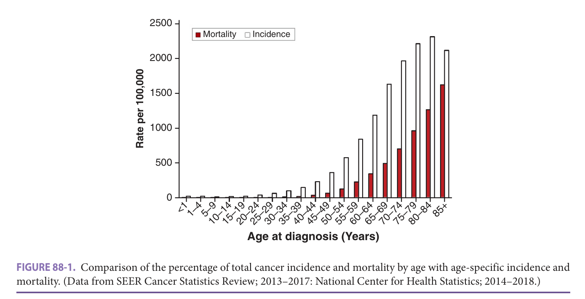
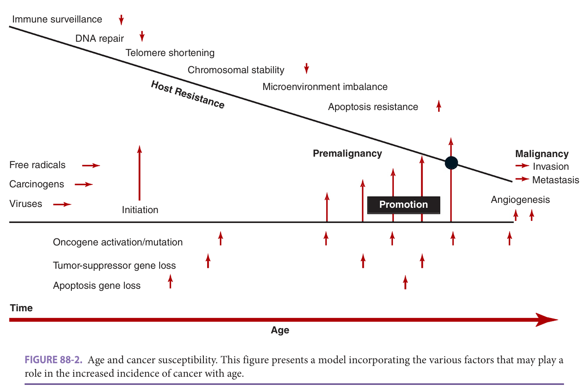
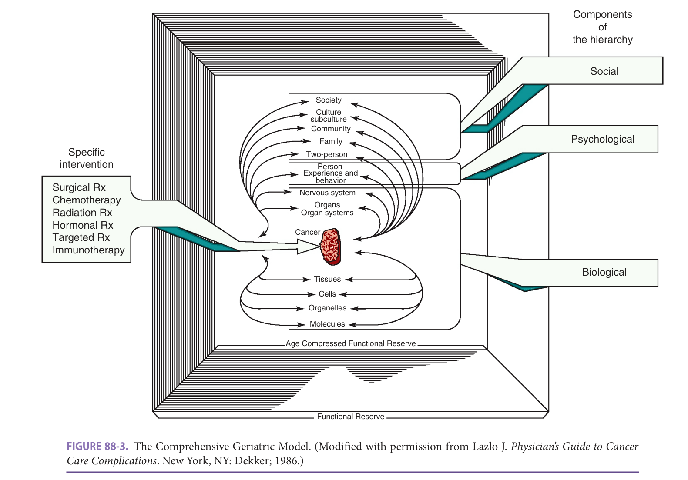
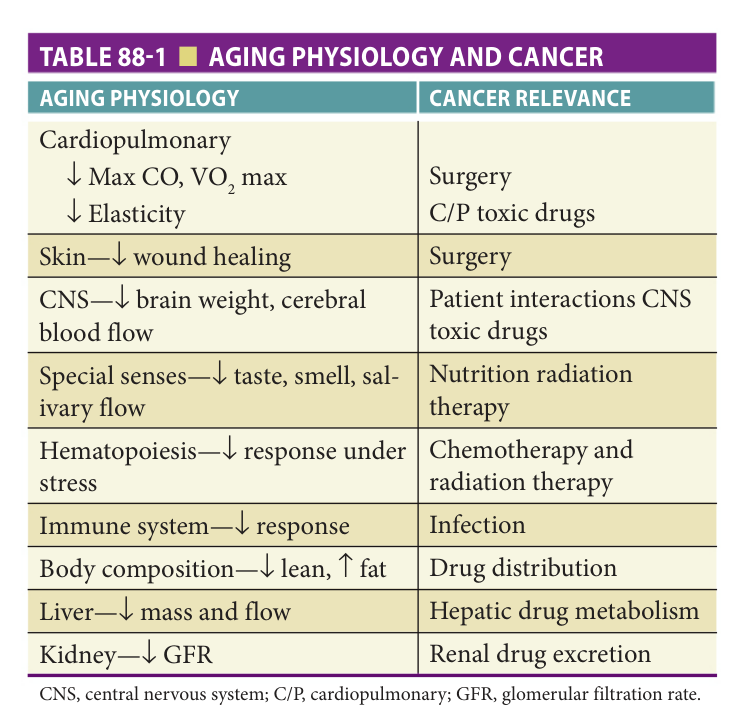
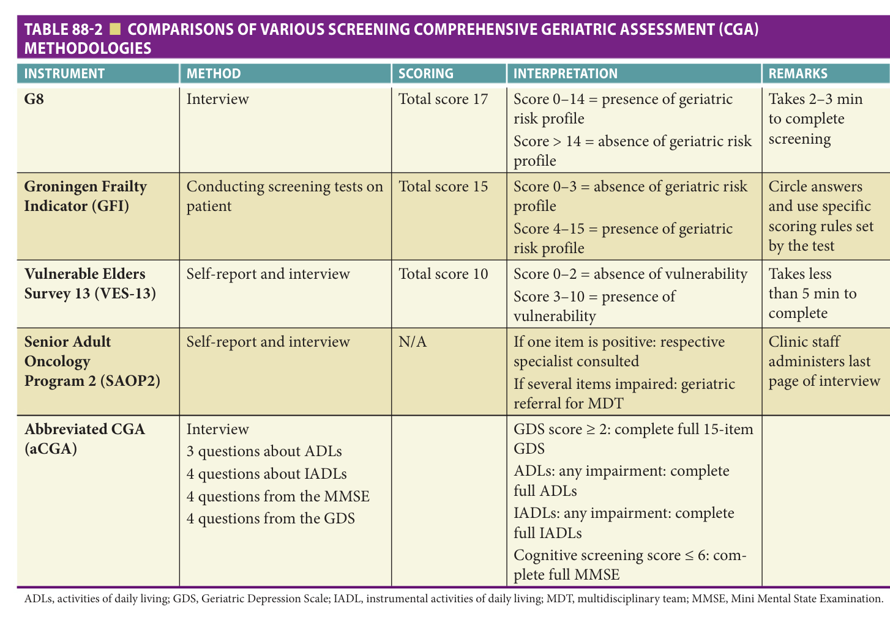

# Hazzard's Geriatric Medicine and Gerontology, 8e — Chapter 88: Cancer and Aging: General Principles

Carolyn J. Presley, Harvey Jay Cohen, Mina S. Sedrak

> **Fast build from the book, 22-23 Sep; not lane-reviewed.**

**[p. 1381]**

#### Learning Objectives

- Identify risk factors inherent in the aging process that may promote neoplasia.
- Apply an understanding of lifespan and patient-centered choice to cancer screening recommendations.
- Integrate the concept of comprehensive geriatric assessment (CGA) and personal choice into cancer treatment decisions and individual management plans.
- Become aware of age-related factors that influence the risk of toxicity from cancer treatment such as radiation, surgery, or systemic treatment (eg, chemotherapy, immunotherapy).

#### Key Clinical Points

1. Aging is associated with an increasing risk of developing cancer, with a number of mechanisms likely contributing including duration of exposure to carcinogens, susceptibility to DNA and other cellular damage with impaired repair mechanisms, a proneoplastic environment (eg, low-level inflammation), and impaired immune surveillance.
2. The 5-year survival rate for most cancers decreases with advanced age; many factors may contribute including altered tumor biology (ie, more aggressive tumor behavior), tolerance to therapy, and the presence of multiple comorbidities.
3. Age bias in diagnostic and treatment decisions for older adults with cancer exists. Older adults are continually underrepresented in clinical trials.
4. Although performance status (eg, Eastern Cooperative Oncology Group [ECOG] performance score) is routinely applied to patients with cancer, a CGA that includes assessment tools to predict functional age based on physical function, comorbidities that may interfere with cancer therapy, nutritional status, polypharmacy, psychological and cognitive status, socioeconomic issues, and geriatric syndromes has been shown to add substantial prognostic information for older adults.
5. Patients and their caregivers should continually discuss goals of care throughout the course of their disease with the treating oncologist and primary care physician.

## Introduction

This chapter discusses many of the general relationships of cancer and aging. It focuses on the epidemiologic, basic etiologic, and biological relationships between the processes of aging and neoplasia and the generalizable aspects of management of cancer in the older patient. The approach to specific malignancies is covered in subsequent chapters related to the appropriate organ system. Cancer is a major problem for older adults. It is the second leading cause of death after heart disease in the United States and age is the single most important risk factor for developing cancer. Over 60% of all newly diagnosed malignant tumors and 70% of all cancer deaths occur in persons 65 years or older according to the National Cancer Institute (NCI). If one examines incidence and mortality data obtained from the NCI’s Surveillance, Epidemiology, and End Results (SEER) Program ( **Figure 88-1** ), one sees that age-specific cancer incidence and mortality rise progressively throughout the age range. While the rate of incidence increase diminishes somewhat in the oldest age groups, and the rate actually falls slightly in the very oldest (perhaps a survivor effect), the overall risk for developing cancer is certainly greatest in the later years. Because the number of people in this country older than age 65 is rising rapidly and the oldest of the old, that is, those older than age 85, are increasing at the greatest rate, geriatricians, generalists, and internists will be encountering an increasing number of older adults with cancer in their practices and within the entire health care system.

Data from the SEER Program show that 5-year survivals for most types of cancer decrease with advancing age. Possible explanations include an altered natural history of some cancers, competing comorbid medical conditions, decreased physiologic reserve compromising the

**[p. 1382]**

ability to tolerate therapy, physicians’ reluctance to provide aggressive therapy, and barriers in the older person’s access to care. Communication between health care providers and older patients may be hampered by deficits in hearing, vision, and cognition. The older cancer patient often has an older caregiver, and the diagnosis of cancer often affects the health-related quality of life of both individuals. Thus, not only does cancer occur at an increased rate in older individuals, but it makes a significant impact on such people’s lives, from the standpoint of both increasing morbidity and mortality. All of these challenges contribute to defining “geriatric oncology” as a true subspecialty and has

led to the development of guidelines by the National Comprehensive Cancer Network (NCCN) that addresses special considerations in older patients with cancer.

## Relationship Between Aging And Neoplasia

The processes resulting in the evolution of neoplasia and those resulting in aging involve many of the same biological mechanisms, known respectively as the Hallmarks of Cancer and the Hallmarks of Aging (eg, genetic instability, proteostasis, stem cell function, metabolism, intercellular communication), but generally working in opposite directions. In the genesis of neoplasia, they result in accumulation of damage leading to increased cell proliferation, while in aging, they result in reduced cell proliferation or cellular senescence. Thus cancer and aging have often been referred to as opposite sides of the same coin. Both are multistage processes. Neoplasia proceeds through a series of changes known as initiation, or the first “hit”; promotion, where cell proliferation increases; and progression, itself a multistage step, resulting in the transformation of a cell from a premalignant to a malignant state. Local invasion and/or distant metastasis may then ensue but the mechanisms governing these processes are less well understood. As described elsewhere (see Chapter 1), aging also involves sequential accumulation of alterations in similar mechanisms but in what appears to be a less distinctly separated set of events.

Gene regulation is a particularly important aspect of neoplastic evolution. Broadly there are two types of genes involved; oncogenes, which when mutated transform cells from pre-malignant to malignant, and suppressor genes which generally prevent uncontrolled cell growth. Oncogene activation or suppressor gene inactivation can result in malignant tumor formation. It is generally felt that multiple genetic alterations are required for the progression to malignancy, with each subsequent “hit” increasing the

> *FIGURE 88-1. Comparison of the percentage of total cancer incidence and mortality by age with age-specific incidence and mortality. (Data from SEER Cancer Statistics Review; 2013–2017: National Center for Health Statistics; 2014–2018.)*

> Highlighting is the owner's annotation, not the book's.

**[p. 1383]**

likelihood of malignancy. It has become apparent in recent years that while gene alterations are important in this process, changes in the environment in which these cells live plays a critical role in neoplastic evolution. This may be of particular importance in the aging/cancer relationship as will be discussed further below.

There are several theories on how the aging process influences the process of neoplastic transformation to result in the markedly increased rates of cancer in older adults. These include the following:

1. Longer duration of carcinogenic exposure: It is possible that aging simply allows the time necessary for the accumulation of cellular events to develop into a clinical neoplasm. There is evidence for age-related accumulation and expression of genetic damage. Somatic mutations are believed to occur at the rate of approximately 1 in 10 cell divisions, with approximately 10 cell divisions occurring in a lifetime of a human being. Certainly, the complex set of events required in the multistep process of carcinogenesis, for example, as described for colon cancer in humans, does occur over time. The passage of time alone, however, is not likely to explain the entire cancer phenomenon. The time required for a mutated cell to become a malignant cell and then subsequently to become a detectable tumor has been estimated to be approximately 10% to 30% of the maximum lifespan for a given animal species, which may vary from just a few years to more than 100 years.

2. Altered susceptibility of aging cells to carcinogens: Data regarding carcinogen exposure are contradictory. In some cases, the incidence of skin tumors in mice produced with benzpyrene has been more related to dose than to age, whereas in other models, accelerated carcinogenesis as a function of age has been demonstrated, as, for example, when dimethylbenzanthracene (DMA) was applied to skin grafts of young and old mice. An age-related increase in the sensitivity of lymphocytes to cell-cycle arrest and chromosome damage after radiation has been demonstrated. It is also possible that there are alterations in carcinogen metabolism with age, but the findings from such studies have also been contradictory.

3. Decreased ability to repair DNA: It is possible that damage, once initiated, is more difficult to repair in older cells. A number of studies demonstrate decreased DNA repair as a function of age following damage by carcinogens as well as radiation. Such repair failures may also be reflected in increased karyotype abnormalities in aged normal cells as well as in older patients with neoplastic disease.

4. Oncogene activation or amplification or decrease in tumor-suppressor gene activity: These processes might be increased in the older adult, resulting either in increased action or promotion or in differential clonal evolution. Although evidence is currently limited, there have been observations of increased amplification of

proto-oncogenes and their products in aging fibroblasts in vitro as well as evidence for increased c-myc transcript levels in the livers of aging mice. Alternatively, such factors as genetic alterations or DNA damage could lead to inactivation of cancer-suppressor genes. Given that age-related mutations frequently appear to result in the loss of function, alterations in tumor-suppressor genes may prove to be an important mechanism.

5. Telomere shortening and genetic instability: The function of telomeres and the enzyme telomerase appears to be intimately involved in both the senescence and neoplasia processes. Telomeres, the terminal end of all chromosomes, shorten progressively as cells age. This functional decline begins at age 30 and continues at a loss of approximately 1% per year. Because the major function of telomeres is to protect the stability of the more internal coding sequences, that is, allow cells to divide without losing genes; the loss of this function may lead to genetic instability, which may promote mutations in oncogenic or tumor-suppressor gene sequences. Without telomeres, chromosome ends could fuse together and degrade the cells’ genetic blueprint, making the cell malfunction, become cancerous, or even die.

6. Cellular senescence and the microenvironment: Older adults have been shown to accumulate senescent cells as shown by β-galactosidase staining and other methods. A number of factors in the tumor microenvironment are critical for the development of the malignant phenotype, especially invasion and metastasis. There is accumulating evidence showing that senescent cells can have deleterious effects on the tissue microenvironment. The most significant of these effects is the acquisition of a “senescence-associated secretory phenotype” (SASP) that turns senescent fibroblasts into proinflammatory cells (secreting factors such as inflammatory cytokines like IL-1 and IL-6) and epithelial growth factors (eg, heregulin and matrix metalloproteinases like MMP-3), which can have the ability to promote tumor progression. A variety of stresses can provoke cellular senescence and include telomere dysfunction resulting from repeated cell division (termed replicative senescence), mitochondrial deterioration, oxidative stress, severe or irreparable DNA damage and chromatin disruption (genotoxic stress), and the expression of certain oncogenes (oncogene-induced senescence). These stresses can be induced by external or internal chemical and physical insults encountered during the course of the lifespan, during therapeutic interventions (eg, radiation or chemotherapy), or as a consequence of endogenous processes such as oxidative respiration and mitogenic signals.

In early life, cellular senescence suppresses cancer by arresting cells at risk of malignant transformation. However, their ability to promote carcinogenesis in later life as described above suggests that the senescence response is antagonistically pleiotropic. Thus, a function

**[p. 1384]**
important for the organism in early life (through the reproductive period) will be selected for, despite the fact that it may be quite injurious in later life. In this sense senescence could be viewed as the price we pay in later life for the rigorous attempt to control proliferation to avoid neoplasia early on. Recently drugs that destroy or inhibit senescent cells (senolytics) have been studied for their potential to delay aging and age-related diseases such as cancer.

7. Decreased immune surveillance: A decrease in immune surveillance, or immunosenescence, could contribute to the increased incidence of malignancies. In animal models there is a considerable amount of evidence for a loss of tumor-specific immunity with progressive age. This includes the altered capacity of old mice to reject transplanted tumors, the close relationship between susceptibility to malignant melanomas and the rate of age-related T-cell–dependent immune function decline, and the ability by immunopharmacologic manipulation to increase age-depressed tumoricidal immune function and to decrease the incidence of spontaneous tumors. The evidence linking such data to age-associated immune deficiency and the rise of cancer incidence in humans, however, is mainly circumstantial and not likely to be fully explanatory, as the types of tumors seen in the most striking examples of immune deficiency are very different from those seen in the usual aging human.

**Figure 88-2** summarizes in a schematic fashion the potential interaction of these many factors that may be

of importance in the increase of cancer with age. It indicates the interface of time- and age-related events, such as free radical and other carcinogenic exposure, resulting in initiation, then cumulative promoting events, including mutations and other alterations in critical genes, which ultimately exceed a threshold of host resistance factors, which have been progressively reduced during the aging process.

## Clinical Presentations And Disease Behavior

## Screening In Asymptomatic Individuals

Older adults continue to be both underscreened and thus underdiagnosed with cancer, as well as overscreened and placed at increased risk of overtreatment. It is well known that mammography and Papanicolaou (Pap) tests are underutilized in certain older racial and ethnic minority groups, and in those who have less than high school education or live below the poverty level. On the other hand, there is general agreement that routine cancer screening has little likelihood to result in a net benefit for individuals with limited life expectancy. Despite this a number of studies have continued to show that screening is common in individuals with less than 5-year life expectancy, and even in many in nursing homes with severe disability who could likely not benefit from treatment. Cancer screening in such patients not only has implications for utilization of health care resources in a setting unlikely to result in net benefit but may also cause net patient harm owing to subsequent

> *FIGURE 88-2. Age and cancer susceptibility. This figure presents a model incorporating the various factors that may play a role in the increased incidence of cancer with age.*

> Highlighting is the owner's annotation, not the book's.

**[p. 1385]**

diagnostic procedures and overtreatment. A general approach to screening that may help avoid these problems is discussed in Chapter 12, and approaches in specific tumor types are discussed in Chapters 38 and 89 to 93.

## Initial Presentation

As an extension of the screening concept, the goal for initial cancer detection is to make the diagnosis as early as possible, with the hope that treatment at the earliest stages of disease would yield the best survival rates. It is, therefore, of great importance that both patient and physician pay attention to symptoms that may herald the onset of the neoplastic process. Current evidence suggests that once having noticed a symptom that appears to be related to cancer, most older individuals do not delay appreciably in seeking medical help. In one study from New Mexico of 800 patients over 65 years, only 29% of the subjects were asymptomatic when cancer was detected, and 48% presented within 2 months of symptom onset. However, 19% of the subjects delayed seeking care for at least 12 weeks and 7.4% delayed at least 1 year. Older women, who are at greater risk of developing breast cancer, are also more likely to delay their presentation. Physicians may also play a role in delaying further diagnostic pursuits in older patients. Part of the problem may lie in a failure to recognize some of the new signs and symptoms in patients with multiple disease processes. It is easy to attribute such symptoms as anorexia, weight loss, or decrease in performance status to social or psychological changes. The increasing prevalence of findings such as anemia in older patients may lower the index of suspicion for attributing the factor to a new specific neoplastic process. Hence, symptom awareness and appraisal by patients and doctor is an important determinant of timely presentation and investigation, although it must be balanced by judgment concerning the risk-benefit ratio for diagnostic evaluations in individual patients depending on their other medical status. For example, the initial discovery of a new symptom in a previously totally well, active 80-year-old may be pursued rather differently than a similar discovery in a severely demented, bedbound individual with severe congestive heart failure, diabetes, and pulmonary failure.

## Biological Behavior Of Tumors In The Older Host

The effect of the aging process on the clinical course of cancer, or to put it another way, whether cancer behaves differently in the older individual, is not clear cut. Although the SEER data noted previously suggested that in many cancers the 5-year survival rate is lower for older people, it is possible that this is related more to comorbid disease and other factors rather than simply to aging per se. On the other hand, there is a widespread belief that cancers may behave more indolently in older patients. These are important issues because they may to a considerable degree, affect decisions regarding treatment. Both clinical and experimental evidence support both sides of this issue, and it is likely that there is a spectrum of responses

dependent on initial tumor types as well as individual host status. One indicator of the phenomenon is the extent of disease at presentation. For most cancers examined, there has been no consistent difference in the stage of disease or presentation for different age groups. For those that have been determined, the directions are not always the same. For malignant melanoma, older patients have been consistently found to have more advanced-stage local disease with deeper penetrating lesions at presentation. For breast cancer, some studies show a greater proportion of older patients with distant metastatic spread at presentation, whereas for lung cancer the opposite has been found, and older patients have been noted to present with localized disease in a greater proportion of cases. Uterine and cervical cancers have in some cases been noted to be later in the course of disease at presentation in older individuals. Of course, even these differences might be related to such phenomena as delay in the patient’s presenting for diagnosis, delay in pursuing the diagnosis, intensity of diagnostic endeavors, or a combination of these factors, or, on the other hand, a greater chance for a serendipitous finding because of more frequent visits to physicians.

Another biological factor that may influence neoplastic behavior in differently aged hosts is the histologic subtype of the tumor. Thus, while thyroid cancer overall appears to behave more aggressively in the older host, it is also true that a larger proportion of thyroid neoplasia in older patients is made up by anaplastic carcinoma, which at any age has more aggressive behavior. Similarly, for malignant melanoma, although there is an increased proportion of older people who have melanomas of poor prognostic histologic type and location at presentation, older individuals have a poorer prognosis for survival than do younger ones independent of this phenomenon even for localized disease. Such biological differences may be manifested in other ways, as in the case of breast cancer, in which older women have an increased frequency of estrogen receptor–positive breast cancer, probably related to hormonal influences of the postmenopausal state. An additional factor is the longer tumor doubling time seen in breast cancer cells from older women. Because estrogen receptor (ER) positivity and longer doubling times are associated with better prognosis, with more slow-growing tumors, and with longer disease-free survivals, these phenomena, rather than age per se, might provide the reason why this cancer appears to behave more indolently in an older individual. Despite this, overall cancer-related survival is lower in older women, emphasizing the complex interactions of tumor and host that must be considered.

Acute myelogenous leukemia (AML) has a much poorer prognosis in older patients and the biology underlying the poor prognosis and poor treatment outcome of AML in the older adult has been extensively studied. Among the findings to date are a high incidence of poor-prognosis karyotypes (5q-, 7q-), high frequency of preceding myelodysplastic syndromes, and an increased expression of proteins involved in intrinsic resistance to chemotherapeutic agents.

**[p. 1386]**

> Compared to younger patients, leukemic blasts from older patients with AML had a lower propensity to apoptosis following traditional remission-induction treatment with ara-C and daunorubicin. Gene-expression studies have demonstrated that older AML patients tend to have worse survival compared to their younger counterparts which may be driven in part by an increased expression of ras, src, and tumor necrosis factor (TNF) pathways in the bone marrow of older patients.

Experimental data in animal models likewise show this spectrum in rate of tumor growth and progression as a function of age. In these studies, the ability to contain tumor growth depends on the particular host tumor system used, thus mimicking the clinical situation to some extent. A proposed explanation for the situation in which the older host more effectively controls the rate of tumor is a paradoxical effect of decreasing immune function with age, that is, decreased activity of those cells in the old host’s immune system, which, under the stimulation of the neoplastic process, produce tumor-enhancing factors such as angiogenesis factor. When this occurs, tumor growth might be expected to be diminished. To what extent these various factors play a role in the biological behavior of neoplasia in the human aging host remains a fascinating puzzle to be unraveled.

## Management

### General Principles

Balancing the benefits and risks of cancer treatment in older patients is challenging because of the dearth of high-quality, evidence-based studies. Older adults, especially those with age-associated vulnerabilities, remain vastly underrepresented in research that sets the standards for the safety and efficacy of cancer treatments. This lack of evidence puts this group at high risk of clinical uncertainty that leads to both under- and overtreatment.

To help inform treatment decisions, expert panels and guidelines have been developed regarding the practical assessment and management of older patients with cancer. In this section, we will review the general approach that treating physician should consider when caring for older patients with cancer. We discuss the Comprehensive Geriatric Model framework, which accounts for biological, psychological, social, and treatment factors involved in the patient’s well-being, and highlight the need to individualize treatment decisions. We also review use of biological and clinical markers in the evaluation of older adults with cancer and discuss the role of aging-directed interventions in improving treatment for this rapidly growing population.

## The Comprehensive Geriatric Model

Physicians cannot rely on chronological age alone when making decisions related to the treatment of older patients with cancer. Aging is a heterogeneous process that is not captured by chronological age. There is substantial

heterogeneity in the physiologic and functional characteristics of older persons. We proposed one framework in which the general aspects of treatment decision-making can be considered for the individual older patients with cancer. This is shown in **Figure 88-3** and is called the Comprehensive Geriatric Model. It graphically presents a number of the concepts critical to the care of the older adult, that is, that there is a decreased functional reserve and that, as an extension of Engel’s Bio-Psycho-Social Model, all of these various aspects of the individual’s background must be taken into account when making decisions about the new process, that is, the cancer. Each of these levels, for example, biological or psychosocial, can create interactions that influence both the cancer and the host, and, likewise, any intervention directed at the cancer may influence both the cancer and each of these levels of the host’s function. Conversely, each of these levels of function, when compromised by the aging process or other comorbid diseases, may influence the ability to deliver these various interventions. Thus, in a sense, a conceptual checklist is presented in which a four-way interaction of various factors can be systematically considered when making decisions. Examples of ways in which physiologic changes occurring with age can impact on cancer treatment are shown in **Table 88-1** .

## Biological Markers Of Aging

Attempts to characterize or measure the cellular and molecular level of change that occurs with aging and that might be usefully applied in the context of cancer have been explored. However, it has been difficult to identify biological measurements that accurately reflect individual’s physiological or functional age. Many biomarkers of aging have been studied, although no single biomarker or combination of biomarkers has been sensitive or specific enough to accurately assess the physiologic aging process.

The most widely studied biomarkers of aging have been markers of inflammation. Aging is associated with increased levels of circulating cytokines and proinflammatory markers. Age-related changes in the immune system, that is, immunosenescence, and increased secretion of cytokines by adipose tissue, can lead to a state of chronic inflammation or “inflammaging.” High levels of IL-6, IL-1, TNF-α, and C-reactive protein in older adults are associated with increased risk of morbidity and mortality. In particular, cohort studies in older subjects have indicated that increased TNF-α and IL-6 levels are associated with frailty as well as several cancer-related symptom complexes including cachexia, fatigue, poor performance status, and cognitive issues.

Markers of cellular senescence, such as p16INKa, a component of the cell cycle, has been shown to increase with chronological age and chemotherapy exposure in patients with breast cancer. This may represent a promising biomarker that links aging, cancer, and cancer treatment.

Epigenetic age or clock, an estimation of biological age using DNA-methylation based biomarkers, may also

**[p. 1387]**

> *FIGURE 88-3. The Comprehensive Geriatric Model. (Modified with permission from Lazlo J. _Physician’s Guide to Cancer Care Complications_ . New York, NY: Dekker; 1986.)*

> Highlighting is the owner's annotation, not the book's.

be an important assessment of biological aging in cancer. Individuals with epigenetic age that surpasses their chronological age have an increased risk of all-cause mortality, even after adjusting for other risk factors. However, more research is needed, to enhance our understanding of biological measures of aging that are clinically meaningful, reliable, and feasible to obtain in older patients with cancer.

> *Table 88-1 reproduced as a page image (printed p. 1387) — the grid did not extract reliably as text for this fast build.*

> Highlighting is the owner's annotation, not the book's.

## Clinical Markers Of Aging

In the absence of an easily measurable or precise marker of aging, clinical tools remain the gold standard for evaluating an individual’s functional and physiologic status in older patients with cancer. The multidimensional CGA (as described in detail in Chapter 8) has been demonstrated to be feasible in both daily clinical practice and oncology clinical trials, and the American Society of Clinical Oncology (ASCO), the National Comprehensive Cancer Network (NCCN), and the International Society of Geriatric Oncology (SIOG) have all recommended performing a CGA in all older patients with cancer receiving systemic therapy.

Traditionally in oncology, performance status (PS) is used as an attempt to quantify cancer patients’ general well-being and is also utilized to determine whether they can receive chemotherapy. The most commonly used measure, the Eastern Cooperative Oncology Group (ECOG) PS runs from 0 to 5, with 0 denoting perfect health and 5, death. However, in the geriatric oncology population, it has been demonstrated that ECOG PS alone is not sufficient, and CGA adds substantial information to the functional

**[p. 1388]**

> assessment of older cancer patients, including patients with a good ECOG PS.

The CGA has proved very useful in assessing the functional age of an older adult. It can uncover problems that would not otherwise be identified by routine history and physical or by the traditional oncology performance status tools. A CGA comprises several domains, including functional status, comorbidities that may interfere with cancer therapy, nutritional status, polypharmacy, psychological and cognitive status, socioeconomic issues, and geriatric syndromes. The CGA identifies clinically significant aging-related problems, such as risk for falls and cognitive impairment.

The CGA can identify patients age 65 or older at increased risk of experiencing chemotherapy toxicity. In one study, by the Cancer and Aging Research Group (CARG), geriatric assessment variables along with sociodemographics, tumor/treatment variables, and laboratory test results were incorporated into a model that would predict for chemotherapy toxicity in older adults. This model identified older adults at low (0–5 points; 30%), intermediate (6–9 points; 52%), or high risk (10–19 points; 83%) of chemotherapy toxicity ( _p_ < 0.001). In another study the Chemotherapy Risk Assessment Scale for High-Age Patients (CRASH) determined that patients with lowrisk scores had only a 7% chance of hematologic and 33% chance of nonhematologic toxicity compared to high-risk patients, who had a 100% risk of hematologic and 93% risk of nonhematologic toxicity from chemotherapy.

To identify patients who are likely to benefit from undergoing a CGA, a series of screening instruments have been designed and evaluated in older cancer patients as listed in **Table 88-2** . These screening tools can be easily performed by health care providers in a busy clinical setting. A complete assessment can be performed after screening and one that is increasingly being used in North America in clinical trials performed by cooperative groups, includes measures reflecting the domains of a CGA. The geriatric assessment tool primarily consisted of self-reported measures, which were completed by the patient. Three items were completed by the health care professional. The median time to complete the CGA tool was 22 minutes, and 87% of patients completed their portion without assistance.

## CGA-Guided Interventions

Although high-quality data support the use of the CGA to identify geriatric syndromes and to predict mortality and chemotherapy toxicity, evidence supporting the implementation of CGA-guided processes for informing cancer treatment has been limited. Recent randomized clinical trials have assessed the effectiveness of CGA-guided interventions for older adults with cancer. In one study, a cluster randomized controlled trial in community practices, investigators analyzed the effect of providing oncologists CGA-guided recommendations on treatment-related

toxicity in patients aged 70 or older with advanced cancers and at least one geriatric deficit or syndrome. Forty-one practices, which included 718 patients, were randomized to the CGA intervention or to usual oncologist-directed care alone. Findings revealed that the intervention arm had an absolute reduction in toxicity of 20% when compared with the usual care arm. Another study, a singlecenter randomized controlled trial, examined the effect of a multidisciplinary team (MDT) CGA-guided intervention on treatment-related toxicity in patients 65 years or older with solid tumors (any stage) starting a new line of chemotherapy. Patients in the intervention arm underwent a CGA that was then reviewed by the MDT, which implemented tailored interventions. In the usual care arm, the treating oncologist received the CGA results, but no interventions were implemented. In the 620 patients randomized, a 10% reduction in chemotherapy toxicity was observed in the intervention arm compared with the usual care arm. These studies demonstrate that CGA-guided interventions can in fact lead to decreased treatment toxicity and improve key outcomes for older patients with cancer. However, more effort is needed to address the barriers to widespread implementation of geriatric oncology care, including health care system-level organizational issues, lack of time, limited staffing, lack of training and familiarity with available tools, and unclear reimbursement rules.

## Major Therapeutic Modalities

## Surgery

Surgery and other invasive procedures are frequently involved in initial diagnostic as well as in therapeutic approaches to the older adult with cancer. An increased number of comorbid medical conditions, decreased wound healing, and lack of physiologic reserve contribute to both prolonged hospital stay and rehabilitation following operative treatment. All phases of healing are compromised by the aging process. Both the inflammatory and proliferative responses are decreased, remodeling occurs to a lesser degree, and the collagen formed is qualitatively different from that in younger individuals. Normally, the repair process initiated by inflammation requires intact sensory nerves that stimulate increased blood flow and growth factor production. The loss of sensory neurons and the coexistence of other medical conditions, such as diabetes and vascular disease, contribute to delayed wound healing. Additionally, complications are more common when surgical intervention is performed on an emergency basis. Often, it is more appropriate to perform an operation as a preventive measure when dealing with older populations; for example, a hemicolectomy may be performed—even for patients with advanced colorectal cancer—to prevent the need for an emergency operation to treat bowel perforation or obstruction. Increasingly CGA and geriatric comanagement are being applied to the evaluation and preparation

**[p. 1389]**

> *Table 88-2 reproduced as a page image (printed p. 1389) — the grid did not extract reliably as text for this fast build.*

> Highlighting is the owner's annotation, not the book's.

> of older patients for surgery as well as to guide postoperative management. Geriatric comanagement can lead to improved 90-day postoperative mortality. The American Geriatrics Society Task Force and the American College of Surgeons provide general guidelines for older adults undergoing surgery and these may be applied to older patients with cancer undergoing surgery.

## Radiation Therapy

Radiation therapy (RT) can be used in the older adults with cancer with both curative and palliative intent. RT is also used as an effective adjunct to surgery or chemotherapy or both. The International Society of Geriatric Oncology (SIOG) Task Force has put forth guidelines for best practices in radiation oncology in older adults. Per these guidelines, patient selection should include comorbidity and geriatric evaluation. In older adults with breast cancer, shorter courses of hypofractionated whole breast RT are safe and effective. In patients with non-small-cell lung cancer (NSCLC), conformal radiotherapy and involved field techniques without elective nodal irradiation have improved outcomes without increasing toxicity. If comorbidities preclude surgery, stereotactic body radiotherapy (SBRT) is an option for early stage NSCLC and pancreatic cancer. For patients with lymphoma, involved field radiotherapy (IFRT) may be based on pretreatment positron emission

tomography (PET) data to reduce toxicity. For patients with intermediate-risk prostate cancer, 4 to 6 months of hormonal therapy combined with external-beam radiotherapy (EBRT) may be an option. Short-course EBRT is an alternative to combined modality therapy in older patients with rectal cancer without significant comorbidities. Endorectal RT may be an option for early stage disease. For primary brain tumors shorter courses of postoperative RT following maximal debulking provides equivalent survival to longer schedules. Stereotactic RT provides an alternative to whole-brain RT in patients with limited brain metastases. Intensity-modulated radiotherapy provides an excellent technique to reduce dose to the carotids in head and neck cancer and improves locoregional control in esophageal cancer. It is crucial to monitor older patients receiving radiation since the effects of radiation on normal tissue may be enhanced by 10% to 15% in the older patient. Radiation to the oral pharynx and oral cavity can produce a loss of taste, dryness of mucous membranes, and involution of salivary glands, which when combined with a precarious nutritional intake in a frail and older individual might be lethal, or certainly contribute a considerable amount of morbidity, if not recognized. Moreover, if daily treatment is tolerated poorly, owing to nausea or weakness, treatment may be compromised because of the decreased daily doses, the patient’s unscheduled absences, or decrease in the total

**[p. 1390]**

> planned dose. Pulmonary complications such as severe radiation pneumonitis have been noted to occur more frequently in older adults with lung cancer versus younger patients, regardless of radiation field size and concurrent therapies. Depression, disabling fatigue, and cognitive decline are potential side effects of whole-brain RT.

## Systemic Therapy

**Chemotherapy** A thorough discussion of the principles of pharmacology in older adults can be found in Chapter 22. Although still understudied, in recent years there have been more direct studies of the effect of age on the pharmacokinetics of orally or parenterally administered chemotherapeutic agents. Changes in organ function with age and the declining ability of senescent cells to repair DNA damage increase the incidence and severity of chemotherapyrelated toxicity. For example, increased destruction of and lower numbers of rapidly renewing mucosal stem cells increase susceptibility to mucositis. Reduced hematopoietic stem cell reserve may both worsen the severity and slow recovery of cytopenias.

When oral agents are used, despite delayed gastric emptying, absorption is adequate but one must pay attention to concomitant medications like H2 blockers, antacids, and proton pump inhibitors. Caution must be exercised when administering cytotoxic drugs like methotrexate, bleomycin, cisplatin, and ifosfamide. Both decreases in the number of nephrons and a decline in the glomerular filtration rate may contribute to excess toxicity. Also, there is a decrease in lean body mass in the older adult, thus, adjusting the dose based on a creatinine clearance and not merely the creatinine is very important. In addition, concomitant administration of drugs like nonsteroidal anti-inflammatory drugs may compromise renal function. Although the reasons are unclear, acute toxicities like nausea and vomiting occur less frequently in older patients; however, the lack of functional reserve can lead to catastrophic outcomes quickly, that is, dehydration and renal insufficiency. Neurotoxicity secondary to taxanes, platinum agents, vincristine, high-dose cytarabine, and bortezomib; cardiotoxicity from doxorubicin; and mucositis from 5-fluorouracil are all more common and severe in older patients.

Despite this knowledge, there is a persistent lack of prospective data for older patients, particularly for those patients older than 80 years, in cancer treatment clinical trials. However, the SIOG Task Force has published guidelines for dose modification of chemotherapy in older patients with renal insufficiency and has reviewed the use of certain classes of drugs: alkylators, antimetabolites, anthracyclines, taxanes, camptothecins, and epipodophyllotoxins. As described previously, a CGA is helpful when incorporated with other parameters to predict for the risk of toxicity in older adults.

**Hormonal therapy** Older women are more likely to have ER-positive tumors and approximately 70% to 80% of all breast tumors in older patients express ER. Thus, tamoxifen,

and aromatase inhibitors like anastrozole and letrozole have been used widely in the neoadjuvant, adjuvant, and metastatic setting. These drugs each have their own side effects. The well-known higher risk of thromboembolic events and cerebrovascular accidents reported with tamoxifen should be taken into account when proposing this treatment to a patient already suffering from severe peripheral venous insufficiency, hypertension, and/or atrial fibrillation. On the other hand, because of the increased risk of osteoporosis and bone fractures with aromatase inhibitors, fracture risk should be assessed and recommendation with regard to exercise and calcium/vitamin D supplementation given. Bone-directed therapy should be given to all patients with a T score less than −2.0 standard deviations (SD), or with a T score less than −1.5 SD with one additional risk factor, or with two or more risk factors (without bone mineral density). Androgen-deprivation therapy with luteinizing hormone–releasing hormone (LHRH) agonists and antiandrogens is used in older men with prostate cancer. Side effects of impotence, breast tenderness, hot flashes, osteoporosis, and memory decline are common with these - agents.

## Targeted Therapies

There has been an exponential increase in both the approval and use of targeted therapeutic agents in the past decade due to “precision medicine.” Precision medicine aims to target a specific genetic alteration with a specific drug. This tailored approach includes many drugs that are oral including tyrosine kinase inhibitors, mammalian target of rapamycin inhibitors, drugs targeted to the human epidermal growth factor receptor 2, and BRAF-mutation targeted drugs. While, there have not been dedicated clinical trials for use among older adults, the data have been extrapolated from larger trials in which older patients generally were a fraction of the participants. Many of these agents are orally administered, and older patients with comorbidities often are on many other medications, which may be metabolized by the cytochrome P450 liver enzymes. Thus, the treating oncologist, geriatrician, and primary care physician should be aware and prepare for significant drug interactions when these new agents are taken concomitantly with P450 inhibitors or inducers. One study has demonstrated that comorbidities and polypharmacy impacted cytogenetic response rates in older adults with chronic myeloid leukemia being treated with imatinib. In addition, while these drugs have a favorable safety profile compared to parenteral chemotherapy, there is still a risk of toxicity, leading to a higher rate of dose reduction and discontinuation among older versus younger patients.

## Immunotherapy

Immunotherapy is one of the newest treatments that has revolutionized cancer care. Immunotherapy uses the body’s own immune system to recognize and kill cancer cells. Cancer cells manipulate immune checkpoints evading

**[p. 1391]**

cell death. One of the main types of immunotherapy are immune checkpoint inhibitors (ICIs, eg, pembrolizumab, nivolumab, ipilimumab, atezolizumab). ICIs block the checkpoint between the tumor cells and regulatory T cells that would result in downregulation of activated T cells, thereby upregulating T-cell activity. ICIs treat many cancer types including melanoma and lung, bladder, colorectal, and renal cell carcinoma, among others. While there are many new ICIs available, clinical trials predominantly include younger and the most healthy adults, limiting the generalizability of outcomes to older adults. The most common side effects are fatigue, rash, itching, diarrhea, and elevated liver function tests. One main issue is the occurrence of immune-related adverse events (irAEs). irAEs can affect almost every organ in the body due to dysregulation of the immune system causing colitis, pneumonitis, hepatitis, rash, thyroiditis, arthritis, myocarditis, and hypophysitis among others. While some irAEs can be mild, a subset can be severe requiring high-dose steroids and hospitalizations. Due to a proinflammatory aging host environment, termed “inflammaging”, the concern is that older adults are at higher risk for irAEs. Recent data demonstrate equivalent incidence of high-grade irAEs, but worse overall survival among older adults regardless of cancer type who experience high-grade irAEs versus young adults with metastatic cancer. This may be due to side effects from the treatment of high-grade irAEs (steroids and hospitalization), which are often much less tolerated in older adults. Though a potential risk, the use of immunotherapy in general is producing durable long-term survival for some patients with advanced cancer.

## Hematopoietic Stem Cell Transplantation

Hematopoietic stem cell transplantation (HSCT) is a widely utilized treatment modality for high-risk hematologic malignancies. Historically, the associated morbidity and mortality limited the use of allogeneic SCT to individuals age less than 50. However, autologous SCT for lymphoma and myeloma has been performed in fit patients older than 70 years. There are no guidelines for HSCT in older adults so, patient selection, choice of conditioning regimen, immunosuppression, stem cell source is arbitrary and may be based on cardiopulmonary and hepatorenal function. Risk-assessment tools such as a CGA, and comorbidity measures have recently been applied to facilitate decisions regarding HSCT eligibility and tolerance. Reduced-intensity conditioning (RIC) for allogeneic HCT, has led to improved tolerance and decreased mortality and removed traditional age barriers. RIC regimens may vary in the degree of immunosuppression and myeloablation and transplant-related mortality is typically lower than myeloablative approaches. Another important issue is donor selection for older recipients. Older patients tend to have older human leukocyte antigen (HLA)-matched siblings, raising issues about the upper age or health limitations for donor collection since older donor age slightly diminishes

hematopoietic stem cell yields. Numerous other geriatric domains such as nutrition, caregiver support, and cognitive assessment have not been evaluated in the setting of HSCT. For example, delirium occurs in up to 50% of allogeneic HSCT recipients and likely more often among older adults and needs further study.

## Palliative And Supportive Care

Palliative care focuses on providing patients with relief from the symptoms caused by the cancer itself or cancer treatment with the goal of improving quality of life for both the patient and caregiver. Older adults frequently underreport their symptoms, which requires routine and early symptom assessment by the treating cancer team. In fact, routine symptom assessment and intervention can improve overall survival upwards of 5 months without any change to cancer treatment. Many of the specific aspects of supportive care are covered in other chapters and are only mentioned here to stress its importance in the comprehensive management of the older adults with cancer. These include the extreme importance of effective pain management (Chapter 68); maintenance of appropriate nutritional support (Chapter 32); the supportive role of nursing (Chapter 14); the importance of patient, physician, and family discussions regarding endof-life care and other issues (Chapters 67, 71, and 72); and the utility of hospice care (Chapter 70).

**Nausea and vomiting** One complication frequently seen in treatment of the older adult with cancer is nausea and vomiting. These side effects can seriously compromise the ability to deliver effective chemotherapy, but also cause significant morbidity (eg, dehydration and renal insufficiency). All older adults on chemotherapy should focus on hydration and environmental factors, such as food and other odors that may trigger vomiting. Patients can try eating smaller portions of food but more frequently to meet caloric needs and drinking clear, cooler beverages. Patients can try saltier rather than sweet foods and those that are low in fat for easier digestion. Antiemetic drugs have improved substantially and are routinely given for all types of chemotherapy, many types of oral targeted treatments, radiation depending on location, and surgery. Corticosteroids are a useful adjunct to most antiemetic regimens that include benzamides (eg, metoclopramide), butyrophenones (eg, haloperidol), benzodiazepines (eg, lorazepam), and serotonin (5HT3) antagonists such as ondansetron, palonosetron, and dolasetron. One recent study evaluated the comparative efficacy and tolerability of palonosetron and ondansetron/dolasetron in a retrospective post hoc analysis using pooled data from 171 older adults (age ≥ 65) with cancer enrolled in two randomized, double-blind, phase III clinical studies comparing single intravenous doses of these antiemetic agents given prior to receipt of moderately emetogenic chemotherapy. Palonosetron was more effective in controlling chemotherapy-induced nausea and vomiting in older adults. Avoidance of constipation is also a key component of both prevention and management of

**[p. 1392]**

> nausea and vomiting. Chemotherapeutic drugs like vincristine, vinblastine, thalidomide, and opioids can also cause severe obstipation necessitating a good bowel regimen with stool softeners and laxatives.

**Pain** Cancer-related pain is experienced by 50% to 90% of patients with advanced disease and in about 60% to 70% patients who are receiving active treatment for their tumors. The Hospitalized Elderly Longitudinal Project (HELP) showed that one out of three patients in this study died in severe pain. Older patients are at risk for undertreatment of pain because of underestimation of their sensitivity to pain, the expectation that they tolerate pain well, and misconception about their ability to benefit from the use of opioids. The approach to pain management in older adults described in Chapter 68 can be applied to the older patient with cancer. Comprehensive geriatric care involving other geriatric team members and palliative care early, demonstrates not only improved pain management and symptom control but also improved survival. Moreover, an educational intervention (patients watched a 14-minute video that presented information on “Managing Cancer Pain” aimed at older patients with cancer) was effective in prevention and management of cancer pain in older adults.

**Fatigue** This is one of the most common and debilitating symptoms from cancer and cancer treatment. It significantly affects a patient’s quality of life. In one systematic review, the prevalence of fatigue was 40% to 90% during treatment and 19% to 80% after completion of treatment. The etiology of fatigue is multifold ranging from immobility and deconditioning, to anemia, depression, pain, poor nutrition, drugs, and metabolic causes. Treatment of fatigue is to treat the underlying cause if found, for example, treat anemia as appropriate with hematinics, iron, B12, folate, transfusions. There are both pharmacologic and nonpharmacologic approaches for the treatment of cancer-related fatigue. Pharmacologic interventions include antidepressants and stimulants such as modafinil, corticosteroids, or methylphenidate. More commonly, nonpharmacologic interventions are used such as psychosocial interventions, exercise, sleep therapy, and acupuncture. Though counter-intuitive, increasing physical activity and exercise programs is one of the most effective treatments for cancer-related fatigue. Additional research is needed to treat cancer-related fatigue particularly among older adults.

## Anxiety And Depression

Recent studies indicate that the prevalence of depression among patients with cancer is between 17% and 25%. Patients at greatest risk are those with lung cancer, older age, unmarried men, women with severe illness, poor performance and functional status, and advanced cancer. Among patients with cancer, there is a strong relationship between pain and depression. Before making the diagnosis in older adults, it is important to exclude other causes. We recommend checking thyroid-stimulating hormone

(TSH), B12, calcium, and liver function tests. For depression treatment, selective serotonin reuptake inhibitors like citalopram, fluoxetine, paroxetine, and sertraline are first-line choice of drugs in older adults, especially if patients have ischemic heart disease or conduction heart defects, prostatic hypertrophy, or uncontrolled glaucoma. Venlafaxine, mirtazapine, and bupropion are considered second-line drugs. However, for patients with cancer, mirtazapine is useful for mood, appetite, and sleep with minimal side effects. Nortriptyline or desipramine are used as third-line drugs and for severe melancholic depression and they can be difficult to tolerate because of side effects or, in the case of monoamine oxidase inhibitors, because of dietary and medication restrictions.

**Anorexia and cancer cachexia** An older adult’s nutritional status can be compromised in direct response to tumorinduced alterations in metabolism. Cachexia is characterized by advanced protein-calorie malnutrition, involuntary weight loss, muscle wasting, and decreased quality of life. Tumor-induced weight loss occurs frequently in patients with solid tumors of the lung, pancreas, and upper gastrointestinal tract and less often in patients with breast cancer or lower gastrointestinal cancer. Conditions that may cause poor intake and that can be easily treated—gastritis, constipation, oral candidiasis, pain, and nausea—should be treated. Several agents have been tried in clinical trials (not specifically in older patient) to stimulate the patient’s appetite. These include oral corticosteroids, progestational agents like megestrol acetate, cannabinoids like dronabinol, antidepressants like mirtazapine, olanzapine, and omega-3-fatty acids. Anorexia and cachexia are common among dying patients. For family members, accepting their loved one is not eating is often difficult because it means accepting that the patient is dying. It is important to educate family members in advance that if a patient is close to death, neither food nor hydration is necessary to maintain the patient’s comfort. Intravenous fluids, total parenteral nutrition (TPN), and tube feedings do not prolong the life of dying patients, and in fact may even increase discomfort and hasten death. Adverse effects of artificial nutrition in dying patients can include pulmonary congestion, pneumonia, edema, and pain associated with inflammation. Conversely, dehydration and ketosis due to caloric restriction correlate with analgesic effects and absence of discomfort. The only reported discomfort due to dehydration near death is xerostomia, which can be prevented and relieved with oral swabs or ice chips.

## Survivorship

We are in the midst of an unprecedented increase in the number of older adults diagnosed with, and surviving from, cancer. By 2030, 70% of patients with cancer will be 65 years or older, and the cancer incidence in this group will increase nearly 70% from 2010 to 2030. There are 16 million cancer survivors in the United States, and approximately 60% are age 65 or older. By 2040, it is estimated that the number of

**[p. 1393]**

cancer survivors will grow to 26 million, with 73% age 65 or older and almost 50% age 75 or older. Despite this substantial growth in the number of older adult cancer survivors, there are many knowledge gaps regarding how cancer and cancer treatment impact the aging process.

In some individuals, cancer and its treatments contribute to an accelerated or accentuated aging phenotype. The majority of these data come from pediatric literature, where cancer survivors are predisposed to the development of frailty and comorbid conditions, such as myocardial infarction and congestive heart, compared to their peers without a history of cancer. There is a smaller yet growing body of literature pointing toward similar findings in the geriatric population. Compared to adults without a history of cancer, older cancer survivors are more likely to report physical and mental health-related quality of life. Cancer and cancer treatments are associated with second malignancies and late effects that can affect any organ system. Given that older cancer survivors are more likely to have limitations in performing activities of daily living, mobility limitations, and increased number of comorbidities, it is imperative to understand the aging-related consequences of cancer and cancer treatments. Strategies such as exercise, diet, nutrition, therapies targeting immune senescence, and supportive care interventions are under further investigation to examine their potential to address the long-term effects of cancer and cancer treatment.

## Caregiver Assessment And Interventions

Older adults with cancer often require additional care at home. In the United States, 63% of home care for older adults with cancer is provided by informal caregivers, who

are often family members, and as the population ages, the number of informal caregiver is expected to increase. Caregivers of older adults with cancer tend to be older, with studies showing that nearly 40% have comorbidities and are likely to report their health as fair or poor. These caregivers experience substantial physical and emotional challenges leading to increased caregiver burden. Compared with noncaregivers of the same age, caregivers of older adults with cancer are more likely to experience deterioration in physical health, report symptoms of anxiety and depression, and to have poor health-related behaviors (including decreased exercise, sleep, and poor eating habits). Moreover, caregiver burden is associated with increased all-cause mortality in patients as well as increased risk of hospitalizations and inappropriate end-of-life care.

## Conclusion

Cancer is the leading cause of death in men and women aged 60 to 79 years. The biology of certain tumors is different in older versus younger adults. In addition, older patients have a lower physiologic reserve with decreased tolerance to intensive chemotherapy or other modalities of cancer treatment. Chronological age is not a reliable estimate of life expectancy, functional reserve, or risk of treatmentrelated complications. A CGA is increasingly being utilized in clinical trials of several tumor types and aids in decisionmaking and prediction of chemotherapy toxicity, and should be incorporated in the care of older adults with cancer. The patient and their caregivers should continue discussions with the treating oncologist with respect to goals of care throughout the course of their disease.

## Further Reading

- Aunan J, Cho W, Soreide K. The biology of aging and cancer: A brief overview of shared and divergent molecular hallmarks. _Aging Dis_ . 2017;5(8):628–642.

- Champiat S, Lambotte O, Barreau E, et al. Management of immune checkpoint blockade dysimmune toxicities: a collaborative position paper. _Ann Oncol_ . 2016;27(4): 559–574.

- Colloca G, Di Capua B, Bellieni A, et al. Biological and functional biomarkers of aging: definition, characteristics, and how they can impact everyday cancer treatment. _Curr Oncol Rep_ . 2020;22(11):115.

- Extermann M, Boler I, Reich RR, et al. Predicting the risk of chemotherapy toxicity in older patients: the Chemotherapy Risk Assessment Scale for High-Age Patients (CRASH) score. _Cancer_ . 2012;118(13):3377–3386.

- Fane M, Weeraratna A. How the ageing microenvironment influences tumor progression. _Nat Rev Cancer._ 2020;20(2):89–106.

- Hurria A, Cirrincione CT, Muss HB, et al. Implementing a geriatric assessment in cooperative group clinical cancer trials: CALGB 360401. _J Clin Oncol_ . 2011;29(10):1290–1296.

- Hurria A, Togawa K, Mohile SG, et al. Predicting chemotherapy toxicity in older adults with cancer: a prospective multicenter study. _J Clin Oncol_ . 2011;29:3457–3465.

- Institute of Medicine. Delivering high quality cancer care. Charting a new course for a system in crisis. Institute of Medicine (IOM) 2013 Report. https://www.nap.edu/ read/18359/chapter/1. Accessed January 14, 2022.

- Kadambi S, Loh KP, Dunne R, et al. Older adults with cancer and their caregivers – current landscape and future directions for clinical care. _Nat Rev._ 2020;17(12):742–755.

- Klepin HD, Geiger AM, Tooze JA, et al. Geriatric assessment predicts survival for older adults receiving induction chemotherapy for acute myelogenous leukemia. _Blood_ . 2013;121(21):4287–4294.

- Mohile SG, Dale W, Somerfield MR, et al. Practical assessment and management of vulnerabilities in older patients

**[p. 1394]**

> receiving chemotherapy: ASCO Guideline for Geriatric Oncology. _J Clin Oncol._ 2018;36(22):2326–2347.

cancer: geriatric oncology in practice. _BMC Geriatrics_ . 2020;s12877-020-01625-5.

- Muhandiramge J, Orchard S, Haydon A, et al. The acceleration of ageing in older patients with cancer. _J Geriatr Oncol_ . 2021;12(3):343–351.

- National Comprehensive Cancer Network (NCCN) guidelines for Senior Adult Oncology version 1.2020. http://www .nccn.org/professionals/physician_gls/f_guidelines.asp#age.

- Peterson LL, Hurria A, Feng T, et al. Association between renal function and chemotherapy-related toxicity in older adults with cancer. _J Geriatr Oncol_ . 2017;8(2):96–101.

- Postow MA, Sidlow R, Hellmann MD. Immune-related adverse events associated with immune checkpoint blockade. _N Engl J Med._ 2018;378(2):158–168.

- Presley CJ, Krok-Schoen JL, Wall SA, et al. Implementing a multidisciplinary approach for older adults with

- Rowland JH, Bellizzi KM. Cancer survivorship issues: life after treatment and implications for an aging population. _J Clin Oncol_ . 2014;32(24):2662–2668.

- Shahrokni A, Tin A, Saman S, et al. Association of geriatric comanagement and 90-day postoperative mortality among patients aged 75 years and older with cancer. _JAMA Netw Open_ . 2020;e209265-e209265.

- Smith GL, Smith BD. Radiation treatment in older patients: a framework for clinical decision making. _J Clin Oncol_ . 2014;32(24):2669–2678.

- Wyld L, Bellanton I, Tchkonia T, et al. Senescence and cancer: a review of clinical implications of senescence and senotherapies. _Cancers (Basel)._ 2020;12(8):2134.

