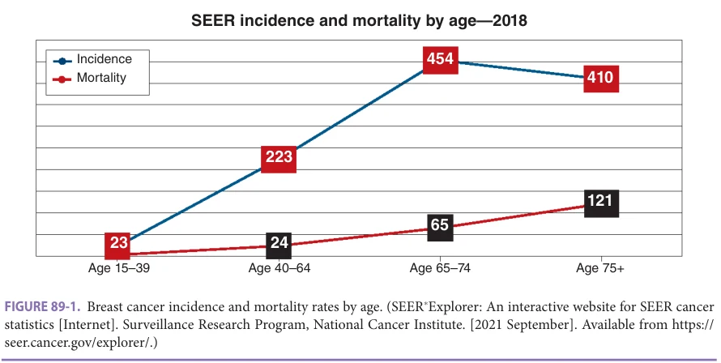
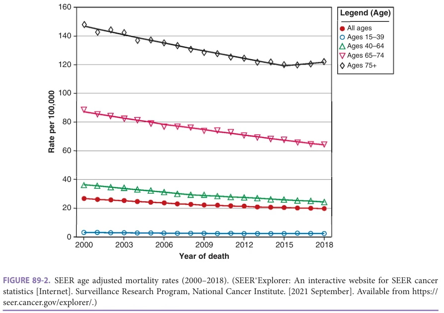
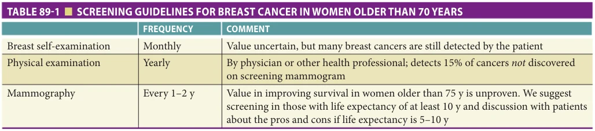
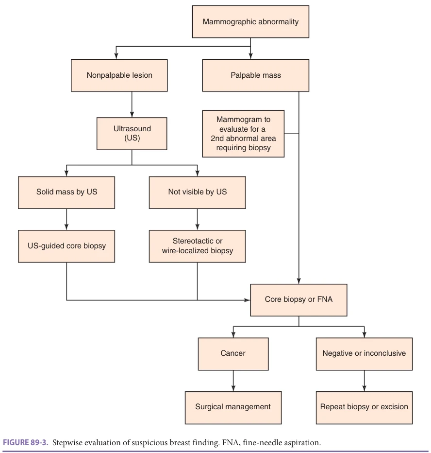
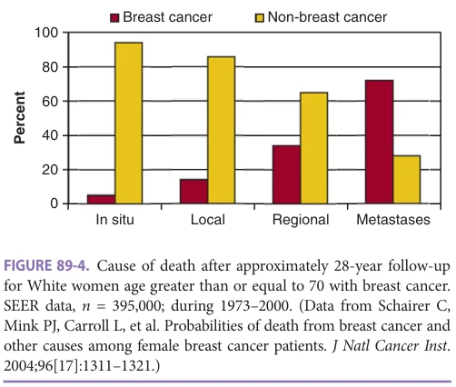
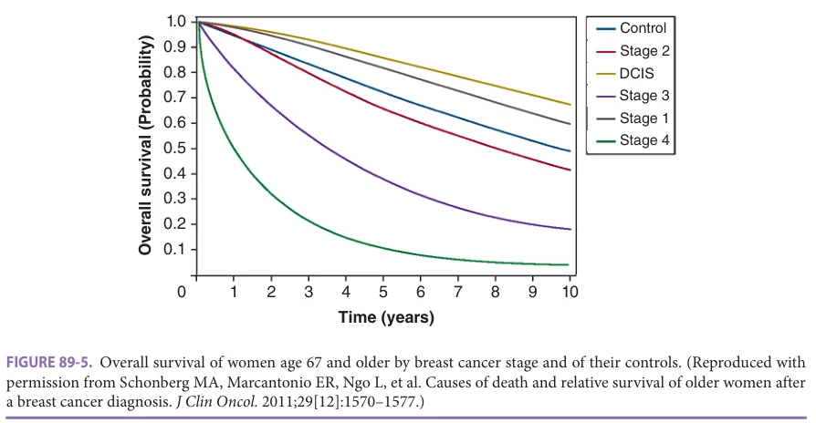
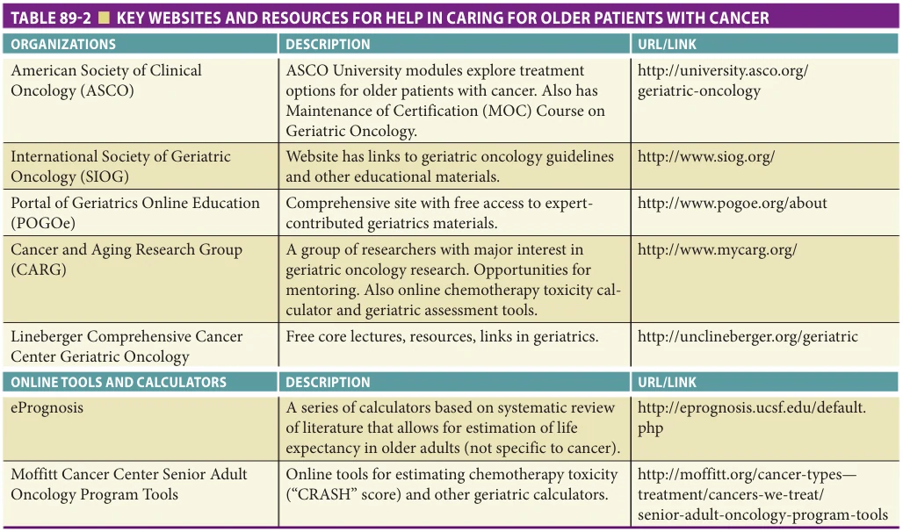
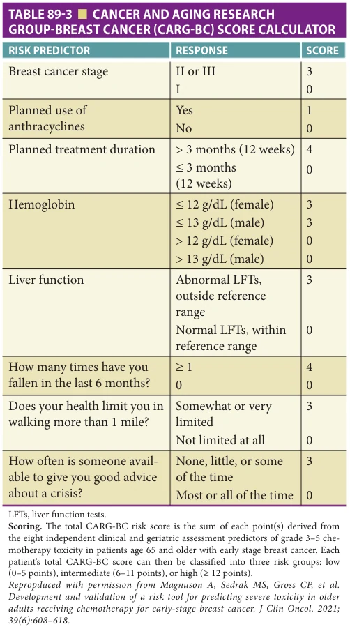
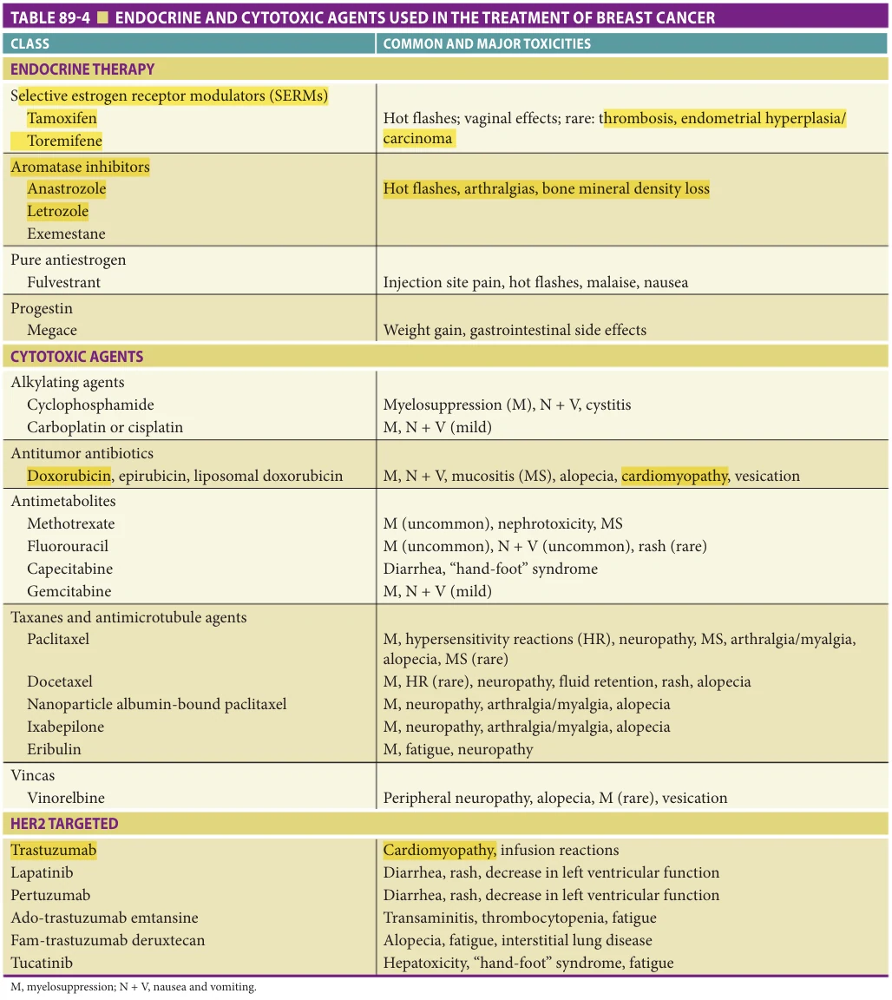
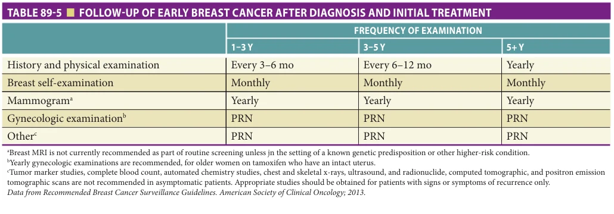

# Hazzard's Geriatric Medicine and Gerontology, 8e - Chapter 89: Breast Disease

Mina S. Sedrak, Hyman B. Muss

> **Status.** Fast build from the book; not lane-reviewed.

> **Source and method.** Printed pages 1395-1408, from the marked 8th-edition copy (PDF page = printed page + 34). Prose follows its text layer; tables and figures are source-page crops. The book is canonical.

**[p. 1395]**

## EPIDEMIOLOGY

Breast cancer is the most common cancer in women, and the American Cancer Society has estimated that in 2020 it will account for 30% of all newly diagnosed malignancies (276,000 new breast cancer cases) and remain the second leading cause of cancer-related death (42,000 deaths, ie, 15%). Moreover, current US incidence and mortality data show that 12.8% of all women (1 in 8) will be diagnosed with breast cancer during their lifetime and that 2.6% (1 in 39) will die from it. The incidence of breast cancer, like most other human cancers, increases dramatically with age. In the United States the median age at which breast cancer is diagnosed is 62 years and the median age of dying from breast cancer is 69, with highest percent of breast cancer deaths occurring between ages 65 and 74. National Vital Statistics indicate that the dramatic increase in incidence and mortality with age (Figure 89-1) from an invasive breast cancer rate of approximately 1 in 5000 in women aged 15 to 39 to about 1 in 200 in women aged 64 to 74. Of equal concern, although breast cancer–related mortality has been decreasing for several decades, older age has been associated with a lower breast cancer–specific survival rates (Figure 89-2), possibly reflecting less screening or poorer treatment.

#### Learning Objectives

- Describe the key principles regarding breast cancer, including epidemiology, screening, risk factors, presentation, and initial evaluation of disease.

- Understand the basic local and systemic therapy for early, nonmetastatic breast cancer.

- Understand the basic approaches to treatment of metastatic breast cancer.

- Describe the usual surveillance recommended for patients with breast cancer.

- Understand potential prevention strategies.

- Become aware of special (understudied) populations with breast cancer, including men, racial/ethnic minorities, and those with advanced comorbidity.

- Become aware of survivorship and palliative care issues.

#### Key Clinical Points

1. Breast cancer in the older patient is common and will become more common as our population ages.

2. Although many older patients die from causes other than breast cancer, it remains a deadly disease for many, especially those with higher-risk cancers.

3. Older patients typically benefit from treatments (such as endocrine therapy and chemotherapy) as much as younger patients do but may experience more toxicity with chemotherapy.

4. Geriatric assessments and estimates of life expectancy (exclusive of breast cancer) can help optimize treatment decisions.

5. When discussing treatment, screening, and surveillance strategies with older patients,

Breast cancer is a major health concern in the United States and will become of greater importance since the size of the older population is growing dramatically. Although breast cancer is more common in older women, they are less likely to be appropriately screened, more likely to present for care at a more advanced stage, more likely to receive inferior surgical and postoperative management, and are less likely to be entered into clinical trials. This has resulted in older breast cancer patients sharing less in the dramatic decline in breast cancer mortality rates in the last two decades as compared with younger women.

## PATHOPHYSIOLOGY

The specific cause of breast cancer is unknown. Many factors associated with increased risk have been identified. These include the following: increasing age, family history of breast cancer (especially in a first-degree relative) or known

**[p. 1396]**

it is important to be mindful of each patient’s competing medical issues, risk for cancer recurrence and cancer-related death, and functional status.

6. Older patients with breast cancer are often understudied. How to best optimize care with regard to treatment, comorbidity, functional status, and outcomes remains a priority for future research.

genetic predisposition, early menarche, late age at birth of first child (older than 30 years), late menopause, dense breast tissue, history of benign breast disease (hyperplasia or atypical hyperplasia), heavy radiation exposure, obesity, high endogenous hormone levels (postmenopausal estrogen replacement therapy), moderate-to-excessive alcohol use, and possibly cigarette smoking history. Most of these factors are associated with relative risks in the range of 1.1 to greater than 4 times the risk in the general population. A breast cancer risk assessment tool, based on the Gail Model, can be used to calculate the 5-year and lifetime risk of breast cancer in a patient (https://bcrisktool.cancer.gov/).

A family history of breast cancer, implying a genetic defect, has been found in from 5% to 20% of all cases of breast cancer and is particularly important in breast cancer diagnosed before age 50. BRCA1, BRCA2, and PALB2 are the most common genes involved in hereditary predisposition. Other, rarer mutations are also associated with breast cancer that include ATM, TP53, PTEN, and CHEK2. In addition to inherited disease-causing genetic variations, there are many modifying factors, including genetic, hormonal, and environmental, that may determine whether a genetic mutation will lead to cancer.

Most breast cancers originate from ductal epithelium. Comparisons of older and younger patients with breast cancer reveal that infiltrating ductal carcinoma is the most common histologic type in both groups, accounting for 75% to 80% of cases, with lobular carcinoma accounting for approximately 5% to 10% and other subtypes accounting for the remaining cancers. Compared to younger patients, older patients are more likely to be well differentiated and moderately differentiated, be estrogen and progesterone receptor (PR)-positive (60%–70% of patients), have lower rates of tumor proliferation (the number of cells synthesizing deoxyribonucleic acid [DNA]), and less frequently express the human epidermal growth factor receptor 2 (HER2) oncogene. These data suggest that breast cancer in older patients is biologically less aggressive than it is in younger women. Mortality from breast cancer, however, is not lower in older women, leading us to explore issues associated with treatment choice and other patient- and tumor-related factors that might affect disease-specific survival.

## SCREENING

The majority of breast cancers in the United States are diagnosed as a result of an abnormal screening study, although a significant number are first brought to attention by the patient. Breast cancer screening in a postmenopausal woman includes mammography and a physical examination. After menopause, estrogen levels diminish, breast glandular tissue and ductal tissue decrease, fat tissue increases, and there are fewer cysts and fibroadenomas. These age-related changes in breast tissue, especially the increased percentage of fat tissue, allow for improved contrast between small foci of malignancy and the surrounding breast tissue, resulting in fewer false-negative mammographic examinations.

Several randomized trials show that the routine use of screening mammography in women aged 50 through

*Figure 89-1 — printed p. 1396.*

**[p. 1397]**

*Figure 89-2 — printed p. 1397.*

75 improves survival by detecting breast carcinoma at an earlier stage and before metastatic dissemination. Only limited data are available to provide guidance for screening in women older than 75 years. Guidelines differ among experts; we suggest consideration of annual or biennial screening in women age 75 and older if their estimated life expectancy is at least 10 years. For women in this age group with life expectancies between 5 and 10 years, screening is not likely to be of value in improving breast cancer–related mortality; however, shared decision-making should be used in discussing screening and decided upon on an individualized basis. Decision aids can be helpful when discussing the patient’s risk of developing breast cancer, the potential benefits and harms of screening, and the patient’s values. Physical examination by health professionals remains an essential and complementary adjunct to mammographic screening and is especially important in women who decline or are not likely to benefit by mammographic screening. Table 89-1 presents our recommendations for the screening of older women.

## PRESENTATION

Breast cancer usually presents either as a breast mass or a suspicious finding on a mammogram. The discovery of a breast mass in a postmenopausal woman requires prompt attention, as the majority of palpable masses in this age group are malignant and all require biopsy. Mammography can help define the nature of a mass and detect other nonpalpable lesions if present and should be performed when

a breast mass is found. A small percent (up to 15%) of palpable breast cancers in women may not show on mammogram (false negatives) but require biopsy.

Locally advanced breast cancer can present with axillary adenopathy (suggesting locoregional disease) or skin findings such as erythema, thickening, or dimpling of the overlying skin (peau d’orange), suggesting inflammatory breast cancer. Symptoms of metastatic breast cancer can be nonspecific (eg, weight loss, fatigue, or loss of appetite) or can depend on the organs involved, with the most common sites of involvement being the bone (eg, back or leg pain), liver (abdominal pain, nausea, jaundice), and lungs (eg, shortness of breath or cough).

## DIAGNOSIS

Typically, a stepwise process of diagnosis and definitive surgery is followed, as depicted in Figure 89-3. This allows for pathologic confirmation of cancer and time to decide surgical treatment choice.

For palpable or mammographically detected lesions, core needle biopsy is preferable to fine-needle aspiration biopsy, because it can distinguish invasive from in situ lesions and also allows better ascertainment of hormone receptor and HER-2 status. If the core biopsy is negative or inconclusive, unless the mass proves to be a cyst and resolves after aspiration, further biopsy, preferably excision, is necessary. If atypical ductal hyperplasia is found on core biopsy, excisional biopsy is required, because a small proportion of suspicious lesions for which core biopsy finds

**[p. 1398]**

*Table 89-1 — printed p. 1398.*

only atypical hyperplasia may also contain in situ or invasive cancer when excised.

The diagnosis of breast cancer is defined by the presence of malignant epithelial cells (carcinoma) on biopsy. When biopsy is diagnostic of malignancy, preoperative evaluation typically includes a complete history and physical examination, a complete blood count and chemistry profile, and a

chest x-ray. Magnetic resonance imaging (MRI) of the breasts may also be helpful in the management of older women in specific settings but is not recommended for routine screening or diagnostic purposes. However, bilateral mammography should be performed on all patients during their diagnostic work-up to evaluate both the ipsilateral breast and the contralateral breast for other nonpalpable lesions.

*Figure 89-3 — printed p. 1398.*

**[p. 1399]**

## POSTDIAGNOSIS EVALUATION

Once a patient is diagnosed with breast cancer, specific receptor testing is performed and appropriate staging work-up is necessary to determine local and distant extent of disease.

Breast Cancer Receptor Testing Newly diagnosed breast cancer must be tested for estrogen receptor (ER), PR, and overexpression of HER2 receptor status. This information is critical for both prognostic and therapeutic purpose because breast cancer is characterized into different subtypes by whether they express ER, PR, and HER2 receptors. The majority (80%) of cases are hormone receptor (ER and/or PR positive), followed by HER2 overexpression. ER-, PR-, and HER2-negative (triple-negative) cancers compromise approximately 10% of cases.

Staging The American Joint Committee on Cancer (AJCC) guidelines set the standard for breast cancer staging. This system categorizes the extent of malignancy according to the size of the primary lesion (T), the extent of nodal involvement (N), and the occurrence of metastasis (M). Tumor size (the largest diameter of the infiltrating component) and the extent of nodal involvement (the number positive) are determined from pathologic examination and are included in the pathology report and ascertainment of staging. Nodal assessment is done either by sentinel lymph node biopsy or by axillary dissection. Sentinel lymph node mapping and sampling is preferred as it allows identification and assessment of the one to four nodes most likely to contain cancer. If an axillary lymph node dissection is completed, a sample of at least six nodes (if possible) is ideal in order to reflect the prognosis accurately.

Most patients presenting with breast cancer have stage I or II disease (confined to the breast) with no or limited (ie, less than three) nodes involved and do not routinely undergo additional work-up for metastatic disease in the absence of signs or symptoms suspicious for distant spread. Patients with stage III breast cancer or inflammatory breast cancer and those with signs or symptoms worrisome for metastatic disease should have imaging with computerized tomography of chest, abdomen, and pelvis and a radionuclide bone scan or a positron emission tomography–computed tomography (PET-CT) scan to rule out metastases. The use of tumor markers (such as the carcinoembryonic antigen [CEA] and mucin antigens CA27.29 and CA15.3) and circulating tumor cells is not recommended as part of the staging evaluation.

## TREATMENT

The vast majority of patients with newly diagnosed breast cancer in the United States have no evidence of metastatic disease. For these patients, the treatment approach depends on stage at presentation, prognostic receptor status, and, in

some cases, biomarker testing. The general treatment principles of carcinoma in situ, early (nonmetastatic) breast cancer, and metastatic breast cancer will be reviewed here.

Carcinoma In Situ Ductal carcinoma in situ (DCIS) of the breast represents a heterogenous group of neoplastic lesions confined to the breast ducts. The goal of therapy for DCIS is to prevent the development of invasive cancer and therapeutic approaches include surgery, radiation therapy (RT), and adjuvant endocrine therapy. Mastectomy cures almost all patients, but breast-conserving procedures followed by breast irradiation are as effective for patients with smaller lesions. Axillary dissection or sentinel node biopsy finds metastases in less than 1% of patients and is generally not recommended. Excision alone, without local RT, may be appropriate for patients with lesions less than 2.5 cm with generous (> 1 cm) margins of normal tissue surrounding the in-situ component. Most DCIS lesions are ER- and PR-positive and clinical trials on tamoxifen have been shown to decrease the risk of recurrence and contralateral breast cancer in women with DCIS but without improvements in survival. For older women with DCIS, the risks of tamoxifen are likely to exceed the benefits in many women and we recommend consideration of tamoxifen use on an individual basis.

Lobular carcinoma in situ (LCIS) is more common in premenopausal patients, lacks clinical and mammographic signs, is bilateral in 25% to 35% of cases, and is usually an incidental finding at breast biopsy. It is not a palpable lesion. Treatment options range from observation to bilateral mastectomy, but observation is preferred. Of note, 20% to 40% of patients with LCIS subsequently develop infiltrating ductal cancer, with both the ipsilateral breast and the contralateral breast at similar risk. LCIS serves as a high-risk marker for subsequent invasive cancer, and treatment selection must rest on the desires of the patient. Most experts recommend close follow-up of these patients, without aggressive surgery. Tamoxifen dramatically decreases the risk of subsequent invasive breast cancer in patients with LCIS and should be considered on an individual basis.

Early-Stage, Nonmetastatic Breast Cancer In general, patients with early-stage breast cancer undergo primary surgery (lumpectomy or mastectomy) to the breast and regional nodes with or without RT. Following definitive local treatment, patients should be offered adjuvant systemic therapy based on primary tumor characteristics, such as tumor grade, size, lymph node involvement, and ER, PR, and HER2 receptor status. However, some patients with early-stage disease, particularly those with HER2-positive or triple-negative breast cancer, may benefit from upfront (neoadjuvant) chemotherapy first, followed by surgery. Although the field is constantly changing, there are several key principles of surgical, radiation, and systemic treatment, which we will review here.

**[p. 1400]**

## Surgical Management

Breast-conserving therapy The breast-conserving approach to breast cancer management involves removing the tumor mass with a clear margin of surrounding normal breast tissue (lumpectomy, partial mastectomy, quadrantectomy, etc), assessing axillary lymph nodes when indicated, and for many, delivering local breast irradiation (discussed below) after surgery. Breast-conserving therapy results in virtually identical relapse-free and overall survival compared with more extensive surgical treatment, including simple, modified-radical, and radical mastectomy. It allows patients to preserve their breast without sacrificing oncologic outcomes. Criteria that preclude breast-conserving surgery include: two or more gross tumors in separate quadrants of the breast, large tumor/ breast size ratio (mass > 5 cm in size), which interferes with cosmesis, diffuse indeterminate or malignant-appearing microcalcifications, a history of therapeutic irradiation to the chest (eg, radiation for Hodgkin disease), and persistently positive margins despite attempts at re-excision. For patients who desire breast conservation therapy but are not candidates at the time of presentation, an alternative approach is the use of neoadjuvant therapy (discussed below), which may allow for desired surgical management without compromising survival outcomes.

Mastectomy A mastectomy is indicated for patients who are not candidates for breast conserving therapy and those who prefer a mastectomy. Reasonably healthy older women tolerate simple or modified mastectomies as well as younger women do and should be offered the option when clinically appropriate.

Axillary assessment Tumor size and axillary nodal status are the most consistent predictors of the risk of recurrence and key in making decisions about the risk/benefit ratio of adjuvant systemic treatment. The evaluation of the regional nodes depends on whether axillary involvement is suspected prior to surgery. For patients with clinically suspicious axillary nodes, a preoperative work-up including biopsy to confirm nodal involvement is recommended to determine the best surgical approach (eg, upfront axillary node dissection at the time of breast surgery) and whether neoadjuvant therapy should be considered. For patients with a clinically negative axillary examination, sentinel lymph node mapping and sampling at the time of surgery is recommended. When one or two sentinel lymph node(s) are positive (pathologically involved), further axillary dissection can be omitted without any detrimental effects on local recurrence or survival. For patients with three or more sentinel nodes involved, axillary dissection is indicated.

In older women, the role of assessing axillary nodes is quite controversial because of the risk of arm morbidity. If adjuvant chemotherapy is not a consideration because of physician or patient choice, the risk of axillary dissection is not worth its prognostic yield, regardless of the primary tumor size. It is generally acceptable to omit axillary assessment in older women (age 70 or older) with small (2 cm

or less), clinically node-negative, ER-positive breast cancer, who will take adjuvant endocrine therapy for at least 5 years.

Breast reconstruction For older women who have had a mastectomy, breast reconstruction represents another option for restoring body image. Many physicians, because of personal bias, are unlikely to discuss reconstruction with older patients. However, this procedure can be done safely in older patients and should be discussed, with subsequent surgical consultation if desired.

## Adjuvant Radiation

Radiation after mastectomy The likelihood of local recurrence is directly proportional to both the size of the primary lesion and the number of involved axillary nodes. Postoperative adjuvant irradiation is generally recommended for patients with primary lesions greater than 5 cm or with four or more positive nodes. It is also considered reasonable for any woman with breast cancer that involves lymph nodes to receive postmastectomy “adjuvant” irradiation therapy to the chest wall and the contiguous regional lymph nodes (internal mammary, supraclavicular, and upper axilla), because it reduces the likelihood of local recurrence (recurrence in the mastectomy site or contiguous nodal areas) by 70% and improves overall breast cancer–specific survival.

Radiation after lumpectomy Breast irradiation after removal of tumor mass reduces the likelihood of recurrence in the affected breast from 30% to 40% to less than 10% and may improve survival in women with higher-risk breast cancers. Although radiation after breast conservation is standard therapy in younger women, older women with smaller, hormone receptor–positive breast cancers (≤ 3 cm in largest dimension) may be spared breast irradiation if they are willing to take adjuvant endocrine therapy. In such patients, survival is identical, although there is a somewhat higher risk of breast recurrence over a 10-year period (about 10% without radiation and 2%–3% with radiation). Most breast relapses occur in or in close proximity to the previously resected lesion. Other techniques, such as brachytherapy (localized RT), may prove to be as effective as whole-breast RT and can be completed over a period of days to weeks. For healthy older patients at high risk for in-breast recurrence (tumors 3 cm or greater or positive lymph nodes) and reasonable life expectancy, breast radiation is recommended.

Adjuvant Systemic Therapy Systemic therapy refers to the medical treatment of breast cancer using chemotherapy, endocrine therapy, and/or biologic therapy. Tumor characteristics predict which patients are likely to benefit from specific types of systemic therapy in early-stage breast cancer. These therapies can be given preoperatively (neoadjuvant) or postoperatively (adjuvant). The goal of systemic therapy in early breast cancer is to reduce risk of and delay relapse as well as improve survival. Such treatment is aimed at eradicating occult, clinically undetectable metastasis. Figure 89-4 shows the

**[p. 1401]**

*Figure 89-4 — printed p. 1401.*

cause of death for women with breast cancer by stage of disease and Figure 89-5 shows the overall survival of older women by breast cancer stage. As demonstrated in these figures, women, and in particular older women, mostly die of non–breast cancer causes in the setting of early-stage disease. Treatment considerations should therefore be individualized based on general prognostic tumor-related markers (biology and extent of disease), global health status (providing information on life expectancy and treatment tolerance), and patient preference, and not on chronological age.

Chemotherapy Adjuvant chemotherapy is generally recommended for older women who are fit and where chemotherapy in addition to other treatment will improve survival by at least a few percent. Data suggest that standard combination regimens (two or more chemotherapy drugs) are efficacious in older patients, with acceptable toxicity. Indeed, studies have shown a survival benefit for women aged 50 to

70 with regimens that are also well tolerated in healthy women older than 70 years. However, prior to making decisions regarding chemotherapy, a risk-stratified approach should be done to take into account patient and tumor characteristics to select which older patients should receive adjuvant chemotherapy. The decision to proceed with adjuvant chemotherapy is thus chosen on the basis of the risk to benefit ratio: the anticipated risk reduction for metastatic disease is weighed against the risk of toxicity from treatment.

Tools to predict the benefit of chemotherapy are available. These include genomic expression profiles of the tumor (Oncotype Dx), which are used in routine practice to determine the specific benefit of chemotherapy in given subsets of patients with hormone receptor–positive breast cancer. Online calculators, such as PREDICT, can also be used as a starting point to estimate overall survival benefits with and without chemotherapy.

Tools to predict the patient’s life expectancy (exclusive of their breast cancer diagnosis), general health status, and risk for chemotherapy toxicity should be used to assess the older patient. There is vast heterogeneity in function and comorbidity in older patients at any given age. Table 89-2 presents a list of key websites and resources for providers who care for older patients with cancer.

An online tool, ePrognosis (https://eprognosis.ucsf. edu/), estimates life expectancy based on medical history and has been validated for use among women with earlystage breast cancer. By providing an estimate of noncancer mortality risk, the ePrognosis tool can help frame treatment decisions for adjuvant chemotherapy and provide a starting point for conversation with the patient about their own preferences.

Additionally, we recommend that patients older than 70 years and/or with multiple comorbid conditions should be screened for geriatric syndromes using a

*Figure 89-5 — printed p. 1401.*

**[p. 1402]**

*Table 89-2 — printed p. 1402.*

brief geriatric screening tool, such as VES-13 or G8. Based on the results of the screening, a comprehensive geriatric assessment (GA)—which includes evaluations of functional status, comorbid medical conditions, cognitive status, psychological state, social support, nutritional status, and a review of the medication list—may help to uncover age-related deficits that are not routinely obtained in a history and physical examination. This cancer-specific, comprehensive GA, developed by Dr. Arti Hurria and colleagues, was shown to identify older adults who have diminished life expectancy and/or are at risk for hospitalization and functional decline. Findings from the GA may guide interventions that can improve the ability to undergo cancer treatment, with emerging evidence showing that these GA-driven interventions can reduce chemotherapy toxicity and improve the quality of life of older patients with cancer. Several national and international organizations now recommend incorporating data from a GA for optimizing treatment in older patients who are planned to receive systemic therapy.

Recently, a new risk prediction model was developed predict chemotherapy-related toxicities in patients older than 65 years with early-stage breast cancer receiving neoadjuvant or adjuvant chemotherapy. The Cancer and Aging Research Group–Breast Cancer (CARG-BC) risk score is derived by combining eight disease and patient-reported predictors, including: use of an anthracycline chemotherapy, stage II or III breast cancer, planned treatment duration, abnormal liver function, low hemoglobin, falls, limited walking ability, and lack of social support (Table 89-3).

The total score classifies patients age 65 and older with early breast cancer into low, intermediate, or high risk for severe, debilitating, or deadly side effects to chemotherapy. The CARG-BC score was also validated and outperformed other tools, including a general risk prediction model for older adults with cancer (nonbreast cancer–specific) and physician-rated performance status (ie, “eyeball test”).

Endocrine therapy Almost all patients with hormone receptor–positive breast cancer should be offered adjuvant endocrine therapy to reduce the risk of breast cancer recurrence and breast cancer-related mortality, regardless of age. Although older adults may have more comorbidities that predispose them to increased toxicities related to endocrine treatment, the benefits of adjuvant endocrine therapy on reducing the risks of recurrence and death from breast cancer are similar to younger patients. We recommend that patients at risk for treatment-related toxicities due to adjuvant endocrine therapy should be managed appropriately, with care coordinated between their oncology team and primary care clinician or geriatrician. Patients at increased risk of major toxicities, such as those with preexisting history of thrombosis, cerebrovascular disease, osteoporosis, or fractures should have shared discussions with their medical team to make the most informed decisions.

Endocrine therapy as initial (or primary) treatment Although surgical resection reduces the risk of local recurrence and its associated morbidity, for many older patients, especially those with advanced but localized lesions (T3 and T4) and those with significant comorbidity or frailty (where

**[p. 1403]**

*Table 89-3 — printed p. 1403.*

anesthesia is contraindicated), initial treatment with endocrine therapy is appropriate in patients with hormone receptor–positive tumors. Tumor shrinkage occurs in 40% to 70% of patients and tumor control usually is maintained for 18 to 24 months. The majority of patients treated initially with endocrine therapy do not achieve complete tumor regression and will need surgery or other treatments to control the primary lesion if their life expectancy is longer than several years. Although surgery is more likely to be effective (and potentially curative) in patients with small lesions, several randomized trials comparing surgery with endocrine treatment for initial therapy suggest that longterm survival is not changed by using endocrine therapy as the initial treatment and reserving surgical management for patients with tumor progression. Radiation therapy also can be used as “salvage” treatment after endocrine therapy fails, but large tumor masses, especially those greater than 3 cm and those with extensive skin involvement, frequently

respond only partially. For patients treated with endocrine therapy because comorbidity precludes surgical therapy, radiation therapy should be considered when tumor shrinkage is maximal to try to prolong the duration of local tumor control. In the authors’ opinion, older women with localized breast cancer amenable to surgery should be offered surgical treatment at diagnosis unless they are extremely frail or have dramatically reduced life expectancy.

Metastatic Breast Cancer Management of metastatic breast cancer in older women follows the same principles as in younger women, with few exceptions. Like younger women, older patients with metastatic breast cancer are currently incurable and have a median survival of approximately 2 to 7 years after the discovery of recurrence with about 20% of those with hormone receptor positive tumors surviving 5 years. The goal of therapy is palliation rather than cure and patients may derive considerable palliative benefit from judiciously chosen therapy. Bone, soft tissue (skin and lymph nodes), pleural, and pulmonary metastases are the most common sites of breast cancer recurrence. Women with localized, symptomatic lesions in brain, skin, lymph nodes, and bone should also be considered for palliative radiation therapy, which relieves symptoms in the majority of patients.

Patients with disseminated metastases should be considered for palliative systemic treatment and consideration for clinical trial enrollment should occur at every line of therapy. Table 89-4 describes endocrine and cytotoxic agents used in the treatment of breast cancer and their common and major side effects. Endocrine therapy usually is associated with minimal toxicity, while the toxicity associated with chemotherapy is frequently substantial and, in a small percent of patients, may be life-threatening. Provided that metastases are not rapidly progressive or life-threatening, all women with hormone receptor–positive, metastatic breast cancer should have an initial trial of endocrine therapy. The combination of a cyclin-dependent kinase (CDK) 4/6 inhibitor and an aromatase inhibitor appears to be effective and of comparable tolerability in older patients as in younger patients; however, older adults should be carefully monitored for myelosuppression or diarrhea, depending on the choice of CDK4/6 inhibitor used.

Once breast cancer is deemed refractory to endocrine therapy or in the setting of triple negative disease (breast cancers without estrogen, progesterone expression, and HER2 overexpression), chemotherapy is usually the treatment of choice. Chemotherapy may also be a first-line therapy if life-threatening or rapidly progressive (visceral) disease is present. Chemotherapy should not be withheld solely on the basis of older age and decisions on the administration of chemotherapy in older women should be individualized based on the extent of their tumor, symptoms, and the potential benefits and risks of treatment. Sequential single-agent therapy as opposed to combination chemotherapy as in most patients, regardless of age, is equally

**[p. 1404]**

*Table 89-4 — printed p. 1404.*

effective and less toxic. Osteoclast inhibition with bisphosphonates or denosumab significantly reduces the risk of skeletal-related events in women with bone metastases.

Older patients with metastatic disease, whose general health is otherwise satisfactory, display response and toxicity profiles to chemotherapy similar to those of their younger counterparts. Most cytotoxic drugs are metabolized in the

liver with only a select few dependent on renal excretion (methotrexate, carboplatin, and cisplatin); major liver dysfunction probably is required to alter drug metabolism significantly. Chemotherapy-related myelosuppression is more common in older patients due to diminished bone marrow reserve with aging; nausea and vomiting are seen less frequently than they are in younger patients. Of importance,

**[p. 1405]**

psychosocial adjustments to chemotherapy appear to be better for older than for younger patients. Complete and partial responses to most single chemotherapy agents range from 20% to 30%, while responses to combination chemotherapy average 50% to 70%. Responses generally last an average of 6 to 12 months; response rates to subsequent “salvage” regimens are generally low and last only several months.

## SPECIAL ISSUES AND SPOPULATIONS

Prevention There is no simple strategy to prevent breast cancer in older women. As the pathogenesis of breast cancer is likely to be related to interactions of estrogens, other hormones, and breast tissue, agents that lower breast tissue estrogen exposure, such as selective estrogen receptor modulators (SERMs) and aromatase inhibitors, have been studied and found to be effective in breast cancer prevention lowering the incidence by about half. None of these large trials, even after long term follow have shown any survival advantage in spite of decreased breast cancer occurrences in the treated patients. At present, we believe that only a few older highrisk patients should be considered for preventive therapy and that these patients should have an estimated life expectancy of at least 10 years. Like younger patients, older patients should be encouraged to maintain an ideal body mass and engage in exercise. In addition, prophylactic, contralateral surgery as a method for prevention is not recommended. In older women with BRCA1 or BRCA2 mutations prophylactic surgery should be considered on a case by case basis.

Follow-Up for Women With Early Breast Cancer There is good evidence that close follow-up after diagnosis or adjuvant therapy does not result in improved overall survival, but that detection of early skin or lymph node (soft tissue) recurrence may result in more effective palliation. Mammography is an exception, and in women with life expectancies of at least 5 to 10 years, should be performed yearly or every other year to detect new primary lesions.

Because a history of breast cancer is a risk factor for another breast cancer, follow-up visits do provide an opportunity for patients to express concerns and for physicians to give them reassurance. Extensive laboratory and radiologic procedures are now available for the detection of metastatic disease, but trials have indicated that a brief, focused history and a limited physical examination (skin, chest, breast, and abdominal examination) detect more than 75% of metastases. Even when mammography is not recommended, an annual breast exam should be part of the patient’s care. National guidelines suggest that optimal follow-up consists of periodic clinic visits and annual screening mammography in asymptomatic patients with a history of breast cancer. Available data do not support the use of routine laboratory work, imaging, or tumor markers for routine follow-up and should not be used in asymptomatic patients (Table 89-5).

Male Breast Cancer Male breast cancer accounts for less than 1% of all breast cancer incidence and has a similar natural history as female breast cancer. Males usually present at a later stage, probably because of a delay in diagnosis. Almost all cases are sporadic, except for males with Klinefelter syndrome (sex chromosomes XXY)—in which the prevalence of breast cancer ranges from 3% to 6%—or men with the BRCA2 gene, which is associated with a 5% to 10% risk. Men with a BRCA2 are also at higher risk for prostate and other cancers. A careful family history is mandatory in all males with breast cancer. Mastectomy with axillary dissection is the standard approach to treatment but breast-conserving surgery and irradiation are appropriate for males with small tumors. Histologically, most lesions are infiltrating ductal carcinomas, and the frequency of ER-positive lesions is 70% to 80%. Because of the rarity of male breast cancer, there are few data on the role of adjuvant systemic therapy, and it is unlikely that large randomized trials will be undertaken. We suggest using the same guidelines for adjuvant therapy in men that are used in women with a similar stage and receptor status. Uncontrolled trials suggest that such treatment is similar in

*Table 89-5 — printed p. 1405.*

**[p. 1406]**

efficacy in men to that in women, although tamoxifen is the preferred adjuvant endocrine therapy in men.

Men with metastatic breast cancer are incurable but frequently respond to endocrine therapy, including tamoxifen and androgen deprivation with LHRH agonists and aromatase inhibitors if they are hormone receptor positive. The results with systemic chemotherapy are similar to those in females.

Palliative Care, End-of-Life Care, and Hospice For many patients and families with cancer, palliative care is synonymous with end-of-life care. This certainly is not the case and especially in the care of older patients with symptoms, early palliative care at the time of diagnosis of metastases or even for some patients with potentially curable disease, palliative care can make the cancer journey much more tolerable for both the patient and their family. Studies have shown that integrating palliative care with standard cancer treatment, including chemotherapy, can lead to significant improvements in quality of life and even survival. Although many oncologists are capable of managing the complex array of symptoms related to cancer and its treatment, partnering with a trained team of palliative care experts results in better outcomes and relieves the oncologist from providing the extensive array of supportive services needed for their patients. We suggest that a palliative care consultation be considered for all older patients with metastatic breast cancer and symptomatic patients with early breast cancer early in their course and preferably at the time of diagnosis.

For those with metastasis, the vast majority of older patients will succumb to their breast cancer. Those receiving palliative care can be easily transitioned to end-of-life care and hospice care. For those who have not had palliative care interventions, end-of-life care provided by palliative care experts and transition to hospice is recommended.

Disparities Racial and age disparities in breast cancer care and outcomes have been well documented and have persisted over time,

## FURTHER READING

Amin MB, Edge S, Greene F, et al (eds). AJCC Cancer Stag-

ing Manual (8th edition). Springer International Publishing: American Joint Commission on Cancer; 2017. Early Breast Cancer Trialists’ Collaborative Group

(EBCTCG). Effects of chemotherapy and hormonal therapy for early breast cancer on recurrence and 15-year survival: an overview of the randomised trials. Lancet. 2005;365(9472):1687–1717. Early Breast Cancer Trialists’ Collaborative Group

(EBCTCG), Peto R, Davies C, et al. Comparisons between different polychemotherapy regimens for early

despite increasing awareness of this issue. Past examinations of receipt of care and outcomes for women have consistently demonstrated lower rates of treatment and worse outcomes for Black and older patients compared to their White and younger counterparts. Furthermore, studies within cohorts of older patients also demonstrate racial disparities, including more delays to treatment, less standard therapy, shorter durations in therapy, and higher mortality rates for older Black versus White women. Patients with less access to care, those who are underinsured, and those from lower socioeconomic groups also suffer from worse outcomes from breast cancer. Assurance that all patients receive guideline-concordant care is a national priority and rigorous interventions to better understand optimal ways of delivering care to all women are desperately needed. Patients felt to be at risk for problems with system navigation and social issues should be referred for patient navigation, social work, and resource assistance whenever possible.

## CONCLUSION

Breast cancer is a major gerontologic problem. Both physician and patient education concerning screening, early diagnosis, and management of breast cancer in this age group are required. Available data indicate that optimal treatment of breast cancer in older women results in outcomes similar to those from treatment of younger women. The GA should be used to optimize treatment decisions and those older patients with satisfactory function and good life expectancy should be managed with judicious “state-of-the-art” therapy. Palliative care should be initiated early in almost all symptomatic patients. Barriers to the treatment of breast cancer in older women are generic to the treatment of all illnesses in this age group and include access to care, transportation, adequate family and social support, physician bias, racial inequities, and treatment costs. Changes in health care policy, as well as focused research related to cancer in the geriatric population, will be needed to overcome these obstacles.

breast cancer: meta-analyses of long-term outcome among 100,000 women in 123 randomised trials. Lancet. 2012;379(9814):432–444. ePrognosis. Estimating prognosis for elders. http://eprog-

nosis.ucsf.edu/. Helson HD, Smith ME, Griffin JC, Fu R. Use of medica-

tions to reduce risk for primary breast cancer: a systematic review for the U.S. Preventative Services Task Force. Ann Intern Med. 2013;158(8):604–614. Hughes KS, Schnaper LA, Bellon JR, et al. Lumpectomy

plus tamoxifen with or without irradiation in women

**[p. 1407]**

age 70 years or older with early breast cancer: long-term follow-up of CALGB 9343. J Clin Oncol. 2013;31(19): 2382–2387. Hurria A, Naylor M, Cohen HJ. Improving the quality of

cancer care in an aging population: recommendations from an IOM report. JAMA. 2013;310(7):1795–1796. Hurria A, Togawa K, Mohile SG, et al. Predicting che-

motherapy toxicity in older adults with cancer: a prospective multicenter study. J Clin Oncol. 2011;29(25): 3457–3465. Khatcheressian JL, Hurley P, Bantug E, et al. Breast cancer

follow-up and management after primary treatment: American Society of Clinical Oncology clinical practice guideline update. J Clin Oncol. 2013;3(7):961–965. Lichtman SM. Chemotherapy in the elderly. Semin Oncol.

2004;31(2):160–174. Lyman GH, Temin S, Edge SB, et al. Sentinel lymph node

biopsy for patients with early-stage breast cancer: American Society of Clinical Oncology Clinical Practice Guideline Update. J Clin Oncol. 2014;32(13):1365–1386. Magnuson A, Sedrak MS, Gross CP, et al. Development and

validation of a risk score for predicting severe toxicity in older adults receiving chemotherapy for early-stage breast cancer. J Clin Oncol. 2021;39(6):608–618. Mandelblatt JS, Sheppard VB, Hurria A, et al. Breast cancer

adjuvant treatment decisions in older women: the role of patient preference and interactions with physicians. J Clin Oncol. 2010;28(19):3146–3153.

Mohile SG, Dale W, Somerfield MR, et al. Practical assess-

ment and management of vulnerabilities in older patients receiving chemotherapy: ASCO Guideline for Geriatric Oncology. J Clin Oncol. 2018;36(22):2326–2347. Muss HB, Berry DA, Cirrincione CT, et al. Adjuvant che-

motherapy in older women with early-stage breast cancer. N Engl J Med. 2009;360(20):2055–2065. Muss HB, Woolf S, Berry D, et al. Adjuvant chemotherapy

in older and younger women with lymph node-positive breast cancer. JAMA. 2005;293(9):1073–1081. Schonberg MA, Breslau ES, McCarthy EP. Targeting of mam-

mography screening according to life expectancy in women aged 75 and older. J Am Geriatr Soc. 2013;61(3):388–395. Schonberg MA, Marcantonio ER, Ngo L, Li D, Sillman RA,

McCarthy EP. Causes of death and relative survival of older women after a breast cancer diagnosis. J Clin Oncol. 2011;29(12):1570–1577. Walter LC, Schonberg MA. Screening mammography in

older women: a review. JAMA. 2014;311(13):1336–1347. Wildiers H, Heeren P, Puts M, et al. International Soci-

ety of Geriatric Oncology consensus on geriatric assessment in older patients with cancer. J Clin Oncol. 2014;32(24):2595–2603. Yancik R, Wesley MN, Varicchio CG, et al. Effect of age and

comorbidity in postmenopausal breast cancer patients aged 55 years and older. JAMA. 2001;285(7):885–892.

**[p. 1408]**
