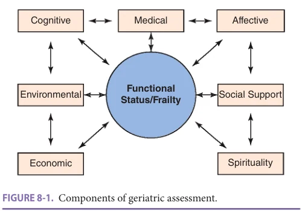
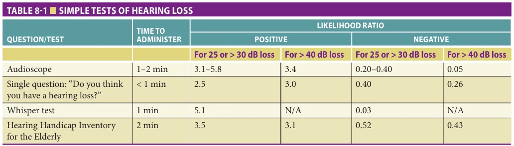
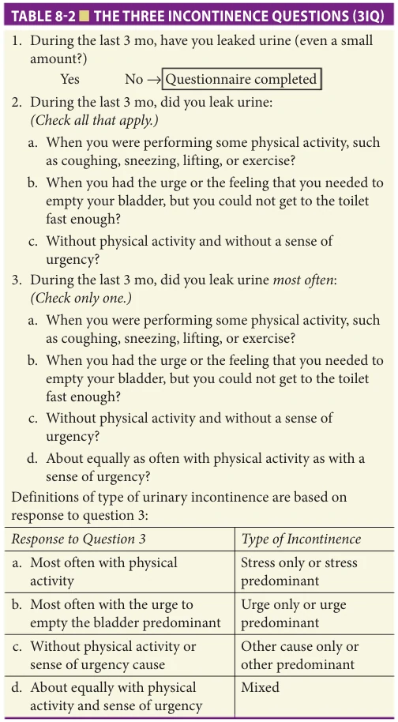
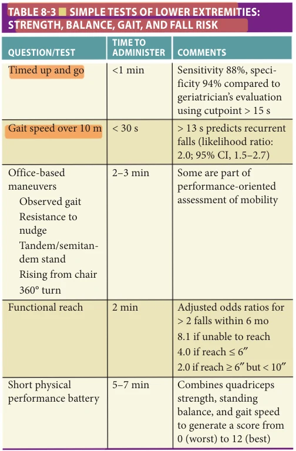
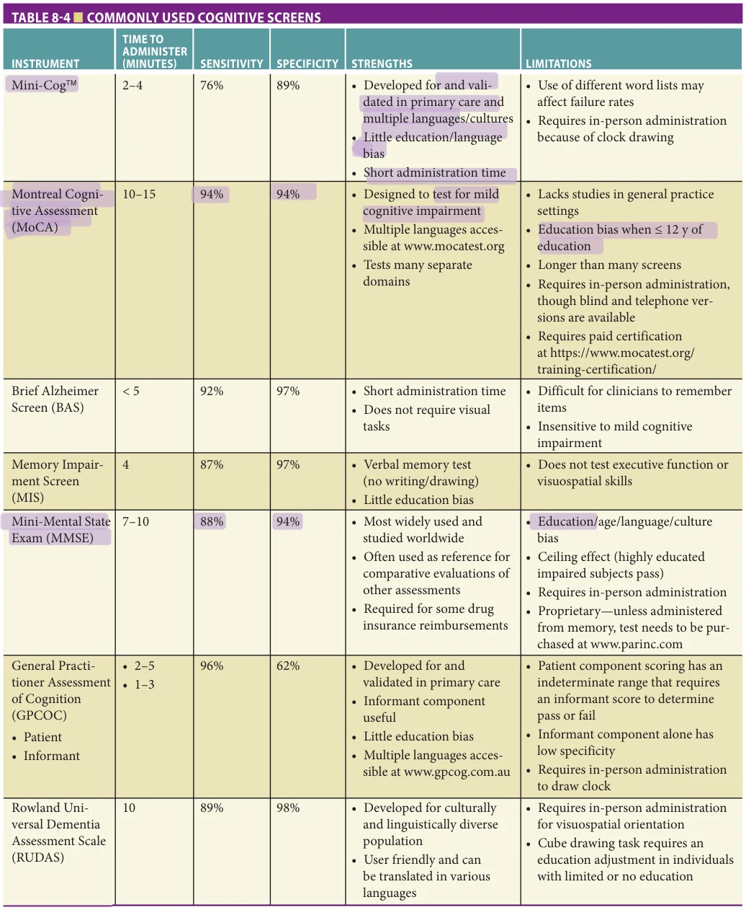
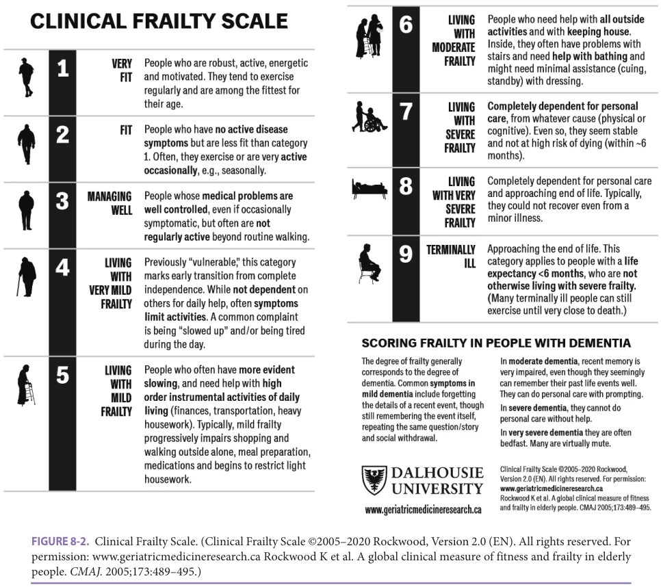
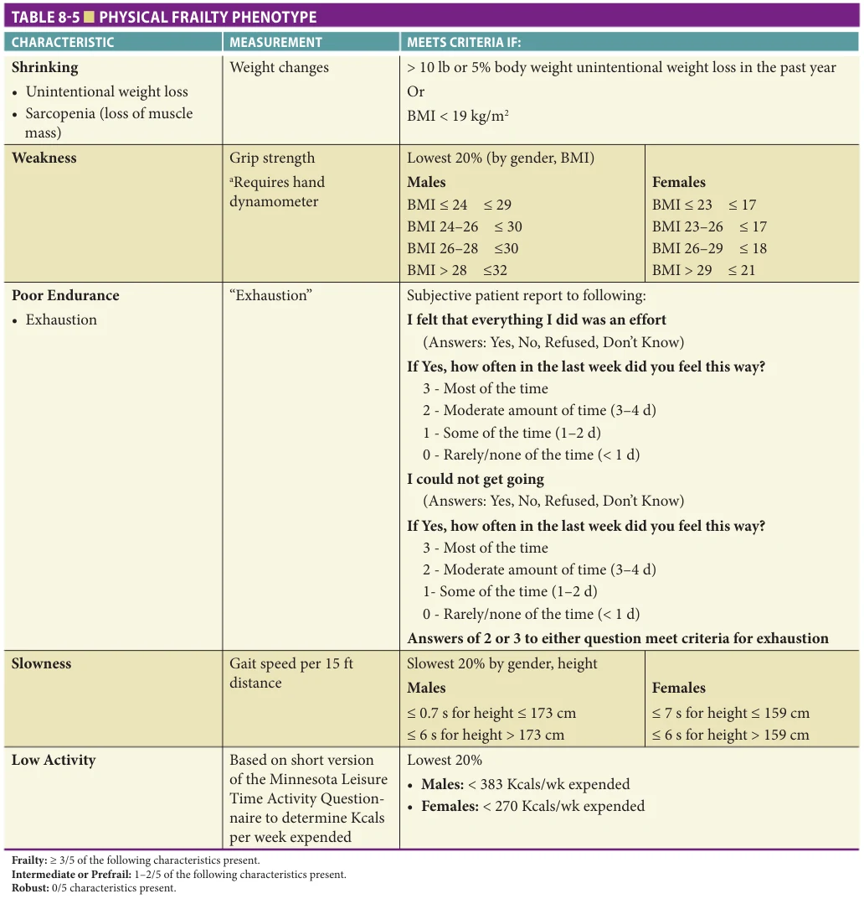
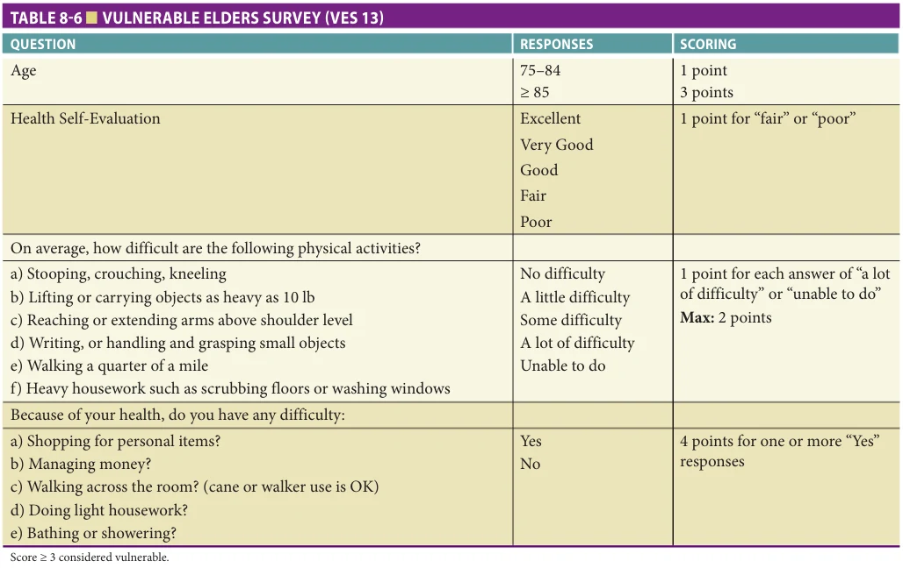
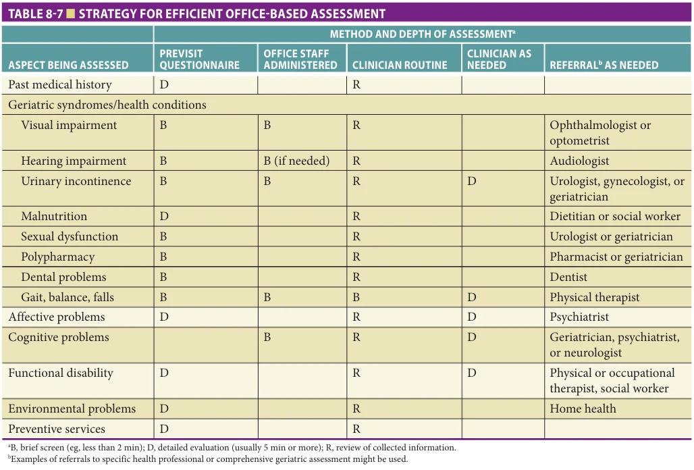
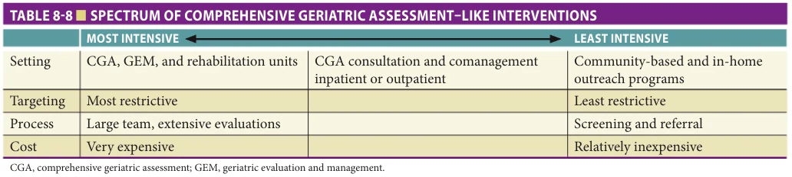

# Hazzard's Geriatric Medicine and Gerontology, 8e - Chapter 8: Principles of Geriatric Assessment

David B. Reuben, Ryan J. Uyan, Valerie S. Wong

> **Status.** Fast build from the book; not lane-reviewed.

> **Source and method.** Printed pages 117-132, from the marked 8th-edition copy (PDF page = printed page + 34). Prose follows its text layer; tables and figures are source-page crops. The book is canonical.

**[p. 117]**

Geriatric assessment describes the health evaluation of the older patient and emphasizes components and outcomes different from that of the standard medical evaluation. This approach recognizes that the health status of older persons is dependent upon influences beyond the manifestations of their medical conditions. Among these are social, psychological, and mental health, and environmental factors. Geriatric assessment also places high value upon functional status, both as a dimension to be evaluated and as an outcome to be improved or maintained. Frailty is a related construct that is increasingly being measured for prognostic and occasionally for outcome purposes.

#### Learning Objectives

- To distinguish between geriatric assessment and comprehensive geriatric assessment.

- To identify the core components of geriatric assessment by individual clinicians.

- To learn practical approaches to geriatric assessment that can be administered within the constraints of a busy office practice.

- To understand the core components of comprehensive geriatric assessment.

- To know the evidence-based strengths and limitations of comprehensive geriatric assessment.

- To recognize how some important components of comprehensive geriatric assessment have been integrated into new health care innovations.

#### Key Clinical Points

1. Geriatric assessment extends beyond the traditional disease-oriented medical evaluation of older persons’ health to include assessment of cognitive, affective, social, economic, environmental, spiritual, functional, and frailty status, as well as a discussion of patient preferences regarding advance directives.

2. Observing patients walking and performing balance maneuvers best assesses balance and gait disorders. Qualitative gait assessment can be performed while the patient is entering or leaving the examining room and can be augmented by measuring gait speed.

3. Although in 2020, the US Preventive Services Task Force (USPSTF) concluded that there is insufficient evidence on the balance of benefits and harms of screening

Although in the strictest sense geriatric assessment is a diagnostic process, many use the term to include both evaluation and management. Moreover, geriatric assessment is sometimes used to refer to evaluation by the individual clinician and at other times is used to refer to a more interdisciplinary process, comprehensive geriatric assessment (CGA) and adaptations by various specialties.

This chapter is divided into four components: (1) geriatric assessment by the individual clinician, with an emphasis on the outpatient setting; (2) a strategic approach to geriatric assessment for the practicing clinician; (3) CGA and evidence for its effectiveness; and (4) lessons learned from geriatric assessment that have been applied to health care delivery of older persons.

## GERIATRIC ASSESSMENT BY THE INDIVIDUAL CLINICIAN

Geriatric assessment (Figure 8-1) by the individual clinician extends beyond the traditional disease-oriented medical evaluation of older persons’ health to include assessment of cognitive, affective, social, economic, environmental, spiritual, functional, and frailty status, as well as a discussion of patient preferences regarding advance care planning. Assessment instruments can be used to guide these evaluations but do not substitute for clinical skills and judgment, including the skill of eliciting important items from the patient’s history and physical examination. Systematic assessment of the multiple domains noted above ensures that the evaluation is comprehensive. Some clinicians may prefer to rely on less formal questions to probe

**[p. 118]**

for cognitive impairment, clinicians should assess cognition when there is suspicion of impairment or when conducting a Medicare Annual Wellness Visit.

4. Much of the germane information of the medical history can be obtained from old records, other professional or nonprofessional staff, or by self-report from patients or family members completing forms prior to office visits.

5. By delegating the administration of screening instruments for many of the important geriatric problems to trained office staff, the clinician may spend a short period of time reviewing the results of these screens and then decide which dimensions, if any, need greater evaluation.

6. In virtually all studies of comprehensive geriatric assessment, the process itself has resulted in improved detection and documentation of geriatric problems. However, such identification of problems has not always led to improved outcomes.

7. The best evidence for effectiveness of comprehensive geriatric assessment is for inpatient geriatric units and home assessments of young-old patients.

8. Concepts of comprehensive geriatric assessment have been incorporated into new successful models of care, specialty care, and disease management programs.

9. Geriatric comanagement programs for older patients with hip fractures have shown to shorten length of stay and reduce complications and discharge to an increased level of care compared to their prehospitalization living situation.

*Figure 8-1 — printed p. 118.*

into potential problems but the responses to these should be documented in the patient’s record.

Geriatric assessment differs according to the setting where the patient is being evaluated. In the hospital setting, the initial assessment is usually directed at the acute medical problem that precipitated the hospitalization and change from baseline. As the patient begins to recover and plans are initiated for discharge, other components (eg, social support, environment) assume increasing importance in the assessment. The inpatient setting can be problematic for geriatric assessment because of the rapidly changing status of several key dimensions. For example, a patient may temporarily become “dependent” on all measures of functional status when acutely ill and gradually improve prior to discharge. Because patients may overestimate their functional status based on their previous level of functioning, direct observational methods (eg, by nurses or rehabilitation therapists) provide a more accurate assessment. The patient’s full potential to participate in rehabilitation may not be known until near the time of discharge.

Nursing home geriatric assessment requires that attention be directed to selected aspects of assessment such as nutritional status and self-care activities. Other components such as functional status at the instrumental activities of daily living level (eg, shopping, meal preparation) are less relevant in this setting. Geriatric assessment conducted in the patient’s home provides an opportunity for assessment of environmental factors (eg, home safety) and may yield different insights into functional status (eg, cleanliness of the home).

Because the primary site of most clinicians’ practices is the office setting, assessment techniques are described primarily for this setting. When appropriate, differing or particularly important information about assessment in other settings is added.

Components of the Geriatric Assessment In addition to the standard medical history and physical examination, the clinician should systematically search for specific conditions that are common among older persons and that might have considerable impact on function. In the course of the traditional medical evaluation, these problems may go unnoticed because older patients fail to report them spontaneously. For example, they may not recognize that falling is a treatable medical problem. They may also be embarrassed to mention problems with maintaining urinary continence. Finally, they may believe that some symptoms, such as hearing loss, are normal aspects of aging that cannot be helped.

Visual Impairment Visual impairment is a common and often underreported problem in the older population. The four major eye diseases (cataract, age-related macular degeneration, diabetic retinopathy, and glaucoma) increase in prevalence with age. Moreover, developing presbyopia is virtually universal

**[p. 119]**

and the vast majority of older persons require eyeglasses. Visual impairment has been associated with increased risk of falls, functional and cognitive decline, immobility, and depression. The high rates of vision disorders and their associated sequelae, the brevity of the screening process, and the treatments available for visual impairment justify screening for visual impairment. However, the revised 2016 US Preventive Services Task Force (USPSTF) guidelines concluded that there is insufficient evidence to determine whether screening older adults for vision impairment improves functional outcomes.

The standard method of screening for problems with visual acuity is the Snellen eye chart, which requires the patient to stand 20 ft from the chart and read letters, using corrective lenses. Patients fail the screen if they are unable to read all the letters on the 20/40 line with their eyeglasses (best corrected vision). A home-printable vision screening test for telemedicine has been validated.

Hearing Impairment Hearing impairment is among the most common medical conditions reported by older persons, affecting approximately one-third of those age 65 or older. Hearing impairment is associated with reduced cognitive, emotional, social, and physical function, leading to increased hospitalizations and delirium. The use of amplification devices has led to improved functional status and quality of life in older persons.

Screening for hearing loss can be accomplished by several methods (Table 8-1). The most accurate of these is the Welch Allyn AudioScope 3 (Welch Allyn, Inc., Skaneateles Falls, NY), a handheld otoscope with a built-in audiometer. The AudioScope 3 can be set at several different levels of intensity, but should be set at 40 dB to evaluate hearing in older persons. A pretone at 60 dB is delivered and then four tones (500, 1000, 2000, and 4000 Hz) at 40 dB are delivered. Patients fail the screening if they are unable to hear either the 1000- or 2000-Hz frequency in both ears or both the 1000- and 2000-Hz frequencies in one ear, indicating the need for formal audiometric testing.

A simple alternative is based on the patient’s own subjective report of hearing loss. A self-reported hearing loss question involves asking patients a single question of

“Do you have difficulty hearing?” An affirmative answer is then considered to be a positive test for hearing loss, and patients should be referred to an audiologist.

Another alternative is the whispered voice test, which is administered by whispering three to six random words (numbers, words, or letters) at a set distance (6, 8, 12, or 24 inches) from the person’s ear and then asking the patient to repeat the words. The examiner should be positioned behind the person to prevent speech reading and the opposite ear should be covered or occluded during the examination. Patients fail the screening if they are unable to repeat half of the whispered words correctly.

There are several screening questionaries for hearing loss including the Hearing Handicap Inventory for the Elderly— Screening Version (HHIE-S), the Hearing Self-Assessment Questionnaire (HSAQ), and the Revised Five Minute hearing test. These screening tests are all self-administered and contain about 10 to 15 items. Although these questionnaires are brief and easy to administer, their accuracy for detecting mild hearing loss is inferior to audiometry.

A 2011 review of the evidence on screening of hearing loss in older adults found that inquiring about self-perceived hearing loss or the whisper test at 2 ft had similar rates of detecting hearing loss as the tone-emitting otoscope or formal hearing questionnaire. The most recent USPSTF review of screening concluded that there is insufficient evidence to formally recommend hearing screening for this population.

Malnutrition/Weight Loss (See Also Chapter 30) Malnutrition is a global term that encompasses many different nutritional problems that are associated with diverse health consequences. Both extremes of body weight place older people at risk for subsequent functional impairment, morbidity, and mortality. Among community-dwelling older persons, the most common nutritional disorder is obesity. In addition, a small percentage of community-dwelling older persons have energy or protein energy undernutrition, which places them at higher risk for death and functional decline. Protein energy undernutrition is defined by the presence of clinical (physical signs such as wasting, low body mass index) and biochemical (albumin or other protein) evidence of insufficient intake.

*Table 8-1 — printed p. 119.*

**[p. 120]**

On their initial visit, patients should be asked about weight loss within the previous year (> 4% should trigger further evaluation) and patients should be weighed at every subsequent office visit. Height should also be measured on the initial visit to allow calculation of body mass index (weight in kg/[height in meters]2). Although screening for specific nutrients and vitamins is not recommended, older persons should be asked about intake of calcium and vitamin D, which are recommended for prevention of osteoporosis.

In hospitalized older persons, malnutrition has been associated with higher mortality rates, delayed functional recovery, and higher rates of nursing home use. The simplest and most practical method is for the nursing staff to report daily on the percentage of the diet that the patient is eating. Intake can be also measured through formal calorie counts. Laboratory monitoring is less likely to be useful. Although serum albumin levels can drop acutely during inflammatory states, physiologic stress, and in response to trauma or surgical conditions, this protein has a long halflife (approximately 18 days) and may provide an idea of the patient’s baseline nutritional status. Prealbumin, which has a much shorter half-life (approximately 2 days) may be a better means of monitoring response to nutritional treatment. In the nursing home, weight loss or gain of greater than or equal to 5% in the past 30 days or greater than or equal to 10% in the last 180 days are Medicare Minimum Data Set triggers for malnutrition.

Urinary Incontinence Urinary incontinence is common and estimated to affect 11% to 34% of older men and 17% to 55% of older women. Despite its high prevalence, incontinence is often underrecognized. Patients may find it embarrassing to raise the issue or they regard it as a normal aspect of aging. Urinary incontinence has been associated with depressive symptoms in older adults and is a major factor in nursing home placement. Moreover, effective treatments are available for incontinence. As a result, screening for urinary incontinence has been recognized as an indicator of quality of care.

Screening for urinary incontinence can be done with two questions: (1) “In the last year, have you ever lost your urine and gotten wet?” and if so, (2) “Have you lost urine on at least six separate days?” In a research setting, those who answered positive to both questions had high rates (79% for women and 76% for men) of urinary incontinence as determined by a clinician’s evaluation (see Chapter 47).

The 3IQ questionnaire is another brief intervieweradministered instrument with high sensitivity and specificity that has been developed to distinguish between urinary stress and urge incontinence in women in primary care settings (Table 8-2).

The Women’s Preventative Screening Initiative (WPSI) recommends annual screening for urinary incontinence, which should not be limited based on age, parity, or weight.

*Table 8-2 — printed p. 120.*

Balance and Gait Impairments and Falling Over one-third of community-dwelling persons older than 65 fall every year. Falls are independently associated with functional and mobility decline.

Three screening questions, administered at the initial visit and annually, can identify older persons at subsequent risk for injurious falls: “Have you fallen and hurt yourself in the past year?”, “Have you fallen two or more times in the past year?” (the best predictor of falls-related injury), and “Do you fear falling because of balance or gait?” The Centers for Disease Control and Prevention’s 12-item Stay Independent Questionnaire (http://proptrehab.com/wp-content/uploads/2018/09/ document9.pdf) is also a useful screening tool.

For those who fail the screen, a multifactorial falls assessment is indicated including testing balance, gait, and lower extremity strength; vision evaluation; medication review; measurement of orthostatic blood

**[p. 121]**

pressures; assessment of feet and footwear; and a home safety evaluation. Their risk of osteoporotic fracture should also be assessed using the FRAX, the WHO Fracture Risk Assessment Tool (http://www.shef.ac.uk/FRAX/), which can be completed with or without bone mineral density data.

Observing patients walking and performing balance maneuvers best assesses balance and gait disorders. Once the clinician is trained to assess gait, this evaluation can be performed while the patient is entering or leaving the examining room. Several simple tests of balance and mobility (Table 8-3) can also be performed quickly in the office setting, including the ability to maintain a side-by-side, semi-tandem, and full-tandem stance for 10 seconds; resistance to a nudge; and stability during a 360-degree turn. Quadriceps strength can be briefly assessed by observing an older person arising from a hard armless chair without the use of his or her hands. The timed “up and go” test is a timed measure of the patient’s ability to rise from an arm chair, walk 3 m (10 ft), turn, walk back, and sit down again; those who take longer than 12 seconds to complete the test should receive further evaluation. Gait speed is also a helpful marker for recurrent falls. Patients who take more than 13 seconds to walk 10 m are more likely to have recurrent falls. The Short Physical Performance Battery incorporates

*Table 8-3 — printed p. 121.*

chair stands; side-by-side, semi-tandem, and full-tandem stance; and gait speed to calculate a summary score that assesses quadriceps strength, balance, and gait speed.

Polypharmacy (See Also Chapter 22) Polypharmacy in older patients is associated with adverse drug reactions, reduced adherence, and inappropriate medication usage. Older persons often receive care from multiple providers and fill prescriptions at several pharmacies. Patients should be instructed to bring in all current medications—both prescription and nonprescription medications—to each visit for a thorough medication reconciliation and to check for potential drug-drug interactions.

Given the burden of complex comorbid disease in many older adults, it is important to balance guidelines for chronic disease management with the individual’s goals of care, as well as risk factors for adverse drug events such as cognitive impairment, frailty, and renal impairment. A “prescribing cascade” can occur when additional pharmacotherapy is initiated to treat side effects of a prescription. Each new symptom should prompt a medication review and a trial of discontinuation of the suspected agent. The Beer’s Criteria has been developed and periodically updated by the American Geriatrics Society to assist clinicians with identifying and avoiding potentially inappropriate medications for the older adults.

Cognitive Assessment Because the prevalence of Alzheimer disease, other dementias, and cognitive impairment rises considerably with advancing age, the yield of screening for cognitive impairment increases with age. Although in 2020, the USPSTF concluded that there is insufficient evidence on the balance of benefits and harms of screening for cognitive impairment, clinicians should assess cognition when there is suspicion of impairment or when conducting a Medicare Annual Wellness Visit. Several screens are available for clinical use (Table 8-4) and some can be performed in 5 minutes or less (eg, the Mini-Cog, which combines threeitem recall and clock drawing; the Memory Impairment Screen [MIS]; and the General Practitioner Assessment of Cognition [GPCOG]). Longer screens that are commonly used include the Mini-Mental State Examination (MMSE), which takes 7 to 10 minutes to administer and must be purchased for use, the Montreal Cognitive Assessment (MoCA), which takes 10 to 15 minutes to administer and requires paid certification, and the Rowland Universal Dementia Assessment Scale (RUDAS), which takes 10 minutes to administer. Although normal results on these tests vastly reduce the probability of dementia and abnormal results increase the likelihood that the patient has dementia, these tests are not diagnostic for dementia and normal results do not exclude the possibility of this disorder. Patients who have abnormal findings on a cognitive screening test should

**[p. 122]**

*Table 8-4 — printed p. 122.*

receive more in-depth evaluation of memory, language, visual–spatial, and executive function.

Among hospitalized patients, mental status should be assessed at the time of hospital admission and then

periodically because older persons are especially prone to develop delirium during the hospital stay. Abnormal findings on the mental status examination in hospitalized patients must be interpreted in the context of change from

**[p. 123]**

baseline and the clinical situation. The Confusion Assessment Method, which has an Intensive Care Unit version, provides a guide to interpreting such changes and assesses acute change or fluctuating course, inattention, disorganized thinking, and altered level of consciousness. The Ultra Brief two-item bedside screen asks patients to list the days of the week backward and what day of the week it is. Older persons who develop delirium should have their cognition reassessed several weeks later (see Chapter 58).

Affective Assessment (See Also Chapter 65) Major depression and other affective disorders are common among the older persons and are likely underdiagnosed owing to underreported symptoms, atypical presentations, or comorbid cognitive impairment or other neurologic diseases such as Parkinson disease. These treatable disorders are associated with increased disability, health care utilization, morbidity, and mortality, and decreased quality of life. A brief two-item screening inquiry, the Patient Health Questionnaire-2 (PHQ-2), asks about the frequency of depressed mood and anhedonia over the past 2 weeks, and, if positive, can prompt further screening by completing the full nine-item survey, PHQ-9. The PHQ-9 is commonly used to detect and monitor depression symptoms in older adults and provides a reliable and valid measure of depression severity. A score of more than 10 has a sensitivity of 88% and a specificity of 88% for major depression. In patients with underlying cognitive impairment who may lack insight into their mood, caregivers can be asked to complete the Cornell Depression Scale for Dementia. A score of greater than or equal to 6 has a sensitivity of 93% and a specificity of 97% for depression in dementia.

Assessment of Function Measurement of functional status is an essential component of the assessment of older persons. The patient’s ability to function can be viewed as a summary measure of the overall impact of health conditions in the context of his or her environment and social support system. In older persons, the ability to function consistent with their personal lifestyle values should be an important consideration in all care planning. Therefore, changes in functional status should prompt further diagnostic evaluation and intervention. An early indicator of impending functional disability is self-perceived difficulty with performing functional tasks. Measurement of functional status is also valuable in monitoring response to treatment and may provide prognostic information that will help plan for long-term care.

Functional status can be assessed at three levels: basic activities of daily living (BADLs), instrumental or intermediate activities of daily living (IADLs), and advanced activities of daily living (AADLs). BADLs refer to self-care tasks such as bathing, dressing, toileting, continence, grooming, feeding, and transferring. Instrumental activities of daily living refer to the ability to maintain an independent

household such as shopping for groceries, driving or using public transportation, using the telephone, meal preparation, housework, home repair, laundry, taking medications, and handling finances. AADLs refer to the ability to fulfill societal, community, and family roles as well as participate in recreational or occupational tasks. These advanced activities vary considerably from individual to individual but may be valuable in monitoring functional status prior to the development of disability.

Questions that ask about specific BADL and IADL functions have also been incorporated into a variety of more generic health-related quality-of-life instruments (eg, the Medical Outcomes Study Short-Form 36 and its shorter version, the SF-12). Some AADLs (eg, exercise and leisure time physical activity) can also be ascertained by using standardized instruments, but open-ended questions about how older persons spend their days might provide a better assessment of function in healthier older persons.

Physical function can also be assessed by directly observing the performance of functional tasks. Instruments have been developed for use in ambulatory, nursing home, and hospital settings, and predictive validity has been demonstrated for many. Some studies have demonstrated that combining self-reported functional with performance-based measures can provide more refined prognostic information than either method alone.

Frailty Frailty is a clinical syndrome where dysregulation of multiple physiologic systems reaches a critical threshold which results in a physiologic state of heightened vulnerability. Frailty has been conceptualized as physical (phenotypic or syndromic) or as deficit accumulation (due to cumulative comorbidities). Frail patients are at higher risk of adverse clinical outcomes including falls, fractures, hospitalizations, surgical complications, disability and dependency, and mortality.

More than 60 frailty instruments have been developed and used for a variety of purposes, most commonly for risk assessment for adverse clinical outcomes. These instruments variably assess the following domains: physical function/ disability, physical activity, cognition, comorbidity, weight loss, and other domains (eg, social, sensory, demographic). The Clinical Frailty Scale (CFS) (Figure 8-2) is an effective and rapid way to assess frailty in older adults. There are nine levels of functionality described ranging from “very fit” or level 1 to “terminally ill” or level 9. The CFS utilizes criteria such as activity levels, ADL/IADL dependence, and life expectancy. Other commonly used instruments include the Physical Frailty Phenotype (Table 8-5) and the Vulnerable Elders Survey-13 (Table 8-6).

Effective preventative strategies for decreasing frailty have been identified including interventions geared toward maintaining muscle mass and strength and consuming a Mediterranean diet. When frailty is identified, it is important to review advance care planning to ensure patient’s goals and values will be considered moving forward.

**[p. 124]**

*Figure 8-2 — printed p. 124.*

Assessment of Social Support The composition of the older patient’s social support structure can be assessed by asking about their relationships, such as with family, friends, neighbors, and caregivers, as well as the quality of these relationships in the social history. For frail older persons, the availability of assistance from family and friends is frequently the determining factor of whether a functionally dependent older person remains at home or is institutionalized. If dependency is noted during functional assessment, then the clinician should inquire as to who provides help for specific BADL and IADL functions and whether these persons are paid or voluntary help. Even in healthier older persons, it is valuable to raise the question of who would be available to help if the patient becomes ill. Early identification of social support needs may prompt planning to develop resources when the necessity arises. For vulnerable older adults, clinicians should be mindful of signs of elder abuse, neglect, or exploitation, and if suspected, are mandated to report cases to Adult Protective Services.

During the COVID-19 pandemic, social isolation played a more profound role in decreasing the quality of life, increasing mood symptoms, and worsening cognitive function of many older adults. While widespread adoption of a single tool for assessing for social isolation has not been applied clinically, research tools including the Lubben Social Network Scale (12-item instrument to assess for social isolation in older adults) as well as the UCLA Loneliness Scale (20-item scale designed to measure feelings of loneliness and social isolation) can be considered. However, the time needed to administer these tools has limited their widespread use in clinical medicine.

Economic Assessment Many older adults live on fixed incomes, and the rising costs of medical expenses coupled with that of paid caregivers and residential facilities can cause financial hardship that may manifest as medication nonadherence, weight loss, or the appearance of self-neglect. Although some

**[p. 125]**

*Table 8-5 — printed p. 125.*

clinicians feel uncomfortable assessing the economic status of their patients, inquiring about financial stress including food insecurities may prompt referral to social work or other agencies and help prevent the associated poor health outcomes.

Furthermore, insurance status is routinely collected by office staff and a patient’s income can be assessed and eligibility determined for state or local benefits (eg, in-home supportive services through Medicaid or Veteran’s benefits). For the frail and functionally impaired older adult, clinicians should partner with patients and

families to provide anticipatory guidance regarding the resources that may be required to pay for care at home or in a residential facility.

Environmental Assessment Environmental assessment encompasses two dimensions, the safety of the home environment and the adequacy of the patient’s access to needed personal and medical services. Particularly among frail individuals and those with mobility and balance problems, the home environment should be assessed for safety with particular attention

**[p. 126]**

*Table 8-6 — printed p. 126.*

to fall risk. Although most physicians do not personally conduct environmental assessments, the Centers for Disease Control and Prevention has developed a home safety checklist (https://www.cdc.gov/steadi/pdf/check_for_ safety_brochure-a.pdf) that patients and their families can complete. For those receiving home health services, in-home safety inspections can be performed, including recommendations for installation of adaptive devices such as shower bars and raised toilet seats. The benefits of such services was further supported by the CAPABLE trial, which showed that home visits provided by occupational therapists and registered nurses and home modifications to address functional goals led to decreases in disability in low-income community-dwelling older adults compared to those who received home visits solely for social purposes by a research assistant.

Older persons who begin to develop IADL dependencies should be evaluated for the geographic proximity of necessary services such as grocery shopping and banking, their need for use of such services, and their ability to use these services in their current living situations. Increasingly, some of these services are available online though many older persons, particularly those who are frail, do not feel comfortable using the Internet to purchase services. Older drivers are at increased risk for motor vehicle accidents secondary to functional impairments, medications, and medical conditions. The National Highway Traffic Safety Administration

(NHTSA) has produced materials to help physicians talk with older drivers about safe driving (https://www.nhtsa .gov/road-safety/older-drivers).

Spirituality Spirituality, whether affiliated with a formal religious denomination or nonreligious intangible elements, has been recognized as an important influence on health and quality of life. Frequent attendance of religious services has been associated with lower health care utilization and mortality rates. Formal instruments for assessing spirituality have been developed, such as the FICA or the HOPE questions for spiritual assessment, but these are not widely used in clinical practice. Simply asking older persons whether religion or spirituality is important to them may provide insights that may tailor their individual care. Especially in hospital settings, involvement of pastoral care may be valuable in supporting the patient and in framing medical decisions in the context of the patient’s personal belief system.

Goals of Care and Advance Directives Although goals of care and advance directives both solicit patient preferences, they are conceptually different. Goals of care are patient-directed wishes for either a state of wellbeing to be attained (eg, sleep through the night without being awakened by pain) or maintained (eg, continue volunteer work) or specific accomplishments (eg, being able to

**[p. 127]**

walk again after a stroke). Goals may be short term or long term but should be realistic with potential for attainment. Particularly in frail older persons and those with multimorbidity, goals are overarching, spanning multiple diseases, and are often nonmedical (eg, spending quality time with family, attending a grandchild’s wedding). When goals are elicited by health care professionals, care planning can be focused toward attaining them, and attainment can be measured. For goals that are not attained, alternative strategies can be employed, or goals can be modified or discarded in favor of new goals.

In contrast, advance directives focus on wishes for care in the context of serious, usually acute, illness. An Advance Health Care Directive enables patients to ensure that their health care wishes are known in advance and considered if for any reason they are unable to speak for themselves. It also allows a patient to appoint a Durable Power of Attorney, or health care proxy, who will have legal authority to make health care decisions in the event that patient is incapacitated or whereupon the patient grants such authority. Discussions of advance directives are especially important for older patients and should be initiated early on, to discuss the patients’ goals and preferences for care should they experience progressive cognitive impairment or acute illness. Physicians can assist patients by focusing on patients’ overall goals of care, rather than specific detailed interventions, and incorporating these goals into the patients’ current clinical situation. A particularly important time to discuss such preferences is prior to surgery because of the possibility of surgical complications or postoperative delirium, which may preclude discussions following the procedure. Such discussions should be revisited any time there are significant changes in a patient’s medical condition and a better understanding about prognosis becomes available, as patients often revise their thoughts about the burdens and benefits of treatment. Cultural differences regarding preferences for advance directives and end-of-life care should be recognized and respected. Overall, patients are receptive and grateful for discussion of their goals and preferences for care, and increasingly advanced directive counseling discussions have been incentivized and recognized in quality of care measures, with various tools being developed to support advanced care planning in practice. Online tools, such as prepareforyourcare.org, have also allowed patients and families to take a proactive approach to reflecting on their goals and wishes.

A Strategic Approach to Geriatric Assessment Much of the information needed to assess older persons can be obtained from old records, other professional or nonprofessional staff, or by self-report from patients or family members completing forms, rather than from direct clinician interview. This efficiency allows the clinician to spend more time following up on issues that are detected, conducting the physical examination, discussing treatment, and providing health education.

Pre-visit questionnaires can be completed by the patient or proxy before the clinical encounter. These questionnaires typically gather information on past medical history, medications, preventive measures, and functional status, including information on who helps when the patient is functionally dependent. As a result, they can markedly reduce the time needed to conduct an initial assessment and can ensure a consistent level of comprehensiveness for every patient. By including validated screening instruments, they can also be used to case-find individuals with common geriatric syndromes. With the advance of technology and electronic health records, there is the potential for patients, families, or caregivers to complete such questionnaires electronically, and the information obtained can be seamlessly integrated into the electronic health record.

A second method of streamlining the office visit is to delegate the administration of screening instruments for many of the important geriatric problems to trained office staff. Thus, the clinician may spend a short period of time reviewing the results of these screens and then decide which dimensions, if any, need greater evaluation. However, office staff must be properly trained to administer these instruments, which can be quite timeconsuming (10–20 minutes). This time must be taken from other office tasks and the cost of screening may be considerable.

One approach integrates screening for geriatric conditions into the office workflow and then uses structured electronic health record templates to guide more detailed assessment and guide the clinician toward appropriate management steps. This approach has been demonstrated to improve the quality of care for falls, dementia, and urinary incontinence as well as patient-reported outcomes for falls and incontinence. Portions of the structured visit note can be delegated to office staff, further increasing efficiency.

This approach to increasing efficiency can be applied to many geriatric conditions. Table 8-7 shows a strategy that optimizes the clinician’s time by employing the most efficient methods to obtain assessment information. The initial step provides the clinician with basic information that can quickly be processed and followed with more extensive data gathering, when appropriate. Such a strategy begins with the pre-visit questionnaire and then is supplemented by information obtained by office staff. These two data sources are reviewed by the clinician and additional information is obtained from the patient and family at the time of the visit.

Telehealth During the COVID-19 pandemic, most health care systems transitioned to telehealth services to continue providing care for older patients while decreasing their potential exposure to the virus. In 1 year, telehealth services increased by over 20% among older adults including telephone calls,

**[p. 128]**

*Table 8-7 — printed p. 128.*

video visits, and digital messaging. Yet, approximately 38% of older adults are simply not ready for telehealth.

Many older adults have difficulties with technology including not having adequate access to telephones or internet, poor hearing and vision, as well as having dementia or cognitive impairment. Thus, it is important to screen for the capabilities to utilize telehealth. A social work referral may provide additional state or locally funded resources such as a free phone or cellphone plan.

Often, a family member or hired caregiver needs to assist the older adult in setting up telehealth visits. In assisted-living facilities, staff may need to obtain the right equipment and ensure preparedness for the appointment.

In situations where a physical examination and other diagnostic studies are required to obtain a diagnosis, telehealth visits are not recommended. Additionally, it is a challenge to observe ambulatory status and detect subtle gait abnormalities. Thus, telephone or video visits may be more appropriate as subsequent rather than initial visits.

Medicare, state-funded Medicaid, and various private insurances have expanded services and coverage for telephone or video visits during COVID-19 but their future reimbursement is still uncertain.

## COMPREHENSIVE GERIATRIC ASSESSMENT

CGA is a systematic evaluation of frail older persons by a team of health professionals that may uncover treatable health problems and lead to better health outcomes. This evaluation typically includes four dimensions: physical health; functional status; psychological health, including cognitive and affective status; and socioenvironmental factors. Early randomized clinical trials provided convincing evidence that such programs conducted in hospital-based and rehabilitation units, which typically required several weeks of treatment, could lead to better survival rates, improved functional status, and more desirable placement (eg, home rather than nursing home) following discharge from the hospital. Conceptually, CGA is a three-step process: (1) screening or targeting of appropriate patients, (2) assessment and development of recommendations, and (3) implementation of recommendations, including clinician and patient adherence with recommendations. Each of these steps is essential if the process is to be successful at achieving health and functional benefits.

Within this broad conceptualization, CGA has been implemented using many different models in various health care settings (Table 8-8). Because of changes in length of hospital stays, many CGA programs rely on post-discharge

**[p. 129]**

*Table 8-8 — printed p. 129.*

and community-based assessment. Furthermore, most of the early programs focused on restorative or rehabilitative goals (tertiary prevention), whereas many newer programs are aimed at primary and secondary prevention.

The purpose of the first step, targeting, is to distinguish older patients who are appropriate and will benefit from CGA, rather than those who are either too sick or well to benefit. To date, no easily administered targeting criteria have been demonstrated and validated to readily identify patients who are likely to benefit from CGA in different settings. Specific strategies used by CGA programs to identify older persons who are most appropriate for CGA have included chronological age, functional disability, physical illness, geriatric conditions, psychosocial conditions, and previous or predicted high health care utilization. All of these criteria have randomized clinical trial support for their effectiveness in identifying older persons likely to benefit from CGA. However, the definitions of these criteria and the interventions that have followed have varied from study to study.

Most CGA programs exclude patients who are unlikely to benefit because of terminal illness, severe dementia, complete functional dependence, and inevitable nursing home placement. Exclusionary criteria have also included identifying older persons who are “too healthy” to benefit.

The second step of CGA, the assessment process, continues to be highly variable across programs. The types of health care professionals included in the assessment team, the content of information collected, and the types and intensity of services provided have differed in studies of the effectiveness of CGA. In many settings, the CGA process relies on a core team consisting of a physician, nurse, and social worker and, when appropriate, draws upon an extended team of various combinations of physical and occupational therapists, nutritionists, pharmacists, psychiatrists, psychologists, dentists, audiologists, podiatrists, and opticians. Although these professionals are usually on staff in hospital settings and are available in the community, access to and reimbursement for these services have limited the effectiveness of the CGA process. Frequently, the composition of the team is determined by local expertise and availability of resources rather than programmatic needs. Some CGA programs use a “virtual team” concept in which members are included as needed,

assessments are conducted at different locations on different days, and conferencing is completed via telephone or electronically.

Traditionally, the various components of the evaluation are completed by different members of the team. There is considerable variability in which professional conducts the assessments. For example, the medical assessment of older persons may be conducted by a physician, nurse practitioner, or physician’s assistant. The core team may conduct only brief initial assessments or screens for some dimensions. These may be subsequently augmented with more in-depth evaluations by additional professionals. For example, a dietitian may be needed to assess dietary intake and provide recommendations; an audiologist may need to conduct a more extensive assessment of hearing loss and evaluate an older person for a hearing aid.

Components of Comprehensive Geriatric Assessment The process of care rendered by CGA teams can be divided into six key elements: (1) data gathering; (2) discussion among the team; (3) development of a treatment plan; (4) implementation of the treatment plan; (5) monitoring response to the treatment plan; and (6) revising the treatment plan.

Data gathering Standardized assessments can either use instruments developed specifically for clinical purposes or assemble standard instruments that have previously been studied for validity and reliability. The advantage of the former is that teams can customize the information being gathered to best suit the clinical needs of the program. The advantage of the latter is that patients in the program can be compared to those in other programs. Frequently, however, these instruments were developed for research purposes and may not provide information that is helpful in the care of patients.

Discussion among team Following initial data gathering, the team meets to discuss the patient’s geriatric needs. Each conference typically begins with short discipline-specific presentations followed by interactive discussions among professionals. Sometimes additional information will need to be obtained before final recommendations can be made.

**[p. 130]**

The team then identifies problems that need action and might be responsive to treatment.

Development of the treatment plan Based upon this discussion, the team develops an initial treatment plan and goals for the patient. Whenever possible, the patient and appropriate family members should be included in the development of the treatment plan. Through techniques such as motivational interviewing, patients can be asked to identify their priorities and willingness to make changes. Based on these, care plans can be created with patients as active partners.

Some CGA programs use protocols that are triggered by specific geriatric conditions whereas others rely on the experience and clinical judgment of the team. If the number of recommendations resulting from CGA is large, they should be prioritized to focus on the major recommendations, those that are most likely to produce the desired outcomes. The urgency of recommendations must also be determined. Although some recommendations may need to be implemented immediately to confer short-term benefit such as stopping a medication that may be the cause of delirium, others may be better implemented once the patient is more stable.

At the time of the assessment, a plan for implementation of each recommendation must be developed. It needs to be determined who will assume responsibility for initiation and completion of the recommendation. Similarly, the team must establish a plan for monitoring the patient’s progress as treatment is being delivered.

Implementation of the Treatment Plan Options for implementation are available and include direct implementation of recommendations by the team, merely advising physicians and patients verbally or by a note in the chart, and coaching patients to approach their physicians to discuss CGA recommendations.

Monitoring To ensure that recommendations are implemented and to follow a patient’s progress, patients must be monitored directly by the CGA team or by the primary care physician. During this phase, key issues to consider are how frequently and for how long this monitoring should occur. The more intensively and the longer patients are followed, the more resource intensive the consultation becomes. In some models, the CGA team may temporarily assume primary care for several months before returning the patient to the primary care physician for ongoing care.

Revising the treatment plan By monitoring the patient, CGA teams can continually assess the patient’s progress toward meeting the goals established by the team. If progress is not proceeding according to expectations, the team may need to reevaluate the patient and resume the team discussion. Treatment recommendations and implementation plans may need to be revised. Again, engaging the patient is important as readiness to change or the patient’s goals may have changed. Any modifications require additional monitoring.

Effectiveness of Comprehensive Geriatric Assessment In virtually all studies of CGA, the process has resulted in improved detection and documentation of geriatric problems. However, such identification of problems has not always led to improved outcomes. Meta-analysis has been used to evaluate models of CGA in several settings.

Inpatient Units and Services Geriatric Evaluation and Management Units (GEMUs), also referred to as Acute Care of the Elderly (ACE) units, are designed to be environment friendly to older persons. Two main benefits of these units are: (1) physicians staffing the unit generally assume primary care of the patient, thus facilitating the implementation of recommendations; and (2) the availability and experience of a dedicated team of providers (eg, nurses and therapists) increase the consistency and geriatric orientation of hospital and post-acute care. Similar in concept to Cardiac Care Units (CCUs) and Stroke Units, these units assemble resources for a specific patient population. A meta-analysis of 29 trials published through 2016 found that recipients of care on inpatient units were slightly more likely (relative risk [RR] 1.06) to be living at home and less likely to be admitted to a nursing home (RR 0.80) at 3 to 12 months compared to usual care. There were benefits on mortality, functional dependence, cognitive function, or length of stay in the hospital. Of note, earlier studies demonstrated more favorable outcomes than more recent studies suggesting that usual care for older persons in the hospital may be improving. Some programs have attempted to recreate the core elements of ACE units for hospitalized older persons who are not located on a single unit (mobile ACE services) due to logistical barriers of a dedicated physical unit.

Outside of the traditional geriatric units, many of the principles of CGA have been integrated into comanagement models. These models usually involve a geriatrician and a surgeon who share responsibility and decision making. In a meta-analysis of eight randomized trials, geriatric comanagement programs for older patients with hip fractures have shown reduced discharges to an increased level of care compared to their pre-hospitalization living situation. There was a nonsignificant trend for reduction of inpatient mortality. In another meta-analysis of 12 studies, the comanagement model had reduced length of stay and fewer complications; however, the evidence was considered to be low quality.

Posthospital Discharge Assessment and Management Studies of CGA have found inconsistent benefits for posthospital discharge programs. In one randomized trial of posthospitalization, patients who received CGA versus usual care did not show any differences in reducing functional decline, post-discharge acute care visits, or depression after 24 weeks. However, patients assigned to the intervention group were less likely to be readmitted to the hospital. A systematic review found that many of the components of CGA

**[p. 131]**

were parts of care transition interventions that were effective in reducing rehospitalizations and emergency department visits. CGA programs for patients discharged to home from the emergency department were found to be effective at reducing emergency room visits and hospital admissions.

Outpatient CGA The evidence for outpatient CGA has been inconsistent. Some individual studies have shown benefit on quality of care and functional decline. There have not been benefits on hospitalization and nursing home placement. Moreover, a meta-analysis of controlled trials found no benefit of outpatient CGA on survival.

In-Home Assessment Home assessment programs are a variation of CGA that focus primarily on preventive rather than rehabilitative services and are aimed at patients at low rather than high risk of nursing home admission. Multiple meta-analyses have found home assessments to be consistently effective in reducing functional decline (if a clinical examination is performed) as well as overall mortality among younger patients (73–78 years).

Lessons Learned From Comprehensive Geriatric Assessment Despite unresolved issues regarding the effectiveness of CGA, the principles of CGA have been incorporated into a number of programs that have been demonstrated to be effective. These models adopt various components of CGA including targeting, assessment, and interventions.

CGA with geriatric comanagement of frail patients on nongeriatric inpatient units has shown some promise with meta-analyses demonstrating decreased length of stay and improved functional status with geriatric comanagement of frail patients on nongeriatric wards. In addition,

## FURTHER READING

Borneman T, Ferrell B, Puchalski CM. Evaluation of the

FICA tool for spiritual assessment. J Pain Symptom Manage. 2010;40:163. Boureau AS, Trochu JN, Colliard C, et al. Determinants in treat-

ment decision-making in older patients with symptomatic severe aortic stenosis. Maturitas. 2015; 82(1):128–133. Brown JS, Bradley CS, Subak LL, et al. The sensitivity

and specificity of a simple test to distinguish between urge and stress urinary incontinence. Ann Intern Med. 2006;144(10):715–723. Buta BJ, Walston JD, Godino JG, et al. Frailty assessment

instruments: systematic characterization of the uses and contexts of highly-cited instruments. Ageing Res Rev. 2016;26:53–61.

CGA has been adapted to specialty treatment of older persons including oncology, cardiology, emergency department post-discharge management, inpatient orthopedic care, and the preoperative evaluation of older patients. As an example, CGA has been applied to patients with aortic stenosis undergoing evaluation for transcatheter aortic valve replacement (TAVR) and cancer patients undergoing chemotherapy. Elements of CGA have also been incorporated into disease management programs, including stroke and heart failure.

In summary, geriatric assessment continues to evolve as an integral component of the care of older persons. As assessment techniques become better standardized and validated, more efficient yet comprehensive approaches are possible. To date, implementation of such strategies has not occurred on a widespread basis in part due to barriers including cost, logistical implementation, training issues, and unique circumstances of different health care systems. However, as national initiatives to improve quality move forward, screening for geriatric conditions and appropriate assessment of patients who screen positive will likely gain more acceptance. Advances in technology and newer approaches to data collection have increased the ability to integrate geriatric assessment and management that could not have been possible a decade ago and further advances are likely on the horizon. In addition, principles developed in CGA models have now been incorporated into the care of many specialties, either through geriatric comanagement models or structured geriatric assessments.

## ACKNOWLEDGMENTS

Sonja Rosen, MD, and Heather B. Schikedanz, MD, contributed to this chapter in the 7th edition and some material from that chapter has been retained here.

Chou R, Dana T, Bougatsos C, Fleming C, Beil TSO.

Screening adults aged 50 years or older for hearing loss: a review of the evidence for the U.S. Preventive Services Task Force. Ann Intern Med. 2011;154(5):347. Crossland MD, Dekker TM, Hancox J, Lisi M, Wemyss TA,

Thomas PBM. Evaluation of a home-printable vision screening test for telemedicine. JAMA Ophthalmol. 2021;139(3):271–277. Deschodt M, Flamaing J, Haentjens P, Boonen S,

Milisen K. Impact of geriatric consultation teams on clinical outcome in acute hospitals: a systematic review and meta-analysis. BMC Med. 2013;11:48. Eamer G, Taheri A, Chen SS, et al. Comprehensive

geriatric assessment for older people admitted to

**[p. 132]**

a surgical service. Cochrane Database Syst Rev. 2018;1(1): CD012485. Ellis G, Gardner M, Tsiachristas A, et al. Comprehensive

geriatric assessment for older adults admitted to hospital. Cochrane Database Syst Rev. 2017;9(9):CD006211. Fick DM, Inouye SK, Guess J, et al. Two-item bedside test

for delirium. J Hosp Med. 2015;10:645–650. Fried LP, Tangen CM, Walston J, et al. Frailty in older adults:

evidence for a phenotype. J Gerontol A Biol Sci Med Sci. 2001;56(3):M146–156. Ganz DA, Latham NK. Fall prevention in community-

dwelling older adults. Reply. N Engl J Med. 2020;382(26): 2581–2582. Hemmy LS, Linskens EJ, Silverman PC, et al. Brief cognitive

tests for distinguishing clinical Alzheimer-type dementia from mild cognitive impairment or normal cognition in older adults with suspected cognitive impairment. Ann Intern Med. 2020;172(10):678–687. Jennings LA, Reuben DB, Kim SB, et al. Targeting a high-

risk group for fall prevention: strategies for health plans. Am J Manag Care. 2015;21(9):e519-526.

Reuben DB, Jennings LA. Putting goal-oriented patient

care into practice. J Am Geriatr Soc. 2019;67(7): 1342–1344. Reuben DB, Magasi S, McCreath HE, et al. Motor assess-

ment using the NIH toolbox. Neurology. 2013;80(11 Suppl 3):S65–75. Rodda J, Walker Z, Carter J. Depression in older adults.

BMJ. 2011;343:d5219. Shimura T et al; OCEAN-TAVI Investigators. Impact of

the Clinical Frailty Scale on outcomes after transcatheter aortic valve replacement. Circulation. 2017;135(21): 2013–2024. Szanton S, Xue QL, Leff B, et al. Effect of a biobehavioral

environmental approach on disability among low-income older adults: a randomized clinical trial. JAMA Intern Med. 2019;179(2):204–211. Van Grootven B, Flamaing J, Dierckx de Casterlé B, et al.

Effectiveness of in-hospital geriatric co-management: a systematic review and meta-analysis. Age Ageing. 2017;46(6):903–910.
