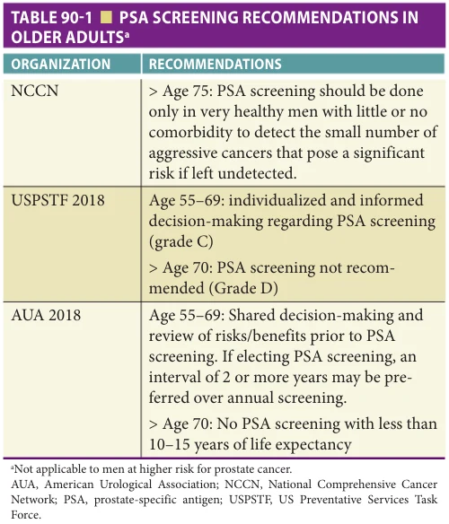
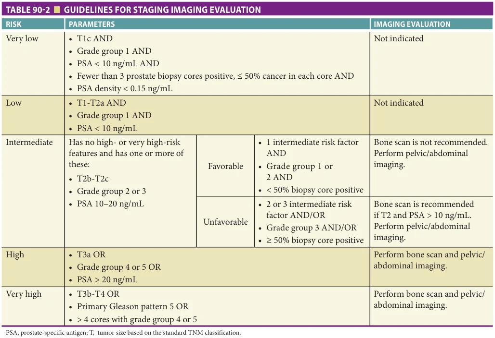
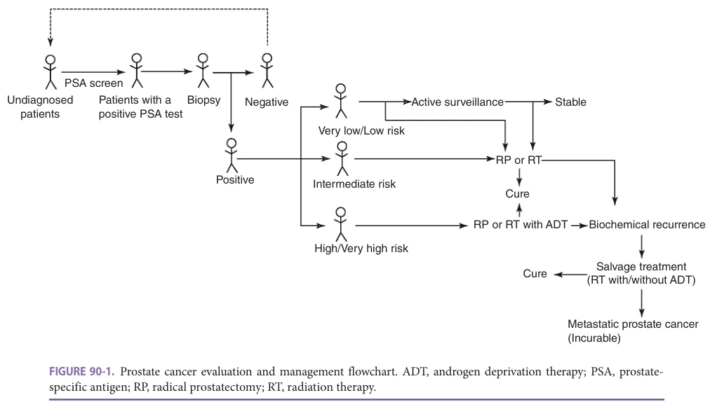
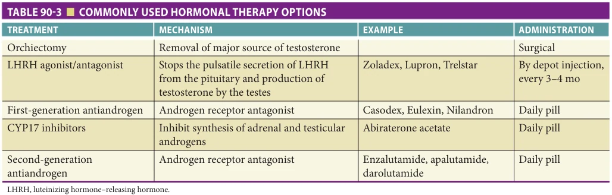

# Hazzard's Geriatric Medicine and Gerontology, 8e - Chapter 90: Prostate Cancer

Liang Dong, Mark C. Markowski, Kenneth J. Pienta

> **Status.** Fast build from the book; not lane-reviewed.

> **Source and method.** Printed pages 1409-1420, from the marked 8th-edition copy (PDF page = printed page + 34). Prose follows its text layer; tables and figures are source-page crops. The book is canonical.

**[p. 1409]**

## EPIDEMIOLOGY AND RISK FACTORS

Prostate cancer remains the most common noncutaneous malignancy diagnosed in American men and is the second leading cause of cancer-related deaths. Currently about 248,000 US men per year are diagnosed with prostate cancer and about 34,000 US men per year die of the disease.

#### Learning Objectives

- List the risk factors for the development of prostate cancer.

- Understand the screening recommendations for prostate cancer in older men.

- Describe the treatment options for localized and advanced prostate cancer in older patients.

#### Key Clinical Points

1. There is no Food and Drug Administration (FDA)-approved treatment shown to reduce the risk of developing prostate cancer.

2. Life expectancy and comorbidities should be considered before initiating prostate cancer screening.

3. Localized prostate cancer in an older patient can be effectively treated with a range of therapies including watchful waiting, active surveillance, surgery, and/or radiation.

The only undisputed risk factors for prostate cancer are older age, African-American race, and positive family history. Prostate cancer is generally a disease of older men; risk increases exponentially with age, with a median age at presentation of 66 years. More than half of prostate cancer diagnoses and 90% of prostate cancer deaths occur in men older than 65. The incidence rates of the disease among African-American men are higher than rates for men in any other racial or ethnic background. African-American men are more likely to be diagnosed with prostate cancer and to die from it than their White counterparts. The estimated lifetime risk of prostate cancer is 17.6% for White and 20.6% for African-Americans, while the estimated lifetime risk of death is 2.8% and 4.7%. Early-onset prostate cancer may be inherited in an autosomal dominant fashion. Approximately 10% of all prostate cancer cases are hereditary, with an onset 6 to 7 years earlier than nonhereditary cases. Several germline mutations such as BRCA1/2, HOXB13, or ATM may also identify families at high risk. BRCA1/2 germline mutations are present in up to 6% of unselected prostate cancer patients. The prospective Identification of Men With a Genetic Predisposition to Prostate Cancer targeted screening study confirmed a higher incidence of prostate cancer, at a younger age and with more clinically significant tumors, only in BRCA2 mutation carriers compared with noncarriers.

Additional factors such as diet, obesity, hormones, inflammation and sexually transmitted diseases, and occupational exposure have all been implicated in prostate carcinogenesis, but without consistent results. Dietary fat may be a risk factor for prostate cancer. Multiple epidemiologic, case-control, and cohort studies have suggested a moderate-to-strong increased risk of developing prostate cancer, particularly advanced disease, associated with total dietary fat, saturated fat, α-linolenic fatty acid, and cooked red meat. Two large prospective studies and a smaller case-control study suggest that fish intake may be

protective, possibly owing to marine omega-3 fatty acids— known antagonists of arachidonic acid, which suppress the production of proinflammatory cytokines. Evidence for the association with dietary fat is further correlated with worldwide incidence patterns; prostate cancer is more common in the United States and northern European countries and is relatively rare in Asia and Africa. When Asian men migrate to the West and change from a low-fat to a high-fat diet, their risk of prostate cancer increases. However, many of the men migrating from low-fat diet areas also consume green tea and soy products, which contain isoflavones and estrogen that may act as antioxidants and chemoprotectants against prostate-specific carcinogenesis. There appears to be an inverse relationship between soy intake and prostate cancer risk.

There is no consistent association between obesity and prostate cancer incidence. However, there are associations between obesity and aggressive prostate cancer, recurrence after primary therapy, and death from prostate cancer.

**[p. 1410]**

Data from the Prostate Cancer Prevention Trial (PCPT) suggest that obesity increases the risk of higher-grade cancers, but decreases the risk of low-grade prostate cancer. These findings suggest that obesity may somehow play a role in the progression from latent to clinically significant prostate cancer. Data from a prospective study of 3398 African-American and 22,673 non-Hispanic White men who participated in the Selenium and Vitamin E Cancer Prevention Trial (SELECT) demonstrated that obesity was more strongly associated with increased prostate cancer risk among African-American than non-Hispanic White men and that reducing obesity among African-American men could reduce the racial disparity in cancer incidence. Although the specific role of obesity in prostate cancer risk is unclear, it may be linked to other risk factors such as dietary fat and meat intake, hormone metabolism, and insulin metabolism. The prevalence of obesity also correlates with prostate cancer risk across populations and may provide a link between the increased risk of prostate cancer with westernization.

A diet rich in fruits and vegetables is associated with reduced risk for several cancers, but their effect on prostate cancer risk is unclear. There is an inverse association with use of tomatoes and tomato products, presumably owing to the effects of lycopene, the most common carotenoid in the human body and one of the most potent carotenoid antioxidants. The Health Professionals Follow-Up Study (HPFS) found that frequent consumption of tomato products is associated with a decreased risk of prostate cancer, and in a meta-analysis of 21 case-control and cohort studies, a significant 10% to 20% risk reduction was associated with high versus low intake of tomatoes. The majority of these studies also show a stronger effect for cooked versus raw tomatoes.

Although it seems intuitive that testosterone levels may influence the incidence of prostate cancer, no evidence confirms this association. Dihydrotestosterone, the active hormone produced from the conversion of testosterone by the enzyme 5α-reductase, is associated in some studies with increased risk. A prospective, population-based study of 1156 men showed no correlation between 17 different hormones and prostate cancer development, with the possible exception of androstanediol glucuronide. Importantly, no dose-response relationships were seen, suggesting that serum hormone levels may not be useful even in risk stratification.

There is some evidence that chronic inflammation may increase prostate cancer risk. One meta-analysis of 11 studies on prostatitis and prostate cancer showed an overall relative risk of 1.6. A prospective study of men without biopsy indication (PCPT participants who had a negative end-of-study biopsy and who subsequently enrolled in the SELECT) demonstrated that benign tissue inflammation was positively associated with prostate cancer. Population studies have suggested an increased risk of prostate cancer in patients with sexually transmitted diseases (STDs), including syphilis, recurrent gonorrhea, human papilloma

virus (HPV), and HIV. A meta-analysis of 17 studies of prostate cancer and sexual patterns suggested that an increased number of sexual partners is associated with an increased prostate cancer risk, possibly through an increased exposure to STDs. There are currently no strong data to suggest a link between benign prostate hypertrophy (BPH) and prostate cancer risk.

## PREVENTION

Chemoprevention is an area of ongoing research, and in many ways, prostate cancer is an ideal disease for this approach— relatively slow growing, centered in the older adult population, yet with devastating effects and difficult management after the onset of metastasis. To date, many promising agents have failed to show a protective benefit against developing prostate cancer, and no drugs or food supplements have been approved for prostate cancer prevention.

5α-Reductase Inhibitors Finasteride blocks the actions of 5α-reductase, the enzyme that converts testosterone to dihydrotestosterone. The PCPT and the Reduction by Dutasteride of Prostate Cancer Events (REDUCE) trials investigated the role of 5α-reductase in prostate cancer prevention. These trials were based on two observations: androgens are required for prostate cancer development and men with congenital 5α-reductase deficiency develop neither BPH nor prostate cancer. Both of these randomized, double-blind, placebo-controlled trials showed prostate cancer risk reduction with finasteride. However, both trials also found an apparent increase in high-risk cancers in the intervention groups. High-grade prostate cancers are associated with a poorer prognosis after definitive therapy. Both the PCPT and REDUCE trials led the FDA to issue a safety announcement that 5α-reductase inhibitors may increase the risk of more serious prostate cancers and so are not approved for chemoprevention.

Vitamin E and Selenium Oxidative stress may play a role in the development of prostate cancer. Reactive oxygen species can damage deoxyribonucleic acid (DNA), lipids, and proteins. The association of prostate cancer and a high-fat diet may be secondary to the generation of increased fatty acids, which can cause lipid peroxidation. Selenium is an essential trace nutrient with antioxidant properties. α-Tocopherol is the most active and abundant source of vitamin E, and its antioxidant properties have been studied extensively in a variety of prostate cell lines and animal models. One trial of male smokers with a primary lung cancer end point included α-tocopherol (50 mg daily). Because groups taking α-tocopherol may have had decreased prostate cancer incidence and mortality, the role of antioxidants in prostate cancer prevention was studied further.

SELECT was a large, randomized, prospective, doubleblind trial designed to determine whether selenium and

**[p. 1411]**

vitamin E decrease the risk of prostate cancer in healthy men. In 2008, the trial was stopped early when an interim analysis demonstrated no evidence of clinical benefit of either agent. In addition to the lack of benefit of either agent alone or combined, there was a nonsignificant increased risk of prostate cancer in the vitamin E alone group. With additional follow-up in 2011, the number of prostate cancers in patients treated with vitamin E alone was significantly increased compared to the placebo arm. Thus, although there was great excitement about antioxidant supplementation for prostate cancer prevention, particularly in older people, randomized prospective trial data has shown no overall benefit.

## PRESENTATION/SCREENING

Most men who present with prostate cancer are asymptomatic, particularly in the era of prostate-specific antigen (PSA) testing, which detects many cancers long before they are clinically apparent. Patients rarely have urinary symptoms, as the majority of cancers arise in the posterior aspect of the prostate. Most men undergo evaluation after routine screening reveals either an elevated PSA or abnormal digital rectal exam (DRE). Since the advent of PSA testing and regular screening, in the United States the majority of patients have clinically localized, intermediate-risk prostate cancer at diagnosis. A minority of patients are diagnosed when they present with symptomatic metastatic disease, usually manifested as bony pain. For example, in 1988, 14% of new prostate cancer patients presented with metastatic disease, but that number had fallen to 3.3% by 1998 and has remained stable since that time. Although screening has strongly influenced this downward stage migration, there is still a debate as to whether it has significantly decreased prostate cancer–specific mortality.

Two large-scale, long-term, randomized clinical trials were designed to evaluate whether screening decreases mortality. The Prostate, Lung, Colorectal, and Ovarian Cancer (PLCO) trial was based in the United States and randomized over 76,000 men (age 55–74) to either an annual screening arm or control group. Those patients randomized to get screened had an annual PSA value for 6 years as well as a DRE for 4 years. After 7 years, screening was associated with a 22% relative increase in prostate cancers diagnosed with no difference in prostate cancer–specific mortality after both 7 and 10 years. The European Randomized Study of Screening for Prostate Cancer (ERSPC) trial randomized over 180,000 men (age 50–74) to screening versus control. In contrast to the PLCO trial, PSA screening resulted in a significant 20% relative reduction in prostate cancer– specific mortality after a median follow-up of 13 years (the number of men needed to be invited for screening to prevent one prostate cancer death was 742). The updated findings from the follow-up of the ERSPC trial (maximum of 16 years) corroborate earlier results that PSA screening significantly reduces prostate cancer–specific mortality.

However, it also reconfirms that PSA screening does not reduce all-cause mortality.

The results of the Cluster Randomized Trial of PSA Testing for Prostate Cancer (CAP) in men aged 50 to 69 suggested that a single PSA test did not improve prostate cancer– specific mortality after a median follow-up of 10 years. However, the optimal time intervals for PSA testing and when to stop screening is still unknown and under debate. One study predicted a 27% relative decrease in the probability of lives saved if the stopping age for PSA screening was changed from 74 to 69. This was tempered with a 50% relative decrease in overdiagnosis. A comparison of systematic and opportunistic screening suggested a reduction in overdiagnosis and cancer-specific mortality by systematic screening, while opportunistic screening resulted in a higher overdiagnosis rate with a marginal survival benefit. The National Comprehensive Cancer Network (NCCN) suggested that PSA screening after age 75 should be done only in very healthy men with little or no comorbidity to detect the small number of aggressive cancers that pose a significant risk if left undetected.

A summary of the various screening recommendations is provided in Table 90-1. These recommendations do not apply for men at higher risk for prostate cancer. In the absence of unified guidelines, a difficult task for primary care physicians is thus deciding which patients should undergo screening for prostate cancer. In the absence of definitive data, a reasonable approach to screening should involve an active discussion between the physician and patient, taking into consideration the patient’s overall health and treatment preferences. Men with a life expectancy of

*Table 90-1. PSA screening recommendations in older adults. Printed p. 1411.*

**[p. 1412]**

less than 10 to 15 years (owing to age or comorbidities) should be informed that screening may not be beneficial. Younger men with a family history of prostate cancer or BRCA2 mutation and African-American men should be encouraged to undergo screening, as the disease prevalence is high in these groups. Any patient with symptoms that may be attributable to prostate cancer (bone pain, hypercalcemia, symptomatic pelvic lymphadenopathy) warrants a PSA evaluation as a part of his initial evaluation, since symptomatic patients can enjoy significant improvement with the institution of hormonal therapy.

## EVALUATION

Once the decision to do screening for prostate cancer is made, the appropriate examinations include a serum PSA and DRE. PSA is a protein produced and secreted by both normal prostate and prostate cancer cells. It provides a sensitive but not highly specific screening test, as it is also elevated with BPH, inflammation, and infection of the prostate. The usual cutoff is 4 ng/mL, but 15% of men with normal PSA levels will have prostate cancer and 2% will have high-grade prostate cancer. PSA is, however, more sensitive than DRE, detecting more cancers at earlier stage and smaller-sized cancers than rectal examination alone. The free-to-total PSA ratio stratifies the risk of prostate cancer in men with 4 to 10 ng/mL total PSA. PSA-doubling time is also a factor in prostate assessment, and any patient with a rapid PSA-doubling time should be sent for further evaluation, even if the absolute value of the PSA is below the normal cutoff level. On the basis of an elevated PSA or an abnormal DRE, the patient should be referred for a transrectal or transperineal ultrasound-guided prostate biopsy. In general, six to 12 cores are taken for evaluation; areas that are abnormal on DRE may receive more biopsy attempts. Multiparametric magnetic resonance imaging (mpMRI) is a major tool for biopsy optimization with pooled sensitivity of greater than 0.90 and specificity of greater than 0.35. When mpMRI has shown a suspicious lesion, MR-targeted biopsy can be obtained through cognitive guidance, ultrasound/magnetic resonance fusion software, or direct in-bore guidance. In biopsy-naïve patients, the addition of targeted biopsy increases the number of detected prostate cancers by 20% to 30%.

If the biopsy is positive, a Gleason score is assigned. This score is one of the most important determinants of prognosis. The pathologist assigns a numerical value (on a scale of 1–5) to the most prevalent and the second most prevalent grades of cancer seen in the specimens. The score is then reported on a scale of 2 to 10, with 10 being the most aggressive cancer. Gleason scores should be reported separately, for example, 3 + 4 = 7, as the primary pathology has prognostic implications. Risk stratification plays an important role in both the selection and timing of treatment and is an important part of the initial evaluation. After

diagnosis, the natural course of prostate cancer can be estimated from tumor volume, aggressiveness, PSA level, and extent of disease. Tumor volume assessment includes local stage, the number of positive biopsy cores, and the extent of cancer in affected cores. Gleason score is currently the standard measurement of aggressiveness with grade group 1 tumors being Gleason score ≤ 6, grade group 2 being Gleason score 3 + 4, grade group 3 being Gleason score 4 + 3, grade group 4 being Gleason score 8, and grade group 5 being Gleason score 9 to 10. Taking all of these prognostic factors into account, newly diagnosed patients are classified as having very low-, low-, intermediate-, or high-risk disease. The patients in the intermediate risk group can be further stratified to favorable and unfavorable subgroups. A summary of the risk stratification and recommendations on staging is provided in Table 90-2. In addition to these broad risk groups, multiple nomograms are available to help clinicians estimate an individual patient’s probability of localized disease, risk of progression without intervention, and risk of recurrence after definitive therapy. Several of these tools are available online, and they can sometimes be more helpful than the broad categories in assessing an individual’s risk, as they allow integration of discordant factors (eg, high PSA with low Gleason score). PSA velocity prior to diagnosis may also provide valuable information in risk assessment; a PSA velocity greater than or equal to 2 ng/mL in the year prior to radical prostatectomy (RP) is predictive of greater risk of biochemical recurrence, cancer-specific mortality, and overall mortality.

The conventional staging evaluation for men with known prostate cancer or symptoms that could be attributable to metastatic prostate cancer includes serum chemistries, PSA, bone scan, and computed tomography (CT) scan of the abdomen and pelvis. These initial tests provide evaluation of the most likely sites of metastatic disease to avoid inappropriate surgical intervention or radiation therapy. As described in Table 90-2, the extent of evaluation for metastatic disease relates to the likelihood of finding disease. However, advanced imaging technologies have been dramatically changing this field. For example, choline positron emission tomography (PET)/CT, prostate-specific membrane antigen (PSMA) PET/CT, and whole-body MRI provide more sensitive detection of lymph nodes and bone metastases than the conventional tools. Figure 90-1 illustrates a stepwise approach to evaluation, monitoring, and treatment.

## MANAGEMENT

After an initial diagnosis of prostate cancer, treatment decisions should take into consideration a number of factors including the individual patient’s remaining life expectancy if known, comorbidities, baseline quality of life (QoL), treatment preferences, and disease characteristics/risk factors.

**[p. 1413]**

*Table 90-2. Guidelines for staging imaging evaluation. Printed p. 1413.*

*Figure 90-1. Prostate cancer evaluation and management flowchart. ADT, androgen deprivation therapy; PSA, prostate-specific antigen; RP, radical prostatectomy; RT, radiation therapy.. Printed p. 1413.*

**[p. 1414]**

Watchful Waiting The concept of observation or watchful waiting involves deferring treatment until patients develop symptomatic disease. It was first proposed in the 1970s when research suggested that delaying therapy until the onset of symptoms did not increase prostate cancer–specific mortality in patients with locally advanced or metastatic disease. However, a subsequent study found that overall survival was longer in patients treated immediately, and the rate of complications, such as bone pain, pathologic fractures, spinal cord compression, and ureteral obstruction was higher in the deferred group. Because PSA testing allows detection of cancers some 5 to 15 years earlier than DRE, men with T1c (PSA detected) tumors treated with watchful waiting may have better than 20-year disease-specific survival. Among a prospective cohort of 300 men (mean age 72) with localized disease, an equivalent 15-year overall survival was observed in those who deferred therapy versus those who received initial treatment. Watchful waiting, either at the time of initial diagnosis or at the time of progression, may be applicable in older men without metastatic disease. In the AUA guideline, watchful waiting is recommended for men with a life expectancy greater than or equal to 5 years with low- or intermediate-risk localized prostate cancer. In patients with high-risk disease, watchful waiting should only be considered in asymptomatic men with limited life expectancy (≤ 5 years).

Active Surveillance Active surveillance or expectant management differs from watchful waiting in the intensity of monitoring and the expectation of delayed but successful definitive, potentially curative therapy. This strategy is based on the observation that there is tremendous heterogeneity in the natural history of prostate cancer, and a significant number of men may be “overdiagnosed” in the sense that diagnosis and treatment may not improve either QoL or survival. The selection criteria for active surveillance remain controversial, so should be made by the patient with his urologist. Active surveillance involves regular monitoring with PSA every 3 months, clinical examination with DRE every 6 months, and repeat biopsies as warranted by PSA and DRE (which can occur as frequently as once a year). An increase in PSA velocity (doubling time fewer than 3 years), primary Gleason pattern of 4 or 5 on repeat biopsy, or an increased number or extent of positive biopsy cores suggests progression of disease, and intervention with appropriately selected therapy should be initiated. Many experts feel that this is a reasonable approach for men with low-risk disease and may represent a practical compromise between radical treatment for all patients and watchful waiting with palliative treatment only (a strategy that undertreats aggressive disease). Although active surveillance may avoid overtreatment and allow patients to maintain their baseline QoL, the strategy carries with it a risk of local or metastatic

progression before active treatment is initiated. It is important, therefore, that patients are made aware that even the most careful monitoring may miss the window for administering curative therapy.

## Local Therapy: Surgery, Radiation, or Brachytherapy

Radical prostatectomy RP involves removal of the prostate and seminal vesicles, and is an appropriate therapy for any patient with disease confined to the prostate, a life expectancy more than 10 years, and no contraindications to surgery. Data have shown that outcomes are generally better with high-volume surgeons within high-volume medical centers. Laparoscopic and robotic prostatectomies have been refined and moved into mainstream care. Outcome data to date suggest that in the hands of an experienced surgeon, these approaches are comparable to open surgery and may involve less morbidity. Randomized clinical trials have shown no benefit for neoadjuvant hormonal therapy with RP. Pathologic examination after surgery allows for verification of organ confinement and margin status as well as complete histologic examination. Almost 50% of patients with biopsy Gleason 6 disease are upgraded to Gleason 7 or higher once the entire gland is removed and evaluated.

External beam radiation therapy External beam radiation therapy (EBRT) in most centers is now delivered using intensity-modulated radiation therapy (IMRT) or stereotactic body radiotherapy (SBRT). IMRT is a form of external beam photon therapy that uses multiple radiation beam and/or arcs to provide a highly conformal treatment of the prostate with normal tissue sparing of adjacent organs. SBRT generally utilizes photon-based IMRT treatment to deliver hypofractionated radiation treatment usually in five or fewer fractions of treatment. Often gold fiducial markers are implanted in the prostate prior to EBRT to provide landmarks for accurate daily dosing.

Radiation dosing is currently based on risk of recurrence. Patients with low-risk prostate cancer are generally treated with 70 to 75 Gy in 35 to 41 fractions. Higher doses of 75 to 80 Gy are recommended for patients with intermediate- and high-risk features. In addition, intermediaterisk patients benefit from 4 to 6 months of neoadjuvant and adjuvant androgen deprivation therapy (ADT), while highrisk patients should receive neoadjuvant and adjuvant ADT for a total of 2 to 3 years. Because the prostate is not removed with EBRT, there is no pathologic confirmation of the extent of disease or adjustment of the biopsy Gleason score. Relative contraindications to EBRT include active collagen vascular disease, inflammatory bowel disease, and microvascular damage from hypertension or diabetes.

Brachytherapy Brachytherapy involves radioactive iodine (125I) or palladium (103Pd) implants, which are placed in the prostate under general anesthesia. They emit shortrange radiation within the prostate, generally avoiding the bladder and rectum, and lose their radioactivity gradually.

**[p. 1415]**

Prostate brachytherapy as monotherapy is indicated for patients with low-risk disease and small prostate volume (< 60 g). For intermediate-risk patients, brachytherapy is frequently combined with EBRT (40–50 Gy). High-risk patients are generally considered poor candidates for this treatment modality.

Although there are no good randomized data comparing local treatment modalities, a review of 2991 patients treated at the Cleveland Clinic and Memorial Sloan Kettering Cancer Center showed similar 5-year biochemical relapse-free survival rates for RP, EBRT, and brachytherapy, leading the authors to conclude that intrinsic tumor characteristics rather than treatment modality play the larger role in determining progression after definitive therapy. Given similar outcomes between EBRT and prostatectomy, logistics and potential side effects may play a significant role in treatment decisions. Some men may not be candidates for major pelvic surgery, and therefore prostatectomy may not be an option. Others may find the 8 to 9 weeks of daily radiation treatments unacceptable and opt for prostatectomy or brachytherapy, which is completed in a single surgical procedure. Incontinence is the primary side effect noted after prostatectomy, though reported rates vary significantly from surgeon to surgeon. EBRT causes short-term irritative bladder symptoms; long-term incontinence is rare. Bowel dysfunction is a potential short and/or delayed side effect of radiation therapy. Impotence occurs in as many as 50% of patients treated with any of the three local approaches, though it tends to occur later with EBRT than with prostatectomy. Primary care providers may want to refer patients to both urology and radiation oncology in order to fully educate patients about their choices.

Primary Androgen Deprivation Patients with unfavorable prognostic factors, or those patients who are not interested in the risk-benefit ratio of local therapy, may choose primary hormonal therapy. Approximately 12.5% of the 3486 men in the Prostate Cancer Outcomes Study chose hormonal treatment as initial therapy, considered to be a surprisingly high number. Clearly, there is no chance of cure with this modality, but for some patients the risk of relapse may be too high to pursue aggressive local therapy. There is also scant evidence about the outcomes associated with this approach. In the European Association of Urology (EAU) guideline, ADT monotherapy is not recommended for asymptomatic patients. In patients with locally advanced disease, ADT monotherapy is only recommended for those patients unwilling or unable to receive any form of local treatment if they have a PSA-doubling time of less than 12 months and a PSA value of greater than 50 ng/mL, a poorly differentiated tumor, or troublesome local disease-related symptoms.

Adjuvant Therapy At this time, there is no standard adjuvant chemotherapy for patients at high-risk of recurrence, although there are

several intergroup trials examining the role of adjuvant chemotherapy with both RP and EBRT. Adjuvant hormonal therapy, as noted earlier, is now standard of care with EBRT in patients with intermediate- and high-risk disease; after RP, it is recommended only for patients with node-positive disease. Patients whose PSA levels do not fall to an undetectable level after surgery should be evaluated for adjuvant salvage therapy, including EBRT with or without ADT, or ADT alone.

## POSTTREATMENT SURVEILLANCE

The scheduled follow-up after definitive local therapy depends on the risk of recurrence and the potential for curative salvage therapy. Patients at high risk of recurrence who would be good candidates for further intervention should have regular PSA testing (every 1–3 months) and DRE at least annually. Patients at low risk of recurrence or poor intervention candidates are more appropriately followed with evaluations every 4 to 6 months for the first 5 years and annually thereafter. Forty-five percent of patients who recur after prostatectomy do so within 2 years. Seventyseven percent of recurrences occur within the first 5 years after prostatectomy and 96% within 9 years. Any patient with symptoms referable to local or systemic relapse (particularly new bone pain) should be evaluated with repeat serum and radiologic tests.

Biochemical Recurrence Biochemical recurrence after RP is defined as a PSA level greater than or equal to 0.2 ng/mL and rising on two or more determinations. Recurrence after EBRT has been redefined by consensus as nadir PSA plus 2. The pattern of local recurrence is usually 1 to 3 years after primary therapy, with a slowly rising PSA or new finding on DRE; these patients should be followed closely and referred for local salvage therapy, if appropriate. The need for biopsy of radiologically proven disease in this setting is controversial. Patients who relapse quickly after local therapy (< 6 months) are more likely to have metastatic disease that was not discovered prior to definitive local therapy and are therefore unlikely to respond to local salvage therapy. As mentioned above, new PET imaging tracers appear more accurate in the assessment of prostate cancer. In 2019, the EAU guidelines for imaging in patients with recurrence recommend performing a PSMA PET/CT early after initial treatment if the result will influence subsequent treatment decisions.

Patients with a rising PSA and no clinical, symptomatic, or radiographic evidence of disease present a therapeutic dilemma, as there is no clear consensus as to the timing of further therapy. Some men with biochemical recurrence will eventually die of prostate cancer, while others will have indolent disease and ultimately die of other causes. Prognosis is best estimated by considering initial stage, Gleason grade, and PSA in addition to the absolute value of the

**[p. 1416]**

*Table 90-3. Commonly used hormonal therapy options. Printed p. 1416.*

PSA at the time of recurrence and the PSA-doubling time. PSA-doubling time has been shown to be a useful parameter for monitoring patients and deciding when to initiate treatment after biochemical recurrence. PSA-doubling time of fewer than or equal to 3 months predicts cancer-specific mortality among patients with biochemical recurrence after either RP or EBRT.

Salvage Local Therapy Approximately 20% to 25% of men with local recurrence postprostatectomy can be cured with early salvage EBRT. Several factors predict long-term response to salvage ERBT: Gleason score less than or equal to 7, positive surgical margins at RP, negative nodal or seminal vesicle involvement, and post-RP PSA kinetics consistent with local failure. Patients who recur immediately after definitive radiation therapy are candidates for ADT, observation, or, in selected cases, salvage prostatectomy.

## ADVANCED DISEASE

A positive bone scan and pain in a weightbearing area correlating to the scan should prompt an x-ray to assess for impending pathologic fractures. Patients should be made nonweightbearing and immediately referred for both surgical and radiation consultation. The possibility of cord compression should be suspected in any man with a history of prostate cancer and new-onset back pain. Pain from spinal cord compression is often severe and generally predates neurologic symptoms. A negative neurologic examination should not delay a definitive radiologic study (preferably MRI or CT myelogram), and patients with suspected cord compression should be initiated and maintained on steroids until compression is ruled out.

## Hormonal Therapy

First-line hormonal therapy Patients with advanced disease at presentation, or patients who relapse after definitive local therapy are initially treated with some form of ADT. The timing of hormonal therapy for a biochemical recurrence after definitive therapy is controversial. Early initiation of

ADT in these patients reduced prostate cancer–specific mortality (17% relative risk) when compared to symptomdriven initiation. However, overall mortality was similar in both groups. Without clear guidelines, ADT is typically initiated based on PSA-doubling time, Gleason score, and patient preferences. Hormonal therapy for patients with advanced disease is usually initiated at presentation.

The goal of ADT is to decrease the level of testosterone available to potentiate growth of the prostate cancer cells. A variety of treatments can achieve this goal; Table 90-3 outlines the spectrum of drugs, which either alone or in combination are used as ADT. Currently, the majority of men on ADT are treated with luteinizing hormone– releasing hormone (LHRH) agonists or antagonists alone (monotherapy) or in combination with an antiandrogen (combined androgen blockade). Although some physicians routinely use combination therapy, others prefer LHRH monotherapy, and there are no clear data showing benefit of one strategy over the other. Patients with known metastatic disease, however, need to be on an antiandrogen for at least 30 days, starting 7 to 10 days prior to initiation of LHRH agonist therapy to avoid the initial testosterone flare associated with LHRH therapy.

Orchiectomy (surgical castration) is an underused and underappreciated form of hormonal treatment. Morbidity associated with the procedure currently is minimal and barring unforeseen complications, it is an outpatient procedure. Data from the Prostate Cancer Outcomes Study provided an update on QoL issues for patients receiving hormonal therapy. Men who chose LHRH agonist therapy reported greater problems than orchiectomy patients did with their overall sexual functioning, despite both groups having similar levels of function prior to beginning treatment. LHRH patients were also less likely to perceive themselves as free of cancer, likely because of the need for ongoing injections.

The duration of response to first-line ADT is typically 18 to 24 months, although patients who initiate therapy for biochemical relapse alone may show PSA responses for much longer. The continuation of ADT in the setting of hormone-refractory disease is a subject of some controversy.

**[p. 1417]**

Given the potential for improved survival for patients remaining on testicular androgen suppression, many physicians continue to administer LHRH agonists for the duration of treatment with secondary hormonal therapies and chemotherapy.

Side effects from hormonal therapies include hot flashes, insomnia, decreased libido, erectile dysfunction, weight gain/fluid retention, diabetes, increased risk of cardiovascular events, and breast enlargement/nipple tenderness. Breast enlargement can be curtailed, although not reversed, by a few treatments of electron beam radiation directly to the breast stem cells underneath the areola. This low-risk treatment can provide significant physical and psychological benefit. Antiandrogen treatment can lead to hepatic dysfunction, requiring monitoring of liver function tests (LFTs) after the initial month of therapy, and every 3 months thereafter. Antiandrogens are also associated with gastrointestinal effects, including nausea, diarrhea, and constipation. Estrogens can predispose patients to thromboembolic complications, including deep vein thrombosis, pulmonary embolism, and myocardial infarction.

Patients with decreased testosterone caused by orchiectomy or ADT also have a significantly increased risk of bone loss. Most studies have demonstrated a 2% to 3% decrease per year in bone mineral density (BMD) of the hip and spine during initial testosterone suppressing therapy, and BMD continues to decline during long-term therapy. Fracture rates are also higher in patients on ADT. Three large, claimsbased studies have shown that LHRH treatment is independently associated with fracture risk. Patients on testosterone suppressing therapy should, therefore, be encouraged to take daily calcium (500 mg) and vitamin D (400 IU) supplements to prevent bone loss. In addition, patients may benefit from BMD testing to evaluate overall bone health. Men with osteopenia or osteoporosis should be considered for treatment with oral bisphosphonates (see section on “Supportive Care”).

Intermittent androgen deprivation Intermittent androgen blockade has been advocated as a way to decrease side effects from ADT and also to, potentially, increase the time to androgen independence. With this strategy, patients are cycled on and off hormonal therapy based on PSA response. Once patients achieve an undetectable PSA in response to ADT, they are taken off therapy and monitored; treatment is reinitiated based on absolute PSA value and/or PSA-doubling time. Two prospective trials found that intermittent therapy was noninferior to continuous treatment for the primary outcome of overall survival. Additionally, QoL indicators were better in the intermittent treatment group in one trial.

Second-line hormonal therapy Castration-resistant prostate cancer (CRPC) is defined as a rising PSA (or radiographic progression) with a castrate level of serum testosterone (< 50 ng/dL) and after withdrawal or addition of an antiandrogen. For instance, if the CRPC patient is receiving combined androgen blockade (ie, a gonadotropin-releasing

hormone [GnRH] agonist and antiandrogen), the next step is antiandrogen withdrawal. The maximum duration of response is approximately 5 months. To date, there have been no identified predictors of androgen withdrawal response, although a longer duration of treatment with flutamide has been associated with response in two larger trials.

Since 2010, there have been several new antineoplastic agents that have shown a survival benefit in metastatic CRPC (mCRPC). In the majority of instances, a medical oncologist will manage the treatment regimens described below. However, recognizing the side effects of each treatment is paramount in the care provided by the geriatrician, which may require a dose adjustment or cessation of therapy. Abiraterone acetate and enzalutamide are approved for the treatment of mCRPC, both of which target androgen signaling. Abiraterone acetate is an irreversible inhibitor of the cytochrome P450 isoform-17 (CYP17), a key enzyme for androgen synthesis in the testes and adrenal glands. The precursor to abiraterone acetate, ketoconazole, can inhibit multiple P450 enzymes resulting in off-target effects and toxicities. In combination with prednisone, abiraterone acetate increases overall survival. Its ability to inhibit androgen synthesis can lead to mineralocorticoid excess, resulting in edema (31%), hypokalemia (17%), and hypertension (10%). Less common side effects are LFT elevations and cardiac abnormalities (tachycardia, atrial fibrillation). In addition to the survival benefit, abiraterone acetate delayed the use of opioids for pain and skeletal-related events. Enzalutamide, apalutamide and darolutamide are androgen receptor antagonists, which prevent androgen from binding to the receptor and also inhibit nuclear translocation of the receptor. Similar to abiraterone acetate, enzalutamide increased overall survival regardless of chemotherapy status. Common side effects include fatigue, headaches, and hot flashes. Seizures were observed in approximately 1% of patients so these drugs should be used with caution in patients with a known seizure disorder. Since enzalutamide is used without prednisone, the side effects of mineralocorticoid excess are not seen. The most effective sequence of abiraterone acetate and enzalutamide is not known and may be dictated by the side effect profile of each medication or physician preference.

Estrogens, such as diethylstilbestrol, have shown promise both singly and in combination, although estrogen therapy is associated with side effects such as edema and thromboembolic complications. Judicious use of prophylactic agents, such as warfarin or low-dose aspirin, has been included in estrogen trials, but not prospectively. With the development of next-generation androgen signaling antagonists, use of estrogens has fallen out of favor.

The decision to pursue secondary hormonal manipulations will likely depend on several factors. Available data suggest that patients with a significant and prolonged response to initial hormonal therapy, or a significant antiandrogen withdrawal response, may be good candidates for a trial of secondary hormonal therapy. Poor functional status

**[p. 1418]**

and the presence of other medical problems may render attempts at further hormonal manipulation an attractive option, as these patients are often intolerant of the side effects associated with chemotherapy. Patients with rapid PSA-doubling times are likely to have more aggressive disease and may receive more benefit from chemotherapy or a clinical trial with a novel agent.

Chemotherapy Chemotherapy still has an important role in mCRPC after progressing through the multiple lines of hormonal therapy. Although mCRPC was once labeled “chemotherapy resistant,” a number of agents now show great promise in both palliative and response end points. Docetaxel is the first chemotherapeutic agent with demonstrated survival benefit in prostate cancer and has become standard of care for first-line therapy in castration-resistant disease. Mitoxantrone with prednisone has demonstrated palliative benefits in patients with bone metastases and is generally well tolerated. However, mitoxantrone has been supplanted by cabazitaxel as second-line chemotherapy. Cabazitaxel is a semisynthetic taxane with a similar mechanism to docetaxel. It increased overall survival when compared to mitoxantrone in the post-docetaxel setting. Mitoxantrone is currently third-line chemotherapy and used less frequently due to side effects and lack of survival benefit.

Radium-223 Radium-223 dichloride is an α-particle emitter, and it is the only bone-specific FDA-approved drug for mCRPC that is associated with a survival benefit. It selectively targets bone metastases, as it gets built into hydroxyapatite as a calcium substitute. In one trial, radium-223 improved median survival by 3.6 months, prolonged time to first skeletal event, and improved pain scores and QoL. However, in a more recent trial, the addition of radium-223 to abiraterone acetate plus prednisone or prednisolone did not improve symptomatic skeletal event-free survival in patients with mCRPC, and was associated with an increased frequency of bone fractures compared with placebo.

Sipuleucel-T Sipuleucel-T was the first active cellular immunostimulant approved as a first-line therapy for non- to minimally symptomatic mCRPC. Mononuclear blood cells are harvested through leukapheresis. Antigen-presenting cells are activated with the antigen prostatic acid phosphatase and granulocyte-macrophage colony-stimulating factor ex vivo. The autologous, activated product is reinfused three times. One sipuleucel-T trial demonstrated a 4.1-month increase in survival. However, no PSA decline was observed, and there was no difference in the progression-free survival (PFS) in the treatment group compared to placebo.

Poly (ADP Ribose) Polymerase Inhibitors Poly (ADP ribose) polymerase (PARP) inhibitors have shown high rates of response in men with somatic and/

or germline homologous recombination repair (HRR) deficiency. There are two PARP inhibitors that have been approved by the US FDA. Olaparib is approved for patients with deleterious or suspected deleterious germline or somatic HRR gene-mutated mCRPC, who have progressed following prior treatment with enzalutamide or abiraterone. The most common adverse events of olaparib are anemia, nausea, decreased appetite, and fatigue. Rucaparib is approved for patients with a germline and/or somatic deleterious BRCA mutation-associated mCRPC who have been treated with AR-directed therapy and a taxane-based chemotherapy.

## SUPPORTIVE CARE

Bisphosphonates/RANKL Inhibitors Bisphosphonates are synthetic analogues of inorganic pyrophosphates with high avidity for calcium and areas of bone mineralization (see Chapter 51 for a full discussion of these drugs). Although various bisphosphonates have been tested in multiple clinical trials in the setting of advanced prostate cancer, only zoledronic acid- has a demonstrated effect on bone metastases in this population. Intravenous zoledronic acid is generally well tolerated, though patients should have regular creatinine assessment as renal insufficiency is a contraindication for zoledronic acid and renal toxicity is a known, but relatively uncommon, side effect. In addition, bisphosphonate use is rarely associated with osteonecrosis of the jaw—so patients should have a dental examination prior to initiating therapy, and clinicians should ask patients regularly about their dental health.

As both increasing age and ADT place men at higher risk of osteoporosis, bisphosphonates may also be useful in prevention of secondary fractures in this population. Furthermore, bone is a major target for prostate cancer metastases. Thus, bone protection should be paramount, especially in the early stages of the disease. Zoledronic acid is commonly used in the outpatient setting in patients with bone metastases.

Denosumab is a monoclonal antibody directed against the RANK ligand to prevent pathologic fracture and osteopenia/osteoporosis. Denosumab was shown to be noninferior to zoledronic acid with respect to preventing skeletal-related events in men with mCRPC. Denosumab can be administered as a subcutaneous injection and used safely in patients with renal insufficiency.

Pain Control The majority of men with advanced prostate cancer have bone metastases, which are frequently very painful. Pain control is thus a critical issue in these patients and needs to be frequently monitored. Bone pain generally responds well to treatment with both nonsteroidal anti-inflammatory drugs and opioids, used alone or in combination. Although some older patients are very tolerant of narcotic analgesics, as a rule they should be started on low doses with careful

**[p. 1419]**

dose titration and individualized treatment plans to achieve maximal analgesia and maintain QoL. Constipation, the most common side effect of pain medications, should be aggressively addressed, but is generally well controlled with laxatives.

Palliative Radiation and Systemic Radioisotopes Palliative radiation therapy can provide significant pain relief for symptomatic bone metastases and is also used to prevent impending pathologic fracture. Thus, patients with one or two areas of severe bone pain, which is either inadequately controlled with narcotics or which requires unacceptably high doses of narcotics, should be referred to radiation oncology for consultation. Most palliative radiation is given in one to 10 dose fractions, and 80% to 90% of prostate cancer patients who receive palliative radiation for bone metastases experience significant and durable pain relief. The onset of pain relief may be as soon as

## FURTHER READING

Andriole GL, Crawford ED, Grubb RL 3rd, et al. Mortal-

ity results from a randomized prostate-cancer screening trial. N Engl J Med. 2009;360(13):1310–1319. Aus G, Robinson D, Rosell J, et al. South-East Region Prostate

Cancer Group. Survival in prostate carcinoma—outcomes from a prospective, population-based cohort of 8887 men with up to 15 years of follow-up: results from three countries in the population-based National Prostate Cancer Registry of Sweden. Cancer. 2005;103(5):943–951. Barrington WE, Schenk JM, Etzioni R, et al. Difference in

association of obesity with prostate cancer risk between US African American and non-Hispanic white men in the Selenium and Vitamin E Cancer Prevention Trial (SELECT). JAMA Oncol. 2015;1(3):342–349. Cornford P, van den Bergh RC, Briers E, et al. EAU-EANM-

ESTRO-ESUR-SIOG Guidelines on Prostate Cancer. Part II-2020 update: treatment of relapsing and metastatic prostate cancer. Eur Urol. 2021;79(2):263–282. Crook JM, O’Callaghan CJ, Duncan G, et al. Intermittent

androgen suppression for rising PSA level after radiotherapy. N Engl J Med. 2012;367(10):895–903. de Bono J, Mateo J, Fizazi K, et al. Olaparib for meta-

static castration-resistant prostate cancer. N Engl J Med. 2020;382:2091–2102. Epstein JI, Egevad L, Amin MB, Delahunt B, Srigley JR,

Humphrey PA. The 2014 International Society of Urological Pathology (ISUP) consensus conference on Gleason grading of prostatic carcinoma: definition of grading patterns and proposal for a new grading system. Am J Surg Pathol. 2016;40:244–252. Fenton JJ, Weyrich MS, Durbin S, Liu Y, Bang H,

Melnikow J. Prostate-specific antigen-based screening for prostate cancer: evidence report and systematic

48 hours after the initiation of therapy, although some patients will not experience maximal relief for up to 2 weeks after therapy is complete. Systemic radioisotopes can deliver high-dose radiation to bone lesions without significantly affecting normal bone and can provide palliative benefit to patients with widespread, painful bone metastases, which are refractory to palliative chemotherapy or narcotic analgesia. Strontium-89 and samarium-153 are both β-emitters that are FDA-approved for palliation and pain relief. These agents have the potential to cause significant myelosuppression and thrombocytopenia. More recently, the calcium mimetic radium-223 was shown to increase overall survival as well as provide pain relief, making it an attractive treatment for castration-resistant, symptomatic, bony metastases. Radium-223 is an α-emitter, which can transmit higher energy over shorter distances compared to β-emitters, making this treatment more effective with less side effects.

review for the US Preventive Services Task Force. JAMA. 2018;319:1914–1931. Fizazi K, Shore N, Tammela TL, et al. Darolutamide in non-

metastatic, castration-resistant prostate cancer. N Engl J Med. 2019;380:1235–1246. Hofman MS, Lawrentschuk N, Francis RJ, et al. Prostate-

specific membrane antigen PET-CT in patients with high-risk prostate cancer before curative-intent surgery or radiotherapy (proPSMA): a prospective, randomised, multicentre study. Lancet. 2020;395:1208–1216. Hoskin P, Sartor O, O’Sullivan JM, et al. Efficacy and safety

of radium-223 dichloride in patients with castrationresistant prostate cancer and symptomatic bone metastases, with or without previous docetaxel use: a prespecified subgroup analysis from the randomised, double-blind, phase 3 ALSYMPCA trial. Lancet Oncol. 2014;15:1397–1406. Hugosson J, Roobol MJ, Mansson M, et al. A 16-yr follow-up

of the European randomized study of screening for prostate cancer. Eur Urol. 2019;76:43–51. Hussain M, Fizazi K, Saad F, et al. Enzalutamide in men

with nonmetastatic, castration-resistant prostate cancer. N Engl J Med. 2018;378:2465–2474. Kantoff PW, Higano CS, Shore ND, et al. Sipuleucel-T

immunotherapy for castration-resistant prostate cancer. N Engl J Med. 2010;363(5):411–422. Klein EA, Thompson IM Jr, Tangen CM, et al. Vitamin E

and the risk of prostate cancer: the Selenium and Vitamin E Cancer Prevention Trial (SELECT). JAMA. 2011;306(14):1549–1556. Martin RM, Donovan JL, Turner EL, et al. Effect of a

low-intensity PSA-based screening intervention on prostate cancer mortality: the CAP randomized clinical trial. JAMA. 2018;319:883–895.

**[p. 1420]**

Mottet N, van den Bergh RC, Briers E, et al. EAU-

EANM-ESTRO-ESUR-SIOG Guidelines on Prostate Cancer—2020 Update. Part 1: screening, diagnosis, and local treatment with curative intent. Eur Urol. 2021; 79(2):243–262. Neal DE, Metcalfe C, Donovan JL, et al. Ten-year mortality,

disease progression, and treatment-related side effects in men with localised prostate cancer from the ProtecT randomised controlled trial according to treatment received. Eur Urol. 2020;77:320–330. Nicolosi P, Ledet E, Yang S, et al. Prevalence of germline

variants in prostate cancer and implications for current genetic testing guidelines. JAMA Oncol. 2019;5:523–528. Nyberg T, Frost D, Barrowdale D, et al. Prostate cancer risks

for male BRCA1 and BRCA2 mutation carriers: a prospective cohort study. Eur Urol. 2020;77:24–35. Palapattu GS, Sutcliffe S, Bastian PJ, et al. Prostate carcino-

genesis and inflammation: emerging insights. Carcinogenesis. 2004;26:1170–1181. Pienta K, Bradley D. Mechanisms underlying the devel-

opment of androgen-independent prostate cancer. Clin Cancer Res. 2006;12(6):1665–1671. Potosky AL, Knopf K, Clegg LX, et al. Quality-of-life out-

comes after primary androgen deprivation therapy: results from the prostate cancer outcomes study. J Clin Oncol. 2001;17:3750–3757. Rouviere O, Puech P, Renard-Penna R, et al. Use of prostate sys-

tematic and targeted biopsy on the basis of multiparametric

MRI in biopsy-naive patients (MRI-FIRST): a prospective, multicentre, paired diagnostic study. Lancet Oncol. 2019;20:100–109. Ryan CJ, Smith MR, de Bono JS, et al. Abiraterone in met-

astatic prostate cancer without previous chemotherapy. N Engl J Med. 2013;368(2):138–148. Saad F, Gleason DM, Murray R, et al. Long-term efficacy

of zoledronic acid for the prevention of skeletal complications in patients with metastatic hormone-refractory prostate cancer. Zoledronic Acid Prostate Cancer Study Group. J Natl Cancer Inst. 2004;96:879–882. Schroder FH, Hugosson J, Roobol MJ, et al. Screening and

prostate-cancer mortality in a randomized European study. N Engl J Med. 2009;360(13):1320–1328. Smith M, Parker C, Saad F, et al. Addition of radium-223

to abiraterone acetate and prednisone or prednisolone in patients with castration-resistant prostate cancer and bone metastases (ERA 223): a randomised, double-blind, placebo-controlled, phase 3 trial. Lancet Oncol. 2019; 20:408–419. Smith MR, Saad F, Chowdhury S, et al. Apalutamide treat-

ment and metastasis-free survival in prostate cancer. N Engl J Med. 2018;378:1408–1418. Tannock IF, de Wit R, Berry WR, et al. Docetaxel plus pred-

nisone or mitoxantrone plus prednisone for advanced prostate cancer. N Engl J Med. 2004;351:1502–1512.
