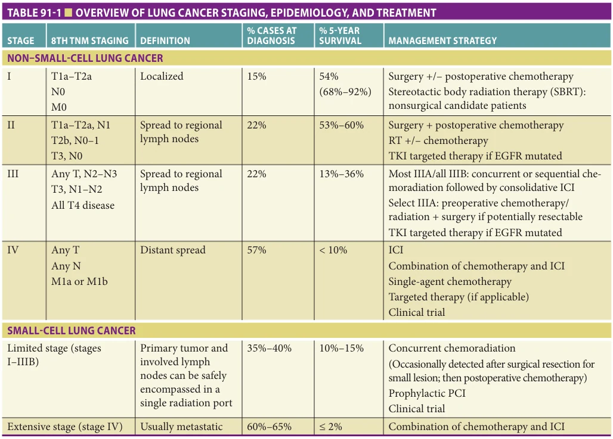
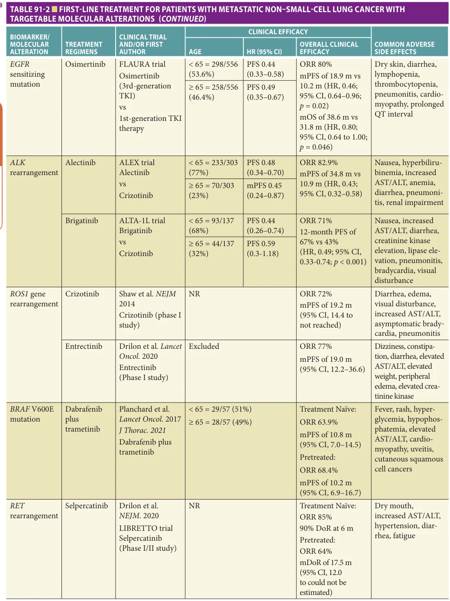
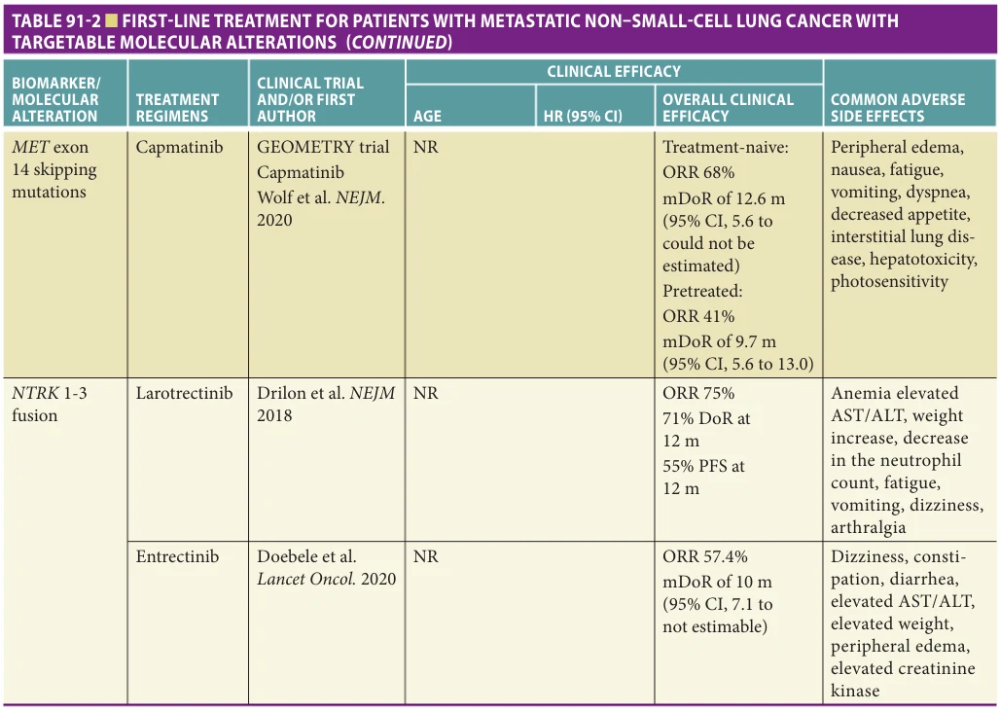
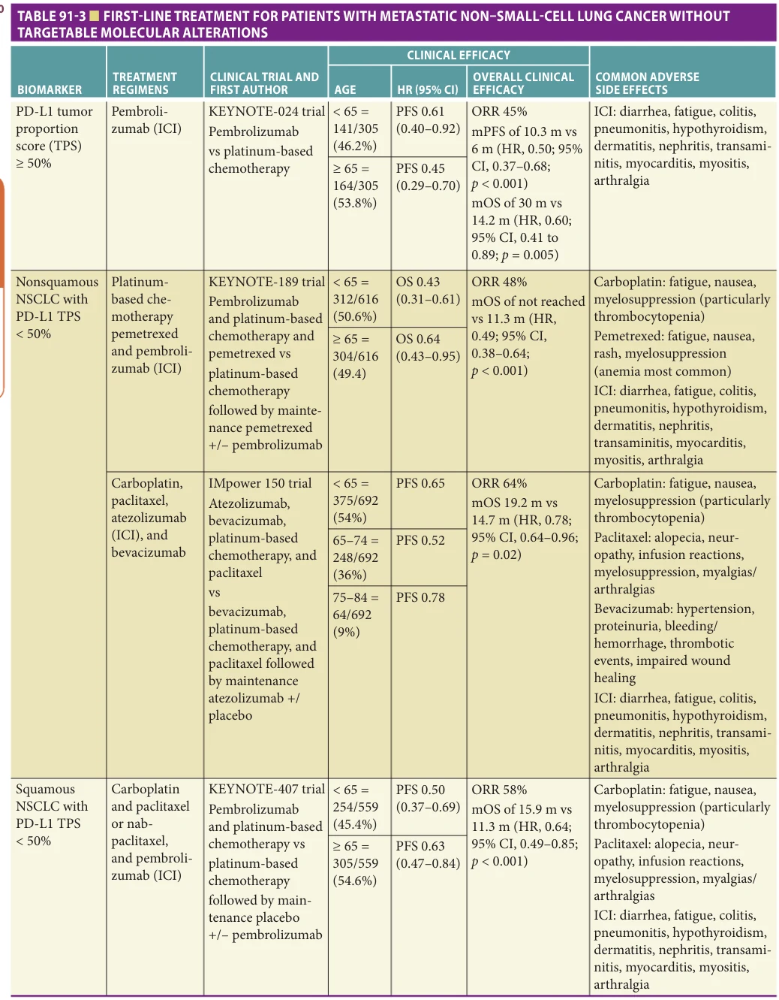

# Hazzard's Geriatric Medicine and Gerontology, 8e - Chapter 91: Lung Cancer

Asrar Alahmadi, Ajeet Gajra, Carolyn J. Presley

> **Status.** Fast build from the book; not lane-reviewed.

> Not cited in the 2020-2026 past papers.

> **Source and method.** Printed pages 1421-1434, from the marked 8th-edition copy (PDF page = printed page + 34). Prose follows its text layer; tables and figures are source-page crops. The book is canonical.

**[p. 1421]**

## EPIDEMIOLOGY AND RISK FACTORS

Lung cancer remains the second most common cancer diagnosis, and the most common cause of cancer-related deaths among men and women in the United States. More patients die from lung cancer than from colon, breast, and prostate cancers combined. In 2021, it is estimated there will be 235,760 new cases of lung cancer with 69,410 men and 62,470 women dying from their disease. Lung cancer– associated deaths have been declining and have contributed to the overall decline in the cancer-related death rate from 2014 to 2018. This decline in the lung cancer death rate is attributable to several changes: (1) a decrease in smoking rates, (2) the advent of new therapies in lung cancer, and (3) the introduction of screening for high-risk populations. The risk of lung cancer increases with age. The median age at diagnosis is 71 years. By the year 2034, it is projected that there will be 77 million people 65 years or older, an almost 80% increase since 2012. This combination of a burgeoning geriatric population and newly recommended annual lowdose computed tomography (LDCT) scan screening will increase the number of older adults needing evaluation and treatment for lung cancer. Despite advances in screening for high-risk individuals, the majority (75%) of lung cancer is diagnosed with either spread to regional lymph nodes or distant sites (ie, stage III or IV).

#### Learning Objectives

- Become familiar with the general principles of lung cancer evaluation and its inherent need for a multidisciplinary approach to management.

- Identify the broad treatment paradigms for different stages of lung cancer, including more recent developments in therapeutics and their potential side effects.

- Discern geriatric issues in the multidisciplinary care of older adults with lung cancer and apply geriatric assessment and palliative care principles to their care trajectory.

#### Key Clinical Points

1. Lung cancer remains a cancer of older adults and confers substantial morbidity and mortality in an aging patient population.

2. Although major advances have been made in molecular diagnostics and therapeutics for a significant proportion of patients with advanced non–small-cell lung cancer (NSCLC), the side effects of cytotoxic chemotherapy, targeted therapy, and immunotherapy, among other modalities, have to be apprised on an individual basis.

3. Given the trade-offs of various lung cancer treatment options and poor prognosis in most patients with advanced disease, geriatricians play a key role in helping older adults with lung cancer and their caregivers define goals of care, optimize the management of geriatric syndromes and comorbid conditions, and better assess functional, cognitive, and psychosocial reserve to undergo an expanding menu of treatments.

4. Early integration of palliative and supportive care improves mood and quality of life and may prolong survival in patients with advanced disease, and such interventions may be particularly relevant for older adults.

The major modifiable risk factor for the development of lung cancer is tobacco use, accounting for approximately 80% of lung cancer cases. Smokers and nonsmokers are at risk for lung cancer; however, the risk is much higher (10-fold) among patients who have smoked cigarettes. The risk is directly proportional to the number of packyears and tar content. Patients exposed to passive tobacco smoke are also at risk, accounting for 25% of lung cancer cases. Men or women who smoke cigars and pipes are at an increased risk as well; however, their risk may be less than that of cigarette smokers. Smoking cessation even in long-time smokers decreases the risk of lung cancer development and is a major public health priority.

Lung cancer in never-smokers accounts for approximately 13% of patients with lung cancers in the United States, disproportionately affecting women. Never-smokers are more likely to have activating genetic alterations such as the epidermal growth factor receptor (EGFR) or

**[p. 1422]**

chromosomal rearrangements in anaplastic lymphoma kinase (ALK). These patients are treated with oral tyrosine kinase inhibitors targeting the specific mutation. Aside from the activating mutations in oncogenes, other possible pathogenic theories for lung cancer in never-smokers include exposure to environmental or occupational etiologic factors such as asbestos or radon. Occupational and environmental exposures are important questions to ask patients particularly if they have worked in construction, naval shipyards, or live in areas with high air pollution, diesel exhaust, or smoke from cooking and heating. Prior radiation therapy to the chest for other malignancies also increases the risk of a second primary lung cancer, particularly among smokers.

## SCREENING

Despite smoking cessation efforts and declining rates of heavy cigarette smoking, millions of Americans remain at increased risk for the development of lung cancer. Two randomized trials have reported statistically significant reductions in lung cancer mortality associated with LDCT screening. The National Lung Screening Trial (NLST) in the United States demonstrated that screening higher-risk persons (30+ pack-years and either current smokers or quit within the past 15 years) aged 55 to 74 years annually for 3 years with LDCTs reduced lung cancer mortality by 20% (95% confidence interval [CI], 6.8%–26.7%; p = .004) and all-cause mortality by 6.7% (95% CI, 1.2%–13.6%; p = .02) over screening with chest radiographs. An updated analysis showed that the estimated reduction in lung cancer mortality was 16% (95% CI, 5%–25%). The NELSON Netherlands trial reported that among high-risk current and former smokers, men who were randomly assigned to four rounds of LDCT screening had a 24% reduction (95% CI, 6%–39%) in lung cancer mortality compared with men who were randomly assigned to no screening. These two large randomized trials (NLST and NELSON) found that the average false-positive rate per screening round was 23.3% and 10.4%, respectively. Using a more recent definition of a positive LDCT screening on the basis of the Lung-RADS criteria yields a false-positive rate that may be somewhat lower than that seen in the NLST. A total of 0.06% of all false-positive screening results in the NLST led to a major complication after an invasive procedure was performed as a diagnostic follow-up to the screening. Over three screening rounds, 1.8% of NLST participants who did not have lung cancer had an invasive procedure after a positive screening result. An extended follow-up analysis of the NLST reported data after a median of 12.3 years of follow-up for mortality. The estimated number needed to screen with LDCT to prevent one lung cancer death was 303.

Based on the decrease in lung cancer–associated mortality in screening trials, in December 2013, the US

Preventive Services Task Force (USPSTF) released its updated recommendations to perform annual screening for lung cancer with LDCT scans in adults aged 55 to 80 who have a 30-pack-year smoking history and currently smoke or have quit within the past 15 years. Ideally, most cancers would be diagnosed at an early stage; however, among older adults with increasing comorbidity, it is critical to understand the impact of undergoing screening as they may be more likely to die from other comorbid conditions and not from cancer. The impact of these screening guidelines remains to be determined with regard to the diagnosis and treatment of early-stage lung cancers. The Centers for Medicare and Medicaid Services and the Veterans Administration (VA) have approved health care coverage for this screening recommendation. The issues of lead-time bias and additional morbidity and mortality are particularly relevant in the population of older adults in whom competing causes of death and multiple comorbidities are frequently encountered. In addition to the overdiagnosis of small tumors detected during screening, which could otherwise remain silent until the patient dies from other causes, screening for lung cancer with LDCT could potentially cause harm secondary to morbidity and mortality associated with biopsies and surgery, since lung tumors often appear as noncalcified nodules. In the NLST trial, only 25% of patient enrolled in the screening arms were age 65 to 74 and less than 1% were 75 years or older. Over 96% of the patients with a positive screen had a false-positive result after further work-up. This has important implications for screening among the oldest old patients with comorbid conditions. Among older adults, there is a higher risk for false-positive LDCT screening findings. Despite screening being endorsed as a new standard of care (SOC) for highrisk individuals, the regional utilization of LDCT screening for lung cancer varies considerably within the United States. Adults aged 65 to 74 seem somewhat more likely to utilize it in addition to those with prior cancer diagnoses as well as underlying respiratory illnesses. In another report, age was not associated with lung cancer screening, but retired status and presence of a personal physician were associated with receipt of screening. Other barriers may include a lack of physician awareness and resources as well as the requirement of a shared decision-making visit prior to screening.

## PATHOLOGY

Lung cancer is broadly characterized into non–small-cell lung cancer (NSCLC) versus small-cell lung cancer (SCLC) (Table 91-1). Distinguishing between these two histopathology subtypes is critical as the subtype dictates treatment course. For example, SCLC is more responsive to chemotherapy and radiation, may require prophylactic cranial irradiation (PCI), and often has a more aggressive clinical course compared to NSCLC. NSCLC is the most common subtype accounting for up to 85% of diagnoses. Among

**[p. 1423]**

*TABLE 91-1 ■ OVERVIEW OF LUNG CANCER STAGING, EPIDEMIOLOGY, AND TREATMENT*

*Owner annotations/highlights are from the marked source copy, not the book.*

EGFR, epidermal growth factor receptor; ICI, immune checkpoint inhibitor; PCI, prophylactic cranial irradiation; RT, radiation therapy; TKI, tyrosine kinase inhibitor; TNM, tumor, node, metastasis.

NSCLC, adenocarcinoma accounts for the most common histologic type followed by squamous cell carcinoma. Less prevalent subtypes recognized by the World Health Organization (WHO) include large-cell carcinoma, adenosquamous carcinoma, sarcomatoid carcinoma, and carcinoid tumors. Bronchoalveolar carcinoma is currently classified under adenocarcinoma. Multiple conceptual changes have been incorporated within the updated pathological classification. These include the use of immunohistochemistry throughout the classification, an emphasis on genetic studies, and in particular, the integration of molecular testing to help personalize treatment strategies for patients with advanced lung.

Adenocarcinoma is classically a peripheral, solitary lung nodule, often associated with malignant pleural effusion and early development of metastases frequently involving the brain and bone. Squamous cell carcinoma classically is central in location, endobronchial in nature, sometimes with central cavitation, and commonly associated with lobar collapse, obstructive pneumonia, or hemoptysis, with relatively late development of distant metastases. SCLC has the strongest association with smoking and commonly

forms rapidly growing, central masses. The pathologic classification of lung cancer is evolving due to new sampling and radiologic techniques, molecular biomarkers, and histologic/pathologic advances. In 2011, the International Association for the Study of Lung Cancer, American Thoracic Society, and European Respiratory Society International (IASLC/ATC/ERSI) developed a multidisciplinary international team to iteratively incorporate advances in the molecular and histologic lung cancer subtypes of resection specimens, small biopsies, and cytology into a new, separate classification schema from the WHO. Mutational analysis is now routinely done on adenocarcinomas as oral targeted therapies exist for multiple actionable mutations (see Molecular Markers).

## CLINICAL PRESENTATION

The initial clinical presentation of lung cancer patients is evolving. With new screening guidelines and regular use of chest CT scans for several medical indications, many new lung cancers are diagnosed during evaluation of incidental pulmonary nodules that require serial follow-up CT scans.

**[p. 1424]**

Despite these practice changes, patients still present with classic symptoms of cough, unintentional weight loss, and/or hemoptysis. Symptoms related to the primary tumor depend on the location of the tumor. Central tumors produce cough, dyspnea, hoarseness, stridor, hemoptysis, and postobstructive pneumonia. Superior sulcus tumors may produce shoulder pain, arm pain, brachial plexopathy, or Horner syndrome. Peripheral lesions may cause pleuritic chest pain due to pleural involvement. Symptoms related to mediastinal disease include hoarseness caused by the involvement of the left recurrent laryngeal nerve with left-sided tumors and obstruction of the superior vena cava (SVC) with right-sided tumors or associated lymphadenopathy.

Because more than half of patients have metastases at presentation, initial symptoms related to a metastatic site are frequent, particularly in patients with adenocarcinoma or small-cell carcinoma. Often, the initial presentation is due to symptomatic brain metastases and associated vasogenic edema causing seizures, new headaches, or neurologic deficits. Subsequent metastases from lung cancer are common. Sites of spread include the brain, pleura, bone, liver, adrenal glands, and contralateral lung. Rarely, lung cancer is diagnosed due to a paraneoplastic syndrome such as hypertrophic pulmonary osteoarthropathy leading to hypercalcemia in squamous cell carcinoma. SCLCs are known to cause syndrome of inappropriate secretion of antidiuretic hormone, Cushing syndrome, and various neurologic syndromes such as Eaton-Lambert reverse myasthenia syndrome, among others. More commonly in advanced disease, hypercoagulability results in venous thromboembolic disease either concomitantly at the time of diagnosis or during the disease trajectory.

### Special Presentation Issues

Lung cancer is unique in that it can present in several ways including but not limited to superior sulcus (Pancoast) tumors, chest wall tumors, or solitary brain metastases. Superior sulcus tumors are carcinomas that develop in the apex of the lung with invasion into the thoracic inlet. The most common initial symptom is shoulder pain due to invasion of the brachial plexus. This invasion into the sympathetic chain and stellate ganglion is termed Horner syndrome, the classic triad of miosis, ptosis, and anhidrosis. Chest wall tumors are bulky primary lung tumors that directly invade the chest wall. Treatment options for both superior sulcus and chest wall tumors include combinations of surgery, radiation, and chemotherapy. A third unique presentation is SVC syndrome in which edema develops in the face and neck with dilated veins in the neck and torso due to compression of the SVC outlet. SCLC is a common histology encountered with this presentation. Urgent treatment measures include chemotherapy, radiation therapy, and/or a vascular stent to relieve the obstruction. Lastly, patients who present with solitary brain metastases after curative treatment intent for early-stage NSCLC, are eligible for resection of the solitary metastases, achieving

prolonged disease-free survival in the absence of other distant metastatic disease. Performance status (PS), extent of extracranial disease, and age are key prognostic factors in this scenario. If the metastasis is not causing symptoms, stereotactic radiosurgery (SRS) is the preferred modality but for symptomatic patients, or if histologic evaluation is warranted, surgical resection followed by radiation in the form of whole-brain radiation therapy (WBRT) or SRS is appropriate. Notably, one-half of patients treated with resection and postoperative radiation therapy will develop recurrence in the brain. SRS is preferred over WBRT as it spares late cognitive side effects of WBRT and can be performed on more than one intracranial site in the event of subsequent metastases. However, if SRS is not an option due to presence of multiple larger tumors or multiple areas previously treated with SRS, then WBRT can be considered as a palliative measure.

## EVALUATION

### Diagnostic Approaches

Although patients may present with symptoms outlined above, it is becoming increasingly common for solitary pulmonary nodules (SPNs) being detected on chest x-ray and/or CT scans of the chest that are ordered for other indications. The pretest probability of SPNs being benign or malignant depends on several factors, including the size and appearance of the nodule, as well as patient risk factors including smoking exposure. Assessing for dynamic changes of an SPN over serial CT imaging may be recommended at first if there is a low or intermediate level of suspicion. If the clinical suspicion is high and CT imaging supports an early-stage process, patients may be eligible for video-assisted thoracoscopic surgery (VATS) via wedge resection or lobectomy that may be both diagnostic and therapeutic if lung cancer is confirmed. Otherwise transthoracic imaging-guided biopsies or transbronchial biopsies of SPN or thoracic lymph nodes via bronchoscopy and endobronchial ultrasound (EBUS), respectively, may be indicated to obtain a tissue diagnosis. The general principles of diagnostic evaluation include electing the least invasive biopsy with the likelihood for highest yield as the first biopsy. Patients with central masses are best addressed via bronchoscopy while peripheral nodules (outer third) will likely benefit from navigational bronchoscopy, radial EBUS, or transthoracic needle aspiration. Patients with suspected nodal involvement by imaging may be biopsied using EBUS, endoscopic ultrasound (EUS), navigational bronchoscopy, or mediastinoscopy. Lymph node sampling is essential for accurate pathologic staging. Certainly, if more distant lesions are noted in the liver or elsewhere that may be more accessible to a percutaneous approach, this ought to be considered as well. Finally, in patients with a suspected malignant pleural effusion, thoracentesis with cytologic evaluation may provide sufficient material to render a diagnosis. A single negative cytology result does not

**[p. 1425]**

exclude pleural involvement, and in the presence of an effusion, additional thoracentesis or thoracoscopic evaluation should be performed.

### Staging Work-Up

When there is strong clinical suspicion for lung cancer and/ or whenever a diagnosis of lung cancer is confirmed, CT staging imaging of the chest and abdomen (ie, liver and adrenal glands) is needed. Current guidelines also warrant brain imaging even among patients with suspected early-stage disease, preferably with magnetic resonance imaging (MRI), and especially for those with confirmed SCLC. Integrated positron emission tomography (PET)/CT is mostly incorporated in the evaluation of patients with potentially resectable early-stage NSCLC (stages I–II) and some cases of stage IIIA, for which a noninvasive evaluation of the mediastinal lymph nodes (ie, N2 disease) can be important in surgical and nonsurgical treatment planning. EBUS and EUS are less invasive approaches to evaluating hilar and mediastinal lymphadenopathy on staging imaging to guide treatment planning and are becoming more readily adopted into pathologic staging approaches. However, patients may still need mediastinoscopy (ie, surgical staging) prior to surgery if there are concerns about accessibility or yield by EBUS/EUS, particularly in NSCLC arising from the left upper lobe.

If metastatic disease is identified on initial CT staging imaging, a PET/CT is unlikely to change management. Evaluation for brain metastases with MRI or contrastinfused CT is indicated for any SCLC diagnosis, and patients with stage III or IV NSCLC, or in any patient with suggestive signs or symptoms regardless of stage. Since SCLC is still conventionally staged into limited versus extensive stage (see “Small-Cell Lung Cancer”), this distinction invariably can be made with staging imaging alone since the treatment of choice is nonsurgical with the rare exception of resection of early-stage SPNs.

Once the diagnosis and stage have been established, in addition to a comprehensive history and physical examination with special focus on antecedent weight loss, PS, and comorbid conditions, it is essential to assess whether an older adult is a candidate for cancer treatment based on overall life expectancy. It is essential to assess decisionmaking capacity given the complexity of risk-benefit decisions of choosing cancer treatment options as well as the patient’s goals and preferences. If a decision is made to proceed with cancer treatment, then side effects and potential toxicities are addressed.

### Molecular Markers

The past decade has seen the emergence of molecular testing that has furthered our understanding of lung cancer biology and accelerated the development of targeted therapies against identified oncogenic driver mutations. A significant proportion of patients have tumors with a therapeutically targetable molecular abnormality, the vast majority of which occur in lung adenocarcinomas. Multiple organizations, including

the IASLC, the American Society of Clinical Oncology, the College of American Pathologists, and the National Comprehensive Cancer Network, have issued guidelines for molecular testing as an important first step to determining therapy in NSCLC. Mutational testing of genes including EGFR, ALK, ROS1, RET, MET, NTRK, and BRAF is currently standard for all patients with advanced NSCLC. Further testing is encouraged to include ERBB2 and KRAS, given it informs tumor biology, prognosis, and systemic therapy. Due to the ever-growing number of recommended molecular tests for lung cancer, multigene panel testing using next-generation sequencing is cost-effective compared with sequential individual gene testing and is covered by the Centers for Medicare and Medicaid Services.

## TREATMENT OF NON–SMALL-CELL LUNG CANCER

### Early Stages (I and II)

Stage I and II patients account for approximately 30% of NSCLC cases, corresponding to a 5-year overall survival rate of 53% to 92%. Depending on a patient’s comorbidity burden and pulmonary function status, a curative treatment approach with either radiation or surgery is pursued for those with NSCLC (see Table 91-1). For fit patients, the treatment of choice is surgical resection of the tumor, resulting in cure for many patients, and preferably done by lobectomy, as a more limited resection (segmentectomy or wedge resection) is associated with increased local recurrence and decreased survival. Either open thoracotomy or video-assisted thoracoscopic surgery access can be considered, although the latter is a more attractive approach for patients because of a reduced postoperative pain and improved quality of life.

For patients with coexisting medical conditions, such as severe chronic obstructive pulmonary disease, diabetes, or heart disease, thoracic surgery is often not an option and is considered medically inoperable disease. Historically, the 3-year overall survival for medically inoperable disease remains low (20%–35%) with conventional radiation treatment or observation alone. However, the more recent use of stereotactic body radiotherapy (SBRT) over conventional radiotherapy allows the delivery of focused and ablative radiation doses over a few fractions to the primary lung tumor with lower toxicity. Prospective trials of SBRT in medically inoperable candidates showed local control rates exceeding 92% with limited toxicity, and a 3-year disease control rate and overall survival of 48% to 76% and 56% to 60%, respectively. Population studies showed a significant reduction of untreated early-stage NSCLC with the introduction of SBRT among older adults, translating to a survival benefit. Recently, a pooled analysis from two randomized studies, StereoTactic Radiotherapy versus Surgery (STARS) and Radiosurgery or Surgery for Operable Early-Stage Non–Small-Cell Lung Cancer (ROSEL), compared lobectomy to SBRT in medically operable patients

**[p. 1426]**

and found no difference in local control but a statistically significant 3-year overall survival of 79% for surgery versus 95% for SBRT (hazard ratio [HR] 0.14; 95% CI 0.017–1.190; p = 0.037). This observed overall survival benefit could be attributed to postsurgical mortality.

Even with excellent local control rates after curativeintent surgery or SBRT, the risk of systemic failure is high and varies considerably by disease stage. Patients with stage II NSCLC (including tumor size > 4 cm and/or ipsilateral hilar lymph node) are at higher risk for recurrence than those with stage I, and are most likely to derive benefit from postoperative (ie, adjuvant) chemotherapy to improve cancer-specific mortality. Adjuvant chemotherapy utilizing cisplatin-based doublets has improved cancer-related and overall survival, but no single preferred regimen has been established. Preoperative (ie, neoadjuvant) chemotherapy may allow the delivery of more cycles of chemotherapy without interruption or delay due to toxicities but has not been shown to improve outcomes compared to postoperative administration. However, many of these seminal trials evaluating postoperative chemotherapy enrolled patients with a median age of 60 to 65 years, excluding those 75 years or older, or incorporated cisplatin-based regimens, which may be more difficult for older adults to tolerate, particularly those with age- and/or comorbidity-related renal dysfunction. To date, large, prospective trials evaluating carboplatin-based regimens remain sparse. Regardless of chemotherapy regimen choice, a clinical benefit still remains in selecting older adults with stage II disease who experienced a proper recovery from surgery, good PS, and no significant comorbidities. While older adults may be slower to recover from surgery and face a higher risk for postoperative complications, a recent analysis of the National Cancer Database showed that delayed adjuvant chemotherapy administration upon recovery after surgery remains efficacious. Unlike for surgery, currently, there are no data to support adjuvant chemotherapy after SBRT in early-stage NSCLC.

Routine incorporation of postoperative radiation after curative resection has been shown to benefit overall survival. Postoperative radiation therapy should be considered in patients with a positive surgical margin. However, for those upstaged to IIIA disease due to mediastinal nodal (ie, N2) involvement, the LungART study showed higher cardiopulmonary toxicity related to postoperative radiation therapy delivery with no 3-year disease-free survival and overall survival advantage. The publication from this trial is pending, yet some institutions have started to change their current practice.

### Stage III

Patients with stage III NSCLC remain a clinically heterogeneous patient population necessitating a multidisciplinary approach to navigate the multiple surgical, radiation, and chemotherapy treatments available. Patients with stage III NSCLC due to chest wall involvement with limited or no

nodal involvement should be assessed for surgical resection because of improved local control. However, stage III is usually attributable to mediastinal nodal involvement and thus precludes upfront surgical resection. Therefore, accurate mediastinal staging is essential in clinically appearing earlystage disease with the incorporation of PET/CT imaging for staging and pathologic confirmation by tissue either by EBUS-guided biopsy and/or surgically by mediastinoscopy when appropriate. Preoperative chemotherapy or concurrent chemoradiation for potentially resectable disease has led to conflicting results in cancer-related survival. Those patients able to undergo lobectomy (as opposed to pneumonectomy) after preoperative chemoradiation can achieve a median overall survival rate of 2 to 3 years, depending on pathologic mediastinal nodal response, as opposed to 12 to 18 months typically reported with definitive chemoradiation alone.

For unresectable IIIA disease or stage IIIB disease (due to contralateral hilar or mediastinal nodal disease), more functionally fit patients are usually offered definitive concurrent chemoradiation therapy. However, concurrent chemoradiation significantly increases the risk of shortterm radiation toxicities such as esophagitis as well as neutropenia that may be more difficult to tolerate in vulnerable older adults. Although the absolute benefit of concurrent versus sequential therapy is relatively small in younger adults, it can still be seen in select older adults (ie, age ≥ 70) as evidenced in several subset analyses of phase III clinical trials. Consolidation chemotherapy after chemoradiation remains a controversial area, but data are accumulating that older adults with stage III NSCLC may not benefit from this additional treatment. There were two significant advances, namely consolidation with immune checkpoint inhibitor (ICI) after concurrent chemoradiation and the use of a tyrosine kinase inhibitor (TKI), osimertinib, for EGFR mutant resected NSCLC.

In the PACIFIC trial, 713 patients with unresectable stage III NSCLC who had disease control after concurrent chemoradiation were randomized 2 to 1 to durvalumab (an ICI) 10 mg/kg every 2 weeks or placebo for 12 months. After a median follow-up of 25.2 months, durvalumab significantly prolonged progression-free survival from 16.8 months to 5.6 months (HR 0.52; 95 % CI, 0.42 to 0.65: p < 0.001). In an updated analysis after 3 years of follow-up, the median overall survival was not reached with durvalumab compared to 29.1 months with placebo (HR 0.69; 95% CI, 0.55 to 0.86; p = 0.0025). Grade 3 or 4 adverse events were noted in 29.9% of patients in the durvalumab arm compared to 26.1% in the placebo arm. Given acceptable tolerability and the survival benefit, durvalumab has become the new SOC.

The other major breakthrough is the introduction of targeted therapy to early-stage and locally advanced NSCLC. In the ADAURA study, 682 patients with resected IB, II, or III NSCLC were randomized 1:1 to osimertinib or placebo for 3 years. The disease-free survival in stage II–IIIA

**[p. 1427]**

patients, the primary endpoint, was not reached in the osimertinib arm compared with 20.4 months in the placebo arm (HR, 0.17; 95% CI, 0.12–0.23; p < .0001). Results showed that the EGFR-targeted therapy with osimertinib reduced the risk of disease recurrence or death by 83% in this patient population. Although adapting the results of this study is still under debate, given the lack of overall survival benefit and concerns about long-term toxicity and financial burden, it highlights the importance of performing molecular testing in all stages of NSCLC cases to identify candidates for targeted therapy.

Because of the treatment intensity involved, among older adults, geriatric assessments play an important clinical role in the selection of those patients who are most likely to benefit from more intensive combined modality treatment since no prospective data exist to guide decisionmaking. Optimization of comorbidities, functional status, cancer symptoms, social support, and geriatric syndromes would prove useful because of the increased morbidity of these therapeutic approaches employed in stage III NSCLC.

### Stage IV

Over half of patients with NSCLC will have distant metastases at the time of diagnosis, for which the goal of treatment is palliative, not curative. Platinum-based doublets have been the SOC as first-line therapy, showing improved survival and quality of life among fit older patients. In the last decade, the identification of activating molecular alterations and the development of new targeted therapies and ICI have changed the treatment of advanced NSCLC. Initial molecular testing of the tumor sample to determine therapy in NSCLC is endorsed by multiple organizations and considered a SOC. In the absence of molecular alteration, early incorporation of immunotherapy guided by the tumor proportion score of programmed death-ligand 1 (PD-L1) improves overall survival. In addition, the early introduction of palliative and supportive care remains a main cornerstone of lung cancer treatment.

When a molecular alteration is identified (ie, EGFR, ALK), targeting the mutation results in better disease control, improved quality of life, and longer progression-free survival compared to standard chemotherapy. Molecular alterations are usually mutually exclusive and more common in patients identified as either never-smokers, longtime exsmokers, or light smokers (< 15 packs per year), but they can be found among patients with a smoking history. Association between molecular alteration and age is not strongly established, yet MET skip mutation tends to have a higher prevalence in older women. There are currently multiple biomarkers with effective matched targeted therapy approved by the FDA in the settings of advanced NSCLC. Due to the high efficacy and favorable toxicity profile of those agents, clinical trials have frequently included older adults. The evidence of efficacy among older adults can be retrieved from subgroup analysis, with key trials of first-line therapy in advanced NSCLC summarized in Table 91-2.

Epidermal growth factor receptor (EGFR) is the most established genomic biomarker in NSCLC, with multiple effective EGFR tyrosine kinase inhibitors (TKIs), including gefitinib and erlotinib (first-generation), afatinib and dacomitinib (second-generation), and osimertinib (third-generation). The two main sensitizing mutations are EGFR L858R and EGFR exon 19 deletion. Multiple studies compared first-generation EGFR TKIs with chemotherapy, and later with second-generation TKIs showing superior results. In subgroup analyses, these trials showed that TKIs had comparable benefits in older adults (aged > 65 years), but analyses of toxicities specific to older adults were not reported. Retrospective studies showed that although generally well tolerated, older adults treated with first-generation TKIs encountered more adverse events requiring dose reduction. Osimertinib is a thirdgeneration TKI that selectively inhibits EGFR-sensitizing mutation and EGFR Thr790Met (T790M) mutation, which is the most common acquired resistance to first- and secondgeneration TKIs. Recently, osimertinib was approved as an initial therapy for EGFR-mutant NSCLC, based on the FLAURA trial that showed superior outcomes, improved overall survival, and efficacy in patients with central nervous system (CNS) metastases. Around 46% of the enrolled patients were 65 years or older, and the benefit of osimertinib was maintained. Unlike first-generation TKIs, osimertinib is more tolerable with a favorable toxicity profile. Further NSCLC FDA-approved matched therapies to actionable mutations in NSCLC are listed in Table 91-2.

The introduction of ICIs targeting the PD-1 or PD-L1 changed the treatment paradigm of advanced NSCLC without molecular alteration. The KEYNOTE-024 trial established pembrolizumab (a PD-L1 inhibitor) as an initial therapy for patients with a PD-L1 score of 50% or greater who did not have EGFR mutations or ALK gene rearrangements. More than 50% of patients enrolled in the study were older than 65 years. Pembrolizumab showed a superior response and overall survival benefit compared to systemic chemotherapy in all age subgroups (Table 91-3). It also has a lower frequency of severe adverse events (27%) compared to chemotherapy (53%). Unlike conventional chemotherapy, immunotherapy-related adverse events (irAEs) are associated with nonspecific autoimmune reactions or inflammation to any given organ, and occur mostly in the skin, colon, thyroid, lung, pituitary gland, and liver. The majority of irAEs can be managed successfully with steroids and discontinuation of ICI. Two ongoing phase II clinical trials (CheckMate 153 and CheckMate 171) evaluated the safety and efficacy of nivolumab (a PD-1 inhibitor) in patients older than 75 years and showed similar rates of irAE between younger versus older adults.

After the introduction of pembrolizumab in biomarker-selected patients (PD-L1 > 50%), randomized trials with a regimen of ICI and systemic chemotherapy showed that this combination was an effective strategy. The KEYNOTE-189 trial demonstrated that

**[p. 1428]**

*TABLE 91-2 ■ FIRST-LINE TREATMENT FOR PATIENTS WITH METASTATIC NON–SMALL-CELL LUNG CANCER WITH TARGETABLE MOLECULAR ALTERATIONS (CONTINUED)*

*Owner annotations/highlights are from the marked source copy, not the book.*

(Continued)

**[p. 1429]**

*TABLE 91-2 ■ FIRST-LINE TREATMENT FOR PATIENTS WITH METASTATIC NON–SMALL-CELL LUNG CANCER WITH TARGETABLE MOLECULAR ALTERATIONS (CONTINUED)*

*Owner annotations/highlights are from the marked source copy, not the book.*

ALK, anaplastic lymphoma kinase; ALT, alanine aminotransferase; AST, aspartate aminotransferase; CI, confidence interval; EGFR, epidermal growth factor receptor; HR, hazard ratio; m, months; mDoR, median duration of response; mOS, median overall survival; mPFS, median progression-free survival; NR, not reported; ORR, objective response rate; TKI, tyrosine kinase inhibitor.

the combination of pembrolizumab and platinum-based chemotherapy offers a significant survival advantage to patients with nonsquamous histology (adenocarcinoma) over platinum-based systemic chemotherapy alone, including patients with a PD-L1 tumor proportion score of 1% to 49% and less than 1%. KEYNOTE-189 included patients older than age 65, constituting approximately 49% of the study population. The ICI combination group had a slightly higher frequency of grade 3 to 4 adverse events in comparison to the doublet chemotherapy group (67.2%–65.8%, respectively). Different combinations of ICI and doublet chemotherapy were tested based on the tumor histology (squamous vs nonsquamous), and all showed superior outcomes (Table 91-3). Thus ICI and platinum-based chemotherapy became the standard regimen for treating advanced-stage NSCLC without an actionable mutation, yielding superior survival and clinical outcomes. Contraindications to ICI include autoimmune diseases such as systemic lupus erythematosus, rheumatic arthritis, connective tissue disease, inflammatory bowel disease, and interstitial lung disease. For patients with contraindications to ICI, a histologyappropriate systemic chemotherapy may be used.

Although data are limited, age is not a contraindication for chemotherapy. Historically, the phase III Elderly Lung Cancer Vinorelbine Italian Study (ELVIS) established that single-agent chemotherapy improves survival and quality of life among older adults compared to supportive care alone. Subsequent clinical trials demonstrated the superiority of platinum-based chemotherapy versus single-agent chemotherapy among older adults, establishing four to six cycles of doublet platinum-based chemotherapy as the current SOC for fit older adults. Patient selection is key as older adults are more likely to have comorbidities such as cardiopulmonary disease, physiological changes in body composition and drug metabolism, decline in cognitive function, and/or poor PS. Several novel platinum combinations have been studied. Scagliotti et al. demonstrated that a pemetrexed-based regimen has better clinical outcomes in nonsquamous histology NSCLC, making it the first treatment of choice when indicated. On the other hand, a study by Socinski et al., a weekly dose of albumin-bound paclitaxel (nab-paclitaxel) was compared to solvent-bound paclitaxel administered in combination with carboplatin every 3 weeks. In a subgroup analysis of patients aged 70 or older, the overall survival improved in the nab-paclitaxel arm

**[p. 1430]**

*TABLE 91-3 ■ FIRST-LINE TREATMENT FOR PATIENTS WITH METASTATIC NON–SMALL-CELL LUNG CANCER WITHOUT TARGETABLE MOLECULAR ALTERATIONS*

*Owner annotations/highlights are from the marked source copy, not the book.*

CI, confidence interval; HR, hazard ratio; ICI, immune checkpoint inhibitor; m, months; mOS, median overall survival; mPFS, median progression-free survival; NR, not reported; ORR, objective response rate; PD-L1, programmed death ligand 1; TPS, tumor proportion score.

**[p. 1431]**

(19.9 vs 10.4 months). The improved clinical outcome with nab-paclitaxel among older adults may be related to better tolerability of the weekly schedule, suggesting that the weekly nab-paclitaxel combination might be the preferred approach in this population. To date, only one trial (Elderly Selection on Geriatric Index Assessment [ESOGIA]) has incorporated a geriatric assessment into treatment decisionmaking among older patients with stage IV NSCLC (see Geriatric Assessment below).

For second-line therapy or beyond for NSCLC, approved treatment options usually include docetaxel, erlotinib, and, based on histology, pemetrexed and gemcitabine if not already employed as first-line treatment. Ramucirumab, an antibody directed against vascular endothelial growth factor receptor 2, has been approved in combination with docetaxel based on a phase III trial. However, the combination’s survival advantage over docetaxel monotherapy is relatively small. Based on subset analysis, no survival benefit over docetaxel monotherapy was seen in the few patients aged 70 or older compared to those younger than age 70 (HR 0.96 vs 0.74, respectively). Furthermore, meta-analysis and retrospective studies demonstrated that the addition of angiogenesis to chemotherapy among older adults is associated with more toxicity with no survival benefit. For patients who did not receive immunotherapy in the first-line settings, three ICIs are currently approved for second-line treatment of advanced NSCLC: nivolumab (PD-1), pembrolizumab (PD-1), and atezolizumab (PD-L1). All three ICIs were compared to docetaxel in the second-line settings and showed superior overall survival with better tolerability. Furthermore, second-line or beyond therapy trials specifically in older or functionally vulnerable patients with metastatic NSCLC remain elusive. Goals-of-care discussions including the patient’s and caregivers’ preferences about relative risks and benefits are even more significant at the time of disease progression for metastatic lung cancer.

Maintenance chemotherapy is an evolving treatment strategy for select patients with stage IV NSCLC with a good response to initial platinum-based doublet chemotherapy to delay recurrence. Pemetrexed-based maintenance therapy for patients with adenocarcinoma histology has been shown in several studies to improve progression-free survival and, in at least one major study (PARAMOUNT), demonstrated an overall survival benefit over placebo. In the PARAMOUNT trial, patients older than 70 years comprised 17% of the study population. In a subgroup analysis, this group met the primary endpoint and had a significant reduction in the risk of disease progression with maintenance pemetrexed (HR 0.35; 95% CI 0.20–0.63) but failed to demonstrate an overall survival advantage. How maintenance chemotherapy strategies versus “drug holidays” should be employed in older and/or frailer patients with NSCLC remains unclear. For those with squamous cell carcinoma, the evidence for gemcitabine- or erlotinib-based maintenance chemotherapy is less robust. In addition, the optimal duration of ICI is not yet determined.

Different durations are currently being used for different ICIs, based on the original clinical trial design, ranging from treatment until progression or toxicity versus a fixed duration of 2 years.

## SMALL-CELL LUNG CANCER

SCLC is less common than NSCLC (< 15% of all lung cancer cases), but is associated with smoking exposure and duration. SCLC has a rapid growth and, unlike NSCLC, patients with SCLC tend to be symptomatic at the time of diagnosis, with common symptoms including chest pain, dyspnea, hemoptysis, SVC syndrome, hyponatremia/the syndrome of inappropriate antidiuretic hormone (SIADH), or symptoms related to brain metastases. Although the same tumor, node, metastasis (TNM) staging system for NSCLC is applied to SCLC, cancer providers frequently still utilize the older clinical staging of limited-stage (LS) (ie, disease that can be confined to a radiation port, ie, up to stage IIIB) versus extensive-stage (ES) disease (ie, stage IVA–B). Because of SCLC’s higher penchant for CNS involvement, all patients with SCLC should undergo brain imaging as part of their initial staging evaluation. SCLC is a chemo- and radiosensitive disease, with high response rates to chemotherapy, which leads to rapid symptomatic relief in first-line therapy. Unfortunately, SCLC has a high rate of recurrence, and it is much more refractory to treatment in the second line. Median overall survival rates associated with treatment for LS- and ES-SCLC range from 12 to 18 months and 8 to 12 months, respectively.

Platinum-based chemotherapy with etoposide is the cornerstone of SCLC treatment. Limited-stage SCLC (LS-SCLC) represents less than a third of SCLC cases. The standard treatment for these patients is concurrent chemoradiation. Early administration of concurrent chemoradiation is associated with a better disease control and survival over a sequential approach but with higher rates of esophagitis and toxicity. Although data in older adults are lacking, different factors such as PS, pulmonary function, and comorbidities should be considered in the treatment plan. Based on a large meta-analysis, carboplatin can be incorporated in lieu of cisplatin for older adults or other patients in whom cisplatin may not be well tolerated for either limited- or extensive-stage SCLC.

ES-SCLC accounts for the majority of cases diagnosed with SCLC. The first treatment strategy to demonstrate an improvement is overall survival in first-line ES-SLCL was the addition of ICI to platinum-based chemotherapy. The IMpower 133 trial demonstrated that the combination of atezolizumab and platinum-based chemotherapy followed by maintenance atezolizumab offers a significant survival advantage to patients with ES-SCLC over platinum-based systemic chemotherapy alone, regardless of the PDL1 tumor proportion score, with a median overall survival of 12.3 versus 10.3 months (HR, 0.70; 95% CI, 0.54–0.91; p = 0.007). Patients aged 65 or older comprised

**[p. 1432]**

46% of the study population, and they showed a significant improvement in overall survival with the addition of atezolizumab (HR 0.53; 95% CI, 0.36–0.77). Durvalumab, another ICI, has also been investigated in the first-line settings with platinum-based chemotherapy in the CAPSIAN trial, showing similar results of superior clinical outcomes that were maintained in older adults. Both ICIs are currently FDA-approved in combination with platinum etoposide combination in the first-line settings of ES-SCLC.

Because of the risk of CNS involvement and as a site of relapse in patients with limited- or extensive-stage SCLC, PCI has been evaluated in patients with SCLC who have exhibited a clinical response to initial cancer therapy and remain free of obvious brain metastases. Multiple studies in LS-SCLC have demonstrated its benefit in lowering the risk and time of development of brain metastases, with a recent metanalysis showing a 5.4% 3-year survival benefit. Older adults (ie, 70–80 years) with LSSCLC may still derive a survival advantage with PCI but are at increased risk of treatment-related adverse events. Any form of WBRT may confer risk of later-term neurocognitive effects, which may particularly be of concern for LS-SCLC patients whose prognosis is generally better than that of those with ES-SCLC. Data for older adults with LS-SCLC who may have subclinical mild cognitive impairment at baseline may be at higher risk for these complications. Hippocampal-sparing radiation therapy planning techniques and the use of neuroprotectants such as memantine have shown some initial promise in patients undergoing WBRT for known brain metastases that may help reduce this risk in patients undergoing PCI in the future. On the contrary, a recent study by Takahashi et al. evaluated the role of PCI in ES-SCLC patients who received brain imaging at baseline and during close surveillance. PCI was associated with detrimental effect on survival, making the role of PCI controversial.

Upon relapse, disease is usually divided into sensitive relapse (> 3 months after completing first-line chemotherapy) or resistant relapse (< 3 months). Platinum-based chemotherapy plus etoposide remains a very good option for sensitive disease. For decades, treatment for refractory disease apart from camptothecins (ie, topotecan, irinotecan) has been limited. Topotecan is associated with a response rate of 15% to 30% and survival of 4 to 8 months (depending on platinum-sensitivity status to initial treatment) and comes with a very high cost of hematological and nonhematological toxicity. A new major breakthrough is the FDA approval for lurbinectedin in both sensitive and refractory relapse settings based on a single-arm phase II study (N = 105). After a median follow-up of 17.1 months, lurbinectedin had a high response rate of 35.2% with manageable safety profile. Common side effects include hematological toxicity, transaminitis, elevated creatinine, nausea, and fatigue. Although the outcome

of older adults was not reported, lurbinectedin can be a reasonable option given its acceptable toxicity profile that can be managed with granulocyte colony-stimulating factor (G-CSF) prophylaxis. Patients with platinumrefractory SCLC whose disease progresses on or fails to respond to additional therapy are unlikely to benefit from further therapy.

## THE ROLE OF PALLIATIVE AND SUPPORTIVE CARE

Palliative care is gaining acceptance as essential cancer care, particularly for patients with advanced lung cancer. A randomized controlled study evaluated the effect of early palliative care after a new diagnosis of metastatic NSCLC on patient-reported outcomes and end-of-life compared to SOC. Of the 151 patients who underwent randomization, 27 died by 12 weeks and 107 (86% of the remaining patients) completed assessments. Patients assigned to early palliative care experienced improved quality of life versus SOC (mean score on the Functional Assessment of Cancer Therapy-Lung [FACT-L] scale [in which scores range from 0–136, with higher scores indicating better quality of life] 98.0 vs 91.5; p = 0.03). In addition, fewer patients in the palliative care group than in the SOC group had depressive symptoms (16% vs 38%, p = 0.01). Despite the fact that fewer patients in the early palliative care group received less aggressive end-of-life care (33% vs 54%, p = 0.05), median overall survival was longer (11.6 vs 8.9 months, p = 0.02) compared to SOC.

Older adults may have goals or expectations different from those of younger patients, which is particularly relevant in the setting of advanced lung cancer. In a multiinstitutional, prospective, observational cohort study that included 710 patients with advanced lung cancer treated with palliative-intent chemotherapy, 69% gave answers that were not consistent with understanding that chemotherapy was very unlikely to cure their cancer. Using multivariable logistic regression, factors that were associated with a greater likelihood of this apparent misunderstanding were non-White race or ethnic group as compared with White race (odds ratio [OR] for Hispanic patients, 2.82; 95% CI, 1.51–5.27; OR for Black patients, 2.93; 95% CI, 1.80–4.78). Educational level, functional status, and the patient’s role in decision-making were not associated with such inaccurate beliefs about chemotherapy. However, there was a strong trend of worse understanding with increasing age (OR 1.68 for patients in the age group 70–79; 95% CI, 1.10–2.59). Thus, goals of chemotherapy need to be conveyed clearly to older adults as there is a high prevalence of misconceptions about the role of chemotherapy. Furthermore, in the above-cited prospective study evaluating the role of early integration of palliative care, participants completed baseline and longitudinal assessments of their perceptions of prognosis and the goals of cancer therapy over a 6-month period. Despite

**[p. 1433]**

having terminal cancer, a third of patients reported that their cancer was curable at baseline, and a majority (69%) endorsed eradicating the cancer as a goal of therapy. A greater proportion of patients who were assigned to early palliative care in this study developed an accurate assessment of their prognosis over time (83% vs 60%; p = 0.02) compared to SOC. Patients receiving early palliative care who reported an accurate perception of their prognosis were less likely to receive intravenous chemotherapy near the end of life (9.4% vs 50%; p = 0.02). This study has not been replicated with newer treatments such as targeted therapies and immunotherapy.

Every patient with lung cancer, whether they are receiving treatment or not, should receive full supportive care. Among treatment patients, supportive care includes but is not limited to transfusions of blood and blood products, nutritional support, growth factor support (eg, G-CSF), antibiotics, antiemetics, and antidiarrheal agents.

Nausea, vomiting, and diarrhea are the typical nonhematologic adverse side effects of many chemotherapeutic agents; however, antiemetics have significantly improved. Extreme caution and aggressive management is undertaken with both oral and intravenous medications, particularly with the use of cisplatin (highly emetogenic). Prophylactic use of dexamethasone, 5-HT3 antagonists (ondansetron and granisetron), and NK1 receptor antagonists (fosaprepitant, IV, or aprepitant, oral) is common. Both acute and delayed nausea and vomiting are more easily prevented and controlled with the use of these combinations.

Mucositis and esophagitis are particularly common during receipt of concurrent chemoradiation. Several topical and oral medications are available for use; however, nutritional support becomes of utmost importance, particularly with combined modality use. Anorexia, weight loss, and dysgeusia are also very common, requiring close monitoring of weight and hydration status. Management with a nutritionist/dietician is advised. Fatigue, pain control, and stress also require supportive care. Steroids have been found to be more effective for fatigue than usual care or methylphenidate. Pain control often requires long- and short-acting narcotics, nonsteroidal anti-inflammatory drugs (NSAIDs), or gabapentin for neuropathic pain. Neuropathic pain is often associated with taxane-containing chemotherapy regimens used in both curative- and palliative-intent regimens. Bisphosphonates are also used for bony metastatic disease. See the Palliative and Supportive Care section of the Cancer and Aging: Genera Principles chapter (Chapter 88) for further information.

## GERIATRIC ASSESSMENT

Currently in clinical practice, physicians use age, PS, and an overall “gestalt” of how fit an older adult is leading to both under- and overtreatment. Identifying appropriate treatment for a potentially vulnerable patient population is not straightforward in the absence of evidence-based guidelines. Moreover, chronological age does not capture the physiologic and functional status in older adults with advanced lung cancer. There has been a great reliance on ECOG performance status as a measure of physical function in lung cancer clinical trials. However, this test is an oversimplification for the assessment of function in older adults with lung cancer. Comorbidity, polypharmacy, nutrition, cognitive function, and psychosocial factors should be taken into account when caring for older adults with lung cancer. A comprehensive geriatric assessment (CGA) would serve as a uniform and reproducible instrument to guide therapy and optimize treatment decisions. The ESOGIA trial is the largest phase III randomized clinical trial using a CGA-directed approach among older adults with stage IV NSCLC. It was a multicenter study comparing older adults (≥ 70 years) with stage IV NSCLC randomized to either a standard strategy of treatment allocation (carboplatin-based doublet chemotherapy or monotherapy with docetaxel) based on PS and age with an experimental strategy allocating the same regimen or best supportive care (BSC) without cancer treatment according to the CGA-directed arm. There was no significant difference in overall survival between the two treatment arms but decreased toxicity and adverse events in the CGA-directed arm. In the United States, the Cancer and Leukemia Group B (CALGB) set a precedent and completed a feasibility study of incorporating CGA into cancer treatment trials. Patients older than age 65 with cancer, who enrolled on cooperative group cancer treatment trials, were eligible to enroll. They completed the CGA tool prior to initiation of protocol therapy, consisting of valid and reliable GA measures, which are primarily selfadministered and require minimal resources and time by health care providers. This brief, primarily selfadministered CGA large prospective study across several tumor types of over 500 patients using the same CGA process, predicted toxicity of chemotherapy in adults receiving chemotherapy better than MD-rated PS. More recently, randomized clinical trials including all cancer types demonstrate the effectiveness of CGA-directed cancer care and interventions to improve treatment toxicity (see Chapter 88). Future studies using a CGA among patients with lung cancer are needed.

**[p. 1434]**

## FURTHER READING

Aberle DR, Adams AM, Berg CD, et al. Reduced lung-

cancer mortality with low-dose computed tomographic screening. N Engl J Med. 2011;365(5):395–409. Antonia SJ, Villegas A, Daniel D, et al. Durvalumab after

chemoradiotherapy in stage III non–small-cell lung cancer. N Engl J Med. 2017;377(20):1919–1929. Arbour KC, Riely GJ. Systemic therapy for locally advanced

and metastatic non–small cell lung cancer: a review. JAMA. 2019;322(8):764–774. Chang JY, Senan S, Paul MA, et al. Stereotactic ablative

radiotherapy versus lobectomy for operable stage I non-small-cell lung cancer: a pooled analysis of two randomised trials. Lancet Oncol. 2015;16(6):630–637. Coughlin JM, Zang Y, Terranella S, et al. Understand-

ing barriers to lung cancer screening in primary care. J Thorac Dis. 2020;12(5):2536–2544. De Koning HJ, van der Aalst CM, de Jong PA, et al. Reduced

lung-cancer mortality with volume CT screening in a randomized trial. N Engl J Med. 2020;382(6):503–513. Gandhi L, Rodríguez-Abreu D, Gadgeel S, et al. Pembroli-

zumab plus chemotherapy in metastatic non–small-cell lung cancer. N Engl J Med. 2018;378(22):2078–2092. Goldstraw P, Chansky K, Crowley J, et al. The IASLC lung

cancer staging project: proposals for revision of the TNM stage groupings in the forthcoming (eighth) edition of the TNM classification for lung cancer. J Thorac Oncol. 2016;11(1):39–51. Horn L, Mansfield AS, Szczęsna A, et al. First-line atezoli-

zumab plus chemotherapy in extensive-stage small-cell lung cancer. New Engl J Med. 2018:379(23):2220–2229. Hurria A, Mohile S, Gajra A, et al. Validation of a predic-

tion tool for chemotherapy toxicity in older adults with cancer. J Clin Oncol. 2016;34(20):2366–2371. Kalemkerian GP, Narula N, Kennedy EB, et al. Molecu-

lar testing guideline for the selection of patients with lung cancer for treatment with targeted tyrosine kinase inhibitors: American Society of Clinical Oncology

endorsement of the College of American Pathologists/ International Association for the study of lung cancer/ association for molecular pathology clinical practice guideline update. J Clin Oncol. 2018;36(9):911. Mohile SG, Dale W, Somerfield MR, et al. Practical assess-

ment and management of vulnerabilities in older patients receiving chemotherapy: ASCO guideline for geriatric oncology. J Clin Oncol. 2018;36(22):2326–2347. Moyer VA; US Preventive Services Task Force. Screen-

ing for Lung Cancer: U.S. Preventive Services Task Force recommendation statement. Ann Intern Med. 2014;160(5):330–338. Pollock Y, Chan CL, Hall K, et al. A novel geriatric assessment

tool that predicts postoperative complications in older adults with cancer. J Geriatr Oncol. 2020;11(5):866–872. Rule WG, Foster NR, Meyers JP, et al. Prophylactic cranial

irradiation in elderly patients with small cell lung cancer: findings from a North Central Cancer Treatment Group pooled analysis. J Geriatr Oncol. 2015;6(2):119–126. Siegel RL, Miller KD, Fuchs HE, et al. Cancer statistics,

2021. CA Cancer J Clin. 2021;71(1):7–33. Socinski MA, Bondarenko B, Karaseva NA, et al. Weekly

nab-paclitaxel in combination with carboplatin versus solvent-based paclitaxel plus carboplatin as first-line therapy in patients with advanced non-small-cell lung cancer: final results of a phase III trial. J Clin Oncol. 2012;30(17):2055–2062. Temel JS, Greer JA, Muzikansky A, et al. Early palliative

care for patients with metastatic non-small-cell lung cancer. N Engl J Med. 2010;363(8):733–742. Trigo J, Vivek S, Besse B, et al. Lurbinectedin as second-line

treatment for patients with small-cell lung cancer: a single-arm, open-label, phase 2 basket trial. Lancet Oncol. 2020;21(5):645–654. Weeks JC, Catalano PJ, Cronin A, et al. Patients’ expecta-

tions about effects of chemotherapy for advanced cancer. N Engl J Med. 2012;367(17):1616–1625.
