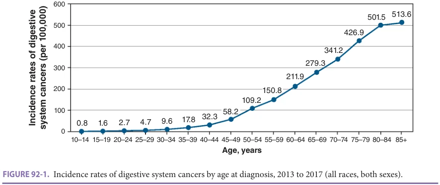
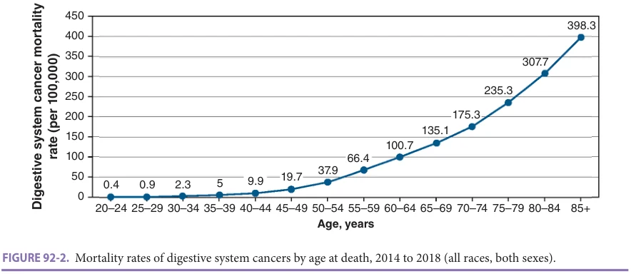
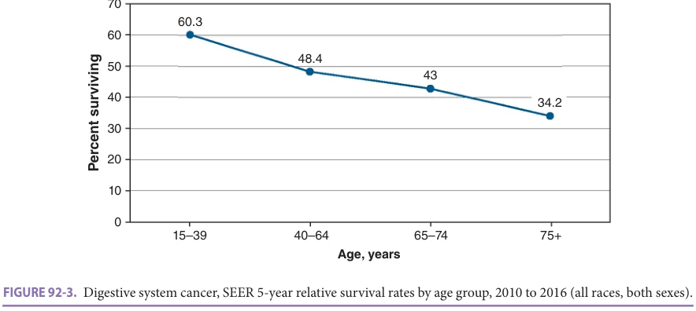
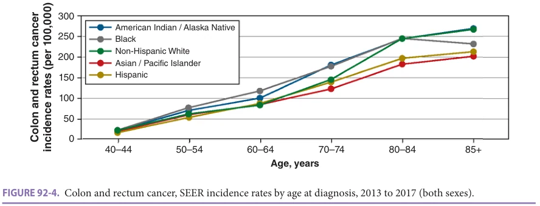
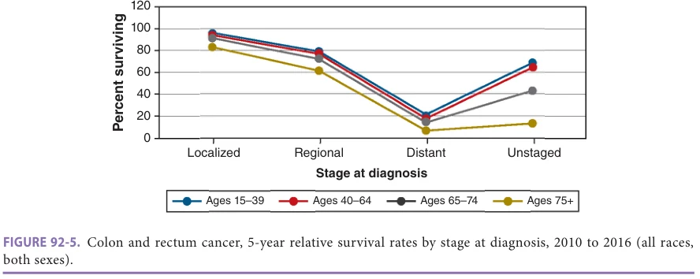

# Hazzard's Geriatric Medicine and Gerontology, 8e - Chapter 92: Gastrointestinal Malignancies

Ryan D. Nipp, Nadine J. McCleary

> **Status.** Fast build from the book; not lane-reviewed.

> **Source and method.** Printed pages 1435-1454, from the marked 8th-edition copy (PDF page = printed page + 34). Prose follows its text layer; tables and figures are source-page crops. The book is canonical.

**[p. 1435]**

## INTRODUCTION

Gastrointestinal (GI) cancers are primarily diseases of persons in their sixth, seventh, and eighth decades of life. GI cancers are expected to account for 18% of new cancer cases and 28% of cancer-related deaths in the United States in 2020. Both incidence and mortality of GI cancers increase with advancing age (Figures 92-1, 92-2, and 92-3). Despite overall decreases in incidence of some GI malignancies, older age is associated with higher prevalence of GI malignancies. Many older persons, however, have additional medical conditions, functional limitations, and social isolation that almost certainly contribute to inferior survival and morbidity outcomes. This chapter will explore the epidemiology, presentation, treatment options, and disparities in the care of older persons with GI malignancies.

#### Learning Objectives

- Identify effective methods of colorectal cancer (CRC) screening.

- Integrate appropriate CRC screening recommendations into health maintenance models of care for older adults, including potential discontinuation of screening when expected lifespan is fewer than 5 to 10 years.

- Recognize the overwhelming need to enroll older adults with gastrointestinal (GI) cancers in clinical trials.

#### Key Clinical Points

1. Older adults remain underrepresented in clinical trials from which treatment standards are defined. The Food and Drug Administration stipulates inclusion of Geriatric Use prescribing information pertinent for older adults because limited guidance can be drawn from product labeling.

2. CRC accounts for approximately 9% of all cancer-related deaths in the United States; it causes more deaths than prostate cancer in men 60 to 79 years and falls just short of breast cancer in women 80 years or older. Noncancer deaths account for a sizeable percentage of deaths in older adults with CRC; congestive heart failure, chronic obstructive pulmonary disease, and diabetes account for 9.4%, 5.3%, and 3.9% of deaths, respectively, in older adults with localized disease.

3. Medicare covers surveillance fecal occult blood testing (FOBT) plus sigmoidoscopy or barium enema or colonoscopy for all beneficiaries; it may be reasonable to discontinue screening when life expectancy is shorter than the time a polyp progresses to a cancer, that is, 5 to 10 years.

4. Early genomic testing of advanced cancers can identify opportunities for use of novel (Continued)

In general, the symptoms and presentation of GI cancers in older adults appear similar to those of younger adults. Although treatments for these cancers have been developed primarily in younger adults, greater expertise over time has permitted similarly safe and efficacious therapy to be extended to older age groups. Since the greatest percentage of GI cancers are located in the colon and rectum, most of the information regarding older persons focuses on colorectal cancer (CRC). Unfortunately, there is a paucity of information concerning the treatment of older adults with other GI malignancies. Where we lack data specific to efficacy of individual therapies for older adults, attention should be paid to the toxicities of the treatments, with consideration of adults’ concurrent medical conditions, functional status, and/or social support. Additionally, early referral to an oncologist to facilitate decision-making is advised. In this chapter, GI malignancies are ordered by incidence in the US population.

## CLINICAL TRIALS

Older adults are disproportionately underrepresented in clinical trials by which treatment standards are derived. The US Food and Drug Administration evaluated the proportion of older adults participating in registration trials for new drugs or new indications for existing drugs. Adults older than 65, 70, or 75 represent 36%, 20%, and 9% of those participating in cancer clinical trials compared to 60%, 46%, and 31% of older adults diagnosed with cancer in the

**[p. 1436]**

targeted therapies or immunotherapy and identify adults eligible for clinical trial.

5. Perioperative mortality is lower for CRC surgery in high-volume centers versus lowvolume centers. Further, less aggressive surgical intervention is more likely in low-volume centers and in older adults, and increases the risk of recurrence and cancer-related death. Finally, laparoscopic procedures have lower mortality and equivalent outcomes in older adults.

6. Morbidity and mortality for surgery to treat resectable pancreatic or gastric cancer are similar in young and older adults.

7. A large number of expanded options in chemotherapy (eg, targeted antibodies, kinase inhibitors, immunotherapy) that are generally tolerated by older adults are now available and should prompt clinicians caring for older adults to seek medical oncology consultation even in those with advanced GI cancer.

8. In those with esophageal cancer, AfricanAmerican adults 65 years and older were noted to have a lower rate of surgical consultation and half the rate of curative surgery as their older adult Caucasian counterparts— very likely contributing to worse outcomes in minorities with esophageal cancer.

9. African-American adults age 65 or older are approximately 44% more likely to die from colon cancer despite better reduction in mortality among those receiving oxaliplatinbased therapy compared to Caucasian counterparts.

United States. Whereas 70% to 75% of CRCs are diagnosed in adults older than 65 years, only 40% to 48% of adults enrolled in National Cancer Institute (NCI)-sponsored or cooperative group trials are drawn from the age group. Similar data are not available for the less common GI malignancies.

Plausible explanations for the lack of participation of older adults in clinical trials may include lack of social and home care support, physician reluctance to offer research protocols to older individuals, difficulties with access to clinics and hospitals, potential noncoverage of investigational treatments by Medicare, patient refusal, increasing concomitant medication usage and comorbidities with advancing age, and fewer trials specifically aimed at older adults. The North Central Cancer Treatment Group (NCCTG) attempted a prospective study in collaboration with Cancer and Leukemia Group B (CALGB) (now combined with other clinical trial groups as the alliance) evaluating the benefit of oxaliplatin added to 5-FU/capecitabine and bevacizumab among untreated older adults with metastatic colon cancer (N0949). This study was terminated early due to poor accrual, which may be related to the concern oncologists have about the use of oxaliplatin in older adults.

An unintended consequence of limited efficacy, tolerance, and benefit data, older adults are less likely to be referred for oncology consultation, receive standard therapy or be offered clinical trial. Barriers to clinical trial participation for older adults are multifactorial. The Cancer and Aging Research Group (CARG) issued a call to action to increase older adult participation in cancer clinical trials. Following a detailed systematic literature review of 11,094 studies discussing system, provider, patient, and caregiver level barriers to and interventions to improve clinical trial participation for older adults, the authors detailed a qualitative evaluation of 13 studies included for final analysis. Key barriers included restrictive eligibility criteria, provider bias, limitations of patient/caregiver knowledge, social determinants of health, and caregiver burden. In a separate qualitative analysis, barriers to clinical trial participation

*Figure 92-1, printed p. 1436.*

**[p. 1437]**

*Figure 92-2, printed p. 1437.*

for older adults differed by provider practice setting with academic provider citing physician bias and time limitations while community providers acknowledged patient perception and caregiver burden. The authors provide key recommendations for expanding inclusion of older adults in cancer clinical trials. Some of these recommendations are in place in cooperative clinical trial groups, pooled analyses of key studies and secondary analyses of large realworld data sets.

## COLORECTAL CANCER

CRC accounts for approximately 8% of all new cancer cases and 9% of all cancer-related deaths in the United States. In fact, CRC causes more deaths than prostate cancer in men 60 to 79 years and falls just short of breast cancer in women 80 years or older. In 2020, 104,610 new cases of colon cancer and 43,340 new cases of rectal cancer will be diagnosed, accounting for approximately 53,200 deaths. Nearly onethird of cases diagnosed occur in adults age 80 or older and 40% of deaths from colon cancer occur in octogenarians.

Incidence is decreasing by 4% annually for older adults, largely attributed to recommendations for earlier screening and detection of CRC. The probability of developing CRC increases from 0.4% in the first four decades of life to 3.0% for women and to 3.3% for men in the seventh decade of life (Figure 92-4). Median age at diagnosis of CRC is 68 years for men and 72 years for women. The overall 5-year relative survival is 64% with this cancer. It is 69% for persons younger than age 65 and declines to 61% for persons older than age 65 (Figure 92-5).

Studies suggest that older adults present at the time of diagnosis with the same probability of having localized, regionalized, or advanced colon cancer as younger adults. In randomized studies, older adults are reported to have the same performance status and incidence of tumor-related symptoms as younger adults but tend to have more disease-related weight loss. Older adults also appear to have a greater incidence of right-sided (proximal) tumors, and higher rates of obstruction and perforation. This in turn results in a greater likelihood of acute presentations, leading to a higher perioperative mortality rate in this older age group.

*Figure 92-3, printed p. 1437.*

**[p. 1438]**

*Figure 92-4, printed p. 1438.*

While some investigators have noted that overall survival (OS) is shorter in older adults, this difference is not significant if noncancer deaths are excluded. In fact, comorbid illnesses account for a substantial number of deaths among older adults with CRC. In one study of 29,733 adults 67 years and older with localized CRC in the Surveillance, Epidemiology, and End Results (SEER)/ Medicare database, congestive heart failure, chronic obstructive pulmonary disease, and diabetes accounted for 9.4%, 5.3%, and 3.9% of deaths, respectively.

Risk Factors of CRC Most older adults have no clearly defined risk factors for the development of CRC beyond the process of aging. Hereditary syndromes, such as familial adenomatosis polyposis or hereditary nonpolyposis CRC, have less impact in this older age group, since the majority of hereditary cases are diagnosed before the age of 65. There is one risk factor specific to men who were curatively treated with radiation for localized prostate cancer. These men have a 70% increased risk of developing cancer in previously irradiated portions of the bowel and could potentially benefit from more frequent CRC screening.

Chemoprevention of CRC Various dietary supplements and drugs have been proposed as chemopreventive agents for colorectal neoplasia. Of these, aspirin has been the most widely studied; the regular use of this drug appears to confer a significant risk reduction (relative risk 0.56–0.68). In a study of 536 adults age 70 or older, aspirin use began after colon cancer diagnosis in 20% and was associated with longer OS (adjusted relative risk 0.59, 95% confidence interval 0.44–0.81, p = 0.001).

In at least two prospective cohort studies, the use of postmenopausal estrogens has been shown to reduce the risk of CRC by approximately 30%. Estrogen supplementation, however, has been associated with an increased risk for coronary heart disease, breast cancer, thromboembolic events, and early mortality in at least one large randomized study of postmenopausal women, thereby limiting its use as a chemopreventive agent in older women.

Additionally, it has been reported that cholesterollowering statins can significantly reduce the risk of CRC. As compared to individuals who did not use statins, individuals who used these agents for at least 5 years were able to reduce their relative risk of CRC by one-half.

*Figure 92-5, printed p. 1438.*

**[p. 1439]**

Screening of CRC Approximately, one in two persons will have an adenomatous polyp in their colon by the age of 70. In a Veteran’s Affairs cohort of 17,732 men, prevalence of advanced neoplasia was noted in 13% of those age 70 to 75 compared to 5.7% of men age 50 to 59 undergoing colonoscopy (p < 0.001). Odds of neoplastic transformation from adenoma to invasive carcinoma increases with age by 1.78 per additional decade, with rates of advanced neoplasia and CRC (14.3% and 2.6%, respectively) for adults age 75 or older double that of adults age 50 to 75. Older adults are also more likely to have metachronous advanced neoplasia. The risk of sporadic CRC can be reduced by 50% to 90% if adenomatous polyps are implicated by direct visualization (sigmoidoscopy, colonoscopy, computed tomography [CT] colonography, or capsule endoscopy) or stool-based testing (FOBT or stool-based DNA) and are then removed before they transform into a malignancy over a 5- to 10-year period. Colonoscopy is the most invasive CRC screening option, associated with a 50% reduction in CRC incidence in older adults. The number needed to screen to prevent 1 CRC case in older adults is 126 for men and 98 for women age 75 to 79. Sigmoidoscopy is associated with a 20% reduction in CRC incidence and 35% reduction in CRC death for adults age 70 or older based on the Prostate, Lung, Colorectal, and Ovarian Cancer Screening Trial of 20,726 older adults. The number needed to screen using sigmoidoscopy to prevent one CRC case is 282. Capsule endoscopy, while less invasive, still requires bowel preparation with secondary risk of electrolyte imbalance and poor prep, and requires colonoscopy if screen is positive. CT colonography also requires bowel preparation and insufflation with risk of bowel perforation. Colonography has sensitivity of 82% to 92% to detect adenomas 1 cm or larger, but still requires colonoscopy for polyps greater than 0.6 cm.

Noninvasive screening modalities risk false positives and ultimate recommendation for colonoscopy to evaluate initial screening finding. FOBT is associated with an 11% to 16% reduction in CRC death with number needed to screen to prevent one CRC-related death of 525 in men and 408 in women age 75 to 79. However, false-positive rates are high with FOBT at 86% to 98%. Randomized trials have demonstrated that routine FOBT can diminish colon cancer mortality by 15% to 20% during an 8- to 18-year follow-up period. While there appears to be a slightly lower mortality benefit to FOBT for older adults (10%–16% compared to 19%–23% for younger adults), this was not observed for immunochemical FOBT such as stool-based DNA testing. In fact, sensitivity of fecal immunochemical testing (FIT) does not differ significantly by age. Sensitivity of FIT to detect CRC or precancerous lesions is higher for stool DNA than FIT (stool DNA: 73.8% or 23.8% vs FIT: 92.3% or 42.4%). Despite better sensitivity, stool DNA testing is not recommended for adults age 85 or older given limited data in that subgroup. Blood testing for methylated

septin 9 is not recommended given high false-positive rate with increasing age.

Case-control studies suggest that lower endoscopy and removal of polyps may decrease the incidence and mortality of CRC by 50% to 80%. However, screening extends life to a lesser degree with advancing age. Although colonoscopy appears to be particularly beneficial in older adults who have a higher incidence of proximal neoplasms, which are beyond the view of a flexible sigmoidoscopy, the risk of perforation and serious bleeding from colonoscopy is higher than from sigmoidoscopy (3–5 compared to 0.2 per 10,000 procedures and 16 compared to 0.5 per 10,000 procedures, respectively). Older adults are also more likely to have an incomplete colonoscopy, ranging from 78% to 86% for those 70 or older to 52% to 95% for those age 80 or older. While sigmoidoscopy offers lower risk of complications, it should be noted that older adults are more likely to present with proximal tumors, which will be missed on sigmoidoscopy. Prevalence of proximal neoplasia increased from 2% for men age 50 to 59 to 5.9% for those age 70 to 75 in a large Veterans Affairs cohort. This risk increases with advancing age and number of comorbidities. Therefore, screening decisions must be individualized for every older adult.

Guidelines from the American Cancer Society, US Multisociety Task Force on Colorectal Cancer, and the American Radiological Society suggest the following regarding the screening of average-risk men and women beginning at age 50: flexible sigmoidoscopy to 40 cm or splenic flexure every 5 years, colonoscopy every 10 years, double-contrast barium enema every 5 years, or CT colonography every 5 years. These guidelines also review screening and surveillance for CRC in increased-risk and high-risk persons, with accompanying recommendations. Those at increased risk include those individuals with a personal history of adenomatous polyps or CRC and adults with a family history of colon neoplasia. The US Preventive Services Task Force suggests discussing risk and benefits of CRC screening in adults age 76 to 85 and discontinuing screening for those age 86 or older. However, reduced rates of screening in older adults are likely associated with increased rates of unplanned admissions for colorectal surgery among older adults resulting in longer hospital stays, need for rehabilitation, and less opportunity for preoperative interventions to improve functional outcomes such as prehabilitation.

Since only a small percentage of persons at risk for colorectal neoplasia undergo routine screening in the United States, Medicare provides reimbursement for surveillance FOBT (including stool DNA) plus sigmoidoscopy or barium enema or colonoscopy for all beneficiaries. This has increased the prevalence of “screening within 1 year” for FOBT from 20% in persons younger than 65 years to 26% in persons 65 years and older and the prevalence of “endoscopy within 5 years” from 37% in persons younger than 65 years to 48% in persons 65 years or older.

**[p. 1440]**

Most older adults have a stated preference to continue CRC screening, feeling that their own life expectancy does not factor into this decision. Since the risk of advanced neoplasia and CRC is highest in older adults, it seems doubtful that screening should be arbitrarily discontinued after a certain age. In the United States, an individual who reaches the age of 80 has an average life expectancy of an additional 10 years for women and 8 years for men. At age 85, average survival is 7 years for women and 6 years for men. This estimate must be adjusted for the number and severity of chronic diseases affecting the individual, as well as his or her functional status. Prognostic tools, such as ePrognosis, incorporate actuarial data along with baseline health, cognition, and comorbid medical conditions. It may be reasonable to discontinue screening when life expectancy is shorter than the time a polyp progresses to a cancer, that is, 5 to 10 years.

## Localized CRC

Surgery—localized colon cancer Cancers of the colon are typically resected with a hemicolectomy. Whether older age is an adverse prognostic factor in resection of localized colon cancer is controversial. Data on 20,862 adults undergoing surgery in 1997 for colon cancer from the Nationwide Inpatient Sample, a claims-based database, suggested that perioperative mortality increases gradually with advancing age until the age of 80, after which a substantial increase in mortality is seen (6.9% for adults older than 80 years). Older adults in the Nationwide Inpatient Sample from 1997 had lower mortality rates at highvolume hospitals than at low-volume institutions: 3.1% versus 4.5% for adults older than 65 years (p = 0.03). This effect was even more pronounced for adults older than 80 years, where 4.6% of adults died at high-volume centers compared to 7.3% at smaller institutions (p = 0.04). Therefore, it may be preferable to send the very oldest adults with colon cancer to high-volume hospitals for their resections. Yet a recent study of 24,426 adults (44% age ≥ 75) from the New York State Cancer Registry and the Statewide Planning and Research Cooperative System showed that older adults tended to have surgery in community hospitals rather than academic medical centers. Older age was associated with higher rate of death at 1-year (2.8% for those < 65, 13.9% for those age ≥ 75, p < 0.0001) and postoperative complication (22.6% vs 35.5%, p < 0.0001). Mortality rates in the older age group in this US cohort were like the 11.9% to 14% rates noted in European studies. Following death from CRC (45.6%), most frequent cause of death among the 2171 who died was cardiovascular disease (24.5%) and another primary cancer (7.4%).

A tendency to perform less aggressive surgery in older adults may be evident from an analysis of 116,995 adults with localized CRC in the SEER database (1988–2001). This retrospective study revealed that adults 71 years or older were half as likely to receive adequate lymph node evaluation (examination of at least 12 lymph nodes) as younger adults. Multiple studies have now demonstrated that inadequate

lymph node evaluation correlates with inferior survival. These data would suggest that less aggressive surgical intervention predisposes older adults to a higher risk of recurrence and cancer-related death.

Increasingly, laparoscopic-assisted colectomies are being performed in the United States and elsewhere. Randomized studies indicate that adults undergoing this procedure have a similar outcome to adults undergoing an “open” colectomy, with slightly less postoperative pain and a 1-day shorter hospital stay. Persons 75 years or older tolerate laparoscopic-assisted colectomy equally as well as younger individuals. One study compared 51 adults ages 70 years or older who underwent laparoscopic colectomy to 102 age-matched adults who underwent open colectomy. Older adults had less overall morbidity with laparoscopic colectomy (17.6%) than with open surgery (37.3%), suggesting that laparoscopic surgery may lessen surgical morbidity for frail, older individuals (p = 0.013).

Surgery—localized rectal cancer A radical resection with anastomosis or ostomy is the standard surgical procedure for cancers of the rectum. A Veteran’s Administration study of 7243 adults who underwent surgery for their rectal cancer during the period of 1990 to 2000 revealed that 30-day mortality following resection for rectal cancer was 2.1% for adults younger than 65 years compared with 4.9% for adults 65 years or older (p < 0.0001). Five-year survival was 60% versus 48%, respectively (p < 0.0001). French investigators reviewed the records of 92 surgical adults who were 80 years or older and matched these to records of 276 younger adults who underwent resection during the same time interval. Although not statistically significant, older adults had a higher operative mortality than younger adults (8% vs 4%, respectively). Among elective surgeries, the operative mortality was nearly identical (3%–4%). Although 5-year OS was greater for younger adults, 5-year cancer-specific survival was comparable for the two groups.

Adjuvant therapy—localized colon cancer Since the publication of a National Institutes of Health (NIH) consensus statement in 1990, 5-fluorouracil (5-FU)-based adjuvant therapy has represented the standard of care for adults in the United States following the complete resection of colon cancer that has spread to regional lymph nodes (stage III disease). A benefit for postoperative chemotherapy has not been prospectively demonstrated in adults with fully resected, muscle-invasive, lymph node–negative (stage II) colon cancer. However, stage II cancers with high-risk features for recurrence (eg, presentation with obstruction, perforation, or invasion into adjacent organs—stage IIB) are often treated by medical oncologists and are included in many randomized adjuvant trials.

For stage III colon cancer, single-agent 5-FU (with leucovorin [LV]) adjuvant chemotherapy became the standard of care after the publication of multiple studies in the 1990s highlighting its superior survival benefits compared

**[p. 1441]**

to observation alone. The benefit of adding oxaliplatin to 5-FU/LV was first suggested in the Multicenter International Study of Oxaliplatin/5-Fluorouracil/Leucovorin in the Adjuvant Treatment of Colon Cancer (MOSAIC) trial, which randomly assigned 2246 adults with resected stage II (40%) or III colon cancer to a 6-month course of 5-FU/LV plus oxaliplatin compared to 5-FU/LV. Adults receiving FOLFOX (5-fluorouracil and oxaliplatin) experienced improved survival. The data are less clear concerning the optimal adjuvant treatment of stage II disease. For adults with stage II tumors with mismatch repair enzyme deficiency (dMMR) or microsatellite instability (MSI-H), an oxaliplatin-based regimen should be considered superior to a fluoropyrimidine-alone regimen.

In 2013, an updated analysis of the Adjuvant CC End Points (ACCENT) database (including seven randomized trials of newer adjuvant chemotherapy, such as MOSAIC, National Surgical Adjuvant Breast and Bowel Project [NSABP] C-07, and NO16968) showed no disease-free survival (DFS) or OS benefit among older adults receiving oxaliplatin-based adjuvant chemotherapy. In 2012, Sanoff et al. published an updated SEER-Medicare analysis of receipt and effectiveness of adjuvant chemotherapy which looked at the differences based on age for colon cancer adults. The data showed trend toward a marginal survival benefit with oxaliplatin use in adults age 75 or older. Another study performed a subpopulation analysis of 315 adults age 70 to 75 enrolled onto the MOSAIC trial. This study demonstrated that age did not alter the impact of treatment on survival outcome. Although the previously observed survival benefit of fluoropyrimidine persisted in the older subgroup, there was no survival advantage with the addition of oxaliplatin to fluoropyrimidine chemotherapy. Additionally, a subgroup analysis of adults 70 years or older from the phase III RCT NSABP C-07 trial showed no benefit to the addition of oxaliplatin to fluoropyrimidine chemotherapy, despite the risk of added toxicity. There are other studies that also question the use of oxaliplatin in the postoperative setting for older adults, but prospective studies are needed. Until then, the current data need to be considered when planning treatment, and caution taken when considering the addition of oxaliplatin for older adults. Currently, oxaliplatin can be considered for fit adults with minimal comorbidities.

The International Duration Evaluation of Adjuvant therapy (IDEA) collaboration evaluated DFS and overall survival of noninferiority of 3 versus 6 months adjuvant chemotherapy following resection of colon cancer. This prospective pooled analysis of six randomized clinical trials (CALGB/ SWOG 80702, IDEA France, SCOT, ACHIEVE, TOSCA, and HORG) included 12,835 adults from 12 countries diagnosed with stage III colon cancer enrolled from June 2007 through December 2015. Age-specific data have not yet been published. The analysis established similar 5-year overall survival for 3 versus 6 months oxaliplatin-based chemotherapy (82.4% vs 82.8%, respectively), establishing noninferiority of short duration therapy. Many oncologists recommend

continuing 6-month IV-based FU combined with oxaliplatin for those with T4 or N2 disease. Shorter duration adjuvant therapy is particularly appealing for older adults with potential to reduce toxicity and confirm completion of planned therapy, often curtailed in this subgroup.

Data have shown that the receipt of oxaliplatin is inversely related to advancing age, and older adults are more likely to prematurely discontinue this therapy. The addition of oxaliplatin to fluoropyrimidine adjuvant therapy in some older adults may also exacerbate underlying comorbidities and unmask frailty. For example, oxaliplatininduced peripheral neuropathy may increase the risk of falls and limit functional status in some older adults with colon cancer. Falls and impaired functional status are both associated with a poorer prognosis in this population.

Older adults receive adjuvant chemotherapy less often than their younger counterparts. A retrospective cohort study from 2012 utilized multiple data sets, including the SEER database, to identify 5489 adults 75 years or older with resected stage III colon cancer from 2004 to 2007. Overall, over 40% of adults received adjuvant chemotherapy. The likelihood of receiving treatment declined steeply with increasing age. Similar results were noted in an Italian study of 1014 adults with resected stage II/III colon cancer.

The reason for this age-related disparity in management is not entirely clear. In one study utilizing the California Cancer Registry, oncologists cited patient refusal, comorbid illness, or advanced age as the most common reasons for not providing chemotherapy to older adults with resected colon cancer. Financial considerations and logistical problems may also prevent some older adults from seeking care. Additionally, treatment for older adults is more frequently discontinued, suggesting reluctance by physicians to treat older adults who have experienced some degree of side effects to chemotherapy.

A pooled analysis of 3351 adults in the United States, stratified by decade of life, from seven randomized trials evaluated the benefit of adjuvant chemotherapy in older persons with stage II or III colon cancer. The primary conclusion of this pooled analysis was that older adults derive the same clinical benefit from postoperative chemotherapy as younger adults. Treatment-related toxicity was somewhat higher for older adults, yet not statistically significant. Another US study, however, could not extend this observation to adults 75 years and older, given limitations in the data. African-American adults age 65 or older are approximately 44% more likely to die from colon cancer. However, a large cohort study of 1162 adults diagnosed with stage III colon cancer between January 2004 and December 2006 in the SEER-Medicare database (477 receiving oxaliplatin) demonstrated that African-Americans receiving oxaliplatin experienced a greater reduction in CRC mortality compared to Caucasians (adjusted HR 0.31, 95% CI 0.12–0.82 vs adjusted HR 0.83, 95% CI 0.62–1.09). Reasons for

**[p. 1442]**

improved effectiveness of oxaliplatin in African-Americans is unknown but supports the notion that removal of insurance barriers to access in this Medicare population can lead to improved outcomes for historically undertreated populations.

In conclusion, it appears that postoperative chemotherapy in stage III colon cancer is as beneficial in older adults as it is in younger individuals. A slight increase in toxicity should not prevent the clinician from treating these older adults, although increased vigilance during chemotherapy is warranted. Shorter duration of adjuvant therapy is feasible for patients diagnosed with stage III cancer; age-related data for those with T4 or N2 disease are pending.

Neoadjuvant/adjuvant therapy—localized rectal cancer Chemoradiation before or after surgery reduces the local recurrence rate and increases DFS in adults with deeply invasive (T3–T4) or lymph node–positive rectal cancer. Although there are few data to suggest that older adults respond any differently to chemoradiotherapy than younger adults, they are less frequently referred to oncologists for this treatment. Analysis of the SEER database identified adults 65 years or older with stage II or III rectal cancer who underwent surgical resection between 1992 and 1996. Increasing age corresponded inversely with the percentage of adults who received adjuvant therapy. Overall, chemoradiation therapy was associated with a 17% reduced risk of death among all cases, with a 29% reduced risk of death in stage III adults, but no statistically significant improvement in stage II cases, similar to the results reported in younger adults. More recently, three studies (PROSPECT, PRODIGE23, RAPIDO) examined the role of radiation therapy in perioperative management of localized rectal cancer, age-specific data pending. PROSPECT examined replacement of preoperative chemoradiation therapy with oxaliplatin-based chemotherapy for those diagnosed with stage II or III rectal cancer; analyses are pending at this time. PRODIGE23 evaluated total neoadjuvant therapy with FOLFIRINOX versus chemoradiation therapy for those diagnosed with T3 or T4 rectal cancer. Disease-free and metastasis-free survival at 3 years was improved in those receiving total neoadjuvant therapy (HR 0.69 [95% CI 0.49, 0.97]; HR 0.64 [95% CI 0.44, 0.93], respectively) with improved pathologic complete response (27.5% vs 11.7%, p < 0.001). RAPIDO also evaluated total neoadjuvant therapy, comparing short-course radiation therapy (5 × 5 Gy) compared to chemoradiation therapy (25–28 × 2.0–1.8 Gy), followed by oxaliplatin-based chemotherapy then surgical resection. Disease-related treatment failure a composite endpoint of locoregional failure, disease recurrence, metastasis or death, was the primary outcome. Disease-related treatment failure was improved among the short-course group with reduction in distant metastasis but not locoregional failure. All three studies have potential to reduce toxicity and DFS for subsets of older adults, particularly where overall survival benefit may be limited due to competing risk of death from comorbidities.

Postoperative surveillance—localized CRC There is general agreement that all adults with resected CRC should undergo regular surveillance screening with colonoscopy, carcinoembryonic antigen (CEA) testing, and possibly an annual CT scan. Analysis of 52,283 Medicare beneficiaries treated for locoregional CRC between 1986 and 1996 suggested that younger adults are more likely to undergo periodic surveillance endoscopies and that the median time to first follow-up endoscopy is significantly shorter (p < 0.0001) for adults at younger ages.

## Advanced CRC

Surgery—advanced CRC Removal of the primary cancer is indicated in adults who have an (impending) obstruction, uncontrollable bleeding, or oligometastatic disease that may potentially be cured with aggressive therapy. In spite of these restrictive criteria, a recent pattern of care study, utilizing the SEER database revealed that the majority of adults 65 years or older with stage IV CRC undergo resection of their primary tumor. Overall, 72% of adults underwent this primary cancer–directed surgery. The percentage of adults undergoing surgery declined gradually from 76% in adults 65 to 69 years old to 70% in adults 80 to 84 years old, and then dropped to 62% in adults 85 years or older.

In this pattern of care study, the 30-day mortality was 10% for all adults. However, higher perioperative mortality rates for older adults with advanced CRC have been reported elsewhere. In adults 70 to 79 years, the mortality may be as high as 21% and in octogenarians it may reach 38%. Overall, improvements in surgical technique and postoperative care have led to a decrease in operative mortality particularly in older adults, so that current operative survival figures for older adults now approach those reported for younger adults a decade ago.

Older adults with oligometastatic disease or isolated recurrences of their CRC may be candidates for a “curative-intent” resection. In a series from the Memorial Sloan Kettering Cancer Center, 128 adults 70 years or older underwent liver resection for metastatic CRC between 1985 and 1994. While these adults experienced a 4% perioperative mortality rate and a 42% complication rate, their median survival was 40 months and 5-year survival rate was 35%. These older adults had a similar outcome to 449 adults less than 70 years old who underwent comparable liver resections during the same time period. In a retrospective analysis of adults age 65 and older in the SEER database, only 6.1% of the 13,599 adults identified with colorectal metastases limited to the liver underwent hepatic resection. The 30-day mortality rate was 4.3%. Five-year survival for resected adults was superior to those who did not undergo resection (32.8% vs 10.5%; p < 0.0001). Additionally, investigators have reported that appropriately selected older adults can tolerate resection of colorectal lung metastases with similar outcome as younger adults, with acceptable morbidity and mortality.

**[p. 1443]**

Chemotherapy—advanced CRC

5-Fluorouracil Until the early 1990s, the only active treatment for advanced CRC was 5-FU, a thymidylate synthase inhibitor. Multiple studies have now demonstrated that this agent, given as a bolus with LV or as an infusion with or without LV, is effective and well tolerated in the older adult population, with similar response rates and overall survival compared to younger cohorts.

Folprecht and colleagues carried out a pooled analysis of 22 randomized European trials in which adults received palliative 5-FU-based therapy. In this retrospective analysis, OS (10.8 months for younger adults vs 11.3 months for older adults; p = 0.31) and response rate (20.8% for younger adults vs 17.6% for older adults; p = 0.14) were nearly identical in younger and older adults. Infusional 5-FU proved to be superior to bolus 5-FU in all age groups. Similar results were obtained in a meta-analysis of four large trials of 5-FU-based therapy to examine the efficacy and toxicity of 5-FU in adults 70 years and older (n = 303) compared to younger individuals (n = 1181). While severe neutropenia (40.4% vs 33.6%) and stomatitis (10% vs 4.6%) were significantly increased in older adults, overall response rate (39.5% vs 33.1%) and OS (15.9 vs 15.4 months) were similar to that of younger adults.

The NCCTG conducted another pooled analysis of 1748 adults with advanced CRC treated with 5-FU-based therapy. No significant differences in response rate (p = 0.90) or OS (p = 0.42) were observed between adults younger than 56 years and older than 70 years. Adults 65 years or older had more overall severe toxicity than their younger counterparts (53% vs 46%; p = 0.01). Statistically significant differences in severe diarrhea and stomatitis were reported. Other studies have also noted higher rates of 5-FU-related palmar-plantar erythrodysesthesia in older adults.

Capecitabine The oral 5-FU prodrug, capecitabine, has similar efficacy to monthly intravenous 5-FU and LV (Mayo Clinic Regimen) in the metastatic and adjuvant setting. In adults 70 years or older with metastatic CRC, the overall response rate with capecitabine was 24% and the OS time was 11 months. In adults 70 years and older with resected colon cancer, capecitabine offered the same DFS advantage as standard 5-FU and LV. In this adjuvant trial, severe capecitabine-related toxicity was noted in only 12% of adults. Overall, the results with capecitabine in older adults appear similar to those seen in younger individuals.

Irinotecan Irinotecan, a topoisomerase I inhibitor, is another active drug in metastatic CRC. A multi-institutional phase II study found similar rates of severe toxicity in adults 65 years or older and those younger than 65 years receiving a weekly schedule of this agent. In a trial comparing the weekly and the triweekly dosing regimens of this drug as second-line therapy for metastatic disease, more than one-third of 291 adults were at least of 70 years. Age greater than 70 did not affect survival or time to progression but was associated

with an increased risk of severe neutropenia and diarrhea compared to adults younger than 70 years.

Various trials have evaluated irinotecan-based chemotherapies in older adults with metastatic CRC. These have included combinations of irinotecan, bolus 5-FU and leucovorin (IFL), irinotecan, infusional 5-FU and leucovorin (FOLFIRI), irinotecan and capecitabine (CAPIRI), and irinotecan and oxaliplatin (IROX). These trials uniformly revealed that response to chemotherapy, median survival times, and degree of toxicity in these older adults appear to be similar to those observed in younger adults.

Oxaliplatin Oxaliplatin is a third-generation platinum analogue, which induces platinum-DNA adducts, inhibiting the replication of DNA. Although it has limited activity as a single agent in CRC, oxaliplatin has notable synergy with 5-FU and LV (FOLFOX). In metastatic CRC, the toxicity following treatment with FOLFOX was evaluated for adults 70 years and older in a pooled analysis of four randomized clinical trials. Although severe hematologic toxicity was increased in older adults, there was no difference in other severe toxicities or 60-day mortality.

For adults with resected colon cancer, a randomized adjuvant trial, in which 35% of adults were 65 years or older, has suggested that DFS can be enhanced if oxaliplatin is added to 5-FU and LV. Subgroup analysis suggested a similar benefit for older adults as for the group as a whole. For those older adults with resectable liver metastases, preoperative FOLFOX therapy may be superior to 5-FU therapy. In this study, 2-year OS was prolonged in the FOLFOX group compared to the 5-FU group or to the no chemotherapy group (84% vs 60% vs 23%).

The combination of capecitabine and oxaliplatin (CAPOX) has been evaluated in 76 adults 70 years and older with metastatic CRC. Overall response was 41%, median progression-free survival (PFS) was 8.5 months, and median OS was 14.4 months with little severe toxicity (3% peripheral neuropathy and 13% palmar-plantar erythrodysesthesia). A recent randomized study has suggested that the FOLFOX and CAPOX regimens have similar efficacy and rates of toxicity.

The FOCUS2 trial investigated reduced-dose chemotherapy for frail and older adults. A total of 459 adults were randomized to treatment with 5-FU, FOLFOX, capecitabine, or CAPOX all starting at 80% of standard doses with discretionary adjustment as appropriate. Median survival for the groups ranged from 10 to 12 months. The addition of oxaliplatin showed nonsignificant improvement in PFS (5.8 vs 4.5 months). Capecitabine did not improve quality of life compared with 5-FU.

Bevacizumab The humanized monoclonal antibody, bevacizumab, binds to the vascular epidermal growth factor (VEGF), reducing the vascularity of tumors, leading to hypoxia and necrosis. It also appears to lower interstitial fluid pressure in cancer nodules, promoting diffusion of other chemotherapeutic agents into these tumors. Three

**[p. 1444]**

pivotal studies in adults with advanced CRC have established that this agent consistently enhances the efficacy of 5-FU-based therapy with either irinotecan or oxaliplatin for adults of all age groups. A fourth study compared bolus 5-FU and LV alone or in combination with bevacizumab in adults 65 years and older or in adults of poor performance status. This study demonstrated that bevacizumab could significantly improve survival by 4 months in “suboptimal” adults without significantly increasing toxicity.

Bevacizumab may increase the risk of arterial thrombosis, that is, myocardial infarction, stroke, or peripheral arterial thrombotic event. In multivariate analysis, persons 65 years or older increased their risk of arterial thrombosis from 2.3% with chemotherapy alone to 7.1% with chemotherapy plus bevacizumab. This risk increased further to 17.9% if the patient had a history of prior arterial thrombosis. However, progression-free and OS was better for those receiving the bevacizumab combination than for those receiving chemotherapy alone. Therefore, bevacizumab was felt to potentially provide a benefit in carefully selected older adults with a history of atherosclerosisrelated disease.

Prospective studies evaluating the clinical benefit of combining bevacizumab with 5-FU or capecitabine as first-line therapy for older adults with metastatic colon cancer have been promising. A phase II study evaluating treatment with 5-FU with or without bevacizumab among adults age older than 65 demonstrated a statistically significant increase in PFS and a nonsignificant improvement in OS. The prospective, randomized phase III Avastin in Elderly With Xeloda (AVEX) study was recently published, comparing capecitabine alone or in combination with bevacizumab. PFS was longer in the combination arm, and a trend was seen toward improved OS. The NCCTG attempted a prospective study evaluating the benefit of oxaliplatin added to 5-FU/capecitabine and bevacizumab among untreated older adults with metastatic colon cancer (N0949). This study was terminated early due to poor accrual, which may be related to the concern oncologists have about the use of oxaliplatin in older adults.

Cetuximab/Panitumumab Cetuximab and panitumumab are monoclonal antibodies to the epidermal growth factor receptor (EGFR). Blockade of this receptor in CRC cells induces apoptosis and cell death. In individuals with extensively treated metastatic CRC, these agents can induce significant tumor regressions in 8% to 11% of adults; cetuximab in combination with irinotecan has a response rate of 23%. The most common severe toxicities of these agents include dyspnea, asthenia, and an acneiform rash. Cetuximab may also cause a hypersensitivity reaction. In one phase II study of 114 adults 65 years and older with metastatic CRC refractory to irinotecan, oxaliplatin, and 5-FU, cetuximab achieved a response rate of 9.6% compared to a 12.5% response rate in 232 adults younger than 65 years (p > 0.05).

In a randomized trial for adults with chemotherapyrefractory metastatic CRC, panitumumab resulted in partial response rate of 8% and a 46% reduction in risk of tumor progression compared to best supportive care (BSC). Similar to cetuximab, rash is the predominant adverse effect of panitumumab therapy. A severe rash early in the treatment course is predictive of enhanced response and survival with either agent. Based on systematic reviews of the relevant literature, the American Society of Clinical Oncology (ASCO) released a provisional clinical opinion in 2009 stating that all adults with metastatic CRC who are candidates for anti-EGFR antibody therapy should have their tumor tested for KRAS mutations. For adults with metastatic CRC, if KRAS mutation in codon 12 or 13 is found, they should not receive anti-EGFR antibody therapy as part of their treatment.

Cetuximab and bevacizumab along with FOLFOX or FOLFIRI were compared in a phase III Cancer and Leukemia Group B (CALGB)/Southwest Oncology Group (SWOG) 80405 trial presented at the 2014 ASCO Annual Meeting. The targeted agents had comparable benefits as first-line treatment with chemotherapy for metastatic CRC, suggesting that the selection of the targeted agent does not impact the outcomes, as long as 5-FU is used, and the biomarkers are appropriately considered. Biomarker data are likely to be increasingly used to help guide treatment decisions for CRC adults. Recent papers, including an analysis of ARCAD data, showed that the distribution of age and the prognostic effect of age did not differ according to KRAS or BRAF mutational status. The data regarding use of biomarkers in routine clinical practice are likely to evolve and further relationships between age and these biomarkers will be explored.

Regorafenib Regorafenib is an oral multikinase inhibitor that blocks the activity of several protein kinases, including kinases involved in the regulation of tumor angiogenesis, oncogenesis, and the tumor microenvironment. In the phase III international CORRECT trial, adults with metastatic CRC who had progressed on previous therapies were randomized to regorafenib or BSC. The adults receiving regorafenib had a median survival of 6.4 months, compared to a 5-month median survival for those who received BSC.

Aflibercept Aflibercept is a recombinant fusion protein containing VEGF-binding portions from the extracellular domains of human VEGF receptors that blocks the activity of VEGF. A phase III trial published in 2012 demonstrated that aflibercept in combination with FOLFIRI showed a survival benefit over FOLFIRI combined with placebo in adults with metastatic CRC previously treated with oxaliplatin.

Pembrolizumab Checkpoint inhibitor therapy has been app roved as first-line treatment for MSI-H or dMMR advanced CRC based on findings from KEYNOTE 177. Pembrolizumab was associated with a doubling in median time to progression (16 months vs 8 months) and 2-year PFS (48% vs 19%)

**[p. 1445]**

while reducing incidence of moderate-severe toxicity (grade ≥ 3 adverse event 66% vs 22%) compared to provider’s choice of palliative systemic chemotherapy. A minority of older adults present with MSI-H/dMMR disease; however, first-line immunotherapy provides added advantage of reducing toxicity and assessing potential to tolerate more aggressive cytotoxic therapy in the future.

HER2/neu Targeted Therapy Trastuzumab deruxtecan is an antibody-drug conjugate composed of an anti-HER2 antibody (trastuzumab), a cleavable tetrapeptide-based linker, and a cytotoxic topoisomerase I inhibitor. The DESTINY CRC01 study noted remarkable rates of overall response (45.3%) and disease control (83%) for this combination in third-line for HER2/neu 3+ patients, one-third of whom received anti-HER2 therapy previously. Patients with known interstitial lung disease were excluded given the known toxicity of this regimen.

## PANCREATIC CANCER

In the United States, the number of expected new cases and the number of anticipated deaths for pancreas cancer in 2020 are 57,600 and 47,050, respectively. Overall, the probability of 5-year survival for this cancer has historically been under 10%. The median age at presentation is 70 years and thus a significant proportion of patients are older adults. A tissue confirmation of pancreas cancer is established less frequently in older individuals. Thus, a disproportionate number of older patients may be misdiagnosed with this malignancy and may be incorrectly given a poor prognosis to spare them the discomfort of an accurate pathologic diagnosis.

A study published in 2018 demonstrated that almost 10% of adults harbored inherited genetic variations or mutations that may have increased their susceptibility to the disease. Based on data from this and other studies, many oncologists now offer genetic testing to all adults with pancreatic cancer regardless of age and family history.

Treatment—Localized Pancreas Cancer Older patients are more likely than younger patients to present with early-stage pancreas cancer. Surgical resection represents the only potentially curative therapy for this malignancy. Ample evidence suggests that surgical resection can be performed safely in carefully selected older adults. For example, in 206 adults older than 70 years who underwent surgery at the Mayo Clinic between 1982 and 1987, operative morbidity and mortality rates were 28% and 9%, respectively. Overall median survival was 19 months and 5-year survival were 4%. Similarly, the operative mortality in 138 adults older than 70 years who underwent pancreatic resection at Memorial Sloan-Kettering Cancer Center was 6% and the major complication rate was 45%. These results are virtually identical to those of younger patients. However, the probability of 5-year survival was slightly lower in this

group of older adults (21% vs 29%; p = 0.03), possibly because of an enhanced risk from comorbid diseases.

Adults with resected pancreas cancer or locally unresectable pancreas cancer may benefit from chemotherapy and/or chemoradiation therapy. In 2017, the ESPAC-4 trial was published, which compared adjuvant gemcitabine plus capecitabine to gemcitabine alone. With over 700 adults enrolled, the median OS for adults in the gemcitabine plus capecitabine group was 28.0 months compared with 25.5 months in the gemcitabine group (hazard ratio 0.82, p = 0.032). The average patient age in this study was 65 years, with a range of 37 to 80. In 2018, a study published in the New England Journal of Medicine randomly assigned 493 adults with resected pancreatic ductal adenocarcinoma to receive a modified FOLFIRINOX regimen or gemcitabine for 24 weeks, and demonstrated a median OS was 54.4 months in the modified-FOLFIRINOX group and 35.0 months in the gemcitabine group. The age range for adults in this study was 30 to 81 years, with about one-fifth of adults age 70 and older.

Neoadjuvant chemotherapy has emerged as a potential option for adults with locally advanced or borderline resectable pancreas cancer to help enhance long-term outcomes. Studies are underway to investigate the role and efficacy of neoadjuvant FOLFIRINOX or gemcitabine/ abraxane to try to improve the R0 resection rates and thereby help more patients achieve cure.

Treatment—Advanced Pancreas Cancer Gemcitabine has typically been considered the standard initial therapy for adults with metastatic pancreas cancer who are not candidates for a more intensive first-line chemotherapy regimen. Adults treated with gemcitabine have a median survival time of 5 to 7 months and a 1-year survival rate of 20%. In the pivotal trial of this agent, median age was 62 years and individuals as old as 79 years of age were enrolled, indicating tolerance of such treatment in older adults. Although the addition of erlotinib, an EGFR inhibitor, to gemcitabine demonstrated a small survival benefit in younger patients, no such advantage was demonstrated in the 268 adults 65 years or older.

In 2013, a phase III trial (the ACCORD 11 trial) enrolled 342 adults who were chemotherapy-naïve with metastatic pancreatic cancer (10% of adults were age ≥ 75 years). Patients were randomly assigned to gemcitabine alone versus FOLFIRINOX. The response rate was significantly higher with FOLFIRINOX (32% vs 9%). Median PFS (6.4 vs 3.3 months) and OS (11.1 vs 6.8 months) were both better in the FOLFIRINOX arm. A multivariate analysis of this data revealed that age greater than 65 years correlated with worse OS. The side effects of FOLFIRINOX include febrile neutropenia, thrombocytopenia, diarrhea, and sensory neuropathy, whereas gemcitabine can cause liver enzyme elevations and rarely hemolytic uremic syndrome (HUS).

**[p. 1446]**

An alternative to FOLFIRINOX for metastatic pancreatic cancer would be gemcitabine plus nanoparticle albumin bound (nab)-paclitaxel. Phase III trial data from 2013 showed significant improvements in nab-paclitaxel-gemcitabine as compared with gemcitabine alone. Median OS was 8.5 months in the nabpaclitaxel-gemcitabine group as compared with 6.7 months in the gemcitabine. Median PFS was 5.5 months in the nab-paclitaxel-gemcitabine group, as compared with 3.7 months in the gemcitabine group; the response rate was 23% versus 7% in the two groups. Over 40% of the adults in this trial were older than 65 years. The added toxicity of nab-paclitaxel includes peripheral neuropathy, nausea, and cytopenias.

In 2019, the New England Journal of Medicine published the Pancreas Cancer Olaparib Ongoing (POLO) trial, which sought to evaluate the efficacy of maintenance therapy with olaparib in adults with a germline BRCA mutation and metastatic pancreatic adenocarcinoma that had not progressed during first-line platinum-based chemotherapy. Following at least 16 weeks of continuous first-line platinum-based chemotherapy for metastatic pancreatic cancer, adults were randomly assigned, in a 3:2 ratio, to receive maintenance olaparib tablets (300 mg twice daily) or placebo. The median PFS was significantly longer in the olaparib group than in the placebo group (7.4 months vs 3.8 months; hazard ratio for disease progression or death, 0.53; 95% CI, 0.35 to 0.82; p = 0.004). However, an interim analysis of OS, at a data maturity of 46%, showed no difference between the olaparib and placebo groups (median, 18.9 months vs 18.1 months; hazard ratio for death, 0.91; 95% CI, 0.56 to 1.46; p = 0.68).

Palliative Care Pancreatic cancer patients may require treatment of biliary and gastric outlet obstruction, pain, depression, cachexia, and malnutrition. Stents or percutaneous biliary drainage may be necessary to alleviate patients’ symptoms from biliary obstruction. Cachexia, anorexia, and weight loss occur in up to 80% of pancreatic cancer patients and pancreatic insufficiency can contribute to this problem. Microencapsulated lipase supplements can alleviate these symptoms. For pain management, celiac plexus neurolysis may help.

A study published in 2017 evaluated the impact of early integrated palliative care in adults with newly diagnosed lung and GI cancer (mean age of 64.8). The study enrolled 87 adults with pancreatic cancer. In this study, patients who received early palliative care experienced improved quality of life and lower depression at week 24 compared with patients who received usual care alone.

## GASTRIC CANCER

Gastric cancer is the fifth most common cancer in the world with nearly 1 million new cases per year accounting for 8% of all cancer cases. The median age at diagnosis is 68. Over

60% of new cases are diagnosed in adults older than age 65 and nearly one-third of gastric cancer patients are age 75 or older. In the United States, the predicted number of new cases for 2020 was 27,600, with 11,010 deaths expected. The results of a German study have suggested that cancers with diffuse histology are more common in younger adults than in adults 70 years or older. In Japan, adults 80 years or older are found to have more advanced disease than younger adults, perhaps because of a later time to diagnosis.

Treatment—Localized Gastric Cancer Gastrectomy is the only curative treatment for gastric cancer. In adults who undergo the resection of all macroscopic and microscopic disease, the long-term survival is approximately 20% to 35% with surgery alone. Addition of perioperative chemotherapy, postoperative chemotherapy, or chemoradiation can further improve survival outcomes. A prospective review of 310 older adults with gastric cancer found that surgery in this group was reasonably well tolerated and led to a survival duration comparable to the results obtained in younger adults. In contrast, a multicenter retrospective study of 1465 adults following surgery for gastric cancer found a statistically significant lower 5-year OS for adults age 70 or older vs adults younger than age 70 (38.9% vs 58.9%, p < 0.001) while 5-year cancer-specific survival was comparable. Most, but not all, studies suggest a similar perioperative morbidity and mortality risk for gastrectomy in older and younger adults. Japan has the highest proportion of older adults worldwide and a significant number of gastric cancer cases. In a retrospective case control study of 95 adults age 80 or older compared to 366 adults age 60 to 69, there was no statistically significant difference in postoperative complication by age (both groups 23.2%). Type and extent of surgical resection also did not differ by age group with 82.1% of older adults receiving an R0 resection, 69.5% receiving a distal gastrectomy, and 29.5% receiving total gastrectomy. However, a lower proportion of older adults received D2 dissection (37.9% vs 50.3%, p = 0.03). While length of hospital stay did not differ, older adults were twice as likely to require rehabilitation stay following hospital discharge despite no statistical difference in postoperative complications. Still, older adults were less likely to receive adjuvant chemotherapy (9.5% vs 29%, p = 0.05), in part due to increased number of comorbid medical conditions in the older age group (proportion with at least one comorbid medical condition 74.7% vs 49.5%, p < 0.05). Older adults with stage II or III disease experience lower 5-year OS compared to younger adults (II: 17% vs 83%; III: 28% vs 54%), although survival was similar among older adults regardless of receipt of adjuvant chemotherapy.

A British multicenter prospective cohort study showed that surgical morbidity and mortality did not differ significantly by age. Of the 955 adults who underwent esophagectomy or gastrectomy, morbidity for adults younger than 70 years and older than 70 years was 50% and 48%, respectively. Mortality was also similar at 10% and

**[p. 1447]**

14%, respectively, for those two age groups. In Italy, age was found to be an independent predictor of recurrence in 536 adults following gastric cancer resection. It appears that short-term benefit from surgical resection is feasible for older adults; however, options for postoperative therapy are key to sustained benefit.

The CRITICS trial evaluated 788 adults (172 [22%] age 70 or older) randomized to perioperative chemotherapy or preoperative chemotherapy with postoperative chemoradiation therapy. In an unplanned posthoc analysis by age, chemotherapy grade 3 to 5 toxicity was greater in older adults (77% vs 62%, p < 0.001) and older adults were less likely to complete planned preoperative therapy despite 10% lower dose intensity for epirubicin, cisplatin, oxaliplatin, and capecitabine compared to younger adults. While most adults proceeded to curative surgery regardless of age (80% older adults vs 81% younger adults, p = 0.74), fewer older adults went on to receive planned postoperative therapy (64% vs 78%, p < 0.001). Again, older adults receiving postoperative chemotherapy did so at a significantly lower dose intensity than younger adults, in some cases 20% lower dosing and fewer older adults completed planned postoperative therapy (68% vs 79%) despite similar grade 3 to 5 toxicities. For the subset randomized to postoperative chemoradiotherapy, radiotherapy dosing, toxicity, and completion rates were similar. Despite differences in treatment receipt and dose intensity, 2-year OS and event-free survival (EFS) were similar regardless of age (2-year OS: 59% vs 61%; 2-year EFS: 53% vs 51%). In a randomized controlled trial of perioperative chemotherapy for resectable esophageal, gastroesophageal junction, and gastric cancers, two cycles of combination chemotherapy administered before and after surgical resection provided a 4-month improvement in median survival compared with surgical resection alone. In another study of 556 adults with resected gastric or gastroesophageal junction cancer, individuals who received adjuvant chemoradiotherapy had a 9-month increase in OS compared to those who underwent surgery alone. It is currently uncertain which one of these two approaches is better tolerated and offers a superior survival advantage. Although prospective data specific to older adults are not currently available, the unplanned posthoc analysis by age from the CRITICS and other trials suggests that adults with localized gastric cancer be considered for perioperative chemotherapy or postoperative chemoradiation.

Treatment—Advanced Gastric Cancer The efficacy of chemotherapy programs for gastric cancer has not been specifically analyzed by age. Single-agent therapy generally results in less toxicity than is observed with platinum-based combinations and may be better suited for older individuals. Platinum analogues must be carefully dosed, since renal platinum clearance declines with increasing age. Single agents commonly used in gastric cancer include 5-FU, capecitabine, the taxanes, and irinotecan. Trials including combinations of 5-FU, LV, and oxaliplatin,

capecitabine and oxaliplatin, irinotecan and cisplatin (IC), and 5-FU, LV, and irinotecan have included adults 65 years or older. However, subgroup analyses evaluating response and toxicity in these older adults have not been performed. However, two pooled analyses provide some insight into treatment response among older adults. Pooled analysis of three United Kingdom studies of advanced esophagogastric cancer in 257 adults age 70 or older (160 age 70–74, 78 age 75–74, 19 age 80 or older) compared to 823 adults younger than 70. Age was not predictive of survival, overall response rate, OS, or risk of severe toxicity. Pooled analysis of eight North Central Cancer Treatment Group trials evaluating treatment tolerance for 154 older adults age 65 or older compared to 213 younger adults diagnosed with esophagogastric cancer demonstrated comparable OS and PFS outcomes despite higher frequency of severe toxicities among older adults (73% vs 66%, p = 0.02). Small, single-institution trials have shown a benefit for combination therapy in selected, fit older adults. One such study of cisplatin, LV, and FU in 58 adults 65 years and older with metastatic gastric cancer noted significant responses in 43% of adults. Investigators noted that the therapy was well tolerated. Another study comparing epirubicin, cisplatin, and fluorouracil (ECF), IC, and FOLFOX found that ECF and FOLFOX both had similar response rates and OS (better than IC), but that FOLFOX was less toxic. More recently, FLOT was shown to improve overall response rate and PFS in younger adults but not those with metastatic disease or older than age 70. Further FLOT was associated with increased severe toxicity and inferior quality of life across all groups suggesting older adults are unlikely to benefit from this regimen. Given the paucity of data about the older adults in studies of gastric cancer, this may represent an appropriate time to weigh the toxicities of the chemotherapy regimens when selecting the treatment of older adults with gastric cancer.

Human epidermal growth factor receptor 2 Human EGFR 2 (HER2; also known as ERBB2), a member of a family of receptors associated with tumor cell proliferation, apoptosis, adhesion, migration, and differentiation, is a biomarker in gastric cancer showing amplification or overexpression in 7% to 34% of tumors. In 2010, the phase III ToGA trial demonstrated that trastuzumab, a monoclonal antibody against HER2, in addition to chemotherapy benefits adults with gastric cancer (median survival of 13.8 months in those assigned to trastuzumab plus chemotherapy compared to 11.1 months to the control group).

Ramucirumab Published in 2014, the phase III REGARD trial demonstrated significant improvements in OS (5.2 vs 3.8 months) in adults receiving ramucirumab, a human immunoglobulin G1 (IgG1) receptor targeted antibody. In this trial, 36% of the adults were older than age 65. Ramucirumab resulted in similar improvements for OS and PFS between adults younger than 65 years and those age 65 and older. Adverse effect profiles were also similar between age groups.

**[p. 1448]**

Results were released from the RAINBOW trial in 2014, an international phase III, randomized, double-blind study of ramucirumab plus paclitaxel versus placebo plus paclitaxel in the treatment of metastatic gastroesophageal junction and gastric adenocarcinoma following disease progression on first-line platinum- and fluoropyrimidinecontaining combination therapy. The authors found a statistically significant and clinically meaningful OS benefit of more than 2 months for the adults treated with ramucirumab plus paclitaxel versus placebo plus paclitaxel. There is currently no documented data regarding the outcomes of the older adults from this trial.

## PRIMARY LIVER CANCER

Primary liver cancer—hepatocellular carcinoma (HCC) and intrahepatic cholangiocarcinoma (ICC)—is the second most common cause of cancer death in the world, leading to over half a million deaths annually. In contrast, the annual incidence in the United States has been relatively low, with 42,810 new cases and 30,160 deaths expected in 2020. In the United States, the incidence of HCC levels is higher among Blacks than Whites (10.9 vs 6.9 per 100,000 population) as is mortality (13.5 vs 8.4 for men; 4.9 vs 3.5 per 100,000 population for women). Incidence of HCC has increased for older adults by 8% for those age 65 to 69 years and 3% for those age 70 or older. The risk factors for primary liver cancer are potentially related to aging including comorbid medical conditions, fatty liver disease, and acquired hepatitis.

Treatment—Primary Liver Cancer Treatment options for older adults with HCC restricted to the liver include liver resection, liver transplant, nonsurgical tumor ablation, transarterial chemoembolization, selective internal radiation therapy, or stereotactic body radiotherapy. Surgery and chemoembolization in the geriatric population have been found to be tolerable in some but not all experiences. Older adults are more likely to receive ablative therapy than resection or chemoradiation therapy. In a review of the 2696 Medicare adults with HCC between 1992 and 1999, 13% had procedures with curative intent (0.9% transplant, 8.2% resection, 4.1% local ablation), 4% underwent transarterial chemoembolization, 57% received palliative therapy, and 26% did not get treatment. Only 34% of adults with solitary lesions or lesions less than 3 cm in diameter received therapy with curative intent, suggesting underutilization of curative interventions in eligible older adults. Three-year survival for transarterial chemoembolization or local ablation was less than 10%. While recurrence-free survival appeared similar with surgery versus radiofrequency ablation among older adults participating in the SURF study, the cohort was limited to those younger than age 80. Similarly, transarterial chemoembolization increased survival at 1 and 3 years following procedure with similar 5-year survival and rate of complication

for adults age 75 or older compared to younger adults. Considering life expectancy of older adults diagnosed with HCC and risk of morbidity following surgical resection, an ablative or embolization approach is reasonable for older adults as an alternative to resection.

In a retrospective, multicenter study by the Italian Liver Cancer Group evaluating a 20-year cohort of 614 older adults age 70 or older and 1104 younger adults, survival outcomes for older adults appeared like that of younger adults following surgical resection (52 months vs 47 months, respectively). Surgical resection of liver tumors is well tolerated in older adults. In a European study, cirrhotic adults with HCC older than 70 years were compared to adults younger than 70. The operative morbidity and liver failure rates were lower in the subset of older adults (23.4% vs 42.4% and 1.6% vs 12.9%, respectively). Operative mortality and 5-year survival rates were not significantly different between the two groups. In a smaller study of less than 300 patients, older adults were observed to have higher frailty based on a modified Frailty Index, higher mortality rates (8% vs 2%, p = 0.011) but similar overall and DFS at 5 years compared to younger adults (5-year OS 62% vs 68.5%, DFS 30.4% vs 38.8%, respectively). One measure of frailty, G8, was independently predictive of postoperative complications among older adults suggesting that geriatric assessment, among other preoperative factors such as comorbid medical conditions, nutritional status, and cognition, can help select older adults for surgical resection.

While few transplants are offered to older adults (3.1% in the United States in 2014), studies suggest that older adults with preserved synthetic function experience similar survival benefit and graft loss rates to younger adults following liver transplantation. The use of cytotoxic chemotherapy has shown modest benefits for adults with HCC, and the durations of these benefits are commonly short. No single regimen has proven superior to any other. Molecularly targeted agents, particularly sorafenib, offer the potential for improved survival for advanced HCC. The phase III multicenter European SHARP trial randomly assigned 602 adults with inoperable HCC and Child-Pugh A cirrhosis to sorafenib versus placebo. OS was significantly longer in the sorafenib-treated adults (10.7 vs 7.9 months), as was time to radiologic progression (5.5 vs 2.8 months). The average age for adults on this trial was approximately 65.

Systemic therapy options for treatment of HCC have increased to include first- and second-line tyrosine kinase inhibitors as well as immunotherapy; however, few prospective studies included specific analyses regarding older adults, frailty, and/or comorbid medical conditions. Retrospective analysis of sorafenib following approval from the SHARP study demonstrates similar survival outcomes for older adults. The REFLECT study of lenvatinib demonstrated similar survival among the 43% of participants age 65 or older compared to younger adults. Hand-foot syndrome appears higher for older adults prescribed sorafenib versus higher rates of hypertension for those receiving

**[p. 1449]**

lenvatinib. Second-line therapy for HCC now includes regorafenib for those for whom sorafenib is no longer effective based on the RESORCE study. Cabozantinib also appears to have a similar overall and PFS benefit regardless of age. Lastly, the REACH-2 study demonstrated OS benefit of ramucirumab, although age-specific data have not yet been published. Thus far, age-specific data are not available for checkpoint inhibitors, nivolumab or pembrolizumab, both demonstrating a survival benefit following sorafenib for treatment of HCC. Optimal treatment for HCC in older adults should include consideration of potential toxicities, ability to consistently take oral medications, and possible interaction with other medications or comorbid conditions.

## ESOPHAGEAL CANCER

Squamous cell carcinomas and adenocarcinomas of the esophagus are the eighth leading cause of cancer death worldwide. In the United States, esophageal cancer is less common, with 18,440 new cases and 16,170 deaths anticipated in 2020. Median age of diagnosis is 68 with 41% of cases occurring in adults age 75 or older. Highest incidence rates occur in men age 85 to 89 and women age 90 or older. Between 1974 and 1994, the appearance of adenocarcinomas of the esophagus increased substantially, particularly in White men between 65 and 74 years, while the incidence of squamous cell carcinomas declined slightly. The epidemiologic pattern of esophageal carcinoma does not appear different in older adults. Most studies report similar clinical symptoms at the time of presentation, as well as similar distribution of histology, stage, and location of tumors for adults older and younger than 70 years. In these series, approximately 50% to 75% of the older adults were found to have adenocarcinoma and 25% to 50% had squamous cell carcinoma.

It is unclear if the incidence of Barrett-associated adenocarcinoma increases with advanced age. Although one study has suggested a higher incidence in older adults, another study suggested this incidence is not agedependent. The location of tumors in the esophagus does not differ between older and younger adults—distal esophageal tumors predominate in all groups. A similar distribution in early- and late-stage cancers has also been reported.

Treatment—Localized Esophageal Cancer At this time, there is no prospective study evaluating outcome of preoperative chemoradiation therapy followed by esophagectomy for older adults. Extrapolating from subgroup and retrospective analyses, most, but not all studies suggest that age is not a limiting factor in surgery of the esophagus. Although older adults tend to have a higher incidence of respiratory and cardiovascular complications than younger adults, this does not appear to have a significant effect on operative mortality or survival. In one study, 50 adults older than 70 years were compared to 89 adults younger than 70 years; postoperative complications and

in-hospital mortality occurred in 38% and 3% of younger adults and in 44% and 0% of older adults. The mean duration of hospitalization was 17.9 days for younger adults and 18.6 days for older adults. The severity of postoperative dysphagia and weight loss was similar for both groups. The likelihood of survival after 8 years was identical at 20%.

In a second study of 60 adults 70 years and older, no difference was observed in the rate of resection with curative intent, surgical complications, or hospital mortality rate in comparison to a younger population. This was confirmed in another study, demonstrating equivalent surgical morbidity and mortality for older adults stratified by performance status and overall fitness in comparison to younger adults. A contradictory study suggested that age was predictive of morbidity and mortality following esophagectomy in multivariate analysis (p = 0.002). Age and comorbidity were also noted to be significant predictors of outcome in a simple risk score developed to predict surgical mortality for esophageal cancer.

Although the rate of surgical complications may not be significantly increased in older adults, the presence of such complications significantly worsens survival. This was the conclusion in a review of 510 adults who underwent resection of esophageal or gastroesophageal junction carcinoma at the Memorial Sloan Kettering Cancer Center from 1996 to 2001. Surgical complications occurred in 31.8% of the 173 adults 65 to 74 years and in 34.8% of the 66 adults 75 years and older. Although survival at 30 days did not differ significantly between patient groups who did and did not experience surgical complications, there was a notable decline in 1-year survival for adults 65 years and older who had suffered a perioperative complication. In a separate study at the same institution, octogenarians were noted to have more than a threefold higher mortality rate than adults 50 to 79 years, although they experienced similar rates of operative complications (blood loss, cardiopulmonary complications, infection, and anastomotic leak).

A review of 945 adults in the Veterans Administration National Surgical Quality Improvement Program found no difference in 30-day surgical mortality and morbidity between transthoracic and transhiatal esophagectomies. Age did significantly impact the overall mortality rate for both surgical techniques, with increasing age associated with an increased risk of surgical mortality. The same age-related surgical mortality risk was also noted in a French study of gastroesophageal junction adenocarcinomas.

Although age may not be a significant factor in the rate of curative resection, curative surgery is still underutilized in older racial minority adults. African-American adults 65 years and older were noted to have a lower rate of surgical consultation and half the rate of curative surgery as their older adult Caucasian counterparts (70% vs 78%; p < 0.001 and 25% vs 46%; p < 0.001, respectively).

**[p. 1450]**

Chemoradiation therapy appears equally effective in adults 70 years and older as in younger individuals. Furthermore, there appears to be no association between age and toxicity in adults of good performance status. At Memorial Sloan Kettering Cancer Center, 24 older adults (median age 77) with locally advanced esophageal cancer were treated with 5040 cGy of radiation and infusional 5-FU plus mitomycin C over a 6-week period. Nine of these individuals (38%) required hospitalization for toxicity and three required dose reductions. Sixteen adults achieved a clinical remission and 10 remained without evidence of disease after a median follow-up of 1.2 years, suggesting that selected chemoradiation therapy is a feasible and well-tolerated alternative to esophagectomy in older adults.

The CROSS trial, published in 2012, compared surgery alone to neoadjuvant carboplatin and paclitaxel and concurrent radiotherapy followed by surgery. The chemoradiotherapy group had higher rates of complete resection (92% vs 69%) and OS (49.4 vs 24 months). The median age of adults in this trial was 60. Subsequent analysis using the National Cancer Database evaluated 4099 older adults age 76 or older who would have been excluded from the CROSS trial based on age. Most older adults underwent definitive chemoradiotherapy (73%) while 14% received neoadjuvant chemoradiotherapy followed by surgery and 12% underwent surgery alone. Median OS was highest for those receiving trimodality therapy (26.7 months) compared to 20.3 months for surgery alone and 17.8 months for definitive chemoradiotherapy (p < 0.05). Attempting to control for selection bias, propensity matching demonstrated a trend toward improved OS, lower hospital 30-day readmission, and improved 30- and 90-day mortality with trimodality therapy compared to surgery alone (p = 0.08); OS of definitive chemoradiotherapy was comparable to surgery alone (p = 0.67).

Recognizing the predictive value of platelet-tolymphocyte ratio (PLR) and neutrophil-to-lymphocyte ratio (NLR) as markers of systemic inflammation, frailty, disability, and poor outcomes in other cancer, Jain et al. conducted a retrospective analysis of PLR and NLR for 125 adults (n = 67 age ≥ 65) receiving neoadjuvant chemoradiotherapy at a single academic medical center from 2002 through 2014. While older age was not associated with significant differences in treatment-related toxicity, relapse-free survival, OS, or pretreatment PLR in multivariate analysis, older age was associated with high pretreatment NLR (p = 0.01), which in turn was associated with reduced relapse-free survival (p = 0.002). Neither NLR nor PLR was associated with toxicity or OS.

Treatment—Advanced Esophageal Cancer Single agents, such as the taxanes, irinotecan, 5-FU, capecitabine, and vinorelbine, have some efficacy in palliating metastatic esophageal cancer and represent management options for older adults, particularly for those with lower performance status or significant comorbidities.

Combination chemotherapy regimens tend to have more side effects and have not been systematically evaluated in older adults with esophageal cancer. Preliminary results of one study in adults 70 years or older suggested that the combination of weekly docetaxel and infusional 5-FU is well tolerated in this age group. Toxicities were primarily neutropenia and mucositis. The advances in gastric cancer frequently apply to the esophageal population; thus, the promising results from the REGARD trial and the RAINBOW trial discussed in gastric cancer may also extend to this population.

## BILIARY TRACT CANCERS

Cancers of the biliary tract (gallbladder, cholangiocarcinoma) occur infrequently in the United States. The incidence increases with age and reaches its peak in the seventh decade of life. Yearly, under 5000 new cases of gallbladder cancer and under 12,000 new cases of cholangiocarcinoma are diagnosed in the United States. The presentation and clinical features of this cancer do not appear to differ appreciably between older and younger adults. Endoscopic retrograde cholangiopancreatography (ERCP) is often used in the diagnosis of biliary tract cancers and is well tolerated in older adults—even the very old. In a study of 126 adults 90 years and older who underwent a total of 147 ERCP procedures, 9.5% were noted to have malignant stenosis. The overall morbidity and mortality rates were low at 2.5% and 0.7%, respectively.

Treatment—Biliary Tract Cancers Surgery is the only potentially curative treatment for this disease. A retrospective single institution study from Japan reviewed the cases of 54 adults who were 75 years or older and compared them to 152 adults less than 75 years. Approximately 58% of adults in both age groups underwent a radical resection (rather than a simple cholecystectomy). Operative mortality and survival rates were similar between the two age groups. The investigators noted that the likelihood of 5-year survival was better for those older adults who had undergone a radical resection, compared to those who had undergone a simple cholecystectomy (61% vs 14%; p = 0.0098). These uncontrolled results have not been validated through a randomized trial. For adults with localized disease who undergo surgical resection, adjuvant therapy for all adults following resection is often recommended. Options for adjuvant treatment in bile duct cancer include capecitabine for 6 months, or four cycles of capecitabine plus gemcitabine followed by concurrent radiation plus oral capecitabine, as was used in Southwest Oncology Group (SWOG) S0809, or 6 months of single-agent LV-modulated FU. Notably, clinical trials in biliary tract cancers have not been age-specific nor always included age subgroup analysis. However, secondary analyses of trials and retrospective data suggest equivalent survival benefit, regardless of patient age.

**[p. 1451]**

Although advanced biliary tract cancer is highly resistant to chemotherapy, single agents such as gemcitabine, 5-FU, and capecitabine are generally well tolerated in older adults and may offer some palliation in this disease. Trial data to date suggest that gemcitabine and gemcitabine-based platinum regimens offer a slight advantage over other regimens for gallbladder cancer. Studies have shown that adding fluoropyrimidines, cisplatin, oxaliplatin, and irinotecan to gemcitabine can yield similar results, but the toxicity and tolerability data tend to favor gemcitabine-oxaliplatin combinations. Thus, while several combinations have been tried, single agents appear to be better for older adults. In a small study of advanced biliary tract cancers and gallbladder cancer treated with the combination of gemcitabine and cisplatin, no difference in response rate was noted between 10 adults 60 years and older and 30 younger adults, although the older adults had higher rates of hematologic toxicity.

Recently, growing evidence supports the use of targeted agents in biliary tract cancers. For example, studies in adults with previously treated advanced cholangiocarcinoma whose tumors harbor fibroblast growth factor receptor 2 (FGFR2) gene rearrangements/fusions or an isocitrate dehydrogenase 1 (IDH1) mutation demonstrate promise for agents specifically targeting these alterations: pemigatinib (FIGHT-202 trial) and ivosidenib (ClarIDHy phase 3 trial), respectively. Although not specifically tested in older adults, analyses across different age groups for the FGFR agent seemed to suggest similar benefits for older and younger patients.

## ANAL CANCER

Squamous cell carcinoma of the anal canal is one of the least common but most treatable of the GI malignancies. Anal cancer represents only 2.7% of all GI malignancies in the United States, with under 10,000 new cases diagnosed annually. The risk factors for anal cancer and genital malignancies are similar. Increased risk of anal cancer has been associated with female gender, infection with human papillomavirus (HPV), lifetime number of sexual partners, genital warts, cigarette smoking, receptive anal intercourse, infection with HIV, and other causes of chronic immunosuppression. The risk of HPV-related anal cancer increases with age. Older age at first receptive intercourse was associated with increased prevalence of both low- and high-grade squamous dysplasia, the precursor lesions to anal cancer. The higher incidence of anal cancer is more pronounced in adults 65 years and older than in younger age groups. Five-year survival does not differ significantly by gender or age.

Treatment—Anal Cancer Since the 1970s, the standard treatment for localized anal cancer has been the combination of 5-FU, mitomycin, and radiation therapy. With this technique, 60% to 73% of

adults will remain free of disease recurrence and a colostomy at 4 years. Age has not been associated with either tumor-related or therapy-related rates of colostomy. A small study evaluating this nonsurgical strategy in adults 75 years or older demonstrated similar complication rates to those seen in younger adults, suggesting that sphincterconserving treatment is feasible in older adults with anal carcinoma. In an Australian study of 62 adults, treated with chemoradiation (mitomycin C and 5-FU) and anal sphincter preservation surgery, the local control rate was 86% and the colostomy-free survival at 2 years was 83%. This study included 38 adults 60 years and older.

Radiation used in the treatment of anal cancer in women 65 years or older can lead to a threefold increased risk of pelvic fracture. These women are at greater risk for fracture than women treated with radiation therapy for cervical or rectal cancer. Therefore, older women treated with chemotherapy and radiation therapy for anal cancer should undergo regular bone densitometry screening and bisphosphonate therapy.

Systemic therapy represents the standard approach for treatment of advanced, metastatic anal cancer. The regimen of cisplatin plus FU represents the most widely published active regimen for the treatment of advanced anal cancer. Recent evidence from the InterAACT trial demonstrated the efficacy of paclitaxel plus carboplatin for anal cancer, although the maximum patient age in this study was 75 years, and we lack subgroup analyses by age for this regimen.

Notably, for adults with advanced anal cancer, immune checkpoint inhibitors that target the PD-1 pathway, such as nivolumab and pembrolizumab, may represent viable options. Currently, limited data exist about the safety and efficacy of these agents for older adults with anal cancer.

## NEXT-GENERATION SEQUENCING (NGS)

Next-generation sequencing (NGS), a form of DNA sequencing technology that uses parallel sequencing of multiple fragments of DNA to determine sequence, provides a “high-throughput” method for increasing the speed of sequencing an individual’s genome. NGS can be used to sequence a patient’s entire genome or smaller portions of the genome. In GI cancer, NGS gene panels can be used clinically to guide screening, preventive options, and cancer treatment, including the use of a cancer gene panel that includes BRCA1 and BRCA2 if there is a personal or family history of pancreatic cancer, even in the absence of breast or ovarian cancer. Additionally, in CRC, screening for inherited causes may consider the use of NGS panels that include APC, BMPR1A, EPCAM, MLH1, MSH2, MSH6, MUTYH, PMS2, PTEN, SMAD4, STK11, TP53, BLM, CHEK2, GALNT12, GREM1, POLD1, and/or POLE.

Importantly, NGS can provide both predictive and prognostic information for adults with cancer. Specifically,

**[p. 1452]**

NGS could help identify possible targets for therapies, which could potentially represent less toxic and more effective options for older adults with cancer. Additionally, NGS can help to identify markers with prognostic significance. For example, microsatellite instability high status often correlates with better survival, while BRAF mutations correlate with worse survival outcomes, regardless of patient age. Recently, growing evidence supports the use of noninvasive genomic profiling of tumors with NGS from blood-derived

## FURTHER READING

Introduction McCleary NJ, Hubbard J, Mahoney MR, et al. Challenges of

conducting a prospective clinical trial for older patients: lessons learned from NCCTG N0949 (alliance). J Geriatr Oncol. 2018;9(1):24–31. Nee J, Chippendale RZ, Feuerstein JD. Screening for colon

cancer in older adults: risks, benefits, and when to stop. Mayo Clin Proc. 2020;95(1):184–196. Sedrak MS, Freedman RA, Cohen HJ, et al. Older adult par-

ticipation in cancer clinical trials: a systematic review of barriers and interventions. Cancer J Clin. 2020;71:78–92. Sedrak MS, Mohile SG, Sun V, et al. Barriers to clinical

trial enrollment of older adults with cancer: a qualitative study of the perceptions of community and academic oncologists. J Geriatr Oncol. 2020;11(2):327–334. Talarico L, Chen G, Pazdur R. Enrollment of elderly

patients in clinical trials for cancer drug registration: a 7-year experience by the US Food and Drug Administration. J Clin Oncol. 2004;22(22):4626–4631. The American Cancer Society. Cancer Facts & Figures 2020:

Revised June 2020. https://www.cancer.org/content/ dam/cancer-org/research/cancer-facts-and-statistics/ annual-cancer-facts-and-figures/2020/cancer-facts-andfigures-2020.pdf. Colorectal Cancer André T, Meyerhardt J, Iveson T, et al. Effect of duration

of adjuvant chemotherapy for patients with stage III colon cancer (IDEA collaboration): final results from a prospective, pooled analysis of six randomized, phase 3 trials. Lancet Oncol. 2020;21(12):1620–1629. André T, Shiu K-K, Kim T W, et al. Pembrolizumab in

microsatellite-instability–high advanced colorectal cancer. N Engl J Med. 2020;383:2207–2218. Ayanian JZ, Zaslavsky AM, Fuchs CS, et al. Use of adju-

vant chemotherapy and radiation therapy for colorectal cancer in a population-based cohort. J Clin Oncol. 2003;21(7):1293–1300. Conroy T, Lamfichekh N, Etienne P-L, et al. Total neoadju-

vant therapy with mFOLFIRINOX versus preoperative

circulating tumor DNA (ctDNA). Collectively, NGS can help as a strategy to guide treatment discussions for older adults with cancer, yet NGS-enabled precision oncology can add complexity to clinical decision-making and additional work is needed to understand the optimal tissue on which to perform NGS (primary tumor or metastasis, tumor DNA or circulating tumor DNA, etc) and the optimal timing for when to obtain NGS (at initial diagnosis, following a predefined amount of therapy, or when the disease is refractory).

chemoradiation in patients with locally advanced rectal cancer: final results of PRODIGE 23 phase III trial, a UNICANCER GI trial. J Clin Oncol. 2020;38(15): 4007. ePrognosis. Colorectal Screening Survey. http://cancer-

screening.eprognosis.org/screening/. Goldberg RM, Rabah-Fisch I, Bleiberg H, et al. Pooled

analysis of safety and efficacy of oxaliplatin plus fluorouracil/leucovorin administered bimonthly in older adult patients with colorectal cancer. J Clin Oncol. 2006; 24(25):4085–4091. Gross CP, Andersen MS, Krumholz HM, McAvay GJ,

Proctor D, Tinetti ME. Relation between Medicare screening reimbursement and stage at diagnosis for older adults with colon cancer. JAMA. 2006;292(23):2815–2822. Gross CP, Guo Z, McAvay GJ, Allore HG, Young M,

Tinetti ME. Multimorbidity and survival in older persons with colorectal cancer. J Am Geriatr Soc. 2006;54: 1898–1904. Hospers G, Bahadoer RR, Dijkstra EA, et al. Short-course

radiotherapy followed by chemotherapy before TME in locally advanced rectal cancer: the randomized RAPIDO trial. J Clin Oncol. 2020;38(15):4006. Hurria A, Dale W, Mooney M, et al. Designing therapeu-

tic clinical trials for older and frail adults with cancer: U13 conference recommendations. J Clin Oncol. 2014;32(24):2587–2594. Iwashyna TJ, Lamont EB. Effectiveness of adjuvant fluor-

ouracil in clinical practice: a population-based cohort study of older adults with stage III colon cancer. J Clin Oncol. 2002;20(19):3992–3998. Kozloff MF, Berlin J, Flynn PJ, et al. Clinical outcomes

in older adult adults with metastatic colorectal cancer receiving bevacizumab and chemotherapy: results from the BRiTE observational cohort study. Oncology. 2010;78(5–6):329–339. Lieu CH, Renfro LA, de Gramont A, et al. Association of age

with survival in adults with metastatic colorectal cancer: analysis from the ARCAD Clinical Trials Program. J Clin Oncol. 2014;32(27):2975–2984.

**[p. 1453]**

McCleary NJ, Dotan E, Browner I. Refining the chemother-

apy approach for older adults with colon cancer. J Clin Oncol. 2014;32(24):2570–2580. Reimers MS, Bastiaannet E, van Herk-Sukel MPP, et al.

Aspirin use after diagnosis improves survival in older adults with colon cancer: a retrospective cohort study. J Am Geriatr Soc. 2012;60(12):2232–2236. Sanoff HK, Carpenter WR, Stürmer T, et al. Effect of adju-

vant chemotherapy on survival of adults with stage III colon cancer diagnosed after age 75 years. J Clin Oncol. 2012;30(21):2624–2634. Sargent DJ, Goldberg RM, Jacobson SD, et al. A pooled

analysis of adjuvant chemotherapy for resected colon cancer in older adult adults. N Engl J Med. 2001;345(15):1091–1097. Seymour MT, Thompson LC, Wasan HS, et al; FOCUS2

Investigators; National Cancer Research Institute Colorectal Cancer Clinical Studies Group. Chemotherapy options in older adults and frail adults with metastatic colorectal cancer (MRC FOCUS2): an open-label, randomised factorial trial. Lancet. 2011;377(9779):1749–1759.

Gastroesophageal Cancer Fuchs CS, Tomasek J, Yong CJ, et al; REGARD Trial Investi-

gators. REGARD: a phase III, randomized, double-blind trial of ramucirumab (RAM) and best supportive care (BSC) versus placebo (PL) and BSC in the treatment of metastatic gastric or gastroesophageal junction (GEJ) adenocarcinoma following disease progression (PD) on first-line platinum- and/or fluoropyrimidine-containing

combination therapy: age subgroup analysis. J Clin Oncol. 2014;32(suppl 5):4057. Slagter AE, Tudela B, van Amelsfoort RM, et al. Older ver-

sus younger adults with gastric cancer receiving perioperative treatment: results from the CRITICS trial. Eur J Cancer. 2020;130:146–154. Trumper M, Ross PJ, Cunningham D, et al. Efficacy and

tolerability of chemotherapy in elderly patients with advanced oesophago-gastric cancer: a pooled analysis of three clinical trials. Eur J Cancer. 2006;42:827–834.

Primary Liver Cancer El-Serag HB, Siegel AB, Davila JA, et al. Treatment and out-

comes of treating of hepatocellular carcinoma among medicare recipients in the United States: a populationbased study. J Hepatol. 2006;44(1):158–166.

Pancreaticobiliary Cancer Gourgou-Bourgade S, Bascoul-Mollevi C, Desseigne F,

et al. Impact of FOLFIRINOX compared with gemcitabine on quality of life in adults with metastatic pancreatic cancer: results from the PRODIGE 4/ACCORD 11 randomized trial. J Clin Oncol. 2013;31(1):23–29. Makary MA, Winter JM, Cameron JL, et al. Pancre-

aticoduodenectomy in the very older adults. J Gastrointest Surg. 2006;10:347–356. McNamara MG, de Liguori Carino N, Kapacee ZA, et al.

Outcomes in older patients with biliary tract cancer. Eur J Surg Oncol. 2021;47(3 Pt A):569-575.

**[p. 1454]**
