# Hazzard's Geriatric Medicine and Gerontology, 8e - Chapter 93: Skin Cancer

Shreya A. Sreekantaswamy, Suzanne Olbricht, Jonathan Weiss, Daniel C. Butler

> **Status.** Fast build from the book; not lane-reviewed.

> **Source and method.** Printed pages 1455-1472, from the marked 8th-edition copy (PDF page = printed page + 34). Prose follows its text layer; tables and figures are source-page crops. The book is canonical.

**[p. 1455]**

## INTRODUCTION

More than 5 million new cases of skin cancer are diagnosed annually, making it the most common malignancy in the United States. Despite these staggering numbers, statistics on the incidence and prevalence of skin cancer are thought to be underestimated since many cancer registries do not collect data on all types of cutaneous carcinomas. As with most cancers, skin cancer places a disproportionate burden on older adults, particularly since skin photoaging from cumulative ultraviolet (UV) exposure is a major risk factor. One in five Caucasian Americans develops skin cancer by age 70, and the incidence of cutaneous carcinoma has been rising in older adults, exemplified by a 100% increase in the incidence of skin cancer from 1992 to 2012 in data from Medicare fee-for-service patients. As incidence rises, so too do associated costs. From 2002 to 2006, skin cancer treatment costed $3.6 billion, and from 2007 to 2011, this rose by 126% to $8.1 billion.

#### Learning Objectives

- To recognize different types of skin cancer including basal cell carcinoma (BCC), squamous cell carcinoma (SCC), melanoma, and Merkel cell carcinoma (MCC).

- To understand available treatment modalities for different types of skin cancer.

- To determine when referral to a dermatology specialist is indicated.

#### Key Clinical Points

1. Skin cancers are common in older adults, and the vast majority of skin cancers in this population are BCCs and SCCs.

2. Malignant melanoma and MCC are more aggressive than BCCs and SCCs and carry a higher risk of lymph node and distal metastasis.

3. Overall, definitive treatment of skin cancers is well tolerated by older adults.

4. When determining appropriate treatment for skin cancers in older adults, it is important to discuss the risks versus benefits of the various treatment modalities available, while assessing the mortality and morbidity risk of the lesion in the context of the patient’s goals for treatment.

There are three main types of cutaneous carcinomas: basal cell carcinoma (BCC), squamous cell carcinoma (SCC), and melanoma. Collectively, BCCs and SCCs are referred to as nonmelanoma skin cancer or keratinocyte carcinomas. BCCs are the most common form of skin cancer (79% of skin cancers), followed by SCCs (14%), melanoma (5%), and then other forms of cutaneous carcinoma. Despite accounting for only 5% of skin cancer diagnoses, melanoma is responsible for a significant proportion of skin cancer–related deaths; 2018 global data from the World Health Organization estimated 65,155 deaths from keratinocyte carcinomas and 60,172 deaths from melanoma. In the United States, it is estimated that one person dies from melanoma every hour. While BCCs and SCCs are typically less lethal, they are instead associated with significant morbidity. Given skin cancer’s increasing prevalence, cost to the healthcare system, and morbidity and mortality, it is important for providers to understand this disease, and with its predilection for older adults, it is especially important for geriatricians to not only have a working knowledge of skin cancer, but also of the special considerations that come with diagnosing and treating cutaneous carcinoma in this population.

## ETIOLOGY

The major underlying risk factor across all forms of skin cancer is cumulative exposure to UV radiation including sunlight, artificial tanning devices (tanning booths), and sunburns. Blistering sunburns, in particular, have a strong association with skin cancer. Caucasian women with at least five blistering sunburns between ages 15 and 20 have been found to have a 68% increased risk for keratinocyte carcinoma and an 80% increased risk for melanoma. This increased risk, however, is not just limited to adolescent or

**[p. 1456]**

childhood sunburn history; it is found with adult and cumulative lifetime sunburns as well. Skin cancer is therefore more predominant in older adults whose age lends to greater cumulative UV exposure compared to younger patients.

UV radiation is part of the electromagnetic radiation that is released by the sun. It is subclassified by wavelength, with UVC ranging from 200 to 280 nm, UVB from 290 to 320 nm, and UVA from 320 to 400 nm. A majority of UVC is blocked by the ozone layer, but both UVA and UVB reach the Earth’s surface in significant amounts and are absorbed by the skin. UVB is responsible for much of the actinic skin damage, erythema, and sunburns caused by sunlight. On the other hand, the longer wavelengths of UVA penetrate deeper into the skin, and while it has a reduced risk of sunburn compared to UVB, UVA still contributes to photoaging and cutaneous carcinogenesis. UV radiation induces skin cancer via a variety of mechanisms, including direct DNA damage, damage to DNA repair systems, and alteration of the local cutaneous immune system. Cumulative UV exposure will therefore be greatest in patients whose occupational and recreational activities (eg, farming, sailing) lead them to spend more time in the sun. Geographic location can also play a role in increased UV exposure. UV at the Earth’s surface is affected by the number of atmospheric particles it must pass through, and therefore it is highest in areas which are more directly hit by the sun, including the equator and higher altitudes. Lastly, while many patients’ UV exposure is obtained from spending time outdoors, indoor tanning beds are also significant sources of UV radiation. Studies show that UV output in these salons can be up to 10 times more potent than sunlight. When assessing risk for skin cancer, it is therefore important to ask patients about their prior occupations, recreational activities, and history of tanning bed use. Screening questions for these risk factors are summarized in Table 93-1, with additional

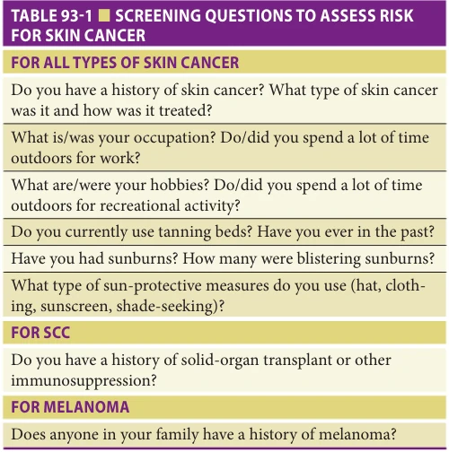

*Table 93-1, printed p. 1456.*

discussion of unique risk factors for each cutaneous carcinoma under its appropriate sections.

Not every patient with the same history of UV exposure has an equal risk of developing skin cancer. The risk is greatest in patients who are most sensitive to UV radiation, that is, light-skinned individuals with blue or green eyes and red, blonde, or light brown hair. Light-colored skin is more likely to burn than tan on UV exposure, and as epidermal melanin increases, individuals instead tend to tan and are less likely to burn. This association between UV sensitivity and skin pigmentation is illustrated by the Fitzpatrick Phototyping Scale, which categorizes skin into six phototypes, with each successive type having increased UV resistance and epidermal melanin. Individuals with darker skin tones therefore have reduced skin cancer risk compared to those with lighter skin. For example, in the case of melanoma, while non-Hispanic Whites have an annual incidence rate of 28 cases of melanoma per 100,000 individuals, and this decreases to 5 per 100,000 for Hispanics and 1 per 100,000 in non-Hispanic Blacks and Asians/Pacific Islanders.

Chronic solar damage from UV exposure leads to “photoaging” of the skin. The skin changes of photoaging are distinct from changes caused by chronologic aging. In photoaging, UV radiation induces an inflammatory cytokine cascade that leads to collagen degradation. Over time, this degradation manifests as cutaneous atrophy, mottled pigmentation, wrinkling, dryness, telangiectasia, and decreased skin elasticity. In comparison, chronologic aging is characterized by fine lines and decreased skin elasticity. Given that darker pigmentation attenuates the effect of UV radiation on skin, patients with darker skin tend to experience delayed and less severe photoaging.

Adverse effects of UV radiation can be prevented via photoprotective behaviors including topical sunscreen, wearing protective clothing, avoiding the sun at noon, and seeking shade. Providers should ask patients about their current sun-protective habits and encourage them to pursue these measures.

## NONMELANOMA SKIN CANCER (KERATINOCYTE CARCINOMA)

## Actinic Keratoses

Definition Actinic keratoses (AK) are precancerous lesions classically found in sun-exposed areas of the body. AKs develop when exposure to chronic UV radiation leads to dysplasia of keratinocytes in the epidermis.

Risk factors AKs are extremely common in older lightskinned individuals who have had significant chronic sun exposure. Refer to the Etiology section for a thorough discussion on factors contributing to increased UV exposure.

Clinical presentation AKs present as ill-defined, rough papules often with adherent scale in areas that are chronically exposed to the sun, such as the scalp (especially if bald),

**[p. 1457]**

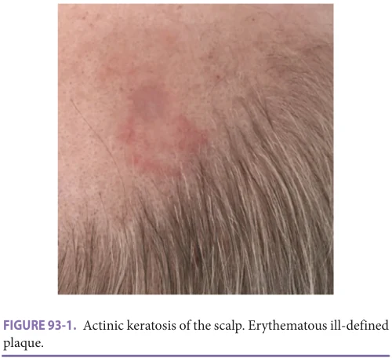

*Figure 93-1, printed p. 1457.*

face, upper chest, and dorsum of the hands and forearms. They can coalesce to form plaques, and their color can vary from skin-colored, to erythematous, pink, or brown (Figure 93-1). The overlaying scale is typically white or yellow, and adherent during palpation or light pressure. AKs are classically described as feeling “gritty” or “sandpaper-like” to the touch. In many cases, AKs might be more easily discernable via palpation than visual inspection.

AKs are diagnosed clinically and do not require biopsy. A biopsy should be obtained, however, to rule out keratinocyte carcinoma if the lesion is thick, indurated, or has not responded to appropriate treatment.

Differential diagnosis Several lesions may present similarly to an AK. Of these, it is most important to differentiate AKs from SCCs and superficial BCCs. It is clinically difficult to make this distinction with certainty if the lesion is indurated or hypertrophic, in which case a biopsy should be performed to confirm the diagnosis. Other common confounders include seborrheic keratoses (differentiated by well-defined borders and a “stuck on” appearance) and solar lentigo (a dark brown macule with an irregular outline). AKs can also be confused with eczema, dry skin, or guttate psoriasis.

Course and complications While most AKs remain stable or undergo spontaneous remission, a small percentage of them develop into cutaneous SCCs. This change, if it does occur, happens over the course of several years in immunocompetent individuals. The cumulative risk for malignant change depends on the number of lesions and their chronicity.

## Basal Cell Carcinoma

Definition BCC is the most common type of skin cancer. It originates from tumor progenitor cells that are typically within the basal layer of the epidermis, or less commonly,

from the hair follicle. There are three major types of BCCs based on clinical presentation and histopathology: (1) nodular, (2) superficial, and (3) morpheaform (scarring, sclerotic).

Risk factors BCCs can either be sporadic—resultant from UV damage (refer to Etiology for a thorough discussion on UV radiation) or ionizing radiation (x-ray)—or hereditary, associated with a genetic syndrome or mutation. Over 90% of both sporadic and hereditary BCCs display uncontrolled Hedgehog (Hh) signaling. The Hh pathway is essential to normal skin development, playing a role in both cell growth and keratinocyte proliferation. Both inactivating mutations of the tumor-suppressor patched (PTCH) gene and activating mutations of the proto-oncogene smoothened (SMO) have been shown to play a role in the pathogenesis of BCCs. These mutations result in the unregulated activation of the Hh pathway, leading to promotion of growth and cancer development in tumor progenitor cells within the epidermis and hair follicle.

Clinical presentation

Nodular The most common BCC subtype is the well circumscribed or nodular variant. This typically begins as a small translucent or waxy flesh-colored or pink, pearly papule or nodule with arborizing vessels on the surface and a translucent, sometimes rolled, border (Figure 93-2). With time, the nodule increases in size and can undergo central ulceration. Although pigmentation can be seen in all BCC subtypes, it is most common in nodular BCCs. Nodular BCCs tend to present on the head and neck.

Superficial Superficial BCCs are the second most common BCC subtype. They present as ill-defined pink to red, flat, scaly lesions, sometimes with a fine, thread-like translucent border (Figure 93-3). The middle of the lesion can erode over time, leaving an atrophic central clearing. As their name suggests, superficial BCCs grow with peripheral extension,

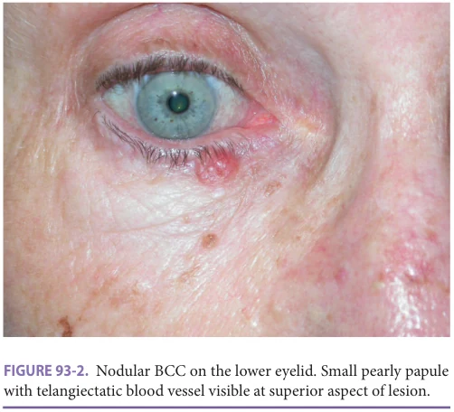

*Figure 93-2, printed p. 1457.*

**[p. 1458]**

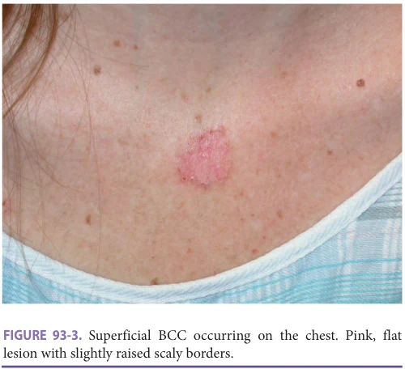

*Figure 93-3, printed p. 1458.*

which can lead to significant superficial subclinical involvement. BCC of the trunk tends to be superficial BCC.

Morpheaform The morpheaform BCC subtype is also referred to as aggressive, infiltrating, sclerosing, sclerotic, or fibrotic. It usually presents as a flat, firm, indurated, pale, whiteto-yellow papule or plaque with ulceration, indistinct clinical borders, and a “scar-like” appearance (Figure 93-4). Morpheaform BCCs may exhibit subclinical extension widely beyond (> 1 cm) their apparent borders with distant, small finger-like projections of tumor cells that may invade deep into the dermis, subcutis, and muscle, skating along fascial planes, cartilage, and bone. These projections can be missed with standard histologic margin control and therefore morpheaform BCCs have a higher rate of recurrence following standard treatment modalities.

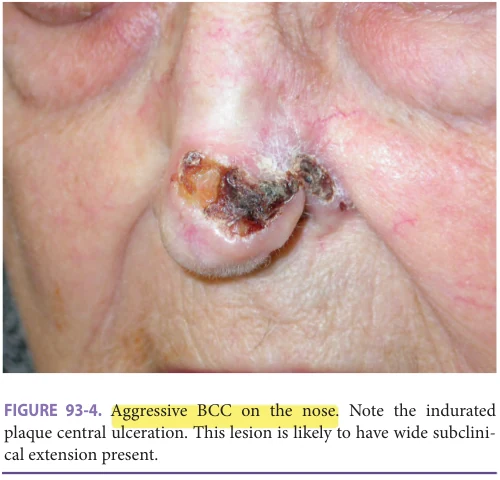

*Figure 93-4, printed p. 1458.*

Differential diagnosis There are several dermatologic lesions that can present similarly to BCCs. Sebaceous hyperplasia can be confused with a nodular BCC due to its presentation as a yellow papule with overlaying telangiectasias and a central pore. Other lesions on the differential for BCCs include skin-colored nevi and benign hair follicle tumors of the face. Of note, superficial BCCs can be mistaken for eczema or other erythematous, well demarcated rashes, which should be considered if a patient has a plaque that is not responsive to standard therapies. It is most important, however, to ensure differentiation between the three main types of skin cancer: BCCs, SCCs, and melanoma. Any lesion suspicious for cutaneous carcinoma should be biopsied. Histologic processing will be able to differentiate between the three.

Course and complications BCCs typically grow indolently for years but are capable of sudden exponential growth. Occult local invasion may be deep and asymmetric with root-like extensions sometimes several centimeters beyond the lesion’s clinically apparent borders. If left untreated, relentless growth can lead to extensive local destruction, ulceration, drainage, bleeding, infection, and disfigurement. Depending on the tumor’s location, it can invade bone and even impair function of vital structures such as the eyes, nose, or ears. Neglect of BCCs until they present with significant morbidity can be particularly prevalent among older adults, where factors such as functional and cognitive impairment, low socioeconomic status, and lack of social support can all delay their presentation to the health care system.

Metastasis is rare, however does occur, particularly if the lesion is larger than 2 cm in diameter, on the head and neck, and invades beyond fat. The estimated incidence of BCC metastasis ranges from 0.0028% to 0.55%. Recurrence is more likely than metastasis, even though the risk of recurrence is small after any standard treatment. Since BCCs grow slowly, recurrence is more likely several years after treatment of the initial tumor, with studies finding that 56% of recurrences occurred 5 years or more after the primary tumor was definitively treated. The risk of a new primary skin cancer is higher than either metastasis or recurrence, for example, for men with SCC, 28% will develop a BCC. Regular follow-up should therefore be provided to these patients, generally in the form of a skin check once a year.

## Squamous Cell Carcinoma

Definition SCC is the second most common type of skin cancer. The majority of cutaneous SCCs develop from AKs; yet, while AKs are considered to be precancerous lesions, not every AK develops into an SCC. Most SCCs are low-risk lesions that have high cure rates following treatment. It should be noted, however, that SCCs do have the potential to metastasize.

Risk factors Just as with other skin cancers, SCCs occur most often in patients with high levels of chronic sun exposure (refer to the Etiology section for a thorough discussion on UV radiation). SCCs also have several additional unique risk factors. Conditions that can predispose patients to SCC

**[p. 1459]**

development include ionizing radiation (x-ray), arsenic exposure, scarring from a previous injury such as a burn, and chronic inflammatory processes like wounds or ulcers, osteomyelitis sinuses, or discoid lupus. Viruses, in particular the human papillomavirus (HPV), are also implicated. Although HPV is classically associated with cervical SCC, it has also been linked to cutaneous SCC. This association was first reported in the genetic disorder epidermodysplasia verruciformis. Patients with this disorder develop hundreds of warts, and those warts that are caused by HPV-5 in sun-exposed areas frequently become cutaneous SCC.

The biggest risk factor for SCC, however, is immunosuppression. SCC is the most common skin cancer in immunosuppressed solid organ transplant recipients, occurring 65 to 250 times more frequently in these patients than in the general population. Light-skinned, immunosuppressed individuals can quickly develop large numbers of AKs which tend to behave aggressively and transform into invasive, rapidly growing SCCs with an increased risk for metastasis. It has been shown that the development of cutaneous SCCs in solid organ transplant recipients is proportional to the intensity of their immunosuppressive regimen, with an increased number of immunosuppressive agents correlating to higher rates of cutaneous SCC formation. Of note, transplant patients with skin of color also develop SCC at high rates, but their lesions are more likely to be found in non–sun-exposed sites, necessitating a careful and thorough skin examination.

Clinical presentation A majority of cutaneous SCCs (80%) develop in chronically sun-exposed areas on the head and neck. Clinical presentation varies, but most often SCCs are 0.5 to 1.5 cm firm, sometimes tender, hyperkeratotic pink to red papules, nodules, or plaques that may bleed (Figures 93-5, 93-6, and 93-7). The center of the lesion can become ulcerated or crusted and has the potential for rapid and deep invasion. In darker skinned patients, SCC may present in

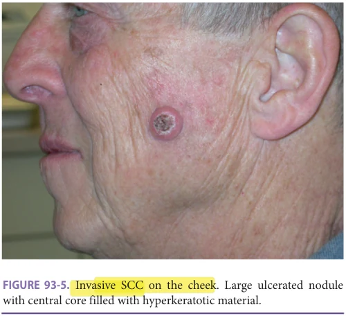

*Figure 93-5, printed p. 1459.*

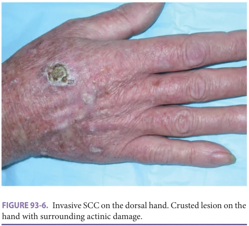

*Figure 93-6, printed p. 1459.*

non–sun-exposed areas and be associated with chronic inflammatory or scarring processes.

Several clinical and histologic SCC subtypes exist, of which perhaps the subtype of the most consequence is keratoacanthoma. Keratoacanthomas tend to grow rapidly, usually over the course of 4 to 6 weeks. They present as a flesh-colored nodule with a central hyperkeratotic crater (Figure 93-8). Although they may spontaneously involute, excision is often recommended for keratoacanthomas since their clinical course is difficult to predict.

Differential diagnosis The differential diagnosis for SCCs includes hypertrophic AKs, warts, seborrheic keratoses, lichenoid keratosis (erythematous or violaceous inflamed

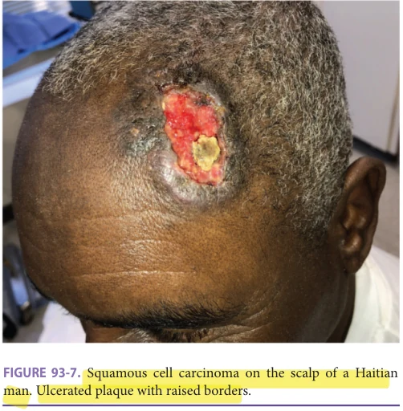

*Figure 93-7, printed p. 1459.*

**[p. 1460]**

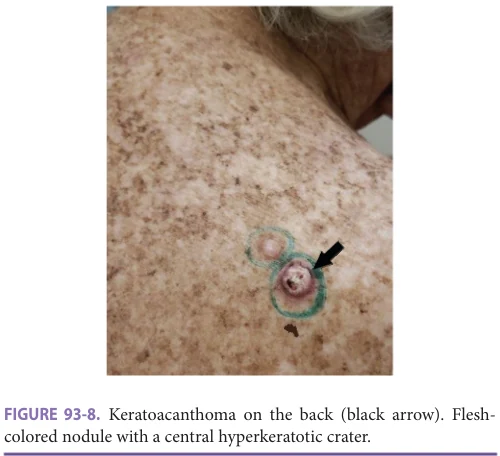

*Figure 93-8, printed p. 1460.*

macule), and BCC. Any lesion suspicious for cancer, including persistent ulcers, should be biopsied.

Course and complications Although the majority of cutaneous SCCs are low-risk lesions that have high cure rates when treated, SCCs do have the potential to metastasize. Lesions that are more likely to metastasize tend to have a diameter > 2 cm, invade deep into the dermis and can have perineural involvement, are recurrent or occur at highrisk sites (eg, ear, lips), develop in scarred skin, or are in immunosuppressed patients. The regional lymph nodes are often the first site of metastasis, involved in approximately 85% to 90% of metastatic cases. Around 10% to 15% of metastases involve distant sites such as the lungs, liver, brain, bone, and skin. The prognosis for patients with metastatic SCC is poor, with 10-year survival rates of less than 20% for patients with advanced regional lymph node involvement and less than 10% for patients with distant metastases.

Treatment for AKs and Keratinocyte Carcinoma AKs do not require biopsy. Biopsy is, however, mandatory to confirm the diagnosis in lesions suspicious for keratinocyte carcinoma. Numerous surgical and nonsurgical modalities are effective in treating BCC and SCC. The selection of therapy is based on several clinical and histologic risk factors noted in Table 93-2. The majority of lesions are relatively low-risk and can be treated effectively with control rates greater than 90% for low-risk tumors treated by techniques such as cryosurgery, topical chemotherapy, electrodessication and curettage (ED&C), surgical excision, or radiation. Additional field destruction procedures such as photodynamic therapy (PDT) can also be used. For lesions complicated by high-risk factors, noted in Table 93-2, the control (cure) rate drops precipitously. High-risk lesions are usually treated with Mohs

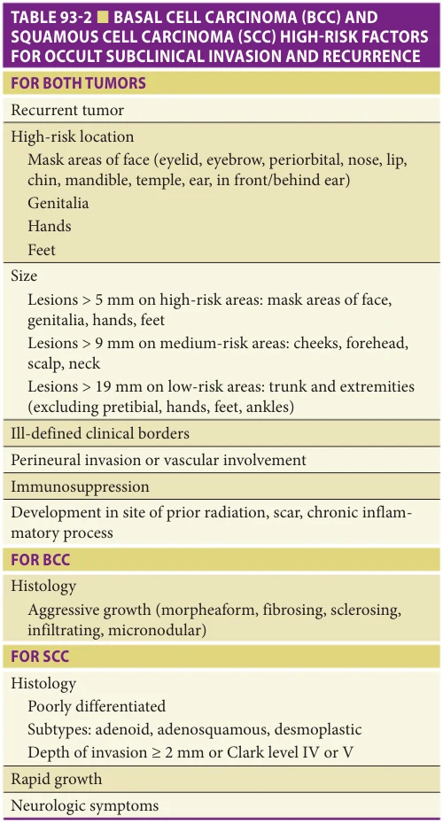

*Table 93-2, printed p. 1460.*

micrographic surgery (MMS) or surgical excision with comprehensive margin control.

Cryotherapy Cryotherapy with liquid nitrogen is the gold standard treatment for isolated AKs. Liquid nitrogen (–196°C) is directly sprayed on the lesion, destroying it via intracellular and extracellular ice formation. The spraying, or “freezing,” should last about 10 seconds, during which the patient will feel a burning or stinging at the site. The lesion is then allowed to thaw, and a repeat freeze-thaw cycle should be performed. Although generally reserved for AKs, cryotherapy can be a highly effective treatment for BCCs or SCCs when timed and performed under local anesthesia or done with thermocouples to measure temperature. Cryotherapy is generally well tolerated by older adults.

**[p. 1461]**

Topical chemotherapy (5-fluorouracil, imiquimod) The two main topical chemotherapeutic agents available are topical 5-fluorouracil (5-FU) and imiquimod. Both are used to treat large areas with multiple AKs where localized cryotherapy would be impractical. The 5% strength versions of 5-FU and imiquimod can also be used to treat select biopsy-confirmed low-risk superficial BCCs. Although both topical agents have similar indications, they work via different mechanisms: imiquimod is a toll-like receptor-7 agonist that induces an immune response against atypical keratinocytes, and 5-FU is a pyrimidine analog that blocks DNA synthesis by inhibiting the enzyme thymidylate synthetase. In head-to-head comparisons, 5-FU is thought to be more effective for the treatment of AKs than imiquimod. Clinical trials for both 5-FU and imiquimod did not find any significant differences in the safety and efficacy of the topical agents between older and younger adults. Patients should be warned though, that both topical therapies can cause significant skin irritation, dryness, and burning. 5-FU should be applied to AKs once a day for up to 4 weeks, whereas imiquimod should be applied two times per week for 16 weeks. If using either agent for BCCs, refer to the Food and Drug Administration (FDA) labels for appropriate dosing. 5-FU and imiquimod can also be used off-label to treat SCC in situ.

Photodynamic therapy PDT can be used to treat AKs and keratinocyte carcinomas. It is a two-step process: a photosensitizing agent is applied to the area being treated, and then light irradiation is administered to the same area to activate the drug. The two traditional photosensitizing agents used are methyl aminolevulinate (MAL) (no longer available in the United States) and 5-aminolevulinic acid (ALA). Both agents are absorbed by neoplastic cells and then converted into porphyrins. Porphyrins are particularly efficient at absorbing visible light, and when activated by light in the presence of oxygen, the resultant chemical reactions lead to cell death. In order to allow for an adequate buildup of porphyrins, photosensitizing agents may be left on the skin for several hours prior to irradiation. The irradiating light source is typically red, blue, or broadband, but pulsed dye laser can also be used. Although surgical excision is more likely to result in complete clearance and reduced recurrence rates compared to PDT, PDT may be associated with a better cosmetic outcome.

PDT is a good option to consider in older adults who are not appropriate surgical candidates or who are unable or unwilling to apply daily topical medications. It is generally well tolerated, with the main adverse effect being pain or burning at the site of treatment. This burning can be particularly severe if the lesion is located on the head. In practice, pain is often the most cited cause of PDT discontinuation among older patients, so providers should consider administering analgesics, anesthetics, or cold air when treating extensive lesions, particularly if on the head.

Electrodessication and curettage ED&C is a common, effective treatment option for thick AKs as well as low-risk keratinocyte cancers in low-risk areas. Results are operator-dependent. Reported 5-year cure rates range from 91% to 97% for both cutaneous SCC and BCC. ED&C is quickly performed in the office with local anesthesia. First, a curette is used to remove the gross tumor, which is soft and friable. This is followed by electrodessication of the periphery and base of the wound to destroy residual tumor cells. Depending on the size and feel of the lesion, this process is repeated for two to four cycles. The resulting wound heals by granulation with a hypopigmented, atrophic, or sometimes depressed, scar. ED&C can be first choice treatment for small superficial lesions or SCC in situ but may also be considered for older patients who are otherwise not good surgical candidates.

Radiation therapy Fractionated radiation therapy (RT) may be used for both BCC and SCC, with 5-year cure rates for both types of keratinocyte carcinoma ranging from 90% to 96%. RT should be used to treat patients in whom surgery is contraindicated or in whom surgical excision would result in a poor functional outcome. Radiotherapeutic modalities include interstitial brachytherapy, superficial x-rays, electrons, and megavoltage photons. Each treatment session of RT is considered a fraction, and these fractions are summated to calculate a total dose. Fractionation allows for normal tissue to repair cellular damage prior to the next RT session; malignant cells, however, have limited capability to do so. Although RT is associated with “late effects” of hypopigmentation and epidermal atrophy after multiple treatments, these cosmetic issues are typically not a major concern for older adults. Therefore, while younger patients usually receive 2 to 2.5 Gy (RT units) over 4 to 5 weeks in order to minimize late effects, treatment for older adults instead aims to decrease course length, with a typical schedule involving 3 to 4 Gy over 2 to 3 weeks. Hypofractionation, or less frequent administration of greater Gy, is recommended for older adults (eg, 5–7 Gy in 5–6 fractions). Compared to normal fractionation, where patients need to receive daily treatment, hypofractionation can allow for older patients with significant comorbidity or poor overall status to receive treatment on alternating days or even just once a week. Even with hypofractionation though, RT still requires multiple visits, which can make it difficult for older adults to attend, especially if they rely on a caregiver to bring them to the doctor. Providers should also be aware that there is an increased likelihood of developing skin cancer secondary to RT 15 years after completion of therapy, and it is therefore not ideal for patients with a life expectancy greater than 15 years.

Surgical excision Surgical excision is the standard of care for an older adult who has a skin cancer that does not have any concerning features (eg, large size or aggressive pathology) and is not in the head/neck region or in an area

**[p. 1462]**

that has compromised vascular supply (eg, the lower legs in patients with venous stasis). It is an effective treatment modality for all types of keratinocyte carcinoma and possesses the advantage of supplying a tissue specimen for histologic assessment of margins. Five-year disease-free rates with surgical excision are 98% for low-risk BCC and higher than 91% for low-risk SCC. When compared to destructive techniques, excisions tend to heal rapidly and with superior cosmetic results. Most excisional procedures can be performed in a treatment room with local anesthesia, but rarely, an extensive procedure may require intravenous sedation or general anesthesia in the operating room. Recommended margins for keratinocyte carcinoma excision generally range from 4 to 10 mm, with the deep margin in mid fat. High-risk lesions require wider margins to ensure clearance and achieve high control rates. If histopathologic processing indicates that the lesion was incompletely excised, then additional therapeutic intervention should be sought, or re-excision should be performed via MMS.

Mohs micrographic surgery MMS is considered the gold standard for removal of high-risk keratinocyte carcinoma. Factors to take into consideration in determining if a lesion is high risk include the type and subtype of cancer, the location, whether the tumor is primary or recurrent, its size, and the patient’s health status. Cure rates with MMS for highrisk primary cutaneous SCCs that have a high likelihood of recurrence with other treatments have been reported as up to 96%. Primary BCCs treated with MMS have only a 1% recurrence rate.

MMS is a specialized form of dermatologic surgery that involves serial tangential excisions with real-time microscopic evaluation of the entirety of the surgical margins to ensure that the tumor is excised completely. Each excision involves removing cancerous tissue with 1 to 3 mm margins per stage and then microscopically examining the entire undersurface and edges of the specimen (the entire true margin) cut as en face horizontal sections. If residual cancer cells are noted at a margin, the precise location is mapped and identified on the patient. Then, another layer of tissue at the corresponding site of the residual tumor is excised and examined microscopically for cancer cells. This process continues layer by layer in stages until no detectable cancer cells remain at the surgical margin. MMS aims to preserve the maximum amount of normal tissue possible, and since nearly 100% of the margin is examined, it results in exceedingly high rates of local control. Reconstruction is usually performed without delay after tumor-free margins are confirmed. Rarely, adjuvant RT may be indicated in cases of extensive perineural spread and cases with a higher risk of local recurrence, but the ability to achieve clear margins surgically is the single best indicator of successful cure. MMS is performed by experienced surgeons who have undergone advanced postgraduate ACGME (Accreditation Council for Graduate Medical Education) fellowship training and are adept at microscopic interpretation of

horizontally cut frozen sections and local flap and graft soft tissue reconstruction techniques. It is often the extensive repair that follows MMS which contributes to morbidity in older adults, rather than the serial excisions of MMS itself. In cases involving large defects or very complex tumors, it is important to have a collaborative, multidisciplinary team approach.

Providers can use the free Mohs Surgery Appropriate Use Criteria app to determine their patient’s suitability for MMS. Even though it may be appropriate, the procedure can be long and tedious and therefore is perhaps not the most desired treatment for all older adults. It is important to consider the patient’s functional status and any physical or cognitive limitations that would make them poor candidates for this form of surgery. Patients who do pursue MMS tend to be highly functioning, or if they are lower functioning, have large symptomatic tumors that severely negatively impact their quality of life. As with any surgical procedure, MMS presents with risk of wound dehiscence, bleeding, pain or tenderness at the surgical site, and infection. Large scale studies have reported no difference in incidence of postsurgical complications between older and younger adults (7% across both patients ≥ 80 and < 80), with one study even reporting that the mean postoperative pain score in adults younger than 66 was significantly greater than in those who were older. While many in the dermatologic community have concluded that MMS is a safe and effective treatment for keratinocyte carcinoma in older adults, it is important for providers to have a thorough discussion with older patients and their families on the risks and benefits of this procedure, as well as expectations for the day of surgery.

Treatment of nodal disease with keratinocyte carcinoma If keratinocyte carcinoma metastasizes to involve the regional lymph nodes (more commonly seen with SCC), then nodal disease is treated with complete lymph node dissection. If indicated by the number of involved nodes and the status of extranodal extension, adjuvant local RT can be administered.

Systemic therapy for BCC Systemic therapy should be considered for patients who have exhausted other therapeutic modalities. Although a few trials have reported that SCC responds to systemic cytotoxic therapy, there is currently no standard accepted systemic treatment for SCC, though PD-1 inhibitors are gaining in popularity. BCCs, on the other hand, have two accepted systemic therapeutic options: vismodegib and sonidegib.

Vismodegib (brand name Erivedge) and sonidegib (brand name Odomzo) are Hh pathway inhibitors that bind and inhibit smoothened (SMO). Erivedge was approved by the FDA in 2012 and Odomzo in 2015. Both drugs are indicated for the treatment of metastatic BCC or locally advanced inoperable BCC in patients who are not candidates for RT. Vismodegib’s reported objective response rates approach 33% for metastatic disease and 48% for

**[p. 1463]**

locally advanced BCC, with sonidegib similarly at 15% for metastatic disease and 43% for locally advanced BCC. Common adverse effects for both drugs include muscle spasms, alopecia, weight loss, fatigue, dysgeusia, nausea/ vomiting, constipation, and diarrhea. Unfortunately, clinical studies of Erivedge did not include a sufficient number of older adults to determine whether safety and efficacy differ between older and younger patients. Trials of Odomzo, however, did—reporting that 54% of patients in Study 1 were 65 and older. Although no difference in efficacy was observed between older and younger patients, older adults who took Odomzo were found to have a higher incidence of serious adverse events, grade 3 (severe but not immediately life-threatening) and grade 4 (urgently life-threatening) adverse events, and events that required dose disruption or medication discontinuation. Adverse reactions that led to discontinuation included muscle spasms and dysgeusia, asthenia, increased lipase, and nausea. Given this risk of severe musculoskeletal adverse events, creatinine kinase levels should be obtained prior to initiating sonidegib therapy and should be monitored throughout the therapeutic course, with discontinuation if indicated.

Prescribers should also be aware of several key drug interactions with the Hh pathway inhibitors. Drugs that inhibit vismodegib’s drug transporter such as clarithromycin, erythromycin, and azithromycin increase systemic exposure to vismodegib and the risk of adverse events. Vismodegib’s FDA label also cautions that proton pump inhibitors, H2-receptor antagonists, antacids, and other drugs that alter the pH of the digestive system may potentially reduce the bioavailability of vismodegib, though this has not been evaluated in clinical trials. Increasing the dose of vismodegib in patients on these medications, however, might not compensate for its potentially reduced bioavailability. Although sonidegib is not noted to have the same interactions with pH-altering drugs, concomitant administration with moderate and strong CYP3A inhibitors (eg, ketoconazole, diltiazem) should be avoided.

Follow-Up Thirty to fifty percent of patients with keratinocyte carcinoma will develop another primary carcinoma within 5 years and are at increased risk of developing melanoma. Therefore, it is important that patients with keratinocyte carcinoma have regular skin examinations and receive education on utilizing sun protection and performing monthly self-skin examinations. For SCC in particular, recurrence most often happens within the first 2 years, so close follow-up during this time frame is indicated for SCC patients. Providers should observe the primary site of the initial lesion for signs of recurrence, and regional lymph nodes should be evaluated for lymphadenopathy indicative of metastatic disease. These patients should be taught to perform self-examinations of their lymph nodes in concordance with their self-skin examinations. For BCCs in

patients with limited life expectancy, some providers also consider active surveillance appropriate when lesions are in low-risk areas without other risk factors. Since BCCs are generally indolent and slow-growing, active surveillance can help patients avoid unnecessary treatments while closely monitoring for tumor growth or development of symptoms. Although active surveillance is not the standard of care, it is an option that providers can discuss with their patients when managing low-risk lesions.

## MELANOMA

Definition Melanoma results from the malignant transformation of melanocytes usually located at the dermal-epidermal junction. When confined to the epidermis, melanoma is termed melanoma in situ. With time, melanoma invades vertically into the dermis where it can metastasize to the regional lymph nodes and other distant organs via the lymphatic or vascular systems. The deeper the melanoma invades, the greater the risk of metastasis and advanced systemic disease.

The incidence of melanoma has been steadily rising over the years. In 2010, the American Cancer Society estimated that 68,130 patients would be diagnosed with melanoma that year. This number jumped to 100,350 estimated cases in 2020. When comparing data across 2007 to 2016, it has been found that the incidence of melanoma has increased 2.2% per year in adults over 50, yet during the same timeframe has decreased by 1.2% in individuals younger than 50. Older adults with melanoma also have a higher mortality rate compared to younger patients. Although new treatments have led to decreased mortality across age groups, trends for younger adults started to dip beginning in the mid-1980s but have only been going down for older adults in the past decade. Data from 2013 to 2017 show a decline in melanoma-related mortality by 7.0% in adults younger than 50, but only 5.7% in older adults. Melanoma’s higher mortality rate and worse prognosis in older patients are thought to be because they often present with more aggressive prognostic features, such as thicker depth and higher mitotic rates.

Risk Factors As with the keratinocyte carcinomas, the main risk factors for melanoma are UV exposure, a history of blistering sunburns, and light complexion. Patients with congenital nevi (CN), or nevi that are present at birth or appear within the first 6 months of life, also have an increased risk for developing melanoma. Large (≥ 20 cm) CN tend to progress to melanoma prior to age 10, and since melanoma may originate deep in the lesion, melanoma nested within CN tends to be detected late. Personal and family history of melanoma are also important risk factors. Five to fifteen percent of melanoma patients endorse a positive family history of melanoma and 5% to 10% of individuals with a personal history of prior melanoma develop a second primary melanoma.

**[p. 1464]**

Genetics also play a large role in melanoma risk. CDKN2A, CDK4, BAP1, and TERT are considered melanoma predisposition genes, and are implicated in both somatic and familial mutations leading to melanoma. Of these, mutations in CDKN2A and CDK4 are the most common in familial melanoma and are found in 45% of cases. Familial occurrence of melanoma is also seen with the familial atypical multiple mole-melanoma syndrome, which is due to a germline mutation in CDKN2A. Criteria for diagnosis of this syndrome include cutaneous melanoma in at least one first- or second-degree relative and greater than 50 total body nevi with multiple atypical nevi that have specific histologic features (eg, subepidermal fibroplasia). It should be noted, however, that dysplastic nevi are not technically considered as “premelanoma” because the melanoma in these patients may arise de novo in normal skin.

The genetic discoveries that have perhaps been the most critical to shaping our understanding and treatment of melanoma are those in the MAPK signaling pathway. The MAPK pathway (also known as the Ras-Raf-MEK-ERK pathway) transfers extracellular signaling intracellularly via a phosphorylation cascade, influencing cell growth, proliferation, and differentiation. One of the kinases in this pathway is BRAF, a proto-oncogene that when mutated can become constitutively activated, leading to unopposed cellular growth, a forebearer of neoplastic transformation. BRAF mutations have been discovered in 50% to 70% of melanomas, and 90% of those mutations are missense point mutations which result in the substitution of glutamic acid for valine at amino acid 600, known as BRAFV600E. This has led to the development of BRAF inhibitors, vemurafenib and dabrafenib (further discussed under Systemic Therapy).

Clinical Presentation Melanoma can arise anywhere on the skin surface. Approximately one-third of melanomas arise from a melanocyte within a preexisting pigmented lesion, and two-thirds arise within scattered melanocytes, developing on clinically normal-appearing skin. The most frequent site for melanoma in men is the trunk, particularly the upper back and shoulders. In women, the most frequent site of melanoma is on the legs. Although rare, it should also be noted that melanoma can occur in the mucosa, genitals, nail beds, and ocular sites. In dark skinned individuals, melanoma is most common on the palms and soles of the feet.

The earliest clinical features of melanoma include a change in the size, shape, or color of a lesion. Persistent itching of a lesion can also occasionally be an early clinical feature of melanoma. Later features include ulceration, bleeding, and tenderness. The clinical changes associated with melanoma can be remembered by the ABCD rule (Table 93-3, Figure 93-9). “A” stands for asymmetry—one half of the lesion is not a mirror image of the other half. “B” stands for irregular borders—the edges of the lesion might appear ragged, notched, jagged, scalloped, or fuzzy. “C” stands for color, since the lesion will typically lack homogenous pigmentation

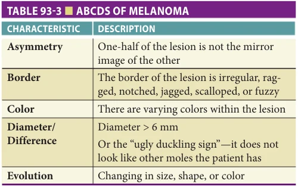

*Table 93-3, printed p. 1464.*

throughout; varying and mottled shades of tan, dark brown to jet-black, or shades of red, white, and/or blue may be present. Historically, “D” stood for a diameter greater than 6 mm; however, this has proven to be relatively insensitive as an independent factor. Therefore, in many melanoma centers, “D” stands for difference. This could be interpreted as any change or difference in an individual lesion, especially with respect to size, shape, color, or persistent itching. “Difference” could also refer to being suspicious of a lesion that looks different from others, which is known as the “ugly duckling sign.” This means that in patients with multiple normal or slightly abnormal-appearing nevi, any isolated lesion that appears different from the overwhelming majority should be regarded with suspicion and biopsied for further testing. “D” can also stand for dark since melanoma is typically heavily pigmented even when very small. The ABCD rule has now been expanded to include “E,” denoting how evolution or change in any of the ABCD characteristics is what can be most concerning for melanoma.

Providers, however, should be aware that not all melanomas will display every ABCD characteristic, and that early melanomas can even lack all of these classic features. Therefore, any changing pigmented lesion or new atypical lesion should be evaluated with a low threshold for biopsy,

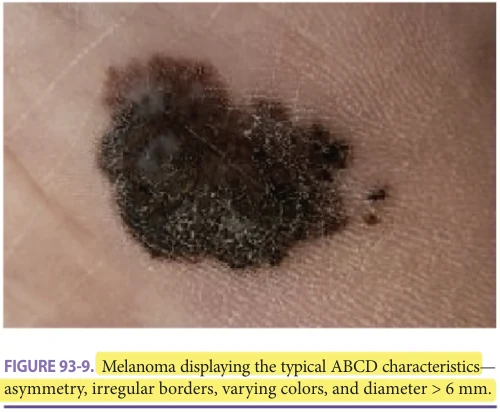

*Figure 93-9, printed p. 1464.*

**[p. 1465]**

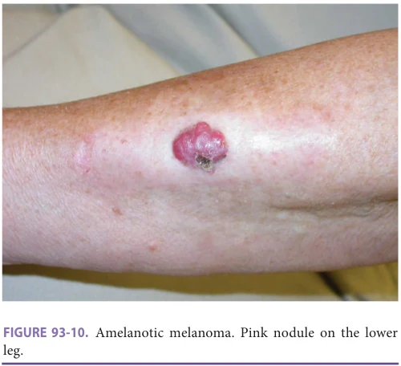

*Figure 93-10, printed p. 1465.*

especially if the patient has risk factors for melanoma. Since only 33% of melanomas develop within preexisting nevi though, there is no indication for prophylactic removal of preexisting nevi. It should also be noted that 3% to 4% of melanomas completely lack pigmentation; these amelanotic melanomas are understandably often detected at later stages of development than pigmented lesions (Figure 93-10).

Superficial spreading (low cumulative sun damage) Superficial spreading melanoma, also known as low cumulative sun damage melanoma, is the most common melanoma subtype, representing approximately 60% to 70% of melanomas. It typically develops as a spreading pigmented plaque with irregular borders and variation in color and surface contour (Figures 93-11 to 93-13). Regression might result in pink to white areas within the black or brown tumor.

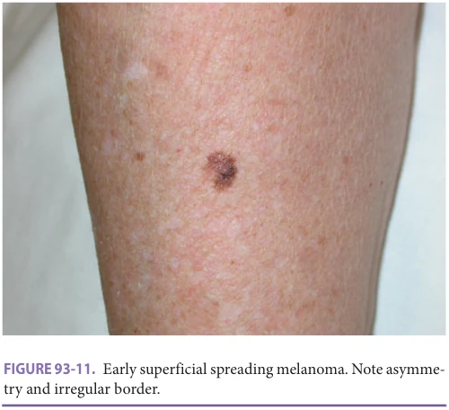

*Figure 93-11, printed p. 1465.*

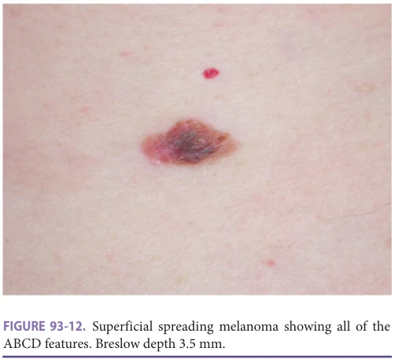

*Figure 93-12, printed p. 1465.*

As its name suggests, this subset of melanoma initially grows horizontally, and invasion is typically not seen until the lesion is 2.5 cm in diameter.

Lentigo maligna (high cumulative sun damage melanoma) Approximately 10% to 15% of all melanomas are categorized under the lentigo maligna, or high cumulative sun damage, subtype. This type of melanoma is particularly common in older adults and is most often located on sun-damaged skin, for example, the head and neck. It usually begins as a pigmented macular lesion with variation in black and brown color. It typically has an irregular outline, and over the course of several years it can darken and enlarge (Figures 93-14 and 93-15). The in situ phase of this lesion is known as lentigo maligna. Once histologic invasion is documented, it is termed lentigo maligna

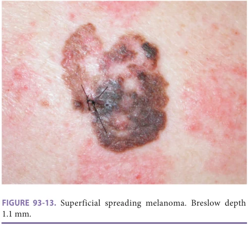

*Figure 93-13, printed p. 1465.*

**[p. 1466]**

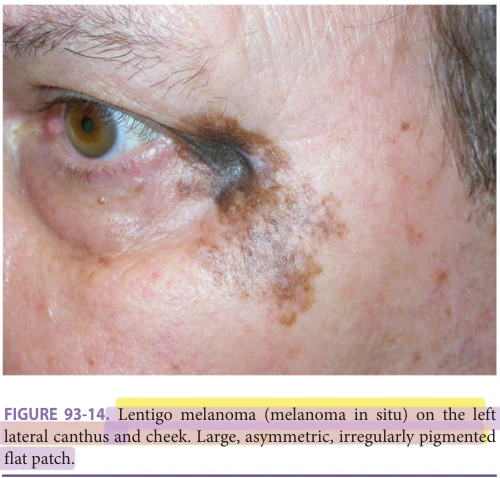

*Figure 93-14, printed p. 1466.*

melanoma. Malignant cells may asymmetrically reach several centimeters beyond the clinical lesion, extending down hair follicles and other skin appendages.

Nodular Nodular melanoma constitutes approximately 15% to 30% of melanomas. It often arises without evidence of a preexisting lesion. Nodular melanoma has a minimal lateral growth phase, and instead grows vertically early in the course of the disease. Due to this early vertical growth, nodular melanoma typically has invaded substantially by the time of detection, leading to a worse prognosis. Clinically, nodular melanoma appears as a raised, nodular, or polypoid lesion with relatively uniform color and regular borders (Figure 93-16). Nodular melanoma may ulcerate with rapid growth and can lack classic melanoma features.

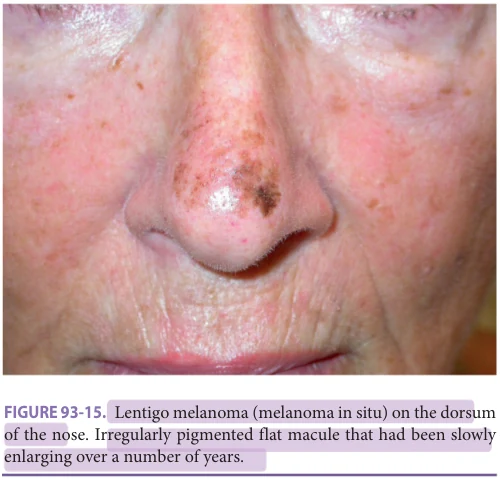

*Figure 93-15, printed p. 1466.*

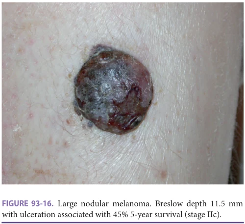

*Figure 93-16, printed p. 1466.*

Acral lentiginous Acral lentiginous melanoma represents approximately 2% to 8% of melanomas in Caucasians, but 35% to 60% in people of color. As its name suggests, it usually occurs in acral sites, that is, the hands, feet, fingers, toes, and under the nails. It presents as a brown or black macule or patch with irregular borders (Figures 93-17 and 93-18). Subungual melanoma may present as an irregular, tan-brown longitudinal streak in the nail without a visible tumor. It is generally under the proximal nailfold in the nail matrix (Figure 93-19). Unfortunately, given this presentation, subungual melanomas are often misdiagnosed as subungual hematomas.

Differential Diagnosis The differential diagnosis of melanoma encompasses several benign etiologies. For superficial spreading melanoma

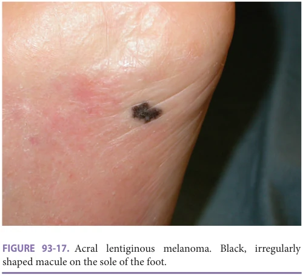

*Figure 93-17, printed p. 1466.*

**[p. 1467]**

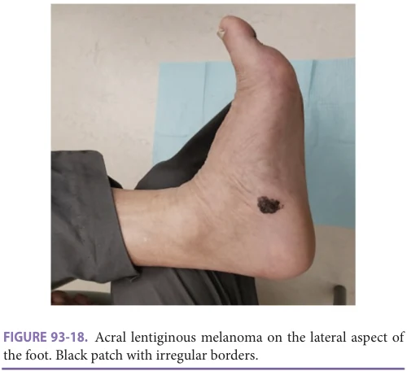

*Figure 93-18, printed p. 1467.*

that list includes atypical nevi, pigmented BCC, and seborrheic keratoses; for nodular melanoma—angiokeratoma, blue nevi, and dermatofibroma. Nevi and the rare fungal infection tinea nigra palmaris should be considered in the differential for acral lentiginous melanoma.

Course and Complications The American Joint Committee on Cancer (AJCC) classifies melanoma based on the tumor thickness (T), nodal status (N), and metastatic disease (M) staging system. There are five stages, with each successive stage associated with a worse prognosis and deeper invasion into the dermis (Breslow depth): stage 0 (in situ melanoma), stage I (local disease with no evidence of spread), stage II (local disease with deeper invasion into the dermis but still no evidence

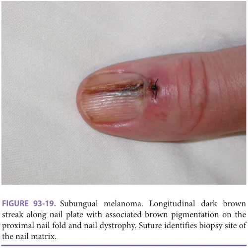

*Figure 93-19, printed p. 1467.*

of spread), stage III (evidence of spread to regional lymph nodes or skin), and stage IV (distant metastases). The more distal the metastases, the poorer the prognosis. Frequent sites of metastases include the lymph nodes, skin, and subcutaneous tissue. Visceral metastases most commonly involve the lungs, liver, brain, bone, and intestines, though they may occur in any organ.

Clinically, node-negative patients with significant risk of regional nodal disease at the time of diagnosis are staged via a sentinel lymph node biopsy (SLNB), ideally performed at the time of definitive treatment of the primary site. The lymph node status and nodal tumor burden (based on SLNB) are incorporated into the current AJCC staging system. A thorough description of prognosis based on Breslow depth and other prognostic factors is found in a seminal article by Balch et al.

## Treatment of Melanoma

Biopsy considerations All lesions clinically concerning for melanoma should be biopsied via a full-thickness excision with narrow margins (2 mm) oriented parallel to the lines of lymphatic drainage, or a deep saucerization shave biopsy of the complete lesion. The goal of biopsy is to remove the entire clinical lesion for comprehensive histologic evaluation. A superficial shave biopsy is never recommended for a lesion suspicious for melanoma; if the melanoma is transected with a shave biopsy then it will be difficult to accurately determine the thickness of the tumor. For suspicious lesions too large for complete excision, a full-thickness incisional biopsy deep enough to avoid transecting the lesion at the deep margin may be performed using an ellipse, deep saucerization shave, or punch. Incisional biopsies of melanoma do not increase the risk of metastasis. Formalin-fixed, paraffin-embedded, permanent sections are required for accurate microstaging and diagnosis of the primary lesion.

Surgical excision of the primary tumor Surgical excision of the primary tumor is the standard therapy for melanoma to prevent local recurrence caused by persistent disease. The National Comprehensive Cancer Network (NCCN) guidelines include recommendations for lateral margins, which are based on the depth of invasion of the lesion. The deep margin of the excision should be in the deep fat or in the tissue plane above the fascia. Excision specimens are sent to the pathologist for confirmation or change of the histologic stage of disease, as well as evaluation of the surgical margins. Since lentigo maligna, or the superficial portions of the lentigo maligna melanoma, can extend subclinically, excision with 5 mm margins often yields tumor at the margin, leading to recurrence. For these lesions, excision with margin control is necessary. A modification of the MMS procedure with permanent sections is often used, having an excellent success rate of less than 2% recurrence in many studies with long-term follow-up. A comparison study at the Mayo Clinic of wide local excision versus frozen section MMS for lentigo maligna had 5.9% versus 1.9% recurrence rates, respectively.

**[p. 1468]**

Lentigo maligna without evidence of invasive melanoma can also be treated with imiquimod cream used five times a week for 12 or more weeks to the point of inflammation, or with RT. An older patient with limited life expectancy could have the lesion observed, utilizing follow-up examination, lesion photography, dermoscopy, or possibly confocal laser microscopy.

Sentinel lymph node biopsy and regional lymph node management Melanoma’s spread to the regional nodal basin typically begins with initial metastasis to one lymph node, referred to as the sentinel lymph node (SLN). The SLN can be identified by use of radiolabeled colloid lymphatic tracers plus blue dye injected intradermally at the site of the primary lesion. The tracers and dye then drain from the primary lesion, traveling through the lymphatic vessels and collecting in the SLN. This node (or nodes if multiple collect dye) is then removed for careful histologic evaluation with immunohistochemical staining. The entire process is termed the SLNB and is performed as an outpatient procedure. The accuracy of SLNB requires injection of tracers at the site of the primary lesion, so ideally SLNB is completed concurrently with wide local excision, ensuring that tracers are injected at the most appropriate site. If the SLNB is negative for melanoma, no further treatment is indicated. If instead, the SLNB is positive for melanoma, then patients should consider regional therapeutic lymphadenectomy and may be eligible for adjuvant therapy.

The NCCN melanoma guidelines recommend considering SLNB in patients with high-risk stage IB (Breslow depth > 1 mm or 0.76–1.0 mm thick lesions with highrisk features) or stage II melanoma, for whom SLN status is the strongest independent predictor of survival. Highrisk features for regional metastasis warranting SLNB in thin melanoma (0.76–1.0 mm thick) include young patient age, ulceration of the primary lesion, angiolymphatic invasion, a mitotic rate of greater than or equal to 1 mitosis/ mm2, or a positive deep margin on the initial biopsy. SLNB is not recommended for stage 0 melanoma, or very thin (≤ 0.75 mm) lesions that are stage IA or 1B.

Although SLNB is generally well tolerated, reported complication rates vary from 5% to 10%. Old age is one of the known risk factors for complications associated with SLNB, so it is important that older adults considering SLNB are well-educated on the risks and benefits of the procedure. Complications that are most likely to occur include wound dehiscence and infection, seroma/ hematoma, and lymphedema. Other reported risks include allergic reactions to the dye used, nerve injury and thrombophlebitis, deep vein thrombosis, and hemorrhage. Given these risks, SLNB has remained controversial in older adults, and especially in the very old. A study at the University of Michigan, however, of 952 melanoma patients 75 years or older concluded that in patients with good functional status who were appropriate surgical candidates, SLNB should be strongly considered; it was found to be associated with improved outcomes, even after factoring in age and comorbidities.

SLNB allows for early identification of patients with nodal disease and for immediate intervention with completion lymph node dissection (CLND). Although data on improved clinical outcomes with CLND are conflicting, the procedure is still recommended by the NCCN for patients with stage III disease or a positive SLNB. The NCCN panel determined, however, that there was insufficient evidence to detail a specific number of lymph nodes that have to be removed in lymph node basins in order for CLND to be considered adequate.

Adjuvant therapy

Adjuvant radiation therapy NCCN guidelines recommend considering adjuvant RT following surgery for patients with desmoplastic melanoma, or melanoma that involves nerve fibers, otherwise known as neurotropic melanoma. These tumors are at high risk of recurrence, which can be ameliorated by adjuvant RT. For patients with positive nodes and a high risk of nodal basin relapse, however, the expert panel was unable to reach a consensus to recommend adjuvant RT. Although high-level evidence displays that adjuvant RT can delay relapse in these patients, some experts noted that this benefit could be outweighed by late RT-related toxicity. Therefore, the use of adjuvant RT in these patients should be determined on a case-by-case basis.

Adjuvant systemic therapy Historically, interferon-α was used as adjuvant systemic therapy in surgical patients with no known metastases. Data have now shown that interferon-α is ineffective as a therapeutic for melanoma, with the field instead embracing targeted therapy and immune checkpoint inhibitors. These therapeutics were initially only used for stage IV disease; however, they are now often considered as adjuvant therapy in stage II disease.

Systemic therapy

Targeted therapies Targeted therapeutics for melanoma include the BRAF inhibitors vemurafenib (brand name Zelboraf) and dabrafenib (brand name Tafinlar), developed to counteract the constitutively active BRAF kinase resultant from the mutation BRAFV600E. BRAFV600E mutations must be confirmed in patients prior to initiating targeted therapy. The kinase immediately downstream from BRAF is MEK, and therefore constitutive BRAF activation in BRAFV600E leads to constitutive MEK activation. As such, BRAF inhibitors are often given in conjunction with MEK inhibitors (trametinib) for further efficacy. Clinical studies of vemurafenib did not include a sufficient number of adults older than 65 years to determine the safety and efficacy of the drug in this population. Trials of dabrafenib did, however, include older adults. When dabrafenib was administered as a single agent for melanoma, no differences were observed in the safety and efficacy of the drug between older and younger patients. When given in conjunction with trametinib, efficacy remained the same across patient age, but older patients had an increased incidence of peripheral edema (26% vs 12%) and anorexia (21% vs 9%) when compared to younger adults. It should be noted that

**[p. 1469]**

trials of trametinib as a single agent did not include sufficient numbers of older adults. Common adverse reactions for both vemurafenib and dabrafenib include arthralgias, alopecia, and skin papilloma, with vemurafenib additionally displaying photosensitivity, and dabrafenib hyperkeratosis and palmar-plantar erythrodysthesia syndrome. When dabrafenib was given in conjunction with trametinib as adjuvant treatment for melanoma or for unresectable or metastatic melanoma, common adverse reactions included pyrexia, rash, chills, and headache. Providers should additionally be aware that dabrafenib can decrease systemic exposure of warfarin, and the label recommends that during the initiation or discontinuation of dabrafenib in patients who receive warfarin, providers should frequently monitor the international normalized ratio (INR).

Immunotherapies Immunotherapeutic treatment options for melanoma include ipilimumab (CTLA-4 inhibitor), nivolumab (PD-1 inhibitor), and pembrolizumab (PD-1 inhibitor). Both CTLA-4 and PD-1 are involved in immune checkpoints, which are inhibitory pathways that deter autoimmunity by preventing immune cells from indiscriminately attacking all cells and tissue that they come across. CLTA-4 decreases T-cell activity, and PD-1 inhibits T-cell proliferation and cytokine production. Inhibiting these checkpoints effectively switches “on” T-cell activity against melanoma, inducing an antitumor immune response.

Although insufficient numbers of older adults were included in trials for adjuvant melanoma treatment with Yervoy (ipilimumab) and in some of the trials for Opdivo (nivolumab), those trials across Yervoy, Opdivo, and Keytruda (pembrolizumab) that did include sufficient numbers of older adults, did not find any significant differences in the safety and efficacy of the drugs between younger and older adults. Common adverse reactions across CTLA-4 and PD-1 therapeutics include nausea, vomiting, fatigue, rash, and diarrhea, but providers should be aware that severe and fatal immune-mediated adverse reactions can occur with these medications. Such reactions include immune-mediated hepatitis, pneumonitis, endocrinopathies, and renal dysfunction.

Role of imaging in melanoma diagnosis In the case of an unremarkable history and physical examination in a patient with recently diagnosed melanoma, the NCCN recommends against routine imaging studies (computed tomography [CT], positron emission tomography [PET] scan, and magnetic resonance imaging [MRI]) and lab tests for patients with stage I melanoma. These imaging modalities may be used for symptom-directed work-up for patients with stage II disease. Imaging for asymptomatic patients with stage III disease is generally felt to be low yield but may be performed at the discretion of the treating physician. Stage IV metastatic disease should be confirmed by tissue biopsy (either fine needle aspiration or open biopsy) when possible and it is recommended to perform additional staging with imaging and blood serum lactate dehydrogenase (LDH).

## OTHER CUTANEOUS TUMORS

There are a number of less common cutaneous tumors that are beyond the scope of this chapter. Of these, the geriatrician should be familiar with Merkel cell carcinoma (MCC) given that it is a highly aggressive tumor with a predilection for older adults. For readers interested in discussion of other tumors, please refer to a standard dermatology text.

## Merkel Cell Carcinoma

Definition MCC is a rare, highly aggressive cutaneous neuroendocrine carcinoma. As its name suggests, the tumor develops from Merkel cells, which are responsible for the sensation of light touch and are found in the basal layer of the epidermis. Approximately 1600 cases are diagnosed annually in the United States, and 81.7% of patients who are diagnosed are older than 70. The 5-year overall survival after diagnosis ranges from 51% for patients with local disease to 14% for those with distal metastases.

Risk factors As with other skin cancers discussed in this chapter, the major risk factor for MCC is extensive UV exposure, with the typical patient being an older adult with light-colored skin (refer to the Etiology section for a thorough discussion on UV exposure). Other important risk factors include chronic immunosuppression and infection with the Merkel cell polyomavirus (MCV). Although MCV is typically a benign virus to which much of the world’s population is exposed to as children, MCV is found in the cells of eight out of 10 MCCs, suggesting that it has a significant oncogenic role in the development of this cancer.

Clinical presentation and histology MCC commonly occurs on the sun-exposed skin of the head and neck in older adults. In younger patients, however, the trunk is the most common site of occurrence. On examination, patients present with a red-to-purple bump or nodule that grows rapidly over 3 months (Figures 93-20 and 93-21).

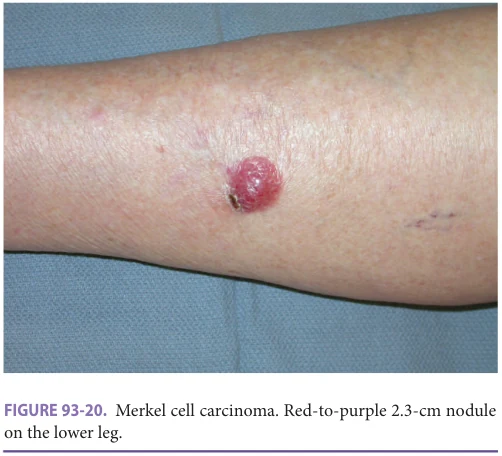

*Figure 93-20, printed p. 1469.*

**[p. 1470]**

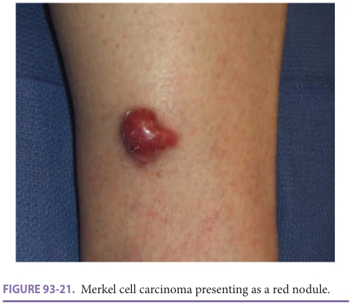

*Figure 93-21, printed p. 1470.*

Differential diagnosis Initially, MCC may be misdiagnosed as an inflamed hair follicle, boil, or cyst. Rapid growth of the lesion often prompts biopsy and accurate diagnosis.

Course and complications As an aggressive tumor, MCC presents with a high risk of recurrence and metastases. The first consensus staging system for MCC was introduced in 2010 by the AJCC. The system follows the primary tumor (T), nodal status (N), and distant metastases (M) structure. Four stages exist, stage I (local disease with primary tumor < 2 cm), stage II (local disease with larger tumor size), stage III (regional nodal disease), and stage IV (distant metastatic disease). Although MCC is capable of metastasizing to distal viscera, it commonly affects the regional nodal basin, with studies showing that even the smallest clinical tumors have at least 15% to 20% risk for occult metastatic disease in the regional lymph node basin.

Given its aggressive nature and risk for metastasis, it is critical to identify and treat MCC early. Yet, in a study of more than 26,000 patients from the National Cancer Database, it was found that even after diagnosis, time to definitive surgical treatment for stage I to III MCC was significantly longer for Black patients (58.9 days) than it was for non-Hispanic Whites (46.3 days). Of note, these disparities persisted for Medicare and private insurance, but not for Medicaid or uninsured patients, and occurred despite Black patients living closer to the hospital than nonHispanic Whites. These findings highlight some of the many disparities in health care, bringing to attention the fact that minority patients often do not just experience delays in diagnosis, but unacceptable delays in treatment.

Treatment for MCC The treatment of MCC is based on the staging and spread of the disease. Wide local excision can be used for management of the primary tumor, with radiation administered to the tumor bed and any regionally involved lymph nodes. Successful treatment has also been documented with a combination of narrow margin excision and RT, or even with just radiation alone. Distant metastases

can be treated with chemotherapy, PD-1 immune checkpoint inhibitors, or other targeted molecular therapies.

## NUANCES IN TREATMENT

Throughout this chapter, multiple modalities of treatment have been discussed for skin cancer. While each treatment presents with its own data on efficacy and cure rates, ultimately, if an individualized approach is taken to choose the right treatment, it is possible to cure every local lesion. Yet, if the wrong treatment is chosen, then the cure rate diminishes. For example, while a 5-mm well-demarcated nodular BCC on the back should have a 99% cure rate via any treatment, this is not the case if the same tumor is in a more high-risk location, like the nasal ala. Such a tumor might require a procedure like MMS with very careful margin control. Another common situation is a 6 mm ulcerated nodular BCC on the lower nose. ED&C in this site has a less than 50% cure rate. Radiation treatment has a 90% cure rate but would require multiple visits. For a 95+% cure rate with a one stage excision with delayed standard histologic evaluation, the procedure entails an excision through fat (to fascia) with at least 4 mm margins and requires reconstruction, likely with a flap and sutures. MMS with a 98% cure rate for this lesion will take place in 1 day, often without even a previous appointment for consultation, and generally result in a smaller and thinner defect that can heal by second intention, removing most of the morbidity and risk of complication from the surgical procedure. Providers must therefore be aware of all of the implications that come with discussing treatment. When patients and families hear the word “surgery,” they are often reflexively hesitant since they may picture a big operation in the operating room. On the other hand, they might be told that a procedure is minor and may not anticipate the need for a large reconstructive flap or graft. Care should therefore be taken to educate patients on the exact procedure that they will undergo, and thorough discussions between the treatment team and the patient should include details regarding the day of surgery, potential options for repair, and their implications. The patient’s concerns should be addressed, and they should have appropriate expectations for the procedure and ensuing recovery. Ultimately, the decision of which treatment to pursue is extremely nuanced and individualized. Several considerations particularly important in the geriatric population are discussed below.

## GERIATRIC PRINCIPLES APPLIED TO DERMATOLOGY

Given that skin cancer increasingly presents with advanced age, providers must be comfortable with triaging these lesions. For older adults, it is important to assess the mortality risk of the lesion (eg, concern for melanoma versus concern for superficial BCC) as well as the morbidity risk (eg, a long-standing 2 cm BCC that constantly bleeds versus a

**[p. 1471]**

new 5-mm lesion concerning for early BCC). These considerations can help when assessing appropriateness of treatment within the conceptual framework of principles such as life expectancy, functional status, and lag time to benefit. Biopsies should always be performed for lesions concerning for high-risk skin cancer, for example SCC in concerning locations or in immunosuppressed patients, melanoma, or MCC. Once a lesion is biopsied and diagnosed, treatment recommendations should be tailored to the individual. Factors to consider include patient preferences, as well as if the patient presents at the end of life, has multiple comorbidities, or the morbidity of treatment outweighs the benefits. While treatments are often well tolerated for skin cancers that are not considered “high risk,” active nonintervention

## FURTHER READING

Ad Hoc Task Force, Connolly SM, Baker DR, et al. AAD/

ACMS/ASDSA/ASMS 2012 appropriate use criteria for Mohs micrographic surgery: a report of the American Academy of Dermatology, American College of Mohs Surgery, American Society for Dermatologic Surgery Association, and the American Society for Mohs Surgery. J Am Acad Dermatol. 2012;67(4):531–550. Balch M, Gershenwald JE, Soong SJ, et al. Final version of

the American Joint Committee on Cancer melanoma staging and classification. J Clin Oncol. 2009;27(36): 6199–6206. Bichakjian C, Armstrong A, Baum C, et al. Guidelines of

care for the management of basal cell carcinoma. J Am Acad Dermatol. 2018;78(3):540–559. Coggshall K, Tello TL, North JP, Yu SS. Merkel cell car-

cinoma: an update and review: pathogenesis, diagnosis, and staging. J Am Acad Dermatol. 2018;78(3): 433–442. Jung JY, Linos E. Adding active surveillance as a treatment

option for low risk skin cancers in patients with limited life expectancy. J Geriatr Oncol. 2016;7(3):221–222. Morgan FC, Ruiz ES, Karia PS, Besaw RJ, Neel VA,

Schmults CD. Factors predictive of recurrence, metastasis, and death from primary basal cell carcinoma 2 cm or larger in diameter. J Am Acad Dermatol. 2020;83(3): 832–838.

can be reasonably considered in patients who are near the end of life, particularly if the lesion is asymptomatic. Palliative surgery, however, should still be an option for lowfunctioning adults if they have symptomatic lesions that significantly impair their quality of life (eg, pain, bleeding, pungent odor). For older adults, it is particularly important for dermatologists and geriatricians or primary care providers to collaborate and involve both the patient and their family in treatment discussions, utilizing shared decisionmaking to marry medical advice with the patient’s desire for or against treatment of their lesion. Ultimately, when determining appropriate treatment in the aging population, it is crucial to weigh the patient’s overall status and their wishes over their chronological age.

National Comprehensive Cancer Network. Basal Cell

Skin Cancer (Version 1.2020). 2019; https://www.nccn .org/professionals/physician_gls/pdf/nmsc.pdf. Accessed November 23, 2020. National Comprehensive Cancer Network. Cutaneous

Melanoma (Version 4.2020). 2020; https://www.nccn .org/professionals/physician_gls/pdf/cutaneous _melanoma.pdf. Accessed November 23, 2020. National Comprehensive Cancer Network. Squamous

Cell Skin Cancer (Version 2.2020). 2020; https://www .nccn.org/professionals/physician_gls/pdf/squamous .pdf. Accessed November 24, 2020. Regula CG, Alam M, Behshad R, et al. Functionality of

patients 75 years and older undergoing Mohs micrographic surgery: a multicenter study. Dermatol Surg. 2017;43(7):904–910. Siegel JA, Korgavkar K, Weinstock MA. Current per-

spective on actinic keratosis: a review. Br J Dermatol. 2017;177(2):350–358. Tripathi R, Bordeaux JS, Nijhawan RI. Factors associated

with time to treatment for Merkel cell carcinoma. J Am Acad Dermatol. 2021;84(3):877–880. Wu S, Han J, Laden F, Qureshi AA. Long-term ultravi-

olet flux, other potential risk factors, and skin cancer risk: a cohort study. Cancer Epidemiol Biomarkers Prev. 2014;23(6):1080–1089.

**[p. 1472]**
