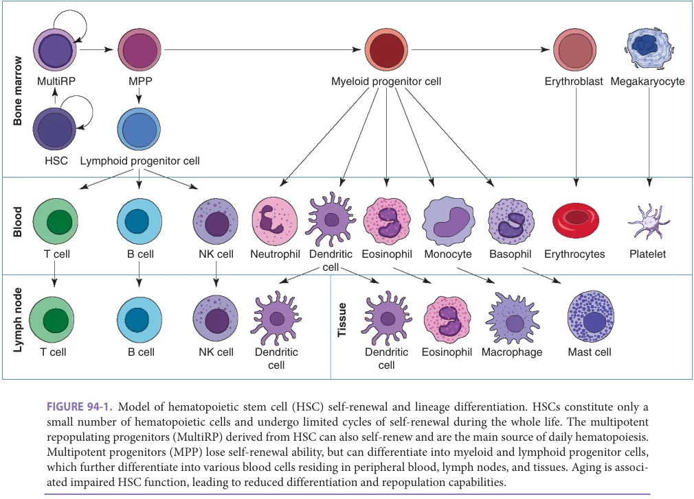
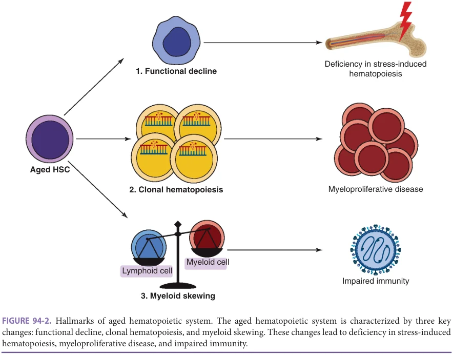
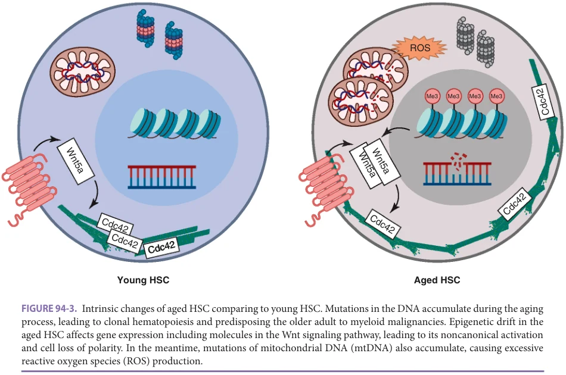
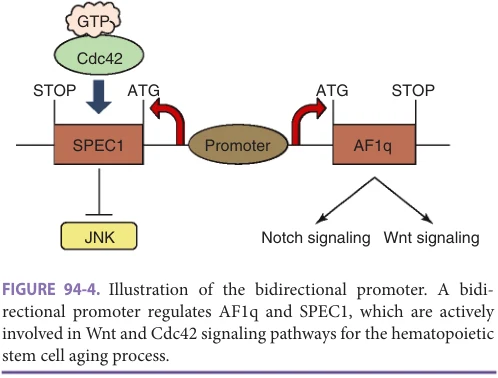
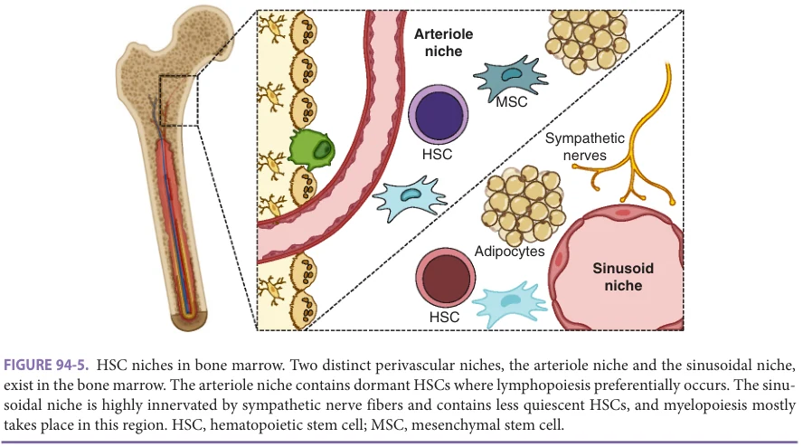
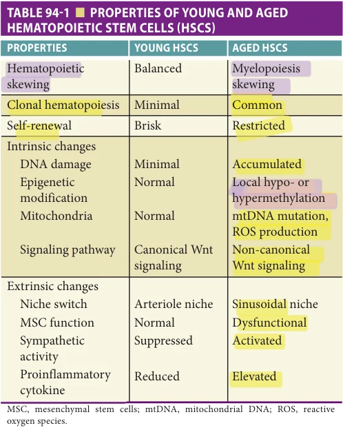

# Hazzard's Geriatric Medicine and Gerontology, 8e - Chapter 94: Aging of the Hematopoietic System and Anemia

Jiasheng Wang, Changsu Park, Jino Park, Robert Kalayjian, William Tse

> **Status.** Fast build from the book; not lane-reviewed.

> **Source and method.** Printed pages 1473-1482, from the marked 8th-edition copy (PDF page = printed page + 34). Prose follows its text layer; tables and figures are source-page crops. The book is canonical.

**[p. 1473]**

## INTRODUCTION

The hematopoietic system is composed of short-lived blood cells that require continuous replenishment in a process called hematopoiesis. Adult hematopoiesis occurs in the bone marrow, where hematopoietic stem cells (HSCs) self-renew and differentiate into progenitor cells, with the latter further developing into mature blood cells (Figure 94-1). Three key changes occur in the aged hematopoietic system: (1) HSC functional decline, (2) increased clonal hematopoiesis, and (3) myeloid skewing and impaired lymphopoiesis. These changes respectively lead to three well-described manifestations of the dysfunctional hematopoietic system in older adults: the deficiency in stress-induced hematopoiesis, increased incidence of myeloid malignancy, and compromised innate and adaptive immunity. The mechanisms of HSC aging can be intrinsic and extrinsic. Intrinsic changes of the HSC range from DNA damage and epigenetic changes to alteration of proteins and signaling pathways. Cell-extrinsic mechanisms are related to the aging of the microenvironment where HSCs reside. This chapter will focus on the phenotypes and mechanisms of the aged hematopoietic system.

#### Learning Objectives

- Understand the integral knowledge of the aging mechanism and process of the hematopoietic system.

- Identify the actionable targets and signal pathways that can be physiologically modified as part of the treatment of medical conditions.

- Become aware of other nonhematologic medical conditions that can directly or indirectly affect the hematologic system’s aging process.

- Understand the clinical and societal burden of anemia in the older population and its management.

#### Key Clinical Points

1. The hematopoietic system’s aging is associated with a complex process that includes molecular biology, signal transduction profiles, and epigenetics.

2. The aging process of the hematopoietic system can be potentially modifiable with the current medical technologies. However, such short-sighted attempts outside of the context of medical treatment should be made with greater caution.

3. Anemia among older adults will be a significant medical and financial burden on the incoming “Silver Tsunami.” It is unknown if anemia in older adults without medical causes is pathological versus physiological. Although some anemia treatment recommendations in this chapter are proposed, readers are encouraged to apply good medical judgment for an individual patient.

## HALLMARKS OF THE AGED HEMATOPOIETIC SYSTEM

Given that HSCs are at the apex of the hematopoietic differentiation, changes of the aged hematopoietic system can be traced back to alterations of the HSCs. While most HSCs are quiescent under homeostasis, in demand situations such as inflammation or infection, HSCs become active and differentiate into blood cells to compensate for these reactive processes. Upon aging, their functions are impaired and their regenerative capacity is reduced, leading to relative cytopenia and slow blood-count recovery when

**[p. 1474]**

*FIGURE 94-1. Model of hematopoietic stem cell (HSC) self-renewal and lineage differentiation. HSCs constitute only a small number of hematopoietic cells and undergo limited cycles of self-renewal during the whole life. The multipotent repopulating progenitors (MultiRP) derived from HSC can also self-renew and are the main source of daily hematopoiesis. Multipotent progenitors (MPP) lose self-renewal ability, but can differentiate into myeloid and lymphoid progenitor cells, which further differentiate into various blood cells residing in peripheral blood, lymph nodes, and tissues. Aging is associated impaired HSC function, leading to reduced differentiation and repopulation capabilities.*

encountering bone marrow stress. Furthermore, as a type of stem cells, HSCs have the capacity to propagate themselves through symmetrical divisions. However, if somatic mutations of leukemia-associated driver genes occur during the process, a genetically identical, hematological malignancy precursor clone would expand predominantly and indefinitely. This phenomenon, known as the clonal hematopoiesis of indeterminate potential (CHIP), is associated with an increased risk of myeloid malignancy in the older adult. Lastly, recent advances in single-cell sequencing revealed that the population of HSCs are heterogeneous with various differentiation potentials. Aging is associated with preferentially increased myelopoiesis and decreased lymphopoiesis, which would impair innate and adaptive immunity, leading to high infection rate in older adults (Figure 94-2).

Hematopoietic Stem Cell Functional Decline HSCs represent a rare and highly quiescent population of cells, which divide very infrequently. Early in vivo studies in mice showed that marrow donors can repopulate blood cells in serial hematopoietic transplantation experiments spanning multiple lifetimes, prompting the hypothesis that HSCs are “effectively immortal.” Moreover, in patients receiving HSC transplantation, advanced donor age does not place the recipient at an increased risk of delayed engraftment or prolonged cytopenia. However, using

competitive transplantation assay, where young and aged HSCs are mixed and transplanted into the same recipient, aged HSCs exhibit a functional decline in their repopulation capacity. Indeed, in a landmark study by Bernitz et al. in 2016 when the authors used in situ genetic labeling, they showed that HSCs can only undergo four self-renewal divisions in their lifetimes before entering a dormancy state, with long-term regenerative potential and differentiation ability lost upon a fifth division. Further studies showed that progenitor cells downstream of HSCs serve as the major self-renewing source of day-to-day hematopoiesis, whereas HSCs themselves represent a dormant compartment which can only be called on demand into an active compartment. This is probably why although aged HSCs have multilevel dysfunction, clinically significant anemia and thrombocytopenia only occur in situations of bone marrow stress, such as bleeding, infection, or inflammation. Indeed, an underlying cause of chronic anemia can be found in the majority of older patients, while only a minority of unexplained anemia is likely due to HSC functional decline. In summary, HSC functional decline leads to deficiency in stress-induced hematopoiesis.

Clonal Hematopoiesis Aging is associated with the accumulation of somatic mutations in HSCs. However, the vast majority of these

**[p. 1475]**

*FIGURE 94-2. Hallmarks of aged hematopoietic system. The aged hematopoietic system is characterized by three key changes: functional decline, clonal hematopoiesis, and myeloid skewing. These changes lead to deficiency in stress-induced hematopoiesis, myeloproliferative disease, and impaired immunity.*

mutations are silent and have no effect on the phenotype. Rarely, mutations occur at the loci of the leukemia-associated driver genes, conferring a selective growth advantage to the mutated cell. As a result, a substantial proportion of mature blood cells harboring the same mutation are produced—a process known as clonal hematopoiesis. Once the clonal outgrowth reaches a certain threshold, the process is then termed CHIP. Contradictory to its name, CHIP is generally regarded as the “first hit” for malignant transformation, and the presence of CHIP is associated with a 10-fold increased relative risk of myeloid malignancies. In addition, emerging evidence also associates CHIP with nonhematologic conditions, such as cardiovascular disease, chronic obstructive lung disease (COPD), autoimmune disorders, and death.

Myeloid malignancies, such as acute myeloid leukemia (AML) and myelodysplastic syndrome (MDS), are predominantly diagnosed in older adults and the incidence increases with age. Indeed, the median ages of diagnosis are 65 and 70 years for AML and MDS, respectively. Similarly, the prevalence of CHIP also rises sharply in older adults, reaching 15% in their 70s and 20% in their 90s. The most common mutations associated with CHIP involve DNMT3A, TET2, and ASXL1, which are also commonly found in AML and MDS, further supporting a causal correlation between CHIP and myeloid malignancies.

Intriguingly, all three of these genes are key players in epigenetic remodeling of chromatin in HSC, which will be explored later in this chapter.

Myeloid Skewing and Impaired Lymphopoiesis Aging is associated with immune remodeling and dysfunction, affecting both innate and adaptive immunity, a phenomenon that is known as immunosenescence. The effects of age on adaptive immunity include lymphopenia with declines in B-cells and naïve T-cells, but expansion of inhibitory regulatory (Tregs) and terminally differentiated, senescent T-cells. These cellular imbalances result in impaired responses to immunization and increased susceptibility to new infections; increased rates of autoimmune disorders; and increased risk of reactivation by chronic, latent infections. Innate immune changes are more complex and less well studied; they involve multiple myeloid cell lines including monocytes, macrophages, and neutrophils.

The causes of immunosenescence are multifactorial. However, one important association is aging-related myeloid skewing and impaired lymphopoiesis. Single-cell sequencing has revealed that HSCs’ differentiation potential is not homogenous—a subgroup of myeloid-restricted progenitors resides in the young HSC compartment, which expands dramatically with aging, leading to myeloid skewing. However, even though the numbers of myeloid cells are

**[p. 1476]**

*FIGURE 94-3. Intrinsic changes of aged HSC comparing to young HSC. Mutations in the DNA accumulate during the aging process, leading to clonal hematopoiesis and predisposing the older adult to myeloid malignancies. Epigenetic drift in the aged HSC affects gene expression including molecules in the Wnt signaling pathway, leading to its noncanonical activation and cell loss of polarity. In the meantime, mutations of mitochondrial DNA (mtDNA) also accumulate, causing excessive reactive oxygen species (ROS) production.*

higher, their functions are compromised, leading to impaired innate immunity. Conversely, the number of lymphoid precursors is reduced, resulting in impaired lymphopoiesis and adaptive immunity. Clinically, about a quarter of the older population have lymphopenia at baseline, and lymphopenia itself is an independent risk factor for mortality.

## INTRINSIC MECHANISMS OF HSC AGING

Intrinsic changes of the HSCs on the molecular and phenotypic level have long been identified. Alterations range from DNA damage, metabolic alterations, loss of cell polarity, and impaired autophagy to changes of the intrinsic signaling pathway (Figure 94-3). Historically, DNA damage was deemed as the driver for HSC aging and responsible for all the phenotypic changes. However, recent studies have shown that epigenetic changes and mitochondrial dysfunction might have played bigger roles in the aged phenotype. Current research is trying to decipher the link between the molecular alterations and the phenotypic changes.

DNA Damage DNA damage is common in mammalian cells and originates from normal cellular activities such as metabolism and DNA replication or external factors such as drug exposure and irradiation. A conserved signaling cascade to prevent accumulation of mutations called DNA damage response (DDR) results in DNA repair, cell-cycle arrest, cellular senescence, and cell death. Nevertheless, DNA

mutations still accumulate with aging, which are especially pronounced in cells with a long lifespan such as HSCs. Therefore, HSCs rely heavily on the damage-response mechanism to maintain genomic stability. Earlier studies using DDR-deficient mice demonstrated a phenotype of premature aging, raising the concern of defective DNA repair mechanism in aged HSCs. However, recent research found that aged HSCs are as effective as young HSCs in repairing DNA. While HSCs possess an effective DNA repair mechanism throughout the aging process, point mutations in epigenetic regulators can still occur leading to clonal hematopoiesis and predisposing older adults to myeloid malignancies.

Historically, DNA damage in HSCs is deemed as the driver for both HSC functional decline and myeloid malignancies in older people. However, the former notion has been challenged in recent years as the function of aged HSCs could be restored by a variety of rejuvenation methods. For example, aged HSCs can be reversed to young phenotypes through induced pluripotent stem cell (iPSC) generation and redifferentiation, which would be impossible if dysfunction originates from the genomic level. On the other hand, although DNA damage and CHIP predispose the older adult to myeloid malignancies, the majority of CHIP does not evolve into MDS and AML, and not all myeloid malignancies have CHIP-associated gene mutations. Therefore, DNA damage and CHIP is only one of the many mechanisms leading to myeloid malignancies and may only partially explain HSC functional decline with aging.

**[p. 1477]**

Epigenetic Drift Young and aged HSCs have a drastically different gene expression pattern. For example, aged HSCs have augmented platelet gene expression at the expense of lymphopoietic genes, leading to the myeloid skewing feature of aged HSCs. Such genome-wide transcriptional differences can only occur at the epigenetic level, which includes DNA methylation, histone modification, and chromatin architecture. Epigenetic mechanisms encompass chromatin-based regulation of gene expression without altering the DNA sequence. These pathways are more dynamic and responsive to the environment and stress disease can serve as a form of cellular memory to previous insults. Given that the phenotype of the aged hematopoietic system can be reversed by iPSC generation and redifferentiation, it is likely that most aging-associated changes are not at the durable genetic code but originate from the epigenetic level.

DNA methylation is an epigenetic signaling mechanism via covalent modification of cytosine moieties by a class of enzymes called DNA methyltransferases (DNMT) to produce 5-methylcytosine (5mC). These modifications are highly restricted to cytosine phosphate guanine (CpG) dinucleotides and are traditionally viewed as a repressive signal, which is associated with transcriptional inactivation of nearby promoter sequences. Intriguingly, the most common single nucleotide mutation found in aging HSCs is the transition from C to T at CpG dinucleotides. Spontaneous deamination of cytosine results in uracil, which is recognized as an error and converted back to cytosine by DNA repair. However, 5mC deamination yields thymine, which can surpass DNA repair and results in a CpG to TpG mutation. Given that CpGs are highly methylated, this transition suggests an interplay between epigenetic regulation and DNA mutations throughout aging. Although global hypomethylation occurs in most somatic cells during aging, aged HSCs demonstrate local hyper- and hypomethylation, indicating a pattern of differential gene expression. Indeed, such alterations in CpG methylation patterns can be modeled to accurately predict chronological age in healthy people and identify apparent discrepancies between chronological and biological age in conditions that have been associated with accelerated aging, including Down syndrome and chronic HIV infection. Furthermore, such modeling also predicted increased mortality in persons with age-related comorbidities.

The mechanism of dysregulation of DNA methylation in aged HSCs is still under investigation. However, DNA mutations in epigenetic regulators, such as DNMT3A, TET2, and ASXL1, can only lead to clonal hematopoiesis and myeloid skewing without the phenotypic changes seen in aged HSCs. Considering DNA methylation being the terminal step of signaling pathways, it is likely that the cause of epigenetic drift comes from outside in (environmental changes leading to epigenetic drift), rather than inside out (DNA damage leading to epigenetic drift).

Histone modification is an additional layer of epigenetic signaling that dictates the availability of specific gene loci to regulatory proteins. The N-terminal tail of histones serve as a robust platform for a myriad of modifications, which in concert lead to transcriptional activation or repression. Various histone code writers, readers, and erasers have been identified but the diversity of these modifications and permutations, especially in the context of neoplasia and senescence, have made clinical interpretation challenging. Nevertheless, both local and global changes in histone modifications have been reported in the aging bone marrow. For example, histone methyltransferase SUV39H1 experiences significant functional loss during aging, leading to decreased H3K9me3 level in HSCs. Accumulation of these changes within the histone code provides a dynamic epigenetic landscape for sophisticated gene regulation superimposed on the static DNA code.

Loss of Mitochondrial Homeostasis Loss of mitochondrial homeostasis is an important mechanism for HSC aging. Just like genomic DNA, mutations of mitochondrial DNA (mtDNA) also accumulate during aging. Indeed, in murine models using the proofreadingdeficient mtDNA polymerase, premature aging phenotypes were observed. However, it is still unclear as to whether mtDNA mutations directly lead to aging. Nonetheless, it is well known that accumulations of mtDNA mutations increase with age and lead to mitochondrial dysfunction.

HSCs reside in the relatively hypoxic bone marrow niches because they are exquisitely sensitive to reactive oxygen species (ROS). The oxidative stress imposed by ROS can lead to DNA structural modification and impaired HSC function. Not surprisingly, aging is associated with incremental levels of ROS. As mitochondria is a major source of ROS production, young HSCs have a significantly lower number of mitochondria. Therefore, oxidative stress is an important cause of HSC dysfunction during the aging process.

Changes of Intrinsic Signaling Pathways Signaling pathways are bridges connecting extracellular stimuli and intracellular response. However, intrinsically altered expression of signaling molecules could also lead to aberrant cellular response, conferring the cells the aging phenotypes.

The Wnt5a-Cdc42 axis is one of the most well identified pathways in HSC aging. The Wnt pathway is a highly conserved pathway across animal species; it regulates gene transcription, cytoskeleton shaping, and calcium homeostasis. Intrinsically increased Wnt5a expression, possibly secondary to epigenetic drift, leading to the activation of Cdc42, a known regulator of cytoskeleton, results in the loss of cellular polarity along with other aging phenotypes. Moreover, genetically modified mice lacking Wnt5a have attenuated aging, and Cdc42 inhibitor CASIN is able to reverse the aging phenotypes in aged HSCs.

**[p. 1478]**

Tse’s group found a small acidic protein AF1q, originally discovered in patients with AML with chromosomal abnormality t(1;11) (q21;q23), is a critical cofactor in the Wnt signaling pathway. The expression of AF1q is bimodal—significantly upregulated AF1q expression is seen in the early and aged HSC compartment. Activation of AF1q simultaneously enhances multiple signaling pathways closely related to HSC aging, including the Notch pathway and the phosphatidylinositide 3-kinases (PI3k)/ Akt (protein kinase B) pathway. AF1q boosts Akt phosphorylation at Thr308 specifically through activation of the signaling of platelet-derived growth factor receptor (PDGFR) with resultant enhanced PDGF-BB expression. The imbalance of PI3k/Akt signaling is associated with aging in various tissues. Taken together, it is hypothesized that AF1q is involved in the aging process through enhanced Akt phosphorylation via PDGFR activation by AF1q-induced PDGF-BB. In addition, the Cdc42-binding protein, SPEC1, shares the same bidirectional transcriptional promoter as AF1q. Therefore, it is also possible that one of the important mechanisms of HSC aging is associated with the switch of the transcriptional direction of the bidirectional promoter (Figure 94-4).

## EXTRINSIC MECHANISMS OF HSC AGING

In 1978, Schofield first proposed the “niche” concept to describe the microenvironment that maintains and regulates HSCs. In recent years, a growing body of evidence is supporting the hypothesis that HSC aging is not only an autonomous process, but also influenced by the functional changes of the HSC niches. Upon aging, alterations such as imbalanced mesenchymal stromal cell (MSC) differentiation and adrenergic signaling remodeling coordinately

*FIGURE 94-4. Illustration of the bidirectional promoter. A bidirectional promoter regulates AF1q and SPEC1, which are actively involved in Wnt and Cdc42 signaling pathways for the hematopoietic stem cell aging process.*

regulate the fate of HSCs, leading to myeloid skewing and impaired lymphopoiesis.

The Bone Marrow Niches During embryonic development, the arteries are responsible for the emergence of HSCs. Similarly, the bone marrow niches for HSCs are also located in the perivascular regions. The bone marrow space is uniformly occupied by sinusoids. However, the peri-endosteal region is highly vascularized by arterioles, which ultimately connect with sinusoids through arterial capillaries. Therefore, the bone marrow consists of two functionally distinct niches, the arteriolar and the sinusoidal niches (Figure 94-5). The arteriolar niche is in the periendosteal region; dormant HSCs are predominantly found in this region, where lymphopoiesis preferentially occurs. On the contrary, the sinusoidal niche is highly innervated by sympathetic nerve fibers and

*FIGURE 94-5. HSC niches in bone marrow. Two distinct perivascular niches, the arteriole niche and the sinusoidal niche, exist in the bone marrow. The arteriole niche contains dormant HSCs where lymphopoiesis preferentially occurs. The sinusoidal niche is highly innervated by sympathetic nerve fibers and contains less quiescent HSCs, and myelopoiesis mostly takes place in this region. HSC, hematopoietic stem cell; MSC, mesenchymal stem cell.*

**[p. 1479]**

contains less quiescent HSCs; myelopoiesis mostly takes place in this region.

Location Shift Between Niches During Aging HSCs redistribute within the bone marrow niches upon aging. It has been well recognized that aged HSCs locate further away from the bone surface than young HSCs. This represents the migration of aged HSCs from the periendosteal arteriolar niche where they remain quiescent, to the sinusoidal niche where they become active in myelopoiesis. Therefore, the aging-related redistribution of HSCs contributes to the impaired lymphopoiesis in older adults.

Mesenchymal Stromal Cell Dysfunction The cellular components of bone marrow niches consist of endothelial cells, osteoblasts, adipocytes, neuro-glial cells, as well as MSCs. MSCs are multipotent precursors that can differentiate into osteoblasts, adipocytes, and chondrocytes to support HSCs within the niches; they can also secrete inhibitory cytokines and chemokines to help maintain HSCs in the quiescent state. Similar to HSCs, MSCs also experience aging-related dysfunctional changes, such as DNA damage, telomere shortening, elevated ROS, and cell-signaling alterations. These changes lead to impaired osteoblasts differentiation and increased adipogenesis, which are responsible for the increased fat tissues in the bone marrow among the older people.

Sympathetic Nervous System Remodeling The bone marrow niche is heavily innervated by the sympathetic nervous system. The release of adrenergic neurotransmitter provides a stress signal to the bone marrow, regulating the functions and mobilization of HSCs. In fact, the sympathetic activity is universally elevated in older adults, manifesting as an increased concentration of noradrenaline in the plasma. In the bone marrow, the aging-dependent increase of sympathetic activity can cause myeloid skewing of aging HSCs through activation of a specific type of β-adrenergic receptor.

Immunosenescence, Inflammaging, and Extrinsic Signaling Pathway Changes Normal aging is associated with systemic, chronic inflammation known as inflammaging. Characterized by lowgrade and persistent inflammation in response to physical, chemical, or metabolic noxious stimuli, inflammaging also may develop in response to chronic infections including cytomegalovirus, Epstein–Barr virus, hepatitis C virus, and HIV. These inflammatory responses may damage tissues and organs over time, and contribute to the emergence of multiple comorbidities including cardiovascular disease and autoimmune and neurodegenerative disorders, while also contributing to hematopoietic dysfunction.

The mechanisms of inflammaging are diverse and incompletely understood but may include the expansion of immunosenescent populations of helper (CD4+) and

effector (CD8+) T-cells. These cells are characterized by telomere shortening and a reduced capacity to proliferate, defective mitochondrial function, and increased ROS formation; in addition, they activate proinflammatory pathways including p38 MAP kinase (MAPK) and NF-κB.

Telomeres are repeating hexameric sequences of nucleotides that protect against DNA damage. Located at the ends of chromosomes, telomeres shorten with each replicative cycle, but may be partially restored by enzymatic telomerase activity. DNA damage ensues when telomere shortening exceeds a critical threshold, at which time cells lose their ability to replicate. Senescent T-cells exhibit shortened telomeres with reduced telomerase activity, and they lose their surface expression of CD27 and CD28. CD8+/ CD28− cells that reexpress CD45RA (TEMRA) identify a subset of terminally differentiated immunosenescent memory CD8+ T-cells that more specifically associate with agerelated adverse clinical outcomes. For example, Alzheimer disease patients have decreased percentages of naïve T-cells, elevated memory cells, and expansion CD28− CD4+ and CD8+ T-cell populations, particularly including CD45RA (TEMRA) cells, compared to healthy young or older adults.

In the hematopoietic system, interleukin-1 (IL-1) induces HSC myeloid skewing and IL-6 promotes thrombopoiesis leading to thrombosis. These cytokines exert their functions through extrinsic signaling pathways. Among them, the NF-κB pathway is involved in the cellular response of a variety of cytokines. Constitutive NF-κB activation in older people, possibly due to inflammaging, leads to hyperproliferation of HSCs with resultant exacerbated myelopoiesis and increased myeloproliferative disorders.

## ANEMIA IN THE OLDER ADULT

Burden of Anemia in Older Adults Anemia, defined by the World Health Organization (WHO) as hemoglobin less than 13 g/dL in men and less than 12 g/ dL in women, becomes more common as people age. More than 10% of community-dwelling adults 65 years or older have anemia, and the prevalence grows above 20% in those 85 years or older. Although usually mild, anemia in older adults is associated with a significant increase in mortality and morbidity, such as decreased physical performance, increased falls, impaired cognition, restricted quality of life, and more frequent hospitalization. One would argue if a lower limit of normal hemoglobin should be proposed for older adults. However, large surveillance databases (eg, the NHANES-III database and the Scripps-Kaiser database) have shown that when excluding patients with iron deficiency anemia, elevated creatinine, and elevated ESR or CRP, the mean hemoglobin remains unchanged across different age groups regardless of gender or race. This indicates that although anemia is more common in older adults, the majority is associated with an underlying cause, such as iron deficiency or chronic inflammation. Indeed, as mentioned above, most aged HSCs remain dormant, and can only turn

**[p. 1480]**

into active states under demand or stress. Therefore, aging is associated with defective stress-induced hematopoiesis, which would not be apparent under normal situations.

Causes of Anemia in the Older Adult The prevalence of different causes of anemia varies in different studies. Nevertheless, the major causes of anemia include iron deficiency anemia (12%–20%), anemia of chronic inflammation (6%–20%), chronic kidney disease (4%–8%), folate or vitamin B12 deficiency (0%–14%), MDS (9%–16%), or malignant hematologic disorder (0%–2%). If none of the above causes can be found, the anemia is defined as unexplained anemia of the elderly (UAE), which ranges from 34% to 44% in different studies. It has been questioned whether UAE represents a real entity or is just the result of an unidentified underlying cause. Indeed, smaller studies with more extensive work-up find a significant portion of UAE is due to insufficient erythropoietin (EPO) production without impaired excretory renal function or chronic kidney disease. To date, the cause of insufficient EPO production older adults is yet to be discovered. Recently, there has been increasing enthusiasm to study the correlation between clonal hematopoiesis and anemia. However, although clonal hematopoiesis is more frequently detected in individuals with anemia, the relative difference is small between anemic people and controls, suggesting that the mutations do not account for the majority of UAE. Lastly, UAE may occur after an unidentified bone marrow stress, and anemia develops as a result of aging-related impaired stress-induced hematopoiesis.

Evaluation of Anemia Initial work-up for anemia in older adults includes a complete blood count with differential, reticulocyte count, ferritin, iron studies, creatinine, vitamin B12, red blood cell folate, thyroid function test, and liver function test. These tests help clinicians rule out the most common causes of anemia, including iron deficiency, nutritional deficiency, and chronic kidney disease. If the above tests are nonrevealing, further work-ups such as EPO level, copper, zinc, C-reactive protein, lactate dehydrogenase, haptoglobin, and serum electrophoresis could be pursued to rule out more rare causes. At last, if a hematological malignancy is suspected, bone marrow aspiration and biopsy are mandatory to exclude disorders such as MDS or leukemia.

Management of Anemia in Older Adults Treatment for anemia should be “age-adjusted” with recognition of potential side effects and impact on the quality of life. For frail patients, even a weekly clinic visit for injection could be burdensome and significantly affect their quality of life.

In patients with iron deficiency anemia, oral iron substitution would be sufficient in most cases. However, the efficacy of daily dosing of oral iron has been questioned as iron supplements increase hepcidin level for up to 24 hours and are associated with lower iron absorption on the following day. Thus, every-other-day dosing of oral iron is generally

preferred over daily dosing. In situations when oral iron does not ameliorate anemia or the patient does not tolerate oral iron, intravenous iron is an effective alternative. Different formulations of intravenous iron exist, such as iron sucrose, ferric gluconate, and ferric carboxymaltose, which are all generally well tolerated.

Erythropoiesis-stimulating agents (ESAs) are analogs of EPO and widely used in end-stage renal disease–related anemia and patients with MDS with moderate to severe anemia. Data on application of ESAs in other causes of anemia including UAE are limited.

Blood transfusion is the most effective treatment for acute symptomatic anemia. For the transfusion threshold, we generally use the cutoff hemoglobin level recommended by the AABB—7 g/dL for the general population and 8 g/dL for patients with symptoms of end-organ ischemia. However, older anemic patients should always be transfused with the recognition of comorbidities. Transfusion threshold and frequency may differ based on many factors and should be evaluated on a case-by-case basis. For example, in a patient with chronic hemolytic anemia who is otherwise asymptomatic from a baseline hemoglobin of 6 g/dL, aiming a higher hemoglobin goal of 7 g/dL would only increase the frequency of transfusion without improving quality of life.

## CONCLUSION

Clearly, there are biological features and properties that distinguish young and aged HSCs (Table 94-1). These differences provide insights into pathogenic mechanisms

*TABLE 94-1 ■ PROPERTIES OF YOUNG AND AGED HEMATOPOIETIC STEM CELLS (HSCS)*

**[p. 1481]**

of diseases, especially the increased risk of immunologic, hematologic, myelodysplastic, and HSC-proliferative disorders that so frequently accompany aging. Furthermore, aging affects not only the cellular or the HSC compartment, but also the bone marrow microenvironment. With improved understanding of the fundamental molecular

## FURTHER READING

Barbe-Tuana F, Funchal G, Schmitz CRR, Maurmann

RM, Bauer ME. The interplay between immunosenescence and age-related diseases. Semin Immunopathol. 2020;42(5):545–557. Furman D, Campisi J, Verdin E, et al. Chronic inflamma-

tion in the etiology of disease across the life span. Nat Med. 2019;25(12):1822–1832. Gate D, Saligrama N, Leventhal O, et al. Clonally expanded

CD8 T cells patrol the cerebrospinal fluid in Alzheimer’s disease. Nature. 2020;577(7790):399–404. Gross AM, Jaeger PA, Kreisberg JF, et al. Methylome-wide

analysis of chronic HIV infection reveals five-year increase in biological age and epigenetic targeting of HLA. Mol Cell. 2016;62(2):157–168. Henson SM, Lanna A, Riddell NE, et al. p38 signaling

inhibits mTORC1-independent autophagy in senescent human CD8(+) T cells. J Clin Invest. 2014;124(9): 4004–4016.

events contributing to these pathogenic changes, there have been prospects to develop mechanism-based therapeutic interventions to preserve and maintain normal hematopoiesis. This may provide opportunities to prevent these diseases and further identify, in a more rational manner, novel therapeutic approaches in treating these disorders in older adults.

Horvath S. DNA methylation age of human tissues and cell

types. Genome Biol. 2013;14(10):R115. Horvath S, Garagnani P, Bacalini MG, et al. Acceler-

ated epigenetic aging in Down syndrome. Aging Cell. 2015;14(3):491–495. Horvath S, Levine AJ. HIV-1 infection accelerates age

according to the epigenetic clock. J Infect Dis. 2015; 212(10):1563–1573. Larbi A, Pawelec G, Witkowski JM, et al. Dramatic shifts

in circulating CD4 but not CD8 T cell subsets in mild Alzheimer’s disease. J Alzheimers Dis. 2009;17(1):91–103. Marioni RE, Shah S, McRae AF, et al. DNA methylation age

of blood predicts all-cause mortality in later life. Genome Biol. 2015;16:25. Salminen A, Kauppinen A, Suuronen T, Kaarniranta K. SIRT1

longevity factor suppresses NF-kappaB -driven immune responses: regulation of aging via NF-kappaB acetylation? Bioessays. 2008;30(10):939–942.

**[p. 1482]**
