# Hazzard's Geriatric Medicine and Gerontology, 8e - Chapter 95: Hematologic Malignancies (Leukemia/Lymphoma) and Plasma Cell Disorders

Anita J. Kumar, Tanya M. Wildes, Heidi D. Klepin, Bayard L. Powell

> **Status.** Fast build from the book; not lane-reviewed.

> **Source and method.** Printed pages 1483-1508, from the marked 8th-edition copy (PDF page = printed page + 34). Prose follows its text layer; tables and figures are source-page crops. The book is canonical.

**[p. 1483]**

## INTRODUCTION

Hematologic malignancies represent varied diseases ranging from indolent to aggressive. Symptoms, treatments, and natural history vary widely. Hematologic malignancies include myeloid malignancies (ie, myelodysplastic syndromes, acute myeloid leukemia, myeloproliferative disorders) and lymphoid malignancies (chronic lymphocytic leukemia, lymphomas, and plasma cell neoplasms). Older adults make up a large proportion of incident and prevalent cases of these diseases as well as those dying from these conditions. As the population ages, the burden of these diseases will rise affecting older adults disproportionately.

#### Learning Objectives

- Recognize presentation, workup, and management of common hematologic malignancies in older adults.

- Recognize the value of geriatric assessment to personalize care for older adults with hematologic malignancies.

- Recognize treatment approaches for older adults diagnosed with common hematologic malignancies.

#### Key Clinical Points

1. Older adults make up a large proportion of incident and prevalent hematologic disorders, as well as those dying from these conditions.

2. The response rates and cure rates for older patients with hematologic disorders have lagged behind those of young adults for a number of reasons: more resistant tumor biology, presence of multiple chronic conditions, and functional impairments that decrease treatment tolerance. Underrepresentation of older adults in clinical trials remains a limitation as well.

3. Myelodysplastic syndromes can be indolent or progress rapidly to bone marrow failure; treatment should be risk-adapted based on disease and patient characteristics.

4. Antileukemic therapy improves survival for most older adults with acute myeloid leukemia.

5. Oral tyrosine kinase inhibitors provide long-term disease control for older adults with chronic myelogenous leukemia.

6. Chronic lymphocytic leukemia (CLL) is the most common leukemia in the Western Hemisphere and may be expected to be encountered in a geriatric practice. Older symptomatic patients with and without comorbidity can benefit from targeted therapy regimens.

The effectiveness of treatments has improved substantially over recent decades for most hematologic malignancies. Unfortunately, the response rates and cure rates for older patients have lagged behind for a number of reasons, including in some cases: more resistant tumor biology, presence of multiple chronic conditions, and functional impairments that decrease treatment tolerance. Underrepresentation of older adults in clinical trials remains a limitation. With the increased focus on clinical trials designed specifically for older adults and the ongoing development of less toxic, targeted therapies, opportunities for effective treatment of older adults with hematologic malignancies continue to improve.

## MYELODYSPLASTIC SYNDROMES

Myelodysplastic syndromes (MDS) are a heterogenous group of clonal hematopoietic disorders characterized by ineffective hematopoiesis and peripheral blood cytopenias. In these diseases, cells of the affected lineage are unable to undergo maturation and differentiation, resulting in cytopenias. MDS can be indolent or progress rapidly to bone marrow failure. The major clinical significance of these disorders is the morbidity associated with profound cytopenias and the potential to evolve into acute myeloid leukemia (AML). MDS is associated with impaired quality of life and high health care utilization with an estimated 3-year survival rate of 45%. Approximately 15,000 to 20,000 new cases are diagnosed annually in the United States, and about 80% of these are among adults older than age 70.

**[p. 1484]**

7. Modern classification systems for lymphomas are evolving rapidly and incorporate immunophenotyping and genetics.

8. Comorbidity and frailty are strong modifiers of prognosis and must be incorporated into treatment planning.

9. Immunotherapies play an increasing role in treatment of some lymphomas; consider life expectancy and potential toxicity when planning treatment.

10. Plasma cell disorders (PCDs) are among the few neoplasms where routine laboratory testing other than by tissue biopsy can detect a clonal population by detection of monoclonal protein in the serum or urine.

11. Male gender and African-American race are risk factors for all PCDs.

12. All patients with PCDs require evaluation for associated abnormalities, that is, “CRAB” criteria: hypercalcemia, renal insufficiency, anemia, or bone lesions.

13. Prevention of complications in those with multiple myeloma includes intravenous bisphosphonates to reduce the risk of pathologic fractures or painful lytic lesions requiring radiation; and infection prophylaxis with pneumococcal vaccine, annual influenza vaccine, and, for patients receiving certain treatments, herpes zoster prophylaxis with acyclovir or valacyclovir.

Diagnosis and Work-Up Diagnosis of MDS relies mainly on peripheral blood and bone marrow findings. The diagnosis should be suspected in older individuals presenting with cytopenia. In clinical studies, the majority of patients have a hemoglobin of less than 11, platelet count less than 100,000, and an absolute neutrophil count less than 1000 at the time of diagnosis. However, careful attention should be paid to consistent decreases in blood counts over time in an older adult, which may signify early developing MDS. A frequent presentation is progressive macrocytic anemia in an older adult followed by developing pancytopenia. Many patients are asymptomatic at the time of diagnosis. However, careful history-taking should include questions regarding recurrent infections, bruising, and bleeding. The differential diagnosis for suspected MDS includes AML, aplastic anemia, megaloblastic anemia (B12 and folate deficiency), copper deficiency, viral infections (HIV), large granular lymphocytic leukemia, and heavy metal poisoning.

The initial serologic work-up includes a complete blood count (CBC) with differential, reticulocyte count, RBC folate, serum B12, iron studies, and review of the peripheral smear. Classic peripheral blood findings associated with MDS include macrocytosis and hypogranular, hypolobated (dysplastic) neutrophils. A bone marrow biopsy with cytogenetic analysis is required to confirm the diagnosis. The bone marrow is typically hypercellular and demonstrates evidence of dysplasia. Cytogenetic abnormalities play a critical role in the diagnosis and natural history of MDS. Common cytogenetic abnormalities involve chromosomes 5, 7, 8, 17, or 20.

Risk Stratification The World Health Organization (WHO) classification scheme incorporates evolving knowledge of the biology of disease including the significance of cytogenetic abnormalities and highlights the heterogeneity of MDS. The International Prognostic Scoring System (IPSS) was developed to risk stratify patients at the time of diagnosis based on cytogenetic, morphologic, and clinical data. The IPSS for MDS was derived from an analysis of 816 patients, 75% of whom were older than 60 years. The IPSS incorporates specific cytogenetic abnormalities, the percentage of marrow blasts in the bone marrow, and the number of hematopoietic lineages involved in the cytopenia. Risk scores are determined based on these variables, and a categorization of low risk, intermediate-1, intermediate-2, and high risk is assigned. These categories can differentiate patients with median survival of more than 5 years at diagnosis (low risk) from those with less than 1-year survival (high risk). Another risk stratification system proposed by the WHO includes additional variables shown to add prognostic information including multilineage dysplasia, severe anemia, or transfusion dependency. This system can be used both at diagnosis and after progression to predict survival. A five-category revised IPSS was developed using over 7000 patients (median age 71) that differs by further subdividing cytogenetic abnormalities and increasing the weight of higher blast percentages. In the development cohort, age was a prognostic factor for survival but not for progression to AML, having more impact in lower- versus higher-risk disease. The revised IPSS is commonly used and represented in Tables 95-1 and 95-2.

Selection of treatment for patients with MDS depends not only on disease risk stratification but on assessment of a patient’s overall fitness and competing comorbid conditions. Most patients with MDS have additional comorbidity, and higher comorbidity burden has been associated with shorter survival independent of age or disease risk. A prospective study investigating the predictive utility of a geriatric assessment among older adults treated nonintensively for MDS (N = 51) and AML (N = 69) found that requiring assistance with activities of daily living (ADLs) and high fatigue rating were independently associated with shorter survival. Another study showed that

**[p. 1485]**

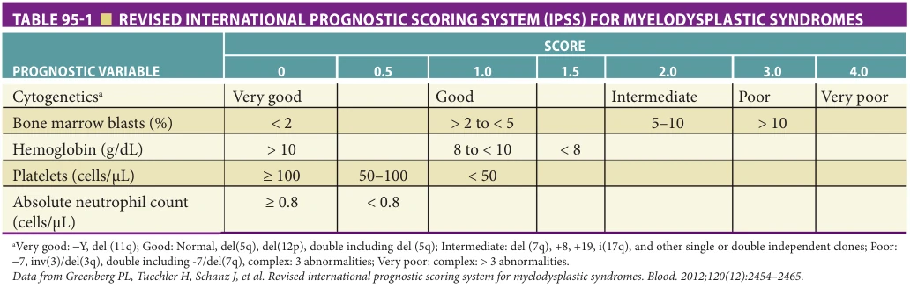

*Table 95-1, printed p. 1485.*

requiring assistance with instrumental activities of daily living (IADLs), impaired cognition, or mobility limitation were associated with higher likelihood to discontinue therapy early. Studies evaluating strategies for assessing frailty among MDS patients are presented in Table 95-3. Use of geriatric assessment and frailty screening can assist in treatment decision-making and guide supportive care.

Treatment Treatment strategies emphasize targeting higher-risk MDS and subgroups defined by specific cytogenetic abnormalities. Current treatment recommendations involve a riskadapted therapeutic approach (outlined in Table 95-4). Supportive care, aimed at controlling symptoms related to cytopenias, is indicated for all patients and is the mainstay of treatment for lower-risk patients or frail patients. Supportive care often includes red cell and platelet transfusions and antibiotics for infection. Hematopoietic growth factors such as erythropoietin are used to try to minimize transfusion requirements in responding patients. Those most likely to benefit have lower risk IPSS-R scores, serum erythropoietin level less than 500 mU/mL, low transfusion requirement, and shorter interval between diagnosis and treatment. A subcutaneously administered recombinant fusion protein targeting Smad2/3 signaling, luspaterceptaamt, decreased transfusion requirements for patients with low-/intermediate-risk MDS with ringed sideroblasts that

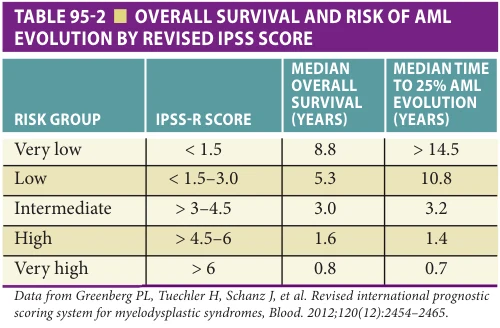

*Table 95-2, printed p. 1485.*

failed to respond to erythropoiesis stimulating agents. Many MDS patients are also at risk for iron overload due to transfusion dependence. Iron chelation therapy should be initiated for those with lower-risk MDS, ongoing transfusion dependence, and expected survival greater than 1 year.

Patients in the higher-risk IPSS categories are more likely to experience morbidity related to cytopenias and to progress to acute leukemia in a shorter time interval from diagnosis. Hypomethylating agents which inhibit DNA methyltransferases (azacitidine and decitabine) represent the mainstay of treatment for most patients. Randomized studies with azacitidine compared to placebo have shown improvements in survival, quality of life, and a longer time to progression to acute leukemia, in patients with MDS. A survival advantage exists even for those greater than 75 years. The Food and Drug Administration (FDA) also approved decitabine for the treatment of higher-risk MDS. Decitabine decreases transfusion requirements and symptoms although has not shown a definitive survival benefit in randomized trials. A challenge for older adults using hypomethylating agents is myelosuppression which often worsens for several months before response is detectable. The duration of treatment can be challenging as well with most clinical trials treating for more than 6 months for all patients and more than 12 months for responders.

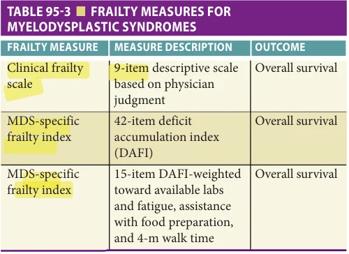

*Table 95-3, printed p. 1485.*

**[p. 1486]**

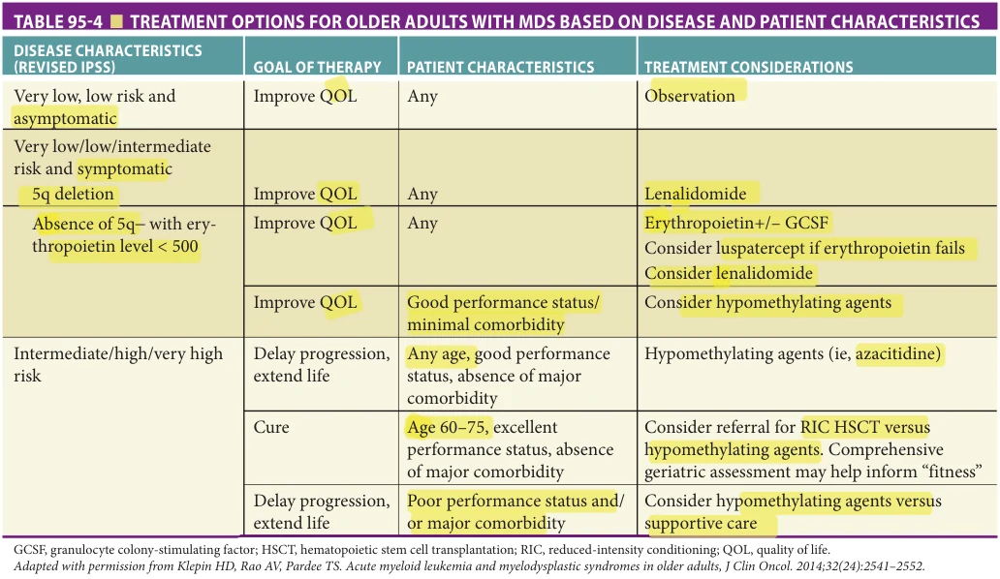

*Table 95-4, printed p. 1486.*

Patients with the 5q– syndrome, defined by a deletion of the long arm of chromosome 5 as the sole abnormality, tend to present with refractory, severe anemia, and a relatively normal platelet count. It is considered a more favorable MDS subset because a large percentage of patients do not progress to acute leukemia. Lenalidomide, an oral immunomodulatory drug, significantly decreases transfusion requirements and demonstrates reversal of cytogenetic abnormalities in patients with 5q– syndrome, which may translate into improved quality of life. The primary toxicity is myelosuppression which can result in dose reductions and dose delays. Careful attention to dosing is required with adjustments needed for mild impairment in renal function which is common among older adults. This drug is a standard of care treatment for transfusiondependent patients with 5q– syndrome and reinforces the clinical and therapeutic importance of cytogenetic evaluation in MDS. Studies suggest it also has efficacy in patients with low-risk MDS without 5q deletion and may be considered for these patients as well if they are transfusion dependent.

Higher-intensity therapy such as allogeneic stem cell transplantation, to date the only curative therapy for MDS, is generally restricted to younger adults with acceptable donors because of the high morbidity and mortality associated with therapy. However, with use of reducedintensity conditioning regimens (RIC), stem cell transplantation is considered for selected adults between ages 60 to 80 with good functional status and minimal comorbidity. Hematopoietic stem cell transplantation (HSCT) can result

in appreciable survival rates among patients with high-risk disease. However, most older adults in this context are age less than 70 with minimal data for those greater than 75. The real-world applicability of transplantation for most older adults with high-risk MDS will require refined definitions of “fitness” and collection of outcomes such as quality of life, functional independence, and health care utilization to inform treatment decisions. Evidence supports the use of geriatric assessment to identify vulnerabilities that increase morbidity associated with transplant (functional dependence and cognitive impairment) and to inform supportive care optimization to enhance resilience.

## ACUTE MYELOID LEUKEMIA

AML refers to a group of clonal hematopoietic disorders that are characterized by proliferation of immature myeloid cells in the bone marrow. Accumulation of leukemic cells impairs the normal hematopoietic function of the bone marrow, resulting in cytopenias with or without leukocytosis.

AML is a disease of older adults, with a median age at diagnosis between 68 and 72; approximately one-third are greater than or equal to 75 years. Risk factors for the development of AML include a history of preceding MDS, exposure to certain chemotherapy drugs (alkylating agents, topoisomerase 2 inhibitors, and nitrosoureas), radiation or benzene exposure, and a history of Down syndrome. The majority of diagnosed cases of AML, however, are not linked to any known risk factor.

**[p. 1487]**

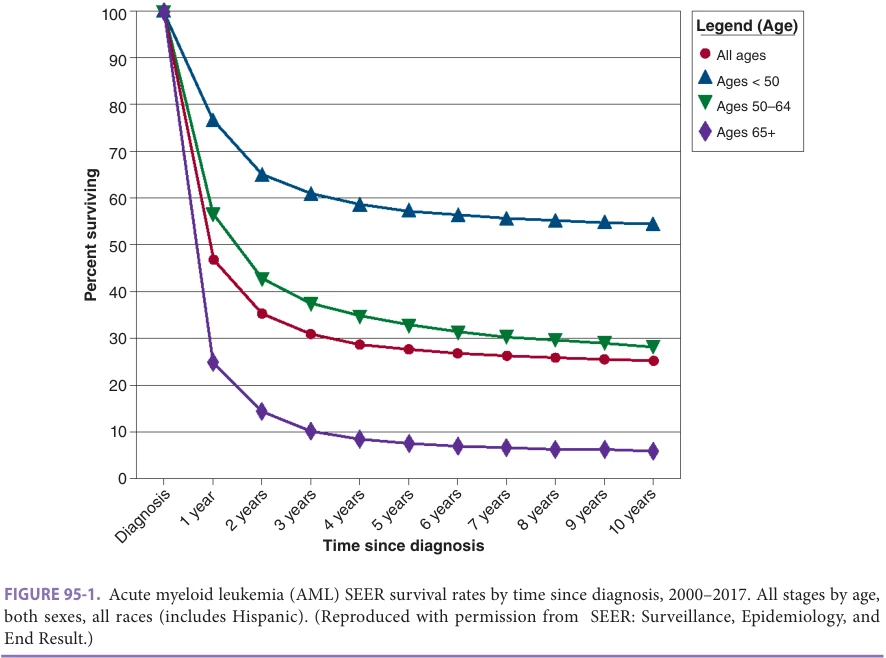

*Figure 95-1, printed p. 1487.*

The clinical signs and symptoms of AML can be varied and nonspecific. Patients usually present with evidence of bone marrow failure: anemia, thrombocytopenia, granulocytopenia. Fatigue, dyspnea, bleeding, fever, and infection are common upon presentation. Leukemic infiltration of tissues outside the bone marrow such as liver, spleen, skin, lymph nodes, and central nervous system (CNS) can produce a variety of other symptoms specific to the site of involvement. Some patients present with severe leukocytosis, which can produce symptoms of leukostasis as a result of a large blast fraction in the peripheral blood. Peripheral blood findings range from pancytopenia with or without circulating blasts cells to severe leukocytosis with circulating blasts typically with anemia and thrombocytopenia.

Diagnosis The diagnosis of AML depends primarily on detection of leukemic blasts of myeloid lineage (≥ 20%) in the bone marrow. Morphologic evaluation can be aided by immunohistochemical and flow cytometry techniques to confirm myeloid versus lymphoid origin. The WHO classification of AML incorporates morphologic, immunophenotypic, genetic, and clinical features. Identification of genetic and molecular abnormalities have highlighted the heterogeneity of AML and identified subsets associated with better or worse prognosis. For example, the core binding factor leukemias [inv 16, t(8;21), t(16;16)] and acute promyelocytic leukemia [t(15;17)] are associated with better prognosis.

The presence of mutations in FLT-3 in tumors with normal karyotype is associated with worse overall survival. Risk-adapted treatment strategies have been developed to maximize clinical outcomes and minimize toxicity based on cytogenetic classification. In addition, molecular abnormalities are increasingly identified as treatment targets.

Treatment If untreated or unresponsive to chemotherapy, AML may be rapidly fatal (median survival < 2 months). The major causes of death are overwhelming infection and hemorrhage related to the disease-associated cytopenias. AML is one of the most dramatic examples of age-related outcome disparity in oncology (Figures 95-1 and 95-2). In general, older adults (commonly defined as age ≥ 60) experience higher morbidity and mortality rates with treatment compared with those younger than 60 years. Concerns regarding the efficacy and toxicity of therapies have resulted in a large proportion of older adults in the United States receiving no therapy for the disease. However, it is clear from both clinical trial and population-based data that chemotherapy can provide a survival benefit over supportive care for many older adults.

Age-related treatment disparity is due to both disease and patient-related factors. The biology of AML differs among older adults compared to younger patients. Cytogenetic abnormalities are the most important prognostic factor in AML. As a group, older patients with

**[p. 1488]**

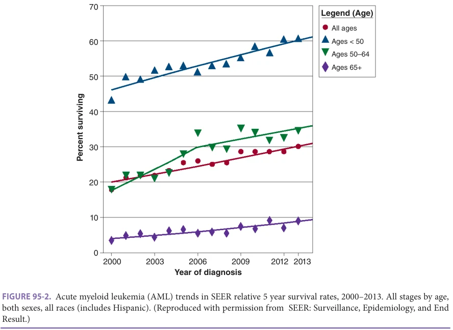

*Figure 95-2, printed p. 1488.*

AML have a higher percentage of unfavorable cytogenetic abnormalities and a lower percentage of favorable cytogenetic abnormalities compared to younger patients. Unfavorable cytogenetic abnormalities are associated with decreased rates of remission and shortened overall survival. In addition, expression of MDR1, which confers resistance to chemotherapeutic agents, is more common in older AML patients. Older patients are more likely to have a secondary AML arising from underlying MDS, which is less responsive to standard therapy. Finally, age-related changes in the bone marrow microenvironment influence outcomes for older adults. Overall, AML in older patients is more resistant to available therapies, resulting in lower remission rates and higher chance of relapse after achieving remission. In addition, patient-factors such as comorbidity and functional limitations influence treatment tolerance. While older age (particularly > 75 years) is consistently associated with worse outcomes, treatment toxicity and benefit are inadequately predicted by age alone.

For nonacute promyelocytic AML, treatment strategies include intensive therapy, less intensive therapy, or best supportive care (BSC). Randomized studies have shown consistent survival advantage for antileukemic therapy over BSC. Currently BSC alone should be considered for the minority of older adults who have pre-existing frailty, limited non-AML life expectancy, or express a preference to forgo therapy in favor of hospice after informed discussion. Treatment at specialized leukemia centers should be prioritized when possible.

In general, intensive induction chemotherapy (inclusive of anthracycline and cytarabine) is recommended for those older adults with minimal comorbidity and good functional status who also have favorable or intermediate risk disease. For those patients with FLT3 mutated AML, the multitargeted kinase inhibitor midostaurin should be added given the survival advantage seen in the pivotal trial despite the lack of inclusion of older adults. The goal of treatment is to achieve remission and proceed to tailored post-remission therapy to render long-term disease-free survivorship. Another advance for older adults is the availability of CPX-351, a dual-drug liposomal encapsulation of cytarabine and daunorubicin, which improved survival for older adults (aged 60–75) with secondary AML (ie, therapy-related, antecedent MDS), a group with historically poor outcomes.

Many older adults may not be considered “fit” for treatment with intensive chemotherapy or may prefer an alternate approach. Single-agent DNA hypomethylating agents (eg, azacitidine and decitabine) and low-dose cytarabine have both been shown to improve outcomes compared to BSC. Recently, the addition of the BCL-2 inhibitor venetoclax to azacitidine, decitabine, or low-dose cytarabine has become a standard of care option with improved remission rates and survival compared to single-agent therapy. In the registration trial, which defined “unfit” for intensive therapy by age greater than or equal to 75 or 60 to 74 years with comorbidity (ie, congestive heart failure, creatinine

**[p. 1489]**

clearance 30–45 mL/min, pulmonary disease, or other comorbidity per physician judgement), the median overall survival improved from 10 to 15 months. Side effects of cytopenias and infections were more common on the combination arm.

Patients who achieve remission should be evaluated for post-remission therapy in an attempt to prevent or delay relapse. Optimal post-remission therapy in older patients remains poorly defined. Oral azacitidine maintenance provides a survival advantage for patients who are not candidates for allogeneic transplantation. An increasing number of older adults who achieve remission are being referred for reduced-intensity allogeneic transplantation in an effort to improve longer-term disease-free survival and cure rates.

Geriatric assessment can be feasibly performed in the setting of AML therapy and it adds information to standard clinical assessment. For example, in a prospective study of adults age greater than or equal to 60 who received intensive therapy, pretreatment geriatric assessment detected significant impairments: cognitive impairment, 24%; depression, 26%; distress, 50%; ADL impairment, 34%; impaired physical performance, 31%; and comorbidity, 40%. Importantly, most patients on study were impaired in one (92.6%) or more (63%) measured characteristics. Impaired cognition (modified Mini Mental Status Examination < 77) and physical performance (short physical performance battery < 9) were independently associated with worse survival. Geriatric assessment measures including dependence in ADLs and higher comorbidity burden have also been predictive of survival among older adults receiving lesser intensive therapy. Similarly, a role for geriatric assessment is emerging to identify older adults who may tolerate allogenic transplantation as post-remission therapy. Understanding specific patient vulnerabilities is imperative to help to predict tolerance to standard therapies and identify targets for intervention to improve treatment tolerance.

Treatment recommendations differ for patients with acute promyelocytic leukemia (APL). APL is characterized by a translocation between chromosomes 15 and 17 leading to the fusion of the promyelocytic leukemia (PML) gene with the retinoic acid receptor α (RARα) gene, resulting in disruption of normal cell differentiation. While less common among older adults, this disease has a very high response and cure rate with current therapies that include

use of all-trans retinoic acid (ATRA), which overcomes the differentiation block. A unique clinical feature of APL is presentation with bleeding secondary to disseminated intravascular coagulation and requires emergent treatment. Hemorrhage is a frequent cause of early mortality, particularly if untreated. When suspected, treatment with ATRA should begin immediately. Curative treatment includes induction with ATRA with either arsenic trioxide (ATO) for patients with WBC less than or equal to 10,000/μL, or plus an anthracycline for patients with WBC greater than 10,000/μL. Induction therapy is followed by consolidation with ATRA plus ATO-based therapy, with remission and disease-free survival rates of approximately 90%. In addition, relapsed patients may respond to ATO, with a high proportion achieving a second remission. This subtype of AML should be treated aggressively in older adults given the high probability of response. Effective non-chemotherapy regimens extend therapeutic options to the extremes of age and for vulnerable and frail older adults.

## CHRONIC MYELOGENOUS LEUKEMIA

Chronic myelogenous leukemia (CML) is a myeloproliferative disorder characterized by excess production of mature granulocytes that eventually progresses to a clinical picture similar to acute leukemia with an overgrowth of immature cells (blast crisis). CML is associated with the fusion of two genes: BCR (on chromosome 22) and ALB1 (on chromosome 9). It accounts for a little over 10% of all leukemias. The incidence increases with age, and the average age at diagnosis is approximately 65 years.

Diagnosis is suspected by the demonstration of granulocytosis in the peripheral blood with a predominance of segmented neutrophils and myelocytes, increased basophils and eosinophils, and increased bone marrow cellularity. The presence of the Philadelphia chromosome t(9;22) and/or its products (BCR/ABL fusion mRNA, Bcr/Abl protein) are required to confirm the diagnosis. Diagnosis can be made on peripheral blood using PCR or fluorescent in situ hybridization (FISH) techniques. Bone marrow biopsy is still required for complete cytogenetic evaluation.

The disease characteristically proceeds through three phases: chronic (present in ~ 85% at diagnosis), accelerated, and terminal (blastic) phase (Table 95-5). The length

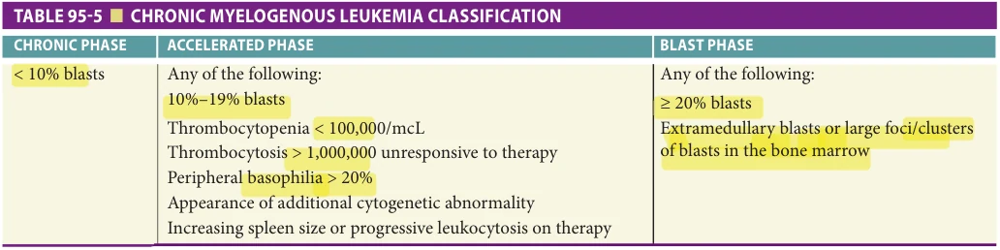

*Table 95-5, printed p. 1489.*

**[p. 1490]**

of the chronic phase is highly variable. In the chronic phase, the disease is easily controlled without aggressive therapy. Many patients are asymptomatic (diagnosis prompted by leukocytosis), common symptoms include fatigue, weight loss, and abdominal fullness or pain related to splenomegaly. The accelerated phase begins with gradual increases in white cells, platelets, and spleen size. Initially good maturation persists, but eventually more blasts are seen in the peripheral blood. The terminal phase of the disease is indistinguishable from acute leukemia. The blasts have myeloid surface markers in 85% of the patients and lymphoid markers in the remaining 15%.

Treatment for CML has changed dramatically in the past decades, altering the natural history of this disease. Imatinib mesylate (Gleevec; STI-571), a targeted tyrosine kinase inhibitor (TKI), designed specifically for the treatment of CML (in oral formulation), proved to have significant activity in the blast phase and accelerated phase of CML. In chronic phase CML, imatinib mesylate yielded marked improvements in clinical and cytogenetic responses, rates of disease progression, and treatmentrelated toxicity compared to previously used IFN-α plus lowdose ara-C in a randomized clinical trial. Based on these results, imatinib mesylate replaced interferon regimens as the standard of care for patients with chronic phase CML. Imatinib is very well tolerated, which is particularly relevant for the older adult population. Responses are durable with many patients maintaining response now after well over a decade of therapy. More potent, second-generation, tyrosine kinase inhibitors (ie, dasatinib, nilotinib, bosutinib) produce more rapid and better responses than imatinib in first-line treatment although no difference in overall survival has been demonstrated to date. These drugs are also active in patients who have progressed on imatinib providing sequential treatment options prior to consideration of cytotoxic therapy. Adherence to daily administration is critical for successful treatment of CML with careful monitoring of response to determine when other therapies should be considered. PCR techniques provide a highly sensitive and reliable method to monitor response to treatments. Long-term follow-up data from imatinib clinical trials show that cytogenetic and molecular responses are durable and there are low rates of cumulative or late toxic effects. Choice if first line therapy for CML for older adults is informed by concurrent comorbid conditions such as heart failure, risk of cardiotoxicity, QT prolongation, and thrombosis. Imatinib has the longest term safety data and remains an appealing standard for many older adults.

Allogeneic stem cell transplantation in the chronic phase remains a consideration for curative treatment for younger patients, primarily those with suboptimal response to TKIs. It has minimal role in older patients because of the morbidity and mortality of this treatment and availability of therapies to control disease. TKIs should be the initial treatment for both the accelerated and blastic phases of

CML if not already used during the chronic phase of the disease although responses are often short lived. Treatment of the blastic transformation (after TKI therapy) depends on the cell origin of the blasts. Myeloid blastic states respond poorly to standard AML therapies, and no standard therapy is available. Lymphoid blastic states can be controlled for 6 to 12 months, with standard combination regimens as used for de novo acute lymphoblastic leukemia.

## CHRONIC LYMPHOCYTIC LEUKEMIA

Chronic lymphocytic leukemia (CLL) is the most common leukemia in the Western Hemisphere and may be commonly encountered in a geriatric practice. CLL is a disorder of clonal proliferation of mature lymphoid cells in the peripheral blood, bone marrow, and lymphoid organs. CLL occurs predominantly in older adults, with median age at diagnosis of approximately 70. About 21,250 new cases were estimated in the United States for 2021 by the American Cancer Society. This may be an underestimate because many patients are asymptomatic for years. There is no racial difference in the United States, and a slight male predominance. Current diagnostic studies, especially immunophenotyping, allow for differentiation of the chronic lymphoid malignancies: B-cell CLL, T-cell CLL, prolymphocytic, circulating non-Hodgkin lymphomas, and hairy cell leukemia.

B-Cell CLL B-cell CLL accounts for over 95% of all CLL. Approximately 25% of such patients are identified with asymptomatic lymphocytosis during evaluation for other medical problems. Symptomatic patients may present with weight loss, fatigue, recurrent infections, fevers, or pain associated with hepatosplenomegaly or bulky lymphadenopathy. In most patients, the disease has a gradual progression spanning several years and the extent of the lymphoid burden at diagnosis correlates well with length of preexisting disease. In some patients, the disease has a more aggressive course, and progression to advanced clinical stages may occur within a few months of diagnosis. Identification of molecular and protein markers are beginning to explain the heterogenous natural history observed in this disease.

The diagnosis of CLL requires presence of monoclonal B lymphocytes greater than or equal to 5 × 109/L with a specific immunophenotyping pattern (coexpression of CD5 and CD20/23 with weak expression of surface immunoglobulin) by flow cytometry. Diagnosis and staging of CLL can usually be established by history, physical examination (careful evaluation for lymphadenopathy and splenomegaly), CBC with review of the blood smear, and immunophenotyping of the peripheral blood using flow cytometry. Classic findings on the peripheral smear include increased mature-appearing lymphocytes and smudge cells (peripheral smear artifact reflecting the fragility of the B-CLL cells to mechanical manipulation). Bone marrow studies are usually not needed for diagnosis.

**[p. 1491]**

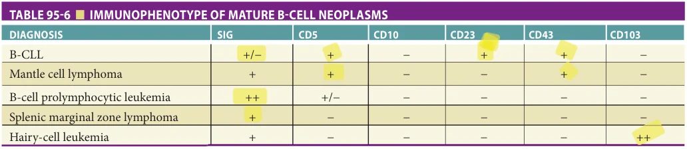

*Table 95-6, printed p. 1491.*

The differential diagnosis for B-CLL includes other mature B-lymphoproliferative disorders such as mantle cell lymphoma, prolymphocytic leukemia, hairy cell leukemia, and splenic lymphoma with villous lymphocytes. The clinical course and treatments differ widely for these disorders, particularly mantle cell lymphoma. Evaluation of clinical presentation, morphology, and immunophenotype is necessary to arrive at the correct diagnosis (Table 95-6). Inclusion of flow cytometric evaluation for cyclin D1 or FISH analysis for t(11:14) is essential to rule out mantle cell lymphoma.

The original Rai classification (Table 95-7) implied an orderly progression from lymphocytosis alone to the successive development of adenopathy, organomegaly, and, eventually, anemia and thrombocytopenia. The prognostic importance of these variables has been confirmed although survival patterns differ primarily by the low-, intermediate-, and high-risk categories. Specific cytogenetic abnormalities correlate with prognosis. A 13q deletion is associated with a better prognosis, compared to deletions of 11q and 17p, which confer a worse prognosis.

Therapy for B-cell CLL is not considered curative and therefore has been reserved for patients who are symptomatic or who progress to develop cytopenias. Leukocytosis alone (stage 0) does not require therapy, because the prognosis of these patients is excellent in the absence of the other poor prognostic factors. The rate of increase of leukocytosis is a better indicator of disease activity than the absolute count. Leukostasis, associated with high circulating blast counts in acute leukemias, does not generally

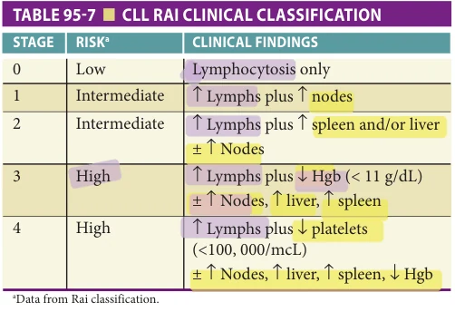

*Table 95-7, printed p. 1491.*

occur in this condition because most of the lymphocytes are mature, small cells.

Treatment with systemic therapy or local radiation can be used to control symptoms in patients with stage I or II disease; however, symptomatic improvement does not appear to prolong survival. In contrast, patients with stage III or IV CLL have an improved survival with treatment.

Treatment options for older adults have expanded significantly in the past several years. In general, initial systemic treatment options are determined by disease characteristics (del 17p, TP53 mutation, and IGVH mutation status) as well as functional status and comorbid conditions.

Most regimens utilize targeted therapies as a single agent or in combination. Standard first-line regimens for older adults include use of Bruton tyrosine kinase (BTK) inhibitors (ie, ibrutinib or acalabrutinib) as a single agent or in combination with monoclonal antibodies (ie, rituximab or obinutuzumab) or the BCL2 inhibitor venetoclax as single agent or in combination with obinutuzumab. Chemoimmunotherapy regimens may be considered in some settings for fit older adults with standard risk disease by those willing to undergo more intensive therapy for the potential of longer treatment-free intervals compared to BTK inhibitors, which are given as continuous oral therapy.

Clinical trials in older adult populations have shown that ibrutinib improves outcomes compared to single-agent chlorambucil and chemoimmunotherapy using bendamustine plus rituximab. Overall, the totality of the evidence supports use of single-agent BTK inhibitor for many older adults as a first-line therapy. While well tolerated, there is an increased risk of bleeding, and caution is advised for patients who require anticoagulation. Cardiovascular toxicities are also a known risk including arrhythmias such as atrial fibrillation, heart failure, and hypertension. Frequently, presence of comorbid conditions and associated medications may determine choice of initial treatment regimen. For frail patients, or those with multiple chronic conditions, use of monoclonal antibody therapy is a reasonable choice. For example, a phase 3 randomized trial compared the efficacy of adding obinutuzumab (a humanized glycoengineered type 2 antibody to CD20) to chlorambucil versus rituximab specifically in patients with comorbidity. This study population had a median age of 73 and required a meaningful comorbidity burden (cumulative illness rating scale > 6) for eligibility. The median progression-free

**[p. 1492]**

survival was improved from 11.1 months to 26.7 months when comparing the anti-CD20 combination therapy arms with chlorambucil alone. Treatment with the obinutuzumab combination resulted in improved overall survival compared to chemotherapy alone and was superior to Rituxan combination therapy for progression-free survival and response. This study was a landmark trial by both demonstrating efficacy of a novel therapeutic combination but also doing so in an older patient population with comorbidity.

Autoimmune manifestations of CLL are common and include development of antibodies to platelets and red cells (IgG and C3 on direct antiglobulin test) and to erythroid precursors, resulting in red cell aplasia. For anemic patients, reticulocyte counts and direct Coombs testing should be obtained to help differentiate hemolysis from decreased bone marrow production. All of the autoimmune complications are indications for therapy with steroids or intravenous gamma globulin for refractory cases of red cell aplasia.

Recurrent infections are the most common complications leading to death in CLL. Patients with stage 0 CLL have minimal increased risk of infection. In anticipation of gradual deterioration in immune response, however, pneumococcal vaccine and boosters should be administered while the potential for response is still intact. All other patients have higher risks for infection. As the disease advances clinically, immune function becomes progressively compromised, with increased susceptibility to viral, bacterial, and fungal infection. The subset of patients presenting with recurrent bacterial infections may benefit from administration of intravenous gamma globulin.

## NON-HODGKIN AND HODGKIN LYMPHOMAS

Introduction The lymphoid malignancies comprise over 100 heterogeneous and complex entities as identified in the 2016 World Health Organization (WHO) classification of lymphoid malignancies (Table 95-8). Non-Hodgkin lymphomas (NHLs) are the most common lymphoid malignancy, representing a heterogeneous group of lymphoproliferative disorders that originate from cells of the immune system, including B lymphocytes, T lymphocytes, or natural killer (NK) cells. In the United States, the B-cell lymphomas predominate, making up 80% to 85% of lymphoma diagnoses, with T-cell histologies representing 15% to 20% of the balance; NK-cell lymphomas are rare at less than 1%. Broadly speaking, lymphomas can be characterized as either indolent, behaving with median survivals measured in up to decades, or aggressive, with life-threatening consequences in weeks to months if untreated.

Indolent lymphomas are more often identified incidentally during routine physical examination or laboratory evaluation, particularly with increased reliance on routine blood testing and imaging in the modern era. Often, these

entities present with slowly progressive lymphadenopathy, splenomegaly, and potential cytopenias from bone marrow involvement. Examples include the prototypic follicular lymphoma (FL), marginal zone lymphomas, and small lymphocytic lymphoma (SLL).

In contrast, aggressive lymphomas are more likely to present with acute or subacute symptoms including a rapidly growing mass, systemic B symptoms (see next paragraph), elevated serum lactate dehydrogenase, hypercalcemia, and hyperuricemia. Examples include diffuse large B-cell lymphoma (DLBCL), peripheral T-cell lymphomas (PTCL), and Burkitt lymphoma (BL).

Clinical characteristics of lymphomas include “B” symptoms, defined as fever greater than 38°C, unexplained weight loss greater than 10% of body weight over the past 6 months, and drenching night sweats. Up to 40% of patients with NHL may have B symptoms; more commonly evident in aggressive or biologically transformed disease (approaching 50%) than in low-grade lymphomas (< 25%). Less common presenting features include skin rash, pruritus, fatigue, fever of unknown origin, effusions, and hypersensitivity to insect bites. Extranodal presentations occur in 10% to 35% of patients at initial diagnosis, with extranodal sites developing in half of patients over the course of their disease. As lymphocytes naturally transit through blood and can be found in any tissue compartment, lymphomas have been reported in essentially all conceivable sites.

Epidemiology In 2021, an estimated 90,390 individuals will be diagnosed with lymphoma in the United States, 81,560 NHL and 8,830 Hodgkin lymphoma (HL), with 21,680 individuals dying from a lymphoid malignancy. To put this in perspective, NHL and HL together account for 4.3% and 0.5% of all new cancer diagnoses, and NHL is the eighth leading cause of cancer death in the United States.

With the aging of the population, the United States is projected to witness increases in incidence of NHL by 67% and HL by 70% in older adults by the year 2030. This fact is evidenced as well by the increasing median age of individuals with NHL over the last two decades. Consequently, the interplay between aging biology, comorbidity, and competing risks is ever more prevalent for the treating oncologist.

## Non-Hodgkin Lymphoma

World health organization classification system Although lymphoma classification has remained a complicated endeavor, iterative changes in the classification systems over the past 30 years have increasingly integrated cell of origin (B, T, NK), morphology, immunophenotype, and genetic and clinical features to define disease. The recent WHO updates have more broadly integrated new diseases and subtypes identified in the past, affirmed the importance of detecting viral entities in some diagnoses (eg, EBV, HHV8,

**[p. 1493]**

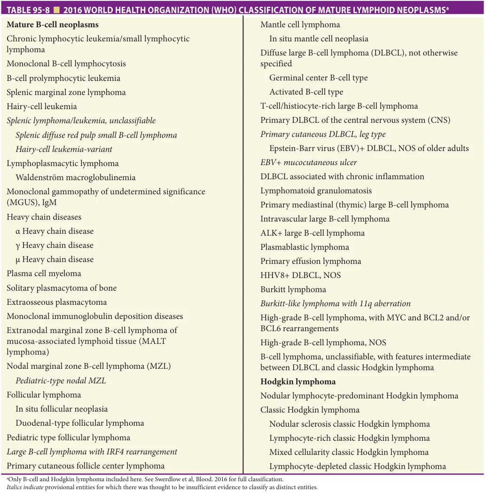

*Table 95-8, printed p. 1493.*

and HTLV1), as well as increased the use of genetic features in diagnosis, such as cytogenetics and FISH in defining specific NHL entities.

Etiology Despite an increasing understanding of biology, the cause of most lymphomas remains unknown. Mutational events inherent in the normal cell division process of lymphocytes are expected to result in a continuous random event rate. Increased incidences are associated with a personal family history of lymphoma, past radiation or chemotherapy treatment, immunosuppressive agents, smoking, and obesity. Environmental exposures to agricultural pesticides, hair dyes (prior to

the 1980s), agent orange, and other dioxins accounted for an increased incidence of lymphoma in the central United States. Dysregulation of the immune system may precede a lymphoma diagnosis, with increased risk associated with autoimmune diseases (eg, rheumatoid arthritis, lupus, Sjögren syndrome, Hashimoto thyroiditis), solid organ transplantation, chronic immunosuppression, and celiac sprue. A number of infections have also been implicated in the pathogenesis of lymphomas, either as a consequence of immune dysregulation or chronic antigenic drive. Examples include human immunodeficiency virus (HIV), human T lymphoma atrophic virus

**[p. 1494]**

type I (HTLV-I), Epstein-Barr virus (EBV), hepatitis C, hepatitis B virus, Helicobacter pylori, and human herpesvirus 8 (HHV8).

EBV in Lymphoma and Older Adults In the most recent WHO classification iteration of 2016, a provisional entity termed EBV (+) DLBCL, NOS was specified. In previous versions (2008) this had been EBV+ DLBCL of older adults, but has since been reframed to reflect younger patients who may experience this diagnosis, which consists of an EBV-positive monoclonal large B-cell proliferation with no known history of immunodeficiency. Most patients have an activated B-cell (ABC) phenotype, strong NF-κβ activation, increased extranodal distribution at diagnosis, and inferior survival. Optimal treatment strategies are not defined. EBV has also been implicated in the pathogenesis and outcome of HL, with a negative impact on outcome in advanced age as distinct from younger patients.

Genetic Factors—Translocations NHLs are frequently characterized by balanced translocations, resulting in functional fusions that confer a survival advantage for the affected cell population (Table 95-9). Such translocations often involve the immunoglobulin heavy chain region on chromosome 14, leading to constitutive activation of the translocated partner and consequently to increased signaling for the translocated gene, such as the antiapoptotic pathways (BCL2), cell cycle proteins (CCND1), and cellular proliferation (cMYC).

Evaluation and staging Evaluation of a patient with suspected lymphoma includes a careful history and physical examination, with close attention to lymphatic sites including Waldeyer ring and the spleen. Extranodal sites of involvement to consider on examination include the skin, CNS abnormalities, testes, breasts, and bone. Standard

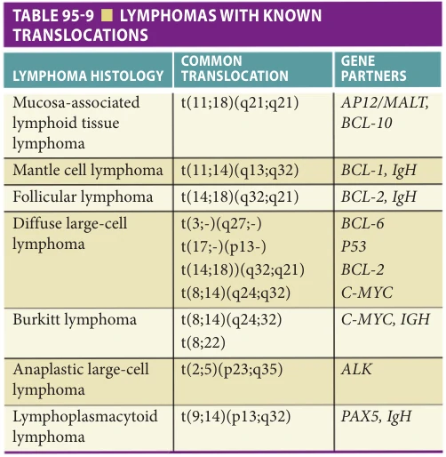

*Table 95-9, printed p. 1494.*

blood work includes a CBC, comprehensive metabolic panel, calcium, uric acid, lactate dehydrogenase (LDH), serum protein electrophoresis, β2 microglobulin (indolent lymphomas), and serologic testing for HIV and hepatitis B and C.

A biopsy is required for diagnosis and classification of NHL and HL. Generally, an excisional or incisional core lymph node biopsy is preferred given the requirements for increasingly complex pathologic diagnostic evaluations. Fine-needle aspiration is often helpful as an initial discriminator between reactive adenopathy, carcinoma, and lymphoma but is not adequate for identifying lymphoma subtype. Studies needed include morphologic assessment, immunohistochemical (IHC) staining, flow cytometry, FISH testing, cytogenetics, polymerase chain reaction (PCR) studies for clonality (immunoglobulin gene rearrangement studies for B-cell clonality, T-cell receptor gene rearrangements for T-cell lymphomas), and increasingly gene expression profiling (GEP). Functional imaging (eg, positron emission tomography [PET] scan) may direct the site of biopsy when discordant fluorodeoxyglucose (FDG) avidity is present, with the most metabolically active lesions generally representing the most aggressive biology.

Ann Arbor Staging System Originally developed in 1974 for HL, the Ann Arbor staging system was the equivalent of the TNM (tumor-lymph node-metastasis) staging system for lymphoid malignancies. This staging system defines disease location and extent and prognostic information, permitting cross-study comparisons, and establishes baseline disease extent to allow for response comparison. Modified in 1988, the Cotswold classification formally included CT scans and designations for bulky disease (X), dividing HL patients in four stages, with A and B subclassifications based on the absence or presence of B symptoms. Universally accepted response criteria in NHL and HL were published in 1999 by the NCI Working Group and revised in 2007 by the International Working Group (IWG) to incorporate PET and bone marrow immunohistochemistry (IHC)/flow in response assessment. This has formed the foundation for staging and response evaluations for NHL and HL over the last decades, acknowledging certain histologies have warranted their own staging and response assessment given varied clinical course (eg, CLL/SLL, Waldenström macroglobulinemia, cutaneous T-cell lymphoma).

Of note, in contrast to many solid tumors, it is important to realize stage alone is often a poor arbiter of outcome in NHL. Clinical and biologic prognostic models, generally including stage as one of the risk factors, are better predictors of outcome. For instance, a substantial number of DLBCL patients with advanced-stage III/IV disease will be cured, and for indolent lymphoma patients, stage IV disease is the norm, but survival is measured in decades.

Updated Lugano Classification 2015 The Lugano classification was published in 2014 in an effort to modernize

**[p. 1495]**

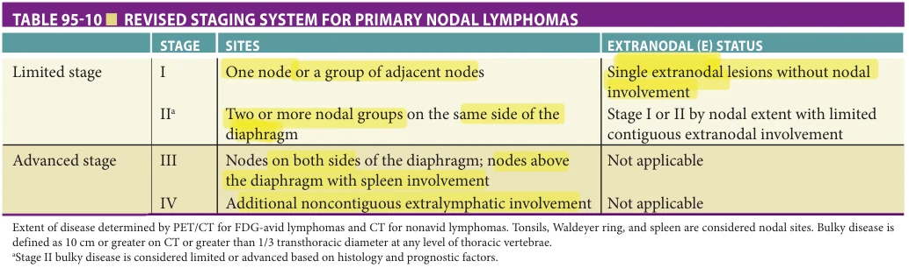

*Table 95-10, printed p. 1495.*

recommendations for evaluation, staging, and response assessment for patients with HL and NHL (Table 95-10). The most salient changes included formal integration of PET scanning into initial staging for FDG-avid lymphomas, modification of the Ann Arbor terminology eliminating A/B qualifiers except for HL, and departure from routine bone marrow biopsy in DLBCL and HL based on functional imaging. FDG-PET utilizing the Deauville 5-point scale was integrated into response assessment. The Lugano revision of the staging criteria has suggested that bone marrow biopsy may not be necessary in most DLBCL or any HL if functional imaging fails to identify osseous lesions. One must acknowledge, however, that bone marrow involvement with indolent lymphoma is generally not evident on FDG-PET. A bone marrow biopsy should be performed if this knowledge alters clinical management (eg, identification of transformed biology).

Clinical Risk Prognostic Models

Impact of age across all prognostic models. The most frequently utilized model is the international prognostic index (IPI) that identifies five clinical factors as prognostic variables for progression-free survival (PFS) and OS in DLBCL (Table 95-11). Importantly, chronologic age remains an integral part of many lymphoma clinical risk predictors, including the IPI, the follicular lymphoma IPI (FLIPI), the mantle cell IPI (MIPI), and the HL international prognostic score (IPS). However, the populations from which these prognostic indices were developed may not have uniformly included older patients. For example, the IPS included patients up to 65 years old, with ages 55 to 65 representing only 9% of the study population. It is well appreciated that age is a continuous variable and that a more clinically relevant cutoff above which patients are likely to require treatment modifications exists between 70 and 75 years in the current era.

From a clinical decision-making standpoint, distinctions in older populations among those age 65 to 74 years, 75 to 84 years, and 85 years or older are somewhat arbitrary but have clinical utility in minimizing heterogeneity when devising treatment guidelines. Ultimately, however, the variable nature of the aging process mandates thinking beyond chronologic age.

Biological Risk Factors In the modern era, with targeted therapies an increased reality, biomarkers to guide therapeutic decision making will be essential. The Ki67 proliferative index, a measure of cellular division, has been demonstrated to have prognostic impact in DLBCL and MCL, and in predicting increased risk of indolent NHL transformation.

In DLBCL, the putative cell of origin as identified on GEP is prognostic, with germinal center-derived DLBCL enjoying a better outcome than non-GC (ABC phenotype). The concurrent presence of the antiapoptotic t(14;18) BCL2 translocation and a cMYC t(8;14) cellular proliferation signal (or less frequently BCL6 translocations) has been termed a “double hit” biology (DH). Roughly 10% of patients with DLBCL will have DH biology, a finding associated with very aggressive disease, older age, higher CNS risk, and no current standard of care recommendation. A larger population (~1/3) of DLBCL patients may have protein overexpression of BCL and MYC, termed double expressers, and have increased disease risk as well, but to a more variable degree.

CNS Risk Assessment CNS evaluation with lumbar puncture and analysis of cerebrospinal fluid (CSF) is important in patients with a clinical suspicion of nervous system involvement or those at high risk for CNS involvement at presentation. CSF investigation should include cell count, glucose, protein, cytology, as well as the more sensitive flow cytometry. This is generally a consideration in aggressive lymphomas and high-grade disease, with involvement rare in mantle cell or indolent lymphomas. Increased risk of CNS involvement historically has been associated with higher clinical risk factors, anatomic sites of involvement such as the testes, breast, multiple extranodal sites, and bone marrow.

Recently, a predictive model for DLBCL risk of CNS relapse was reported. This validated model comprises six factors (age, PS, LDH, stage, extranodal sites, and kidney/ adrenal involvement) with stratification of CNS relapse based on number of risk factors. Although the optimal method (intrathecal or high-dose methotrexate) and the actual magnitude of risk reduction in CNS prophylaxis remain debated, this predictive model is useful when considering the pros and cons in older adults.

**[p. 1496]**

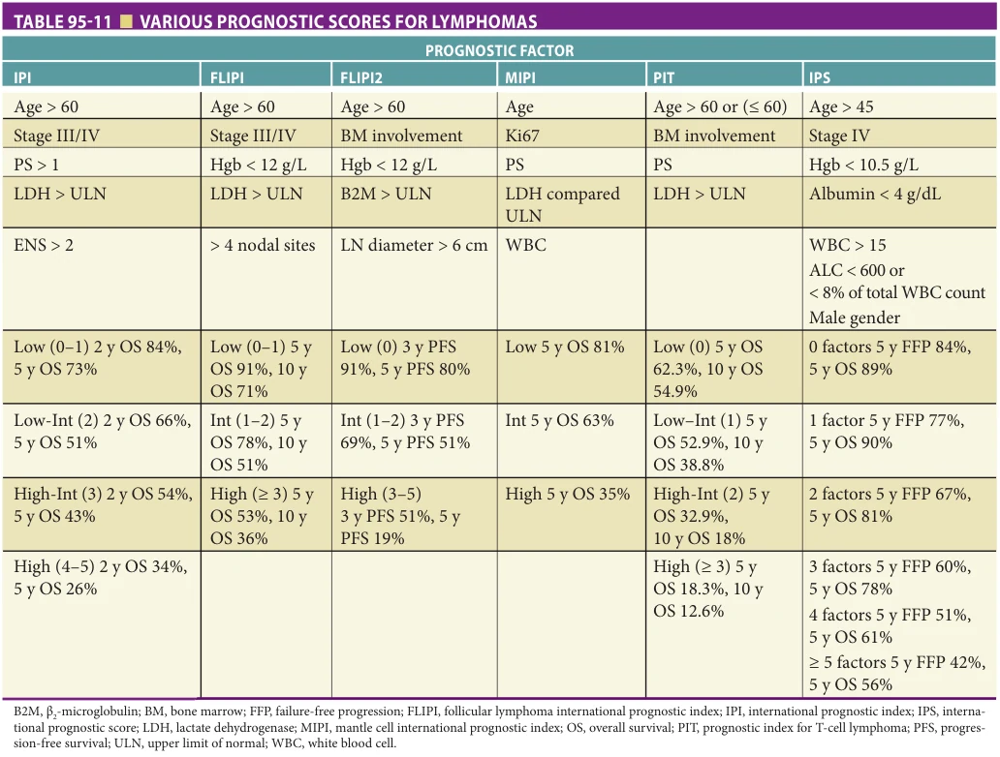

*Table 95-11, printed p. 1496.*

Treatment In the older patient, establishing clinical and disease-associated risk predictors is an essential part of the assessment, but this evaluation still represents an incomplete clinical picture for the treating oncologist. With increasing age, the patient may have aging-associated risk factors that may be equally or more profound than the aforementioned lymphoma factors and ultimately define the range of therapeutic options. The oncogeriatric factors of life expectancy, comorbidity, frailty, and geriatric syndromes independently predict treatment-associated morbidity and mortality, and consequently become essential considerations when deriving a treatment strategy. Ultimately, these clinical concerns are most weighty when there is an aggressive histology that is potentially curable, but therapy is associated with very real risks. In recent years, several studies have identified frailty as a predictor of chemotherapy tolerance and survival. Geriatric assessments provide physicians with a tool to individualize decision-making based on factors beyond age and documented comorbidity. Further, there are modified chemotherapy regimens geared toward older or more frail patients, with the goal of reducing toxicity while optimizing survival. One example is a reduced dose version of the common combination of cyclophosphamide,

doxorubicin hydrochloride (hydroxydaunorubicin), vincristine sulfate (Oncovin), and prednisone, or CHOP.

Comorbidity and Frailty Assessments Comorbidity is prevalent in older patients, with 60% to 70% of NHL patients older than 60 years possessing some comorbidity. Frequently used measures include the Charlson comorbidity score and the Cumulative Illness Rating Scale for Geriatrics, both of which capture information distinct from lymphomaspecific prognostic indexes and are independently associated with risk. The presence of comorbidity in NHL and HL patients has been associated with increased treatmentrelated mortality (TRM), treatment toxicity, lower dose intensity, and higher treatment failure.

Frailty is a distinct syndrome from comorbidity and has its own impact on outcomes (see Chapter 42). Frailty is often defined practically, with suggested criteria including age greater than 80 or 85, dependence in ADL, exhaustion, slow gait speed, decreased hand grip, unintentional weight loss, and decreased physical activity. Frail patients have shorter life expectancies than nonfrail patients and have a higher likelihood of toxicity with interventions such as chemotherapy. Thus, frailty identifies a group of patients at greatest risk given lack of functional reserves, and palliative

**[p. 1497]**

chemotherapy approaches are generally recommended in this setting.

Comprehensive Geriatric Assessment Performance status and clinical judgment alone are insufficient to identify at-risk older individuals and may misclassify a significant percent of patients, exposing them to harm or denying curative intent. In this vein, the National Comprehensive Cancer Network (NCCN), American Society of Clinical Oncology (ASCO), and International Society of Geriatric Oncology (SIOG) guidelines recommend performance of comprehensive geriatric assessment (CGA) in older patients. Instructively, Tucci and colleagues demonstrated that a CGA applied in 173 DLBCL patients older than 69 years segregated fit (46%), unfit (16%), and frail (38%) patients with significantly different outcomes (OS 84% fit vs 47% nonfit, p < .0001) and a lack of clinical benefit from curative intent therapy in the frail category.

The Fondazione Italiana Linfomi (FIL) integrated a CGA tool into a trial treatment paradigm that stratified 334 DLBCL patients older than 65 years as either fit (68%) or frail (29%). Fit patients were randomized on a trial between RCHOP and R-mini-CEOP and had excellent and equivalent outcomes, while frail patients were treated per investigator choice. Frail patients were more frequently older (median age 78, range 65–93), with advanced stage (62%) and high risk, and reported a 5-year estimated OS of 28% despite polychemotherapy administration in three-fourths of patients. TRM was 18% in this group compared with only 8% in the fit group. Most recently, this group completed a prospective project on older patients with DLBCL using a simplified version of their original geriatric assessment. The simplified assessment included age greater than or equal to 80, Cumulative Illness Rating Scale for Geriatrics comorbidity assessment, ADLs and IADLs. They identified 55% fit, 28% unfit, and 18% frail patients. Future prospective trials will need to build upon this work to help optimize treatment decisions for older patients with DLBCL.

Pharmacologic Considerations for Older NHL Patients

Neuropathic agents: Vinca alkaloids (vincristine, vinblastine), cisplatin,

oxaliplatin, brentuximab vedotin, bortezomib. A number of approved agents for the treatment of NHL are associated with peripheral and autonomic neuropathy. In the older individual, although grade 3 neuropathy generally provokes drug modification or cessation, grade 2 neuropathy may interfere with ADL/IADLs, increase the risk of falls, and impact quality -of-life (QOL). Dose reductions and omissions need to be balanced against the potential benefit in a given scenario.

Anthracycline. Doxorubicin is one of the most active and essential agents in the treatment of aggressive histologies such as DLBCL and HL. The anthracyclines are associated with a defined risk of anthracycline-induced cardiomyopathy that is related to cumulative dose (although rarely idiopathic), with risk increasing significantly with doxorubicin equivalents in excess of 400 mg/m2 lifetime. Hypertension is an established risk factor. Infusional doxorubicin

and liposomal doxorubicin may have an increased safety margin, and a variety of non-anthracycline regimens exist when there is an absolute contraindication that may still preserve a curative intent.

Small Molecule Inhibitors Ibrutinib is a small molecule inhibitor of Bruton tyrosine kinase (BTK), FDA approved for the treatment of CLL and MCL. With longer follow-up, propensity toward bleeding has been identified with consideration for risk-versus-benefit in patients requiring antiplatelet or anticoagulation therapies. Concurrent warfarin is generally contraindicated given interactions with CYP3A inhibitors and inducers. New-onset atrial fibrillation has also been occasionally reported (< 5%).

Idelalisib is a small molecule inhibitor of PI3 kinase-δ that is FDA approved for patients with CLL/SLL and refractory FL. This drug has been associated with fatal and/or serious hepatotoxicity, severe diarrhea or colitis, pneumonitis, and intestinal perforation. Hepatic abnormalities typically resolve with interruption of drug dosing; patients can frequently resume therapy.

## Diffuse Large B-Cell Lymphoma

Introduction Diffuse large B-cell lymphoma (DLBCL) is the most common subtype of NHL both in the United States and globally, representing roughly 30% of all new diagnosis. With a median age at diagnosis of greater than or equal to 65 years, DLBCL is in many ways a disease of older individuals. With the aging population, there is a pressing need to understand age-related host and disease factors, how they impact therapeutic choices and outcomes, and to develop specific strategies to address these factors.

Treatment DLBCL is an aggressive entity with the natural history characterized by rapid progression and death within weeks to months in the absence of treatment. Based on randomized controlled trials (RCTs), frontline therapy with anthracycline-based chemoimmunotherapy for DLBCL (eg, rituximab-CHOP) results in overall survival rates of 60% to 70% and represents the best chance for cure, as the majority of patients with relapsed or refractory disease will die of lymphoma. However, older patients frequently have comorbidities and functional impairment limiting feasibility of standard therapy. The initial decision regarding the feasibility of anthracycline-based chemotherapy is consequently paramount and must integrate assessments of organ function, clinical judgment, comorbidity, and performance status as previously discussed. Chemotherapy may extend survival, even among patients where curative intent cannot be achieved.

Early-stage DLBCL (stage I/II without bulk) may be treated with fewer cycles of chemotherapy followed by radiation. Whether or not to include radiation consolidation may be informed by disease location, associated RT toxicity, comorbidity, and life expectancy. Radiation should be considered for definitive therapy in patients who cannot tolerate chemotherapy. The standard of care for initial

**[p. 1498]**

treatment of DLBCL in both older and younger patients is chemoimmunotherapy comprised of rituximab, cyclophosphamide, doxorubicin, vincristine, and prednisone (RCHOP 21) given every 21 days for 6 to 8 cycles. Ongoing efforts to improve outcomes in groups at higher risk for relapse based on unfavorable disease biology are exploring regimens such as dose-adjusted R-EPOCH (rituximab, etoposide phosphate, prednisone, vincristine, cyclophosphamide, and doxorubicin) regimen or adding novel agents such as bortezomib, ibrutinib, and lenalidomide.

Patients who relapse following RCHOP chemotherapy have a poor prognosis, even when second-line therapy and subsequent high-dose therapy and autologous stem cell rescue (HDT/ASCR) are utilized. For the vast majority of older individuals, this intensive strategy is not feasible due to age-related comorbidity and increased TRM associated with transplant approaches. In this setting, goals of care shift to disease control and palliation. Several novel agents are being explored for relapsed/refractory disease for patients ineligible for transplant.

Prephase Concept and Reduced Intensity Often at initial presentation, disease-related factors impair host performance status and are associated with treatment-associated morbidity and mortality. The German NHL high-grade study group has utilized a concept termed “prephase” to mitigate the impact of decreased functional status initially. Employing a week of corticosteroid and a single dose of vincristine before the initiation of therapy, the RICOVER60 study suggested there was a 50% reduction in cycle 1 and 2 TRM as a consequence of this maneuver.

Reduced Dose or Nonanthracycline-Based Curative Intent In clinical scenarios where RCHOP is not deemed feasible, there exist a variety of dose-reduced regimens, with relative dose intensities of 50% to 70% standard dosing, and nonanthracycline regimens that maintain curative potential (Table 95-12). In general, the trade-off includes a reduction in efficacy with the advantage of reduced toxicity and TRM. Direct comparative data are frequently lacking in

this area, with data more frequently culled from retrospective cohorts or phase II trials.

DLBCL patients older than age 80 or with geriatric syndromes and/or frailty are underrepresented in clinical trials. Typically, full-dose chemotherapy is not feasible in these patients, but curative regimens can still be considered with modifications designed to mitigate serious toxicity. Some clinical trials have been completed, specifically enrolling adults aged 80 and older with DLBCL, examining protocols such as R-mini-CHOP, which have resulted in about half of patients being alive without progression at 2 years.

Therapy for Relapse and CAR-T Therapy If patients with DLBCL do not have a complete response or experience a relapse of disease following initial therapy, subsequent options can include further chemotherapy and/or high-dose therapy/ autologous stem cell transplant (ASCT), for which many older adults will not be eligible. In the past decade, chimeric antigen receptor T-cell therapy (CAR-T therapy) has been approved for patients with relapsed refractory B-cell non-Hodgkin lymphomas. CAR-T therapy uses a patient’s own T lymphocytes that are genetically modified to encode a chimeric antigen receptor that in turn directs the modified T cells against cancer cells. Several pivotal studies led to approvals for CAR-T use among patients whose B-cell NHL has progressed after more than or equal to two lines of previous therapy.

It is important to recognize the potential toxicity for CAR-T infusions. The complications of cytokine release syndrome (CRS) and immune effector cell-associated neurotoxicity syndrome among the two commercial CAR-T products have been well-described. As the modified cells encounter native CD-19 expressing cells, they proliferate and release cytokines resulting in an inflammatory response and CRS. This often manifests as systemic signs and symptoms mimicking sepsis (fever, hypotension, coagulopathy, multiorgan failure), and can occur within hours to a few days after drug infusion. A post hoc analysis of the ZUMA-1 trial with axicabtagene ciloleucel for relapsed/

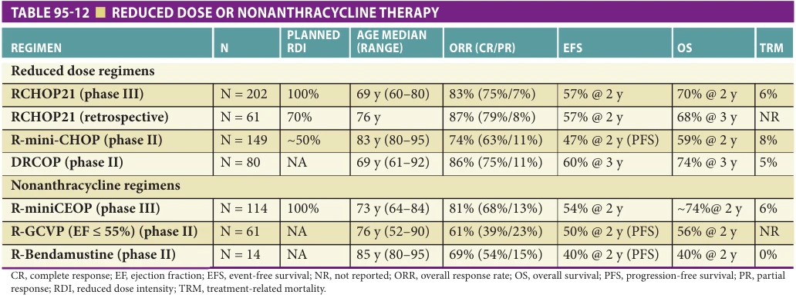

*Table 95-12, printed p. 1498.*

**[p. 1499]**

refractory DLBCL found that outcomes of response and survival were similar to slightly better for older versus younger patients (patients 65 years or older made up one-quarter of the trial cohort). However, the incidence of grade more than or equal to 3 neurologic toxicity was higher (44% vs 28%) in the older age cohort. Future studies are needed to identify which older patients are optimal candidates for CAR-T therapy through understanding of patient preferences, risk of toxicity, and functional status.

## Follicular Lymphoma/Indolent Lymphomas

Introduction Follicular lymphoma (FL) is the second most common NHL histology in the United States, accounting for approximately 30% of new cases. FL is the prototypical indolent or slow-growing lymphoma, characterized by systemic disease with a protracted disease course associated with waxing and waning adenopathy that is frequently asymptomatic and may not require therapy. Average survival can exceed 15 years.

Most patients with FL will present with painless adenopathy, with bone marrow involvement in up to 70%. FL remains a chronic illness that is characterized by the need for intermittent therapy with generally shorter and shorter response intervals. Marked heterogeneity does exist in disease course, with perhaps 10% to 15% of patients experiencing a more aggressive disease course with shorter survival.

Indications for therapy Many patients will present with advanced-stage disease but will not require immediate intervention. Asymptomatic patients with low burden of disease may be expectantly monitored with no detrimental effect on overall survival. Randomized studies have shown that the early initiation of therapy did not improve longterm disease-specific or overall survival, supporting an expectant monitoring approach. The median time from diagnosis to treatment in controlled settings has generally been about 3 years. Spontaneous regression of adenopathy in FL may occur in 10% to 15% of patients. Indications for therapy, which is generally chemoimmunotherapy in the modern era, are derived from clinical trial criteria established by the French in the context of clinical trials (termed the GELF criteria) and adopted by the NCCN guidelines. These criteria generally relate to tumor burden (Table 95-13).

Therapy—Localized disease While expectant monitoring may be reasonable in some patients with localized indolent lymphoma, others will require therapy. Radiation alone may be an option for 5% to 10% of patients who present with localized disease (stage I or II), with roughly 50% of patients remaining long-term disease free. Patients with bulky FL are generally managed according to advancedstage strategies.

Therapy—Advanced-stage disease

Chemoimmunotherapy Therapy for advanced-stage FL is generally indicated when there are criteria indicating increased tumor burden and symptomatic disease. Current therapies

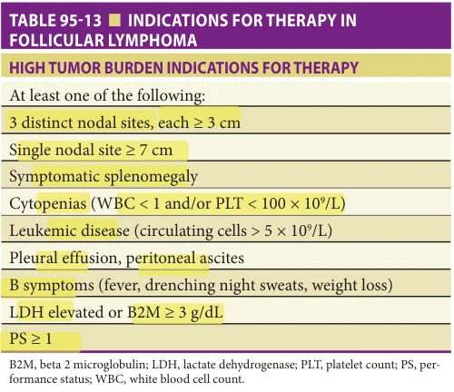

*Table 95-13, printed p. 1499.*

are not curative, so the goal of treatment is resolution of disease symptoms and maintenance of remission, balanced with toxicity. FL are very responsive to immunotherapy alone and in combination with chemotherapy, as well as radiation, with a rapid expansion of available agents in the current era. In almost all instances, the addition of rituximab to a chemotherapy backbone has consistently resulted in improved response rates and increased PFS, as well as of evidence of increased OS. Alkylator-based regimens (eg, RCHOP and R-CVP), purine analogue regimens (eg, R-FCM), and rituximab-bendamustine have all been evaluated in the frontline treatment of symptomatic FL. Overall response rates are generally in the 80% to 95% range, with median response durations over 2 years. For older frail patients, low-dose targeted radiation or single-agent rituximab may provide effective palliation.

Relapsed Disease At relapse, the selection of salvage regimens depends on the efficacy and tolerability of prior therapies. Rituximab is generally included if the benefit from initial therapy was more than 6 months, and data support maintenance rituximab in the relapsed setting as well. Radioimmunotherapy with 90Y-ibritumomab tiuxetan and 131I-tositumumab represents an effective approach and is a particular consideration in older patients with comorbidities not appropriate for chemotherapy. The oral phosphatidylinositol 3-kinase (PI3K) inhibitor idelalisib has proven safety and efficacy in relapsed indolent NHL refractory to rituximab and alkylators. Other aggressive options as used in relapsed/refractory DLBCL, such as ASCT or CAR-T therapy may be considered for select patients with short remission duration (< 2 years) from initial chemoimmunotherapy induction.

Risk of transformation Up to half of patients may experience transformation to a more aggressive biology that approximates DLBCL in appearance. Clinically, transformation is often heralded by a rapidly growing nodal mass, new-onset B symptoms, hypercalcemia, elevated

**[p. 1500]**

LDH, increased Ki67%, and higher standardized uptake values (SUVs) on FDG-PET. Once transformation is documented, treatment generally follows DLBCL paradigms to eradicate the aggressive life-threatening clone. Median survival following transformation is reported at less than 2 years.

Hodgkin Lymphoma While HL median age of diagnosis is 39 years, there is a bimodal age peak of distribution, with peaks of incidence in the 20s to 30s and again in the 60s to 70s. Older patients pose a particularly difficult dynamic for the treatment team. If therapy can be given safely, these patients can be cured. However, many patients are not given dose-intense chemotherapy due to perceived or actual risk of toxicity. Older patients are also less represented in clinical trials (< 5% of HL trial demographics are older) leaving less guidance and fewer advancements in the treatment of older patients. Hence, there remains a significant gap in curability for older patients due to disease biology, aging-associated vulnerabilities, and therapy administered.

Biology and outcomes in older patients HL is characterized by the presence of malignant multinucleated giant cells, termed “Reed-Sternberg” cells, that have a typical immunohistochemical profile with expression of CD15 and CD30. Four histologic subtypes are recognized: nodular sclerosis, mixed cellularity, lymphocyte-rich, and lymphocytedepleted classical HL. Another subtype of HL, nodular lymphocyte-predominant Hodgkin lymphoma (NLPHL), is even rarer, both in terms of incidence (only 5% of all HL) and presentation at advanced age.

Older patients with HL, typically defined as older than or equal to 60 years, have poorer outcomes compared to younger patients. The reasons for these disparities are many, including disease biology, comorbidity, functional status, relative chemotherapy intensity, and toxicity. A recent population analysis evaluated first-line treatment patterns in adults 65 years or older with incident HL in the United States. Less than one-quarter of patients received “full regimen” dose-intense chemotherapy, and 26% of patients received no treatment within 4 months of diagnosis. This study highlighted the heterogeneity of treatment practices and patient characteristics in this particularly vulnerable population. Further, there is a lack of prognostic tools for this population. The IPS developed by Hansenclever is the most widely used prognostic score, but there were no patients older than 65 years at diagnosis, making the IPS difficult to apply to older individuals. Retrospective assessments have suggested comorbidity and ADLs are important predictors in older HL patients.

Early-stage disease (stage I-IIA) The standard of care for early-stage patients is the chemotherapy combination of adriamycin, bleomycin, vinblastine, and dacarbazine (ABVD), with or without radiation, depending on location of disease and initial response to treatment. Recently, trials in

early-stage favorable patients have integrated interim PET into the treatment paradigm, allowing omission of radiation based on initial response. Additionally, the toxicity of bleomycin outweighs its benefits after more than two cycles of bleomycin. Thus, it is now recommended that after two cycles, older patients receive AVD without bleomycin to protect from pulmonary toxicity.

Advanced-stage disease (stage III/IV) For patients with advance stage HL, ABVD is the standard of care in the United States. Alternate regimens, such as Stanford V and BEACOPP, are associated with increased toxicity in older adults. The SHIELD study was specifically designed for adults with HL older than age 60; they prospectively studied the VEPEMB (vinblastine, cyclophosphamide, procarbazine, etoposide, mitoxantrone, bleomycin, prednisolone) program in this cohort, with phase II data demonstrating 3-year PFS and OS of 58% and 66%, respectively, for advanced-stage patients. For early-stage patients, 74% of patients achieved CR with PFS at 3 years of 87%.

Novel approaches to older adults with Hodgkin lymphoma In recent years, there has been a shift to exploring nonchemotherapeutic options that may be less toxic for older patients. Brentuximab vedotin (Bv) is an anti-CD30 antibody that disrupts microtubule networks, resulting in cell cycle arrest and apoptosis of HL cells. Bv was first FDA approved for relapsed/refractory HL, and has since been approved in combination with AVD (A-AVD) for advanced-stage HL. Since then, several trials are being completed to assess combination therapy of Bv with additional agents for treatment of newly diagnosed HL. A multicenter phase II study used sequential Bv prior to and after AVD for patients older than or equal to 60 years at diagnosis. They found an 82% and 95% overall response rate after the lead-in Bv cycles and then six cycles of ABVD, respectively. Two year progression-free and overall survival rates were 84% and 93%, respectively, with patients with lower geriatric comorbidity score experiencing higher PFS rates. Additional studies have assessed Bv as a single agent or in combination with nivolumab or dacarbazine as potential therapeutic options.

Relapsed/refractory disease At the time of relapsed/refractory disease, understanding suitability for autologous stem cell transplant (ASCT) is an important early step for older patients. For younger patients, standard treatment is second-line chemotherapy followed by ASCT for chemosensitive disease; over 60% of patients may be cured. However, ASCT is not appropriate for many older patients, who should be evaluated for fitness for ASCT in the context of comorbidity, frailty, and life expectancy.

For patients not eligible for ASCT, goals of care include achieving disease control balanced with toxicity. Patients may be treated with single agents or novel combinations. Patients may be treated with single-agent Bv or gemcitabine with or without radiation therapy when appropriate. Additionally, novel approaches, such as immunotherapy may be

**[p. 1501]**

considered. Further studies are being conducted to assess treatment options for older patients with relapsed/refractory disease, but this population remains a challenge to treat.

Follow-Up and Survivorship in NHL and HL PET-CT scan should generally be utilized at the end of treatment to assess response, which may reveal complete metabolic response or be indeterminate, requiring integration of clinical context. A complete metabolic response, even with persistent mass, is considered complete remission and has been associated with similar outcomes. CT imaging is preferred in low or variable FDG-avid histologies.

Surveillance imaging in remission is increasingly discouraged, given the lack of evidence demonstrating improvement in survival and concerns over exposure to medical radiation. The clinical context is important to consider when making these decisions, as risk of relapse is greatest in the 1 to 2 years following completion of therapy for aggressive histologies. Given the long natural history of indolent lymphomas, judicious use of follow-up scans can be considered, particularly when intra-abdominal retroperitoneal disease is present. The risks of secondary malignancies from medical radiation exposure may have less impact in patients diagnosed at older age, given the latency period.

## PLASMA CELL DISORDERS

Plasma cell disorders (PCDs) encompass a range of clonal conditions, ranging from monoclonal gammopathy of undetermined significance (MGUS), which is by definition asymptomatic and requires no treatment, through multiple myeloma, wherein the clonal plasma cells cause endorgan damage, require therapy, and will ultimately cause the patient’s death if left untreated. The incidence of PCDs increases with age, and the presence of multimorbidity may make it a challenge to distinguish between end-organ damage (ie, anemia, renal insufficiency, or vertebral compression fractures) related to a PCD versus another underlying comorbid condition. Table 95-14 summarizes key aspects of the PCDs.

Laboratory Evaluation PCDs are among the few neoplasms where routine laboratory testing other than tissue biopsy can detect the “fingerprint” of a clonal population, in this case detection of a monoclonal protein in the serum or urine. This protein may be referred to as a paraprotein, M-component/M-spike or restricted peak. The monoclonal protein may be an intact immunoglobulin (comprising both heavy and light chains), light chain only or, rarely, heavy chain only. Advances in laboratory technology have allowed more sensitive and specific detection and identification of a paraprotein and have improved our ability to monitor response to treatment in those PCDs that require treatment.

Serum protein electrophoresis In serum protein electrophoresis (SPEP), the serum proteins are separated by an electric

field on an agarose gel and stained with Amido black, and quantitated by densitometer tracing of the gel. An alternate, more sensitive SPEP method, involves separation of serum proteins in a capillary tube in a liquid phase buffer by a high-voltage current and quantitation by light absorbance. The latter mechanism is more accurate as it does not rely on uptake of dye. Monoclonal proteins are named for the protein region in which they migrated, such as α1, α2, β, or γ (eg, “γ-restricted peak”).

Serum immunofixation Immunofixation is more sensitive than is SPEP, allowing for confirmation of monoclonality and determination of the type of immunoglobulin heavy and light chain class of the involved protein. However, it is purely qualitative and does not allow quantitation. In this test, the separated serum proteins are tested with specific antibodies (eg, anti-γ, anti-μ, anti-α, anti-κ, anti-λ) and stained.

Urine protein electrophoresis Urine protein electrophoresis (UPEP) is performed in a similar manner as described for SPEP. It allows quantitation of the types of protein found in the urine. Generally the percentage of each type of protein is reported, allowing distinction between proteinuria caused primarily by albumin versus light chain production. Coupled with the total amount of protein in a 24-hour urine collection, this allows quantitation of the total amount of monoclonal protein eliminated in the urine.

Urine immunofixation Urine immunofixation, like serum immunofixation, is more sensitive for the presence of a paraprotein. Given that only the light chains are freely filtered at the glomerulus, generally only kappa or lambda light chains are detected on immunofixation of the urine, though occasionally heavy chain fragments are detectable. Urine immunofixation is a qualitative test only.

Serum-free light chain assay The serum-free light chain is a quantitative measure of excess kappa or lambda light chains produced by a plasma cell clone. Under normal circumstances, a slight excess of light chains is produced relative to heavy chains in the production of intact immunoglobulins, resulting in small quantities of kappa and lambda light chains free in the serum. The ratio of kappa to lambda light chains is roughly 1:1, with the normal range of ratios of kappa to lambda ranging from 0.26 to 1.65. In a clonal PCD, the ratio will either be greater than the upper limit of normal with a kappa paraprotein, or less than the lower limit of normal with a lambda paraprotein. Notably, as the light chains are renally cleared, the absolute level of kappa and lambda light chains may be elevated in patients with renal impairment, but the ratio will remain close to normal.

## Monoclonal Gammopathy of Undetermined Significance

Definition MGUS is an asymptomatic premalignant condition characterized by the presence of a monoclonal protein in the serum or urine. The 2014 International Myeloma Working Group (IMWG) criteria defined that a diagnosis of MGUS requires a total serum M-component less than

**[p. 1502]**

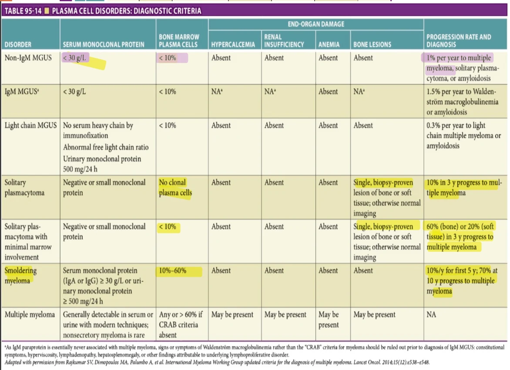

*Table 95-14, printed p. 1502.*

**[p. 1503]**

30 g/L, with bone marrow plasma cells (or lymphoplasmacytic cells in the case of an IgM paraprotein) less than 10% and no end-organ damage related to the monoclonal protein (eg, “CRAB” criteria: hypercalcemia, renal insufficiency, anemia, or bone lesions) or amyloidosis (see Table 95-14).

Epidemiology The prevalence of MGUS in the United States is approximately 3% and ranges from 1% to 5% in other countries throughout the world. It increases in prevalence with age, and is more common in men and AfricanAmericans. Additional risk factors include having a primary relative with a history of MGUS or myeloma, exposure to pesticides, rural residence, and possibly obesity.

Pathophysiology (classification) MGUS may be classified as IgG, IgA, light chain MGUS, or IgM MGUS. MGUS may progress to multiple myeloma, solitary plasmacytoma, or primary amyloidosis. IgM MGUS generally does not progress to multiple myeloma, but to Waldenström macroglobulinemia or amyloidosis. The rate of progression to symptomatic myeloma is about 1% per year; high-, highintermediate, low-intermediate, and low-risk groups are defined based on the type of monoclonal protein, level of the M-spike, and whether the serum-free light chain ratio is normal.

Presentation MGUS may be discovered when the patient is undergoing evaluation for another disorder and is found to have a monoclonal protein. This may include evaluation for anemia, renal insufficiency, proteinuria, osteoporosis or fractures, hypergammaglobulinemia, or peripheral neuropathy.

Evaluation The identification of a monoclonal protein requires evaluation for the presence of end-organ damage. The history and physical examination should focus on symptoms suggestive of CRAB criteria. A CBC should be obtained to rule out anemia; a basic metabolic panel estimates renal function and rules out hypercalcemia. In the presence of concomitant explanations for anemia (eg, iron deficiency) or renal insufficiency (eg, established diagnosis of diabetic nephropathy with stable renal function), the criterion for end-organ damage is not satisfied. Finally, bone imaging is required. The traditional skeletal survey is being replaced by more sensitive bone imaging, including 15fluorodeoxyglucose positron emission tomography (PET), magnetic resonance imaging (MRI) (either whole body or spine), or low-dose whole-body computed tomography (CT).

Management MGUS does not require treatment. Patients identified as having MGUS are followed at 6- to 12-month intervals for progression to a malignant disorder, with monitoring for anemia, renal insufficiency, hypercalcemia, or bone lesions.

## Smoldering Myeloma

Definition Smoldering myeloma is intermediate between MGUS and symptomatic multiple myeloma, defined as the presence of an IgG or IgA monoclonal protein greater than

or equal to 30 g/L or urinary monoclonal protein greater than or equal to 500 mg per 24 hours and/or clonal bone marrow plasma cells 10% to 60%. End-organ damage related to the paraprotein (hypercalcemia, renal insufficiency, anemia, bone lesions, or amyloidosis) must be absent.

Pathophysiology (classification) Only 50% of patients with smoldering myeloma progress to require therapy in 5 years (10% risk per year), and 30% are free of progression to myeloma at 10 years. Because of this heterogeneity, subgroups of patients at highest risk for progression from smoldering to overt myeloma were identified, in order to not subject the patient to end-organ damage before initiation of treatment. About 90% of patients with more than 60% plasma cells in their bone marrow progress to multiple myeloma requiring treatment within 2 years, leading to the recent change in myeloma diagnostic criteria: These patients previously diagnosed with smoldering myeloma are now categorized as having multiple myeloma requiring treatment.

Evaluation Evaluation should be as for MGUS earlier, but also requires a bone marrow biopsy to determine the percentage of plasma cells in the bone marrow. As with MGUS, bone imaging such as whole-body CT, PET-CT, or whole body MRI to detect lytic lesions is required

Management

Nonpharmacologic Patients with smoldering myeloma should be followed at 3- to 6-month intervals for history and physical examination and laboratory evaluation including CBCs, a basic metabolic profile, and quantitation of the monoclonal protein.

Drugs Previously, only observation was recommended for patients with smoldering myeloma. Data are emerging demonstrating a benefit to treatment with the immunomodulatory agent lenalidomide in individuals with intermediate or high-risk smoldering myeloma, with delay of progression to myeloma and the development of myeloma-related end organ damage.

## Multiple Myeloma

Definition Multiple myeloma is the malignant clonal proliferation of plasma cells with related end-organ damage, including hypercalcemia caused by lytic bone lesions, anemia, and renal insufficiency, which may be caused by hypercalcemia or light chain nephropathy.

Epidemiology Multiple myeloma is the second most common hematologic malignancy, with an estimated 34,920 new diagnoses in 2021 in the United States. Current evidence supports the fact that all cases of multiple myeloma are preceded by MGUS. As with MGUS, male gender, African-American race, and advancing age are all associated with increased incidence of multiple myeloma. With the aging of the population, there will be a 57% increase in the incidence of myeloma, and more strikingly, a 77% increase in the incidence of myeloma in people older than age 65.

**[p. 1504]**

Presentation The most common presenting symptom is bone pain, present in three out of five patients. Back pain is generally of less than 1 year in duration. Fatigue is present in one-third of patients. Other symptoms may include altered mental status or constipation due to hypercalcemia, recurrent infections, or weight loss. Patients who have developed cord compression may present with paresis. Some patients may present with abnormal laboratory findings alone, including anemia, renal insufficiency, hypercalcemia, or an elevated total serum protein level with hypoalbuminemia (an elevated “protein gap”).

Evaluation Evaluation includes a thorough history and physical examination, seeking evidence of end-organ damage. Examination may reveal pallor, indicative of anemia, kyphosis related to vertebral compression fractures, or mental status changes due to hypercalcemia. Laboratory evaluation includes CBCs, comprehensive metabolic profile, serum protein electrophoresis and immunofixation, urine protein electrophoresis and immunofixation, quantitative immunoglobulins, serum-free light chains, lactate dehydrogenase, and β2-microglobulin. Radiographic evaluation begins with advanced bone imaging, such as low-dose whole body CT, PET-CT, or whole body MRI. Skeletal survey alone is no longer considered adequate for detection of myeloma bone lesions. Notably, nuclear medicine bone scans are generally negative in multiple myeloma, given that myeloma bone lesions are purely lytic. Finally, pathologic confirmation of the diagnosis is obtained with bone marrow core biopsy and aspirate. The bone marrow aspirate is also sent for cytogenetics and FISH for chromosomal abnormalities commonly seen in multiple myeloma.

Pathophysiology (classification) The current staging system used for multiple myeloma is the Revised-International Staging System. This system, replacing the older DurieSalmon staging system and its precursor International Staging System, requires the serum albumin, β2-microglobulin, and lactate dehydrogenase levels as well as the presence or absence of higher risk chromosomal abnormalities, including t4;14, t14;16, and del 17p.

Management The management of multiple myeloma in older adults can be complex.

Nonpharmacologic As a systemic disease, multiple myeloma essentially categorically requires systemic therapy. However, radiation or surgery may have a role in the management of skeletal lesions or the oncologic emergency spinal cord compression. Patients who present with cord compression may undergo surgical decompression followed by radiation with a goal of preserving or restoring function. Patients who present with pathologic fractures or lesions of the long bones at risk for pathologic fracture may undergo surgical stabilization to preserve or restore function; such lesions are generally irradiated postoperatively to facilitate healing and decrease pain. Other painful bone lesions may be irradiated for pain relief.

Drugs The therapeutic options for multiple myeloma have improved dramatically in the past 20 years, resulting in a near-doubling of the average overall survival times. For adults aged 65 to 74, the 5-year survival rate improved from 27% in 1998 to 2004 to 39% in 2005 to 2009 then to 48% in 2010 to 2014. For adults aged 75 to 90, the 5-year survival rate improved from 16% in 1998 to 2004 to 23% in 2005 to 2009 then to 31% in 2010 to 2014. Continued advances promise continuing improvement in the duration of survival.

Melphalan. For over three decades, oral melphalan was the standard of care for patients with multiple myeloma. When melphalan is combined with prednisone, about 50% of patients will have at least a partial response to therapy. The main toxicity of melphalan is myelosuppression. Melphalan is still used in some regimens for older adults, but has largely been supplanted by newer more effective treatment options.

Corticosteroids. Corticosteroids are incorporated into essentially every antimyeloma regimen. Corticosteroids have rapid direct antimyeloma efficacy and act synergistically with other agents. Corticosteroids are often used when patients present acutely and highly symptomatically with a new diagnosis of multiple myeloma. High-dose corticosteroids (eg, dexamethasone 40 mg orally × 4 days) can be used to rapidly ameliorate hypercalcemia or significant bone pain. However, corticosteroid dosing should be chosen cautiously for longer-term management. In a randomized trial of lenalidomide with high-dose versus low-dose dexamethasone (lenalidomide plus dexamethasone 40 mg orally on days 1–4, 9–12, and 17–20 [RD] versus lenalidomide plus dexamethasone 40 mg weekly), RD was associated with a higher response rate but poorer overall survival due to increased toxicity (primarily venous thromboembolic events and infections). Thus, high-dose corticosteroids should be avoided in older patients due to increased risk of treatment-related mortality. Further, a recent randomized trial demonstrated that in intermediate-fit older adults, discontinuation of steroids after the first 9 months of the initial therapy resulted in superior event-free survival, indicating less toxicity with preserved antimyeloma efficacy. Similar studies have not been conducted in the setting of relapsed/refractory myeloma, and steroids remain an anchor in the treatment of myeloma.

Thalidomide. The antimyeloma efficacy of the immunomodulatory agent thalidomide was first reported in 1999, heralding a revolution in the treatment of multiple myeloma. Over the first decade of the new century, thalidomide was utilized in a number of combinations, including with melphalan and prednisone (MPT) and bortezomib, melphalan, and prednisone (VMPT). The toxicities of thalidomide include sedation, constipation, peripheral neuropathy, and venous thromboembolic events. It is used less frequently now in preference for more effective and less toxic options.

Lenalidomide. Lenalidomide, another immunomodulatory agent, has largely supplanted thalidomide due to improved

**[p. 1505]**

tolerability and efficacy. Lenalidomide’s toxicities include venous thromboembolism and cytopenias. A randomized trial demonstrated that continuous lenalidomide with dexamethasone improves progression-free and overall survival over MPT or lenalidomide and dexamethasone of a fixed duration (18 months), establishing this regimen as a standard of care in older adults with multiple myeloma. Dose must be adjusted for renal insufficiency.

Pomalidomide. Pomalidomide is approved in the United States for patients with relapsed or refractory myeloma who have previously been treated with bortezomib and lenalidomide.

Bortezomib. Bortezomib is a proteasome inhibitor administered parenterally for initial therapy or at relapse. It was initially administered intravenously and twice weekly, a regimen which was found to be excessively toxic in older adults. Once-weekly subcutaneous administration of bortezomib is tolerated much better in older adults, with similar efficacy. The main toxicities of bortezomib are peripheral neuropathy, cytopenias, and herpes zoster. Bortezomib is administered in combination with dexamethasone, and may be used in combination with another agent, such as lenalidomide or cyclophosphamide. Bortezomib does not require dose adjustment for renal impairment.

Carfilzomib. Carfilzomib is the second-in-class proteasome inhibitor, approved in the United States for patients with relapsed or refractory multiple myeloma who have received bortezomib and an immunomodulatory agent (either lenalidomide or thalidomide). Its toxicities include cytopenias and dyspnea. Cardiotoxicity is an increasingly recognized adverse effect of particular concern in older adults.

Ixazomib. Ixazomib is an orally administered proteasome inhibitor with efficacy and toxicity similar to bortezomib. It is approved in combination with lenalidomide and dexamethasone in patients with relapsed myeloma, but there is interest in its use in the initial therapy setting, particularly for older adults.

Monoclonal antibodies. Elotuzumab is a monoclonal antibody directed against SLAMF7, a marker found on both selected normal hematopoietic cells and myeloma cells. It is approved for use in combination with lenalidomide and dexamethasone for patients with relapsed myeloma. Daratumumab is a monoclonal antibody directed against CD38, present on plasma cells. It is available in both intravenous and subcutaneous formulations, with its main toxicities being infusion reactions and risk of infection. It is approved for use in combination with lenalidomide and dexamethasone for older adults who will not be undergoing stem cell transplant, as well as in the relapsed setting.

Combination regimens. Numerous combinations of the above agents have been examined in clinical trials. Generally, combination regimens result in higher response rates, but also in greater toxicity; whether the combination improves outcomes like overall survival depends on the balance of efficacy and toxicity. The IMWG recommends that older

adults with multiple myeloma deemed more frail receive either well-tolerated three-drug combinations or only twodrug combinations (lenalidomide and dexamethasone).

High-dose therapy and autologous stem cell transplantation. Select, fit older adults, generally under age 75 but occasionally older, may be candidates for high-dose therapy and autologous stem cell transplantation. Even with the tremendous advances in treatment, the approach of induction therapy, high-dose therapy/autologous stem cell transplant, followed by maintenance therapy, continues to produce the longest durations of myeloma control of all therapeutic options.

Emerging therapies. The entire wealth of emerging treatments, either approved in relapsed settings or still investigational, is beyond the scope of this chapter. Among the newest options approved are selinexor, belantamab mafodotin-blmf, isatuximab, and melphalan flufenamide. A paucity of data on the toxicity of the newest drugs in older patients presents a challenge for clinicians and patients considering these approaches. Chimeric antigen receptor T cells are a still-investigational approach expected to emerge in practice in 2021.

Prevention of complications

Skeletal-Related Events Intravenous bisphosphonates are effective for primary or secondary prevention of skeletalrelated events (including pathologic fractures or painful lytic lesions requiring radiation). Zoledronic acid and pamidronate are utilized in the United States. Denosumab, the RANK ligand inhibitor, is approved for patients with multiple myeloma and utilized in patients with renal impairment in whom bisphosphonates are contraindicated.

Infection Prophylaxis Patients with multiple myeloma should receive the pneumococcal vaccine and annual influenza vaccinations. Patients receiving certain treatments should receive herpes zoster prophylaxis with acyclovir or valacyclovir. One randomized trial demonstrated a reduction in fever or early death in patients treated with levofloxacin for the first 3 months after diagnosis.

Special issues

Frailty Given that the majority of patients with myeloma are older than age 65, there has been great interest in developing an easily implemented measure of frailty. The International Myeloma Working Group developed a frailty score based on age greater than 80, dependence in ADL/IADL, and comorbidities that predict toxicity of therapy and survival. Studies selecting patients based on their frailty level (fit, intermediate, or frail) or adjusting treatment based on the same are emerging and underway, promising improved means to tailor treatment to the health of older adults.

Comorbidity The presence of comorbidities is prognostic in older adults with multiple myeloma. Comorbidities may also limit treatment options or influence the rates of toxicity. For example, underlying peripheral neuropathy may limit the use of bortezomib. Diabetes may limit the dose of

**[p. 1506]**

corticosteroids due to hyperglycemia. Patients and clinicians may have concerns about using carfilzomib in the presence of underlying cardiac disease given risk for dyspnea.

## Solitary Plasmacytomas

Definition Solitary plasmacytomas are malignant proliferations of plasma cells located either in bone or soft tissue, in the absence of other evidence of end-organ damage, and with no or minimal (< 10%) plasma cells in the bone marrow (see Table 95-14).

Epidemiology Plasmacytomas are a relatively rare PCD, with an incidence rate of 0.34 cases per 100,000 personyears. Similar to multiple myeloma, plasmacytomas are more common among males and those of Black race.

Presentation Solitary plasmacytomas of bone occur most commonly in the axial skeleton, including the vertebrae or pelvis. Solitary extramedullary plasmacytomas occur most commonly in the upper aerodigestive tract, including the nasal cavity, nasopharynx, oral cavity, or sinuses. Presentation is generally related to local symptoms of the mass.

Evaluation Evaluation of plasmacytomas proceeds as the evaluation for multiple myeloma, with the goal of ruling out multiple myeloma.

Management

Nonpharmacologic The treatment for solitary plasmacytoma is radiation therapy, with curative intent. Radiation is highly effective at establishing local control of the plasmacytoma, and relapses within the radiation field are unusual. If the patient experiences recurrence, it is generally progression to multiple myeloma rather than a local recurrence or persistence of the plasmacytoma.

Drugs Systemic therapy as for multiple myeloma is utilized in the setting of a radiation-refractory solitary plasmacytoma or progression to multiple myeloma.

## Primary Amyloidosis

Definition Amyloidosis is a heterogenous group of rare disorders characterized by the deposition of amyloid fibrils in soft tissues. Nearly 30 different amyloidogenic proteins have been implicated; herein we focus exclusively on AL amyloidosis, where a monoclonal PCD results in the formation of amyloidogenic kappa or lambda light chains.

Epidemiology AL amyloidosis is extremely rare, with only 10 patients diagnosed per 1,000,000 person-years. It coexists with multiple myeloma in 10% of cases.

Presentation Presenting symptoms may be diverse given the range of organs potentially involved in AL amyloidosis. Symptoms may include fatigue, dyspnea, edema, or neuropathy.

Evaluation History may reveal fatigue, dyspnea on exertion or orthopnea suggestive of heart failure, lower extremity

edema, or paresthesias or abnormal bruising. Examination may reveal periorbital purpura, macroglossia, signs of heart failure, hepatosplenomegaly, ecchymosis, or sensory neuropathy. Laboratory evaluation includes CBCs and a comprehensive metabolic profile, serum and urine electrophoresis, and immunofixation and serum-free light chain assay. A 24-hour urine collection for electrophoresis will demonstrate that proteinuria is largely albuminuria rather than light chain excretion. A bone marrow biopsy may demonstrate a small clonal plasma cell population and amyloid deposition. Echocardiography or cardiac MRI may demonstrate evidence of cardiac involvement. Serum N-terminal pro-brain natriuretic peptide (NT-proBNP) and troponin-T levels are prognostic and should be obtained. A periumbilical fat pad aspiration may provide the patient with pathologic confirmation of amyloid deposition without subjecting the patient to a more invasive endomyocardial, renal, or hepatic biopsy.

Pathophysiology (classification) Distinguishing AL amyloidosis from other forms of amyloidosis can be challenging; a monoclonal protein may coexist with another form of amyloid. Amyloid typing can be accomplished through direct immunofluorescence microscopy or immunohistochemistry. Staging is based on NT-proBNP levels, troponin-T levels, and serum-free light chain levels. Cardiac involvement portends a particularly poor prognosis, with a median survival of fewer than 6 months in patients with elevated cardiac markers and involved serum light chains. In patients with no high-risk factors, the median survival is nearly 8 years.

Management Management of AL amyloidosis is essentially entirely pharmacologic. There is no role for surgery or radiation aside from skeletal issues if there is overlap with multiple myeloma. Treatment is directed at the malignant plasma cell clone. A small minority of patients is eligible for highdose therapy and autologous stem cell transplantation and may experience complete responses and long-term survival (> 10 years). The systemic therapeutic options utilized in multiple myeloma have activity in amyloidosis, though some require lower doses for tolerability.

Conclusion The PCDs share in common a clonal proliferation of plasma cells, which are detectable via a monoclonal protein in the serum or urine. MGUS is a premalignant, asymptomatic laboratory finding, which progresses to a malignant disorder at a rate of 1% per year. Solitary plasmacytomas are potentially curable with radiation therapy. Multiple myeloma remains an incurable plasma cell malignancy, but therapeutic options have substantially improved in the past two decades. Amyloidosis remains a therapeutic challenge, though improved risk stratification and the use of novel agents developed in myeloma are improving the landscape.

**[p. 1507]**

## FURTHER READING

Coiffier B, Lepage E, Briere J, et al. CHOP chemotherapy

plus rituximab compared with CHOP alone in elderly patients with diffuse large B-cell lymphoma. N Engl J Med. 2002;346:235–242. Cook G, Larocca A, Facon T, et al. Defining the vulnera-

ble patient with myeloma-a frailty position paper of the European Myeloma Network. Leukemia. 2020;34(9): 2285–2294. Delarue R, Tilly H, Mounier N, et al. Dose-dense

rituximab-CHOP compared with standard rituximabCHOP in elderly patients with diffuse large B-cell lymphoma (the LNH03-6B study): a randomised phase 3 trial. Lancet Oncol. 2013;14(6):525–533. DiNardo CD, Jonas BA, Pullarkat V, et al. Azacitidine and

venetoclax in previously untreated acute myeloid leukemia. N Engl J Med. 2020;383(7):617–629. Gertz MA. Immunoglobulin light chain amyloidosis: 2020

update on diagnosis, prognosis, and treatment. Am J Hematol. 2020;95(7):848–860. Goede V, Fischer K, Busch R, et al. Obinutuzumab plus

chlorambucil in patients with CLL and coexisting conditions. N Engl J Med. 2014;370(12):1101–1110. Greenberg PL, Tuechler H, Schanz J, et al. Revised inter-

national prognostic scoring system for myelodysplastic syndromes. Blood. 2012;120(12):2454–2465. Hochhaus A, Larson RA, Guilhot F, et al. Long-term out-

comes of imatinib treatment for chronic myeloid leukemia. N Engl J Med. 2017;376(10):917–927. Klepin HD, Geiger AM, Tooze JA, et al. Geriatric assess-

ment predicts survival for older adults receiving induction chemotherapy for acute myelogenous leukemia. Blood. 2013;121(21):4287–4294. Kornblith AB, Herndon JE, Silverman LR, et al. Impact of

azacytidine on the quality of life of patients with myelodysplastic syndrome treated in a randomized phase III trial: a Cancer and Leukemia Group B study. J Clin Oncol. 2002;20(10):2441–2452. List A, Dewald G, Bennett J, et al. Lenalidomide in the mye-

lodysplastic syndrome with chromosome 5q deletion. N Engl J Med. 2006;355(14):1456–1465.

Lo-Coco F, Avvisati G, Vignetti M, et al. Retinoic acid and

arsenic trioxide for acute promyelocytic leukemia. N Engl J Med. 2013;369(2):111–121. Mikhael J, Ismaila N, Cheung MC, et al. Treatment of mul-

tiple myeloma: ASCO and CCO Joint Clinical Practice Guideline. J Clin Oncol. 2019;37(14):1228–1263. Morrison VA, Hamlin P, Soubeyran P, et al. Approach to ther-

apy of diffuse large B-cell lymphoma in the elderly: the International Society of Geriatric Oncology (SIOG) expert position commentary. Ann Oncol. 2015;26(6):1058–1068. Palumbo A, Rajkumar SV, San Miguel JF, et al. Interna-

tional Myeloma Working Group consensus statement for the management, treatment, and supportive care of patients with myeloma not eligible for standard autologous stem-cell transplantation. J Clin Oncol. 2014;32(6): 587–600. Peyrade F, Jardin F, Thieblemont C, et al. Attenuated immu-

nochemotherapy regimen (R-mini-CHOP) in elderly patients older than 80 years with diffuse large B-cell lymphoma: a multicentre, single-arm, phase 2 trial. Lancet Oncol. 12(5):460–468, 2011. Rajkumar SV, Dimopoulos MA, Palumbo A, et al. Inter-

national Myeloma Working Group updated criteria for the diagnosis of multiple myeloma. Lancet Oncol. 2014;15(12):e538–548. Rosko AE, Cordoba R, Abel G, et al. Advances in older

adults with hematologic malignancies. J Clin Oncol. 2021;39(19):2102–2114. Sekeres MA, Guyatt G, Abel G, et al. American Society of

Hematology 2020 guidelines for treating newly diagnosed acute myeloid leukemia in older adults. Blood Adv. 2020;4(15):3528–3549. Starkman R, Alibhai S, Wells RA, et al. An MDS-specific

frailty index based cumulative deficits adds independent prognostic information to clinical prognostic scoring. Leukemia. 2020;34(5):1394–1406. Woyach JA, Ruppert AS, Heerema NA, et al. Ibrutinib

regimens versus chemoimmunotherapy in older persons with untreated CLL. N Engl J Med. 2018;379(26): 2517–2528.

**[p. 1508]**
