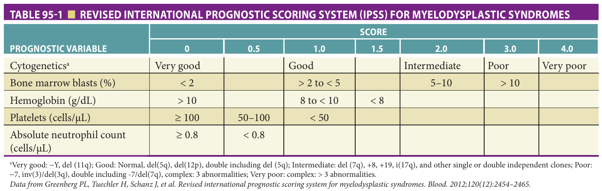

Study summary of Chapter 95; the book is the reference.

# Chapter 95 Study: Hematologic Malignancies and Plasma Cell Disorders

**Study summary only - read the full chapter in the book, pp 1483-1508.**

Fast build from the book; not lane-reviewed.

## Summary

### Definition & diagnosis

- MDS: clonal ineffective hematopoiesis with cytopenias; it may remain indolent or progress to marrow failure/AML. Older patients' outcomes reflect both disease biology and fitness. (p. 1483)

- Suspect MDS with progressive macrocytic anemia/cytopenias; exclude mimics and confirm with marrow biopsy plus cytogenetics. (p. 1484)

- CLL: peripheral-blood flow cytometry establishes the characteristic clonal population; marrow studies are usually unnecessary for diagnosis. (p. 1490)
- Lymphoma requires tissue for classification; fine-needle aspiration is inadequate for subtype determination. (p. 1494)
- Non-IgM MGUS: monoclonal protein **<30 g/L**, marrow plasma cells **<10%**, without related end-organ damage; assess calcium, renal function, anemia and bone lesions. (p. 1503)

### Management

- MDS treatment is risk-adapted; supportive care is central for lower-risk/frail patients. Erythropoietin response is likelier with lower-risk disease, low transfusion burden and serum erythropoietin **<500 mU/mL**. (p. 1485)

- CLL leukocytosis alone does not require therapy; symptoms/progressive cytopenias, molecular risk and fitness guide treatment. (p. 1491)
- MGUS needs follow-up rather than treatment; smoldering myeloma requires closer monitoring, with emerging lenalidomide benefit in intermediate/high-risk disease. (p. 1503)

### Drugs & cautions
- Azacitidine/decitabine: myelosuppression may worsen for months before response; azacitidine has survival evidence, whereas decitabine lacks definitive randomized survival benefit. (p. 1485)
- BTK inhibitors for CLL: bleeding/anticoagulant caution and cardiovascular toxicity, including atrial fibrillation. (p. 1491)
- Myeloma trial: dexamethasone **40 mg orally weekly** with lenalidomide had better overall survival than the high-dose schedule despite lower response; high-dose toxicity included thrombosis and infections. (p. 1504)
- Lenalidomide needs renal dose adjustment; bortezomib does not. Weekly subcutaneous bortezomib is better tolerated than the older twice-weekly intravenous schedule; neuropathy and zoster matter. (p. 1505)

### Exam traps
- Anemia or renal dysfunction from another established cause does not itself fulfill myeloma-related organ damage. (p. 1503)
- Bone scans are generally negative in myeloma because lesions are purely lytic. (p. 1504)

## Drill

**1. What core process causes MDS-associated cytopenias?**

Answer
Ineffective clonal hematopoiesis with impaired maturation and differentiation. (p. 1483)

**2. What confirms suspected MDS?**

Answer
Bone marrow biopsy with cytogenetic analysis, after evaluating peripheral counts/smear and potential mimics such as nutritional deficiencies. (p. 1484)

**3. Which patients with MDS are more likely to benefit from erythropoietin?**

Answer
Those with lower-risk scores, serum erythropoietin <strong>&lt;500 mU/mL</strong>, low transfusion requirements and a shorter interval from diagnosis to treatment. (p. 1485)

**4. Does early worsening of counts necessarily mean hypomethylating therapy has failed?**

Answer
No. Myelosuppression often worsens for several months before a response becomes detectable. (p. 1485)

**5. What is the lenalidomide-responsive cytogenetic MDS subset, and what cautions matter?**

Answer
Transfusion-dependent disease with deletion of the long arm of chromosome <strong>5</strong> as the sole abnormality; watch myelosuppression and adjust dosing for renal impairment. (p. 1486)

**6. Does older age alone mean AML therapy offers no survival benefit?**

Answer
No. Clinical-trial and population data show chemotherapy can improve survival over supportive care for many older adults. (p. 1487)

**7. What is critical for successful oral TKI treatment of CML?**

Answer
Daily adherence and careful response monitoring; PCR provides sensitive monitoring, and comorbid cardiac/thrombotic risks inform drug selection. (p. 1490)

**8. Is a bone marrow biopsy usually required to diagnose CLL?**

Answer
No. History, examination, peripheral blood counts/smear and flow cytometry can usually establish diagnosis and staging. (p. 1490)

**9. Does isolated CLL leukocytosis mandate treatment?**

Answer
No. Therapy is reserved for symptoms or progression with cytopenias; the rate of count increase is more informative than the absolute count alone. (p. 1491)

**10. What BTK-inhibitor risks matter in an anticoagulated patient with CLL?**

Answer
Increased bleeding risk, plus cardiovascular toxicities such as atrial fibrillation, heart failure and hypertension. (p. 1491)

**11. How should new anemia in CLL be evaluated for hemolysis?**

Answer
Reticulocyte count and direct Coombs testing help distinguish hemolysis from decreased marrow production. (p. 1492)

**12. Why is fine-needle aspiration insufficient for lymphoma subtyping?**

Answer
Classification requires adequate tissue for morphology and increasingly complex immunophenotypic/genetic studies; an excisional or incisional core lymph-node biopsy is generally preferred. (p. 1494)

**13. What are the protein and marrow thresholds for non-IgM MGUS?**

Answer
Serum monoclonal protein <strong>&lt;30 g/L</strong> and marrow plasma cells <strong>&lt;10%</strong>, without related end-organ damage or amyloidosis. (p. 1503)

**14. Why does diabetic nephropathy not automatically establish myeloma-related renal damage?**

Answer
Damage must be attributable to the plasma-cell disorder; a concomitant explanation such as established diabetic nephropathy with stable renal function does not satisfy that criterion. (p. 1503)

**15. How do renal dosing requirements differ for lenalidomide and bortezomib?**

Answer
Lenalidomide requires dose adjustment for renal insufficiency; bortezomib does not. (p. 1505)

## Past-paper questions on this chapter

- [2023-Jun Q18 — mcq-bd9893fe8c4027b4668a863e](?chapter=bank&q=mcq-bd9893fe8c4027b4668a863e)
- [2024-May Q12 — mcq-834756aabc08598d8f45a7f5](?chapter=bank&q=mcq-834756aabc08598d8f45a7f5)
- [2024-May Q85 — mcq-d7ef5d7a467c8ade6436f4f5](?chapter=bank&q=mcq-d7ef5d7a467c8ade6436f4f5)
- [2026-Jun Q99 — mcq-c0958b48b6b8fb43106b759b](?chapter=bank&q=mcq-c0958b48b6b8fb43106b759b)

## Table 95-1 ? book image

[2024-May Q12](?chapter=bank&q=mcq-834756aabc08598d8f45a7f5)
