# Hazzard's Geriatric Medicine and Gerontology, 8e - Chapter 96: Coagulation Disorders

Ming Y. Lim

> **Status.** Fast build from the book; not lane-reviewed.

> **Source and method.** Printed pages 1509-1524, from the marked 8th-edition copy (PDF page = printed page + 34). Prose follows its text layer; tables and figures are source-page crops. The book is canonical.

**[p. 1509]**

## OVERVIEW OF COAGULATION

Hemostasis typically refers to the process of thrombus formation at areas of endothelial or vascular wall injury (Figure 96-1). Under normal physiologic conditions, this process is localized to the site of injury and is rapid, dynamic, and highly regulated. Phases of this response include initial formation of the platelet plug following endothelial injury, activation of the coagulation cascade for further hemostatic control, regulation of coagulation by endogenous anticoagulants to limit thrombus formation, and finally, fibrinolysis for thrombus removal.

#### Learning Objectives

- Understand how aging alters hemostatic pathways to increase the risk of both bleeding and thrombosis.

- Review the evaluation of older adults with bleeding disorders.

- Understand the pathophysiology, diagnosis, and treatment of venous thromboembolism (VTE) in older adults.

- Review the strategies to reduce bleeding risk in older adults on anticoagulation.

#### Key Clinical Points

1. The risk of bleeding rises with age and is most commonly due to acquired bleeding disorders and disorders of platelet number or function.

2. Aging is associated with an increased risk of VTE.

3. Direct oral anticoagulants (DOACs) are safe and effective in carefully selected older adults for the treatment of VTE.

4. A careful consideration of the net clinical benefit of anticoagulation in older adults is integral to the selection and management of oral anticoagulants in this high-risk population.

Platelets Platelets are integral directors and mediators of hemostatic responses. Following activation by collagen, laminin, microfibrils, and other elements in the exposed subendothelium, platelets are activated and bind to von Willebrand factor (VWF) and fibrinogen via the platelet glycoprotein 1b-alpha and platelet glycoprotein IIb/IIIa receptor (also referred as integrin αIIbβ3), respectively. This leads to enhanced platelet adhesion and aggregation, resulting in a platelet plug.

Coagulation Cascade While the clotting cascade is a complex series of pathways, several key events are briefly reviewed here. Classically, the coagulation cascade has been divided into the intrinsic and extrinsic pathways, as illustrated in Figure 96-2. In recent years, investigators have proposed a cell-based model of coagulation that occurs on the cell surface in four overlapping steps: (1) initiation, (2) amplification, (3) propagation, and (4) termination (Table 96-1). The primary event for initiation of the clotting cascade and subsequent thrombus formation is interactions of activated factor VII (FVIIa) with exposed tissue factor, an integral membrane glycoprotein, at areas of endothelial or tissue injury. The TF-FVIIa complex (also known as the extrinsic tenase complex) then activates factor IX (FIX) and factor X (FX). Activated factor X (FXa) converts a small amount of factor II (FII, also known as prothrombin) to thrombin (FIIa). The small amount of thrombin generated during the initiation phase then activates platelets, factor V (FV), factor VIII (FVIII), and factor XI (FXI) (amplification phase). During the propagation phase, activated FXI (FXIa) generates activated

FIX (FIXa), which binds to activated (FVIIIa) to form the intrinsic tenase complex. This complex (FIXa:FVIIIa) results in large production of FXa, which in combination with its cofactor, FVa, forms the prothrombinase complex (FXa:FVa), which cleaves prothrombin to thrombin. The efficiency of both the intrinsic tenase complex and prothrombinase complex is enhanced by their co-localization on the surface of activated platelets recruited to the site of endothelial or tissue injury, resulting in a burst of thrombin formation. Thrombin then converts fibrinogen to fibrin and overlapping fibrin strands are cross-linked and stabilized by activated factor XIII (FXIIIa).

**[p. 1510]**

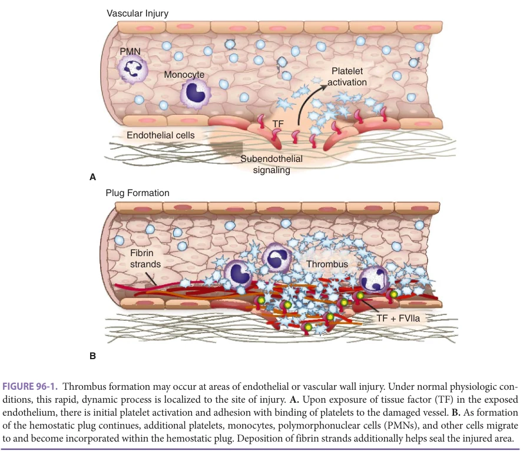

*FIGURE 96-1. Thrombus formation may occur at areas of endothelial or vascular wall injury. Under normal physiologic con- ditions, this rapid, dynamic process is localized to the site of injury. A. Upon exposure of tissue factor (TF) in the exposed endothelium, there is initial platelet activation and adhesion with binding of platelets to the damaged vessel. B. As formation of the hemostatic plug continues, additional platelets, monocytes, polymorphonuclear cells (PMNs), and other cells migrate to and become incorporated within the hemostatic plug. Deposition of fibrin strands additionally helps seal the injured area.*

Endogenous anticoagulants, including antithrombin (AT), protein C, protein S, and tissue factor pathway inhibitor (TFPI), act to limit coagulation at the site of injury. AT binds and inactivates thrombin, as well as FXa. Activated protein C, in complex with its cofactor protein S, inactivates FVa and FVIIIa. TFPI inhibits the extrinsic tenase complex (TF-FVIIa) and FXa. Together, these reactions limit further thrombin generation.

Fibrinolytic System The formed fibrin clot undergoes fibrinolysis which is initiated by the release of tissue plasminogen activator (tPA) from endothelial cells. tPA converts plasminogen to plasmin, which cleaves fibrin into soluble fibrin degradation products, including d-dimer. Fibrinolysis is regulated by plasminogen activator inhibitor-1 (PAI-1) and α2-antiplasmin (α2AP), which inhibit tPA and plasmin, respectively.

## BLEEDING DISORDERS

Epidemiology and Pathophysiology The risk of bleeding rises with age and is most commonly due to acquired bleeding disorders affecting coagulation

factors and/or platelet number and function. For example, bleeding due primarily to disorders of coagulation factors may be seen in older patients with sepsis and disseminated intravascular coagulation (DIC), liver disease, acquired hemophilia with inhibitors to FVIII, acquired von Willebrand syndrome, or due to anticoagulant use. Disorders in older adults that may primarily affect platelet number and/or function include immune thrombocytopenia (ITP), chronic kidney disease, myeloproliferative neoplasms, drug-induced thrombocytopenia, and use of antiplatelet agents. The precise incidence and prevalence of these vary depending on the patient and clinical situation studied. Some of these disorders are described in more detail below.

In addition, and while still incompletely understood, aging itself—devoid of any comorbid influences or anticoagulant/antiplatelet use—has been associated with dysregulation of coagulation factors, fibrinolytic proteins, and activation molecules, which increases bleeding risk. Conversely, the plasma concentrations of many coagulation factors increase with aging. While these age-related changes are not uniform, the net effect seemingly results in a tendency toward thrombosis, rather than bleeding.

**[p. 1511]**

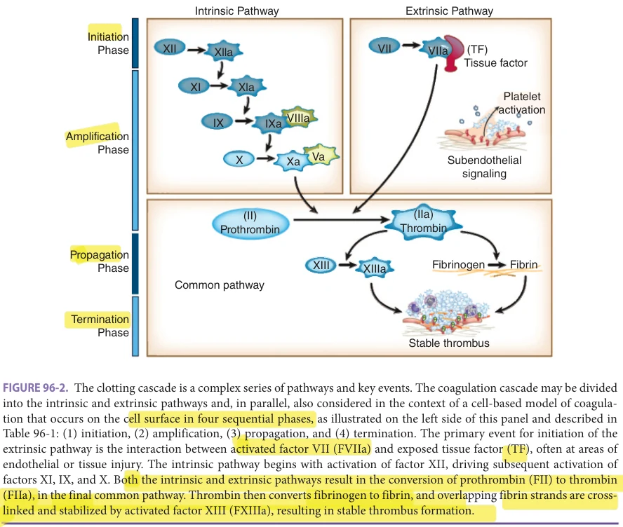

*FIGURE 96-2. The clotting cascade is a complex series of pathways and key events. The coagulation cascade may be divided into the intrinsic and extrinsic pathways and, in parallel, also considered in the context of a cell-based model of coagula- tion that occurs on the cell surface in four sequential phases, as illustrated on the left side of this panel and described in Table 96-1: (1) initiation, (2) amplification, (3) propagation, and (4) termination. The primary event for initiation of the extrinsic pathway is the interaction between activated factor VII (FVIIa) and exposed tissue factor (TF), often at areas of endothelial or tissue injury. The intrinsic pathway begins with activation of factor XII, driving subsequent activation of factors XI, IX, and X. Both the intrinsic and extrinsic pathways result in the conversion of prothrombin (FII) to thrombin (FIIa), in the final common pathway. Thrombin then converts fibrinogen to fibrin, and overlapping fibrin strands are cross- linked and stabilized by activated factor XIII (FXIIIa), resulting in stable thrombus formation.*

For example, plasma fibrinogen levels, which correlate with an increased risk of cardiovascular disease, increase with age, with an approximate 10 mg/dL incremental rise per decade in healthy subjects. Similarly, vWF levels increase approximately 10% to 20% per decade of life and are associated with an increased risk of cardiovascular disease.

Components of the fibrinolytic pathway are also altered in older adults. Plasma levels of PAI-1, the major inhibitor of fibrinolysis, increase with aging, resulting in an age-dependent decrease in fibrinolytic activity. Age-related increases of plasmin-antiplasmin complex and d-dimer have also been reported suggesting enhanced hyperfibrinolysis.

Presentation and Diagnosis The initial steps to evaluating bleeding in older adults, like many assessments in medical practice, begin with a careful history and physical examination. Identifying and integrating key components of the patient’s history and physical examination with laboratory data allows providers to more precisely diagnose the underlying etiology of a bleeding diathesis. Patients should be asked about the initial onset and site of bleeding, prior bleeding episodes (spontaneous and/or postsurgery or trauma), a history of iron deficiency anemia, prior blood transfusions, and a history of heavy

menstrual bleeding and/or postpartum hemorrhage (in women).

The presence of other family members with similar bleeding tendencies, particularly in the presence of bleeding that began after birth or during childhood, may suggest an inherited bleeding diathesis. A thorough medication history, including the use of anticoagulants, herbal agents, and over-the-counter (OTC) products, should be obtained. Patients may need to be asked specifically about the use of aspirin, nonsteroidal anti-inflammatories, or other OTC antiplatelet agents. To assess for the possibility of dietary vitamin K deficiency, providers should inquire about the patient’s dietary habits, and whether there have been any changes recently to the diet.

Physical Examination The physical examination is typically normal, but can vary considerably. Petechiae (small capillary hemorrhages most commonly seen on the legs), epistaxis or gingival bleeding may be seen if there is a disorder of platelet number/ function or blood vessels. Older adults with an acquired coagulation disorder can present with large, palpable ecchymoses, soft tissue hematomas, hemarthrosis, and extensive postprocedural bleeding.

**[p. 1512]**

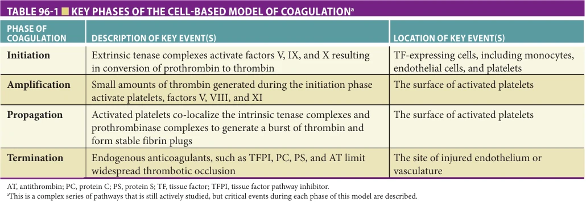

*TABLE 96-1 ■ KEY PHASES OF THE CELL-BASED MODEL OF COAGULATIONa*

Laboratory Evaluation of Coagulation Pathways in Older Adults Laboratory evaluation includes routine tests available through most laboratories as well as more specialized tests that may require a reference laboratory and the expertise of a hematologist for interpretation. General screening tests include a platelet count, hemoglobin and/or hematocrit, prothrombin time (PT), and activated partial thromboplastin time (aPTT). The PT assay measures the function of the extrinsic and common pathways (see Figure 96-2) and detects deficiencies in the vitamin K–dependent coagulation factors: factors II, VII, IX, and X. If a deficiency in factor VII is suspected, the PT is the most sensitive test available. The aPTT measures components of the intrinsic and common pathways and can detect deficiencies of—or inhibitors to—factors II, V, VIII, IX, X, XI, and XII (see Figure 96-2). Both the PT and aPTT can also be prolonged in patients with fibrinogen disorders. Examination of any abnormalities in the PT and/or aPTT can help guide clinicians as to the differential diagnostic and appropriate management steps (Table 96-2). Other routine testing (eg, liver or renal function panels, peripheral smears, DIC panel, mixing study etc.) may be indicated depending on the patient’s clinical presentation, history, and physical examination.

Causes of a prolonged PT with a normal aPTT Causes include warfarin or other vitamin K antagonist (VKA) use, vitamin K deficiency, systemic heparin exposure, factor VII deficiency (inherited or acquired), early liver disease, and in some early cases of DIC. PT prolongation is commonly seen in older hospitalized patients who, unable to eat or have reduced dietary intake of food rich in vitamin K, become deficient in vitamin K.

Causes of a normal PT with a prolonged aPTT Causes include anticoagulant use (eg, heparin), deficiencies in factor VIII and/or VWF (hemophilia A, von Willebrand disease), factor IX (hemophilia B), and factor XI (hemophilia C). The use of subcutaneous heparin for venous thromboembolism (VTE) prophylaxis is the most common cause for

an isolated prolonged aPTT in hospitalized patients. Von Willebrand disease is the most common inherited bleeding disorder affecting up to 1% of the general population and typically presents with mucocutaneous bleeds (epistaxis, heavy menstrual bleed, easy bruising, and postpartum hemorrhage). Patients with hemophilia usually present in childhood or young adulthood with recurrent soft tissue and joint bleeding and postprocedural bleeding. Factor XI deficiency has a more variable bleeding history, often following surgical procedures.

A prolonged aPTT may also be due to the presence of a circulating acquired inhibitor. The most common acquired inhibitor is the lupus anticoagulant, although this inhibitor causes thrombosis instead of bleeding. Acquired hemophilia A (AHA) is a rare autoimmune disorder, with an incidence of approximately 1.5 cases per million per year, that is caused by the production of IgG autoantibodies against endogenous FVIII. It is predominantly a disease of older adults (median age 64–78), but can be associated with malignancies, rheumatological conditions, and pregnancy in younger patients. In up to 50% of patients, there may be no underlying, identifiable etiology. Older adults presenting with an acute onset of subcutaneous bleeding, gastrointestinal bleeding, or muscle bleeding without a history of trauma or prior known bleeding diathesis should prompt evaluation for AHA as it is associated with a high mortality rate of more than 20% if diagnosis is delayed or misdiagnosed.

Causes of a prolonged PT and aPTT Patients with prolongation of both the PT and aPTT should be suspected of having either an inherited disorder of the common pathway or an acquired disorder that affects the intrinsic, extrinsic, and/or common pathways in combination. In older adults, the most common causes of a prolonged PT and aPTT include supratherapeutic anticoagulation with a VKA or anticoagulation bridging therapy with a VKA and heparin that occurs during the initial treatment of acute VTE. Rarely, accidental rodenticide (brodifacoum) poisoning is a cause for significantly prolonged PT and aPTT. Other possible causes include end-stage liver

**[p. 1513]**

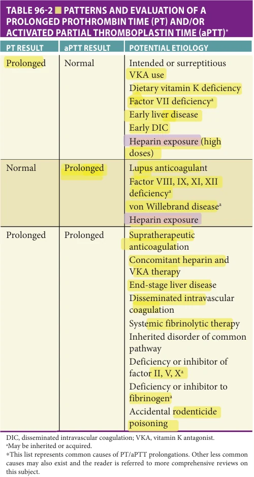

*TABLE 96-2 ■ PATTERNS AND EVALUATION OF A PROLONGED PROTHROMBIN TIME (PT) AND/OR ACTIVATED PARTIAL THROMBOPLASTIN TIME (aPTT)**

disease, DIC, or administration of systemic fibrinolytic agents (eg, tPA). Additional diagnostic measures in this setting may include measurements of fibrinogen and fibrinogen degradation products.

Abnormal Platelet Number in Older Adults The normal half-life of circulating platelets in healthy humans is 8 to 10 days. Any process that disrupts this, leading to reductions in platelet number, may increase the risk of, or cause, bleeding in older adults. Quantitative disorders of platelet number in older adults are numerous and some of the more common of these are outlined in Table 96-3. Broadly, the causes of thrombocytopenia in older adults can be due to decreased platelet production, increased platelet destruction or consumption, increased platelet sequestration, dilutional effects, and spurious thrombocytopenia.

Decreased production of platelets is most often encountered in patients with disorders that impair bone marrow thrombopoiesis. These disorders commonly include nutrient deficiencies, myelodysplastic syndromes, and acute or chronic infectious syndromes. These are particularly common in older adults. For example, vitamin B12 and folate deficiency can be found in up to 24% and 10% of older adults, respectively. Similarly the median age at diagnosis for patients with myelodysplastic syndromes exceeds 65 in most studies, with an onset of disease earlier than 50 being very uncommon. Finally, older adults are at markedly increased risk of infection from bacterial, viral, and fungal causes—many of which may result in bone marrow suppression and associated thrombocytopenia. Many of these disorders are covered in more detail in other chapters within this book. Increased destruction or consumption can be a result of an autoimmune process,

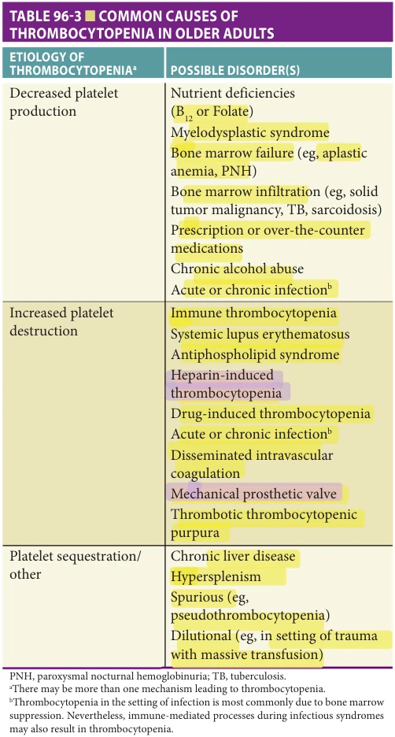

*TABLE 96-3 ■ COMMON CAUSES OF THROMBOCYTOPENIA IN OLDER ADULTS*

**[p. 1514]**

sepsis or an accelerated, antibody-mediated clearance from medications.

Immune thrombocytopenia ITP is an autoimmune disorder characterized by isolated thrombocytopenia (platelet count < 100 × 109/L) and occurs as a result of platelet autoantibodies causing platelet destruction and impaired platelet production. It has an incidence of 2 to 5 per 100,000 and increases with age.

Primary ITP is diagnosed in the absence of other causes or disorders that may be associated with thrombocytopenia. The clinical presentation is highly variable, ranging from incidental asymptomatic thrombocytopenia discovered on an annual physical examination to life-threatening bleeding events. Patients typically come to clinical attention when they present with mild petechial or purpuric lesions on the extremities and epistaxis. This usually occurs when the platelet count is less than 30 × 109/L but many patients remain asymptomatic even in the 10 to 30 × 109/L range.

Although there is no test that can reliably diagnose primary ITP, the evaluation in older adults should include a thorough history and physical, complete blood cell count, reticulocyte count, comprehensive metabolic panel, peripheral blood smear, human immunodeficiency virus (HIV), and hepatitis C serology. The peripheral blood smear is usually normal except for the identification of low numbers of platelets with occasional large-appearing platelets. Depending on the history, other diagnostic tests can be helpful in excluding other potential etiologies of the thrombocytopenia. A bone marrow examination is not routinely required but may be undertaken in selected patients if there is other unexplained cytopenia.

For adults with newly diagnosed primary ITP (diagnosed within the preceding 3 months) and a platelet count of less than 30 × 109/L who are asymptomatic or have minor mucocutaneous bleeding, first-line treatment includes either prednisone (0.5–2.0 mg/kg per day) or dexamethasone (40 mg per day for 4 days). Given the potential sideeffects of corticosteroids, especially in older adults, close monitoring of the patient for hypertension, hyperglycemia, insomnia, depression, gastric irritation, myopathy, and osteoporosis is recommended.

Secondary ITP Secondary ITP is defined as any form of ITP other than primary. This includes drug-induced thrombocytopenia, which is the most common cause of thrombocytopenia in older adults. While the timing, severity, and duration of drug-induced thrombocytopenia can vary substantially, thrombocytopenia is usually evident within the first week of initiation of the causative drug (Figure 96-3). Common drugs known to definitely or probably cause thrombocytopenia are shown in Table 96-4, and an exhaustive list of drugs linked to low platelet counts can be accessed online (http://www.ouhsc.edu/platelets/ditp.html). Providers may also consider reporting cases of drug-induced thrombocytopenia to the US FDA (or similar organizational bodies in

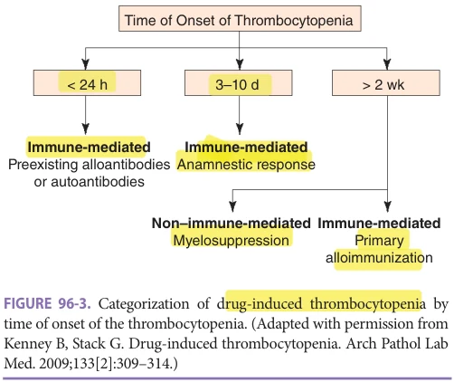

*FIGURE 96-3. Categorization of drug-induced thrombocytopenia by time of onset of the thrombocytopenia. (Adapted with permission from Kenney B, Stack G. Drug-induced thrombocytopenia. Arch Pathol Lab Med. 2009;133[2]:309–314.)*

other countries) Adverse Event Reporting System at www .fda.gov/medwatch.

In hospitalized patients, heparin-induced thrombocytopenia (HIT) is a severe complication that increases the risk of both arterial and venous thrombosis. Antibodies targeting platelet factor 4 increase platelet activation and consumption, activating the coagulation cascade, with resultant arterial and venous thrombi. HIT is associated with morbidity and mortality if undiagnosed and not treated promptly. The diagnosis of HIT can be challenging and providers are encouraged to use validated clinical prediction tools, such as the 4T Score or the HIT Expert

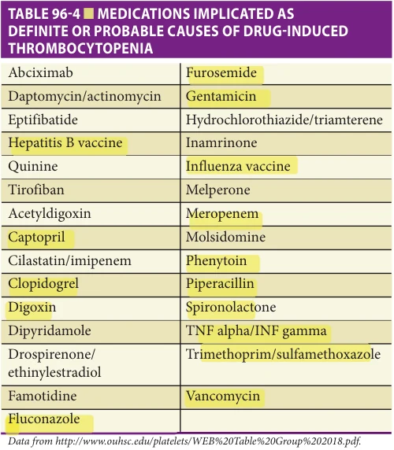

*TABLE 96-4 ■ MEDICATIONS IMPLICATED AS DEFINITE OR PROBABLE CAUSES OF DRUG-INDUCED THROMBOCYTOPENIA*

**[p. 1515]**

Probability Score, in combination with the results of serologic testing and/or functional platelet assays.

Acute and chronic infections, including hepatitis C, HIV, influenza, and Helicobacter pylori, may also cause secondary ITP, although precise mechanisms and pathways remain incompletely understood. In some of these infectious syndromes, thrombocytopenia can also result from ineffective thrombopoiesis as a result of bone marrow infiltration and/or megakaryocyte infection. Finally, secondary ITP can also be a complication of rheumatologic and autoimmune disorders, including systemic lupus erythematosus (SLE), antiphospholipid antibody syndrome, IgA deficiency, and common variable immunodeficiency (CVID).

Nonautoimmune thrombocytopenia In addition to immunemediated thrombocytopenia, low platelet counts in older adults can be the result of other nonimmune causes. One of the most commonly encountered causes is spurious thrombocytopenia, also referred to as pseudothrombocytopenia, being identified in about 0.1% of all blood samples in adults. Spurious thrombocytopenia is due to exogenous platelet clumping in the presence of ethylenediaminetetraacetic acid (EDTA), which is found within some vacutainer tubes. This can be identified by examining the blood film for platelet clumping and repeating a platelet count using blood drawn into an alternative anticoagulant such as citrate buffer. In addition, enhanced platelet consumption can occur in processes such as DIC and thrombotic microangiopathies such as thrombotic thrombocytopenia purpura. Dilutional thrombocytopenia may be seen in trauma patients who have undergone massive fluid resuscitation protocols that include large number of packed red blood cells transfusions.

Abnormal Platelet Function in Older Adults Bleeding in older adults may also occur due to inhibition of normal platelet functions (eg, activation, adhesion, and aggregation) that impairs hemostasis. Traditional antiplatelet agents, including aspirin, nonsteroidal anti-inflammatories, clopidogrel, ticagrelor, dipyridamole, and cilostazol, may all increase the risk of bleeding in older adults. The relative risk increase for bleeding varies among different agents and between different patients. A number of other medications commonly prescribed to older adults may also inhibit platelet activation or aggregation. These include nitrates, calcium channel blockers, and selective serotonin reuptake inhibitors (SSRIs). Many of the mechanisms underlying these drugs’ effects on platelet function remain incompletely understood.

Acquired abnormalities of platelet function in older adults may be due to their underlying co-morbidities. Chronic liver disease may cause abnormalities in platelet aggregation even in the absence of absolute thrombocytopenia. Similarly, acute and chronic kidney disease have been associated with various pathophysiologic effects on platelet function, including abnormal platelet aggregation responses

to adenosine diphosphate (ADP) and epinephrine as well as impaired platelet adhesion.

## VENOUS THROMBOEMBOLISM

Background Deep vein thrombosis (DVT) and pulmonary embolism (PE), collectively referred to as venous thromboembolism (VTE), are common and, in many cases, preventable causes of in-hospital death. Age and accumulation of comorbidities markedly increase the risk of VTE in older adults. Yet, the diagnosis of VTE remains underrecognized in older adults. Clinical suspicion is essential for a prompt diagnosis in older adults who may have an atypical presentation; autopsy studies demonstrate PE is frequently not suspected, nor identified, despite being a common cause of death in older persons. Anticoagulants are the mainstay of VTE treatment given their substantial risk reductions in VTE recurrence and mortality. However, the benefit of anticoagulants may be offset in older adults by their age-related increased risk of bleeding, as described earlier. Balancing the risks of recurrence with bleeding is important to guide treatment duration.

## Epidemiology and Pathophysiology

Incidence of VTE In the general population, the annual incidence of VTE approximates 2 to 3 in 1000 persons and appears to be increasing over time. Notably, the incidence rises with age with an approximate 7 per 1000 persons in those over the age of 70.

Risk factors One or more clinical risk factors are usually identifiable at the time of VTE diagnosis in older adults. In patients presenting with a first episode of VTE, recent hospitalization is the most common risk factor. Additional known risk factors include recent surgical procedures, malignancy, acute infection, impaired mobility, heart failure exacerbation, chronic lung disease, central venous catheter placement, inflammatory bowel disease, obesity, hormonal therapy, and prior VTE. Major orthopedic procedures such as elective hip and knee arthroplasty, or surgical repair of a hip fracture, are additional major VTE risk factors in older adults. Less commonly occurring risk factors include antiphospholipid syndrome, nephrotic syndrome, myeloproliferative neoplasms, HIT and inherited thrombophilias (factor V Leiden mutation, prothrombin G20210A gene mutation, protein C or S deficiency, AT deficiency).

Aging is considered a nonmodifiable risk factor; as patients age they accumulate VTE risk factors with additive risk. Impaired mobility, malignancy, and medical comorbidities (ie, heart failure, chronic lung disease, chronic kidney disease, obesity) are common in older adults and highlight the importance of VTE awareness in this patient population.

Pathophysiology of venous thrombosis Venous thrombi are comprised of red blood cells, white blood cells, and platelets

**[p. 1516]**

enmeshed in a fibrin lattice (see Figure 96-1). The Virchow’s triad of vascular endothelial injury, impaired blood flow (stasis), and hypercoagulability predisposes to venous thrombus formation. Typically, venous thrombi form in an area of blood vessel injury or venous stasis. Endothelial injury activates the clotting cascade shifting the natural balance between blood coagulation and fibrinolysis toward thrombus formation. Vessel injury from inflammation, surgery, trauma, or malignancy exposes subendothelial proteins, specifically tissue factor and collagen. Tissue factor precipitates initial thrombin generation and subsequent coagulation cascade (see Figure 96-2). Exposed collagen acts as binding sites for platelet activation and aggregation. Venous stasis lengthens the time coagulation factors are exposed to sites of vascular injury, further propagating clot formation.

Impaired venous blood flow is attributable to several factors commonly found in older adults. Reduced mobility leads to venous pooling in the legs, development of venous varicosities, and associated venous valvular incompetence. The sinuses behind venous valve cusps represent particularly vulnerable areas for thrombus formation due to disturbed blood flow and stasis. Polycythemia from dehydration, chronic hypoxemia or a myeloproliferative neoplasm, or hypergammaglobulinemia related to chronic inflammation or multiple myeloma results in blood hyperviscosity, further altering blood flow and increasing thrombotic risk. Venous outflow obstruction from incompletely resolved DVT or extrinsic venous compression from solid tumors may worsen venous stasis and promote thrombosis.

Blood coagulation is carefully regulated by inhibitors of thrombin generation and subsequent fibrin formation and the fibrinolytic system. Disruptions in these counterregulatory systems may be inherited or acquired. The circulating natural anticoagulants, including proteins C and S, and AT are essential to prevent unabated fibrin formation. Inherited proteins C and S, and AT deficiencies are uncommon, occurring in 0.02% to 0.3% of the population. The most commonly inherited thrombophilia is factor V Leiden (FVL) mutation, with a prevalence of 5% in an unselected Caucasian population. A point mutation in the FV gene at amino acid 506 (substitution of arginine to glutamine) renders FVa less susceptible to inactivation by activated protein C, which leads to a three- to fivefold increased risk of VTE. Even so, due to incomplete penetrance of FVL, many individuals with the mutation will never develop a VTE. The prothrombin G20210A gene mutation, the second most commonly inherited thrombophilia, is a point mutation in the FII gene that results in a 30% increase in prothrombin levels. It occurs in about 2% of an unselected White population and confers a threefold increased risk of VTE.

Acquired thrombophilias in older adults include antiphospholipid syndrome, HIT, hormone replacement therapy, myeloproliferative neoplasms, and malignancy. Antiphospholipid syndrome is defined by persistent circulating antiphospholipid antibodies (aPL) and the presence

of arterial or venous thrombosis, or pregnancy-related complications. The clinically significant aPL are immunoglobulin G (IgG) or immunoglobulin M (IgM) anticardiolipin antibodies, IgG or IgM β2-glycoprotein I antibodies, or the lupus anticoagulant. These antibodies target multiple sites resulting in monocyte, platelet, complement, and endothelial cell activation; tissue factor production; and cytokine production, contributing to arterial and venous thrombotic events, thrombocytopenia, pregnancy complications, and cardiac valvular disease. aPL titers at the time of an acute thrombotic event may be transiently positive. As such, guidelines recommend that an initial positive aPL test be repeated after at least 12 weeks to confirm a diagnosis of antiphospholipid syndrome. The prevalence of aPL increases with age, yet many patients remain asymptomatic without any evidence of arterial or venous thrombosis. As the clinical significance of aPL in older adults remains uncertain, routine screening is not recommended.

Hormone replacement therapy to treat postmenopausal symptoms increases VTE risk nearly threefold, especially in the first year of use. Myeloproliferative neoplasms including polycythemia vera and essential thrombocythemia are frequently associated with both arterial and venous thrombosis. These patients, especially those who have the gain-of-function mutation of the Janus kinase-2 (JAK2) enzyme, the JAK2 V617F mutation, are particularly prone to thrombosis of the splanchnic veins (hepatic, portal, splenic, and mesenteric).

Patients with malignancy have a four- to sevenfold increased risk of VTE, with up to 20% of all VTEs occurring in cancer patients. The molecular mechanisms of cancerassociated thrombosis remain an area of research. Cancer cells can directly activate the coagulation cascade and platelets through the expression and secretion of tissue factor, platelet agonists, inflammatory cytokines, and PAI-1. In addition, many anticancer therapies are prothrombotic themselves (eg, lenalidomide, cisplatin, L-asparaginase), thus further promoting thrombus formation.

## Clinical Presentation

Acute venous thromboembolism Venous thrombi in the legs may originate in the superficial (greater and lesser saphenous veins) or deep veins. For the deep veins, involvement of the popliteal, femoral, or iliac vein is classified as a proximal DVT, whereas a distal DVT involves the calf veins only (gastrocnemius, soleal, peroneal, or posterior tibial). The deep intramuscular calf veins are frequent sites of thrombus initiation; distal DVTs represent up to 50% of leg DVTs. When confined to the calf veins, patients may be asymptomatic or minimally symptomatic. Proximal leg DVT typically results in asymmetrical leg swelling, diffuse tenderness, erythema, and engorgement of collateral veins if the thrombus is occlusive. These symptoms of DVT can occur suddenly or subacute over days to weeks. In the upper extremities, the deep venous system includes the brachial, axillary, subclavian, and brachiocephalic vein, whereas

**[p. 1517]**

the superficial veins include the antecubital, cephalic, and basilic veins. Patients with upper extremity DVT can present similarly as leg DVT with asymmetrical arm swelling, pain, and erythema. Symptoms of acute superficial venous thrombosis (SVT) of the upper and lower extremities are easily recognized by localized tenderness over the affected veins, swelling, erythema, warmth, and often a palpable thrombus within the vein. PE can range from asymptomatic, to mild chest discomfort and dyspnea, to severe pleuritic pain and breathlessness, or sudden death with massive PE. Additional signs and symptoms include hemoptysis, cough, tachypnea, tachycardia, syncope, fatigue, and hypoxemia.

Chronic venous thromboembolism Although acute VTE is associated with significant morbidity and mortality, chronic symptoms may develop following an acute event. Post-thrombotic syndrome (PTS) is the most frequent complication of DVT, affecting 20% to 50% of patients 1 to 2 years after the event. Due to chronic venous occlusion from incompletely cleared thrombus and incompetent venous valves that were damaged by the acute DVT, patients with PTS present with chronic symptoms of leg pain, heaviness, swelling, skin induration, hyperpigmentation, and venous ulcerations in the most severe cases (5%–10%). In the United States, the annual cost of PTS treatment is estimated at ≈$7000 per patient per year. Given the prevalence and chronicity of the disease, PTS is associated with a large socioeconomic burden to patients and the health care system.

Chronic thromboembolic pulmonary hypertension (CTEPH) is a complication of PE with a reported incidence ranging from 0.4% to 6.2%. CTEPH is characterized by chronically occluded pulmonary arteries, which is thought to result from nonresolving pulmonary emboli. These patients typically present with chronic dyspnea and fatigue. If left untreated, it can lead to right heart failure and death.

## Diagnosis of Deep Vein Thrombosis

Clinical prediction models Asymmetrical leg swelling, pain, erythema, and warmth should prompt evaluation for DVT. However, clinical assessment alone cannot accurately identify DVT, and it is estimated that of all patients evaluated, only 20% have the disease. The integration of clinical prediction models with laboratory assays and noninvasive imaging allows for accurate DVT diagnosis in the majority of patients. Several clinical scoring systems exist (eg, Wells, Oudega, Hamilton, Geneva) that have been validated in the outpatient adult population for accuracy and reproducibility. The Wells DVT model remains the best validated and most utilized for determining the likelihood of DVT. Points are assigned based on clinical signs and symptoms, medical and surgical history, and clinician judgment regarding the likelihood of DVT (Table 96-5). Using a dichotomized score, patients are stratified into two pretest probability categories: DVT likely or DVT unlikely. The subjectivity involved with the clinician estimating DVT likelihood is a

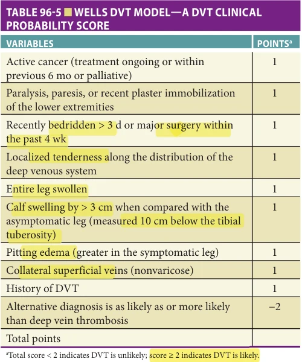

*TABLE 96-5 ■ WELLS DVT MODEL—A DVT CLINICAL PROBABILITY SCORE*

major criticism of the Wells DVT model. However, several studies have shown that when pretest probability is objectively assessed, the accuracy of DVT diagnosis is enhanced, minimizing unnecessary testing.

Laboratory testing d-Dimer is a cross-linked fibrin degradation product generated when mature thrombus is cleaved by plasmin. Levels of d-dimer are typically elevated not only in patients with acute DVT but also in other nonthrombotic conditions including advanced age, inflammation, infection, malignancy, and recent surgery, thus limiting its positive predictive value. In addition, multiple d-dimer assays exist and there is a lack of standardization with the assays, with some assays highly sensitive and some less so. Also, as d-dimer levels increase with age, older adults are more likely to have false-positive results, which lead to lower specificity for DVT diagnosis in the aging population. An age-adjusted d-dimer threshold has been proposed to improve the diagnostic accuracy in older adults, and is currently being validated prospectively before adoption into clinical practice (ClinicalTrials.gov identifier: NCT02384135).

At this time, d-dimer levels alone are insufficient to diagnose or exclude DVT and must be combined with a clinical prediction model (eg, Wells DVT model) and ultrasonography, if warranted. A low clinical probability (DVT unlikely) with a negative d-dimer result safely excludes the presence of DVT, and no further imaging study is required (Figure 96-4). A positive d-dimer result in patients with a low clinical probability for DVT necessitates further imaging to safely exclude DVT. Patients with a high clinical

**[p. 1518]**

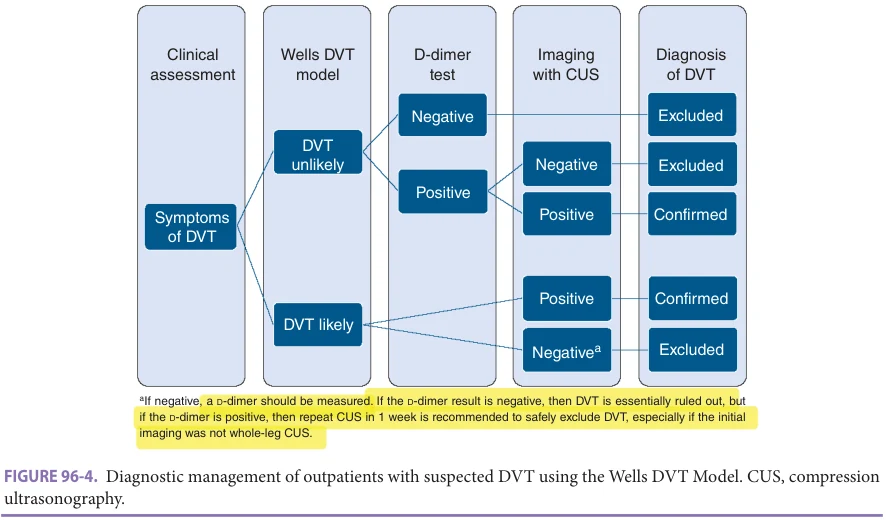

*FIGURE 96-4. Diagnostic management of outpatients with suspected DVT using the Wells DVT Model. CUS, compression ultrasonography.*

probability (DVT likely) should initially undergo compression ultrasonography (CUS); if negative, then a d-dimer should be measured. If the d-dimer result is negative, then DVT is essentially ruled out, but if the d-dimer is positive, then repeat CUS in 1 week is recommended to safely exclude DVT, especially if the initial imaging was not whole-leg CUS.

Imaging

Compression Ultrasonography Noninvasive imaging with CUS is the most widely used study to diagnose DVT. Whole-leg CUS involves imaging the entire venous network from the common femoral vein distally to the deep calf veins with external pressure applied through the ultrasound transducer to visualize complete vessel collapse. Incompressibility or partial vessel collapse anywhere along the venous network is the hallmark of an intraluminal filling defect, representative of a thrombus. Supplementary imaging techniques including color Doppler and augmentation (manually squeezing the limb) allow visualization of venous blood flow, or the lack thereof, suggestive of thrombus. Benefits of whole-leg CUS are the ability to image proximal and distal veins in a single study, eliminating the need for follow-up imaging. However, whole-leg CUS is time-consuming and highly operator dependent. A simplified, two-point CUS involves only imaging the common femoral and popliteal veins. Patients with low clinical probability (DVT unlikely) and a positive d-dimer result can safely forego anticoagulation therapy following a negative two-point CUS. However, patients with a high clinical probability (DVT likely) and a positive d-dimer should undergo serial two-point CUS approximately 1 week apart to safely exclude proximal DVT.

While whole-leg CUS is a more comprehensive examination and frequently identifies distal DVT, the majority of distal DVT will not extend proximally and will

resolve spontaneously. The overdiagnosis and overtreatment of clinically insignificant findings may increase the risk of bleeding, especially in older patients.

Magnetic Resonance Venography Magnetic resonance (MR) venography of the leg is a sensitive test to detect DVTs. However, it is not recommended for routine use as it is expensive and not widely available. It is a valuable alternative test for those in whom CUS are inconclusive or in whom CUS is not feasible, such as morbidly obese patients.

## Diagnosis of Pulmonary Embolism

Clinical prediction models The most common symptoms of acute PE reported in older adults can be nonspecific and include dyspnea, tachypnea, tachycardia, and chest pain. Symptoms of DVT (leg pain and swelling) are present in more than 40% of patients with acute PE, and simultaneous DVT is identified in up to 60% of patients diagnosed with a PE. Clinical signs including rales, accentuated pulmonic second heart sound, and jugular venous distension may be identified at presentation. Similar to DVT, these signs and symptoms are insufficient to diagnose PE, but are useful to estimate the clinical probability and guide additional testing.

Probability estimation of PE can be accomplished through several clinical prediction models, including the Wells or Geneva scores, or even clinical gestalt. The Wells score for PE has been validated in the outpatient adult population and utilizes different clinical signs and symptoms than the DVT prediction model, although still incorporating the subjective assessment of likelihood of PE, a potential limitation. The Wells PE model stratifies patients as “likely” or “unlikely” (Table 96-6) and, when combined with a d-dimer assay and computed tomographic pulmonary angiography (CTPA), provides an effective diagnostic strategy for PE.

**[p. 1519]**

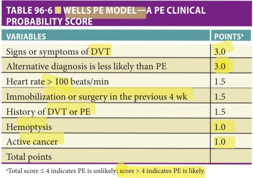

*TABLE 96-6 ■ WELLS PE MODEL—A PE CLINICAL PROBABILITY SCORE*

Laboratory testing Similar to its role in DVT evaluation, a negative d-dimer result combined with a low clinical probability (PE unlikely) can safely exclude the diagnosis of PE. Conversely, a positive d-dimer result must be followed up with an imaging study. The use of an age-adjusted d-dimer threshold has been prospectively validated in outpatients 50 years or older and was found to increase the diagnostic utility of the test. The age-adjusted threshold is equal to age (in years) × 10 μg/L (using d-dimer assays with a cutoff of 500 μg/L). Depending on the type of d-dimer assay used at each institution, this may not be generalizable for use.

Imaging

Chest Radiography The diagnostic utility of chest radiography in suspected PE is primarily to exclude other causes of dyspnea and hypoxemia (ie, pneumothorax or pneumonia), as most chest radiographs are normal with an acute PE. Identifiable signs of PE on chest radiography include oligemia (Westermark sign), a focal area of decreased perfusion of pulmonary vessels distal to the PE; wedge-shaped pleural-based opacity (Hampton hump) representative of a pulmonary infarct; and hilar enlargement, due to thrombus impaction and pulmonary artery engorgement.

Ventilation-Perfusion Lung Scanning Prior to widespread adoption of computed tomographic pulmonary angiography (CTPA), ventilation-perfusion (V/Q) lung scanning was the most reliable noninvasive imaging modality to diagnose PE. Many factors have contributed to its declining use including lack of availability at some institutions, time needed to perform an examination, and frequently encountered nonspecific test results. However, V/Q lung scanning remains clinically useful in older patients with renal insufficiency or contrast allergy, or when attempting to minimize external beam radiation to the chest of young women.

In suspected PE, the performance characteristics of lung scanning improve when paired with a normal chest radiograph and pretest probability assessment. For example, a patient with high clinical probability (PE likely) and a high probability scan has a 96% likelihood of having PE, whereas a low clinical probability (PE unlikely) paired with a low probability scan has a 4% likelihood of

having PE; a normal perfusion scan essentially excludes PE. Unfortunately, the majority of patients presenting with suspected PE will have nondiagnostic imaging and require additional evaluation. The increased prevalence of abnormal chest radiographs and high clinical probability of PE in older adults further limit the utility of V/Q lung scanning.

Computed Tomographic Pulmonary Angiography Widespread availability and technological advances have made CTPA the primary imaging modality for suspected PE, except when contraindicated (severe renal insufficiency or contrast allergy). The advent of multidetector CT scanners’ spatial and temporal resolution has improved, increasing the sensitivity for PE diagnosis. Although the increased use of CTPA and the addition of more detectors have resulted in greater recognition of PE, a corresponding decline in mortality has not been seen, raising doubts about the clinical significance of subsegmental PE.

To minimize the number of unnecessary imaging studies and potential overtreatment of clinically insignificant PE, CTPA should be paired with clinical prediction models and d-dimer testing. Outpatients with low clinical probability (PE unlikely) and a negative d-dimer can safely avoid further imaging. Outpatients with a low clinical probability for PE and a positive d-dimer test and any patient with a high clinical probability for PE (PE likely) need to undergo imaging studies.

Additional benefits of CTPA over other imaging modalities are its abilities to simultaneously diagnose PE and detect right ventricular dilation (useful in risk stratification) and to identify alternative diagnoses when PE is not present, which is especially useful in older adults with atypical presentations.

## Treatment of Venous Thromboembolism

Home treatment vs hospital treatment For patients with newly diagnosed uncomplicated DVT, home treatment is generally recommended. As compared to hospital treatment, treating patients with DVT at home was demonstrated to reduce the risk of PE, subsequent DVT, and major bleeding. However, older patients with multiple comorbidities that may require hospitalization, or at high risk for anticoagulant-related bleeding, may be more appropriately treated in the hospital. Socioeconomic factors, such as limited financial or home support, may also require hospital treatment for the initial management.

Similarly, patients with newly diagnosed PE at low risk for complications may be treated at home effectively and safely. The difficulty is in determining which patients are appropriate for outpatient treatment. The Pulmonary Embolism Severity Index (PESI) and simplified PESI, both clinical prediction score for PE severity, are the bestvalidated scoring systems. Points are assigned based on age, vital signs, and medical history to determine risk of 30-day mortality. Yet, clinical judgement is needed as other factors, including comorbidities, high risk for anticoagulant-related

**[p. 1520]**

bleeding, and socioeconomic factors, may require inpatient management for the initial phase of treatment.

Choice of anticoagulant therapy Initial VTE treatment requires an anticoagulant with a rapid onset of action to reduce thrombus extension, recurrence, or embolization. This can be accomplished through parenteral anticoagulants such as unfractionated heparin (UFH) or low-molecular-weight heparin (LMWH), or the use of selected direct oral anticoagulants (DOACs) (rivaroxaban and apixaban).

UFH use is declining for VTE treatment; however, it remains useful in patients with renal insufficiency or high bleeding risk where rapid reversal may be needed, conditions commonly encountered in older adults. UFH may be administered as a continuous infusion or subcutaneously in doses sufficient to achieve therapeutic levels. Intravenous administration typically begins with a bolus dose of 80 U/kg followed by a continuous infusion of 18 U/kg/h. Close laboratory monitoring (every 6 hours until stable) is essential to ensure the desired therapeutic effect and to minimize bleeding. Monitoring is done with either the activated partial thromboplastin time (aPTT) or an antifactor Xa (anti-Xa) activity assay. Expert consensus recommends a therapeutic heparin range of 0.35 to 0.7 U/mL measured by anti-Xa activity, which is typically 1.5 to 2.5 times the control aPTT. Alternatively, and less commonly used, short courses of fixed-dose subcutaneous UFH (333 U/kg load, then 250 U/kg every 12 hours) may be safely used in some patients for initial treatment and without laboratory monitoring.

Subcutaneous LMWH has more predictable pharmacology than UFH infusions. This allows outpatient VTE treatment with fixed, weight-based doses without routine laboratory monitoring in select patients. When compared to UFH for VTE treatment, LMWH is associated with fewer thrombotic complications, less major bleeding, and a mortality benefit.

Oral anticoagulant therapy with warfarin (a vitamin K antagonist) was the cornerstone of VTE treatment for nearly 60 years, until the introduction of DOACs. Warfarin initiation must be overlapped with a parenteral anticoagulant (UFH or LMWH) for a minimum of 5 days, and until the international normalized ratio (INR) is greater than 2.0 for at least 24 hours, due to its delayed anticoagulant effect. Warfarin’s narrow therapeutic window (INR 2.0–3.0) and numerous food and drug interactions necessitate routine INR monitoring for the duration of therapy. Close INR monitoring is especially important in older adults. Aging is associated with alterations in some vitamin K–dependent coagulation factors, and older adults typically have increased sensitivity to the anticoagulant effects of warfarin. In addition, older adults usually have a higher prevalence of polypharmacy which can increase the risk of major bleeding.

DOACs represent a new class of anticoagulants targeting specific sites within the coagulation cascade (Table 96-7). Dabigatran is a direct thrombin inhibitor that

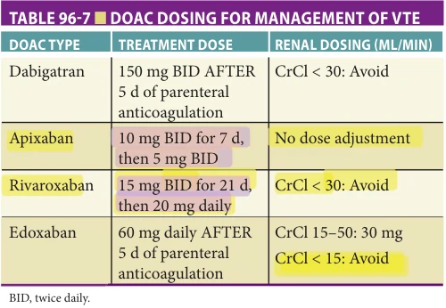

*TABLE 96-7 ■ DOAC DOSING FOR MANAGEMENT OF VTE*

competitively binds to soluble and fibrin-bound thrombin, inhibiting the conversion of fibrinogen to fibrin and subsequent thrombus formation. Rivaroxaban, apixaban, and edoxaban are factor Xa inhibitors that selectively block the active site of factor Xa, inhibiting the coagulation cascade without the use of a cofactor (antithrombin). Both dabigatran and edoxaban require an initial 5-day course of parenteral anticoagulant (UFH or LMWH) prior to DOAC initiation, whereas rivaroxaban and apixaban can be initiated immediately. Although there are no dedicated randomized trials in the older adult population, a meta-analysis of data extracted from the landmark phase III trials (RE-COVER I-II, EINSTEIN DVT-PE, AMPLIFY and HOKUSAI) for a subgroup of patient 75 years or older demonstrated that DOACs were more effective in preventing VTE recurrence (risk ratio for recurrence 0.55, 95% confidence interval [CI] 0.38–0.82) and were associated with a reduced risk of major bleeding (relative risk ratio 0.39, 95% CI 0.17–0.90) compared to warfarin. Additional appealing attributes of the DOACs compared to warfarin include fewer drug interactions and more predictable pharmacokinetics, thus eliminating the need for routine laboratory monitoring.

Thrombolytic therapy Given the high mortality in patients presenting with acute PE with hemodynamic compromise, defined as a systolic blood pressure less than 90 mm Hg or a decrease in systolic blood pressure greater than or equal to 40 mm Hg from baseline, the use of systemic thrombolysis may be warranted. Catheter-directed thrombolysis (CDT) is an alternative for patients with an intermediate risk for bleeding as the total dose of thrombolytic delivered by CDT is lower. The role of thrombolytics for patients with submassive PE (evidence of right ventricular dysfunction without hemodynamic compromise) is less clear. The PEITHO study found a reduction in hemodynamic decompensation without a mortality benefit, but at the cost of marked increases in major bleeding and hemorrhagic strokes. Particularly, patients older than 75 years suffered significantly more major bleeding events than younger patients. Additionally, as age greater than 75 is considered a relative contraindication to thrombolytic

**[p. 1521]**

therapy in general, thrombolytics currently have a limited role in older adults.

Typically, CDT of acute proximal DVT to reduce the risk of PTS is not recommended. In the ATTRACT trial, the addition of CDT to anticoagulation for acute proximal DVT did not result in a lower risk of PTS (risk ratio, 0.96; 95% CI, 0.82 to 1.11), but did result in a higher risk of major bleeding within 10 days (1.7% vs 0.3% of patients). A subgroup analysis of patients with acute iliofemoral DVT in the ATTRACT trial also showed no difference in PTS occurrence at 2 years but found that CDT led to greater reduction in leg pain and swelling, and improved quality of life. In contrast, the CaVenT study found that patients with iliofemoral DVT and low bleeding risk who underwent CDT demonstrated an absolute risk reduction of 14.4% in development of PTS at 2 years. No difference in clinical symptoms was evident at 6 months. This highlights the importance of proper patient selection as CDT may be reasonable in selected younger patients at low risk of bleeding with symptomatic iliofemoral DVT. Additionally, as both studies excluded patients older than 75 years, further studies are needed to determine the relative safety and efficacy of these strategies in older adults.

Duration of anticoagulant therapy The duration of anticoagulant therapy is determined by balancing the thromboembolic risk with the bleeding risk. In general, VTE provoked by a transient (ie, reversible) risk factor such as surgery or trauma is associated with a low risk of recurrence, and a 3-month treatment course is sufficient. VTE without identifiable risk factors (ie, unprovoked) is associated with nearly 20% risk of recurrence at 2 years, and 30% risk of recurrence at 8 years. As such, extended anticoagulant therapy (> 3 months) is reserved for unprovoked VTE with low-moderate bleeding risk and recurrent unprovoked VTE with high bleeding risk. The decision to continue long-term anticoagulant therapy must be periodically revisited (ie, annually) to determine the net clinical benefit, especially in older patients who are at increased risk for VTE and bleeding complications.

Anticoagulant Use in Older Adults The use of anticoagulants in the management of VTE increase the risk of bleeding. Older adults who are anticoagulated have a 3% to 5% risk per year of having a major bleeding event as compared to younger subjects (1%–2% per year). This relative risk increase depends to some degree among the patient group being studied, the anticoagulant class, and most importantly, the presence or absence of comorbidities such as chronic kidney disease, uncontrolled hypertension, a history of bleeding, liver disease, concomitant antiplatelet agent or nonsteroidal anti-inflammatory drug (NSAID) use, and others. This increased bleeding risk presents a challenging clinical dilemma for practitioners as older patients, while having an increased bleeding risk, also have a significantly higher risk of VTE recurrence. As such, a baseline assessment of bleeding risk, measurement

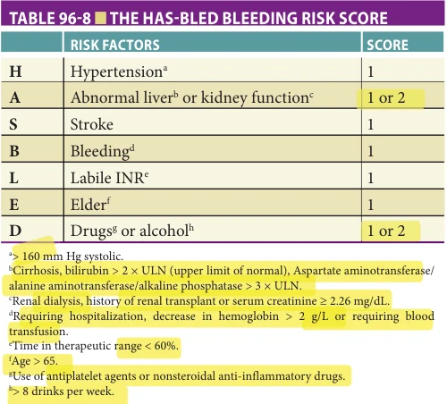

*TABLE 96-8 ■ THE HAS-BLED BLEEDING RISK SCORE*

of renal and liver function and platelet count, and a thorough medication review are essential prior to anticoagulation initiation and periodically while on anticoagulation.

Assessment and Management of Bleeding Risk in Older Adults on Anticoagulants Various bleeding risk prediction tools (eg, ACCP risk table, VTE-BLEED, RIETE, HAS-BLED) have been published, and the reader is referred to several recent reviews for more detailed information on the topic. The HAS-BLED score is probably the best validated and most utilized risk estimation tool for major bleeding, particularly for patients with atrial fibrillation (AF) treated with VKA (Table 96-8). Evaluation of HAS-BLED in the VTE population and in patients treated with DOACs has been limited to small cohort studies. Additionally, the HAS-BLED score includes the item “labile INR,” which is not relevant if DOACs are the choice of anticoagulant. As a result, these bleeding risk prediction tools should not be used to exclude patients from anticoagulant therapy, but rather to identify and eliminate modifiable bleeding risk factors (Table 96-9).

Other strategies to reduce the risk of bleeding in older adults prescribed anticoagulants include a thorough medication reconciliation to identify concomitantly prescribed medications that might interact with an anticoagulant or increase the risk of bleeding. In addition, patients, family members, and caregivers should receive comprehensive education on anticoagulants as insufficient education may increase the risk of bleeding. Referral to a Thrombosis Clinic for education and monitoring may improve compliance and the therapeutic time in range (if on a VKA) while also preventing avoidable medication interactions. These specialty anticoagulation clinics may also have a valuable role in following patients on DOACs by providing regular patient follow-up, counseling, education, and laboratory monitoring (eg, for early identification of renal dysfunction where a switch in choice of anticoagulant may be needed).

**[p. 1522]**

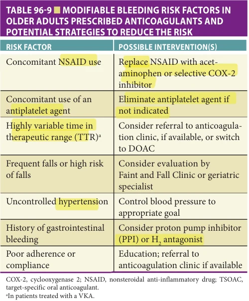

*TABLE 96-9 ■ MODIFIABLE BLEEDING RISK FACTORS IN OLDER ADULTS PRESCRIBED ANTICOAGULANTS AND POTENTIAL STRATEGIES TO REDUCE THE RISK*

Reversal Agents for Anticoagulants Heparin and to some extent, LMWH can be reversed with protamine. The anticoagulant effect of warfarin can be reversed using vitamin K (takes ~24 hours) or four-factor prothrombin complex concentrates (PCC) (eg, KCentra) if immediate reversal is required. Idarucizumab is a humanized monoclonal antibody fragment that binds to dabigatran with a higher affinity than its affinity to thrombin, thus effectively neutralizing its anticoagulant effect. It was approved by the Food and Drug Administration (FDA) in 2015 for use in patients treated with dabigatran presenting with life-threatening or uncontrolled bleeding, or those requiring emergency surgery or urgent procedures. Andexanet alfa, a modified human factor Xa decoy protein that binds and sequesters factor Xa inhibitors, received accelerated FDA approval in 2018 for the reversal of rivaroxaban or apixaban due to life-threatening or uncontrolled bleeding. Despite its regulatory approval, andexanet alfa is not yet widely available in hospital formularies due to concerns about its efficacy and financial cost. Given the uncertainty of its clinical benefit, the FDA mandated a postmarketing randomized clinical trial of andexanet alfa against usual care (typically four-factor PCC) that is currently recruiting (ClinicalTrials.gov identifier: NCT03661528).

Primary VTE Prophylaxis Extensive clinical practice guidelines have been published by professional societies addressing a wide range of

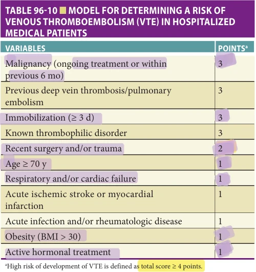

*TABLE 96-10 ■ MODEL FOR DETERMINING A RISK OF VENOUS THROMBOEMBOLISM (VTE) IN HOSPITALIZED MEDICAL PATIENTS*

indications for VTE prophylaxis and should be referenced for detailed guidance. In general, all hospitalized patients should be evaluated for VTE prophylaxis on an individualized basis. Clinical scoring systems exist to guide these decisions for medical and surgical patients. For example, in medical patients, the Padua Prediction Score (Table 96-10) incorporates intrinsic factors and acute physiologic condition, with points assigned on a weighted scale. A cumulative score greater than or equal to 4 points is considered high risk and is associated with a 32-fold increased incidence of VTE compared to a low-risk score, which is less than 4 points. When the VTE risk is high and pharmacologic prophylaxis is being considered, bleeding risk must also be estimated. Although, bleeding risk scoring systems to guide VTE prophylaxis are not well developed or validated, active peptic ulcer disease, thrombocytopenia (platelets < 50 k/μL), and age greater than 85 are considered to carry excessive bleeding risk and may preclude pharmacologic prophylaxis.

The choice of pharmacologic and/or mechanical prophylaxis depends on the clinical situation and provider assessment. Pharmacologic agents are generally more effective than mechanical devices and currently approved regimens include low-dose UFH, LMWH, fondaparinux, dose-adjusted warfarin, apixaban, rivaroxaban, and aspirin. Mechanical prophylaxis relies on intermittent pneumatic compression devices or graduated compression stockings to minimize venous stasis and is either used in conjunction with pharmacologic agents for high-risk indications (ie, post–total hip/knee arthroplasty or hip fracture surgery) or as a stand alone method when bleeding risk is high and pharmacologic prophylaxis is contraindicated.

**[p. 1523]**

Conclusion Age-related physiologic changes and accumulation of comorbidities increase both the risk of bleeding and VTE in older adults. As anticoagulant therapy remains the cornerstone of VTE treatment, screening for and targeting of modifiable risk factors for major bleeding is essential. Given the advantages of DOACs compared with warfarin, and the availability of DOAC-specific reversal agents, it is anticipated that the use of DOACs in older adults will continue to rise. Dedicated

## FURTHER READING

Anderson DR, Morgano GP, Bennett C, et al. American

Society of Hematology 2019 guidelines for management of venous thromboembolism: prevention of venous thromboembolism in surgical hospitalized patients. Blood Adv. 2019;3(23):3898–3944. Bethishou L, Gregorian T, Won K, et al. Management of

venous thromboembolism in the elderly: a review of the non-vitamin K oral anticoagulants. Consult Pharm. 2018;33:248–261. Brown JD, Goodin AJ, Lip GYH, et al. Risk stratification for

bleeding complications in patients with venous thromboembolism: application of the HAS-BLED bleeding score during the first 6 months of anticoagulant treatment. J Am Heart Assoc. 2018;7(6):e007901. Chan NC, Eikelboom JW. How I manage anticoagulant ther-

apy in older individuals with atrial fibrillation or venous thromboembolism. Blood. 2019;133(21):2269–2278. Chopard R, Albertsen IE, Piazza G. Diagnosis and treat-

ment of lower extremity venous thromboembolism: a review. JAMA. 2020;324(17):1765–1776. Donze J, Clair C, Hug B, et al. Risk of falls and major bleeds

in patients on oral anticoagulation therapy. Am J Med. 2012;125(8):773–778. Engbers MJ, van Hylckama Vlieg A, Rosendaal FR. Venous

thrombosis in the elderly: incidence, risk factors and risk groups. J Thromb Haemost. 2010;8(10):2105–2112. Favaloro EJ, Franchini M, Lippi G, et al. Aging hemo-

stasis: changes to laboratory markers of hemostasis as we age—a narrative review. Semin Thromb Hemost. 2014;40(06):621–633. Geldhof V, Vandenbriele C, Verhamme P, et al. Venous

thromboembolism in the elderly: efficacy and safety of non-VKA oral anticoagulants. Thromb J. 2014;12:21. Hisada Y, Mackman N. Cancer-associated pathways and biomarkers of venous thrombosis. Blood. 2017;130:1499–1506. Kahn SR, Comerota AJ, Cushman M, et al. The postthrombotic

syndrome: evidence-based prevention, diagnosis, and treatment strategies: a scientific statement from the American Heart Association. Circulation. 2014;130:1636–1661.

anticoagulation clinics play a valuable role in mitigating the risk of bleeding in older adults prescribed anticoagulants by providing regular follow-up, counseling, and education.

## ACKNOWLEDGMENTS

The author acknowledges Dr. Stacy Johnson and Dr. Matthew Rondina for their prior contributions to this chapter in the 7th edition of this textbook.

Kearon C. Natural history of venous thromboembolism.

Circulation. 2003;107(23 suppl 1):I22–I30. Kearon C, Akl EA. Duration of anticoagulant therapy for

deep vein thrombosis and pulmonary embolism. Blood. 2014;123(12):1794–1801. Klok FA, Huisman MV. How I assess and manage the risk

of bleeding in patients treated for venous thromboembolism. Blood. 2020;135(10):724–734. Kruse-Jarres R, Kempton CL, Baudo F, et al. Acquired

hemophilia A: updated review of evidence and treatment guidance. Am J Hematol. 2017;92:695–705. Lim W, Le Gal G, Bates SM, et al. American Society of

Hematology 2018 guidelines for management of venous thromboembolism: diagnosis of venous thromboembolism. Blood Adv. 2018;2(22):3226–3256. Neunert C, Terrell DR, Arnold DM, et al. American Society

of Hematology 2019 guidelines for immune thrombocytopenia. Blood Adv. 2019;3(23):3829–3866. Ortel TL, Neumann I, Ageno W, et al. American Society of

Hematology 2020 guidelines for management of venous thromboembolism: treatment of deep vein thrombosis and pulmonary embolism. Blood Adv. 2020;4(19): 4693–4738. Righini M, Van Es J, Den Exter PL, et al. Age-adjusted

D-Dimer cutoff levels to rule out pulmonary embolism: The ADJUST-PE Study. JAMA. 2014;311(11): 1117–1124. Rodeghiero F, Stasi R, Gernsheimer T, et al. Standardiza-

tion of terminology, definitions and outcome criteria in immune thrombocytopenic purpura of adults and children: report from an international working group. Blood. 2009;113(11):2386–2393. Schünemann HJ, Cushman M, Burnett AE, et al. American

Society of Hematology 2018 guidelines for management of venous thromboembolism: prophylaxis for hospitalized and nonhospitalized medical patients. Blood Adv. 2018;2(22):3198–3225. Tritschler T, Kraaijpoel N, Le Gal G, et al. Venous thrombo-

embolism: advances in diagnosis and treatment. JAMA. 2018;320(15):1583–1594.

**[p. 1524]**

van Belle A, Buller HR, Huisman MV, et al. Effectiveness of

managing suspected pulmonary embolism using an algorithm combining clinical probability, D-dimer testing, and computed tomography. JAMA. 2006;295(2):172–179. Warkentin TE. Laboratory diagnosis of heparin-induced

thrombocytopenia. Int J Lab Hematol. 2019;41 (Suppl 1): 15–25.

Wells PS, Anderson DR, Rodger M, et al. Evaluation of

D-dimer in the diagnosis of suspected deep-vein thrombosis. N Engl J Med. 2003;349(13):1227–1235. Wells PS, Ihaddadene R, Reilly A, et al. Diagnosis of venous

thromboembolism: 20 years of progress. Ann Intern Med. 2018;168:131–140.
