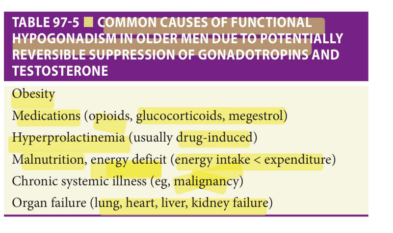
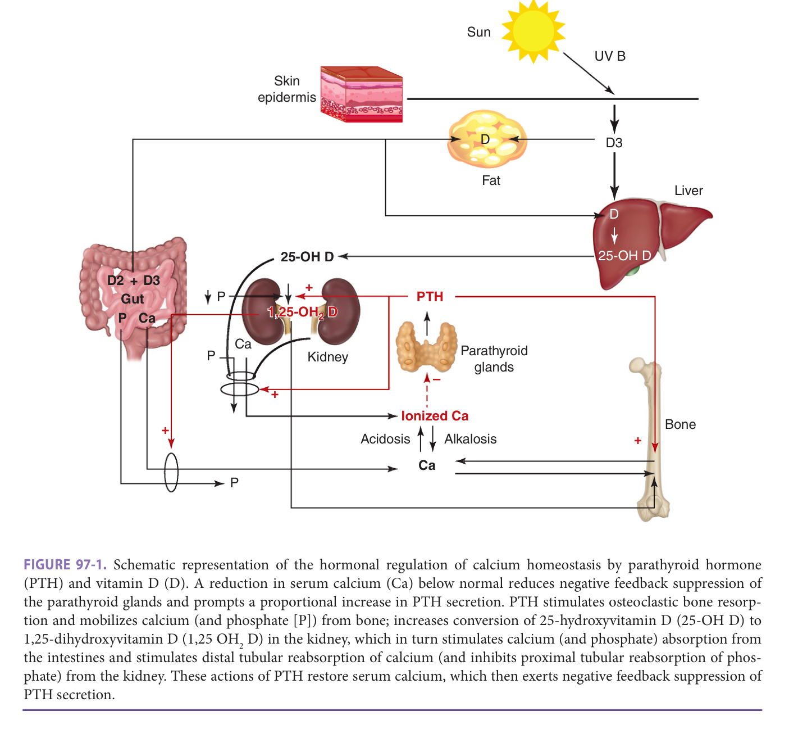
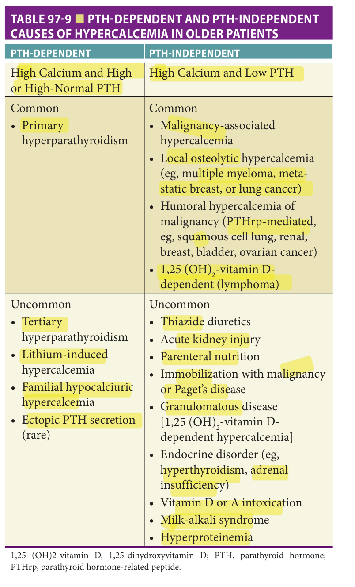
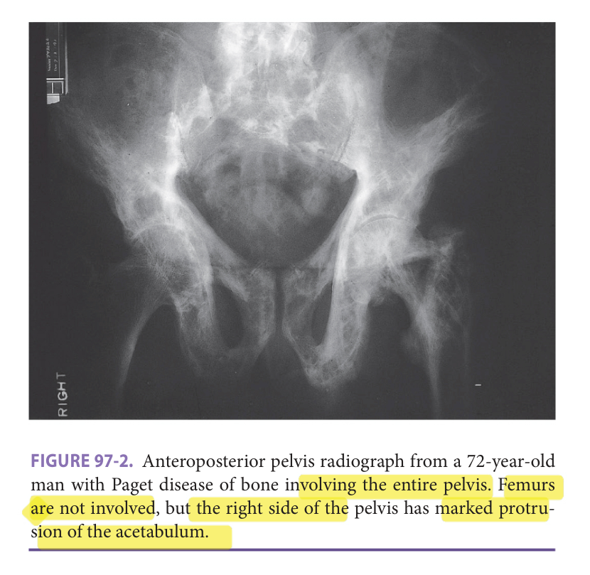
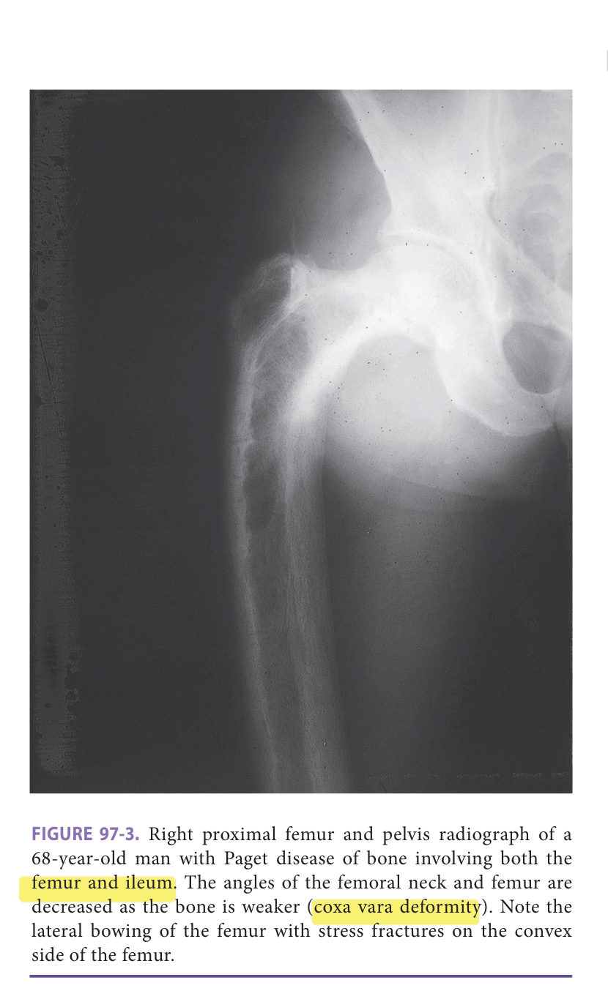

# Hazzard's Geriatric Medicine and Gerontology, 8e — Chapter 97: Aging of the Endocrine System and Non-Thyroid Endocrine Disorders

Bradley D. Anawalt, Alvin M. Matsumoto

> **Lane-reviewed against the book, 25 Sep 2026.**

**[p. 1525]**

#### Learning Objectives

- Understand the presenting manifestations of common endocrinopathies in older patients.
- Describe the initial diagnostic evaluation and fundamentals of management of common endocrinopathies in older patients.
- Identify when to consult and how to optimize the collaboration with endocrinologists.

#### Key Clinical Points

**Pituitary Disorders**

1. Mild hyperprolactinemia (serum prolactin 20–50 ng/mL) is common in older people and seldom needs treatment, but primary hypothyroidism should be excluded.
2. Patients with moderate to severe hyperprolactinemia should be referred to an endocrinologist.
3. Serum pituitary hormone concentrations may be inappropriately or even slightly elevated in patients with hypopituitarism.
4. Older patients with diabetes insipidus often have concomitant impaired thirst and are best managed in collaboration with an endocrinologist.

**Adrenal Disorders**

1. Older patients are particularly prone to suffer fragility fractures and sarcopenia due to Cushing syndrome.
2. The most common cause of Cushing syndrome in older patients is iatrogenic.
3. The most common cause of adrenal insufficiency in older patients is a rapid discontinuation of chronic glucocorticoid therapy.
4. The sole or primary manifestation of adrenal insufficiency in older patients may be weakness, weight loss, anorexia, or chronic nausea.
5. It is essential that patients with adrenal insufficiency take the equivalent of 60 mg hydrocortisone daily (triple the usual daily replacement dosage) for a febrile illness and are able to administer intramuscular hydrocortisone if they cannot take oral medications due to illness.
6. Patients on chronic corticosteroid therapy (3 months or more) must have their corticosteroid dosage reduced slowly to avoid acute adrenal insufficiency. An endocrinologist may be helpful to manage this taper.
7. Patients with an adrenal incidentaloma should be evaluated for pheochromocytoma and malignancy.
8. Older patients with hypertension that requires three or more antihypertensive medications or with hypertension and spontaneous hypokalemia should be evaluated for primary aldosteronism with measurement of plasma aldosterone and renin.

**Gonadal Disorders**

1. The diagnosis of male hypogonadism requires symptoms or signs of androgen deficiency as well as low testosterone concentrations measured in two or more blood samples obtained between 7 AM to 10 PM on different days.
2. Older men on testosterone therapy should be assessed for erythrocytosis 3 to 6 months after any increased dosage and annually thereafter.

**Calcium and Bone Disorders (also see Chapter 51)**

1. Parathyroid surgery should be considered in older patients with symptoms of hypercalcemia, serum calcium greater than 1 mg/dL above the upper limit of normal, chronic kidney disease, nephrolithiasis, or hypercalciuria.
2. Vitamin D deficiency is defined by serum 25-hydroxyvitamin D less than 30 ng/mL in older patients.
3. Paget disease should be considered in patients with isolated elevated serum alkaline phosphatase concentrations or characteristic radiographic findings of focal lytic and sclerotic areas. Patients with significant bone pain or (potential) complications including joint involvement or potential neurologic sequelae may be treated with zoledronic acid (often as a single dose).

## Geriatric Endocrinology

The clinical presentation, laboratory confirmation, and treatment of endocrine disorders may present challenges in older compared to young persons.

### Clinical Presentation

The symptoms and signs of endocrine disorders are often nonspecific and attributed to “old age” by geriatric patients. Clinical manifestations may also be altered, muted, or masked by age-associated comorbid illnesses and increased use of medications. For example, cardiovascular (eg, heart failure and atrial fibrillation) and neurobehavioral (eg, cognitive impairment and depression) manifestations of thyroid disease occur more frequently and are often the most prominent features in older patients compared to younger patients (see Chapter 98 for details). Clinically significant endocrinopathies may present with atypical manifestations and physical examination findings may differ in older patients (the best examples are thyroid diseases per Chapter 98). Older patients with endocrine disorders may present with geriatric syndromes (eg, falls or functional or cognitive impairment) and some disorders occur almost exclusively in older patients, for example, nonketotic diabetic hyperosmolar hyperglycemia and anaplastic thyroid cancer.

### Laboratory Confirmation

Confirmation of endocrine diagnoses in older persons relies on laboratory measurements of hormone concentrations. Most clinical studies of endocrine dysfunction in older patients are defined as hormone values above or below reference ranges in healthy young individuals, rather than age-specific ranges. For example, hypogonadism in older men is defined by serum testosterone concentrations

**[p. 1526]**
below those of healthy young men. In contrast, the distribution of serum thyrotropin concentrations is higher in older persons (see Chapter 98), suggesting that the upper limit of thyrotropin concentrations is higher, for example, 7 to 8 mIU/L, (particularly in those 80 years and older) than in younger individuals.

The clinical significance of mild abnormalities of serum hormone concentrations, subclinical endocrine dysfunction, is common in older patients but their clinical significance is unclear. It is important that geriatricians recognize that hormone levels may be affected transiently by illnesses (eg, slight thyrotropin elevation during recovery from acute illness) and medications (eg, suppression of gonadotropin and testosterone levels by opioids). Therefore, it is crucial to repeat hormone testing in older patients with mild endocrine laboratory abnormalities when baseline health status is restored fully.

### Treatment

In older patients with clinical endocrine deficiency, the dosage of hormone replacement may be lower than in young patients because the metabolic clearance of some hormones is reduced with aging (eg, thyroid hormone, hydrocortisone, and testosterone). It is important to appreciate that underlying age-related conditions may be worsened by hormone overtreatment (eg, worsening of osteoporosis with excessive glucocorticoid or thyroid hormone therapy). For hormone replacement, starting treatment at slightly lower than full hormone replacement dosages is appropriate (eg, lower dosages of testosterone to avoid erythrocytosis that occurs more frequently with full replacement dosages). Multimorbidity and polypharmacy may predispose older patients to poor medication adherence and adverse drug effects or interactions.

The management of older persons with endocrine disorders should focus on improvement in function and quality of life within the social context of the patient; this might require multidisciplinary care in consultation with an endocrinologist. Some older patients may request hormone therapy (eg, testosterone, growth hormone, dehydroepiandrosterone [DHEA]) as a rejuvenation remedy to reverse the

**[p. 1527]**

symptoms and signs of aging. It is important for geriatricians to dispel this myth, educate patients about realistic goals of treatment, and avoid initiation of hormone therapy trials for mild or subclinical endocrine dysfunction with the false expectation of dramatic clinical improvements.

In this chapter, we review the geriatrician’s approach to the evaluation and management of the most common nonthyroid endocrine disorders that occur in patients 65 years or older. Even when the geriatrician refers a patient to an endocrinologist for recommendations, the geriatrician plays an indispensable role in providing information about the goals of therapy based on the patient’s quality of life, functional status, other comorbidities, and personal/family preferences.

## Anterior Pituitary

The two most common anterior pituitary endocrine disorders that geriatricians will encounter or manage are hyperprolactinemia and pituitary incidentalomas. In addition, the geriatrician may occasionally have a patient with an established or new diagnosis of hypopituitarism. The geriatrician should understand the basic management of these disorders and when to consult an endocrinologist.

### Hyperprolactinemia

**Physiology and presentation** Prolactin has two established physiologic effects: induction of lactation and suppression of gonadotropin secretion from the pituitary. Lactation requires estrogen, and only premenopausal women typically have high enough circulating estradiol concentrations for lactation. Thus, lactation due to hyperprolactinemia is very rare in men and postmenopausal women. Prolactin is tonically secreted from the anterior pituitary, and it is regulated primarily by negative feedback from dopamine that is secreted by the hypothalamus into the hypothalamic-pituitary portal venous system. Any process that stimulates the nipple or the peri-areolar chest wall (rubbing, suckling, or infectious processes) may induce prolactin release via a neurologic pathway. Finally, exercise, sleep, and acute physiologic or psychological stress may stimulate prolactin secretion and may result in mildly elevated serum prolactin concentrations.

There are three common settings when a geriatrician may encounter hyperprolactinemia in older patients. Older men commonly have low to low-normal serum testosterone concentrations and inappropriately normal serum FSH and LH concentrations, a biochemical pattern consistent with secondary hypogonadism. Serum prolactin is often measured in that setting, and it might be elevated. Older women and men may present with pituitary tumors that are discovered during brain imaging, and evaluation may include measurement of serum prolactin. Finally, serum prolactin is sometimes measured and found to be elevated in some clinical settings when serum prolactin measurement is not indicated (eg, erectile dysfunction without any evidence of endocrinopathy).

**Epidemiology and causes** There are not good data on the prevalence of hyperprolactinemia in the general population or in older people, but the overall incidence of hyperprolactinemia appears to be about 0.1 per 100 patient-years in people 65 years or older. The incidence and prevalence appear to be increasing over the past three decades, but that likely reflects increased testing of serum prolactin. The data are based on surveys of patients at higher risk of hyperprolactinemia (eg, cohorts of patients taking psychoactive drugs or retrospective studies of databases that include patients who have had a serum prolactin measured). The prevalence of hyperprolactinemia is similar in older women and men.

The causes of hyperprolactinemia may be categorized by the physiology of prolactin secretion and clearance ( **Table 97-1** ). Conditions that disrupt the normal negative feedback of dopamine on prolactin secretion include antidopaminergic drugs and large pituitary tumors that impinge on the pituitary stalk and pituitary portal venous system. Thyrotropin-releasing hormone (TRH) also stimulates the release of prolactin from the anterior pituitary. Moderate to severe primary hypothyroidism that results in high portal venous TRH concentrations (and high peripheral circulating thyrotropin [TSH] concentrations) may cause hyperprolactinemia. Because prolactin is cleared from the circulation by the kidney, moderate to severe kidney injury is a cause of hyperprolactinemia. Another cause of decreased clearance of prolactin is the presence of antibodies that aggregate with prolactin; this aggregation of antibodies and prolactin is known as “macroprolactin.” The prevalence of anti-prolactin antibodies and macroprolactinemia is common and increases with age, and there are assay methodologies for detecting macroprolactin. Because the

**Table 97-1 — Common causes of hyperprolactinemia**

- *Loss of inhibition of negative feedback on prolactin secretion*: drugs (eg, psychoactive drugs); pituitary disorders (eg, pituitary tumor ≥ 1 cm)
- *Increased prolactin secretion due to increased production*: primary hypothyroidism; prolactinoma
- *Increased prolactin secretion due to decreased clearance of serum prolactin*: kidney injury
- *Idiopathic*
- *Physiological causes of hyperprolactinemia*a: physical or psychological stress; exercise; sleep; nipple stimulation

aPhysiologic causes are associated mild hyperprolactinemia (< 50 ng/mL).

**[p. 1528]**

measurement of macroprolactin does not alter the management of hyperprolactinemia in most older patients, it is not useful to measure macroprolactin routinely in the evaluation of hyperprolactinemia in older people.

There are no known adverse effects of hyperprolactinemia per se in postmenopausal women.

Although there has been some speculation about direct adverse effects of prolactin on sexual function independent of effects on gonadal function, there has been no convincing evidence to support this hypothesis. Thus, measurement of prolactin is generally performed in older men with suspected hypogonadotropic hypogonadism and older men and women with a large pituitary mass (to determine if the tumor is a prolactinoma).

**Evaluation and management** The key factors for the evaluation and management of hyperprolactinemia in patients 65 years or older are the overall health and likely longevity of the patient, male sex, the presence or absence of hypogonadotropic hypogonadism, and whether the hyperprolactinemia is mild, moderate, or severe.

Patients 65 years or older with mild hyperprolactinemia (20–50 ng/mL) will not generally benefit from therapy directed at lowering the serum prolactin. As noted above, hypogonadotropic hypogonadism (causing testosterone deficiency and reduced fertility) is the single significant adverse sequela known to be directly related to hyperprolactinemia. Women and eugonadal men 65 years or older therefore will not benefit from resolution of mild hyperprolactinemia, but they should be assessed for primary hypothyroidism with a serum TSH. Serum prolactin measurement should be repeated when the patient has been sitting quietly for 15 minutes because mild hyperprolactinemia might be due to the stress of venipuncture. The patient’s medication list should be reviewed for prescription and over-the-counter medications associated with hyperprolactinemia, but it is not necessary to discontinue a medication that is suspected to be the cause of mild hyperprolactinemia ( **Table 97-2** ). Mild hyperprolactinemia rarely causes hypogonadotropic hypogonadism in men. In men 65 years or older with hypogonadotropic hypogonadism and mild hyperprolactinemia, another cause of hypogonadotropic hypogonadism should be considered, and the geriatrician should refer those men to an endocrinologist.

Patients 65 years or older with modest hyperprolactinemia (serum prolactin 50–250 ng/mL) typically have a prolactinoma or more than one cause of hyperprolactinemia (eg, two medications that are associated with hyperprolactinemia). These patients should be referred to an endocrinologist who may evaluate other anterior pituitary function including the thyroid and gonadal axes and may order sellar imaging to ensure that the patient does not have a large pituitary tumor or other disease that affects prolactin secretion.

Virtually all patients 65 years or older with severe hyperprolactinemia (serum prolactin > 250 ng/mL) have a large prolactinoma. These patients should be referred to an endocrinologist to assess anterior pituitary function and sellar imaging. As with the evaluation of moderate hyperprolactinemia, the most important element of the evaluation of severe hyperprolactinemia is to determine if there is a large sellar mass or other pituitary pathology that requires treatment. It is not the hyperprolactinemia per se that requires management.

Optimal management of hyperprolactinemia necessitates collaboration between the geriatrician and an endocrinologist. The treatment of hyperprolactinemia depends upon whether the patient has hypogonadotropic hypogonadism and whether there is a large sellar mass that needs treatment with medication or surgery to reduce the size of the tumor. In general, women 65 years or older need treatment if there is a large sellar mass that is impinging on the optic tract or important intracranial structures. Men 65 years or older with hypogonadotropic hypogonadism may be treated with androgen replacement therapy (or gonadotropin replacement therapy if fertility is desired), and testosterone replacement therapy is likely to be tolerated and more uniformly effective in normalizing serum testosterone than medical therapy with dopamine agonists (eg, cabergoline) to lower prolactin. Similar to women 65 or older, men 65 years or older with a large sellar mass should be evaluated to determine whether it benefits the patient to have medical or surgical therapy to reduce the size of the mass. In general, prolactinomas are treated with medical therapy (ie, dopamine agonists) if tumor shrinkage is deemed beneficial. Other pituitary masses and disease require therapies specific to the etiology of the mass.

### Pituitary Incidentaloma

**Physiology and presentation** Pituitary tumors are commonly found during brain imaging with CT or MRI that is performed for a different indication than evaluation for pituitary disease. These lesions are called pituitary incidentalomas.

**Epidemiology and causes** The prevalence of pituitary incidentaloma is about 10% to 20% in autopsy and imaging series. Because patients 65 years or older may have brain imaging performed because of concerns about cognition dysfunction, head trauma due to falls, or evaluations for possible strokes, geriatricians need to be aware of the

**Table 97-2 — Medications associated with hyperprolactinemia in older patients**

- *Antipsychotics*: phenothiazines, haloperidol, and risperidone
  - Most of the newer (atypical) antipsychotics are not associated with hyperprolactinemia
- Metoclopramide and domperidone
- Tricyclic antidepressants (particularly clomipramine)
- Verapamil but not other calcium channel blockers
- Opioids
- Estrogen products

**[p. 1529]**

following: most solid-appearing pituitary incidentalomas are nonsecretory benign pituitary adenomas, and most cystic incidentalomas are Rathke cleft cysts that represent benign remnants of embryological development of the pituitary.

**Evaluation and management** The geriatrician should generally refer patients with a pituitary incidentaloma to an endocrinologist. The minimum evaluation for a solid pituitary incidentaloma is a history and examination for evidence of a pituitary hormonal excess syndrome (eg, Cushing syndrome or acromegaly) and serum prolactin measurement. For a large (≥ 1 cm) pituitary macroincidentaloma (solid or cystic), a careful evaluation for pituitary hormone deficiency syndrome (eg, testosterone, LH and FSH; free T4 and TSH; and morning cortisol concentrations) should be done. The treatment of pituitary hormone deficiencies and pituitary hormonal excess syndromes is generally done by endocrinologists. Pituitary macroincidentalomas that are impinging on vital intracranial structures may need to be treated with medical therapy, radiation therapy, or surgery depending on the specific etiology of the mass. Pituitary macroincidentalomas are surveilled with serial sellar images (usually MRI) at 1- to 2-year intervals. There is some controversy about whether smaller tumors require surveillance and the most appropriate interval between imaging studies.

### Chronic Hypopituitarism

**Physiology and presentation** The anterior pituitary produces growth hormone, FSH, LH, TSH, adrenocorticotropic hormone (ACTH), and prolactin. Hypopituitarism is defined by deficiency in two or more of the hormones. Prolactin deficiency is not clinically relevant in older adults, and growth hormone deficiency has minimal clinical relevance because most patients with chronic hypopituitarism do not have a significant benefit with growth hormone replacement therapy. The physiology of chronic hypopituitarism is characterized by which pituitary hormones are affected, and the presentation of untreated or undertreated hypopituitarism depends on which hormones are deficient. A characteristic of hypopituitarism is that the affected pituitary hormone(s) may be circulating at low, inappropriately normal, or even slightly elevated concentrations. In pituitary disease, the pituitary hormones that are detected by immunoassay are generally not fully bioactive due to the lack of normal post-translation modification.

**Epidemiology and causes** Chronic hypopituitarism is very uncommon (incidence < 0.5 per 100,000 annually), but the geriatrician may provide care for patients who have been already diagnosed with chronic hypopituitarism because these patients may live for many years after the diagnosis. In chronic hypopituitarism, there is end-organ atrophy and deficiency due to inadequate stimulation by affected anterior pituitary hormones. The most common causes of chronic hypopituitarism are a large (> 1 cm) benign pituitary macroadenoma, cranial radiation, and severe head trauma. Chronic hypopituitarism usually occurs years after cranial radiation.

**Evaluation and management** The most common deficiencies of hypopituitarism are secondary hypogonadism and secondary hypothyroidism, but secondary hypoadrenalism, although less common, may be life-threatening. All patients with secondary hypoadrenalism should wear an alert bracelet or necklace. It is generally not beneficial to treat growth hormone deficiency in older people, and this expensive therapy should be initiated and monitored by an endocrinologist. Prolactin deficiency also does not require treatment in older people. The treatment of secondary hypogonadism is covered in the male hypogonadism section below and the menopause section in Chapter 36. The treatment of secondary hypoadrenalism (including sick day coverage) is reviewed in the adrenal section below. The treatment of secondary hypothyroidism is reviewed in Chapter 98.

## Posterior Pituitary

### Physiology

Antidiuretic hormone (also known as ADH or arginine vasopressin) is synthesized in hypothalamic neurons and released from nerve terminals in the posterior pituitary gland. ADH promotes water reabsorption from the kidney in response to increased plasma osmolality and also to large reductions in arterial volume and blood pressure. ADH and thirst are both regulated by hypothalamic osmoreceptors and by cardiovascular and intrathoracic baroreceptors, and are the main physiologic regulators of free water balance. ADH secretion and thirst preserve total body water and protect against dehydration and resultant hypernatremia as well as hypovolemia. ADH is regulated by small changes in serum osmolarity, and suppression of ADH secretion protects against hyponatremia due to excessive water intake. It is important that geriatricians recognize age-related alterations in the homeostatic mechanisms that affect water balance.

Aging is associated with relative ADH excess with increased to normal basal (unstimulated) ADH concentrations and increased ADH response to osmotic stimuli, as well as decreased renal free water excretion are attributed mainly to an age-associated decrease in glomerular filtration rate (GFR). These physiologic changes with age predispose older persons to developing hyponatremia.

### Hyponatremia And Syndrome Of Inappropriate Adh

Hyponatremia or water excess is the most common electrolyte disorder experienced by older persons. In addition to a decrease in free water clearance due mostly to reduced GFR with age, aging is associated with a decrease in lean body mass and total body water (see Chapter 39). Also, older people are more likely to have severe heart failure or liver disease that are each associated with appropriate increases of ADH secretion.

More common than the latter, other age-associated comorbidities (such as brain and pulmonary disease,

**[p. 1530]**

malignancy, and hypothyroidism) and use of medications that cause syndrome of inappropriate ADH ([SIADH] such as selective serotonin and serotonin-norepinephrine reuptake inhibitors, tricyclic antidepressants, phenothiazines, and carbamazepine) are the main contributors to the increased prevalence of hyponatremia in older patients. Hyponatremia due to SIADH in older patients is usually mild with serum sodium concentrations as low as 130 mmol/L and asymptomatic. However, such hyponatremia is associated with increased mortality, gait instability, falls, fractures, cognitive impairment, hospitalization, and nursing home placement. Management of hyponatremia is discussed in Chapter 39.

### Risk Of Hypernatremia

Reduced thirst and fluid intake in response to fluid deprivation, hypovolemia, and hyperosmotic stimuli contribute to the increased risk of dehydration (water deficiency) and hypernatremia in older patients. Older patients with immobility or dementia who have limited access to or have reduced intake of water or other liquids are especially at risk for hypernatremia. ADH deficiency due to central diabetes insipidus (idiopathic or secondary to hypothalamic-pituitary disease) is a rare cause of hypernatremia and dehydration in older persons. Loss of the thirst response to dehydration that normally protects against hypernatremia makes diabetes insipidus difficult to manage in older patients who are treated with an ADH analog, desmopressin (diamino-D-arginine vasopressin, DDAVP). As such, older patients with diabetes insipidus should be referred to an endocrinologist for management. Management of hypernatremia is discussed in Chapter 39.

### Nocturnal Polyuria

Age-related blunting of nocturnal circadian ADH concentrations in addition to nighttime increases in atrial natriuretic hormone levels predispose older persons, particularly those with dementia including Alzheimer disease, to nocturnal polyuria. In contrast, patients with diabetes insipidus have daytime as well as nocturnal polyuria.

In older patients with age-related mobility impairment and bladder dysfunction, ADH dysregulation may contribute to urinary incontinence (see Chapter 47). Older patients with nocturnal polyuria and incontinence may benefit from administration of desmopressin in addition to behavioral interventions and detrusor muscle relaxants, as causes of incontinence are often multifactorial. In older patients being treated with desmopressin, geriatricians should monitor serum sodium for the development of hyponatremia that might occur with excessive desmopressin dosage and/or excessive water intake while taking desmopressin.

## Adrenal

The geriatrician will most commonly comanage three adrenal endocrinopathies: Cushing syndrome, adrenal insufficiency, and adrenal incidentaloma.

### Cushing Syndrome

Cushing syndrome is a constellation of symptoms and signs of glucocorticoid excess and evidence of supraphysiologic exposure to glucocorticoids. Older patients are particularly susceptible to Cushing syndrome and its adverse effects because of decreased metabolism of glucocorticoids and a high prevalence of baseline frailty, sarcopenia, and osteopenia.

**Physiology and presentation** Glucocorticoids are generally catabolic, and glucocorticoid excess results in muscle wasting and weakness, bone resorption and osteoporosis, thin skin and easy bruisability, and body composition and metabolic changes. The average daily production of cortisol in a normal person is about 10 to 12 mg/m2 body surface, and that is equivalent to about 15 to 20 mg daily of exogenous hydrocortisone. Supraphysiologic replacement dosages suppress secretion of corticotropin releasing hormone from the hypothalamus and result in reduced synthesis of ACTH in the anterior pituitary.

The most suggestive symptoms of Cushing syndrome are easy bruisability, broad (> 1 cm) purple striae found typically on the abdomen and proximal muscle weakness and wasting. These symptoms are much less specific in older people who tend to have thin skin, particularly in areas that have had chronic sun exposure, and they also tend to have sarcopenia and weakness. In older people, thin skin and easy bruisability in body regions without extensive sun exposure may be a sign of glucocorticoid excess. Low-trauma fractures and osteoporosis with densitometry Z score of worse than −2.0 (2 standard deviations worse than age-matched peers) may by an indication of Cushing syndrome.

**Epidemiology and causes** The most common cause of Cushing syndrome is iatrogenic. There are no accurate estimates of the prevalence of iatrogenic Cushing syndrome, but prescription of supraphysiologic dosages of corticosteroids is very common, and the effect of these excessive dosages may cause adverse effects within weeks. Commonly prescribed oral formulations of hydrocortisone, prednisone, and dexamethasone do not reproduce the normal diurnal cyclicity of serum cortisol (with peaks in the early morning and a nadir at about midnight). Daily dosages of prednisone as low as 5 mg or dexamethasone of 0.75 mg are supraphysiologic for many older patients.

**Evaluation and management** Because Cushing syndrome may significantly impair the function of frail, older patients and significantly worsen the risk of major osteoporotic fractures, the geriatrician must be vigilant in collaborating with specialists who prescribe corticosteroids to discontinue corticosteroid therapy as quickly as feasible. In addition, the geriatrician has an essential role in collaborating with specialists and endocrinologists to use the lowest possible dosages of glucocorticoids if replacement or continual maintenance therapy is required. High dosages of inhaled or topical corticosteroids may also cause Cushing syndrome. Geriatricians who suspect Cushing syndrome should ask

**[p. 1531]**

the patient about “natural remedies” and nonprescription medications because some of these health supplements contain adrenal extracts with glucocorticoids. If the geriatrician suspects endogenous Cushing syndrome, a rare and often difficult-to-diagnose disorder, then an endocrinologist should be consulted.

### Adrenal Insufficiency

**Physiology and presentation** Glucocorticoids are essential hormones for normal, healthy living. In addition to being “stress hormones” that are important for survival during severe illness or other physiologic stress, glucocorticoids are important for normal function of many organ systems such as the brain, gut, and the cardiovascular system. In severe glucocorticoid deficiency, patients may report fatigue, loss of appetite, nausea, diffuse abdominal pain, weight loss, and dizziness, and they may have postural hypotension. Patients with long-standing primary adrenal insufficiency may have hyperpigmentation of the palmar creases, bite line of the buccal mucosa, gingivae, and nipples. These symptoms and signs may appear as a constellation or a patient may present with one or few of these as the predominant or sole presenting manifestation of adrenal insufficiency.

Compared to patients with secondary hypoadrenalism, patients with primary adrenal insufficiency due to adrenal disease are more likely to report dizziness and hypotension, and they are likely to have hyperkalemia because they have both glucocorticoid and mineralocorticoid deficiency. Patients with secondary adrenal insufficiency due to hypothalamic or pituitary disease (with loss of normal ACTH secretion) have glucocorticoid deficiency, but they typically do not have mineralocorticoid deficiency because aldosterone synthesis and secretion are primarily regulated by the renin-angiotensin system that remains intact in secondary hypoadrenalism.

**Epidemiology and causes** The incidence of adrenal insufficiency in patients 65 years or older is about 100 per 100,000, and the incidence might be higher in patients 85 years or older . As with Cushing syndrome, the most common cause of glucocorticoid deficiency (adrenal insufficiency or hypoadrenalism) is iatrogenic due to prescription of chronic corticosteroids. The most common cause of primary adrenal insufficiency in industrialized countries, autoimmune adrenalitis (Addison disease), rarely occurs in older patients. Primary adrenal insufficiency due to tuberculosis remains common worldwide, but it is very rare in older people who reside in industrialized countries. On the other hand, primary hypoadrenalism secondary to bilateral adrenal hemorrhage may be more common in older adults who are more likely to be using one or more systemic anticoagulants than younger people.

**Evaluation and management** In general, the geriatrician’s role in the evaluation and management of adrenal insufficiency is to recognize that an older patient with weight loss, nausea, and nonspecific abdominal or back pain and weakness might have primary or secondary adrenal insufficiency. Secondary hypoadrenalism due to iatrogenic suppression of the hypothalamic-pituitary-adrenal axis by prolonged corticosteroid therapy is the most common and important cause of adrenal insufficiency in older patients: for example, abrupt discontinuation of chronic corticosteroid therapy for an inflammatory disorder such as polymyalgia rheumatica. The key questions for the geriatrician to ask when considering adrenal insufficiency in this setting are the following: (1) Has the patient been on topical, inhaled, oral, or injectable corticosteroids in the past year and then recently stopped them abruptly? (2) Has the patient been on systemic anticoagulants and had an episode of significant hypotension in the past year (suggesting the possibility of bilateral adrenal hemorrhage)?

The definitive diagnosis of adrenal insufficiency is based on a stimulation test using corticotropin administered intramuscularly or intravenously. This test is usually done by an endocrinologist. In a properly executed corticotropin (Cosyntropin) stimulation test, the serum cortisol should exceed 18 mg/dL 30 to 60 minutes after the administration of corticotropin.

The management of chronic adrenal insufficiency is best done in collaboration with an endocrinologist, but the geriatrician should recall that oral hydrocortisone taken one to three times daily is generally the optimal glucocorticoid replacement therapy ( **Table 97-3** ). The usual replacement dosage of hydrocortisone is a total dosage of 15 to

**Table 97-3 — Key points in the management of adrenal insufficiency in older patients**

- Avoid excessive glucocorticoid replacement — total of 15–20 mg hydrocortisone in divided doses daily. Typical regimens: 20 mg once daily, OR 15 mg in the morning (when arising for the day) and 5 mg at lunchtime.
- Avoid hydrocortisone in the late afternoon or evening — a late dose may cause insomnia.
- Patient should wear an alert bracelet or necklace — example language: "Adrenal insufficiency. Give hydrocortisone 100 mg IM"
- Sick day glucocorticoid coverage and use of IM hydrocortisone: if fever of 101.5°F or higher, triple the daily hydrocortisone dose; if fever persists for > 3 d, seek medical attention. Review whether the patient has IM glucocorticoid at home and someone to administer it if the patient cannot take oral meds or has severe vomiting (sample prescription: 100 mg hydrocortisone succinate [Solu-Cortef] IM prn vomiting and inability to take or keep down hydrocortisone tabs; renew prescription of Solu-Cortef annually).

**[p. 1532]**

20 mg daily; higher dosages may cause adverse effects of Cushing syndrome. The geriatrician should remind the patient of the importance of wearing an alert bracelet with clear language such as “Adrenal insufficiency. Give hydrocortisone 100 mg IM.” The geriatrician should also reinforce the “sick day” management of glucocorticoids that requires tripling the usual daily replacement glucocorticoid dosage (ie, 60 mg of hydrocortisone or the equivalent) for 3 days when the patient has a fever of 101.5°F or higher. The patient should take 100 mg of hydrocortisone intramuscularly if unable to take oral glucocorticoid therapy due to illness. The patient should seek medical evaluation if not feeling significantly better after 3 days. Short-term administration of stress dosages of glucocorticoids generally should be given for all patients with adrenal insufficiency for severe systemic illness that requires care in an intensive care unit or for major surgeries. Consultation with an endocrinologist is useful to determine the dosage and duration.

For patients with primary adrenal insufficiency due to destruction of all or part of both adrenal cortices, mineralocorticoid replacement with fludrocortisone is indicated if the patient has hyperkalemia or hypotension despite adequate glucocorticoid therapy. Patients with secondary hypoadrenalism do not need mineralocorticoid replacement therapy.

For patients that are on chronic corticosteroids (and likely have iatrogenic secondary hypoadrenalism), the geriatrician should educate the patient and family about the same principles of care including wearing an alert bracelet. The management of “sick days” is similar to above, but patients on chronic corticosteroids greater than 10 mg prednisone daily (or > 1 mg dexamethasone) do not need to increase their dosage for “sick days.” When a decision is made to discontinue chronic (> 1 month) corticosteroid therapy, a tapering of the dosage over days to months is necessary in order to allow the hypothalamic-pituitary-adrenal axis to recover and to avoid adrenal crisis. The duration of the taper is related to the dosage and duration of chronic glucocorticoid therapy. Collaboration with an endocrinologist is often beneficial.

### Adrenal Incidentaloma

**Physiology and presentation** By definition, adrenal incidentaloma presents as a radiologic finding on an imaging study ordered for an indication other than suspected adrenal pathology.

**Epidemiology and causes** Adrenal masses are common and are found in about 4% of high-resolution CT abdominal scans. The prevalence is higher in older patients with obesity, hypertension, and/or diabetes mellitus. The majority are benign adenomas that are nonsecretory. The most common secretory adrenal incidentalomas produce cortisol, often at levels just above normal physiologic amounts. Adrenal incidentalomas are rarely catecholamine-producing pheochromocytomas, but these tumors can be fatal.

**Evaluation and management** The evaluation of an adrenal incidentaloma is generally performed by an endocrinologist, but the geriatrician should know certain basic principles. All patients with an adrenal incidentaloma must be evaluated for a pheochromocytoma and for malignancy. Low radiodensity due to fat content on CT imaging (< 10 Hounsfeld units) excludes malignancy and pheochromocytoma. Masses greater than 4 cm are more likely to be malignant.

Adrenal incidentalomas of higher density must be assessed for pheochromocytoma with a 24-hour urine collection for catecholamine metabolites or measurement of plasma-free metanephrines. Assessment for other hormone-secreting tumors is based on clinical suspicion by history and physical examination. For example, a patient with adrenal incidentaloma and spontaneous hypokalemia or hypertension should be evaluated for primary hyperaldosteronism. Finally, there is controversy about the value of assessment for mild or subclinical Cushing syndrome (also known as “autonomous cortisol secretion”) in adrenal incidentaloma. There is no consensus on follow-up imaging of adrenal incidentaloma, but most experts and guidelines recommend periodic follow-up until lack of significant growth (≥ 5 mm in longest diameter in ≤ 12 months) makes malignancy very unlikely. Given the controversies, collaboration between the geriatrician and an endocrinologist is advised, as the geriatrician’s knowledge of the patient’s functional status, quality of life, and personal preferences are important to guide decision-making.

### Endocrine Hypertension

There are multiple endocrinopathies that may raise blood pressure, but, for the geriatrician, the two most clinically important endocrine causes of hypertension are primary hyperaldosteronism and pheochromocytoma. Primary hyperaldosteronism and pheochromocytoma present with blood pressure elevation as a primary manifestation, but the other endocrine causes of hypertension (eg, thyrotoxicosis, acromegaly or Cushing syndrome) tend to cause modest increases in blood pressure and have other findings that are much more prominent.

**Physiology and presentation** Primary hyperaldosteronism causes hypertension by increased renal sodium reabsorption with passive water reabsorption, resulting in increased intravascular volume and blood pressure. Primary hyperaldosteronism also results in increased renal potassium excretion and is often associated with hypokalemia. Geriatricians should suspect primary hyperaldosteronism in older patients who have difficulty managing hypertension despite confirmation of adherence to a regimen for three or more antihypertensive medications or in patients with hypertension and

**[p. 1533]**

spontaneous hypokalemia. Pheochromocytomas cause hypertension and tachycardia by the direct cardiovascular effects of catecholamines. In addition, catecholamines activate the renin-angiotensin pathway causing hypertension via the vasoconstrictive effects of angiotensin II and by sodium retention due to secondary hyperaldosteronism. A pheochromocytoma should be considered in patients with new-onset of severe headaches or unexplained paroxysmal chest pain, diaphoresis, or tachycardia.

**Epidemiology of primary hyperaldosteronism and pheochromocytoma** Primary hyperaldosteronism occurs in 5% to 10% of patients with hypertension, but pheochromocytomas are very rare with an incidence of less than 5 per million per year. On the other hand, primary hyperaldosteronism is less likely to contribute to hypertension in older people, but pheochromocytoma appears to be more common after age 50.

**Evaluation and management of primary hyperaldosteronism and pheochromocytoma** The initial evaluation of primary hyperaldosteronism is a plasma aldosterone to renin (plasma renin activity) ratio (ARR). Ideally, the blood sample is drawn in the morning after the patient has been out of bed for at least 2 hours. The patient should be instructed to be on a liberal sodium diet for a few days before testing. The only medication that must be stopped prior to the ARR assessment is spironolactone (for 4 weeks). Hypokalemia (that inhibits aldosterone and stimulates renin secretion) should be corrected before the test. Also, assessment of serum potassium on the same sample as the plasma aldosterone and renin is useful. The specificity of an elevated aldosterone to renin ratio is lower in older patients. The primary explanation for decreased specificity of this screening test is age-related decreases in basal and stimulated plasma-renin concentrations. In patients with primary hyperaldosteronism, the plasma aldosterone is generally greater than 10 ng/dL and the plasma-renin activity is undetectable or markedly suppressed (< 1 ng/mL/hour). Because older patients are less likely to have a significant benefit with adrenalectomy than younger patients, the geriatrician may opt to commence aldosterone antagonist therapy (eg, spironolactone or eplerenone). In the occasional patient with a very high ARR, plasma aldosterone greater than 20, severe hypertension and spontaneous hypokalemia, consultation with an endocrinologist might be indicated for further evaluation for potential surgical excision of a unilateral adrenal aldosterone-secreting adenoma or asymmetric hypersecretion of aldosterone.

Screening for pheochromocytoma is done by measurement of 24-hour urine catecholamines or plasma-free metanephrines when the patient is at baseline health and not under stress. There are a number of causes of false positives including psychological stress, acute illness, and certain medications. A patient with a positive screening test for a pheochromocytoma should be referred to an endocrinologist. The treatment of pheochromocytoma includes localizing the source of excess catecholamine production and surgical extirpation.

## Testes

### Physiology

Aging is associated with a gradual and progressive decline in serum total and free testosterone and increase in sex hormone-binding globulin (SHBG, the main binding protein for testosterone) concentrations. The decrease in testosterone concentrations is due both to an age-related decline in testosterone production by the testes (partially counterbalanced by a decrease in testosterone catabolism) and lack of an appropriate increase of pituitary gonadotropin production (to compensate for the lower blood testosterone concentration) due to altered hypothalamic gonadotropin-releasing hormone secretion.

### Hypogonadism

With the age-related decline in serum testosterone, an increasing proportion of older men have serum testosterone concentrations in the hypogonadal range, that is, below the normal range for young men. Aging is also associated with a parallel decline in sexual function, mood, muscle mass and strength, and bone mineral density that can all be manifestations of testosterone deficiency. However, the cause of these age-related changes is usually multifactorial, and these changes have numerous other etiologies that occur commonly in older persons.

**Diagnosis** According to Endocrine Society clinical practice guidelines, the diagnosis of hypogonadism in men of any age requires symptoms and signs of testosterone deficiency and a consistently low morning serum testosterone on at least two occasions, preferably fasting. However, the symptoms and signs of testosterone deficiency ( **Table 97-4** ) are nonspecific; also, low testosterone levels may be associated with age-associated comorbidities and medications, which can suppress gonadotropin and testosterone production. Therefore, geriatricians should consider other causes of clinical manifestations and low testosterone before making a diagnosis of hypogonadism.

**Table 97-4 — Common nonspecific symptoms and signs of testosterone deficiency in older men**

| Sexual | Psychological | Physical |
|---|---|---|
| ↓ Libido (sex drive) | ↓ Vitality, fatigue | ↓ Male hair |
| ↓ Spontaneous erections | Depressed mood, irritability | ↓ Muscle mass and strength |
| ↓ Sexual activity | ↓ Concentration, memory | ↓ Bone mineral density |
| Erectile dysfunction (ED) | Sleep disturbance, hot flashes | ↓ Hemoglobin, anemia; ↑ Breast size |

↓ = Decreased; ↑ = Increased.

**[p. 1534]**

Testosterone assays used in most local laboratories are not standardized. As a result, serum testosterone concentrations measured in different assays and their reference ranges vary considerably from assay to assay. If possible, testosterone should be measured using a testosterone assay that is CDC-standardized for accuracy and reliability; testosterone assays used in most commercial reference laboratories are CDC certified. Also, because older age and age-associated comorbidities (eg, obesity) and use of certain medications (eg, anticonvulsants) may increase or decrease SHBG, guidelines recommend that an accurate free testosterone measurement, that is, calculated free testosterone or free testosterone by equilibrium dialysis, be measured to confirm a diagnosis of hypogonadism in older men.

Serum luteinizing hormone (LH) and follicle-stimulating hormone (FSH) concentrations should be measured together with testosterone to determine whether the source of low testosterone is the testes (ie, primary hypogonadism indicated by low testosterone and high LH and FSH levels) or the hypothalamus or pituitary (ie, secondary hypogonadism indicated by low testosterone and low or inappropriately normal LH and FSH levels).

Prior to considering testosterone replacement therapy for hypogonadism, it is important to determine the etiology of hypogonadism and whether low testosterone is due to organic or functional hypogonadism. Organic hypogonadism is caused by a congenital, structural, or destructive disease of the hypothalamus, pituitary, or testes and is irreversible. Functional hypogonadism is caused by a nondestructive gonadotropin suppression that is potentially reversible with treatment of the underlying causative condition or discontinuation of the offending medication and may not require testosterone treatment ( **Table 97-5** ).

Once the diagnosis of hypogonadism is confirmed whether organic or functional and prior to or in conjunction with initiating testosterone treatment, geriatricians should consider alternative or adjunctive treatments of clinical manifestations of hypogonadism (eg, phosphodiesterase type 5 inhibitor for ED; exercise and weight loss for low energy, depressed mood and muscle weakness; or bisphosphonates for osteoporosis). Also, treatment or

> *Table 97-5 reproduced as a page image (printed p. 1534) — the grid did not extract reliably as text for this fast build.*

> Highlighting is the owner's annotation, not the book's.

management of potentially reversible functional causes of testosterone deficiency (eg, discontinuation of opioids) should be considered prior to or in addition to starting testosterone therapy. In many instances however, the cause of functional hypogonadism might not be treatable (eg, older patients taking opioids for chronic pain or morbidly obese older men who have failed attempts to lose weight and are not candidates for bariatric surgery). Older men with severe clinical and biochemical testosterone deficiency due to organic hypogonadism should be referred to an endocrinologist for further evaluation and management.

Contraindications to testosterone treatment are active prostate cancer and breast cancer, as these malignancies might be stimulated by testosterone and its active metabolite, estradiol, respectively. Testosterone should be used with caution in older patients with an abnormal digital rectal examination or prostate-specific antigen (PSA) greater than 4.0 ng/mL, hematocrit greater than 50, untreated obstructive sleep apnea, severe lower urinary tract symptoms (LUTS), for example, International Prostate Symptom Score (IPSS) greater than 19, uncontrolled heart failure, myocardial infarction or stroke within the last 6 months, and thrombophilia.

Prior to initiation of testosterone therapy, geriatricians should discuss the potential short-term benefits and risks of treatment ( **Table 97-6** ) and patient-specific goals of therapy. The Testosterone Trials (T Trials), a coordinated set of seven double-blind, placebo-controlled studies, provided evidence of short-term benefits and risks of testosterone treatment in 790 older men (average age 72) with unequivocal hypogonadism (symptoms and signs of testosterone deficiency and two morning total testosterone levels [by mass spectrometry] < 275 ng/dL) for no apparent reason other than age. The T Trials evaluated the effect of testosterone versus placebo treatment for 1 year on sexual function, physical function, vitality, bone density, anemia, cognitive function, and coronary artery disease outcomes. Moreover, validated outcome measures were used, and testosterone dosages were adjusted to maintain serum concentrations between 500 and 800 ng/dL. Therefore, the design of the T Trials addressed all the major limitations of previous testosterone treatment studies.

**Table 97-6 — Short-term benefits and risks of testosterone treatment**

| Benefits | Risks |
|---|---|
| ↑ Sexual function | Erythrocytosis |
| ↑ Mood, ↓ depressed mood | ↑ Prostate biopsy (with excessive monitoring) |
| ↑ Muscle mass and strength | Gynecomastia (uncommon) |
| ↑ Bone mineral density | Formulation-related adverse effect |
| ↑ Hemoglobin | Obstructive sleep apnea (rare) |

↑ = Increased; ↓ = Decreased.

**[p. 1535]**

In the T Trials, compared to placebo, testosterone was associated with a moderate improvement in sexual function (libido, sexual activity, and erectile function) and hemoglobin concentration and correction of anemia; slight improvement in walking distance, vitality, mood and depression, and bone density and strength; no improvement in cognitive function; slight increase in noncalcified and total coronary artery plaque of unclear significance; erythrocytosis in some men; and an increase in PSA and referral for urologic evaluation.

In discussing the benefits and risks of testosterone, geriatricians should acknowledge that long-term effects of testosterone treatment on clinically important outcomes, such as disability, frailty, depression, dementia, fractures, major adverse cardiovascular events (myocardial infarction, stroke, and cardiovascular death) and prostate cancer are not known; results of observational correlation studies have been conflicting (different studies showing beneficial, no and adverse effects of testosterone treatment on these outcomes).

**Testosterone treatment** Numerous formulations are approved for testosterone treatment of organic hypogonadism and used off-label for irreversible functional hypogonadism, including intramuscular, subcutaneous, transdermal, transbuccal, transnasal, and oral pellet testosterone preparations. Choice of specific testosterone formulations depends on acceptability, dosage regimen, patient preference, cost, and preparation-specific adverse effects. Short-acting intramuscular testosterone esters (testosterone cypionate and enanthate) and transdermal testosterone preparations are most often used to treat hypogonadism ( **Table 97-7** ). A short-acting testosterone ester (testosterone enanthate) administered subcutaneously using an autoinjector was approved recently; it has the advantage of not needing intramuscular injection but requires weekly injections which may be less desirable for some older men. Long-acting testosterone formulations (intramuscular testosterone undecanoate or testosterone pellets) cannot be withdrawn rapidly if an adverse effect develops and should be avoided in older men. Transbuccal, transnasal, and oral testosterone formulations that require administration two or three times daily are less practical for testosterone replacement therapy of older men, particularly those on multiple medications.

Monitoring of both efficacy and safety should be performed during testosterone treatment. Change in symptoms and signs of testosterone deficiency should be evaluated for 3 to 12 months and then yearly after starting testosterone therapy. Improvement in sexual function, vitality, mood, and hemoglobin occur within 3 months but improvement in muscle strength and bone mineral density, takes longer, up to 12 months. If symptomatic improvement does not occur by 6 months of testosterone therapy in the presence of acceptable hormone compliance and normal serum testosterone concentrations, testosterone treatment should be stopped and other causes of symptoms should be considered.

Patients treated with testosterone should have a hematocrit measured at baseline, 3 to 6 months after initiation of treatment, and then yearly to detect the occurrence of erythrocytosis that can be induced by testosterone. If a hematocrit greater than 54% occurs during treatment, the dosage should be reduced or testosterone should be

**Table 97-7 — Most used formulations for testosterone treatment in older men**

| Formulation | Dosage | Advantages | Disadvantages |
|---|---|---|---|
| **Intramuscular injection** | | | |
| Testosterone enanthate or cypionate | 150–200 mg IM every 2 wk or 75–100 mg IM weekly | Reliable dose delivery; inexpensive; some dose flexibility | Discomfort with IM injection; large fluctuations of T level and symptoms; more erythrocytosis vs transdermal T |
| **Transdermal** | | | |
| Testosterone gel or solution | 1% gel: 5–10 g daily; 1.62% gel: 20.25–81.00 mg daily; 2% gel: 40–70 mg daily; 2% solution: 30–120 mg daily | Low-normal to high-normal T levels; no injections; dose flexibility; short duration if adverse effect | Potential contact transfer of T to women and children; daily application; expense; skin dry or sticky with gel, dripping with solution, musk odor with one gel |
| Testosterone patch | 2–6 mg daily | Low-normal to mid-normal T levels; less erythrocytosis vs IM injections; no injections; dose flexibility; short duration if adverse effect | Frequent skin irritation; two patches may be needed; poor skin adhesion with excessive sweating; daily application; expense |

IM, intramuscular; T, testosterone.

**[p. 1536]**

stopped until the hematocrit normalizes, after which testosterone can be restarted at a lower dosage. Patients who develop erythrocytosis should be evaluated for disorders that cause hypoxia, for example, obstructive sleep apnea or chronic lung disease.

Monitoring of prostate-specific antigen (PSA) and performance of DRE to detect prostate cancer is not recommended in testosterone-treated men 70 years or older, or with a life expectancy less than 10 years due to comorbid illnesses. In men younger than 70 years on testosterone, PSA monitoring should be a shared decision between the physician and patient after a discussion of the benefits and risks of prostate cancer screening. In men who desire prostate cancer screening, PSA should be measured at baseline, 3 to 12 months after starting testosterone treatment, and then according to accepted guidelines. In patients who develop a confirmed PSA greater than 4.0 ng/mL at any time, a PSA increase greater than 1.4 ng/mL within 12 months of treatment, palpable nodule or induration on DRE, or severe LUTS (IPSS >19), testosterone should be discontinued and patients referred for a urologic evaluation.

## Ovary

Ovarian failure (menopause) is universal in older women. As serum estrogen concentrations decrease with ovarian failure, the classic symptoms and signs of menopause ensue. Clinical management of menopause symptoms is discussed in Chapter 36 and effects on sexual function in older women in Chapter 35. Menopausal hormone loss results in a rapid decline in bone mineral density during the first 3 to 5 years, followed by a slower decline in bone mineral density after estrogen production has reached a nadir. The most important systemic endocrine effect of menopause is the increased risk of osteoporosis and low-trauma fractures. It is essential to query women 65 years or older about a history of low-trauma fracture, family history of low-trauma fracture, personal history of height loss greater than or equal to 4 inches, and other risk factors for osteoporotic fracture. Osteoporosis is reviewed extensively in Chapter 51.

## Calcium, Parathyroid, And Vitamin D

### Physiology

In the circulation, calcium is 40% bound to serum proteins (primarily albumin), 15% bound to inorganic and organic anions, and 45% is free (ionized calcium), the physiologic active fraction in serum. In states of hypoalbuminemia (eg, malnutrition or chronic systemic illness) or hyperalbuminemia (eg, volume depletion) that occur commonly in older persons, serum total calcium concentration may be low or high, respectively, but ionized calcium is normal.

Ionized calcium is regulated by parathyroid hormone (PTH) and vitamin D. However, ionized calcium is acutely and rapidly decreased by alkalosis (eg, respiratory alkalosis caused by hyperventilation) and increased by acidosis (eg, metabolic acidosis caused by chronic kidney disease [CKD]). Therefore, ionized calcium may not always reflect the state of chronic calcium balance. Furthermore, blood specimens must be collected anaerobically and processed within 1 hour; if incorrectly handled, acidosis (decrease in pH) results in a falsely elevated ionized calcium.

The interactions of serum calcium, PTH, and vitamin D are summarized in **Figure 97-1** . Ionized calcium binds to the calcium-sensing receptor (CaSR) on parathyroid glands to regulate PTH secretion by a negative feedback mechanism; hypercalcemia inhibits and hypocalcemia stimulates PTH secretion. PTH has direct actions on kidney and bone and indirect actions mediated by vitamin D on the intestines to maintain serum calcium within a relative narrow range. PTH decreases urinary calcium and phosphate excretion by the kidney causing retention of calcium and phosphate in blood; stimulates osteoclastic bone resorption and release of calcium and phosphate into blood; and stimulates conversion of 25-hydroxyvitamin D to 1,25-dihydroxyvitamin D in the kidney and the latter stimulates absorption of calcium and phosphate from the intestines.

### Primary Hyperparathyroidism

**Background** Primary hyperparathyroidism is caused by an abnormality in the parathyroid glands that results in autonomous pathologic hypersecretion of PTH and hypercalcemia; occasionally, serum calcium may be normal (normocalcemic primary hyperparathyroidism). The etiology of primary hyperparathyroidism is a single parathyroid adenoma in 80%; diffuse parathyroid hyperplasia in 10% to 15%; multiple parathyroid adenomas in less than 5%; and parathyroid carcinoma in less than 1% of cases.

In contrast to primary hyperparathyroidism, serum calcium is low-normal or normal in secondary hyperparathyroidism which is physiologic PTH hypersecretion in response to hypocalcemia (eg, caused by vitamin D deficiency or CKD). Tertiary hyperparathyroidism is caused by parathyroid hyperplasia induced by chronic severe secondary hyperparathyroidism (eg, in patients with CKD stage 5) resulting in autonomous PTH hypersecretion and hypercalcemia.

**Epidemiology** The annual incidence of primary hyperparathyroidism is ~1/1000 person-years and increases with age (peak annual incidence 6.3/1000 person-years at age 65–74). It is more common in women (2:1) versus men and in Black people. The prevalence of asymptomatic primary hyperparathyroidism has increased since serum calcium was included in chemistry panels. Primary hyperparathyroidism is the most common cause of hypercalcemia in outpatients, whereas malignancy-associated hypercalcemia is the most common cause of hypercalcemia in hospitalized patients.

**[p. 1537]**

> *FIGURE 97-1. Schematic representation of the hormonal regulation of calcium homeostasis by parathyroid hormone (PTH) and vitamin D (D). A reduction in serum calcium (Ca) below normal reduces negative feedback suppression of the parathyroid glands and prompts a proportional increase in PTH secretion. PTH stimulates osteoclastic bone resorption and mobilizes calcium (and phosphate [P]) from bone; increases conversion of 25-hydroxyvitamin D (25-OH D) to 1,25-dihydroxyvitamin D (1,25 OH2 D) in the kidney, which in turn stimulates calcium (and phosphate) absorption from the intestines and stimulates distal tubular reabsorption of calcium (and inhibits proximal tubular reabsorption of phosphate) from the kidney. These actions of PTH restore serum calcium, which then exerts negative feedback suppression of PTH secretion.*

> Highlighting is the owner's annotation, not the book's.

**Clinical presentation** The majority (80%) of patients with primary hyperparathyroidism are asymptomatic, and they have mild hypercalcemia detected incidentally on routine measurement of serum total calcium in a chemistry panel. Some older patients with mild to moderate chronic hypercalcemia caused by primary hyperparathyroidism may exhibit gradual onset of low energy, fatigue, proximal (leg > arm) muscle weakness, and functional impairment, especially in those with a high burden of comorbidities and medications.

The classical clinical manifestations of primary hyperparathyroidism are less common and characterized by the following:

- Nephrolithiasis occurs in 20% of patients with primary hyperparathyroidism. Uncommonly, nephrocalcinosis or calcium pyrophosphate deposition in joints (chondrocalcinosis), tendons, skin, conjunctiva, or cornea (band keratopathy) may also occur.

- Older patients may demonstrate low bone mineral density, osteopenia or osteoporosis, in cortical bone sites (ie, 1/3 distal radius) and have an increased fracture risk. Rarely, osteitis fibrosa cystica (osteopenia, subperiosteal bone resorption, brown tumors, bone cysts, and diffuse lytic foci [“salt and pepper”] skull) may occur with longstanding, severe primary hyperparathyroidism.

- Some patients with primary hyperparathyroidism may experience diffuse abdominal pain, nausea, vomiting, anorexia, constipation, or pancreatitis.

- Polyuria, polydipsia, or nephrogenic diabetes insipidus may also occur.

- In older patients, development or worsening of cognitive impairment or depression (“psychiatric overtones”) may occur. With rapid onset of severe hypercalcemia, lethargy, stupor, and coma may occur; this is uncommon, however, unless there is a predisposing condition (eg, immobility or severe volume depletion), or another cause of hypercalcemia (eg, malignancy).

**[p. 1538]**

**Table 97-8 — Diagnostic evaluation for primary hyperparathyroidism in older patients**

- Review medical records for previous high serum calcium concentrations
- Review for excessive calcium intake
- Serum calcium, albumin, corrected total calcium or ionized calcium, phosphate, and PTH (by second- or third-generation assay)
- 24-hour calcium and creatinine to rule out familial hypocalciuric hypercalcemia
- Serum 25-OH vitamin D to rule out coincident vitamin D deficiency

25-OH vitamin D, 25-hydroxyvitamin D; PTH, parathyroid hormone.

> *Table 97-9 — PTH-dependent and PTH-independent causes of hypercalcemia in older patients, reproduced as a page image (printed p. 1538) — the grid did not extract reliably as text for this fast build.*

> Highlighting is the owner's annotation, not the book's.

1,25 (OH)2-vitamin D, 1,25-dihydroxyvitamin D; PTH, parathyroid hormone; PTHrp, parathyroid hormone-related peptide.

A palpable neck mass in a patient with primary hyperparathyroidism is more likely to be caused by a nonparathyroid source (eg, thyroid nodule or lymph node) and rarely by parathyroid carcinoma.

**Diagnosis** Recommended laboratory and imaging studies to diagnose patients with primary hyperparathyroidism are summarized in **Table 97-8** . Initial laboratory evaluation of hypercalcemia should include a serum total calcium, albumin, and calculated corrected total calcium (total calcium corrected for serum albumin concentration) or ionized calcium. The corrected total calcium (preferred vs ionized calcium ) = total calcium in mg/dL + 0.8 (4.0 − albumin in g/L) is usually elevated, but may be high-normal (known as normocalcemic primary hyperparathyroidism). Ionized calcium requires anaerobic serum collection and analysis within 1 hour of collection. Therefore, ionized calcium is more susceptible to falsely abnormal values, for example, acidosis associated with delay in processing of samples, prolonged tourniquet use, or excessive muscle contraction with blood sampling will increase ionized calcium; and alkalosis associated with hyperventilation during blood sampling will decrease ionized calcium. Finally, 24-hour urine calcium and creatinine will exclude familial hypocalciuric hypercalcemia, and 25-hydroxyvitamin D will detect vitamin D deficiency that may accompany primary hyperparathyroidism.

It is useful to search laboratory records for previous serum calcium measurements because chronic hypercalcemia suggests primary hyperparathyroidism rather than malignancy. Corrected serum total calcium should be repeated to confirm hypercalcemia and serum intact PTH (using second- or third-generation immunoassay) should be measured to determine whether hypercalcemia is due to a PTH-dependent or PTH-independent cause ( **Table 97-9** ). If PTH-dependent hypercalcemia is established with high serum calcium and high or inappropriately high-normal serum PTH concentrations, the most likely diagnosis is primary hyperparathyroidism. However, further evaluation is needed to exclude other causes of PTH-dependent hypercalcemia and determine whether indications for surgical intervention are present. Geriatricians should consider referring patients to an endocrinologist for further evaluation of PTH-dependent and PTH-independent hypercalcemia.

**Treatment** Management of older patients with asymptomatic primary hyperparathyroidism should include maintenance of euvolemia with adequate fluid and solute intake, avoidance of thiazides and immobilization that could exacerbate hypercalcemia, careful maintenance of adequate calcium and vitamin D intake to avoid vitamin D deficiency and secondary hyperparathyroidism, and avoidance of excessive calcium or vitamin D intake.

Guidelines for surgery in older patients with primary hyperparathyroidism are summarized in **Table 97-10** . They include severity of hypercalcemia, evidence of significant osteoporosis, and renal complications. Off-guidelines, surgery is considered for some older patients with symptoms that may be attributable to primary hyperparathyroidism (eg, functional or cognitive impairment) or for patient preference after discussion of benefits and risks of surgery.

**[p. 1539]**

**Table 97-10 — Indications for parathyroidectomy in older patients with primary hyperparathyroidism**

- **Hypercalcemia**: symptoms and/or patient preferences; serum total calcium > 1 mg/dL above the upper limit of normal
- **Skeletal**: bone mineral density by DXA T-score < −2.5 at any site (lumbar spine, total hip/femoral neck, and radius); clinical or radiographic vertebral compression fracture (especially with minimal trauma history)
- **Renal**: creatinine clearance < 60 mL/min; 24-hour urine calcium > 400 mg/24 h (nephrolithiasis risk); radiographic nephrolithiasis or nephrocalcinosis (by x-ray, ultrasound, or CT)

CT, computed tomography; DXA, dual energy x-ray absorptiometry.

Referral to an experienced parathyroid surgeon is the most important factor that determines successful management of primary hyperparathyroidism without complications.

For selected older patients with symptomatic primary hyperparathyroidism who are not surgical candidates, medical treatment could be considered in collaboration with an endocrinologist. Cinacalcet, a CaSR agonist (calcimimetic), may be used to lower PTH and calcium in selected patients (eg, to assess if there is potential for improved symptoms with parathyroidectomy). However, cinacalcet has not been shown to decrease fracture risk and may cause gastrointestinal upset (abdominal pain, nausea, vomiting, diarrhea), dizziness, myalgias, and muscle weakness, and is poorly tolerated by older patients. Bisphosphonates may be used to improve bone mineral density (BMD), although there is no evidence of fracture prevention in these patients.

Active surveillance may be appropriate in older patients with contraindications to surgery. In these patients, monitoring should include serum calcium, creatinine, and eGFR yearly; three-site DXA BMD every 1 to 2 years; and abdominal imaging to detect an asymptomatic kidney stone.

### Vitamin D Deficiency

**Background and epidemiology** There is not a consensus definition of vitamin D sufficiency and deficiency. Based on 25-hydroxyvitamin D concentrations that are optimal for bone health in the general population, the Institute of Medicine defined vitamin D sufficiency as a serum 25-hydroxyvitamin D greater than 20 ng/mL (50 nmol/L); vitamin D insufficiency as a 25-hydroxyvitamin D of 12 to 20 ng/mL (30–50 nmol/L); and vitamin D deficiency as a 25-hydroxyvitamin D less than 12 ng/mL (30 nmol/L). Based on the minimal 25-hydroxyvitamin D concentrations needed for fracture and fall prevention in frail, high-risk community-dwelling older patients, the American Geriatrics Society defined vitamin D sufficiency as a serum 25-hydroxyvitamin D greater than 30 ng/mL (75 nmol/L).

Prevalence of vitamin D deficiency in community-dwelling older persons is 40% to 50%. Vitamin D deficiency is common in older, dark-skinned and obese persons, hospitalized patients and nursing home residents, and individuals taking medications that increase the metabolism of vitamin D (eg, phenytoin).

**Physiology** The main source of vitamin D is synthesis of vitamin D3 (cholecalciferol) in skin in response to UVB exposure in sunlight (see **Figure 97-1** ). Dietary sources of vitamin D3 (animal sources) and D2 (ergocalciferol, plant sources) are limited, for example, fatty fish (eg, salmon, cod liver oil) and small amounts in fortified food. As a fat-soluble vitamin, vitamin D is stored in adipose tissue, and fat represents a large reservoir of vitamin D.

Vitamin D is metabolized in the liver where it is converted to 25-hydroxyvitamin D. The latter is further metabolized in the kidney to 1,25-dihydroxyvitamin D, the biologically active form of vitamin D. Conversion of 25-hydroxyvitamin D to 1,25-dihydroxyvitamin D is increased by PTH and phosphate. Vitamin D deficiency that results in secondary hyperparathyroidism increases conversion of 25-hydroxy- to 1,25-dihydroxyvitamin D. Therefore, 25-hydroxyvitamin D is a better biomarker of vitamin D deficiency than the biological active 1,25-dihydroxyvitamin D. 1,25-Dihydroxyvitamin D binds to vitamin D receptors in the intestines and enhances calcium and phosphate absorption. Vitamin D, 25-hydroxy-, and 1,25-dihydroxyvitamin D circulate bound largely to serum proteins, mainly vitamin D-binding protein (VDBP).

The causes and risk factors for vitamin D deficiency may be categorized according to disorders of vitamin D production, metabolism, and action ( **Table 97-11** ). Older persons demonstrate numerous risk factors for vitamin D deficiency, including inadequate sunlight exposure (eg, individuals who are home-bound or live in a nursing home); heavy use of high-sun protection factor (SPF) sunscreen (advised for skin cancer prevention); decreased vitamin D substrate and synthesis in skin (independent of sunlight exposure); decreased 1-hydroxylation (conversion of 25-hydroxy-, to 1,25-dihydroxyvitamin D) in the kidney (proportional to reduction in GFR); resistance to 1,25-dihydroxyvitamin D action in the intestines; and comorbidities and medications that affect vitamin D metabolism.

**Clinical manifestations** Most patients with mild to moderate vitamin D deficiency (25-hydroxyvitamin D as low as 15–20 ng/mL or 38–50 nmol/L) are asymptomatic. Secondary hyperparathyroidism occurs in 40% and 50% of patients with 25-hydroxyvitamin D levels of 20 and 10 ng/mL (50 and 25 nmol/L) and increases the risks of BMD loss and low-trauma fractures. Patients with chronic severe vitamin D deficiency (25-hydroxyvitamin D < 15 ng/mL)

**[p. 1540]**
**Table 97-11 — Causes/risk factors for vitamin D deficiency related to vitamin D production and metabolism**

- **↓ Vitamin D synthesis in the skin**: dark skin; sunscreen use (SPF > 8); inadequate sunlight (UVB) exposure (living in latitude > 40 degrees north); age
- **↓ Dietary intake or absorption of vitamin D from the gut**: inadequate dietary vitamin D intake; malabsorption; bariatric surgery, gastrectomy; small bowel disease (inflammatory bowel disease, celiac disease); pancreatic insufficiency
- **↑ Adipose tissue storage**: obesity
- **↓ 25-Hydroxylation or ↑ 25-OH-vitamin D catabolism in the liver**: end-stage liver disease (cirrhosis); anticonvulsants
- **↓ 1-Hydroxylation of 25-OH-vitamin D in the kidney**: age (proportional to ↓ in GFR); end-stage kidney disease (CKD stage 4–5); hypoparathyroidism
- **↑ Renal loss of 25-OH vitamin D (↓ vitamin D-binding protein)**: nephrotic syndrome
- **↓ 1,25(OH)2-vitamin D action in the gut (vitamin D resistance)**: age; glucocorticoids

↓ = Decreased; ↑ = Increased; 1,25(OH)2-vitamin D = 1,25-dihydroxyvitamin D; 25-OH-vitamin D = 25-hydroxyvitamin D; CKD = chronic kidney disease; GFR = glomerular filtration rate; SPF = sun protection factor; UVB = ultraviolet B.

with secondary hyperparathyroidism may have cramps and tetany due to hypocalcemia; bone pain, pseudofractures, and fractures due to osteomalacia (impaired bone mineralization); worsening of osteoporosis and fracture risk; muscle aches and weakness; difficulty walking and functional impairment; and increased fall risk.

**Diagnosis** Diagnosis of vitamin D deficiency is confirmed by measurement of serum 25-hydroxyvitamin D concentration. However, 25-hydroxyvitamin D assays are highly variable and many are not standardized. If possible, diagnosis of vitamin D deficiency should be confirmed using an assay that is standardized for accuracy and reliability, for example, by the CDC standardization program.

Older patients with 25-hydroxyvitamin D concentrations less than 20 ng/mL (50 nmol/L) have a diagnosis of or are at risk for osteoporosis or have sustained falls or are at risk for falls should undergo further evaluation. This evaluation should include serum calcium, phosphate, PTH, and alkaline phosphatase to detect secondary hyperparathyroidism and increased bone turnover; tissue transglutaminase to rule out celiac disease; and BMD by DXA, if not already performed, to assess fracture risk.

**Treatment** The treatment of vitamin D deficiency should include both adequate amounts of calcium intake in addition to vitamin D supplementation to prevent or treat secondary hyperparathyroidism. The combination of dairy intake and calcium supplementation (if needed) should total 1000 mg to 1200 mg daily. The calcium content of dairy foods can be estimated by the number of dairy equivalents (cup of milk = slice of cheese = cup of ice cream or yogurt = approximately 250 mg of calcium, accounting for intake of smaller amounts of calcium in other fortified foods and drinks).

In addition to calcium, patients with vitamin D deficiency should be treated with vitamin D2 or D3 (cholecalciferol). Older patients with mild to moderate vitamin D deficiency should be treated with vitamin D2 or D3 800 to 1000 international units (IU) daily. Patients with severe vitamin D deficiency (serum 25 hydroxyvitamin D concentration < 15 or < 20 ng/mL [<38 or <50 nmol/L] if patient is at high risk for fractures or falls) should be treated with higher dosages of vitamin D3, for example, 2000 IU daily for 6 to 12 months. Alternatively, severely vitamin D deficient patients may be treated with vitamin D2 50,000 IU weekly for 8 to 12 weeks, then vitamin D3 800 to1000 IU daily.

Individuals with gastrointestinal malabsorption require much higher calcium supplementation and dosages of vitamin D3 treatment. Patients with CKD stage 5 may require calcitriol (1,25-dihydroxyvitamin D) treatment and should be referred to a nephrologist or endocrinologist.

The risk of vitamin D toxicity is rare using the dosages mentioned above and has not been reported to occur with prolonged use of vitamin D3 up to 4000 IU daily, the safe upper limit defined by the Institute of Medicine. The first indication of over-treatment with vitamin D is hypercalciuria which predisposes individuals to nephrolithiasis, and subsequently, hypercalcemia. Early biochemical indications of vitamin D toxicity have been reported to occur when 25-hydroxyvitamin D levels exceeded 90 ng/mL (225 nmol/L), but severe toxicity has not occurred until concentrations exceeded 150 ng/mL (375 nmol/L).

## Paget Disease

### Background

Paget disease is a chronic local bone disorder characterized by osteoclast hyperactivity resulting initially in excessive bone resorption and subsequently disordered bone formation. The resulting disorganized bone architecture and enlargement contributes to bone fragility that is associated with an increased risk of fractures and bone deformities (eg, bowing of long bones with weight-bearing), as illustrated in **Figures 97-2** and **97-3** . With time, bone turnover

**[p. 1541]**

declines and bone becomes sclerotic. The etiology of Paget disease is unknown, but it is thought to occur in individuals with a genetic predisposition who subsequently develop a viral infection that causes the disease to become manifest in middle to late life.

### Epidemiology

Paget disease is most common in North America, Western Europe, Australia, and New Zealand; it rarely occurs in Asia and Scandinavia. In the United States, the prevalence of Paget disease is 2% to 3% in persons 55 years or older and has been decreasing in the last two decades. The disease predominantly affects White people and slightly more men than women.

### Clinical Presentation

> *FIGURE 97-2. Anteroposterior pelvis radiograph from a 72-year-old man with Paget disease of bone involving the entire pelvis. Femurs are not involved, but the right side of the pelvis has marked protrusion of the acetabulum.*

> Highlighting is the owner's annotation, not the book's.

Paget disease most commonly affects the pelvis (~70%), lumbar spine and proximal femur (~50%), skull (~40%), and proximal tibia and humerus (~30%), that is, the axial skeleton. Most patients are asymptomatic. Paget disease is usually discovered incidentally on x-rays performed for other reasons or during an evaluation for an isolated high serum alkaline phosphatase. Constant aching bone pain (due to periosteal stretching and increased bone vascularity) or periarticular and joint pain (due to osteoarthritis secondary to periarticular bone enlargement and altered force transmission in affected joints) that is worse with weight-bearing and at night develops in 40% of patients. Bone pain may affect ambulation, physical functioning, and fall risk in older patients.

Bones affected by Paget disease may become enlarged grossly and deformed (eg, bowed), and there may be increased warmth over affected bones due to increase blood flow associated with high bone turnover. Patients may also develop osteoarthritis in an unaffected joint as a result of favoring the joint affected by Paget disease. Pain may also be due to fractures that can occur with minimal trauma. There is also a higher rate of nonunion, secondary skeletal deformities, and pseudo-fractures (transverse bands of demineralization).

Bone involvement and enlargement by Paget disease may be associated with neurologic complications. For example, skull involvement may cause hearing loss, vertigo, tinnitus from cochlear damage, cranial nerve impingement and rarely, hydrocephalus; and vertebral Paget disease may cause spinal stenosis or ischemic steal syndrome that may rarely result in paraplegia or quadriplegia. Jaw involvement may cause loosening of teeth and ill-fitting dentures that may affect adequate nutritional intake in older persons.

> *FIGURE 97-3. Right proximal femur and pelvis radiograph of a 68-year-old man with Paget disease of bone involving both the femur and ileum. The angles of the femoral neck and femur are decreased as the bone is weaker (coxa vara deformity). Note the lateral bowing of the femur with stress fractures on the convex side of the femur.*

> Highlighting is the owner's annotation, not the book's.

In patients with a high burden of disease involving multiple bones (polyostotic Paget disease), high rates of bone turnover and release of calcium from bone may result in hypercalcemia and nephrolithiasis with immobilization. Rarely, polyostotic Paget disease increases the risk of osteosarcoma, other primary and secondary bone

**[p. 1542]**
malignancies, benign giant cell bone tumors, and high-output heart failure.

### Diagnosis

Paget disease of bone is a radiographic diagnosis. Typically, plain radiographs (eg, **Figures 97-2** and **97-3** ) reveal a mixture of focal lytic areas (eg, flame-shape in long bones and punched out lesions in the skull) and sclerotic areas with coarse trabeculae, cortical thickening, and bone enlargement; sclerosis becomes predominant in late-stage disease with decline in bone turnover (“burnt out” Paget disease).

Serum alkaline phosphatase, (a marker of osteoblast activity), is elevated in 90% of patients with Paget disease; the degree of elevation correlates with the extent of bone involvement and activity of disease. Alkaline phosphatase may be normal or slightly elevated in monostotic Paget disease. In patients with normal alkaline phosphatase or liver disease, serum bone-specific alkaline phosphatase (see **Table 97-12** for other causes of elevation) or procollagen type 1 N-terminal propeptide (P1NP), another marker of osteoblast function, can be used to confirm the diagnosis and monitor disease activity.

**Table 97-12 — Causes of increased serum bone-specific alkaline phosphatase in older patients**

- Paget disease
- Metastatic neoplasm to bone (eg, sclerotic metastatic prostate or mixed sclerotic and lytic breast cancer)
- Osteomalacia
- Primary hyperparathyroidism with osteitis fibrosis cystica
- Bone fracture and/or surgery

A radionuclide bone scan should be performed to assess the extent of bone involvement by Paget disease and asymptomatic sites. CT or MRI is not necessary unless there is suspicion for malignancy on plain radiographs.

Further evaluation of patients with Paget disease should include measurement of serum calcium to detect hypercalcemia that would require further evaluation and treatment and serum 25-hydroxyvitamin D to detect vitamin D deficiency that could contribute to elevated serum alkaline phosphatase.

### Treatment

Treatment is not needed for asymptomatic patients with mild Paget disease who have minimal risk for complications. Indications for treatment include: symptoms of Paget disease or complications (eg, bone or joint pain, headache, neurologic complications, heart failure); prior to elective surgery at or adjacent to bone involved by Paget disease (eg, joint replacement, osteotomy for bone deformity, fracture fixation, resection of malignancy); active Paget disease in bone that has the potential of future complications (eg, risk of fracture in weight-bearing bone, hearing loss from skull involvement, paraplegia or quadriplegia from vertebral involvement with spinal stenosis); and hypercalcemia associated with immobilization.

The bisphosphonate zoledronic acid 5 mg IV over 15 to 20 minutes is the treatment of choice for Paget disease. It is more potent than other bisphosphonates and results in a longer duration of response. Bisphosphonates are contraindicated in patients with creatinine clearance less than 35 mL/min. These patients should be referred to an endocrinologist or metabolic bone specialist for management (usually with reduced dosages of zoledronic acid or denosumab). Zoledronic acid causes a rapid and sustained reduction in bone resorption and turnover; decreases alkaline phosphatase and bone scan activity; and improves bone pain and strength, physical function, and quality of life. In most patients, clinical remission following a single administration is sustained for 5 to 6 years and sometimes longer. Before administering zoledronic acid, patients should receive adequate calcium and vitamin D supplementation (as summarized earlier in this chapter) to avoid hypocalcemia.

Zoledronic acid may induce a transient flu-like symptoms (fever, chills, fatigue, myalgias, arthralgias, bone pain, nausea). Acetaminophen treatment prior to and a few days after administration may reduce the likelihood of this adverse effect. Osteonecrosis of the jaw occurs rarely with zoledronic acid treatment of Paget disease.

Acetaminophen, physical therapy, and other nonpharmacologic measures are often needed for joint and bone pain. In older patients, physical and occupational therapy are useful for gait training, fall prevention, shoe lifts, orthotics, cane, assistive devices for patients with gait disturbance, bone deformities, and spinal stenosis. Audiology evaluation for patients with hearing impairment and dental examination for those with jaw-bone involvement should be considered. In some patients with Paget disease, surgery might be necessary, for example, for bone deformities, prevention or treatment of fractures and spinal stenosis. If surgery is needed, immobilization should be avoided to reduce the risk of hypercalcemia. Preoperative zoledronic acid should be considered for orthopedic procedures on bones and joints affected by Paget disease.

## Acknowledgment

Many thanks to Christine Swanson, Kenneth Lyles, and Eric Orwoll for their contributions to the hyperparathyroidism and Paget disease components of this chapter in earlier editions of this book.

**[p. 1543]**
## Further Reading

- American Geriatrics Society Workgroup on Vitamin D Supplementation for Older Adults. Recommendations abstracted from the American Geriatrics Society consensus statement on vitamin D for the prevention of falls and their consequences. _J Am Geriatr Soc._ 2014;62:147–152.

- Berends AMA, Buitenwerf E, de Krijger RR, et al. Incidence of pheochromocytoma and sympathetic paraganglioma in the Netherlands: a nationwide study and systematic review. _Eur J Intern Med_ . 2018;51:68–73.

- Bhasin S, Brito JP, Cunningham GR, et al. Testosterone therapy in men with hypogonadism: an Endocrine Society clinical practice guideline. _J Clin Endocrinol Metab._ 2018;103:1715–1744.

- Bilezikian JP. Primary hyperparathyroidism. _J Clin Endocrinol Metab_ . 2018;103:3993–4004.

- Bilezikian JP, Brandi ML, Eastell R, et al. Guidelines for the management of asymptomatic primary hyperparathyroidism: summary statement from the Fourth International Workshop. _J Clin Endocrinol Metab_ . 2014;99:3561–3569.

- Bornstein SR, Allolio B, Arlt W, et al. Diagnosis and treatment of primary adrenal insufficiency: an Endocrine Society clinical practice guideline. _J Clin Endocrinol Metab_ . 2016;101:364–389.

- Bovio S, Cataldi A, Reimondo G, et al. Prevalence of adrenal incidentaloma in a contemporary computerized tomography series. _J Endocrinol Invest_ . 2006;29:298–302.

- Cowan LE, Hodak SP, Verbalis JG. Age-associated abnormalities of water homeostasis. _Endocrinol Metab Clin North Am_ . 2013;42:349–370.

- Fassnacht M, Arlt W, Bancos I, et al. Management of adrenal incidentalomas: European Society of Endocrinology Clinical Practice Guideline in collaboration with the European Network for the Study of Adrenal Tumors. _Eur J Endocrinol_ . 2016;175:G1–G34.

- Freda PU, Beckers AM, Katznelson L, et al. Pituitary incidentaloma: an Endocrine Society clinical practice guideline. _J Clin Endocrinol Metab_ . 2011;96:894–904.

- Funder JW, Carey RM, Mantero F, et al. The management of primary aldosteronism: case detection, diagnosis, and treatment: an Endocrine Society clinical practice guideline. _J Clin Endocrinol Metab_ . 2016;101(5):1889–1916.

- Gallagher JC. Vitamin D and aging. _Endocrinol Metab Clin North Am_ . 2013;42:319–332.

- Grossmann M, Matsumoto AM. A perspective on middle-aged and older men with functional hypogonadism: focus on holistic management. _J Clin Endocrinol Metab_ . 2017;102:1067–1075.

- Imran SA, Yip CE, Papneja N, et al. Analysis and natural history of pituitary incidentalomas. _Eur J Endocrinol_ . 2016;175:1–9.

- Isidori AM, Arnaldi G, Boscaro M, et al. Towards the tailoring of glucocorticoid replacement in adrenal insufficiency: the Italian Society of Endocrinology Expert Opinion. _J Endocrinol Invest_ . 2020;43: 683–696.

- Leese GP. The epidemiology of hyperprolactinaemia over 20 years in the Tayside region of Scotland: the Prolactin Epidemiology, Audit and Research Study (PROLEARS). _Clin Endocrinol_ (Oxf). 2017;86:60–67.

- Lenders JW, Duh QY, Eisenhofer G, et al. Pheochromocytoma and paraganglioma: an Endocrine Society clinical practice guideline. _J Clin Endocrinol Metab_ . 2014;99:1915–1942.

- Maas M, Nassiri N, Bhanvadia S, Carmichael JD, Duddalwar V, Daneshmand S. Discrepancies in the recommended management of adrenal incidentalomas by various guidelines. _J Urol_ . 2021;205:52–59.

- Matsumoto AM. Testosterone replacement in men with age-related low testosterone: what did we learn from The Testosterone Trials. _Curr Opin Endocr Metab Res._ 2019;6:34–41.

- Melmed S, Casanueva FF, Hoffman AR, et al. Diagnosis and treatment of hyperprolactinemia: an Endocrine Society clinical practice guideline. _J Clin Endocrinol Metab_ . 2011;96:273–288.

- Mulatero P, Burrello J, Williams TA, Monticone S. Primary aldosteronism in the elderly. _J Clin Endocrinol Metab_ . 2020;105(7):dgaa206.

- Samson SL, Hamrahian AH, Ezzat S; AACE Neuroendocrine and Pituitary Scientific Committee; American College of Endocrinology (ACE). American Association of Clinical Endocrinologists, American College of Endocrinology Disease State Clinical Review: Clinical relevance of macroprolactin in the absence or presence of true hyperprolactinemia. _Endocr Pract_ . 2015;21:1427–1435.

- Singer FR. The evaluation and treatment of Paget’s disease of bone. _Best Prac Res Clin Rheumatol_ . 2020;101506.

- Singer FR, Bone HG 3rd, Hosking DJ, et al. Paget’s disease of bone: an Endocrine Society clinical practice guideline. _J Clin Endocrinol Metab_ . 2014;99:4408–4422.

- West CD, Brown H, Simons EL, Carter DB, Kumagai LF, Englert E Jr. Adrenocortical function and cortisol metabolism in old age. _J Clin Endocrinol Metab_ . 1961;21:1197–1207.

