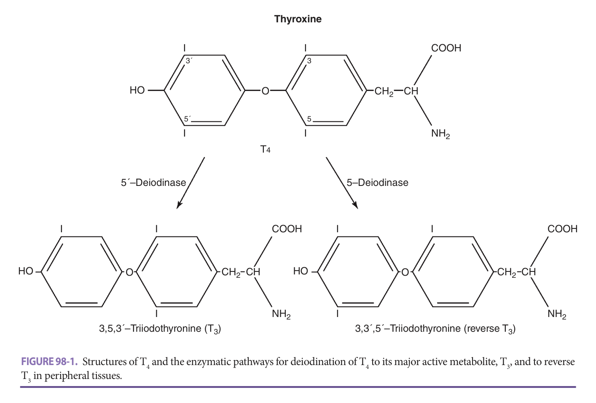
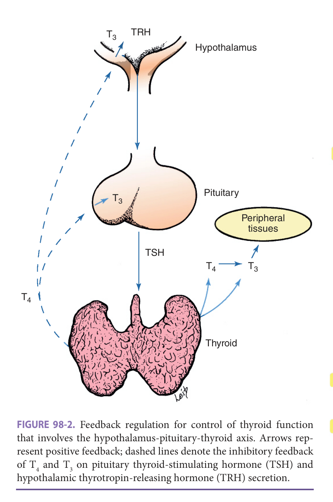
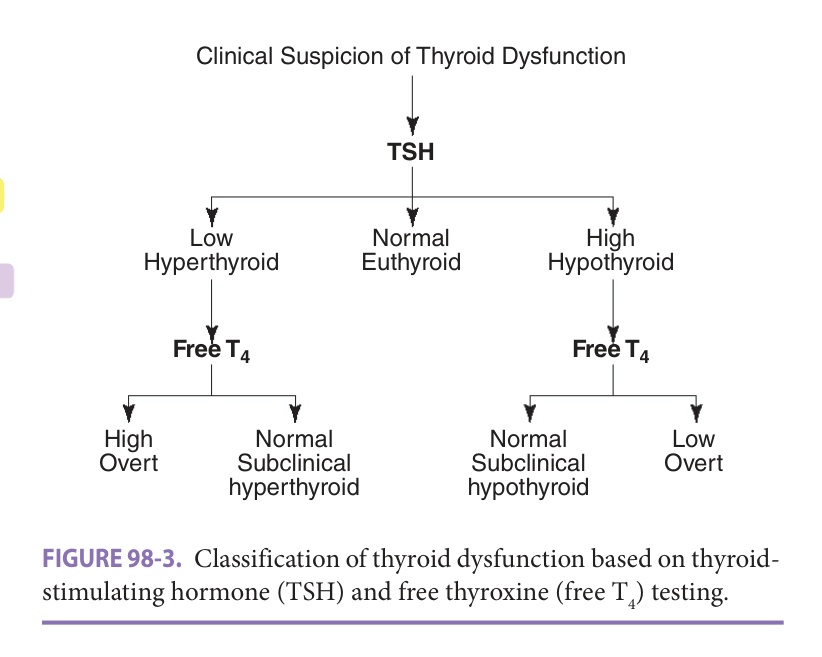
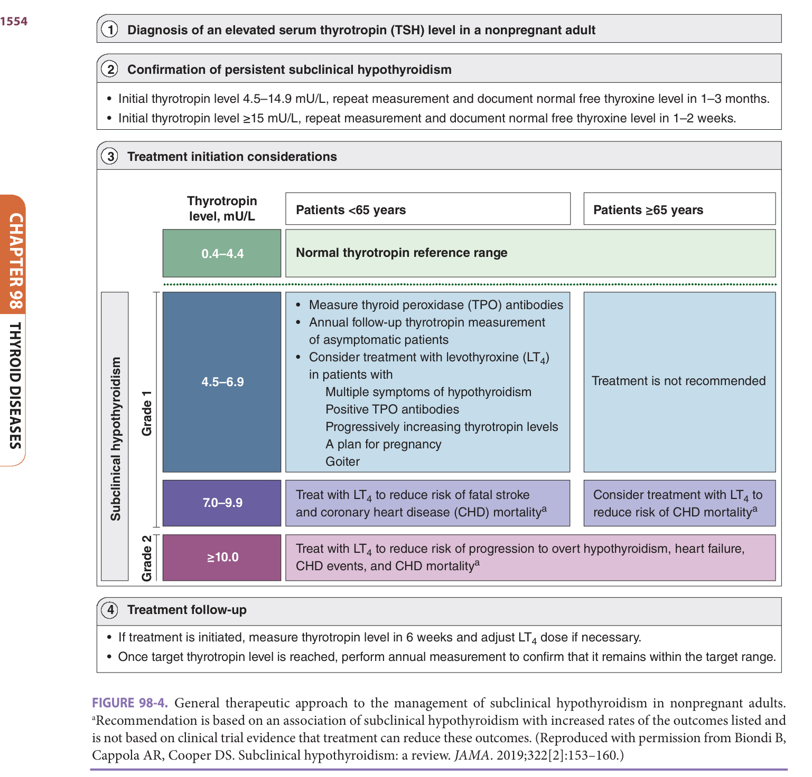
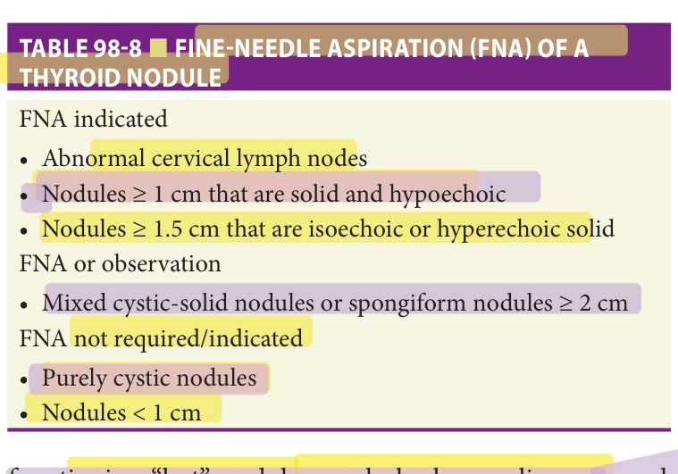
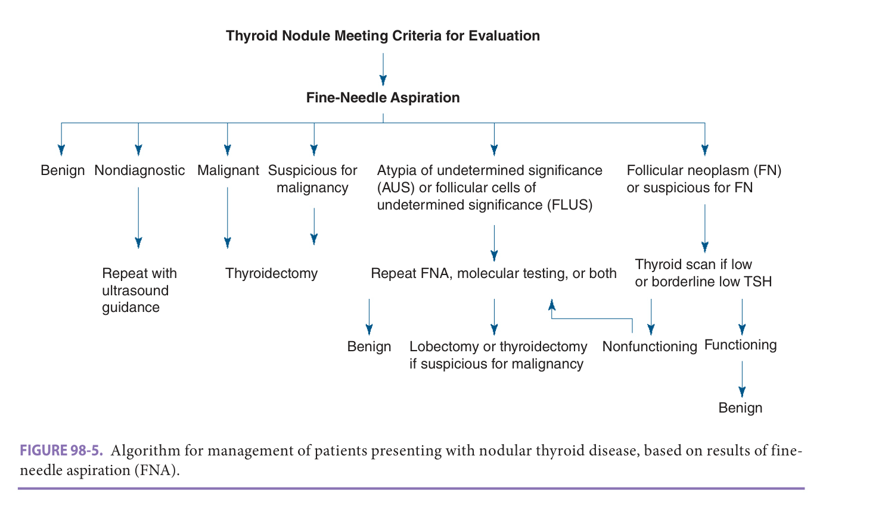

# Hazzard's Geriatric Medicine and Gerontology, 8e — Chapter 98: Thyroid Diseases

Anne R. Cappola

> **Fast build from the book, 22 Sep; not lane-reviewed.**

**[p. 1545]**

#### Learning Objectives

- Understand age-related changes in thyroid function and structure.
- Recognize the symptoms of thyroid dysfunction in older people.
- Interpret thyroid function tests in the context of concurrent medication use and illness.
- Describe the evaluation and treatment of thyroid disease in older people.
- Identify thyroid nodules that require evaluation via fineneedle aspiration (FNA).
- Summarize therapy for papillary thyroid carcinoma in older people.

#### Key Clinical Points

1. Aside from a slight increase in thyroidstimulating hormone (TSH) with age, changes in thyroid function and structure are not considered normal aging and require assessment of medications or conditions that affect thyroid function and investigation for thyroid disease.
2. Overt hyperthyroidism and overt hypothyroidism may be difficult to recognize in older people and always require treatment.
3. Treatment should be considered for subclinical hyperthyroidism in older people and for patients with subclinical hypothyroidism who have higher concentrations of TSH.
4. The evaluation of thyroid nodules does not differ with age. Any nodule meeting criteria should undergo FNA, preferably with ultrasound guidance.
5. Papillary thyroid carcinoma is the most common thyroid cancer and may be more aggressive in older people. Thyroid surgery should be performed, and additional management should be tailored to the health status of the individual.
6. Anaplastic thyroid carcinoma presents almost exclusively in older people and has a poor prognosis.

Thyroid hormone has widespread systemic effects and plays a critical role in metabolism at all ages. Both excess and deficiency can have severe physiologic consequences. The hypothalamic-pituitary-thyroid axis ensures tight regulation of thyroid hormone concentrations, even in advanced age. In addition, the thyroid gland has evolved to have sufficient redundancy so that only a minority of the gland is required for normal thyroid function. Nevertheless, the prevalence of all forms of thyroid disease, both functional and structural, increases in older people. An astute clinician is required, as recognition and management are more challenging in this age group.

## Changes In Thyroid Function With Age

### Thyroid Physiology

The thyroid gland produces two thyroid hormones, thyroxine (T4) and triiodothyronine (T3), which differ only in the number of iodines ( **Figure 98-1** ). T4 is the major hormone secreted by the thyroid gland, at an amount that is 11 times the secretion of T3. Additional T3 is produced peripherally by deiodination of T4 in the liver, kidney, and brain. Within the cell, T3 is the more potent hormone, binding to thyroid hormone receptors with higher affinity. However, because T4 levels act as a reservoir of thyroid hormone, with a longer half-life and circulating concentrations 100 times higher than T3, T4 concentrations are more commonly measured in the clinical setting.

In addition, both T4 and T3 are highly protein bound. Only 0.04% of T4 and 0.4% of T3 circulate in the biologically active free state, with the remainder bound to thyroxine-binding globulin (TBG), thyroxine-binding prealbumin, and albumin. A variety of conditions can affect levels of these binding proteins. Therefore, measurement of free T4 is preferable to total T4 when T4 assessment is required.

Thyroid hormone levels are tightly regulated by TSH through a classic endocrine feedback loop ( **Figure 98-2** ). Thyrotropin-releasing hormone (TRH) released from the hypothalamus stimulates pituitary production of TSH, which in turn stimulates thyroidal production of T4 and T3. T4 and T3 exert feedback control on the hypothalamus and pituitary to regulate TRH and TSH release. In essence, the pituitary and hypothalamus act as a thermostat to maintain

**[p. 1546]**

> *FIGURE 98-1. Structures of T4 and the enzymatic pathways for deiodination of T4 to its major active metabolite, T3, and to reverse T3 in peripheral tissues.*

> Highlighting is the owner's annotation, not the book's.

> *FIGURE 98-2. Feedback regulation for control of thyroid function that involves the hypothalamus-pituitary-thyroid axis. Arrows represent positive feedback; dashed lines denote the inhibitory feedback of T4 and T3 on pituitary thyroid-stimulating hormone (TSH) and hypothalamic thyrotropin-releasing hormone (TRH) secretion.*

> Highlighting is the owner's annotation, not the book's.

thyroid hormone levels within a narrow range. Because of variation between individuals in thyroid hormone set point and the sensitivity of the pituitary to perturbations in the set point, TSH levels are used clinically to screen for thyroid problems, rather than levels of T - 4 or T3.

### Physiologic Changes With Age

TSH concentrations gradually increase with increasing age, without change in free T4 levels, in euthyroid individuals without underlying thyroid autoimmunity or thyroid disease. The increase in TSH with normal aging does not indicate occult thyroid failure, since free T4 levels do not decline. Instead, there may be changes in the bioactivity of TSH or thyroidal sensitivity to TSH. Lower T3 levels have been documented in healthy centenarians compared to younger people and may reflect a decrease in deiodinase activity with aging.

Clearance of T4 and T3 decreases with age, leading to an increase in the half-life of T4. There is a compensatory decline in T4 and T3 secretion, resulting in stability in thyroid hormone concentrations with age. Production of T4 declines from 80 to 60 μg/day, and T3 production declines from 30 to 20 μg/day. The half-life of T4 increases from 7 days up to 9 days in those aged 80 and older. TBG concentrations do not change with age.

The prevalence of thyroid autoantibodies increases in older people, particularly in women, consistent with an ----increase in autoimmune thyroid disease with age. Therefore, aside from a slight increase in TSH concentrations with age, devia tions in thyroid function tests are not due to normal aging. Thus, when the TSH is abnormal in an older

**[p. 1547]**

person, investigation of thyroid disease and exogenous processes that affect thyroid function should be pursued.

### Impact Of Drugs And Medical Conditions

Iodine status, medications, and comorbid conditions can each affect thyroid function, either transiently or chronically ( **Table 98-1** ). All thyroid hormones contain iodine (see **Figure 98-1** ). The optimal iodide intake is 150 μg/day, with no changes in this recommendation for older people. Thyroidal uptake of iodine is tightly regulated by the sodiumiodide symporter (NIS) to allow adaptations to variations in - dietary supply and ensure that thyroid hormone synthesis does not fluctuate with changes in iodine status. Low iodide increases NIS, and high iodide decreases NIS. The effect of an iodine load on the thyroid gland depends on the underlying state of the gland, that is, whether it is normal or abnormal. When a normal thyroid is exposed to an iodine load, such as iodinated radiographic contrast, thyroid hormone synthesis is temporarily inhibited, followed by escape from this inhibitory effect and recovery, a phenomenon known as

the Wolff-Chaikoff effect. These changes are usually clinically insignificant. In patients with underlying thyroid pathology, an iodine load can precipitate hypo- or hyperthyroidism.

Amiodarone is a highly effective antiarrhythmic that can alter thyroid function in numerous ways. Some of these effects are mediated by the iodine content of amiodarone, which is 37% organic iodide by weight. In patients with a normal underlying thyroid, amiodarone administration may cause transient TSH elevation and chronically higher free T4 and lower T3 concentrations that do not require intervention. Occasionally, a destructive thyroiditis may occur and present as new-onset thyrotoxicosis, with increase in release of preformed thyroid hormone, as a result of a direct toxic effect of amiodarone. This can be treated acutely with corticosteroids. In patients with underlying thyroid nodular disease or Graves disease who receive amiodarone, increased thyroid hormone production may occur, which can be treated with methimazole. It can be difficult to distinguish among these etiologies of thyrotoxicosis at the time of presentation. Radioactive iodine scanning is not possible

**Table 98-1 — Drugs that affect thyroid function**

- *Decrease TSH secretion*: dopamine, glucocorticoids, octreotide, bexarotene
- *Increase thyroid hormone secretion*: iodine and iodine-containing compounds, amiodarone, lithium, interferon-α and IL-2, checkpoint inhibitors
- *Decrease thyroid hormone secretion*: thionamides (propylthiouracil, methimazole), lithium, iodine and iodine-containing compounds, amiodarone, aminoglutethimide, interferon-α and IL-2, thalidomide
- *Decrease T4 absorption*: calcium, proton pump inhibitors, cholestyramine/colestipol, aluminum hydroxide/sevelamer, ferrous sulfate, sucralfate, raloxifene
- *Increase serum TBG*: estrogen, tamoxifen and raloxifene, clofibrate, fluorouracil and capecitabine, mitotane, heroin, methadone
- *Decrease serum TBG*: androgen, anabolic steroids (danazol), glucocorticoid
- *Inhibit thyroid hormone binding to transport proteins*: phenytoin and carbamazepine, furosemide, salicylates and salsalate, fenclofenac and meclofenamate, heparin, sulfonylureas
- *Decrease T4 5′-deiodinase activity*: propylthiouracil, amiodarone, glucocorticoids
- *Increase hepatic T4 and T3 metabolism*: phenobarbital, rifampin, phenytoin, carbamazepine, sertraline
- *Increase T3 metabolism*: tyrosine kinase inhibitors

**[p. 1548]**

due to competition from the nonlabeled iodide in amiodarone, and so patients may initially be treated with both corticosteroids and methimazole. Patients with underlying Hashimoto thyroiditis may develop hypothyroidism, which is often reversible with cessation of amiodarone. In most cases, amiodarone should not be stopped when thyroid function abnormalities occur. The half-life of amiodarone is long, fat solubility is high, and the iodine load is large. It takes months for the effects of amiodarone to wear off, and thyroid dysfunction can generally be managed while continuing amiodarone treatment.

Several oncology drugs can cause thyroid dysfunction. Tyrosine kinase inhibitors and checkpoint inhibitor immunotherapy can each cause hypothyroidism that may be preceded by a destructive thyroiditis. Hypothyroidism also occurs with thalidomide use.

High doses of corticosteroids and dopamine may each lower TSH levels without affecting thyroid function. This effect is important to remember when interpreting TSH testing in hospitalized patients who are administered either of these medications.

In addition, numerous medications and conditions affect production of thyroid-binding proteins. Estrogens, tamoxifen, and acute hepatitis increase TBG concentrations. This effect is compensated by increased thyroid hormone production in a normally functioning thyroid, to keep free thyroid hormones stable, but may result in changes in total T4 concentrations. Conversely, androgens, chronic liver disease (through decreased synthesis of TBG), nephrotic syndrome, and severe systemic illness may decrease TBG concentrations. High-dose furosemide, heparin, and high doses of aspirin or salsalate decrease TBG binding to thyroid hormones without affecting TBG. When TBG concentration or binding is reduced, the thyroid produces less thyroid hormone to avoid elevation in free T4 concentrations.

### Nonthyroidal Illness Syndrome

In the setting of severe, nonthyroidal illness, alterations in thyroid function may occur, called the “nonthyroidal illness syndrome.” Alternative names are “low T3 syndrome” and “euthyroid sick syndrome.” This altered pattern of thyroid function occurs in reaction to acute illness and may represent an adaptive slowing of metabolism as a physiologic response to systemic illness. It is likely that reduced - caloric intake and cytokines play an important role in the pathogenesis of these changes in thyroid function. The first testing abnormality to manifest is low T3 levels. These are a consequence of decrease in deiodination of T4 to T3. In addition, there is a decrease in deiodination of reverse - T3 (see **Figure 98-1** ), which has no activity at thyroid hormone receptors, to its metabolite, leading to increased concentrations of reverse T3. Subsequent changes include a decrease in free T4 levels, followed by a mild decrease in TSH levels in those with the most critical illnesses. Patients taking high-dose corticosteroids or dopamine

may have completely suppressed TSH levels. The pattern of low TSH and low thyroid hormones is identical to that of central hypothyroidism. Central hypothyroidism is a rare cause of hypothyroidism and does not present without other manifestations of pituitary or hypothalamic disease. Additional diagnostic testing does not need to be pursued if the clinical picture supports nonthyroidal illness as the cause of thyroid testing abnormalities. Measurement of reverse T3 concentrations is not indicated. Patients with the full constellation of thyroid testing abnormalities have a high mortality rate, at 80%. Thyroid hormone replacement with T4 or T3 results in no benefit in the nonthyroidal illness syndrome. During recovery from nonthyroidal illness, TSH levels appropriately rise in order to stimulate thyroid hormone production, which may be interpreted as overt or subclinical hypothyroidism. In this setting, when the patient is also improving clinically, repeat thyroid function testing as an outpatient is preferred over initiation of levothyroxine.

## Thyroid Dysfunction

### Classification

When thyroid dysfunction is suspected clinically, the first step is to measure a TSH level. A low TSH is consistent with pituitary efforts to slow thyroid hormone production, as in hyperthyroidism, and a high TSH is consistent with pituitary efforts to stimulate thyroid hormone production, as in hypothyroidism ( **Figure 98-3** ). Further discrimination, based on measurement of free T4 levels, can be made to distinguish between what have been termed “subclinical” (normal free T4) and “overt” (abnormal free T4) dysfunction. These unfortunate historical terms frequently cause confusion, since they suggest a role for symptoms in the assignment of thyroid status when, in fact, the distinction is made solely on the basis of thyroid function testing.

> *FIGURE 98-3. Classification of thyroid dysfunction based on thyroidstimulating hormone (TSH) and free thyroxine (free T4) testing.*

> Highlighting is the owner's annotation, not the book's.

**[p. 1549]**
### Hyperthyroidism

Overt hyperthyroidism is defined as a low TSH with elevated free T4 or T3. The prevalence is 1% to 2% in older people. The prevalence in women is higher than in men, though this difference is only twofold in older people, compared to 10-fold at younger ages.

**Symptoms** Consistent with the myriad and widespread molecular effects of thyroid hormone, there are multiple symptoms associated with hyperthyroidism ( **Table 98-2** ). As with younger individuals, cardiovascular, psychiatric, gastrointestinal, and musculoskeletal symptoms predominate. Unfortunately, there is no single “defining” symptom that is specific to hyperthyroidism. Overt hyperthyroidism usually causes at least one symptom, albeit nonspecific. One or more of the symptoms should prompt evaluation by TSH testing. **Table 98-3** displays myriad symptoms and their frequency in a study of 84 overtly hyperthyroid patients aged 70 or older and 50 or younger. Of the 19 signs examined, the three signs found in more than 50% of older patients were tachycardia, fatigue, and weight loss. These data also show the paucity of classical symptoms of hyperthyroidism in older people, particularly hyperadrenergic symptoms, due to diminished physiologic response or concomitant β-blocker use, and increased prevalence of nonclassical symptoms such as apathy and anorexia. This presentation has been referred to as “apathetic hyperthyroidism” and can be mistaken for a chronic wasting illness. In addition, the classic symptoms associated with Graves disease, a goiter and ophthalmopathy, are often absent in older people.

**Table 98-2 — Clinical features of hyperthyroidism in older patients**

- *Cardiovascular*: palpitations, chronic or intermittent atrial fibrillation, congestive heart failure
- *Psychiatric and behavioral*: depression, apathy, lethargy, irritability
- *Gastrointestinal*: decreased appetite, weight loss, nausea, constipation
- *Musculoskeletal*: proximal muscle weakness, muscle atrophy

**Table 98-3 — Comparison of clinical features of hyperthyroidism in older versus young patients**

| Symptoms and signs | Older, ≥ 70 y (%) | Young, ≤ 50 y (%) |
|---|---|---|
| Tachycardia | 71 | 96 |
| Fatigue | 56 | 84 |
| Weight loss | 50 | 51 |
| Tremor | 44 | 84 |
| Dyspnea | 41 | 56 |
| Apathy | 41 | 25 |
| Anorexia | 32 | 4 |
| Nervousness | 31 | 84 |
| Hyperactive reflexes | 28 | 96 |
| Weakness | 27 | 61 |
| Depression | 24 | 22 |
| Increased sweating | 24 | 95 |
| Diarrhea | 18 | 43 |
| Muscular atrophy | 16 | 10 |
| Confusion | 16 | 0 |
| Heat intolerance | 15 | 92 |
| Constipation | 15 | 0 |

Thyroid storm describes the most severe symptomatic presentation of thyrotoxicosis. In thyroid storm, central nervous and cardiovascular systems may be particularly compromised, and patients may present with delirium, psychosis, coma, extreme tachycardia, or heart failure. Such patients usually require hospitalization and management by an endocrinologist. Although diagnostic criteria have been proposed for the diagnosis of thyroid storm, any patient whose clinical status is compromised from the effects of hyperthyroidism should be managed aggressively to remove the impact of thyroid dysfunction from the clinical picture.

**Etiology and diagnosis** The term "hyperthyroidism" refers to overproduction of thyroid hormone by the thyroid gland, whereas “thyrotoxicosis” is a broader term that encompasses any clinical situation with thyroid hormone excess, including thyroiditis or excess exogenous thyroid hormone. The majority of endogenous thyrotoxicosis is due to overproduction of thyroid hormone, either from autoimmune stimulation of the thyroid in Graves disease or an autonomous thyroid nodule within a nodular thyroid gland. These are usually permanent conditions. In younger people, Graves disease is the most common cause of hyperthyroidism, whereas with increasing age, multinodular toxic goiter increases in prevalence. Nodules within multinodular glands may become autonomous over time. Acute worsening of thyrotoxicosis can be precipitated by an iodine load in a patient with autonomous thyroid nodules, which are lacking a normal regulatory response to iodine. Less commonly, leakage of thyroid hormone due to autoimmune or viral thyroiditis can cause transient thyrotoxicosis that resolves within several weeks. The diagnosis of thyrotoxicosis does not require elevations in both free T4

**[p. 1550]**
and T3 concentrations. “T3 toxicosis” may occur with normal free T4 levels, particularly with autonomous nodules; conversely, only free T4 levels may be elevated with concomitant nonthyroidal illness syndrome.

The process of assessment of the etiology of thyrotoxicosis does not require invasive testing and does not differ between young and old adults. Although there are some clues from thyroid testing (T4 and T3 levels tend to be higher in Graves disease than in other etiologies) and physical examination (the presence of proptosis, skin findings of pretibial myxedema, or thyroid bruit are specific for Graves disease), additional testing may be required. Measurement of thyroid receptor antibodies (TRAb) can be used to distinguish Graves disease from other causes. Radioiodine scanning is the definitive way to discriminate among thyrotoxicosis etiologies. NIS is highly expressed - in the thyroid, with low levels in salivary glands, lactating breast, and placenta. It allows radioactive iodine scanning in a selective manner. It does not provide valid results in the setting of recent high unlabeled iodide intake, such as from iodinated contrast. Otherwise, it is a useful test to discriminate between high uptake (Graves disease and autonomous nodule) and low uptake (autoimmune or viral thyroiditis) states. Concomitant imaging may discriminate between diffuse uptake in Graves disease and focal uptake by an autonomous nodule. Thyroid ultrasonography may be useful when correlated with a radioiodine scan.

**Management** The metabolic derangements of thyrotoxicosis can complicate the care of any coexisting condition in an older patient. Furthermore, there are multiple causes of thyrotoxicosis and multiple treatment options. Therefore, management should involve close collaboration between the geriatrics or primary care team and an endocrinologist. β-Blocking drugs are useful in the management of tachycardia and other hyperadrenergic symptoms from thyrotoxicosis of any etiology. Nonsteroidal anti-inflammatory drugs can be useful for treating patients with subacute or silent thyroiditis. Patients who do not respond may require prednisone. Since the thyrotoxicosis is due to release of preformed thyroid hormone in these conditions, antithyroid drugs are not indicated.

**Antithyroid drugs** are useful in the management of thyrotoxicosis due to overproduction of thyroid hormone from autonomous thyroid nodules and in Graves disease. The antithyroid drugs decrease thyroid hormone production by acting directly on the thyroid to interfere with thyroid hormone synthesis. Methimazole is the preferred drug due to a longer half-life and fewer adverse effects. Propylthiouracil (PTU) has the advantage of decreasing T4 to T3 conversion, but its use has been limited by reports of fulminant hepatic failure. However, even in good candidates (Graves disease with mild to moderate hyperthyroidism and a small thyroid gland) recurrence exceeds 60%, and concerns about how well the older patient may tolerate a recurrence of hyperthyroidism should be considered prior to taking this approach. The most common side effects of

either methimazole or PTU are skin reactions, which occur in 4% to 6% of patients. The most serious side effect is agranulocytosis, which occurs in 0.1% to 0.5% of patients. Rarely, methimazole can cause cholestasis, and both methimazole and PTU can cause antineutrophil cytoplasmic antibody (ANCA)-positive vasculitis or severe polyarthritis. Because of these risks, an endocrinologist should be involved in the selection and dosage of antithyroid drug therapy over time.

**Radioactive iodine** is the preferred therapeutic option in patients who have persistent thyrotoxicosis due to overproduction of thyroid hormone. Radioiodine emits γ-rays and β-particles. It is used in low doses for diagnostic purposes and at higher doses for therapy. The effects are dose dependent, and the degree of uptake and size of the thyroid gland are considerations in determining the correct dose (as defined by nuclear medicine). Any antithyroid drug should be stopped 3 to 5 days prior to treatment, though β-blocking drugs should be continued. Radioactive iodine induces necrosis of thyroid follicular cells followed by disappearance of colloid and fibrosis of the gland over months. Contact precautions must be observed for 5 days after treatment, and, if necessary, antithyroid drugs may be resumed 5 days after treatment. A plan for managing contact precautions must be devised before treatment for patients who are caregivers of young children or who have caretakers who are in close contact. Radioactive iodine that is not taken up by the thyroid is cleared in the urine, and patients with urinary incontinence must have a plan for disposal of contaminated absorptive pads. Older patients may benefit from pretreatment with methimazole to achieve euthyroidism more quickly and “cool” down before radioactive iodine or surgery.

Autonomous nodules can be treated definitively with radioactive iodine. If the autonomous nodule is the source of thyrotoxicosis, the remaining normal gland will be unaffected by radioactive iodine therapy, resulting in normal thyroid function after ablation of the affected thyroid nodule. Radioactive iodine therapy is commonly used in the long-term management of thyrotoxicosis due to Graves disease. The goal of radioactive iodine therapy in Graves disease is ablation of all functioning thyroid tissue, with resultant hypothyroidism. Incomplete ablation increases the risk of recurrence due to regrowth of thyroid tissue secondary to persistent stimulation by antibody binding to the TSH receptor. The advantage of radioactive iodine ablation is the permanency of treatment without the risks associated with thyroidectomy, though contact precautions must be observed for 5 days after treatment, ophthalmopathy may be exacerbated, and thyroid function monitoring is required every 4 to 6 weeks after treatment until the patient is taking a stable dose of thyroid hormone replacement.

**Thyroidectomy** is the fastest way to achieve euthyroidism, but because of increased operative risk in older - patients, it is reserved for select cases, such as concomitant thyroid cancer or severe ophthalmopathy. Only an experienced thyroid surgeon should perform the

**[p. 1551]**
thyroidectomy. Potential complications include transient or permanent recurrent laryngeal nerve paralysis and hypoparathyroidism.

### Subclinical Hyperthyroidism

Subclinical hyperthyroidism is defined as low TSH with normal levels of free T4 and T3. The prevalence of subclinical hyperthyroidism on a single test is 1% to 6% in an older population. Repeat testing is recommended 3 to 6 months later, and persistence is high, at more than 50%. The etiologies of subclinical hyperthyroidism are the same as those causing overt hyperthyroidism.

Untreated subclinical hyperthyroidism is associated with increased cardiovascular, musculoskeletal, and neurocognitive risk compared to euthyroidism. Subclinical hyperthyroidism in older people increases the risk of atrial fibrillation, heart failure, and overall cardiovascular mortality. It is also associated with increased risk of fracture and dementia. Current recommendations support treatment of older people with subclinical hyperthyroidism to achieve euthyroidism by laboratory testing. The therapeutic options are the same as those for overt hyperthyroidism.

### Hypothyroidism

Overt hyperthyroidism is defined as a high TSH with low free T4 concentrations. The prevalence is 1% to 2% in older people. It is not useful to measure T3 concentrations when assessing hypothyroidism.

**Symptoms** Thyroid hormone insufficiency affects multiple organs, often with insidious onset. Symptoms of hypothyroidism are often, but not always, opposite to those of hyperthyroidism, and manifest as a generalized slowing of metabolic processes ( **Table 98-4** ). Cognitive changes and functional decline are late manifestations of unrecognized hypothyroidism. As with younger individuals, cardiovascular, psychiatric, gastrointestinal, and musculoskeletal symptoms predominate. Unfortunately, there is no single defining symptom that is specific to hypothyroidism. One or more of the myriad symptoms should prompt evaluation by TSH testing. **Table 98-5** displays symptoms of hypothyroidism and their frequency in a study of 121 overtly hypothyroid young and old patients. Of the 24 signs examined, fatigue and weakness were the two signs found in more than 50% of older patients. The usual clinical signs were not well represented in older people. Since the effects of hypothyroidism are reversible with treatment, clinicians caring for older patients should measure TSH at the earliest indication of hypothyroid symptoms.

**Etiology and diagnosis** The etiologies of hypothyroidism are similar in older and younger adults. Primary hypothyroidism from thyroid failure is the most common source of thyroid dysfunction; central hypothyroidism from pituitary or hypothalamic failure is rare. Primary hypothyroidism is largely due to autoimmune destruction of the thyroid (chronic autoimmune thyroiditis; Hashimoto thyroiditis), though exogenous destruction of the thyroid from surgery or radiation (including radioactive iodine therapy) and drugs are also common ( **Table 98-6** ). All compounds containing iodine, including amiodarone and lithium, as well as interferon-α, interleukin 2 (IL-2), tyrosine kinase inhibitors such as sunitinib, and checkpoint inhibitors such as pembrolizumab, may accelerate hypothyroidism in a gland with underlying Hashimoto thyroiditis (see **Table 98-1** ). Transient hypothyroidism can also occur during recovery from thyroiditis or acute, nonthyroidal illness. Bexarotene and octreotide can cause secondary hypothyroidism. A serum TSH is the initial diagnostic test for detection of hypothyroidism; both TSH and free T4 should be measured if central hypothyroidism is a clinical consideration. Antithyroid antibody measurement is not indicated for diagnostic assessment of hypothyroidism.

**Table 98-4 — Clinical features of hypothyroidism in older patients**

- Dry skin
- Hair loss
- Edema of face and eyelids
- Cold intolerance
- *Neurologic*: paresthesia (carpal tunnel syndrome), ataxia, dementia
- *Psychiatric and behavioral*: depression, apathy or withdrawal, psychosis, cognitive dysfunction
- *Metabolism*: weight gain, hypercholesterolemia, hypertriglyceridemia, peripheral edema
- *Musculoskeletal*: myopathy, arthritis/arthralgia
- *Cardiovascular*: bradycardia, pericardial effusion, congestive heart failure

**Table 98-5 — Comparison of clinical features of overt hypothyroidism in older versus young patients**

| Symptoms and signs | Older, ≥ 70 y (%) | Young, ≤ 55 y (%) |
|---|---|---|
| Bradycardia | 12 | 19 |
| Fatigue | 68 | 83 |
| Weight gain | 24 | 59 |
| Cold intolerance | 35 | 65 |
| Depression | 28 | 52 |
| Disorientation | 9 | 0 |
| Hypoactive reflexes | 24 | 31 |
| Weakness | 53 | 67 |
| Paresthesia | 18 | 61 |
| Dry skin | 35 | 45 |
| Hair loss | 12 | 28 |
| Reduced hearing | 32 | 25 |
| Muscle cramps | 20 | 55 |
| Snoring | 18 | 22 |
| Constipation | 33 | 41 |

**[p. 1552]**

**Table 98-6 — Causes of hypothyroidism in older people**

- *Primary hypothyroidism*
  - Chronic autoimmune thyroiditis (Hashimoto thyroiditis)
  - Radiation — ¹³¹I therapy for hyperthyroidism; radiation therapy for head and neck cancer
  - Surgical thyroidectomy
  - Drugs — iodine-containing drugs (amiodarone, radiocontrast agents); antithyroid drugs (propylthiouracil, methimazole); other drugs that decrease TSH or thyroid hormone secretion (see **Table 98-1**)
- *Central hypothyroidism*
  - Hypothalamic tumors or infiltrative lesions
  - Pituitary tumors or infiltrative lesions
  - Pituitary surgery
  - Radiation

**Management** The aim of therapy for hypothyroidism is hormone replacement, not cure. Levothyroxine therapy should be used, and therapy is usually lifelong. Tissue deiodination of ingested levothyroxine to T3 allows physiologic thyroid hormone replacement without the need for additional T3 replacement. T3 or dessicated thyroid hormones should not be used for thyroid hormone replacement in older people due to risk of adverse cardiac effects from supraphysiologic T3 concentrations. Levothyroxine is available in 12 to 25 μg increments to allow precise titration. Side effects are largely from inappropriate dosing.

Considerations for initial dosing include the age of the patient and degree of thyroid failure. In patients aged 65 or older who have cardiac disease, it is usually recommended to “start low, go slow.” It should be noted that the benefit of this approach, compared with starting with a full estimated starting dose, has not been tested in a clinical trial. The smallest available doses, 25- and 50-μg tablets, are reasonable starting doses in older people. TSH testing usually occurs 6 weeks (six half-lives of levothyroxine) after initiation of treatment, but older people may benefit from 7 to 8 weeks to achieve steady state, given lower clearance of thyroid hormone. Dose increments initially may be as high as 25 μg, but finer titrations in 12 μg increments are preferred once the dose is above 75 to 100 μg. The target TSH is toward the upper limit of the normal range and could be as high as 4 to 6 mU/L in those older than age 80. While there is individual variation, full replacement of thyroid hormone is often required, regardless of the severity of hypothyroidism initially. The usual full replacement dose in older adults is lower than the 1.6 μg/kg/day recommended in younger patients. Care should be taken to avoid overreplacement, which may have adverse effects. If given intravenously, 75% of the oral dose should be administered.

The pace of progression of thyroid failure is variable, though once TSH levels stabilize, TSH testing need only be performed on an annual basis. When variability in TSH levels occurs, difficulty with adherence should be considered first. For example, a patient taking 112 μg of levothyroxine daily who misses one dose per week will have an average daily dose of 96 μg, which could be sufficient to cause TSH elevation. If an increase in TSH occurs after concentrations have stabilized, drugs or conditions that decrease levothyroxine absorption, increase levothyroxine metabolism, or increase TBG should be considered ( **Table 98-7** ). These situations may require an increase in levothyroxine dose. After exclusion of these drugs and conditions, it is reasonable to consider progression of endogenous thyroid disease if TSH increases. If a decrease in TSH occurs after concentrations have stabilized, factors that decrease TBG levels should be considered ( **Table 98-7** ).

Thyroid hormone replacement has a narrow therapeutic window, and iatrogenic hyperthyroidism should be avoided. As many as 40% of older individuals taking thyroid hormone replacement may have a low TSH. Potential risks from iatrogenic hyperthyroidism parallel those of endogenous hyperthyroidism, most notably atrial fibrillation and bone loss. Careful initial titration and subsequent monitoring should reduce the risk of overreplacement.

**Myxedema coma** Myxedema coma is a serious medical condition that occurs almost exclusively in older people. Despite the name, the patient does not have to be in coma, though an altered mental status is common. The usual presentation is long-standing untreated hypothyroidism, with decompensation often precipitated by infection, cold exposure, alcoholism, or use of narcotics, sedatives, or antipsychotic medication. It is characterized by profound slowing across systems, including hypothermia, bradycardia, and hypoventilation. A thermometer capable of reading low temperatures may be required. Close monitoring is required, and headaches, erratic behavior, and neurologic symptoms such as ataxia, nystagmus, and muscle spasms may be harbingers of impending coma. Hyponatremia and hypoglycemia as well as elevated creatinine phosphokinase of muscle origin may also be present.

**[p. 1553]**

**Table 98-7 — Drugs/conditions affecting levothyroxine dosage**

- *Decreased levothyroxine absorption*
  - Increased GI tract binding of levothyroxine: iron (as supplements and in multivitamins), calcium carbonate, aluminum hydroxide, sucralfate, cholestyramine
  - Proton pump inhibitors
  - Small intestinal diseases: celiac disease, *Helicobacter pylori*-associated gastritis, atrophic gastritis, Crohn disease, short bowel
- *Increased levothyroxine metabolism*: phenobarbital, carbamazepine, phenytoin, rifampin
- *Increased thyroid-binding globulin*: estrogens, hepatitis
- *Decreased thyroid-binding globulin*: androgen use, progressive liver failure, nephrotic syndrome, severe systemic illness

Treatment of precipitating factors and supportive therapy for any associated metabolic disturbances is as important as initiation of thyroid hormone replacement. Serum should be obtained for cortisol measurement, and then intravenous hydrocortisone should be initiated to treat impaired adrenal reserve that may be present in profound hypothyroidism. Treatment with thyroid hormone without hydrocortisone can precipitate adrenal crisis. Hydrocortisone may be stopped if the cortisol level is found to be adequate. An initial dose of 200 to 400 μg of levothyroxine should be initiated, followed by 75 to 100 μg daily. The addition of a T3 preparation, which has more immediate effects than levothyroxine, has the risk of acute cardiac effects, and is generally discouraged in an older patient. Metabolism of all medications is diminished in profound hypothyroidism, and sedatives should be especially avoided.

**Subclinical hypothyroidism** Subclinical hypothyroidism is defined as a high TSH with a normal level of free T4. The prevalence of subclinical hypothyroidism is 4% in the general population. The prevalence increases with age, to approximately 10% of those aged 65 or higher, and it is more common in women. Follow-up testing and indications for

treatment are based on the degree of TSH elevation and patient age, as summarized in **Figure 98-4** . TSH elevations may be transient, due to recovery from silent thyroiditis or from the nonthyroidal illness syndrome. Therefore, repeat testing is recommended in 1 to 3 months if the initial TSH is 4.5 to 14.9 mIU/mL and in 1 to 2 weeks if the initial TSH is 15.0 mIU/mL or higher. The etiologies of subclinical hypothyroidism are the same as overt hypothyroidism, though many older patients without any risk factors for hypothyroidism or antithyroid antibodies are found to have subclinical hypothyroidism. Studies in overt hypothyroidism underscore the difficulty with using symptoms to define the severity of thyroid dysfunction in an older person. The milder physiologic abnormalities of subclinical hypothyroidism result in an even greater diagnostic challenge, particularly given the frequency of hypothyroidism-like symptoms in older people without thyroid disease.

Potential effects of mild thyroid deficiency include hypercholesterolemia, decreased systemic vascular resistance, and diminished cardiac contractility. There is a dose-response relationship between the degree of TSH elevation and incident risk of cardiovascular disease and heart failure in people with untreated subclinical hypothyroidism. Independently of age, a TSH concentration of 10 mIU/L or higher predicts increased cardiovascular mortality, coronary heart disease, and heart failure. A TSH concentration of 7 mIU/L or higher predicts cardiovascular mortality. However, subclinical hypothyroidism is not associated with fractures, dementia, or depression. Although skeletal muscle function is impaired in hypothyroidism, one study found older individuals with subclinical hypothyroidism to have better physical function than their euthyroid counterparts, and another showed decreased mortality in older individuals with subclinical hypothyroidism. Treatment of subclinical hypothyroidism did not improve fatigue or hypothyroid symptoms in a randomized trial of individuals aged 60 or older. However, no randomized trials with clinical endpoints have been performed.

Per **Figure 98-4** , levothyroxine therapy at 25 to 50 μg daily should be initiated for patients aged 65 and older if the TSH is persistently 10.0 mU/mL or higher, and treatment should be considered if the TSH is 7.0 to 9.9 mU/mL. The average replacement dose in subclinical hypothyroidism is 1 μg/kg/day, which is lower than that of overt hypothyroidism, though the treatment goals are the same. The risks of iatrogenic subclinical or overt hyperthyroidism should be avoided when initiating levothyroxine therapy in this age group. There are no adverse consequences to following older patients who have TSH levels less than 7 mIU/L with annual testing. As the rate of progression to overt hypothyroidism is low in this range, no treatment is recommended.

### Screening

Because the adverse effects of overt hyperthyroidism and hypothyroidism are reversible with treatment, the symptoms are often less pronounced or atypical in older people,

**[p. 1554]**

> *FIGURE 98-4. General therapeutic approach to the management of subclinical hypothyroidism in nonpregnant adults. aRecommendation is based on an association of subclinical hypothyroidism with increased rates of the outcomes listed and is not based on clinical trial evidence that treatment can reduce these outcomes. (Reproduced with permission from Biondi B, Cappola AR, Cooper DS. Subclinical hypothyroidism: a review. _JAMA_ . 2019;322[2]:153–160.)*

> Highlighting is the owner's annotation, not the book's.

and TSH is a readily available test, screening older people for thyroid dysfunction has been proposed. However, the management of subclinical thyroid dysfunction, which is more common than overt disease, is not sufficiently supported by clinical trial data. Furthermore, the definition of the reference range may differ between older and younger people. If the 95% confidence interval is applied to a population free of thyroid disease, the upper limit of the reference range is 3.6 mIU/L for 20 to 29 year olds, but 7.5 mIU/L for those aged 80 and older. The US Preventive Services Task Force has concluded that there is insufficient evidence to recommend routine screening for thyroid dys-function. This recommendation is unlikely to change until there is clear evidence to support management of any TSH concentration found on screening.

## Nodular Thyroid Disease And Thyroid Cancer

### Thyroid Anatomy

<mark>Thyroidal size is similar in older and younger</mark> individuals, and the volume of the thyroid correlates more with body weight than with age. Pathologic evaluation shows increased frequency of lymphocyte infiltration, fibrosis, and diminished colloid and follicle size in older people. Palpation of the thyroid gland may be more difficult in older individuals in the setting of pulmonary disease or kyphosis. With increasing age, there is an increase in the frequency of both thyroid nodules and thyroid cancer. The higher incidence with age is not entirely due to detection bias from increased frequency of radiologic testing, such as

**[p. 1555]**

computed tomography (CT) scans or carotid ultrasounds, though the initial presentation of a thyroid nodule in an older person is often an incidental finding.

### Evaluation Of Thyroid Nodules

In autopsy series, 50% of thyroid glands have one or more thyroid nodules. Multinodular glands are more common in people from areas of iodine insufficiency. Patients with a history of childhood radiation to the neck or childhood exposure to ionizing radiation have an increased risk of developing thyroid nodules. The majority of these nodules are benign, though these nodules have an increased risk of thyroid cancer, which declines starting four decades after initial exposure.

The evaluation of a thyroid nodule does not differ by age. The main consideration is detecting the malignancy present in 7% to 9% of thyroid nodules. Men have a higher risk of malignancy than women. Nonpalpable nodules discovered incidentally have the same risk of malignancy as palpable nodules of the same size. Patients with multiple nodules have the same risk of malignancy as patients with a solitary nodule. Any palpable thyroid abnormality or one found through an imaging modality should be examined via a dedicated thyroid ultrasound. In addition to size in three dimensions, high-risk nodule characteristics such as hypoechogenicity, irregular margins, taller-than-wide shape, intranodular vascularity, and microcalcifications, as well as low-risk characteristics, such as spongiform appearance or noncalcified, mixed cystic and solid composition, should be documented. The presence and characteristics of lymph nodes should be assessed. A TSH should also be measured. Patients who have a low TSH should undergo a radionuclide thyroid scan to assess for thyroid nodule functioning; functioning “hot” nodules rarely harbor malignancy and do not require cytologic evaluation.

All other patients meeting the criteria in **Table 98-8** should undergo fine-needle aspiration (FNA) with ultrasound guidance, which improves the accuracy. For multinodular goiters, any nodule that meets criteria for aspiration should undergo FNA. Categories of FNA results are summarized in **Figure 98-5**. Nodules with either atypia of undetermined significance or follicular lesions of undetermined significance should have additional analysis of aspirates using molecular analysis, using either an mRNA classifier system or mutational analysis. Nodules determined to be benign should have ultrasound follow-up, and those at high risk of malignancy should be removed surgically, usually a total thyroidectomy.

> *Table 98-8. Fine-needle aspiration (FNA) of a thyroid nodule.*

> Highlighting is the owner's annotation, not the book's.

> *FIGURE 98-5. Algorithm for management of patients presenting with nodular thyroid disease, based on results of fine-needle aspiration (FNA).*

> Highlighting is the owner's annotation, not the book's.

### Benign Nodular Disease

Nodules that did not meet initial criteria for FNA or underwent FNA with benign pathology have a low likelihood of a later diagnosis of thyroid cancer. Current understanding

**[p. 1556]**

of thyroid cancer biology suggests that a cancerous nodule develops as a cancerous nodule, and that benign nodules do not become cancerous over time. However, because false negatives do occur, periodic ultrasound surveillance is advised for nodules that did not meet initial criteria for FNA, either due to size or sonographic characteristics, or whose FNA results indicated a benign diagnosis. On followup ultrasounds, each nodule should be evaluated for the development of size or ultrasound characteristics that meet criteria for FNA. Benign nodules should be followed up with a repeat thyroid ultrasound in 12 to 18 months, and continued ultrasound surveillance every 2 to 5 years, with FNA for development of sonographically suspicious features or significant growth. Any nodule that has undergone FNA twice does not need additional aspirations, due to the vanishingly small likelihood of two false-negative FNAs.

Nodular goiters may grow to the point of causing compressive symptoms, including dyspnea or wheezing from tracheal narrowing or disturbances of swallowing from esophageal impingement. These goiters often have a substernal component which can be evaluated by CT scan of the neck. Flow-volume loop evaluation through pulmonary function testing can be used to evaluate extrinsic compression in the neck, and barium swallow evaluation can demonstrate the degree of thyroidal extension abutting the esophagus. Even if FNA confirms benign nodular disease, thyroid surgery may be indicated to relieve mass effect from an enlarged nodular goiter.

### Thyroid Cancer

The incidence of thyroid cancer increases with age, peaking at age 65 to 69 at 29.6 per 100,000. Thyroid cancer can be of follicular cell origin (papillary, follicular, or anaplastic) or C-cell origin (medullary thyroid cancer). Thyroid lymphoma and metastases to the thyroid can also occur. The majority of thyroid cancers are papillary thyroid carcinomas. Older patients are more likely to present with more aggressive disease, higher recurrence rates, and multicentricity. However, the prognosis of thyroid cancer is excellent and improving, with 5-year survival rates of 98% in those aged 50 to 64, 97% in those aged 65 to 74, and 88% in those aged 75 or older.

The diagnosis of thyroid cancer is made via cytologic interpretation of FNA specimens. Surgery is the primary modality for management of thyroid cancer, irrespective of age. For patients with tumors of 1 to 4 cm without extrathyroidal extension and no lymph node involvement, lobectomy may be performed instead of total thyroidectomy. This surgery should be performed by an experienced thyroid surgeon, with lymph node sampling as indicated. For thyroid cancer confined to the thyroid gland, no additional initial therapy is required. Thyroid hormone replacement is required after total thyroidectomy. Since TSH has a trophic effect on the thyroid, a high levothyroxine dose is

recommended in high-risk patients to suppress TSH levels. In low-risk patients, maintaining a TSH in the lower half of the normal range is acceptable. Cardiac effects of high levothyroxine doses can be mitigated by β-blockers and bisphosphonates attenuate effects on bone.

A subset of patients requires additional therapy, such as radioactive iodine ablation of residual disease in the neck or metastatic outside the neck, capitalizing on the retention of NIS in the majority of differentiated cancers of follicular origin. Radioactive iodine scanning for residual disease can be performed with recombinant TSH treatment, avoiding the physiologic consequences associated with withdrawal-induced hypothyroidism. Multitargeted kinase inhibitors are available for patients with metastatic disease that does not respond to radioactive iodine therapy.

**Medullary thyroid carcinoma** should be treated with total thyroidectomy, and residual disease can be monitored through assessment of calcitonin and carcinoembryonic antigen levels. Since the C-cells do not contain NIS, radioactive iodine therapy has no effect on medullary thyroid carcinoma. For extensive nodal disease or local disease in the neck, external beam therapy can be considered. Tyrosine kinase inhibitors have been used in progressive systemic disease. All patients with medullary thyroid carcinoma should undergo genetic testing for a _RET_ germline mutation.

**Anaplastic thyroid carcinoma** is an undifferentiated thyroid cancer that is typically found in older people, with a mean age at diagnosis of 65. It has the worst prognosis of any thyroid cancer, due to rapid growth and local invasiveness, and the treatment team should include palliative care expertise. Patients with anaplastic thyroid carcinoma often have a multinodular goiter or history of papillary thyroid carcinoma. The presentation of anaplastic thyroid carcinoma is as a rapidly enlarging neck mass. Thyroidectomy, radiotherapy, and chemotherapy have limited benefit, and median survival from diagnosis is 5 months.

**Thyroid lymphoma** is also rapid growing, and usually arises in a background of Hashimoto thyroiditis. Like anaplastic thyroid carcinoma, it presents as a rapidly growing mass that may cause compressive symptoms, but the response to treatment is better. A characteristic asymmetrical pseudocystic pattern is present on ultrasound. Large -- needle or surgical biopsy is required to establish the diagnosis. Treatment with radiation and chemotherapy and prognosis parallel other non-Hodgkin lymphomas, and thyroidectomy is not indicated.

## Acknowledgments

Drs. Jerome Hershman, Sima Hassani, and Mary Samuels wrote this chapter in the 6th edition. **Tables 98-1** through **98-6** and **Figures 98-1** and **98-2** from that chapter have been retained in this edition.

**[p. 1557]**
## Further Reading

- Bible KC, Kebebew E, Brierley J, et al. 2021 American Thyroid Association guidelines for management of patients with anaplastic thyroid cancer. _Thyroid_ . 2021; 31(3):337–386.

- Biondi B, Cappola AR, Cooper DS. Subclinical hypothyroidism: a review. _JAMA_ . 2019;322(2):153–160.

- Burch HB. Drug effects on the thyroid. _N Engl J Med_ . 2019; 381(8):749–761.

- Chaker L, Cappola AR, Mooijaart SP, Peeters RP. Clinical aspects of thyroid function during ageing. _Lancet Diabetes Endocrinol_ . 2018;6(9):733–742.

- Doucet J, Trivalle C, Chassagne P, et al. Does age play a role in clinical presentation of hypothyroidism? _J Am Geriatr Soc_ . 1994;42(9):984–986.

- Garber JR, Cobin RH, Gharib H, et al. Clinical practice guidelines for hypothyroidism in adults: cosponsored by the American Association of Clinical Endocrinologists and the American Thyroid Association. _Thyroid_ . 2012;22(12):1200–1235.

- Haugen BR, Alexander EK, Bible KC, et al. 2015 American Thyroid Association management guidelines for adult patients with thyroid nodules and differentiated thyroid cancer: the American Thyroid Association guidelines task force on thyroid nodules and differentiated thyroid cancer. _Thyroid_ . 2016;26(1):1–133.

- Jonklaas J, Bianco AC, Bauer AJ, et al. Guidelines for the treatment of hypothyroidism: prepared by the American Thyroid Association task force on thyroid hormone replacement. _Thyroid_ . 2014;24(12):1670–1751.

- LeFevre ML, US Preventive Services Task Force. Screening for thyroid dysfunction: U.S. Preventive Services Task Force recommendation statement. _Ann Intern Med_ . 2015;162(9):641–650.

- Ross DS, Burch HB, Cooper DS, et al. 2016 American Thyroid Association guidelines for diagnosis and management of hyperthyroidism and other causes of thyrotoxicosis. _Thyroid_ . 2016;26(10):1343–1421.

- SEER*Explorer: An interactive website for SEER cancer statistics [Internet]. Surveillance Research Program, National Cancer Institute. [Cited 2021 April 15]. Available from https://seer.cancer.gov/explorer/.

- Stott DJ, Rodondi N, Kearney PM, et al. Thyroid hormone therapy for older adults with subclinical hypothyroidism. _N Engl J Med_ . 2017;376(26):2534–2544.

- Trivalle C, Doucet J, Chassagne P, et al. Differences in the signs and symptoms of hyperthyroidism in older and younger patients. _J Am Geriatr Soc_ . 1996;44(1):50–53.

- Wells SA, Asa SL, Dralle H, et al. Revised American Thyroid Association guidelines for the management of medullary thyroid carcinoma. _Thyroid_ . 2015;25(6):567–610.

**[p. 1558]**

