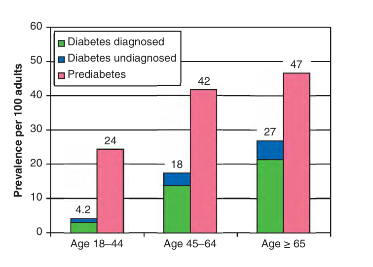
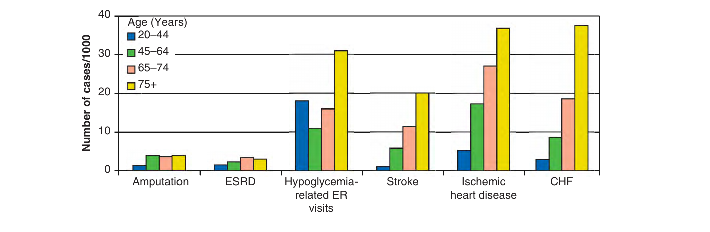
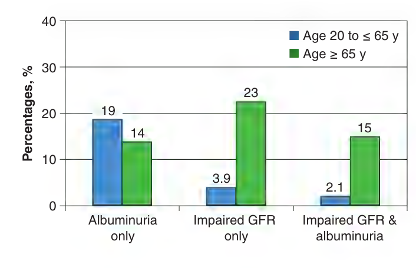
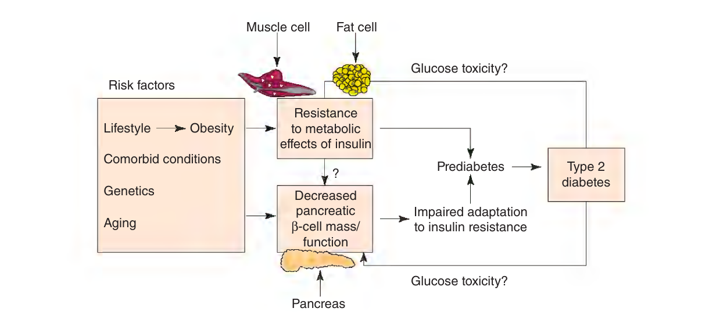
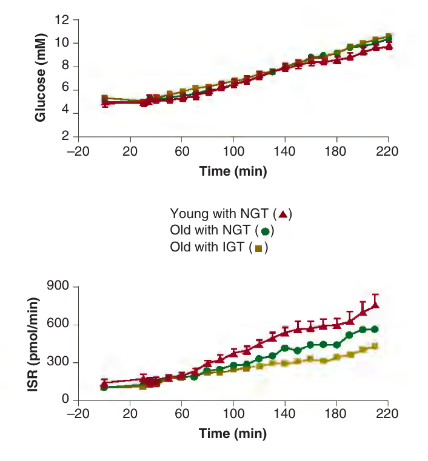
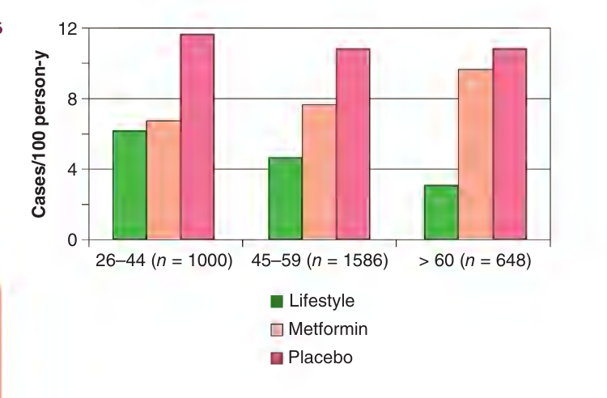
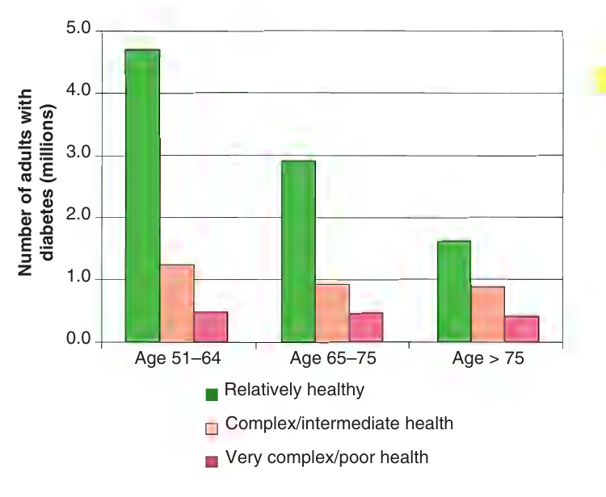

# Hazzard's Geriatric Medicine and Gerontology, 8e — Chapter 99: Diabetes Mellitus

Pearl G. Lee, Jeffrey B. Halter

> **Status (21 Sep 2026).** Content reviewed by the chat lane against the page images in two rounds (every table page, all five 2026 question crops, p1563). Published with automated red tests pending: 3 of 59 mutations run, all red.

> **Source and method.** Printed pages 1559–1588 of the 8th edition, from the publisher's own text layer (1,824-page copy; PDF page = printed + 34; page 1564 is printed sideways and was read rotated). Prose, both boxes, all 16 tables and the eight figure captions. The figures are supplied as page images, not transcribed. Checked against an independently typeset copy of the same chapter (see the check report). Page markers are **printed** page numbers, the ones the examiners cite. The two boxes are moved up to follow the opening paragraph; nothing else is reordered. A paragraph that runs over a page turn carries the turn inline where it happens.

> **2026 exam.** Five questions of the 2026 specialist sitting were sourced to this chapter: Q6, Q25, Q37, Q49, Q59 (IMA reference list 885647). Their pages are flagged inline with ⟨2026⟩; the questions are at the end.

> **Currency — declared gap (chapter).** The chapter cites the ADA 2021 Standards of Care and the 2019 Endocrine Society guideline. Later editions are not held here, so no statement below is marked superseded. Where a table is a catalogue as of press (99-6, 99-11, 99-12) the gap is declared at that table; sentences that rank agents ("first-line") carry their own marker. The book is the examiners' reference for questions sourced to it.

> **As printed, not corrected.** Book errors are flagged under the table they occur in (99-11, 99-12). The superscript asterisk after "Endocrine Society" in the source lines is the book's.

**[p. 1559]**

Diabetes mellitus is a common metabolic disorder affecting older people. Although it is recognized by its effects on carbohydrate metabolism to cause hyperglycemia, diabetes usually also affects lipid and protein metabolism. With time, effects of diabetes on the cardiovascular system, the kidneys, the retina, and the peripheral nervous system, often referred to as long-term complications of diabetes, substantially increase mortality and morbidity in older adults. Furthermore, diabetes may accelerate the risk and contribute to worse outcomes for other common age-related conditions, including physical function decline, cognitive impairment, and geriatric syndromes. Older adults with diabetes are highly heterogeneous in their health and functional status. Many older adults who are relatively healthy and have good functional status may benefit from the same aggressive, often complex diabetes care regimen that is recommended for younger adult diabetes patients. However, the risks and difficulties of implementing such a diabetes care regimen may lead to more harm than benefit for some older adults, especially those who have many comorbidities. Therefore, diabetes management and goals of care for older adults should be individualized to address the heterogeneity of this population. More research is needed to identify optimal care for older patients with diabetes, improve their functional outcomes, and preserve their long-term independence.

#### Learning Objectives

- Understand the epidemiology of diabetes and the heterogeneity of its complications and comorbidities in older adults, including geriatric conditions.
- Describe preventive strategies and initial management strategies for diabetes in older adults.
- Determine appropriate diabetes management goals and regimens for older adults, based on their individual functional status, cognition, and available social support.

#### Key Clinical Points

1. Older adults, as a result of interactions among genetics, lifestyle, and aging, are at high risk of developing prediabetes and diabetes.
2. Intensive lifestyle interventions, including diet and physical activity to achieve weight loss, are effective strategies for prevention of progression from prediabetes to diabetes and for management of diabetes in older adults.
3. Treatment of diabetes in the older adult, particularly drug therapy, should involve consideration of patient and caregiver preferences, and other coexisting medical and geriatric conditions.

## Definition

Diabetes mellitus is a heterogeneous set of disorders affecting multiple body systems; however, diabetes diagnostic criteria are based on documentation of elevated blood glucose levels. While glucose levels vary during the course of the day, the diagnostic criteria for diabetes mellitus are based on standardized values that predict poor outcomes in population studies. The challenge of establishing appropriate diagnostic criteria for older adults is made more difficult by well-described effects of aging on glucose metabolism (summarized later in this chapter in the section on “Effects of Aging”). Table 99-1 summarizes the currently accepted diagnostic criteria published by the American Diabetes Association (ADA), which were most recently updated in 2021.

### Type 1 Diabetes

Type 1 diabetes is a condition characterized by destruction of the insulin-producing β-cells of the endocrine pancreas, resulting in absolute deficiency of insulin. While evidence of cell-mediated autoimmunity is a hallmark of type 1 diabetes, some patients develop a type 1 diabetes phenotype with evidence of severe insulin deficiency and episodes of diabetic ketoacidosis (DKA) with no detectable autoimmunity. Such individuals have idiopathic type 1 diabetes. Although the incidence of new-onset type 1 diabetes in older adults is very low, effective treatment of type 1 diabetes may prevent or delay the development of long-term complications and increased mortality. Thus, people who develop type 1 diabetes earlier in life now often live to old age and therefore become a part of the spectrum of diabetes mellitus in an older adult population.

**[p. 1560]**

**Table 99-1 — Three methods to determine dysglycemia and diagnostic criteriaᵃ for diabetes in all adults, regardless of age**  *(printed 1560)*

| Glycemic status | A1C | FPG | OGTT (2-H glucose) |
|---|---|---|---|
| Diabetes | ≥ 6.5% | ≥ 126 mg/dL (7 mmol/L) | ≥ 200 mg/dL (11.1 mmol/L) |
| Prediabetes | 5.7%–6.4% | 100–125 mg/dL (5.6–6.9 mmol/L) | 140–199 mg/dL (7.8–11.0 mmol/L) |
| Normal | < 5.7% | < 100 mg/dL (5.5 mmol/L) | < 140 mg/dL (7.8 mmol/L) |

FPG, fasting plasma glucose, glucose measurement after no caloric intake for at least 8 hours; A1C, glycosylated hemoglobin A1C; OGTT, oral glucose tolerance test, 2 hours. ᵃAny of these criteria should be confirmed on a separate day to establish a diagnosis of diabetes.

**Table 99-2 — Drugs that may increase glucose levels**  *(printed 1560)*

- Diuretics
- α-Adrenergic agonists
- β-Adrenergic blockers
- Alcohol
- Ca²⁺ channel blockers
- Caffeine
- Clozapine
- Glucocorticoids
- Growth hormone
- Nicotine
- Nicotinic acid
- Nonsteroidal anti-inflammatory drugs
- Female sex steroids (estrogen/progesterone)
- Pentamidine
- Phenytoin

### Type 2 Diabetes

Approximately 90% of older adults with diabetes have type 2 diabetes. Hyperglycemia, often asymptomatic, is the hallmark and DKA is not part of the clinical syndrome. Type 2 diabetes is associated with a progressive insulin secretory defect, but severe absolute insulin deficiency is usually not present. Coexisting obesity is common, and resistance to insulin’s metabolic effects is usually a characteristic feature. While there is a strong genetic predisposition to development of type 2 diabetes, its etiology remains unknown and is likely to be both highly heterogeneous and multifactorial. The interaction between genetics, lifestyle factors, and aging in the development of type 2 diabetes is discussed later in this chapter in the section on “Pathophysiology.”

### Other Specific Types of Diabetes

The ADA classification for diabetes mellitus identifies a number of specific conditions that lead to development of diabetes, each of which is relatively uncommon. One group of disorders includes genetic defects of the pancreatic β-cell. The clinical phenotype for these genetic disorders is maturity-onset diabetes of youth (MODY). These genetic disorders have autosomal dominant inheritance with first presentation of asymptomatic hyperglycemia early in life. Patients with MODY can live to old age, however, and therefore become part of the spectrum of diabetes in an older adult population. The metabolic disorder in some affected individuals may be mild, whereas others may develop symptomatic hyperglycemia and long-term complications of diabetes mellitus similar to patients with typical type 2 diabetes. Another type of genetic defect has been identified in a few families in which insulin processing prior to secretion is impaired, which can predispose to development of hyperglycemia.

Other families have genetic defects affecting insulin action. Severe insulin resistance results, and when it is not adequately compensated for by increased insulin secretion, hyperglycemia occurs. Diseases of the exocrine pancreas can lead to damage to pancreatic β-cells, diminished insulin secretion, and hyperglycemia. Hyperglycemia also can occur in patients with excessive secretion of hormones that adversely affect carbohydrate metabolism, such as in acromegaly, Cushing syndrome, glucagonoma, and pheochromocytoma. Similarly, tumors making aldosterone can cause hyperglycemia as a result of hypokalemia-induced inhibition of insulin secretion. A number of drugs or toxins can impair insulin secretion or insulin action and lead to the development of hyperglycemia. Table 99-2 lists such drugs. Several genetic neuromuscular disorders are associated with diabetes mellitus, but they are rare in the older adult population.

### Gestational Diabetes Mellitus

Gestational diabetes mellitus (GDM) refers to the first identification of an alteration in glucose metabolism during pregnancy. While GDM per se is not part of the spectrum of diabetes in older adults, a history of GDM may be part of the background of an older woman presenting with type 2 diabetes. GDM has been aggressively screened for and treated, thus increasing numbers of women reaching the geriatric age group will have this history, as GDM affects approximately 4% of all pregnancies in the United States. After pregnancy, 5% to 10% of women with GDM continue to have type 2 diabetes. Women who have had GDM have a 20% to 50% chance of developing diabetes in the next 5 to 10 years.

### Diagnostic Criteria

The rationale for the circulating glucose level criteria shown in Table 99-1 is based on prediction of risk for diabetes-related complications. For example, a 2-hour value during the oral glucose tolerance test (OGTT) greater than or equal to 200 mg/dL is a strong predictor of diabetes complications, even when the fasting glucose level (FPG) is less than 126 mg/dL. The term “isolated postchallenge hyperglycemia” **[p. 1561]** (IPH) is sometimes used for individuals who meet the 2-hour OGTT criterion for diabetes, but who do not meet the fasting glucose criterion. There is no age adjustment in the recommended criteria for the diagnosis of diabetes mellitus because the same glucose level cut points that predict complications appear to apply regardless of age.

**Table 99-3 — Criteria for annual screening for diabetes or prediabetes in high-risk older adults**  *(printed 1561)*

- Presence of overweight or obesity (BMI ≥ 25 kg/m²)
- First-degree relative with diabetes
- High-risk race/ethnicity (eg, African American, Latino, American Indian, Asian, Pacific Islander)
- History of CVD
- Hypertension (≥140/90 mm Hg or on therapy for hypertension)
- HDL cholesterol level < 35 mg/dL (0.90 mmol/L) and/or a triglyceride level > 250 mg/dL (2.82 mmol/L)
- Women with polycystic ovary syndrome or history of GDM
- Physical inactivity
- Other clinical conditions associated with insulin resistance (eg, glucocorticoid therapy, acanthosis nigricans)
- Prior diagnosis of prediabetes
- HIV on antiretroviral therapies

CVD, cardiovascular disease; GDM, gestational diabetes mellitus; IFG, impaired fasting glucose; IGT, impaired glucose tolerance. Data from American Diabetes Association. 2. Classification and Diagnosis of Diabetes: Standards of Medical Care in Diabetes-2021. Diabetes Care. 2021;44(Suppl 1):S15–S33.

Since 2010, diagnostic criteria for diabetes include a hemoglobin A1C level of 6.5% or higher. An A1C of 6.5% or higher predicts diabetic retinopathy at approximately the same rate (ie, 10%) as in individuals who are diagnosed on the basis of the fasting and postchallenge glucose criteria.

Adding A1C as a diagnostic criterion for diabetes can improve the identification of asymptomatic diabetic patients. About 20% of people who meet criteria for diabetes, or 8 million of the US population, are undiagnosed. The A1C test does not require the patient to be fasting; it can be done at any time that a clinical visit is scheduled, is simpler to perform than the OGTT, and is less dependent on the patient’s health status at the time a blood sample is obtained. On the other hand, the A1C level will be falsely lowered by any health condition that shortens red blood cell survival such as acute or chronic blood loss, hemoglobinopathies, hemolytic anemia, thalassemia, spherocytosis, and severe hepatic and renal disease. Among certain ethnic populations such as African-Americans, the A1C level is slightly higher than in White Americans when matched for actual degree of glycemia.

The three different criteria shown in Table 99-1 are not entirely concordant in diagnosing diabetes. For example, in a sample of adults aged 70 to 79 years without known diabetes, 36% of them met the criteria for diabetes using both A1C and FPG test; another 36% met the criteria using A1C only and 28% using FPG only. When comparing FPG, OGTT, and A1C tests to diagnose diabetes, A1C identified the fewest individuals as having diabetes. Such studies suggest that A1C, FPG, and OGTT measure different aspects of glycemia. Furthermore, the discordance among these tests is particularly significant in older adults. At this time, unless there are clear clinical hyperglycemic symptoms, the ADA recommends verifying with two diagnostic tests for confirmation (eg, both FPG > 125 mg/dL and A1C ≥ 6.5%). If a patient has discordant results on two different tests, then the test with the result higher than the diagnostic threshold should be repeated to confirm the diagnosis. For example, if FPG is less than 126 mg/dL (7 mmol/L) but A1C is greater than or equal to 6.5%, then A1C should be repeated, and if the repeat A1C is greater than or equal to 6.5%, then the person would be considered to have diabetes.

The ADA criteria shown in Table 99-1 also define prediabetes, an earlier stage in the development of diabetes. People with prediabetes do not meet the criteria for diabetes, but have glucose levels that are higher than normal. These people are at increased risk for developing diabetes and cardiovascular disease (CVD). People with prediabetes include those with impaired glucose tolerance (IGT), impaired fasting glucose (IFG), or an A1C range of 5.7% to 6.4%. IGT is based on results of an OGTT, and IFG is defined from FPGs. The IFG category allows easy identification of some, but not nearly all, of the older individuals who would meet criteria for IGT if an OGTT were performed. There is no recommended age adjustment for the criteria for either IGT or IFG, as these criteria predict risk for subsequent diabetes and CVD similarly in older people.

### Diagnostic Testing for Older Adults

The ADA 2021 Standards of Medical Care in Diabetes and the 2019 Endocrine Society Guideline on Treatment of Diabetes in Older Adults (both evidence-based) recommend screening all individuals older than age 65 with FPG and/or A1C level to detect prediabetes or diabetes. The Endocrine Society Guideline further suggests obtaining a 2-hour glucose post–OGTT measurement in older people with prediabetes values to identify those who meet diabetes criteria (ie, IPH), especially in high-risk populations. The rationale for such screening includes the high rate of undetected diabetes mellitus in population studies and the strong evidence that early intervention delays the progression to diabetes in people with prediabetes, including those older than 60. The ADA standards and the Endocrine Society Guideline recommend follow-up screening every 2 to 3 years based on the patient’s situation. However, yearly follow-up testing of people at high risk should be considered (see Table 99-3 for high risk factors), especially those who meet criteria for prediabetes.

## Epidemiology

Type 2 diabetes is a growing worldwide problem, becoming the 10th leading cause of death globally in 2017. Although the death rate (deaths/100,000 persons) fell slightly in North America and most of Europe between 2007 and **[p. 1562]** 2017, it has increased steadily in Asia, India, Mexico, and northern Africa. Both the prevalence of diabetes and the rate of new cases of diabetes are projected to increase in the next three decades. These projected increases are attributable to aging of the world’s population, increasing numbers of higher-risk ethnic groups, and people with diabetes living longer due to falling rates of cardiovascular deaths.

> *FIGURE 99-1. Diabetes (diagnosed and undiagnosed) and prediabetes prevalence in the United States in adults aged 18 or older, 2013–2016. (Diabetes defined by A1C, fasting blood glucose, or 2-h OGTT; Data from National Diabetes Statistics Report 2020. Estimates of Diabetes and Its Burden in the United States. US Department of Health and Human Services. Centers for Disease Control and Prevention.)*

> *FIGURE 99-2. Incidence (per 1000) of major diabetes complications among adults with diabetes, by age, 2009. CHF, congestive heart failure; ER, emergency room; ESRD, end-stage renal disease. (Data from National Diabetes Statistics Report 2020. Estimates of Diabetes and Its Burden in the United States. US Department of Health and Human Services. Centers for Disease Control and Prevention.)*

Diabetes was the seventh leading cause of death in the United States in 2019 based on death certificate records. In fact, diabetes may be underreported as a cause of death. Only 35% to 40% of people who died with diabetes had it listed anywhere on the death certificate, and only 10% to 15% had it listed as the underlying cause of death. Overall, risk for death among those with diabetes is about twice that of people with similar age but without diabetes. Over 70% of diabetes attributed deaths occurred among people age 70 and older.

Figure 99-1 describes the prevalence of diabetes (diagnosed and undiagnosed) by age groups in the United States in 2013 to 2016, along with the prevalence of people with prediabetes (https://www.cdc.gov/diabetes/pdfs/data/statistics/national-diabetes-statistics-report. pdf, accessed 5/31/2021). Among people aged 65 or older in the United States, the total prevalence of diabetes is about 27% and the prevalence of prediabetes is nearly 50%, both higher than younger age groups. About 20% of people meeting criteria for diabetes are undiagnosed. The incidence rate of newly diagnosed diabetes is the highest among those aged 45 to 64 and 65 to 79, estimated at 10 new cases/1000 people and 9 new cases/1000 people in 2017 to 2018, respectively.

Older adults with diabetes mellitus are susceptible to all the usual complications of diabetes. Rates of end-stage renal disease (ESRD), loss of vision, myocardial infarction, stroke, peripheral vascular disease (PVD), and peripheral neuropathy all increase with age in the absence of diabetes, and their incidence and co-occurrence are all exaggerated by the presence of diabetes in older adults, as shown in Figure 99-2. Patients with diabetes are at very high risk for CVD, and this risk increases dramatically with age. In 2011, the percentage of US adults with diabetes reporting heart disease or stroke was 28% among those aged 35 to 64, 43% among those aged 65 to 74, and 55% among those aged 75 or older.

Diabetic kidney disease (DKD) is the leading cause of chronic kidney disease (CKD) in the United States. Identification of DKD involves assessment of kidney function, usually with an estimated glomerular filtration rate (eGFR) less than 60 mL/min/1.73 m², and kidney damage, usually by estimation of albuminuria greater than 30 mg/g creatinine. Approximately 50% of individuals with diabetes older than age 65 have DKD, manifested as albuminuria, impaired GFR, or both (Figure 99-3). Figure 99-3 also shows that the **[p. 1563]** ⟨2026: Q49⟩ prevalence of combined albuminuria and impaired GFR is much higher in older people. This is especially important as combined albuminuria and impaired GFR is a strong predictor of future risk of CVD in this population. DKD accounts for nearly half of all incident cases of ESRD in the United States, and the rate is highest among those aged 75 or older. Five-year survival for patients with ESRD is less than 40%; therefore, prevention of DKD is important to improve health outcomes of older persons with diabetes.

> *FIGURE 99-3. Prevalence of diabetic kidney disease in the United States, 2005–2008. GFR, glomerular filtration rate. (Data from de Boer IH, Rue TC, Hall YN, et al. Temporal trends in the prevalence of diabetic kidney disease in the United States. JAMA. 2011;305[24]:2532–2539.)*

Diabetic retinopathy may be the most common microvascular complication of diabetes. It is responsible for approximately 10,000 new cases of blindness every year in the United States alone. Retinopathy may begin to develop as early as 7 years before the diagnosis of diabetes in patients with type 2 diabetes.

Diabetic neuropathy is usually defined by the presence of symptoms and/or signs of peripheral nerve dysfunction in people with diabetes after the exclusion of other causes. Diabetic neuropathy is highly correlated with the duration of diabetes, and it is estimated that approximately 50% of patients with diabetes will eventually develop neuropathy. Clinical and subclinical neuropathies have been estimated to occur in 10% to 100% of diabetic patients, depending on the diagnostic criteria and patient populations examined.

In an older adult population, the presence of hyperglycemia and diabetes mellitus should be viewed as a risk factor for these complications, analogous to hypertension or hypercholesterolemia. The level of increased relative risk may appear modest on an individual level. However, since older people have by far the highest rates of these conditions, the increase in absolute risk is substantial. Thus a twofold relative risk increase as occurs for myocardial infarction, stroke, and ESRD, represents a very large number of added adverse outcomes in an older adult diabetes population. The risk for lower-extremity amputation is dramatically increased in older people with diabetes mellitus, approximately 10-fold greater than that for older people without diabetes.

As a result of the growing number of older people with diabetes and their high risk for diabetes complications, diabetes is costly for the US health care system. Over $300 billion were spent on patients with diabetes in the United States in 2017, and the majority of these costs were for older adults with long-standing diabetes and severe complications. On average, people with diagnosed diabetes have medical expenditures approximately 2.3 times higher than those without diabetes: approximately $1 in $5 health care dollars is spent caring for someone with diagnosed diabetes and approximately $1 in $10 health care dollars is attributed to diabetes. The annual attributed health care cost per person with diabetes increases with age, primarily as a result of increased use of hospital inpatient and nursing facility resources, physician office visits, and prescription medications. For example, 63% of the inpatient hospital costs for diabetes are attributed to utilization by adults aged 65 or older compared to 30% and 6% by adults aged 45 to 64 and younger than 45, respectively.

## Pathophysiology

Although the rate of new onset of type 1 diabetes is relatively low in older people, the mechanism for type 1 diabetes does not appear to be different in this population. Usually, patients with type 1 diabetes have markers of immune destruction of pancreatic β-cells such as islet cell antibodies, antibodies to insulin, or other pancreatic β-cell–specific antibodies. There are also strong human leukocyte antigen associations.

Type 2 diabetes is by far the most prevalent form in older adults. Autoimmune destruction of pancreatic β-cells is rarely observed. Limited pathologic investigation suggests that total β-cell mass may be moderately reduced, but severe loss of β-cell mass is uncommon. The pathophysiology of type 2 diabetes is unknown, but it appears to occur as a result of a complex interaction among genetic, lifestyle, and aging influences, as illustrated in Figure 99-4. The heterogeneity of type 2 diabetes likely reflects the varying contributions of each of multiple factors to the development of hyperglycemia in a given individual or family.

### Effects of Aging

Many studies have demonstrated age-related glucose intolerance in humans. In normal people who do not meet criteria for either diabetes mellitus or IGT, there is a slight age-related increase in FPGs and a more dramatic slowing of return to normal of glucose levels following an oral glucose challenge.

### Insulin Resistance

There is a decline in sensitivity to the metabolic effects of insulin with age. An age-related impairment of intracellular insulin signaling reduces insulin-mediated mobilization of glucose transporters, which are critical to glucose uptake and metabolism in insulin-dependent tissues such as muscle and fat. There is currently little evidence for an age-related impairment of insulin effects on protein or fat metabolism.

**[p. 1564]**

> *FIGURE 99-4. Model for age-related hyperglycemia. Biological changes associated with risk factors give rise to alterations in both insulin secretion and insulin sensitivity.*

> *FIGURE 99-5. Effect of age on insulin secretion rate (ISR) in humans with normal glucose tolerance (NGT) or impaired glucose tolerance (IGT) by American Diabetes Association criteria. Plasma glucose concentrations and ISR are shown over time during intravenous glucose infusions, comparing young with NGT (n = 15, mean age = 26), old with NGT (n = 16, mean age = 70), and old with IGT (n = 14, mean age = 70). Glucose levels during variable rate glucose infusion begun at time 0 were well matched in the three study groups, and degree of insulin resistance was also similar in the three study groups. ISR was significantly and progressively decreased in the two older groups, with the greatest impairment in old IGT (p = 0.0002, old IGT vs young and old IGT vs old NGT; and old NGT vs young NGT). Data are means ± SE. (Adapted with permission from Chang AM, Smith MJ, Galecki AT, et al. Impaired beta-cell function in human aging: response to nicotinic acid-induced insulin resistance. J Clin Endocrinol Metab. 2006;91[9]:3303–3309.)*

An absolute or relative increase of body adiposity, particularly central body adiposity, has been well-documented with advancing age and appears to account in large part for the age-related increase in insulin resistance. Decreased physical activity (PA) is associated with insulin resistance, and exercise training can improve insulin sensitivity. Thus, diminished PA in an older individual can also contribute to decreased insulin sensitivity. Both in animal studies and in humans, it has been difficult to demonstrate a residual effect of aging on insulin action when the changes in body composition and PA are controlled for.

### Impaired Insulin Secretion

The progression from normal glucose tolerance to prediabetes and type 2 diabetes in aging is characterized by progressive defects in pancreatic β-cell function. Animal studies have demonstrated an age-related decline in β-cell function. However, there has been great variability in previous studies examining insulin secretion in older people. These human studies, however, may have failed to address adequately the importance of the normal adaptive response to insulin resistance. As most older individuals demonstrate insulin resistance, a compensatory increase of insulin secretion, leading to increased circulating insulin levels, would be expected. However, both basal and stimulated insulin levels in older adults are similar to those of insulin-sensitive young people, suggesting an inadequate adaptive response to insulin resistance in older subjects. Furthermore, when older and younger people are carefully matched for degree of insulin sensitivity, absolute impairments in β-cell function are evident with normal human aging, as shown in Figure 99-5. Such defects are even greater in older people with prediabetes. Thus, impaired pancreatic β-cell adaptation to insulin resistance is an important contributing factor to age-related glucose intolerance and risk for diabetes.

**[p. 1565]**

### Interaction Between Impaired Insulin Secretion and Insulin Resistance

As summarized in Figure 99-4, in the setting of impaired β-cell function, there is a maladaptive response leading to impaired insulin secretion and progression to prediabetes and type 2 diabetes. Hyperglycemia, in turn, is known to contribute directly to insulin resistance and to impair pancreatic β-cell function, thereby setting up a vicious cycle of maladaptive mechanisms.

Coexisting illness is another factor affecting both insulin sensitivity and insulin secretion in an older person. Both hypertension and hyperlipidemia are common in older people and have been associated with diminished insulin sensitivity. In fact, a metabolic syndrome has been described that includes coexisting hypertension, hyperlipidemia, central obesity, and glucose intolerance. Some have proposed that insulin resistance is a unifying feature linking the components of this metabolic syndrome; however, there is uncertainty about whether the insulin resistance in these circumstances is primary or a secondary result of these other conditions. Furthermore, any acute illness can precipitate hyperglycemia because of effects of stress hormones to cause insulin resistance combined with the α-adrenergic effects of catecholamines released during stressful illness to inhibit insulin secretion. Drugs that may be used by older people may also contribute to hyperglycemia by causing insulin resistance (see Table 99-2).

A pathogenetic sequence common to many syndromes in old age can be readily illustrated by diabetes in an older patient: asymptomatic hyperglycemia over time becomes symptomatic, leading to acute complications and such syndromes as hyperosmotic nonketotic coma or, with time, to microvascular or macrovascular complications such as renal disease, stroke, or myocardial infarction. These events may in turn lead to superimposed drug treatment– induced aggravation of impaired glucose regulation and to decreased PA, progressive disability, and functional decline: that is, a downward spiral of mutually reinforcing conditions perhaps triggered by an event such as influenza or a fall that would be readily withstood by a younger person, especially a younger person without diabetes.

### Genetics

There is a strong genetic predisposition to type 2 diabetes mellitus. For example, the concordance rate for type 2 diabetes in identical twins is 75% or higher. However, the genetic susceptibility to type 2 diabetes is polygenic, involving a number of variants, where each allele has a modest effect on the risk of disease in an individual person. Genome-wide association studies, linkage analysis, a candidate gene approach, and large-scale association studies have already identified approximately 70 loci conferring susceptibility to type 2 diabetes. These genetic alleles appear to affect the risk of type 2 diabetes primarily through impaired pancreatic β-cell function, reduced insulin action, or obesity risk. A goal of genetic testing would be to improve clinical prediction of an individual’s risk for developing diabetes, but this goal remains elusive.

### Mechanisms for Diabetes Complications

Chronic exposure to hyperglycemia may contribute directly to the development of diabetes complications in a number of ways. One mechanism may be the interaction of glucose with proteins to cause protein glycosylation and subsequent formation of advanced glycosylation end (AGE) products. The AGE products can accumulate in proteins of slow turnover such as collagen, potentially leading to tissue damage and injury. Tissue exposure to high concentrations of glucose can also lead to accumulation of metabolic products of the aldose reductase system including nonmetabolized molecules such as sorbitol. Such accumulation can potentially affect cellular energy metabolism and contribute to cell injury and death. Given the complexity of the genetic background contributing to type 2 diabetes, the possibility also exists that some of the genetic background of an individual may directly contribute to the risk for one or more long-term complications of diabetes (eg, nephropathy) independent of the effects of hyperglycemia. However, such a possibility remains speculative. Interactions between diabetes and other comorbidities may contribute to the manifestation and severity of diabetes-related complications. Diabetic patients who also have hypertension are at greater risk for renal disease, retinopathy, and macrovascular disease than diabetic patients without hypertension. Similarly, neuropathy is more likely in a diabetic patient who is exposed to a neurotoxic agent. Growth factors, including vascular endothelial growth factor, growth hormone, and transforming growth factor β, have been postulated to play important roles in the development of diabetic retinopathy.

## Prevention

Type 2 diabetes is a gradually progressive disorder of carbohydrate metabolism that develops over a long period of time. It has been estimated that abnormalities of glucose regulation can be detected 8 to 10 years before the clinical diagnosis of type 2 diabetes is made. Older adults have a high rate of prediabetes and other risks for progressing to type 2 diabetes in the next few years (eg, see Table 99-3).

Effective means to delay progression to type 2 diabetes in high-risk people, such as those with prediabetes, have been identified. Intensive lifestyle interventions, which include weight loss and increased PA, can substantially reduce the rate of progression to type 2 diabetes in such high-risk people. Lifestyle intervention appears to be especially beneficial in prevention of progression to diabetes among older adults. For example, in the multicenter Diabetes Prevention Program (DPP) in the United States, a lifestyle intervention program including both caloric restriction and exercise was remarkably effective in reducing the rate of progression to type 2 diabetes, even though only 5% to 7% weight reduction was achieved. During the **[p. 1566]** 3 years of active treatment in DPP, the lifestyle intervention program was more effective in people older than age 60 than in younger people, reducing progression to diabetes by more than 70% as compared to a control group, as shown in Figure 99-6. Metformin was also used in the DPP and was effective in slowing progression in younger adults, but had somewhat less effect in people older than age 60.

> *FIGURE 99-6. Diabetes incidence rates by age, Diabetes Prevention Program. (Reproduced with permission from Diabetes Prevention Program Research Group, Crandall J, Schade D, et al. The influence of age on the effects of lifestyle modification and metformin in prevention of diabetes. J Gerontol A Biol Sci Med Sci. 2006;61[10]:1075–1081.)*

The benefit of lifestyle intervention appears to be long term among older adults, as they had reduced frequency of developing type 2 diabetes during 15 years of follow-up after the original lifestyle intervention, associated with maintenance of over 5% weight loss by nearly half of lifestyle intervention participants. Overall, onset of diabetes was delayed by about 4 years by lifestyle intervention compared with placebo. Given the benefits observed in the DPP and other similar studies, both the ADA 2021 Standards of Medical Care in Diabetes and the 2019 Endocrine Society Guideline recommend a lifestyle program similar to the DPP to delay progression to diabetes in patients aged 65 years and older who have prediabetes. Since 2018, a DPPlike lifestyle intervention is a covered benefit for Medicare beneficiaries in the United States who meet the criteria for prediabetes.

## Presentation

The finding of an elevated glucose level on routine laboratory testing is the most common presentation for type 2 diabetes in an older person. The classical clinical hallmarks of diabetes are symptoms associated with marked hyperglycemia, including polydipsia, polyuria, polyphagia, and weight loss. Older patients with type 2 diabetes may present with such symptoms, although it is relatively uncommon for them to do so, and the rate of emergency department visits by older adults for severe hyperglycemia have been declining. Some older patients may have sufficient hyperglycemia to cause mild classical symptoms, while others may have had gradual unexplained weight loss. Other older patients may present with atypical symptoms from hyperglycemia such as falls, urinary incontinence, fatigue, or confusion. Because type 2 diabetes may go undetected for years, some older adults first present with symptoms or findings related to diabetes complications, such as visual loss with classic retinopathy on examination, proteinuria, or symptomatic peripheral neuropathy.

With the profound insulin deficiency of type 1 diabetes, mobilization of fatty acids occurs leading to accelerated production of ketoacids, potentially resulting in life-threatening DKA. Although type 1 diabetes usually occurs in early life, it can occur at any age, including first presentation in an older patient. Development of DKA is the classic form of presentation for a patient with type 1 diabetes, but it is now recognized that people with type 1 diabetes may have long periods of abnormal circulating glucose levels before the development of DKA. Furthermore, with early detection of such hyperglycemia and appropriate diabetes management, an episode of DKA might never occur. An older person with type 1 diabetes may be particularly more likely to present with an indolent course.

## Evaluation

Diabetes mellitus is a complex disorder that can have effects on many body systems, and its treatment requires a complex program including lifestyle changes (eg, increase PA, healthy diet) and medications. The choice of intervention strategies and the patient’s capability to adhere to a treatment program may be limited by the presence of other health problems such as cognitive impairment, as well as by the patient’s living environment, economic status, availability of caregiver support, and the like. A comprehensive geriatric assessment (Chapter 8) is highly appropriate to provide the basis for developing a treatment plan for an older person with diabetes mellitus. Both the ADA and Endocrine Society Guidelines recommend assessing the overall health and personal values of older patients with diabetes, including multiple domains of health status and screening for geriatric syndromes, consistent with a Medicare annual wellness exam, as summarized in Table 99-4.

### Medical Evaluation

Once a diagnosis of diabetes is established, a thorough medical evaluation is needed. Because the risk for developing diabetes complications is related to the duration of hyperglycemia, effort should be made to pinpoint the time of onset. Unless patients at risk have been followed up carefully with yearly measurement of an FPG, as currently recommended, it may be difficult to establish a time of onset for type 2 diabetes in a given patient. Given the uncertainty about time of onset, a careful search for **[p. 1567]** existing diabetes complications is warranted even when a new diagnosis is made in an older adult. Such an evaluation is even more justified in a patient with a multiyear history of diabetes mellitus who is establishing a new relationship with a health care system or primary care provider. The evaluation for eye complications of diabetes should be carried out by an ophthalmologist with a detailed retinal examination, as early signs of diabetic retinopathy can easily be missed.

**Table 99-4 — Evaluation of older patients with diabetes**  *(printed 1567)*

> The page prints three independent lists side by side; nothing links an item to the item beside it.

**General health assessmentᵃ**

- Functional status (ADLs/IADLsᵈ)
- Depression
- Cognition
- Fall risk
- Weight (kg)/height (m)² = BMI
- Blood pressure
- Tobacco use
- Alcohol use
- Medication review
- Cancer screening
- Hearing
- Comorbid conditions
- Visual acuity
- Frailty/physical performance

**General health testsᵇ**

- ECG
- Lipid panel
- Bone mineral density
- AAA ultrasound

**Diabetes-specific healthᶜ**

- Retinopathy (dilated retinal examination)
- Nephropathy (urine albumin, eGFR)
- Neuropathy (micro-filament test and tuning fork)
- Medical nutrition therapy
- Diabetes management
- Diabetes self-management training

Abbreviations: AAA, abdominal aortic aneurysm; ADL, activity of daily living; BMI, body mass index; IADL, instrumental activity of daily living. ᵃAll items are required services to qualify for Medicare coverage of annual wellness examinations for people in the United States > 65 y, except for frailty/physical performance. These are generally conducted by primary care providers. ᵇAll items are services covered by Medicare for people in the United States > 65 y as part of annual wellness examinations at intervals varying from annually to once per lifetime. ᶜAll items are services covered by Medicare for people in the United States > 65 y as part of standard diabetes care. These are covered annually except for diabetes management visits, which are covered as recommended by the diabetes care team. ᵈFunctional status is based on assessment of independence or dependency (having difficulty and receiving assistance) of five ADLs (bathing, dressing, eating, toileting, and transferring) and five IADLs (preparing meals, shopping, managing money, using the telephone, and managing medications). Reproduced with permission from LeRoith D, Biessels GJ, Braithwaite SS, et al. Treatment of diabetes in older adults: an Endocrine Society\* clinical practice guideline. J Clin Endocrinol Metab. 2019;104(5):1520–1574.

Evaluation of DKD should include a screening urine albumin and serum creatinine level, which should be followed at least annually. An elevated serum creatinine is a poor prognostic sign, suggesting that substantial kidney damage has already occurred and that an irreversible course of progressive renal insufficiency has already started. Albuminuria is a marker for kidney/glomerular disease as well as for CVD risk and is often the first clinical indicator of the presence of DKD. It is a clinically useful tool for predicting prognosis and for monitoring response to therapy. To confirm a diagnosis of increased albuminuria, it should be measured more than once and two of three samples should be elevated over a 3- to 6-month period. The relationship of albuminuria to ESRD and CVD risk is a continuum, starting from “normal” levels less than 30 mg/g creatinine. Therefore, there is a trend to no longer refer to categorical nomenclature of “microalbuminuria” (30–300 mg/g creatinine) and “macroalbuminuria” (> 300 mg/g creatinine). Depending on the patient’s overall situation, referral to a nephrologist may be warranted to assess other potential causes of renal insufficiency.

A careful neurologic examination should be carried out for signs of diabetic neuropathy. The 2021 ADA Guideline recommends that patients should be assessed for diabetic peripheral neuropathy starting at diagnosis of type 2 diabetes and at least annually thereafter. Assessment for distal symmetric polyneuropathy should include a careful history and assessment of either temperature or pinprick sensation (small fiber function) and vibration sensation using a 128-Hz tuning fork (for large-fiber function). Annual 10-g monofilament testing should be done to identify feet at risk for ulceration and amputation. The neuropathy evaluation should be carried out in conjunction with a careful foot examination to identify possible structural abnormalities that might contribute to risk for skin breakdown and damage.

The medical evaluation of an older patient with diabetes should also include information about other coexisting risk factors including hypertension, hyperlipidemia, and use of cigarettes. These conditions interact with diabetes to increase CVD risk and therefore need to be addressed in an overall patient management program. Blood pressure should be assessed both in the supine position and with upright posture, as an orthostatic drop in blood pressure may be another marker of diabetic neuropathy and is often associated with supine hypertension. The genitourinary system should also be assessed, as patients with diabetes may be prone to bladder dysfunction associated with autonomic neuropathy, thereby increasing the risk for urinary tract infection and kidney damage. Sexual dysfunction has been reported in a high percentage of older men with diabetes, suggesting an interaction between aging, neuropathy, and vascular disease in this population.

A thorough evaluation of the cardiovascular system also should be carried out, given the high rate of CVD in older people with diabetes mellitus. The history and physical examination should carefully assess evidence for CVD, coronary heart disease (CHD), and PVD. Suggestive history or physical findings should be documented with more in-depth testing including Doppler evaluation for carotid artery stenosis or extremity blood flow, or cardiovascular stress testing if there is any suggestion of coronary artery disease. Silent ischemia and myocardial infarction appear **[p. 1568]** ⟨2026: Q25⟩ to be more common in people with diabetes mellitus. Thus, the threshold for stress testing should be rather low.

The pharmacological history of an older patient with diabetes is important both to identify drug therapy that may be contributing to the patient’s hyperglycemia (see Table 99-2), as well as to identify potential drug interactions that may affect diabetes management. The initial assessment should also include a diet history, a review of potential nutritional problems, and an oral health assessment, as dietary intervention is a key component of a treatment program for virtually all patients with diabetes. The assistance of a nutritionist who has a particular interest in diabetes is often very helpful for this part of the evaluation. Particular attention should be paid to dietary habits, ethnic food preferences, and meal patterns.

### Other Evaluation Components

**Diabetes knowledge** Because of the complexity of diabetes management, usually requiring both lifestyle and medication interventions, the patient and/or caregivers must be actively involved in their own care and take responsibility for its many aspects. It is particularly important to review the patient’s knowledge base regarding diabetes and its complications. Standardized diabetes knowledge tests are available, or an interview with a diabetes educator or suitably trained nurse can establish the status of the patient’s knowledge base. The diabetes education program that becomes part of the treatment plan can then provide this base for new patients or fill in needed gaps for existing patients.

**Cognitive function** Since diabetes and aging are each independently associated with increased risk of cognitive impairment, older adults with diabetes are especially at high risk. Dementia, including both Alzheimer type and vascular type, is approximately twice as likely to occur in those with diabetes compared with age-matched nondiabetic people. Subtler impairments of cognition such as mild cognitive impairment (MCI) are also common. Cognitive impairment is associated with poorer glycemic control in clinical trials, and study participants with cognitive impairment had a higher risk for severe hypoglycemia. Hypoglycemia is also associated with higher risk for dementia. Therefore, both the ADA and Endocrine Society Guidelines recommend that older patients with diabetes should have periodic screening for cognitive impairment: at the time of diagnosis, then annually for those with borderline results initially or every 2 to 3 years when initial screening is normal. A positive screening test should be followed up by an appropriate diagnostic evaluation for dementia or MCI.

While advanced dementia may be identified in a routine clinical encounter, moderate cognitive impairment or MCI may be missed. Formal neuropsychological testing demonstrates that patients with diabetes frequently have unrecognized deficits in psychomotor efficiency, global cognition, and memory. They also frequently have abnormalities in cognitive function mediated by frontal lobes (executive function), which can affect their ability to perform complex behaviors such as attention, planning, organization, insight, reasoning, and problem solving. Such complex cognitive functions are necessary for diabetic patients to manage the complex treatment regimens for their disease. Early identification of cognitive impairment will help patients, their families, and health providers to individualize diabetes care regimens to set achievable diabetes goals without causing harm to the patients.

**Functional status** Both aging and diabetes are risk factors for functional impairment, and people with diabetes have more functional impairment than those without diabetes. Both the ADA and Endocrine Society Guidelines recommend that review of activities of daily living and instrumental activities of daily living should be a part of the comprehensive assessment of an older patient with diabetes mellitus (Table 99-4). The presence of functional limitations must be considered in developing a diabetes treatment program, as described below. In addition to general assessment of functional status, the ability of the patient and caregiver to carry out diabetes-specific functional tasks needs to be evaluated. For example, the ability to carry out home glucose monitoring or self-injection of insulin requires certain functional abilities.

**Overall health status** The presence of other medical problems needs to be documented, as decisions about the extent of intervention for diabetes should be made in the context of the patient’s overall health situation, disease burden, and prognosis in terms of functional status and estimated longevity. The presence of psychiatric disorders such as depression or bipolar disorder could have a major impact on the decision about diabetes treatment interventions. The relationship between depression and diabetes appears to be bidirectional. Depression is associated with increased risk of type 2 diabetes (up to 60% higher per one meta-analysis). Individuals with diabetes have twice the rate of depression as those without diabetes, and older patients have higher mortality risk if they have both diabetes and depression. Other coexisting illnesses such as congestive heart failure or uncontrolled cancer may substantially limit a patient’s life expectancy, and thus may influence the decision about intensity of diabetes management.

## Management

### General Approach

The complexity of diabetes and its management requires a collaborative effort by a team of health providers, which may include physicians, nurse practitioners, nurses, dietitians, pharmacists, and mental health professionals. Patients and family members must also assume an active role. There is increasing recognition of the importance of active collaboration between the patient’s geriatrics-oriented primary **[p. 1569]** care team and an endocrinologist who focuses on diabetes care, with the role of each varying depending on the needs of the patient (see Table 99-5).

**Table 99-5 — Roles of the primary care team and endocrinologist in care of older patients with diabetes**  *(printed 1569)*

- 1. In patients aged 65 and older with newly diagnosed diabetes, an endocrinologist should work with the primary care provider, a multidisciplinary team (potentially including a pharmacist, a nurse, a diabetes educator, and a social worker), and the patient in the development of individualized diabetes treatment goals.
- 2. When feasible, an endocrinologist should be primarily responsible for diabetes care in patients aged 65 and older with diabetes who:
    - Have type 1 diabetes
    - Require complex hyperglycemia treatment to achieve treatment goals
    - Have recurrent severe hypoglycemia
    - Have multiple diabetes complications
    - Require hyperglycemia management during hospitalization

Data from LeRoith D, Biessels GJ, Braithwaite SS, et al. Treatment of diabetes in older adults: an Endocrine Society\* clinical practice guideline. J Clin Endocrinol Metab. 2019;104(5):1520–1574.

The first key step in developing a diabetes management program for an older patient is to establish the treatment goals. Basic treatment goals for any patient with diabetes are to prevent metabolic decompensation and to control other risk factors that may contribute to long-term complications. Control of hyperglycemia as a means to reduce what some have termed glucose toxicity as a contributing factor to long-term diabetes complications is one part of an overall strategy of risk reduction. Such a strategy must include intensive effort at identifying and controlling hypertension, lipid disorders, and cigarette smoking among other risk factors (see section below on CVD risk reduction). Thus, a complex, multifaceted treatment program is important for many older patients with diabetes. As other chapters cover the management of hypertension (Chapter 79) and lipid disorders (Chapter 74), these will be referred to only briefly in this chapter. This chapter will focus on management of hyperglycemia. However, control of the traditional CVD risk factors is absolutely critical to successful diabetes management. Unfortunately, many studies have documented the overall lack of success of standard clinical practice in achieving these goals.

Any decision about the level of intensity for a treatment program must take into account coexisting conditions and the overall complexity of the patient’s medical regimen. For example, the existence of advanced diabetes complications in an older patient may provide a rationale for less strict goals for hyperglycemia or dyslipidemia. A significant psychiatric or cognitive disorder may also preclude an intensive management program. The target for hyperglycemia control might need to be higher for a patient at risk for severe hypoglycemia (see the section on “Hypoglycemia” later in this chapter). On the other hand, some older adults are able to devote a substantial amount of time to their own health care and are able to manage complex multidrug interventions for multiple health problems. Based on the initial comprehensive patient assessment as described here, many older adults with diabetes may fit in a category for which intensive treatment goals are appropriate.

It may be neither feasible nor appropriate to attempt to implement a complex diabetes management program for some patients. It is true that a limited remaining life expectancy shortens the time for long-term complications to develop and progress. However, given the increasing life expectancy of older adults, only the very oldest segment of the population or those with coexisting illness that markedly shortens remaining life expectancy should be excluded from consideration for an aggressive treatment program. For example, it would be hard to justify abandoning risk reduction goals in an otherwise healthy 75-year-old woman with a recent diagnosis of type 2 diabetes, as such a person’s remaining life expectancy may be 15 years or more. Given the potential complexity of treatment programs designed to minimize diabetes risks, the commitment on the part of an adequately informed patient is clearly critical. Availability of a supportive environment including a strong diabetes treatment team and adequate economic support for an intensive treatment program are also important. Such a treatment goal is also difficult to achieve without commitment of the health care team, which must believe that achievement of the treatment goal will really make a difference in the patient’s long-term health.

Information about a diabetic patient’s cognitive status, socioeconomic and living situation can also help guide the care plan for an older adult. Limitations in cognition and economic support may affect the patient’s ability to adhere to the medical regimen. The health provider may need to simplify the diabetes regimen or loosen the glycemic and/or blood pressure targets to minimize risks for hypoglycemia and/or hypotension. The health provider may need to enlist the patient’s caregivers to be more involved in the patient’s care. The availability of caregivers in the home or nearby can compensate for some limitations in the patient’s self-care abilities and influence lifestyle factors that can affect diabetes management. For patients who have moderate or advanced cognitive impairment, support for basic home care will be needed either from family or more formal home care services or both, including the tasks of obtaining daily meals, administering medications and monitoring home glucose levels. Some patients may need to be transitioned from the home setting to assisted living facilities or long-term care facilities to receive necessary care. This decision will be influenced by their financial resources and the support of family members. The availability of a social worker or suitably trained nurse to assist in this aspect of the patient’s care program can be extremely helpful.

**[p. 1570]**

> *FIGURE 99-7. Health status by age group of people over age 50 in the United States who have diabetes, based on data from the Health and Retirement Study. Definitions of the three health status categories illustrated are as stated in Table 99-6. (Data from Blaum C, Cigolle CT, Boyd C, et al. Clinical complexity in middle-aged and older adults with diabetes: the Health and Retirement Study. Med Care. 2010;48[4]:327–334.)*

> Highlighting is the owner's annotation, not the book's.

Several approaches have been proposed by diabetes specialists and geriatricians to better identify older adults who would benefit from more strict diabetes control versus less stringent management. Age alone is not a good marker, as age is a poor predictor of overall disease complexity and mortality risk. In Figure 99-7, a group of nationally representative older adults with diabetes were grouped by their comorbidities, physical function status, and cognitive status. While the oldest age group includes many people with very complex/poor health, over 50% of people older than 75 were relatively healthy by these criteria. Thus, a classification based on a patient’s comorbidities, physical function status, cognitive status, social support, history of hypoglycemia, etc can provide the basis for individualized goals to optimize the risk and benefit of diabetes treatments for a given patient. Table 99-6 provides such a framework to guide setting treatment goals for hyperglycemia in older adults with diabetes, published in the 2019 Endocrine Society Guideline (a similar framework is in the ADA 2021 Standards of Care). Based on the patient’s comorbidities, cognitive status, and physical function (as determined from the overall patient evaluation per Table 99-4), s/he may be categorized into one of the three groups. The Good Health group will likely benefit from more stringent glycemic management. The Intermediate Health group will likely have some difficulty in achieving stricter goals for glycemia. The Poor Health group of very complex patients will likely not benefit greatly from intensive treatment of hyperglycemia so a less aggressive goal is more appropriate.

### Diabetes Education and Support

A key component of diabetes care is to educate the patient and their caregivers about the complications associated with diabetes, how to manage diabetes through lifestyle modification and various medications, how to monitor and treat complications associated with diabetes, and the risks and benefits of various medications that may be prescribed. People with diabetes benefit from receiving diabetes self-management education and support (DSMES) when diabetes is diagnosed and as needed thereafter, such as when not meeting treatment targets. DSMES is an ongoing process of facilitating the knowledge, skills, and ability necessary for diabetes self-care. This process is evidence-based, and can be individualized for each patient, incorporating the needs, goals, and life experiences of the individual. DSMES is associated with improved diabetes knowledge and self-care behavior, improved quality of life, lower A1C, and lower health care costs.

Recognizing the effectiveness and the need for DSMES, the Centers for Medicare and Medicaid Services (CMS) and most insurance provide reimbursement for DSMES when the service meets the national standards and is accredited by either the ADA or the American Association of Diabetes Care and Education Specialists (ADCES). Yet, despite reimbursement, only 5% to 7% of individuals eligible for DSMES through Medicare or a private insurance plan actually receive it. The increased availability in telemedicine and internet-based health care may be an opportunity to reduce the barrier for patients to obtain DSMES.

### Cardiovascular Disease Risk Reduction

Some of the risk factors for CVD among diabetic patients include hyperglycemia, dyslipidemia, hypertension, cigarette use, and age-related changes of the cardiovascular system including diminished vascular responsiveness (Table 99-7). Additional risk factors include obesity, insulin resistance, autonomic dysfunction, and inflammation. Individuals with diagnosed diabetes are at higher risk for CHD, and CHD risk also is elevated modestly among individuals with prediabetes.

**Hyperglycemia** Initial interventions targeting hyperglycemia had limited or no benefit on CVD risk reduction for older adults with diabetes. In fact, the ACCORD trial was terminated early due to a higher rate of mortality in the intensively treated glycemic group. However, the results of cardiovascular outcome trials (CVOTs) required by the US FDA since 2008 (and later adopted by the European Medicines Agency) for new glucose lowering drugs have been much more encouraging. The required CVOTs must include higher risk patients including older adults and those with a history of CVD or other diabetes complications. As a result, the average age of study pwarticipants has been over 60. The CVOTs have established the CVD safety of three major newer classes of glucose-lowering drugs: dipeptidyl peptidase-4 (DPP-4) inhibitors, glucagon-like peptide-1 (GLP-1) agonists, and **[p. 1571]** ⟨2026: Q25, Q37 (Table 99-6)⟩ sodium glucose transporter (SGLT)-2 inhibitors. Furthermore, benefits for important CVD outcomes such as CVD deaths and new events, including subanalyses of the oldest age cohorts, were found in trials of three SGLT-2 inhibitors (empagliflozin, canagliflozin, and dapagliflozin) and three GLP-1 agonists (liraglutide, semaglutide, and dulaglutide) currently in use in the United States. As all of these drugs result in modest weight loss (especially the GLP-1 agonists) and lower BP, the positive CVD outcomes observed cannot be ascribed solely to their glucose-lowering effects.

> **As printed.** "pwarticipants" (sic): the book spells it "participants" on p1566. Left as printed.

**Table 99-6 — Conceptual framework for considering overall health and patient values in determining clinical targets in adults aged 65 and older**  *(printed 1571)*

| Overall health category | &nbsp; | Group 1: good health | Group 2: intermediate health | Group 3: poor health |
|---|---|---|---|---|
| Patient characteristics |  | No comorbidities **or** 1–2 non-diabetes chronic illnessesᵃ **and** No ADLᵉ impairments and ≤1 IADL impairment | 3 or more non-diabetes chronic illnessesᵃ **and/or** Any one of the following: – Mild cognitive impairment or early dementia – ≥2 IADL impairments | Any **one** of the following: – End-stage medical condition(s)ᵇ – Moderate to severe dementia – ≥2 ADL impairments – Residence in a long-term nursing facility |
|  |  | ⇦ ⇨ | ⇦ ⇨ | ⇦ ⇨ |
| Use of drugs that may cause hypoglycemia (eg, insulin, sulfonylurea, glinides) | No | Fasting: 90–130 mg/dL Bedtime: 90–150 mg/dL <7.5% | Fasting: 90–150 mg/dL Bedtime: 100–180 mg/dL <8% | Fasting: 100–180 mg/dL Bedtime: 110–200 mg/dL <8.5%ᵈ |
| ″ | Yesᶜ | Fasting: 90–150 mg/dL Bedtime: 100–180 mg/dL ≥7.0 and <7.5% | Fasting: 100–150 mg/dL Bedtime: 150–180 mg/dL ≥7.5 and <8.0% | Fasting: 100–180 mg/dL Bedtime: 150–250 mg/dL ≥8.0 and <8.5%ᵈ |

> The band across the three groups on the page (a double-headed arrow) reads: **Reasonable glucose target ranges and HbA1C by group** / **Shared decision-making: individualized goal may be lower or higher**. The drug-use label spans both the No and the Yes row (″ = same label).

Note: While glucose targets are highlighted for each group in this framework, overall health categories can also be considered for other treatment goals, such as blood pressure and dyslipidemia. See Appendix A on “How to use the conceptual framework.” ᵃCoexisting chronic illnesses may include osteoarthritis, hypertension, chronic kidney disease stages 1–3, or stroke, among others. ᵇOne or more chronic illnesses with limited treatments and reduced life expectancy. These include metastatic cancer, oxygen-dependent lung disease, end-stage kidney disease requiring dialysis, and advanced heart failure. ᶜAs long as achievable without clinically significant hypoglycemia; otherwise, higher glucose targets may be appropriate. Note also that the lower HbA1C boundary was included, as data suggesting increased hypoglycemia and mortality risk at lower HbA1C levels are strongest in the setting of insulin use. However, the lower boundary should not reduce vigilance for detailed hypoglycemia assessment. ᵈHbA1C of 8.5% correlates with an average glucose level of approximately 200 mg/dL. Higher targets than this may result in glycosuria, dehydration, hyperglycemic crisis, and poor wound healing. ᵉADLs include bathing, dressing, eating, toileting, and transferring, and IADLs include preparing meals, shopping, managing money, using the telephone, and managing medications. Includes data from Cigolle CT, Kabeto MU, Lee PG, Blaum CS. Clinical complexity and mortality in middle-aged and older adults with diabetes. J Gerontol A Biol Sci Med Sci 2012; 67(12); 1313-1320 (39); and from Kirkman MS, Jones Briscoe V, Clark N, et al. Diabetes in older adults. Diabetes Care 2012; 35(12); 2650–2664 (40). Abbreviations: IADL, instrumental activity of daily living; ADL, activity of daily living; SU, sulfonylurea. Reproduced with permission from LeRoith D, Biessels GJ, Braithwaite SS, et al. Treatment of diabetes in older adults: an Endocrine Society\* clinical practice guideline. J Clin Endocrinol Metab. 2019;104(5):1520–1574.

> **Currency — declared gap (table frame).** Targets as given by the 2019 Endocrine Society guideline the table reproduces. Later editions of that guideline or of the ADA Standards are not held here. 2026 Q25 and Q37 were keyed to this table as printed.

**Dyslipidemia (see Table 99-8)** There are no large trials of lipid-lowering interventions specifically in older adults with diabetes. Trials of older adults at risk for CVD that include but are not limited to those with diabetes have shown consistent CVD benefits across the age spectrum. Several trials in adults with diabetes have demonstrated a beneficial effect of statins on lipid profiles and a reduction in CVD events, including subanalyses of the oldest age cohorts. As CVD prevention with statins, especially in people with prior CVD, is apparent within 1 to 2 years, statins may be indicated for nearly all older adults with diabetes except those with an end-stage disease and very limited life expectancy. For patients aged 75 years or older without atherosclerotic CVD, the benefit of statin therapy is still being studied.

**Hypertension (see Table 99-8)** Lowering blood pressure from very high levels (eg, systolic blood pressure [SBP] 170 mm Hg) to moderate targets (eg, SBP 150 mm Hg) reduces CVD risk in older adults with diabetes. However, the ACCORD-BP trial showed no benefit on major CVD events of an SBP target less than 120 mm Hg compared with less than 140 mm Hg, but found a significant reduction in stroke. Other studies found no benefit when lowering SBP to less than 140 mm Hg, and low diastolic blood pressure (DBP) (eg, < 70 mm Hg) may actually be a risk factor for mortality in older adults. These findings contrast with those of SPRINT and other studies in older people without diabetes indicating added CVD protection with **[p. 1572]** lower SBP targets (see Chapter 79). Thus, the ideal BP target for older people with diabetes is controversial. However, both the 2021 ADA and 2019 Endocrine Society Guidelines recommend lowering BP to less than 140/90 for most older diabetes patients, with adjustments based on patient preference and overall health status. For example, a higher SBP target may be appropriate for some patients with poor health per Table 99-6. Conversely, some high-risk patients (eg, previous stroke or progressing CKD) could be considered for a lower BP target such as 130/80 mm Hg. If a lower BP target is selected, the patient should be carefully monitored to avoid orthostatic hypotension. Both the 2021 ADA and 2019 Endocrine Society Guidelines recommend an angiotensin-converting enzyme (ACE) inhibitor or angiotensin receptor blocker (ARB) as first-line therapy for hypertension in older diabetes patients with evidence of nephropathy.

**Table 99-7 — Cardiovascular disease risk factors among older adults with diabetes, in addition to fasting plasma glucose level**  *(printed 1572)*

- Elevated systolic blood pressure
- Cigarette use
- Obesity
- Elevated total cholesterol
- High non-HDL cholesterol
- Long duration of diabetes
- Elevated 2-h plasma glucose concentration during an oral glucose tolerance test
- Age-related changes to the cardiovascular system
    - Heart
        - Slowing kinetics of diastolic filling
        - Left ventricular wall thickening
        - Left atrial enlargement
        - Augmentation in the atrial contribution to diastolic ventricular filling
        - Decreased cardiovascular reserve function
        - Increased risk for arrhythmia
        - Altered regulation of cardiomyocyte calcium homeostasis
    - Arterial system
        - Diffuse intimal thickening
        - Stiffening of the aorta and carotid arteries
        - Endothelial dysfunction

**Table 99-8 — Interventions to reduce cardiovascular disease risk in older adults with diabetes, in addition to glycemic management**  *(printed 1572)*

- 1. Dyslipidemia
    - Statin therapy and an annual lipid profile are recommended to achieve levels for reducing absolute CVD events and mortality.
    - If statin therapy is inadequate for reaching the LDL-C reduction goal, then alternative or additional drugs (such as ezetimibe or proprotein convertase subtilisin/kexin type 9 inhibitors) should be initiated.
    - In patients with fasting triglycerides > 500 mg/dL, the use of fish oil and/or fenofibrate is recommended to reduce the risk of pancreatitis.
- 2. Hypertension
    - A target BP of < 140/90 mm Hg is recommended to decrease the risk of CVD outcomes, stroke, and progressive CKD.
    - An angiotensin-converting enzyme inhibitor or an angiotensin receptor blocker is recommended as first-line therapy for hypertension in patients with nephropathy.
- 3. Use of aspirin
    - Low-dosage aspirin (75–162 mg/d) is recommended for secondary prevention of cardiovascular disease after careful assessment of bleeding risk and collaborative decision-making with the patient, family, and other caregivers.

BP, blood pressure, CKD, chronic kidney disease; CVD, cardiovascular disease; LDL-C, low-density lipoprotein cholesterol. Data from LeRoith D, Biessels GJ, Braithwaite SS, et al. Treatment of diabetes in older adults: an Endocrine Society\* clinical practice guideline. J Clin Endocrinol Metab. 2019;104(5):1520–1574.

**Aspirin (see Table 99-8)** As diabetes and aging both are associated with high CVD risk, and aspirin has well-known benefits for secondary prevention of CVD, aspirin therapy (75–162 mg) is recommended in both the 2021 ADA and 2019 Endocrine Society Guidelines for older adults with diabetes and known CVD. However, aspirin use remains controversial for primary prevention of CVD events in older adults with diabetes, as the benefits of aspirin may not outweigh the risk of adverse events such as bleeding.

### Prevention and Treatment of Microvascular Complications

Older adults are particularly overrepresented among those with microvascular complications due to diabetes. The risk of developing microvascular complications is thought to be proportional to the duration and magnitude of exposure to hyperglycemia and hypertension.

**Diabetic kidney disease** Due to the high prevalence of DKD in older people with diabetes (see Epidemiology section and Figure 99-3), both the 2021 ADA and 2019 Endocrine Society Guidelines recommend annual screening with an eGFR and urine albumin-to-creatinine ratio. Assessment of renal function is important both for prevention of progression from early nephropathy to ESRD and for adjusting drug dosages of glucose lowering and other agents used in overall diabetes management. Lowering blood glucose levels reduces the risk of developing albuminuria and other microvascular diabetes complications. There is no evidence that age of the patient limits this beneficial effect of glucose lowering. As ACE inhibitors and ARBs reduce the rate of progression from microalbuminuria to overt proteinuria and diabetic nephropathy, one of them should be added to a treatment program for any patient who has evidence of nephropathy. Also, rigorous blood pressure control is particularly important for such individuals. However, as discussed above, for older adults with diabetes and nephropathy, the optimal blood pressure target remains unclear. CVOTs of two SGLT-2 inhibitors (empagliflozin and canagliflozin) and two GLP-1 agonists (liraglutide and **[p. 1573]** semaglutide) found lower rates of nephropathy, as secondary outcomes; and one large canagliflozin trial focused primarily on nephropathy has reported positive outcomes. Thus, there is growing interest in use of these drugs both for treatment of hyperglycemia and for protection from progression of nephropathy.

> *FIGURE 99-8. Proliferative diabetic retinopathy (A). In addition to the signs seen in background and preproliferative diabetic retinopathy, neovascularization is seen here coming off the disk (shown schematically in B). (Reproduced with permission from Knoop K, Stack L, Storrow A, et al. The Atlas of Emergency Medicine, 3rd ed. New York, NY: McGraw Hill; 2010. Photo contributor: Richard E. Wyszynski, MD.)*

**Diabetic retinopathy (Figure 99-8)** As close surveillance for the existence or progression of retinopathy in patients with diabetes is crucial, both the 2021 ADA and 2019 Endocrine Society guidelines recommend an annual comprehensive eye examination by an ophthalmologist. Retinopathy is generally classified as either nonproliferative or proliferative. Nonproliferative retinopathy is characterized by nerve fiber layer infarcts (cotton wool spots), hard exudates, intraretinal hemorrhages, and microvascular abnormalities (microaneurysms, dilated, or tortuous vessels). Proliferative retinopathy is characterized by the formation of new blood vessels on the surface of the retina and can lead to vitreous hemorrhage. If proliferation continues, blindness can occur through vitreous hemorrhage and traction retinal detachment. With no intervention, visual loss may occur including progression to blindness. Laser photocoagulation and intravitreal injections of the anti–vascular endothelial growth factor (anti-VEGF) ranibizumab appear to be equally effective in prevention of visual loss in diabetic retinopathy. Macular edema may occur at any stage of diabetic retinopathy, especially in older adults. It is characterized by retinal thickening and edema involving the macula. Retinal edema may require intervention because it is sometimes associated with rapid visual deterioration. Intravitreal anti-VEGF agents (bevacizumab, ranibizumab, and aflibercept) provide effective treatment for central-involved diabetic macular edema and have largely replaced laser photocoagulation. Despite clear evidence of efficacy of retinopathy screening by ophthalmologic examination and appropriate intervention, many older diabetic patients do not receive recommended annual screening for retinopathy.

Diabetic neuropathy, present in 50% to 70% of older patients with diabetes, can lead to substantial morbidity, including foot ulcerations, infections, and potentially amputations. In addition, diabetic neuropathy increases the risk of postural instability, balance problems, and muscle atrophy, limiting PA and increasing the risk of falls. Therefore, neuropathy screening, vigilant foot care, and fall prevention are critically important for older diabetic patients. Patients with foot neuropathy should be referred to a podiatrist. Patients with neuropathy should be screened regularly for falls and if positive referred to physical therapy or a fall management program.

Diabetic neuropathy is classified into distinct clinical syndromes: distal symmetric polyneuropathy; autonomic neuropathy; thoracic and lumbar nerve root disease, causing polyradiculopathies; individual cranial and peripheral nerve involvement causing focal mononeuropathies, especially affecting the oculomotor nerve (cranial nerve III) and the median nerve; and asymmetric involvement of multiple peripheral nerves, resulting in a mononeuropathy multiplex. Diabetic autonomic neuropathy may affect many organ systems and can be manifested by gastroparesis, constipation, diarrhea, anhidrosis, bladder dysfunction, erectile dysfunction, exercise intolerance, resting tachycardia, silent ischemia, and even sudden cardiac death. Cardiovascular autonomic dysfunction is associated with increased risk of silent myocardial ischemia and mortality.

There is no specific treatment of diabetic neuropathy. Management primarily consists of controlling hyperglycemia, which has been shown to be effective in clinical trials, pain control, fall risk reduction, and vigilant foot care. The 2021 ADA Guideline recommends pregabalin, gabapentin, and duloxetine for initial treatment of diabetic neuropathy pain. Other agents that are probably effective include **[p. 1574]** ⟨2026: Q6⟩ amitriptyline, venlafaxine, tramadol, and local capsaicin. Lidocaine patch is possibly effective.

**Table 99-9 — Commonly reported physical activity barriers and motivators by older adults**  *(printed 1574)*

| Barriers | Motivators |
|---|---|
| 1. Poor health | 1. Pleasure from exercise |
| 2. Exercise is not motivating | 2. Positive attitude toward exercise |
| 3. Emotions | 3. Health |
| 4. Lack of knowledge about exercise | 4. Enhanced self-regulatory skills |
| 5. Lack of awareness of being inactive | 5. Tools for monitoring own exercise |
| 6. Lack of social support | 6. Social support and encouragement |
| 7. Lack of facilities for exercise |  |
| 8. Religious and cultural barriers |  |
| 9. Weather |  |

### Management of Hyperglycemia

The A1C level is the primary tool for setting goals for hyperglycemia management and monitoring progress toward the goal for most patients. A major challenge in diabetes management is that there is no single best A1C goal for all older adults with diabetes. The relationship between A1C and mortality appears to be U-shaped, rather than linear. Older patients with diabetes have lower risk for death or other complications at an A1C between 6% and 9%, but higher risk at both lower or higher A1C. As older adults with diabetes are highly heterogeneous with respect to their health status, the A1C goal should be individualized. The 2019 Endocrine Society Guideline provides a framework to begin individualizing the goals (see Table 99-6). This framework also provides glucose level targets throughout the day. An important recommendation of the Endocrine Society Guideline is that outpatient diabetes regimens be designed specifically to minimize hypoglycemia. Thus, this framework takes into account hypoglycemia risk, with lower limits set for A1C targets in at risk patients (eg, avoiding an A1C < 7.5% for someone with Intermediate Health treated with insulin or a sulfonylurea drug). Providers should measure the A1C at least two times a year in patients who are meeting treatment goals, and more frequently for those not meeting glycemic goals or who have changes in their therapy. Providers should recognize that certain medical conditions can affect the usefulness of the A1C measurement (see discussion of the A1C test in the section on diagnostic criteria). Periodic measurement of glucose levels throughout the day complements the A1C test and allows detection of hypoglycemia in at-risk patients. Continuous glucose monitoring (CGM) has been increasingly used to improve glycemic control and reduce hypoglycemia for younger patients with type 1 diabetes. However, more recently CGM use showed benefit in people with type 1 diabetes older than age 60 and also in patients with type 2 diabetes.

Essential components of hyperglycemia management include patient self-monitoring of blood glucose (SMBG), CGM for selected patients, and recognition and self-treatment of hypoglycemia. The ability to perform these tasks is especially important for those individuals at risk for hypoglycemia (ie, being treated with insulin or a sulfonylurea drug). Coexisting geriatric syndromes and comorbidities may create difficulties for older adults to handle these tasks. For example, individuals with hand arthritis may have difficulty operating the SMBG instruments, individuals with vision impairment may have difficulty reading the results, or individuals with cognitive impairment may have difficulty in reacting appropriately to treat hypoglycemia. Therefore, providers should routinely assess the patient’s ability to perform SMBG or CGM and to appropriately recognize and treat hypoglycemia.

**Nonpharmacologic approaches**

***Exercise*** An exercise program is an important part of diabetes management, particularly for older patients. Exercise programs can be beneficial by helping to control hyperglycemia, improve physical functioning, reduce CVD risk factors, contribute to weight loss, and improve well-being. The ADA recommends that all adults with diabetes should perform at least 150 min/week of moderate-intensity aerobic PA, spread over at least 3 days/week with no more than 2 consecutive days without exercise. As part of the exercise routine, resistance training should be performed at least twice per week. Flexibility and balance exercises are also important in older adults with diabetes to maintain range of motion, strength, and balance. However, over 60% of adults with type 2 diabetes are not physically active. Older adults are especially likely to be sedentary; only 12% of adults aged 75 or older engage in 30 minutes of PA 5 or more days per week, and 65% report no leisure PA. While many barriers to PA exist, health providers can also leverage motivators to improve exercise participation among older adults (Table 99-9). Many different PA intervention approaches currently exist, but no single type of intervention has been shown to be superior. Furthermore, many older adults with chronic medical conditions and geriatric syndromes have been excluded from studies of PA interventions. Additional research on PA is needed to target older adults with diabetes who have functional limitations.

Although exercise training alone has not had consistent effects to improve circulating glucose levels in patients with diabetes mellitus, it is a useful adjunct to drug therapy and may well contribute to enhanced effectiveness of glucose-lowering agents. Given the high prevalence of CHD and diabetic autonomic neuropathy in older patients with diabetes mellitus, which may be asymptomatic or atypical in symptoms, it is important for such patients to have medically supervised stress testing before entering any challenging **[p. 1575]** exercise training program. Even PA at levels lower than usually recommended for cardiorespiratory conditioning (eg, < 50% VO₂max) may enhance glucose tolerance, improve coronary risk factor profile, and reduce CVD-related mortality. Furthermore, patients with lower baseline PA status are likely to experience greater health benefit with a given increase in PA, especially with longer and/or more frequent exercise sessions. Thus, adults with diabetes may benefit from PA of lower intensity but longer duration and/or greater frequency.

Additional issues to consider in an older person participating in an exercise program include the potential for foot and joint injury with upright exercise such as jogging, unstable comorbidities, autonomic neuropathy, peripheral neuropathy or foot lesions that may predispose to injures, and the ability to promptly identify and treat hypoglycemia. Therefore, each patient’s exercise prescription needs to be individualized based on their capability to safely participate in an exercise program. A more detailed discussion of the effects of exercise training in older individuals is provided in Chapter 54.

***Obesity/Diet*** As part of diabetes management, the ADA recommends that overweight older adults with type 2 diabetes lose 5% to 7% of body weight through lifestyle changes. However, the benefits versus risks associated with weight loss in older patients with diabetes remain unclear. Among nondiabetic severely obese adults aged 65 or older, individuals who lost weight by caloric restriction and exercise had less reduction in lean muscle mass, increased bone density, and more improvement in physical function than individuals who lost weight by calorie restriction alone or by exercise alone. Therefore, a combination of calorie restriction and exercise may be the best approach for obese older adults with type 2 diabetes.

Dietary intervention has long been a cornerstone of hyperglycemia management. However, there are many challenges with diet programs in older people (see Chapter 30). The ADA currently recommends that medical nutrition therapy be included in any diabetes care program, but that it should be tailored for each patient. Fundamental to any dietary recommendation is ensuring that essential dietary needs are met with adequate provision of vitamins and minerals. Over the years, dietary supplements have been proposed to assist in diabetes treatment such as vitamins C, E, or B complex, or minerals such as zinc or chromium to replace possible diabetes-related losses, thereby improving the metabolic state and possibly reducing the rate of various complications. There is, however, no convincing evidence that any of these dietary supplements improves hyperglycemia control or influences diabetes complications. Two aspects of diet need to be addressed in any dietary program: the total caloric intake, which is a key to maintenance of body weight or weight reduction; and dietary composition, or the distribution of fat, carbohydrate, and protein calories.

**Caloric intake.** Caloric restriction is usually part of the initial approach to management of overweight patients with diabetes mellitus. Because it is generally desirable to maintain muscle and bone mass, the target of caloric restriction is reduction in adiposity, particularly the central adiposity that seems to be critical in mediating obesity-related insulin resistance. The widely accepted definition for obesity is a body mass index (BMI) over 30 kg/m² and for overweight is a BMI of 25 to 30 kg/m². A serious effort at weight reduction should be considered for any obese, older diabetic patient and for many who are overweight as well. Because of an age-related decline in lean body mass, older individuals may have increased adiposity and central adiposity without being overweight or obese by usual BMI criteria. Documentation of central adiposity by waist measurement or computed tomography may suggest a role for caloric restriction in such individuals. Relatively normal-weight people with central adiposity likely already have diminished lean body mass, which will be further threatened by caloric restriction. For individuals who are not overweight and who do not have central adiposity, caloric restriction should not be part of the hyperglycemia treatment program.

Although many types of diets are successful in the short term in achieving weight reduction, long-term maintenance of weight reduction continues to be a major challenge. Some individuals are able to lose a significant amount of weight and maintain it. Therefore, patients should be offered assistance with caloric restriction and supported for a weight loss program. In general, behavioral modification to change dietary habits is the most successful approach long term. Relatively modest weight reduction can have a significant impact on the degree of insulin resistance and on control of glucose levels. Part of the approach should be to set a realistic goal of no more than 5% to 10% reduction of body weight, even if that will not achieve a normal BMI. The role for medications to assist weight loss in an older person with diabetes mellitus is uncertain. With the current explosion of knowledge about regulation of food intake in relation to obesity, it is likely that new medications will appear in the future to assist in weight reduction. For example, the GLP-1 agonist oral semaglutide reduces caloric intake and was approved by the US FDA in 2021 for weight loss.

**Diet composition.** The average American diet includes approximately 45% of calories as carbohydrate, 40% as fat, and 15% as protein. Limited research exists concerning the ideal amount of fat for individuals with diabetes. People with diabetes should follow the guidelines for the general population for the recommended intakes of saturated fat, dietary cholesterol, and trans fat. Increased consumption of foods containing long-chain omega-3 fatty acids is recommended.

Consistency of dietary intake in terms of meal composition, carbohydrate intake, and timing is particularly an issue in patients treated with insulin. The ADA’s diet exchange program is one means of providing guidance to such patients to maintain consistency of dietary intake. **[p. 1576]** Nutritional counseling can be particularly helpful in assisting patients to adhere to a dietary program.

**Table 99-10 — Dietary therapy: special considerations for older adults with diabetes mellitus**  *(printed 1576)*

- Access to food
    - Functional disability
    - Poor meal preparation skills
    - Lack of formal or informal support to obtain food
- Limited financial resources
- Decreased food intake
    - Decline in taste and smell appreciation
    - Poor dentition and/or xerostomia
- Ingrained dietary habits
- Past experience and ethnic food preference
- Impaired cognitive function
- Depression

**Dietary issues in older people.** Caloric restriction is appropriate for healthier overweight and obese older patients as part of diabetes management. However, it is not appropriate for some older patients who are in a catabolic state due to undernutrition and comorbidities, meet criteria for frailty, or are generally in poor health (see Table 99-6). For such persons, more pressing dietary issues are eating regularly and coordinating food intake with administration of glucose-lowering agents appropriately to avoid hypoglycemia. Both the 2019 Endocrine Society and 2021 ADA guidelines recommend diets rich in protein and energy to prevent malnutrition and weight loss in older diabetes patients who meet criteria for frailty. As summarized in Table 99-10, there are a number of special issues that increase an older adult’s vulnerability to poor dietary habits. Older adults with a significant mobility limitation and/or lacking transportation are likely to have limited access to healthy and fresh food. Thus, convenient pre-prepared foods with high calorie, high cholesterol, and high sodium levels may become staples of an older patient’s diet, thereby interfering with good diabetes management. Older persons, especially men living alone, may have limited food preparation skills. The presence of impaired cognitive function may make following a dietary prescription particularly difficult. Furthermore, dietary habits established for a lifetime and often with a cultural background may be particularly difficult to modify. Problems with taste and oral health, including xerostomia and periodontal disease, are common in older adults (see Chapter 32), can be exacerbated by diabetes, and may further limit adaptation to a prescribed diet. Social isolation (ie, living alone, eating alone), poverty, and functional reliance on others to purchase food are all risk factors for decreased food intake. A social worker may be able to help older adults to access resources from local community social services organizations and involve the patient’s caregivers to improve the dietary support.

**Glucose-lowering drugs** A growing range of therapeutic options enables the treatment program to be tailored to the specific situation of the individual patient, as determined in part by the initial comprehensive assessment carried out. A summary of currently available glucose-lowering drugs is provided in Tables 99-11 and 99-12. Note that among the 12 classes of drugs available, only insulin and sulfonylureas pose a significant risk for hypoglycemia. In older adults with type 2 diabetes at increased risk of hypoglycemia, medication classes with low risk of hypoglycemia are preferred. However, high cost may be a barrier for patients to obtain newer classes of medications such as SGLT-2 inhibitors, DPP4 inhibitors, GLP-1 agonists, or long-acting insulin.

> **As printed — the book against itself.** This paragraph says "only insulin and sulfonylureas pose a significant risk for hypoglycemia". Table 99-6 (p. 1571) names the drugs that may cause hypoglycemia as "insulin, sulfonylurea, glinides", and Table 99-11 (p. 1578) lists "Hypoglycemia" first among the meglitinides' disadvantages. Shown as printed; not reconciled.

***Noninsulin Agents*** A growing number of medications other than insulin are available for hyperglycemia management of older adults with diabetes mellitus. Table 99-11 lists the available drugs with their common dosages, mechanism of action, and advantages and disadvantages.

As the different classes of drugs have different mechanisms of action, there is increasing opportunity to individualize therapy as more is learned about the heterogeneity of type 2 diabetes. All of these agents are effective in lowering glucose levels in clinical trials of patients with type 2 diabetes mellitus. Some of them may also assist in lowering glucose levels as an adjunct to insulin therapy in patients with type 1 diabetes. The potential risks associated with these agents must be considered in relation to the patient’s comorbidities and their hypoglycemia risks.

**Biguanide.** Metformin is widely recommended as the first-line oral medication for hyperglycemia in type 2 diabetes unless there is a specific contraindication. Metformin primarily suppresses hepatic glucose production and may also enhance peripheral sensitivity to insulin. Metformin rarely causes hypoglycemia when used alone. The most common side effect of metformin is gastrointestinal (GI) discomfort, which in some patients can be associated with decreased appetite and modest weight loss. While some have viewed this as a potential benefit for a patient on a weight-reduction program, this effect needs to be balanced against the degree of symptoms and the appropriateness of decreased caloric intake and weight loss in a given individual. The biguanide class of drugs is also known to be associated with development of life-threatening lactic acidosis under some circumstances. Although this complication appears to be very rare in patients using metformin, this drug should be avoided in situations that may put people at risk for development of lactic acidosis: unstable congestive heart failure and during acute hospitalization for any major illness that could result in decreased tissue perfusion as a precipitating factor for lactic acidosis. Metformin is contraindicated in patients with eGFR below 30 mL/min/1.73 m². Monitoring of renal function and perhaps dose adjustment of metformin to account for reduced renal clearance is highly appropriate for older diabetes patients with CKD.

> **Currency — declared gap.** This sentence ranks agents. Whether later guidance still ranks metformin this way is not checked here; no post-press source is held.

**Sulfonylurea drugs.** Sulfonylurea drugs have been on the market for many years and are still commonly used in

**[p. 1577]**  ⟨2026: Q59 (Table 99-11)⟩

**Table 99-11 — Noninsulin glucose-lowering agents for treatment of type 2 diabetes**  *(printed 1577–1578)*

| Class | Route | Agents and usual daily dosage (‖ only where the page aligns them) | Primary physiologic action | Advantages | Disadvantages |
|---|---|---|---|---|---|
| **Biguanide** | Oral | <u>Agents</u> • Metformin • Metformin ER <u>Dose lines, in printed order</u> • 500–1000 mg BID • Max 2500 mg/d • 500–2000 mg qd | • ↓ Hepatic glucose production, possible ↑ insulin-mediated uptake of glucose in muscles | • No weight gain • Minimal hypoglycemia • Likely ↓ in both microvascular and macrovascular events • Extensive clinical experience • Lower cost | • Gastrointestinal side effects (diarrhea and abdominal discomfort; less GI side effects with metformin ER) • Lactic acidosis (rare) • Contraindicated in presence of progressive liver, kidney, or cardiac failure • Contraindicated if eGFR < 30 mL/min/1.73 m² |
| **Sulfonylureas** | Oral | Glipizide ‖ 2.5–10 mg qd BID Glyburide ‖ 2.5–20 mg qd Glimepiride ‖ 1–4 mg qd Gliclazideᵃ ‖ 40 mg qd–160 mg BID | • ↑ Insulin secretion from pancreatic β-cells | • ↓ Microvascular events • Extensive clinical experience • Lower cost | • Hypoglycemia (esp. with longer half-life: glyburide) • Weight gain • Skin rash (including photosensitivity) |
| **DPP-4 inhibitors** | Oral | Sitagliptin ‖ 100 mg qd Saxagliptin ‖ 2.5 5 mg qd Vildagliptina ‖ 50 mg qd BID Linagliptin ‖ 5 mg qd Alogliptinc ‖ 25 mg qd | • ↑ Insulin secretion (glucose-dependent) • ↑ Glucagon secretion (glucose-dependent) | • Minimal hypoglycemia • Well tolerated • Once a day dosing • OK to use in renal impairment • No renal dose adjustment (Linagliptin) | • Urticaria/angioedema • Renal dose adjustment (sitagliptin, saxagliptin, alogliptin) • ? ↑ risk of pancreatitis • ? ↑ Heart failure hospitalization • Higher cost |
| **GLP-1 receptor agonists** | Injection | <u>Agents</u> • Exenatide • Exenatide extended release • Liraglutide • Dulaglutide • Lixisenatide • Semaglutide • Insulin glargine/lixisenatide • Insulin degludec/liraglutide 100/3.6 <u>Dose lines, in printed order</u> • 5–10 μg SC bid • 2 mg SC qwk • 0.6–1.8 mg SC qd • 0.75 mg/0.5 mL SC qwk • 10–20 μg SC qd • Oral 3–14 mg qd • 0.25–1 mg SC qwk • 15–60 units SC qd • 16–50 units SC qd | • ↑ Insulin secretion (glucose-dependent) • ↓ Glucagon secretion (glucose-dependent) • Slows gastric emptying • ↑ Satiety | • Minimal hypoglycemia risk (lower risk for the fixed combination with insulin than insulin alone) • Weight reduction (weight neutrality for the fixed combination with insulin) • ↓ Blood pressure • ↓ Postprandial glucose excursions • No renal dose adjustment (liraglutide, semaglutide, and dulaglutide) • ↓ CVD events (liraglutide, semaglutide, and dulaglutide) • May ↓ CKD progression (liraglutide, semaglutide, dulaglutide) | • Gastrointestinal side effects (nausea, vomiting) • ↑ Heart rate • ? Acute pancreatitis • Thyroid C-cell hyperplasia/tumors in rodents (human relevance uncertain) • Avoid if eGFR < 30 mL/min/1.73 m² (exenatide, lixisenatide) • Higher cost |
| **[p. 1578]** | | | | | |
| **SGLT-2 inhibitors** | Oral | Canagliflozin ‖ 100–300 mg qd Empagliflozin ‖ 10–25 mg qd Dapagliflozin ‖ 5–10 mg qd Ertugliflozin ‖ 5–15 mg qd | • ↓ Glucose reabsorption by the kidney • ↑ Urinary glucose excretion | • Minimal hypoglycemia • Weight reduction • ↓ Blood pressure • Once-a-day dosing • ↓ CVD events (empagliflozin, canagliflozin, and dapagliflozin) • ↓ CKD progression | • Renal dose adjustment and avoid if eGFR < 25–30 mL/min/1.73 m² • Genitourinary infections • Genital yeast infections • Polyuria • Hyperkalemia • Orthostatic hypotension • DKA (rare in T2DM) • ↑ fractures (canagliflozin) • Higher cost |
| **α-Glucosidase inhibitors** | Oral | <u>Agents</u> • Acarbose • Miglitol <u>Dose lines, in printed order</u> • 25–100 mg TID with meals • 25–100 mg TID with meals | • Slows intestinal carbohydrate digestion or absorption | • Minimal hypoglycemia • ↓ Postprandial glucose excursions • ? ↓ CVD events • Lower cost (acarbose) | • Generally modest A1C reduction • Flatulence • Abdominal discomfort • Contraindicated in cirrhosis • Frequent dosing schedule (with meals) |
| **Thiazolidinediones** | Oral | Pioglitazone ‖ 15–45 mg qd Rosiglitazoneᵇ ‖ 2–8 mg qd or divided BID | • ↑ Insulin sensitivity | • Minimal hypoglycemia • ↑ HDL-C • ↓ Triglycerides (pioglitazone) • Lower cost (pioglitazone) | • Weight gain • Edema/heart failure (avoid in renal impairment • Bone fractures • ↑ LDL-C (rosiglitazone) • ? ↑ MI |
| **Meglitinides** | Oral | Repaglinide ‖ 0.5–4 mg QAC Nateglinide ‖ 60–120 mg QAC | • ↑ Insulin secretion from pancreatic β-cells | • ↓ Postprandial glucose excursions • Dosing flexibility (before meals) | • Hypoglycemia • Weight gain • Frequent dosing schedule • Intermediate cost |
| **Amylin-like** | Injection | Pramlintideᶜ ‖ 60–120 μg SC QAC | • ↓ Glucagon secretion • Slows gastric emptying • ↑ Satiety | • ↓ Postprandial glucose excursions • Weight reduction | • GI side effects (nausea; vomiting) • ↑ Hypoglycemic risk of insulin • Frequent dosing schedule • Higher cost |
| **Bile acid sequestrant** | Oral | Colesevelamᵈ ‖ 3750 mg qd (or 1875 mg BID) with meals | • Unclear • ? ↓ Hepatic glucose production • ? ↑ Incretin levels | • Minimal hypoglycemia • ↓ LDL-C | • Generally modest A1C efficacy • Constipation • ↑ Triglycerides • Reduce absorption of fat soluble vitamins • Higher cost |
| **Dopamine-2 agonist** | Oral | Bromocriptine, immediate-release formᶜ ‖ 1.6–4.8 mg QAM | • Modulates hypothalamic regulation of metabolism • ↑ Insulin sensitivity | • Minimal hypoglycemia | • Nausea; headache; orthostatic hypotension; potential exacerbation of psychosis • Higher cost |

BID, twice a day; CKD, chronic kidney disease; CVD, cardiovascular disease; DKA, diabetic ketoacidosis; DPP-4, dipeptidyl peptidase-4; eGFR, estimated glomerular filtration; GLP-1, glucagon-like peptide 1; HDL-C, high-density lipoprotein cholesterol; LDL-C, low-density lipoprotein cholesterol; MI, myocardial infarction; QAC, before meals; QAM, every morning; qd, once daily; SC, subcutaneous injection; SGLT2 inhibitors, inhibitors of sodium glucose cotransporter 2; T2DM, type 2 diabetes mellitus; TID, three times a day. ᵃNot licensed in United States. ᵇPrescribing highly restricted in the United States; withdrawn in Europe. ᶜNot licensed in Europe. ᵈLimited use in the United States/Europe.

> **Printed column heads:** "Class" and "Route of administration and usual daily dosage". On the page the agents are listed under each class in the Class column, and their doses under "Oral" in the route column. The reader moves the agents into one column with the doses, "Agents and usual daily dosage", and pairs an agent with a dose (‖) only where the page aligns them one to one. The column labels "Route" and "Agents and usual daily dosage" are the reader's, not the book's.

> **As printed — agents and doses are not aligned on the page.** The book sets the agent names and the dose lines as two separate columns. In these classes they do not line up one to one: biguanides print 2 agents against 3 dose lines, with "Metformin ER" level with "Max 2500 mg/d" and "500–2000 mg qd" on a line of its own; GLP-1 receptor agonists print 8 agents against 9 dose lines, and the dose column starts one line above the first agent ("Exenatide" is level with "2 mg SC qwk", "Lixisenatide" with "Oral 3–14 mg qd"); α-glucosidase inhibitors print 2 and 2, but the first dose sits a line above "Acarbose", level with the class name's second line. For these classes the table above gives two separate lists, agents and dose lines, each in printed order; the page's layout does not state which dose belongs to which agent, and no pairing is made here. Classes whose columns do align are shown agent ‖ dose.

> **As printed — the book against itself.** The DPP-4 inhibitor row prints "↑ Glucagon secretion (glucose-dependent)" (checked at 300 dpi). The GLP-1 row directly below prints "↓ Glucagon secretion (glucose-dependent)". The text on p. 1579 says DPP-4 inhibitors "increase and prolong the action of endogenous incretin hormones", and on p. 1580 that GLP-1 agonists "also suppress glucagon secretion". Shown as printed; not reconciled.

> **As printed.** The caption reads "(CONTINUED)" on the table's first page (1577) as well as on 1578. "Vildagliptina" and "Alogliptinc" are printed with the footnote letters (a, c) at full size, run into the names (publisher text layer and page image agree). Saxagliptin dose prints as "2.5 5 mg qd"; vildagliptin as "50 mg qd BID"; glipizide as "2.5–10 mg qd BID"; the thiazolidinedione row prints "Edema/heart failure (avoid in renal impairment" with no closing parenthesis. All left as printed.

> **Currency — declared gap (table frame).** This table is the catalogue of agents, doses and renal thresholds as of the book's press date. Agents approved, doses relabelled, or renal thresholds revised after press have not been checked; no post-press source is held. Questions sourced to this table (2026 Q59) use the book's values.

**Table 99-12 — Insulin for treatment of type 2 diabetes**  *(printed 1579)*

| Insulin agents | Onset of action | Peak effect | Duration of action |
|---|---|---|---|
| **Long-acting** | | | |
| Glargine 100 | About 2 h | No peak | 20–> 24 h |
| Detemir | About 2 h | 3–9 h | 6–24 h (duration of action is dose-dependent; at ≥ 0.8 units/kg, mean duration of action is longer and less variable—22–23 h) |
| **Ultra-long acting** | | | |
| Degludec | About 2 h | No peak | > 40 h |
| Glargine 300 | About 6 h | No peak | 28–36 h |
| **Intermediate acting** | | | |
| Human NPH | About 2 h | 4–12 h | 18–28 h |
| Neutral protamine lisproᵃ | About 2 h | 6 h | 15 h |
| **Short acting** | | | |
| Human regular | About 30 min | 2–4 h | 5–8 h |
| **Rapid acting** | | | |
| Lispro | 5–15 min | 45–75 min | 2–4 h |
| Aspart |  |  |  |
| Glulisine |  |  |  |
| **Inhalation powder** | | | |
| Human insulinᵇ | 5–15 min | 50 min (wide variation) | 2–3 h |
| **Premixed insulins** | | | |
| NPH/Regular 70/30 | About 30 min | 4–12 h | 18–24 h |
| Lispro 50/50 (lispro protamine and lispro) | 5–15 min | 1 – 5 h | 11– 22 h |
| Lispro 75/25 (Lispro protamine and lispro) | 5–15 min | 1–6 h | 13–22 h |
| NovoLog Mix 70/30 (aspart protamine and aspart) | 5–15 min | 1–4 h | Up to 24 h |

The insulin agents lead to increased glucose disposal and decreased hepatic glucose production. They are nearly universally responsive and likely lead to decreased microvascular risk (UK Prospective Diabetes Study [UKPDS]). Disadvantages are hypoglycemia risks, which vary based on the individual agent’s dose and its course of the action. ᵃOnly available in the United States in a premixed combination with insulin lispro. ᵇInhaled human insulin (Afrezza) is contraindicated in patients with chronic lung disease such as asthma or chronic obstructive pulmonary disease (COPD).

> **As printed.** Glargine 100 duration prints as "20–> 24 h"; Lispro 50/50 as "1 – 5 h" and "11– 22 h".

> **As printed — Rapid acting.** The page prints one set of values ("5–15 min", "45–75 min", "2–4 h") level with Lispro; the Aspart and Glulisine lines carry no values. The page does not say whether Lispro's values also apply to them; the empty cells are the page's, not missing data, and are not filled here.

> **Currency — declared gap (table frame).** Insulin products as of press; later products not checked; no post-press source is held.

**[p. 1579]**

*(The paragraph above, from p. 1576, runs on here; pages 1577–1578 carry only Table 99-11.)*

older adults with type 2 diabetes. As first-generation sulfonylureas are rarely used, Table 99-11 only includes second-generation agents. Because of their long history, there is a substantial body of knowledge about the mechanism of action and side effect profile of sulfonylureas. Their primary mechanism of action is to enhance insulin secretion by the β-cells of the endocrine pancreas.

Sulfonylurea drugs have established a long record of safety, with hypoglycemia being the main adverse effect. Conservative dosing is recommended for older people. Glyburide has been associated with a higher risk for hypoglycemia in older patients due to its long half-life, so is not recommended in this population. Glipizide may be safer to use in older patients, but all of these drugs should be avoided if there is concern about hypoglycemia. These drugs should not be used in patients with renal insufficiency or with significant liver disease, as they depend on the liver for metabolism and the kidney for excretion. Hyponatremia has also been observed as a complication in some patients. Because of similar risk with use of thiazide diuretics, the combination of thiazide and sulfonylurea drugs should be avoided if hyponatremia is a concern.

**Glucagon-like peptide-1 (GLP-1) agents.** GLP-1 is an incretin, an intestinal hormone that is released with meals and causes glucose-dependent insulin secretion. Two classes of GLP-1 drugs are used clinically.

Dipeptidyl peptidase-4 (DPP-4) inhibitors Native incretin hormones such as GLP-1 have very short half-lives as they are degraded by the enzyme, DPP-4, and thus cannot be used therapeutically. Inhibitors of DPP-4 are orally effective agents that increase and prolong the action of endogenous incretin hormones, and several are now available. These agents are used once daily and result in modest reductions of A1C. Used alone, they rarely cause hypoglycemia, as GLP-1’s effect on insulin secretion is reduced as glucose levels fall. They do not cause weight loss, but may have a few nonspecific side effects including nasopharyngitis and headache. Safety and efficacy studies in older people **[p. 1580]** show no overall differences compared to use in younger patients.

GLP-1 agonists are analogs of GLP-1 that are much less susceptible to DPP-4 and so provide prolonged GLP-1 effects. When they are used in pharmacologic doses, they are potent enhancers of glucose-dependent insulin secretion. They also suppress glucagon secretion, slow gastric emptying, and reduce food intake, usually resulting in some loss of body weight. Overall, they usually lead to greater reductions of A1C than DPP-4 inhibitors. Like DPP-4 inhibitors, they rarely cause hypoglycemia. Current GLP-1 agonists require injection, except semaglutide, which is also available for oral use. Exenatide is a peptide derived from frog skin that has GLP-1 agonist activity. There is now a long-acting form of exenatide that can be administered once a week. More recent GLP-1 agonists are actual modifications of GLP-1 itself. There are now fixed injectable combinations available of insulin with a GLP-1 agonist (insulin glargine/lixisenatide and insulin degludec/liraglutide), see Table 99-11.

Given the clinically significant cardiovascular and possibly nephropathy benefits of some GLP-1 agonists (see Table 99-11), they are recommended for patients who have not achieved adequate glycemic control with metformin alone, especially among patients with previous CVD or CKD. Side effects of GLP-1 agents include nausea, vomiting, increased heart rate, and weight loss, which may be particularly undesirable for some older adults. There are reports of possible associated acute pancreatitis with GLP-1 agents, and development of C-cell hyperplasia or medullary thyroid tumors in animals.

**SGLT-2 inhibitors.** Two sodium glucose transporters (SGLT) cause glucose reabsorption: SGLT-1 and SGLT-2. SGLT-2 is found only in the proximal tubule of the kidney, and accounts for 90% of the reabsorption of glucose. SGLT-1 is found in the gut and other tissues, and accounts for approximately 10% of glucose reabsorption. SGLT-2 inhibitors are oral agents that lower glucose levels in patients with diabetes by increasing urinary excretion of glucose. They are used once daily, result in modest lowering of A1C, and rarely cause hypoglycemia. These agents have cardiovascular benefits in patients with established atherosclerotic CVD and heart failure, and slow the progression of CKD, including in older patients per secondary analyses of CVOTs. However, they are contraindicated if the eGFR is below 30 mL/min/1.73 m². Use when the eGFR is 30 to 60 mL/min/1.73 m² varies with the specific product but may be best to avoid until more data are available. These agents increase urine volume and sodium excretion, so usually lower BP modestly, but may cause volume depletion. This volume effect may contribute to increased risk for DKA in susceptible patients. There is increased risk for genital yeast infection and urinary tract infection, likely due to the induced glucosuria. Because of these side effects and relatively high cost, some older patients may not be able to use these agents.

**α-Glucosidase inhibitors.** These agents work by inhibiting the key GI enzyme responsible for breakdown of carbohydrates prior to absorption. They are particularly helpful to reduce postprandial increases of glucose levels and may be a useful adjunct to therapy with other agents. The major side effects are local to the GI tract (flatulence, diarrhea, abdominal pain) because these drugs are not absorbed to any significant degree. These agents may be useful and relatively safe in older people with fairly well-controlled diabetes. One can expect an approximate 0.5% decrease in hemoglobin A1C.

**Thiazolidinediones.** This class of drugs appears to work primarily by enhancing peripheral and hepatic sensitivity to insulin. This mechanism of action complements that of the other drug classes available. As peripheral resistance to insulin is a key part of the metabolic syndrome that predisposes to development of diabetes, use of a drug that targets this abnormality is attractive. These drugs have been shown to have similar efficacy and adverse events in older adults. However, they can cause fluid retention, peripheral edema, weight gain, and increase the risk for congestive heart failure, so should not be used in patients with heart failure. Use of these agents should also be avoided in patients at risk for osteoporosis, falls or fractures, and/or macular edema.

**Meglitinide and D-phenylalanine derivative.** Both repaglinide and nateglinide act directly on pancreatic β-cells to rapidly stimulate insulin secretion, but by a mechanism that differs from the sulfonylureas. Both drugs were designed to be used immediately before meals and both improve postprandial glucose levels. No dose adjustments are necessary in older people. Repaglinide should not be combined with gemfibrozil because of increased repaglinide levels. Nateglinide has no known drug interactions, and can be used in patients with renal insufficiency.

***Other Drugs*** Three other types of drugs are approved for lowering glucose levels: the bile acid sequestrant colesevelam, the dopamine-2 agonist bromocriptine, immediate-release form (Cycloset), and pramlintide acetate (Symlin), an injectable analog of the peptide amylin available in the United States that reduces postprandial glucose in conjunction with mealtime insulin. Because of limited experience with these drugs (especially in older adults) and modest glucose lowering, they are rarely used.

***Combination Therapy*** Combinations of oral agents or a combination of one or more of these oral/injectable agents with insulin are theoretically attractive because of the different modes of action of the various classes of drugs. Thus, combination therapy addresses various aspects of the pathophysiology of hyperglycemia in diabetes, offering the possibility of synergism in therapeutic efficacy without synergism in toxicity. For older patients, the logic of combination therapy must be balanced against incremental costs and incremental risks of side effects with each additional drug. Furthermore, the potential for polypharmacy for multiple coexisting conditions such as hypertension, **[p. 1581]** hyperlipidemia, osteoarthritis, and coronary artery disease needs to be considered. The overall treatment goal for the patient must also be kept in mind. Adding a second or third oral or injectable agent without achieving the glycemic goal can be an indication to proceed to use of insulin.

***Insulin Therapy*** Use of insulin is required in patients with type 1 diabetes mellitus. Insulin also may be needed in patients with type 2 diabetes either as part of an outpatient glucose-lowering regimen or to maintain reasonable glucose control in the hospital setting (usually managed by an inpatient diabetes care team) during acute stressful illness or in the perioperative period when oral agents may be less acceptable or useful.

**Advantages of insulin.** There are now more than 100 years of clinical experience with use of insulin since its discovery in 1922 and the dramatic demonstration of its effectiveness to save the lives of patients with type 1 diabetes in DKA. Many formulations of insulin with varying duration of action allow individualization of treatment plans. Insulin is the natural hormone that is deficient in relative or absolute terms in diabetes, so its use fits with the overall concept of hormone replacement for endocrine deficiency syndromes. Virtually all forms of insulin currently in use are identical to human insulin or with only slight molecular modifications, so the incidence of allergic reactions is very small. There are virtually no known pharmacokinetic drug interactions and virtually no absolute contraindications to insulin use.

With appropriate dosage modification and monitoring of glucose levels, insulin can be used safely for patients with renal or hepatic insufficiency, patients unable to eat, and during major illness. Insulin itself is relatively inexpensive. However, the overall program of insulin treatment, including use of modern insulin analogs and frequent glucose monitoring, may be expensive. While appropriate insulin use can be a challenge, it encourages active self-care by the patient and/or caregivers. Finally, and perhaps most important from the point of view of achieving treatment objectives, insulin can effectively lower glucose levels in virtually any patient and, in sufficient dosage, has at least the potential to normalize circulating glucose levels if the regimen intensity is sufficient.

**Disadvantages of insulin.** One disadvantage of insulin is that it requires injection to be effective, although approval of Afrezza (human insulin) Inhalation Powder provides a rapid-acting insulin option for patients unable or unwilling to perform injections. Injection may represent an insurmountable psychological barrier for a small number of patients. For others, insulin injections may not be feasible owing to functional limitations or insufficient caregiver support. Most older adults can, however, be trained to use insulin appropriately. Insulin is a potent agent, and so the dose must be carefully measured to minimize risk of hypoglycemia. Accidental overdose is also a risk. The most common issue to address with insulin management is risk for hypoglycemia, which is discussed below.

**Insulin regimens.** Before prescribing any insulin, the provider should have a good understanding of the different duration of each agent’s glucose-lowering effect. As described in Table 99-12, insulin agents have variable onset of action, peak effect, and duration of action; these characteristics are important when selecting which agent to prescribe. Long-acting agents are modified to slow degradation, and have a stable time course of action over 24 hours, so can be given once daily for basal insulin replacement. These long-acting insulin analogs can improve management of diabetic patients, with a relatively low incidence of nocturnal hypoglycemia (especially the two ultra–long-acting agents), no pronounced peak, a long duration of action, and little interpatient absorption variability. Insulin glargine can be dosed as 0.2 units/kg/day subcutaneously once daily or initiated at 10 units once daily and adjusted as needed. Insulin detemir (Levemir) can be initiated at 0.2 to 0.5 unit/kg/day (0.1 to 0.2 unit/kg/day for insulin-naïve patients) with one injection daily in the evening or at bedtime.

Insulin aspart (NovoLog), insulin lispro (Humalog), and insulin glulisine (Apidra) were developed as agents with a very rapid onset and short duration of action. These insulins are used for injection just prior to meals and are less likely to result in postmeal hypoglycemia than human regular insulin. They can even be given within 20 minutes after starting a meal. Thus, a combination of once-daily, long-acting insulin analog plus premeal injections of a rapid-acting insulin analog may be used for intensive insulin therapy. Similar results can be achieved with such a regimen as with use of a subcutaneous insulin pump system delivering a continuous basal insulin infusion plus bolus injections with meals. Intensive insulin therapy of selected older adults with uncomplicated type 2 diabetes using either of these two regimens achieved an average hemoglobin A1C of 7% over a period of 1 year with minimal adverse effects.

**Initiation of insulin therapy.** In developing an insulin treatment regimen for an older adult, it is useful to keep in mind a target total dose range per 24 hours, even though the initial starting dose may be substantially lower. The total daily insulin dose required for a thin patient with type 1 diabetes is typically 0.5 to 1.0 units/kg. The total daily insulin dose for a type 2 diabetes patient with insulin resistance may vary considerably, but up to 1.0 to 2.0 units/kg may be needed to achieve the glucose control target selected. For most such patients, insulin should be initiated at a much lower dose, such as 0.1 to 0.2 units/kg/day. Of course, there will be substantial variation among individuals in total dose needed, depending on the target treatment goal, patient adherence to lifestyle modification recommendations, degree of insulin resistance, and individual variation of insulin dose pharmacokinetic patterns. Thus, a low starting dose of a single injection of long-acting insulin 10 to 20 units daily, depending on the degree of obesity, is reasonable. Initiation of insulin treatment is usually done as an outpatient and in conjunction with a diabetes education program for the patient and family members.

**[p. 1582]**

**Table 99-13 — Key components of routine follow-up care (usually every 1–3 months) for older patients with diabetesᵃ**  *(printed 1582)*

**Pertinent history:**

- Home glucose monitoring/CGM data
- Hypoglycemia review (potential cause, appropriate management)
- Interim health and psychosocial changes (especially access to food, physical activity, falls, cognition, functional status, and social support)
- Medication reconciliation

**Physical examination:**

- Body weight
- Blood pressure
- Focused examination

**Laboratory data:**

- Hemoglobin A1C
- Renal function (if nephropathy present)
- Others as appropriate (eg, serum potassium if patient is on an ACE inhibitor or diuretic)

**Assessment and plan:**

- Adjustments in the overall treatment plan
- Review of lifestyle components of the treatment program (diet, physical activity)

ᵃAnnual evaluation should be done per Table 99-4. ACE, angiotensin-converting enzyme; CGM, continuous glucose monitoring.

Frequent follow-up should be provided initially to ensure that the treatment program is progressing smoothly and that hypoglycemia does not occur early on. Given the metabolic stability of most older patients with type 2 diabetes, there is no need to escalate the insulin dose rapidly. Doses can be adjusted in 2- to 5-unit increments every 3 to 5 days (or every 7 days for long-acting insulin analogs) while glucose levels are being monitored. Patients should be prepared from the outset to progress to at least two injections per day, although some patients may achieve the treatment goal with a single dose.

As insulin doses continue to be gradually adjusted upward, an obese patient with type 2 diabetes may need a total of more than 100 units/day to achieve an aggressive treatment goal. Also, as doses are increased, it makes sense to add use of a rapid-acting insulin to help cover meal-related increases of glucose levels.

As glucose levels are reduced, insulin sensitivity will likely improve owing to amelioration of the direct effects of hyperglycemia. Thus, an overweight older patient who appears relatively unresponsive to a moderate dose of insulin initially may begin to respond dramatically to modest further increases of insulin dose. In fact, the patient may progress to having episodes of hypoglycemia even with reduction to a total insulin dose that previously was not very effective. It is apparent that close follow-up with the diabetes care team, careful attention to glucose monitoring, and coaching about symptoms of hypoglycemia are all critical to a successful treatment program. A suitably trained diabetes nurse educator can play a particularly critical role during this phase of treatment.

**Combination of insulin and noninsulin agents.** Insulin therapy can be combined with use of one or more other classes of glucose-lowering drugs, although there are little data on such regimens specifically in older adults. One option is use of an evening or bedtime injection of a long-acting insulin analog to target control of the FPG plus use of another drug for daytime use.

There are theoretical advantages to combining insulin with a drug that induces weight loss such as a GLP-1 agonist or with an agent that reduces meal-related glucose excursions. However, insulin regimens alone with dose adjustments can achieve remarkably similar control of hyperglycemia as combinations of lower doses of insulin with another class of drug. Given the limited incremental cost of additional insulin to a patient already on insulin and the potential for adverse drug reaction with any addition of a different therapeutic agent, the practical gain of such combination therapy remains unclear.

Another theoretical advantage of combination therapy is that lower doses of insulin can be used to achieve similar glycemic control. It has been argued that high doses of insulin may have adverse cardiovascular effects, but no convincing data links dose of insulin in patients with diabetes to adverse cardiovascular effects. A concern about using a high dose of insulin is the potential for weight gain. For patients for whom the indication for insulin is a period of substantial weight loss caused by decompensated diabetes, insulin therapy should be expected to cause weight gain back toward baseline with accompanying restoration of lean body mass. For other patients, it may be necessary to balance the potential risk of weight gain versus the benefit of substantial lowering of circulating glucose levels. In general, weight gain with insulin therapy is modest (in the range of a few kilograms) except for those individuals who have lost substantial weight prior to insulin therapy. By emphasizing and reinforcing lifestyle modifications as insulin therapy is instituted, substantial weight gain can generally be avoided.

**Follow-up care and quality indicators** Diabetes mellitus is a complex disease that requires long-term follow-up and involves multidisciplinary health providers. Key items to document in routine diabetes follow-up care are summarized in Table 99-13. For patients with type 1 diabetes or with type 2 diabetes who have an aggressive treatment goal or with multiple diabetes complications, participation by a specialized diabetes care team in the overall management program should be carefully considered. As a means to standardize and improve the quality of health care for diabetic patients, a number of health insurance providers, including the CMS, have adopted measurements to assess the quality of diabetes care. These measures **[p. 1583]** are designed to assess the care of groups of patients in a given care setting, not the care of individual patients. Furthermore, these quality measures do not include all older patients, some measures are not appropriate for patients with poor health status, and measures that may have a larger impact on an older adult’s safety are not included. For example, patients older than age 75 are traditionally excluded from such quality assessment. While the quality measures routinely include the proportion of patients with poor glycemic or blood pressure control (ie, A1C > 9% or blood pressure > 135/90 mm Hg), virtually none of them currently assess the proportion of patients with hypoglycemia events or hypotension events. Diabetes quality measures that are based on the health status of the patient rather than age may be more appropriate for older patients given their heterogeneous health status.

**Table 99-14 — Factors affecting recovery from hypoglycemia**  *(printed 1583)*

- Hepatic glucose production
- Glucose uptake by tissues
- Degree of hypoglycemia
- Wearing off of drug effect
- Counterregulatory hormone responses
- Behavioral responses

## Special Issues

### Hypoglycemia

Hypoglycemia is the primary short-term risk of a hyperglycemia treatment program that includes a sulfonylurea drug or insulin, particularly one that is targeted at achieving near-normal control of glucose levels. In the absence of a sulfonylurea drug or exogenous insulin, neither metformin nor the newer classes of glucose lowering drugs cause hypoglycemia. The GLP-related drugs stimulate significant insulin secretion only when glucose levels are elevated. Similarly, the SGLT-2 antagonists enhance renal excretion of glucose primarily when glucose levels are elevated and are minimally effective as glucose levels approach the normal range.

Multiple mechanisms exist to maintain adequate circulating glucose levels because glucose is a fuel particularly targeted to meet the needs of the brain and other tissues that are not dependent on insulin for glucose uptake. Muscle and fat, the major peripheral tissues, have a glucose transport system that primarily depends on insulin for activation. Brain cells, however, have a different type of glucose transporter molecule that is continually expressed on the cell surface and does not depend on insulin for activation. After an overnight fast, when insulin levels are low, the brain does not have to compete with other major tissues for access to glucose. This is in contrast to fat-related fuel such as free fatty acids and ketones, which have ready access to muscle and fat tissue and therefore are less available to the brain. Because of the brain’s dependency on glucose as a fuel, it is particularly vulnerable to injury from hypoglycemia, a fact that must be carefully considered as the overall benefits and risks of a diabetes treatment program are reviewed. Thus, an older diabetic adult on a glucose-lowering regimen that includes a sulfonylurea drug or insulin must be counseled to always carry glucose tablets or food. An older adult on insulin therapy and their family or caregiver should be given a glucagon emergency kit and teaching on its use.

**Hypoglycemia counterregulation** Hypoglycemia can be the result of absolute therapeutic hyperinsulinemia alone, but more commonly is the result of compromised physiologic and behavioral defenses against falling plasma glucose concentrations in the presence of unregulated insulin levels due to a sulfonylurea drug or exogenous insulin. Table 99-14 lists factors that are important in recovery from hypoglycemia by increasing the glucose level either from endogenous sources or from ingestion of glucose. The major source of endogenous glucose is the liver. The liver contributes to recovery from hypoglycemia by increasing glucose production under the influence of counterregulatory hormones. As the insulin effect fades during insulin-induced hypoglycemia, there is a decline in peripheral glucose uptake, preserving more circulating glucose for recovery. The degree of fall of glucose levels determines the magnitude of counterregulatory responses and the speed with which normal glucose levels can be restored. Normally, there is a hierarchy of responses to hypoglycemia with release of counterregulatory hormones such as epinephrine and glucagon occurring before a patient becomes symptomatic and aware of hypoglycemia. The initial symptoms are caused by autonomic nervous system activation with tachycardia, nervousness, and a sweating response, all of which can alert the patient to the need to seek exogenous sources of glucose to facilitate recovery. Hunger is often a part of this behavioral response. However, as glucose levels fall lower and brain cell function becomes compromised, confusion, lethargy, and progression to coma can occur. Fortunately, the response to glucose administration is quick, and dramatic recovery normally occurs.

It is now recognized that the history of the glucose level that the brain is exposed to influences the counterregulatory response mechanisms, perhaps by affecting the brain glucose transport system. For example, there appears to be adaptation to chronic hyperglycemia in patients with diabetes, with resulting elevation of the glucose level at which counterregulatory responses begin to occur. Thus, a patient with diabetes may begin to develop symptoms of hypoglycemia at a glucose level in the range of 80 to 100 mg/dL, well above the symptomatic threshold in nondiabetic individuals of 50 to 60 mg/dL. Conversely, the brain appears to adapt to low glucose levels as well, with a shift downward of the glucose threshold for activation of counterregulatory responses. Prior exposure to hypoglycemia leads to diminished counterregulatory hormone responses. **[p. 1584]** This can set up a vicious cycle by which patients are less able to counterregulate hypoglycemia and have more recurrent episodes. A key issue seems to be that as the glucose threshold for counterregulation drops, it becomes perilously close to glucose levels that can adversely affect brain function. Thus, a patient may have a very narrow margin for error, proceeding from relatively normal function without symptoms to profound hypoglycemia and loss of consciousness. This so-called hypoglycemia unawareness syndrome is in part iatrogenic in origin and generally responds to strict avoidance of hypoglycemia.

**Table 99-15 — Risk factors for hypoglycemia in older diabetic patients**  *(printed 1584)*

- Therapeutic
    - Insulin
    - Sulfonylurea
- Physiologic
    - Impaired autonomic nervous system function
    - Diminished glucagon secretion
    - Kidney or liver failure
    - Cognitive disorder
    - Sensory impairment (vision, hearing)
    - Functional impairment (mobility, hand dexterity)
- Behavioral
    - Poor or irregular nutrition
    - Use of alcohol or another sedating agent
- Others
    - Polypharmacy

**Hypoglycemia in older patients with diabetes** Hypoglycemia is dangerous for older patients as it is associated with increased risks for falls and dementia, and it can be fatal. Therefore, episodes of hypoglycemia should be ascertained and addressed at routine visits for any patient receiving a sulfonylurea drug or insulin. A self-reported history of severe hypoglycemia (requiring the assistance of another person) predicts increased mortality 5 years later. ED visit rates for hypoglycemia are highest among adults with diabetes aged 75 or older, almost three times as high as in patients aged 45 to 64 (see Figure 99-2). Thus, prevention of hypoglycemia among older adults should be an important priority in the management of diabetes. Table 99-15 summarizes the risk factors for hypoglycemia in an older patient with diabetes. The primary risk factor is iatrogenic: prescription of insulin or a sulfonylurea. Other risk factors are physiologic changes associated with aging, which may be difficult to prevent, and health behaviors that can be modified through targeted interventions.

Impairment of autonomic nervous system reflexes can contribute to risk for hypoglycemia. Aging is associated with a decrease in β-adrenergic receptor function, which is an important part of the body’s counterregulation to combat hypoglycemia. As a result, the sympathoadrenal system that stimulates catecholamine secretion to induce the rapid elevation of blood glucose levels is less effective. Some older patients may have autonomic neuropathy because of long-standing diabetes or other causes, and many older patients are treated with antiadrenergic agents for CVD. For example, β-adrenergic blocking drugs can potentially interfere with counterregulation of hypoglycemia. Given the substantial benefit of β-adrenergic blockade to patients with CVD, combination with insulin or a sulfonylurea should be avoided and other glucose-lowering drugs used if possible.

Fortunately, the counterregulatory system is redundant. Glucose counterregulation can be maintained quite well as long as there is an adequate glucagon response even when the adrenergic nervous system is blocked. However, normal aging is associated with reduced glucagon responses to hypoglycemia, and older adults with type 2 diabetes have further impairment in glucagon responses to hypoglycemia when compared to age-matched control subjects. The growth hormone response to hypoglycemia is reduced with normal aging, and it is also further impaired in older adults with type 2 diabetes. Epinephrine and cortisol responses are similar or reduced in older adults with type 2 diabetes.

Patients who have relatively poor nutrition and an irregular meal pattern are at increased risk of hypoglycemia, in part because of inadequate maintenance of muscle and liver glycogen stores. Use of alcohol or a sedating agent should be avoided in patients receiving hypoglycemic agents, particularly if an aggressive treatment program is being pursued. Clearly, a cognitive disorder will interfere with recognition of hypoglycemia and possibly affect decisions about responding to hypoglycemia. Patients with underlying renal or hepatic insufficiency may have problems eliminating insulin or a sulfonylurea. Insulin is partly cleared by the kidney, and the insulin dose must often be reduced substantially in patients with renal insufficiency. A patient with severe hepatic insufficiency may have difficulty mobilizing a counterregulatory increase of glucose production. Finally, any complex drug regimen may include agents that influence the pharmacokinetics of insulin or a sulfonylurea, or counterregulatory or behavioral responses to hypoglycemia, and therefore should be an issue when considering risk for hypoglycemia. Older adults often have impairments in vision, dexterity, and mobility, which may limit their ability to self-monitor for hypoglycemia and react quickly to avoid more disastrous consequences.

Despite all these issues and concerns, the availability of newer drug classes means that many older patients with diabetes can be treated aggressively with low risk for hypoglycemia. Even if insulin or a sulfonylurea must be part of the regimen, the risk for hypoglycemia may be reduced by assessing the patient’s overall health and social support status thoroughly on a regular basis, providing a strong educational program focused on hypoglycemia recognition and treatment, and considering and perhaps intervening on the risk factors outlined in Table 99-15.

**[p. 1585]**

### Hyperosmolar Coma and Diabetic Ketoacidosis

DKA and hyperosmolar coma are the extreme examples of impaired metabolism in patients with diabetes mellitus. DKA is relatively uncommon in older people, but it can occur in an older patient with type 1 diabetes mellitus. As in younger people, the hallmarks of DKA are substantial hyperglycemia, hyperosmolarity, and volume depletion, and the presence of systemic acidosis caused by marked elevation of ketoacids. Ketoacids result from metabolism of elevated free fatty acids released by lipolysis as a result of severe insulin deficiency. DKA can occur in a patient with type 1 diabetes when insulin is inappropriately discontinued, but in an older adult, DKA may be a result of a major underlying illness that interferes with the patient’s self-care capability. In the setting of severe coexisting major illness in an older individual and decreased tissue perfusion, lactic acidosis may occur in the setting of hyperglycemia. Thus, it is important to document the presence of significant ketonemia to ensure that DKA is contributing to the systemic acidosis observed. Treatment of DKA should focus on immediate insulin replacement to inhibit lipolysis and reverse the ketoacidosis, vigorous replacement of fluids and salt to replace losses, and a thorough evaluation to identify underlying illness. Careful monitoring is required to ensure response and particularly to monitor the cardiovascular system for signs of failure.

Hyperosmolar coma, which occurs primarily in older people, is characterized by marked hyperglycemia, hyperosmolality, severe volume depletion, and associated renal insufficiency. The mortality rate is high because there is often a severe underlying illness such as pneumonia or a cerebrovascular accident. Metabolic acidosis is notably absent, or, if present, it is caused by lactic acid rather than ketoacids. The reason for failure to mobilize fatty acids despite severe insulin deficiency in these patients is unclear. While insulin should be provided as part of the initial therapy, the focus should be on volume and sodium replacement and on identification and intervention for major underlying illness. In fact, as volume status is corrected, in the presence of recovering renal function, glucose levels can fall precipitously. Therefore, attention must be paid to avoidance of hypoglycemia.

### Diabetes in Long-Term Care Facilities

Diabetes mellitus is very common among nursing home residents. Based on national surveys the prevalence of diabetes mellitus in nursing homes is 26% in men and 22% in women. Residents in nursing homes who have diabetes, compared to those without diabetes, tend to have a greater disease burden, are more likely to be frail and have cognitive decline, and have an increased risk for aspiration pneumonia and fecal incontinence. Because of the degree of disability and limited life expectancy of these patients, basic diabetes care should usually be the goal, rather than a stringent set of goals for A1C, BP, or lipids. In fact, based on several observational studies, residents in long-term care facilities have better survival if their A1C levels are higher, between 8% and 9%. This goal is consistent with the recommendations for those in poor health listed in Table 99-6.

When prescribing medications, particularly hypoglycemic and hypotensive agents, several limitations common among nursing facilities should be considered: non-RN aides (eg, licensed practical nurse or pharmacy technician) usually administer the medications, low staff to resident ratio, and staff may be less trained to understand the risks associated with these agents and have limited ability to recognize and treat hypoglycemia rapidly. The staff may also have limited ability to provide residents’ meals in a timely fashion after administration of rapid-acting insulin. Except for residents who have type 1 diabetes, few nursing home residents with diabetes require frequent insulin injections as tight glucose control is not recommended. However, a simple short-acting insulin regimen may be safer for those patients who require insulin but whose nutrient intake is irregular. For example, short-acting insulin can be given immediately after nutrient ingestion, which allows adjustment for the actual intake.

As undernutrition may be a much more important health problem than obesity for nursing home patients, diet therapy should focus on matching caloric intake to meet nutritional needs rather than restriction of calories. Nursing home residents may lose weight for a variety of reasons, and weight loss in older adults is associated with increased risk of death. Some common causes of weight loss in nursing home residents are depression, swallowing problems, poor dentition, restrictive diet (eg, low-salt, and low-cholesterol diet), and occult infection. Thus, assessment for preventable causes of weight loss should be performed. Furthermore, for a nursing home patient with limited remaining life expectancy, the priority should be to stimulate the patient’s appetite and take advantage of opportunities for the patient to enjoy life, rather than introduction of unnecessary dietary restrictions. Consistency of caloric intake is important for a patient treated with insulin and may be a particular challenge for a disabled nursing home resident. The facility dietician can play a key role by educating facility aides and nurses in appropriate estimates of consumption.

Similarly, regular physical activities should be provided for residents in a safely monitored environment. Both aerobic and resistance exercise may improve physical function, decrease injurious falls, decrease depression, improve cognition, and decrease agitated behavior in this setting.

In nursing home patients already at high risk for developing urinary tract infection, diabetes may further increase this risk because of bladder dysfunction secondary to autonomic neuropathy. Particular attention should be paid to keeping the bladder free of infection and carrying **[p. 1586]** out intermittent catheterization as needed. Careful attention to skin and foot care is important to avoid problems with healing and infection.

**Table 99-16 — Recommended principal goals for diabetes care of patients at the end of life**  *(printed 1586)*

**Be respectful and supportive**

- Provision of an appropriate level of intervention according to stage of illness, symptom profile, and respect for dignity
- Supporting the individual patient (in diabetes self-management) and caregivers to the last possible stage

**Avoid pain or discomfort**

- Provision of a painless and symptom-free death
- Tailoring glucose-lowering therapy and monitoring to minimize burden of the treatment and adverse treatment effects
- Avoiding metabolic decompensation and diabetes-related emergencies such as frequent and unnecessary hypoglycemia, diabetic ketoacidosis, hyperosmolar hyperglycemic state, or persistent symptomatic hyperglycemia
- Glucose target between 6 mmol/L (108 mg/dL) and 15 mmol/L (270 mg/dL)
- Avoiding foot complications in frail, bed-bound patients with diabetes
- Avoiding symptomatic clinical volume depletion

**Tailoring treatment plan according to four stages of the end of life**

- Stage A—Diagnosis stable with year plus prognosis
    - Evaluate the time to benefit of some cardioprotective therapies, and consider withdrawal or dose reductions on some therapies (eg, ACE inhibitors/ARBs, aspirin, statins)
    - Evaluate oral intake and weight stability, and consider dose reduction of antiglycemic agents to avoid hypoglycemia
- Stage B—Unstable/advanced disease with months prognosis
    - Simplify antiglycemic regimens
    - Relax dietary restrictions, particularly among patients with poor oral intakes
- Stage C—Deteriorating with weeks prognosis
    - Discuss with caregivers and patients, consider relaxing glucose targets
    - Avoid long-acting sulfonylureas
- Stage D—Final days/terminal care with days prognosis
    - For patients with type 2 diabetes and diet controlled/metformin treated → stop monitoring glucose
    - For patients with type 2 diabetes on other oral antiglycemics/insulin/GLP-1 agonists → stop pills and GLP-1 injections and consider stopping insulin depending on dose
        - If insulin stopped, urinalysis for glucose daily → if over 2+ glucose, check capillary blood glucose
            - If blood glucose over 20 mmol/L (360 mg/dL) → 6 unit rapid-acting insulin and recheck glucose after 2 h
            - If > 2 doses of rapid-acting insulin per day → consider daily long-acting insulin (eg, glargine)
        - If insulin to continue → once-daily morning dose of glargine based on 25% less than total previous daily insulin dose
            - Check daily blood glucose after an afternoon snack → ↓ insulin by 10%–20% if < 8 mmol/L (144 mg/dL) or ↑ insulin by 10%–20% if > 20 mmol/L (360 mg/dL)
    - For patients with type 1 diabetes, continue insulin at reduced dose and monitor and adjust dose as above

Data from Diabetes UK: End of life diabetes care: clinical care recommendations. 2nd ed. October 2013.

> **Currency — declared gap (table frame), on the book's own evidence.** The table cites Diabetes UK, End of life diabetes care, "2nd ed. October 2013". The text on this page says: "The UK Diabetes recommendations were last updated in November, 2021." So the book itself records a later edition. Its content is not held here, so nothing is marked superseded.

### Palliative and End-of-Life Care

When an older adult with diabetes is transitioning to palliative care or end-of-life care, the patient and the provider may choose to modify the diabetes treatment goals and intensity of care. Strict glucose, lipid, and blood pressure control may no longer be appropriate, and deprescribing of some drugs may be considered. For example, withdrawal of lipid-lowering therapy may be reasonable. Appropriate diabetes care for patients at the end of life currently lacks quality standards and guidance on best clinical practices. Diabetes UK (formerly British Diabetes Association) commissioned a panel of professional groups and developed recommendations on diabetes care at the end of life. These recommendations are endorsed by the UK National Health Service. The panel recognized that no published evidence justifies specific glucose or hemoglobin A1C targets for end-of-life diabetes care management. The optimal glucose range will vary according to the stage of illness, ability of the patient to eat and drink normally, the presence of hypoglycemia, the nutritional status, and the treatment given. The panel recommended glucose control target ranges between 6 mmol/L (108 mg/dL) to 15 mmol/L (270 mg/dL). Several principal goals for diabetes care of patients at the end of life were recommended as described in Table 99-16.

Based on the prognosis, the panel made detailed recommendations on different approaches to control glucose. Patients with diabetes near the end of life may still require hypoglycemic drugs and monitoring in order to stay comfortable. Severe hyperglycemia such as 350 mg/dL or higher may impair comfort if it leads to thirst, dehydration, infections, urinary incontinence, and falls. A more complicated glucose-lowering regimen that requires more monitoring may be appropriate if the prognosis is several months to a year, whereas minimizing glucose-lowering treatment and monitoring needs would be appropriate if the prognosis is days to weeks. The UK Diabetes recommendations were last updated in November, 2021.

**[p. 1587]**

## Further Reading

American Diabetes Association. Standards of medical care in diabetes—2021. Diabetes Care. 2021;44(suppl 1): Classification and diagnosis of diabetes (S15-S33), prevention or delay of type 2 diabetes (S34-S39), and older adults (S168–S179).

Blaum C, Cigolle CT, Boyd C, et al. Clinical complexity in middle-aged and older adults with diabetes: the Health and Retirement Study. Med Care. 2010;48: 327–334.

Booth GL, Kapral MK, Fung K, Tu JV. Relation between age and cardiovascular disease in men and women with diabetes compared with non-diabetic people: a population-based retrospective cohort study. Lancet. 2006;368:29–36.

Cefalu WT, Kaul S, Gerstein HC, et al. Cardiovascular outcomes trials in type 2 diabetes: where do we go from here? Reflections from a Diabetes Care editors’ expert forum. Diabetes Care. 2018;41(1):14–31.

Centers for Disease Control and Prevention. National Diabetes Statistics Report, 2020. Atlanta, GA: Centers for Disease Control and Prevention, US Dept of Health and Human Services; 2020.

Chang AM, Halter JB. Aging and insulin secretion. Am J Physiol Endocrinol Metab. 2003;284:E7–E12.

Cigolle CT, Blaum CS, Halter JB. Diabetes and cardiovascular disease prevention in older adults. Clin Geriatri Med. 2009;25:607–641.

Cigolle CT, Kabeto MU, Lee PG, Blaum CS. Clinical complexity and mortality in middle-aged and older adults with diabetes. J Gerontol A Biol Sci Med Sci. 2012;67(12):1313–1320.

de Boer IH, Bangalore S, Benetos A, et al. Diabetes and hypertension: a position statement by the American Diabetes Association. Diabetes Care. 2017;40(9):1273–1284.

Diabetes Prevention Program Research Group. Long-term effects of lifestyle intervention or metformin on diabetes development and microvascular complications over 15-year follow-up: the Diabetes Prevention Program Outcomes Study. Lancet Diabetes Endocrinol. 2015;3(11):866–875.

Geijselaers SL, Sep SJ, Stehouwer CD, Biessels GJ. Glucose regulation, cognition, and brain MRI in type 2 diabetes: a systematic review. Lancet Diabetes Endocrinol. 2015;3(1):75–89.

Halter JB. Diabetes mellitus in an aging population: the challenge ahead. J Gerontol A Biol Sci Med Sci. 2012;67(12):1297–1299.

Halter JB, Musi N, McFarland Horne F, et al. Diabetes and cardiovascular disease in older adults: current status and future directions. Diabetes. 2014:63:2578–2589.

Holman RR, Paul SK, Bethel MA, et al. 10-year follow-up of intensive glucose control in type 2 diabetes. N Engl J Med. 2008;359(15):1577–1589.

Huang ES, Zhang Q, Gandra N, Chin MH, Meltzer DO. The effect of comorbid illness and functional status on the expected benefits of intensive glucose control in older patients with type 2 diabetes: a decision analysis. Ann Intern Med. 2008;149:11–19.

Inzucchi SE, Bergenstal RM, Buse JB, et al. Management of hyperglycemia in type 2 diabetes, 2015: a patient-centered approach. Update to a position statement of the American Diabetes Association and the European Association for the Study of Diabetes. Diabetes Care. 2015;38:140–149.

James J, Hicks D, Sinclair A. https://trenddiabetes.online/portfolio/end-of-life-guidance-for-diabetes-care/[trenddiabetes.online]. Accessed January 28, 2022.

Kirkman MS, Briscoe VJ, Clark N, et al. Diabetes in older adults: a consensus report. J Am Geriatr Soc. 2012; 60(12):2342–2356 and Diabetes Care. 2012;35(12): 2650–2664.

Laiteerapong N, Huang ES. Chapter 16. Diabetes in older adults. In: Cowie CC, Casagrande SS, Menke A, et al., eds. Diabetes in America, 3rd ed. Bethesda, MD: National Institute of Diabetes and Digestive and Kidney Diseases (US); 2018 Aug.

Lee P, Halter JB. The pathophysiology of hyperglycemia in older adults: clinical considerations. Diabetes Care. 2017;40(4):444–452.

LeRoith D, Biessels GJ, Braithwaite SS, et al. Treatment of diabetes in older adults: an Endocrine Society clinical practice guideline. J Clin Endocrinol Metab. 2019;104(5): 1520–1574.

Lipska KJ, Krumholz H, Soones T, Lee SJ. Polypharmacy in the aging patient: a review of glycemic control in older adults with type 2 diabetes. JAMA. 2016;315(10): 1034–1045.

Munshi MN, Florez H, Huang ES, et al. Management of diabetes in long-term care and skilled nursing facilities: a position statement of the American Diabetes Association. Diabetes Care. 2016;39:308–318.

Pratley RE, Kanapka LG, Rickels MR, et al. Wireless Innovation for Seniors With Diabetes Mellitus (WISDM) Study Group. Effect of continuous glucose monitoring on hypoglycemia in older adults with type 1 diabetes: a randomized clinical trial. JAMA. 2020;323:2397–2406.

Punthakee Z, Miller ME, Launer LJ, et al. Poor cognitive function and risk of severe hypoglycemia in type 2 diabetes: post hoc epidemiologic analysis of the ACCORD trial. Diabetes Care. 2012;35(4):787–793.

Rejeski WJ, Ip EH, Bertoni AG, et al.; Look AHEAD Research Group. Lifestyle change and mobility in obese adults with type 2 diabetes. N Engl J Med. 2012;366: 1209–1217.

**[p. 1588]**

Resnick HE, Heineman J, Stone R, Shorr RI. Diabetes in U.S. nursing homes, 2004. Diabetes Care. 2008; 31:287.

Seaquist ER, Anderson J, Childs B, et al. Hypoglycemia and diabetes: a report of a workgroup of the American Diabetes Association and the Endocrine Society. Diabetes Care. 2013;36(5):1384–1395.

Tuttle KR, Bakris GL, Bilous RW, et al. Diabetic kidney disease: a report from an ADA Consensus Conference. Diabetes Care. 2014;37:2864–2883.

Villareal DT, Chode S, Parimi N, et al. Weight loss, exercise, or both and physical function in obese older adults. N Engl J Med. 2011;364(13):1218–1229.

Whitmer RA, Karter AJ, Yaffe K, Quesenberry CP Jr, Selby JV. Hypoglycemic episodes and risk of dementia in older patients with type 2 diabetes mellitus. JAMA. 2009;301(15):1565–1572.

Wray LA, Ofstedal MB, Langa KM, Blaum CS. The effect of diabetes on disability in middle-aged and older adults. J Gerontol Med Sci. 2005;60A:1206.

## 2026 exam: the five questions sourced to this chapter

> Question wording is an English rendering of the IMA paper as read from its page image (the Hebrew original is the authority). Keys are from key 899478 (after appeals). The support line is the book's own text, with its printed page; it supports an answer, it is not the key.

**Q6** — sourced to [p. 1574](#p1574). A 72-year-old man diagnosed with type 2 diabetes comes to the clinic for lifestyle counselling. The patient is interested in starting a physical-activity program as recommended by the American Diabetes Association (ADA). Which of the following guidelines is recommended for him?

- א. High-intensity aerobic physical activity for at least 75 minutes a week, with no limit on consecutive rest days
- ב. High-intensity aerobic physical activity for at least 75 minutes a week, spread over at least 3 days, with at most two days without activity
- ג. Moderate-intensity aerobic physical activity for at least 150 minutes a week, with no limit on consecutive rest days
- ד. Moderate-intensity aerobic physical activity for at least 150 minutes a week, spread over at least 3 days, with at most two days without activity  ← **key**

> Book: p1574: "The ADA recommends that all adults with diabetes should perform at least 150 min/week of moderate-intensity aerobic PA, spread over at least 3 days/week with no more than 2 consecutive days without exercise."

**Q25** — sourced to [p. 1568 and 1571](#p1568). A 71-year-old woman, independent in function and mobile, followed at a diabetes clinic for 4 years, comes to the clinic for a visit. HBA1C = 7.4%; no known hypoglycemic events. She receives: Insulin Toujeo 16 units X 1; T.Jardiance 10 mg x 1; T.Glucomin 850 mg x 1. What is important to recommend at the clinic visit?

- א. Complete a periodic cognitive assessment every two to three years  ← **key**
- ב. Start short-acting insulin around meals
- ג. Switch Insulin Toujeo to Insulin Lantus
- ד. Change the drug treatment in order to reach an HBA1C target of 8%

> Book: p1568: "both the ADA and Endocrine Society Guidelines recommend that older patients with diabetes should have periodic screening for cognitive impairment: at the time of diagnosis, then annually for those with borderline results initially or every 2 to 3 years when initial screening is normal." Table 99-6 (p1571): Group 1 (good health), on a drug that may cause hypoglycemia (insulin): ≥7.0 and <7.5% — 7.4% is inside that range.

**Q37** — sourced to [p. 1571](#p1571). An 85-year-old woman with type 2 diabetes for 15 years lives in a nursing-care facility. Background: coronary heart disease, heart failure, stage 3 chronic kidney disease, and moderate dementia. She needs help with activities of daily living. Current HbA1c 8.1% on JARDIANCE. What is the appropriate treatment for her?

- א. Continue the current treatment  ← **key**
- ב. Add long-acting insulin
- ג. Stop JARDIANCE
- ד. Switch to METFORMIN

> Book: Table 99-6 (p1571): Group 3 (poor health) is "Any one of the following" (the book sets "one" in bold): end-stage medical condition(s), moderate to severe dementia, ≥2 ADL impairments, residence in a long-term nursing facility. She meets three of these separately: nursing-facility residence, moderate dementia, and dependence in daily activities. The table's drug rows name the drugs that may cause hypoglycemia as insulin, sulfonylurea and glinides; empagliflozin (JARDIANCE) is none of these, and Table 99-11 (p1578) lists SGLT-2 inhibitors with "Minimal hypoglycemia". So she is in the "No" row, where the Group 3 target is <8.5% — 8.1% is inside it.

**Q49** — sourced to [p. 1563](#p1563). Which metabolic change is related to aging in people without diabetes?

- א. A fall in fasting glucose levels
- ב. A fall in blood insulin levels
- ג. An improvement in insulin sensitivity
- ד. Slower return to normal glucose levels after a sugar load  ← **key**

> Book: p1563: "In normal people who do not meet criteria for either diabetes mellitus or IGT, there is a slight age-related increase in FPGs and a more dramatic slowing of return to normal of glucose levels following an oral glucose challenge." (This also rules out option 1: fasting glucose rises slightly.) Same page, next section: "There is a decline in sensitivity to the metabolic effects of insulin with age." (rules out option 3). Option 2, blood insulin level, is not addressed on p1563.

**Q59** — sourced to [p. 1577](#p1577). A 76-year-old woman, independent and active, with type 2 diabetes for 15 years, hypertension and ischemic heart disease. Laboratory tests: eGFR = 18 mL/min/1.73m²; Albumin/Creatinine = 450 mg/gr; HbA1C = 7%; Glucose = 110 mg/dL. She is treated with Metformin at a dose of 2000 mg a day and a DPP-4 inhibitor. What is the recommendation regarding drug treatment for diabetes in this case?

- א. Stop the Metformin because of the eGFR values  ← **key**
- ב. Add an SGLT-2 inhibitor as first line for treating her diabetic nephropathy
- ג. Replace the Metformin with a sulfonylurea of the Glyburide type
- ד. No need to change drug treatment, but electrolytes should be monitored more often

> Book: Table 99-11 (p1577), biguanide: "Contraindicated if eGFR < 30 mL/min/1.73 m²"; p1576: "Metformin is contraindicated in patients with eGFR below 30 mL/min/1.73 m²." Table 99-11 (p1578), SGLT-2 inhibitors: "Renal dose adjustment and avoid if eGFR < 25–30 mL/min/1.73 m²". Sulfonylureas (p1577): hypoglycemia, esp. with longer half-life: glyburide.

