# Hazzard's Geriatric Medicine and Gerontology, 8e - Chapter 9: Mental Status and Neurologic Examination

James E. Galvin, Michelle M. Marrero

> **Status.** Fast build from the book; not lane-reviewed.

> **Source and method.** Printed pages 133-150, from the marked 8th-edition copy (PDF page = printed page + 34). Prose follows its text layer; tables and figures are source-page crops. The book is canonical.

**[p. 133]**

## THE NEUROLOGY OF AGING

What Is Normal Neurologic Aging The diagnosis of neurologic disease in the older adult requires recognition not only of abnormal signs and symptoms but also an understanding of what changes are expected as part of the normal aging process. To distinguish neurologic dysfunction related to disease from the neurologic changes associated with normal aging, the clinician must conduct a comprehensive mental status and neurologic examination. When establishing a neurologic diagnosis, the clinical history (ie, history of the present illness, past medical history, social habits, occupational experience, family illness, and disorders) assists the clinician in generating a differential diagnosis that can be further explored and refined by pertinent observations documented on the mental status and neurologic examinations. One of the most vital tools for the diagnosis of neurologic disorders is to perform a comprehensive neurologic examination.

#### Learning Objectives

- Learn about normal neurologic aging and aging-associated changes in neurologic examination.

- Recognize the significance of focused history taking and accurate bedside techniques to examine older adults with neurologic diseases.

- Understand the rationale and learn new skills to assess mental status, memory, attention, orientation, visuospatial, language, and executive function in the older population.

- Learn correct ways to examine cranial nerves, motor and sensory system, coordination, gait, and higher cortical functions in older adults.

#### Key Clinical Points

1. An extensor plantar response is not a normal aging-associated change and is always associated with some pathology in the upper motor neuron.

2. Comprehensive mental status examination includes observational, cognitive, functional, and neuropsychiatric evaluations.

3. Altered level of alertness is always associated with cognitive deficits and an underlying medical illness that is almost always treatable.

4. Language assessment involves evaluation of all aspects of communication, including spontaneous speech, comprehension, repetition, naming, reading, and writing.

5. Reduced hearing for high-pitched sounds and lack of perception of background noise are common findings in older adults and do not suggest a pathologic finding.

6. Mild muscular wasting without weakness or focal neurologic signs can be encountered in normal aging and commonly affect hand and foot muscles, calf, and shoulder girdle muscles.

7. Ocular motility is commonly limited in older adults and can exhibit restricted convergence and limitation of conjugate upward gaze.

The mental status assessment should evaluate cognition, emotion, and behavior. Because cognitive and affective disorders occur commonly in older adults, historical information should be obtained not only from the patient but a reliable informant such as the spouse, adult child, or caregiver. The neurologic examination should be performed on all older adults regardless of the chief complaint as up to 60% of older patients have either a primary or secondary neurologic sign or symptom. A complete mental status and neurologic examination provides the necessary data to develop reasonable diagnostic hypotheses and drive the necessary laboratory, imaging, or specialized assessments to care for the patient.

Age-Related Changes in the Neurologic Examination Before discussion of the individual components of the examination, it would be useful to discuss changes that are expected as part of the aging process (Table 9-1). Normal age-related changes are due to progressive and irreversible changes associated with tissue senescence and the inability of nervous system to repair and regenerate secondary to the ravages of time. The frequency and qualitative characteristics of these changes vary from individual to individual but

**[p. 134]**

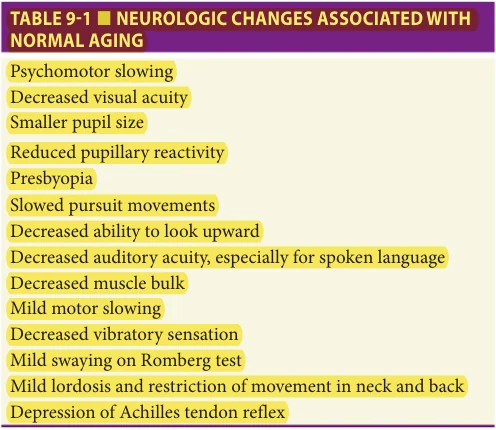

*Table 9-1. Neurologic changes associated with normal aging. Printed p. 134.*

are present in many older adults. It is important to note that these findings are not pathologic in nature and are considered to be part of the normal aging process.

Cognitive changes There continues to be a debate regarding the extent of cognitive changes associated with aging due largely to differences between cross-sectional and longitudinal study designs. When comparing older adults to young adults on similar cognitive tasks such as the Wechsler Adult Intelligence Scale, older adults generally score lower on both performance and verbal subtests. However, when differences in performance are considered in light of motor slowing and educational attainment, these changes are less apparent. Results from cross-sectional studies imply that normal cognitive aging is characterized by nearly linear declines from early adulthood in processing speed. Longitudinal evaluation of older adults has generally demonstrated little change in verbal intelligence with aging while performance is influenced significantly by motor and processing speed. Forgetfulness therefore is not a part of normal aging. While it may take longer to process new information and retrieve well-learned information, new learning and memory formation occurs in older adults. This is one reason why delayed recall of word lists is effective in discriminating older adults with cognitive impairment from those without.

Changes in cranial nerve function Visual and hearing changes are common in older adults. Visual acuity declines due to a number of ophthalmologic (cataracts, glaucoma) and neurologic (macular degeneration) causes. Pupillary size is typically smaller with age and pupils are less reactive to light and accommodation, forcing many older adults to use glasses for reading. There is also a restriction in eye movement in upward gaze. Also associated with aging is a decline in speech discrimination due to presbycusis, a progressive elevation in the frequency threshold for hearing. There are also age-related degenerative changes in inner ear

including loss of hair cells, atrophy of stria vascularis, and thickening of the basilar membrane.

Changes in motor function There is a progressive decline in muscle bulk and strength associated with aging. Most of the muscle loss is found in the intrinsic muscles of the hands and feet, and around the shoulder. There is a weakening of the abdominal muscles which may accentuate spinal lordosis and contribute to low back pain. Muscle loss is associated with denervation on electrophysiologic studies and with type II atrophy on muscle biopsy. In addition to loss of strength and muscle bulk, changes in the speed and coordination of movement increases with advancing age. These changes may interfere with activities of daily living (dressing, putting away the dishes, getting out of a chair) and recreation activities (golfing, shuffleboard). On examination, these changes may manifest as mild bradykinesia and dysmetria on finger-nose-finger and heel-shin tests.

Changes in sensory function By far the most common change will be the loss of vibration perception in the lower extremities and to a lesser extent position sense may be affected as well. As vibration sensation becomes impaired in lower extremities, there is an ascending pattern, from toe to ankle and knee. Pain and temperature sensation is also diminished in the older adult, but in the absence of a pathologic cause, usually does not elicit much symptomatology. The mild impairment in position sense often manifests as a mild swaying during the Romberg test.

Changes in gait and station Changes in gait and station in old age may be attributed in part to decreased muscle strength, weakening of abdominal muscles, arthritis and degenerative joint disease, diminished vibration and position sense, impairment in motor speed, and coordination. These changes make it more difficult for older adults to tandem, heel or toe walk for extended periods of time. Despite this, many older adults have adequate postural righting reflexes and are not likely to spontaneously fall (distinct from what is seen in Parkinson disease). Instead, polypharmacy, drug-drug interactions, and adverse effects from medications are significant risk factors for falls.

Changes in deep tendon reflexes The most common ageassociated change is the depression or loss of the Achilles tendon reflex. Other reflexes usually remain present but are diminished in response. An extensor plantar response (Babinski sign) is not a normal age-related change but instead is always associated with some underlying pathology in the upper motor neuron. In patients in which a Babinski cannot be elicited (eg, patient with lower extremities amputation), an alternative test would be to elicit a Hoffman’s sign. To elicit this sign, the examiner has to flick the fingernail of the middle finger down. A “positive” sign is obtained when there is involuntary flexion and adduction of the thumb and or flexion of the index finger. This can also be seen in upper motor neuron disease (ie, amyotrophic lateral sclerosis).

**[p. 135]**

## THE NEUROLOGIC HISTORY

There is no substitution for a carefully elicited history detailing the onset, duration, quality, and location of symptoms. The history helps the clinician develop a differential diagnosis and focus on the neurologic examination. The history will also guide the formulation of diagnostic evaluations and develop a treatment plan. In addition, a compassionate clinician will be able to build a trusting relationship with the patient that will enhance patient adherence to medical recommendations. As a general comment, to avoid bias, it is often useful to gather historical facts de novo and not read other records or review laboratory studies such as imaging before taking the history and performing the physical examination. Here we discuss two aspects of neurologic history taking—from the patient, and when available from an informant.

The Neurologic History From the Patient An accurate history requires that absolute attention is paid to detail, both verbal (what the patient is saying) and nonverbal (what the patient is doing). This is critical to match the chief complaint with the patient’s body language. For example, someone complaining about severe low back pain that appears to be sitting comfortably in the chair may raise suspicion. Likewise, the older adult who offers no complaints but is noted to have a rest tremor should prompt more detailed questioning. One of the most important attributes of a skilled clinician is the ability to be a good listener and to focus in on critical historical points. The most effective historians gather information by a combination of open-ended and structured questions. After asking the patient why they are in office and offer a chance to express concerns or worries in their own words, specific topics can be addressed by focused questioning.

Another important aspect of the history is to elicit qualitative and quantitative aspects of the chief complaint. It is not enough to elicit a history of a “headache” or “pain.” What are the characteristics of the complaint, when did it start, what makes it better, what makes it worse? Has this happened before, and if so, did it present in the same fashion? Use simple scales to quantify the extent of the complaint by asking, “On a scale of 1 to 10, with 10 being the worst (symptom)....” These qualities can help focus a differential diagnosis and help to build trust with the patient. For example, the onset and characteristics of the headache might guide the clinician in the diagnosis and workup of headaches that may need an emergent intervention. For instance, a “thunderclap” severe headache associated with meningeal signs on examination may be suggestive of a subarachnoid hemorrhage or reversible cerebral vasoconstriction syndrome while a chronic headache with no “red flags” on history or examination might be a primary benign headache that needs no emergent intervention.

The Neurologic History From an Informant In many instances, gathering information from a third party will be invaluable in determining the onset, duration, and extent of the neurologic problem. In cases where there are problems with cognition or alertness, this may be the only reliable way to gather information. Again, using both open-ended and structured questions will often provide the clinician with important information about the chief complaint and assist in the development of a differential diagnosis. If possible, interviewing the informant in an area separate from the patient may provide a true picture of what is transpiring.

## MENTAL STATUS EXAMINATION

The elements of a comprehensive mental status examination include observational, cognitive, functional, and neuropsychiatric assessments. Although each of these elements is presented separately, they are interrelated and collectively characterize the neurobehavioral function of the patient. The initial contact with the patient affords the opportunity to assess whether a cognitive, attention, or language disorder is present. Questioning of an informant may bring to light changes in cognition, function, and behavior that the patient either is not aware of or denies.

Observational Assessment Observation of a patient’s level of arousal or alertness, appearance, emotion, behavior, movements, and speech provides insight into their mental status.

Level of consciousness An accurate assessment of a patient’s mental status and neurologic function must first document the patient’s alertness or level of arousal. Altered levels of consciousness can directly impact the patient’s cognitive performance on mental status testing and influence the examiner’s interpretation of the test results and may be indicative of a medical or neurologic condition requiring immediate medical intervention (eg, cardiopulmonary intervention, neurosurgical evaluation).

Abnormal patterns of arousal include hypoaroused or hyperaroused states. Decreasing levels of arousal include lethargy, obtundation, stupor, and coma. The lethargic patient is drowsy or fatigued and falls asleep if not stimulated, however while being interviewed, the patient will usually be able to attend to questioning. Obtundation refers to a state of moderately reduced alertness with diminished ability to consistently engage the environment. Even in the presence of the examiner, if not stimulated, the obtunded patient will drift off. The stuporous patient requires vigorous stimulation to be aroused. Responses are usually limited to simple “yes/no” responses or may consist of groans and grimaces. Coma, which represents the end of the continuum of hypoarousal states, is a state of unresponsiveness to the external environment. In older adults, hypoarousal states can be associated with systemic infection, cardiac or

**[p. 136]**

pulmonary insufficiencies, meningoencephalitis, increased intracranial pressure, toxic-metabolic insults, traumatic brain injury, seizures, or cerebrovascular disease. Coma requires either bilateral hemispheric dysfunction or brain stem dysfunction. Another important consideration is the role of polypharmacy. Drug interactions are more common in the older adult and can significantly impair consciousness.

Hyperarousal states, on the other hand, are characterized by anxiety, autonomic hyperactivity (tachycardia, tachypnea, and hyperthermia), agitation or aggression, tremor, seizures, or exaggerated startle response. In older adults, hyperarousal states are most often encountered in toxic-metabolic disorders including withdrawal from alcohol, opiates, or sedative-hypnotic agents. Other causes include tumors (both primary and metastatic), viral encephalitis (particularly herpes simplex), cerebrovascular, and hypoxemia. Some patients may experience fluctuating periods of both hypo- and hyperarousal.

Appearance Assessment of a patient’s physical appearance should acknowledge body size and type, apparent age, posture, facial expressions, eye contact, hygiene, dress, and general activity level. A disheveled appearance may indicate dementia, delirium, frontal lobe dysfunction, schizophrenia or severe depression with psychotic features. Wearing excessive makeup or flamboyant grooming or attire in an old individual should raise the suspicion of a manic episode or frontal lobe dysfunction. Patients with unilateral neglect may fail to dress, groom, or bathe one side of their body. Patients with Parkinson disease may display a flexed posture, whereas patients with progressive supranuclear palsy have an extended, rigid posture. The overall appearance of an individual should also provide information regarding their general health status. The cachectic patient may harbor a systemic illness (eg, cancer) or have anorexia or depression.

Emotional state and affect Affect describes the mental representation of external reality and the patient’s internal feelings about external reality, while emotional state describes the objective display of emotion through facial grimaces, vocal tone, and body movements, and the subjective component of how the patient reports what he or she feels internally: “I feel sad, happy, apprehensive, cynical.”

Depression is the most frequent mood disturbance in older adults and occurs in a variety of neurologic disorders (Table 9-2). Euphoria or full-blown mania occurs less often than depression in the course of neurologic illness. Euphoria is most common with frontal lobe dysfunction (trauma, frontotemporal degenerations, and infections) and with secondary mania. Anxiety occurs in a variety of neuropsychiatric conditions including anxiety disorders, metabolic encephalopathies (eg, hyperthyroidism, anoxia), toxic disorders (eg, lidocaine toxicity), and degenerative diseases (eg, Alzheimer disease, Parkinson disease). Objective and subjective emotional components may be incongruent in

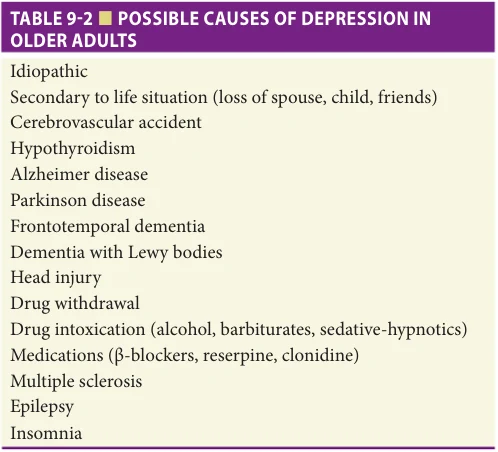

*Table 9-2. Possible causes of depression in older adults. Printed p. 136.*

certain psychiatric disorders (eg, schizophrenia and schizotypal personality disorder) and in neurologic conditions such as pseudobulbar palsy.

The range and intensity of the observable component of emotion should be noted. Constriction or flatness is observed in apathetic states, for example, in the context of negative symptoms of schizophrenia, severe melancholic depression, or in demented patients with apathy. Increased intensity, on the other hand, is seen in mood disorders such as bipolar illness, and in personality disorders such as borderline personality.

Lability is a disorder of emotional regulation. Patients with marked lability are irritable and shift rapidly among anger, depression, and euphoria. The emotional outbursts are usually short-lived. Labile mood is seen in mood disorders such as bipolar illness and in certain personality disorders such as borderline personality. It also may occur in frontotemporal dementia and pseudobulbar palsy.

Behavior Behavioral observations can reveal important information regarding the mental status and neurologic function of the patient. A variety of personality alterations can be encountered with focal brain lesions. Orbitofrontal dysfunction may be characterized by impulsiveness or undue familiarity with the examiner, lack of judgment or lack of social anxiety, and antisocial behavior. Individuals with dorsolateral frontal lobe dysfunction may be inattentive and distractible. Apathy (lack of motivation, energy, emotional reciprocity, social isolation) may be caused by medial frontal dysfunction. Dementias are associated with increased rigidity of thoughts, egocentricity, diminished emotional responsiveness, and impaired emotional control.

Movement Observation of patient’s movements may provide evidence of parkinsonism, chorea, myoclonus, or tics (Table 9-3). Psychomotor retardation (ie, slowed central

**[p. 137]**

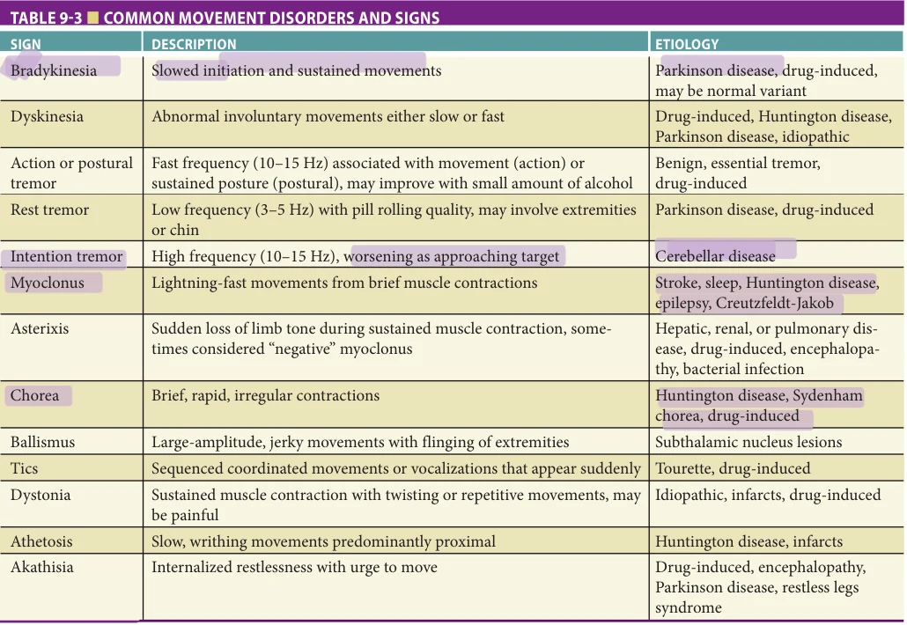

*Table 9-3. Common movement disorders and signs. Printed p. 137.*

processing and movement) may be indicative of vascular dementia, subcortical neurologic disorders, parkinsonism, medial frontal syndromes, or depression. Psychomotor agitation may be indicative of a metabolic disorder, choreoathetosis, seizure disorder, mania, or anxiety.

Speech and communication Observation of spontaneous speech is the first step in formal language testing and can be assessed during history taking as well as in the course of the mental status examination. The examiner first observes spontaneity of speech as well as the timber, pitch, and modulation of voice. Mutism may be encountered in several neurologic conditions such as akinetic mutism, vegetative state, locked-in syndrome, catatonic unresponsiveness, or large left hemispheric lesions. Akinetic mutism is characterized by absent speech in the setting of alert-appearing immobility. The patient’s eyes are open, and the individual may follow environmental events. The patient exhibits regular sleep-wake cycles but may be completely inert or display brief movements or postural adjustments spontaneously or in response to vigorous stimulation. Akinetic mutism may be seen with large frontal lobe injuries, bilateral cingulate gyrus damage, or midbrain pathology. Akinetic mutism should be distinguished from a vegetative state where the patient exhibits sleep-wake cycles with open eyes. A vegetative state can occur after severe brain injury. Locked-in syndrome occurs with bilateral pontine lesions, rendering

the patient mute and paralyzed. Intellectual function, however, is not impaired and the patients can communicate by eye movements or eye blinks.

Spontaneous speech is characterized by its rate, rhythm, volume, response latency, and inflection. Accelerated speech may be encountered in mania, disinhibited orbitofrontal syndromes or festinating parkinsonian conditions, whereas a reduced rate of speech output can occur as a component of psychomotor retardation. Response latencies may be prolonged or the patient may impulsively interrupt the examiner, anticipating the question. Perturbed speech prosody (loss of melody or inflection) can be encountered in brain disorders affecting the right hemisphere or the basal ganglia. Empty speech with hesitations or circumlocutions can be exhibited in patients with word-finding difficulties. Word-finding impairment may occur in aphasias, metabolic encephalopathies, physical exhaustion, sleep deprivation, anxiety, depression, or dorsolateral frontal lobe damage in the absence of an anomia.

Aphasia is characterized by impairment in oral and/ or written communication. Deficits will vary depending on the location and extent of anatomic involvement. Aphasias are generally characterized as nonfluent or fluent (Table 9-4). Nonfluent aphasias are characterized by a paucity of speech, often with a hesitant quality. There is impairment in word searching and writing. The patient

**[p. 138]**

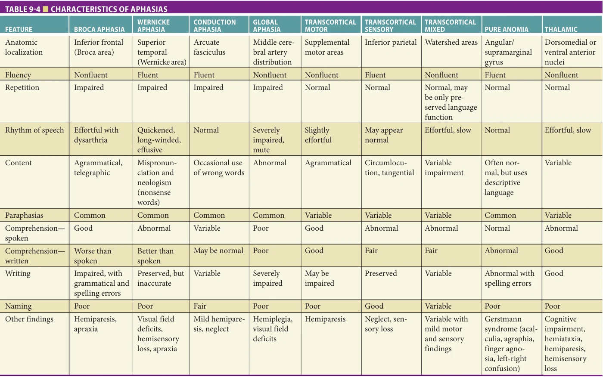

*Table 9-4. Characteristics of aphasias. Printed p. 138.*

**[p. 139]**

may appear frustrated or depressed because of awareness of the language deficit and the inability to communicate with family and health care providers. Fluent aphasias are characterized by empty speech. Word production is normal or may be increased but there is a lack of comprehension about what words mean, often associated with impairment in reading ability. The patient often displays little insight to the language deficit and instead may become agitated because others are not following the conversation.

Cognitive Assessment The assessment of cognitive function should be conducted methodically and should assess comprehensively the major domains of neuropsychological function (attention, memory, language, visuospatial skills, executive ability). The patient’s age, handedness, educational level, and sociocultural background may all influence cognitive function and should be determined prior to initiating or interpreting the evaluation.

Attention Two tests are useful in assessing attention: digit span forward and continuous performance tests. In the digit span forward test, the patient is asked to repeat increasingly long series of numbers (eg, 1, 3-7, 4-6-3, 5-19-2, etc). The examiner says the numbers at a rate of one per second. A normal forward digit span is seven digits; fewer than five is abnormal. Concentration is evaluated by a continuous performance test. An example would be to say the months of the year in reverse order, starting with the last month of the year (December). Distractible patients tend to lose track and skip 1 or 2 months. Serial subtraction can also be used to test concentration but heavily dependent on educational attainment and mathematical abilities. Confusional states such as delirium are characterized by impaired attention.

Memory Learning, recall, recognition, and memory for remote information are assessed in the course of mental status examination. Asking the patient to remember three words and then asking him or her to recall the words 3 minutes later can help assess learning, recall, and recognition. However, the shorter the list, the easier it is to remember, particularly in high-functioning individuals. When told to remember items, patients will often remember the first two items heard (known as “primacy”) and the last two items heard (known as “recency”); therefore, longer lists of 10 words may be preferable. After a delay, recall of fewer than five words is considered abnormal. Patients having difficulty with recall may be given clues (eg, the category of items to which the word belongs or a list of words containing the target) to distinguish between storage and retrieval deficits. Prompting and clues will not aide patients with storage deficits (eg, amnesia); patients with intact storage but poor recall (eg, retrieval-deficit syndrome) may be aided by clues. Amnestic deficits are thought to be caused by lesions in the hippocampal-thalamic circuit while retrieval deficits are likely due to lesions of frontal-basal ganglia circuitry.

Information is gathered on the patient’s remote memory function while taking a history of the patient’s illness, inquiring about the patient’s life events (marriage, births of children, etc), and asking about important historical events. An informant may also be helpful here to verify these events. The temporal profile of remote memory may be diagnostically important. Amnestic syndromes such as dementias usually feature normal, nonmemory cognitive functions, a period of retrograde amnesia following the onset of the disorder, variable periods of anterograde amnesia, and intact remote memory beyond the period of the retrograde amnesia. Psychogenic memory loss may include variable patterns of amnesia particularly in longterm events (eg, not recall birth of children, not recall being married).

Language Language assessment entails the evaluation of all aspects of communication including spontaneous speech, comprehension, repetition, naming, reading, and writing. Aphasic disturbances are characterized as fluent or nonfluent. Fluent aphasias are characterized by normal or excessive amounts of speech, preserved phrase length, intact speech melody, usually in combination with a paucity of information. Phonemic paraphasias (substitution of one phoneme for another); semantic paraphasias (the replacement of one word with another); or neologistic paraphasias (the construction of new words) may occur. Wernicke, transcortical sensory, conduction, and anomic aphasias are fluent aphasic syndromes.

Nonfluent aphasias feature reduced verbal output, short or one-word replies, agrammatism, poor speech initiation, reduced speech prosody, and dysarthria. There are few paraphasias. Broca, transcortical motor, global, and mixed transcortical aphasias are nonfluent aphasic disorders. Interestingly, nonfluent aphasic patients may have preserved abilities to curse fluently and sing well-learned songs (eg, “Happy Birthday”) with few errors.

Primary progressive aphasia is a disorder seen in patients with asymmetric frontotemporal degeneration that involves dominant hemisphere. Progressive nonfluent aphasia involves primarily unilateral left frontal, left frontoparietal, or left frontotemporal degeneration and is characterized by agrammatism, paraphasias, and anomia. Bilateral temporal lobe atrophy and hypoperfusion with more pronounced involvement of the left anterior temporal lobe may cause semantic dementia that is characterized by progressive loss of knowledge about objects, people, facts, and words; it is often accompanied by visual agnosia (inability to name or recognize objects presented visually).

Language comprehension is tested by asking the patient to follow increasingly complex linguistic constructions. The easiest commands are one-step orders such as “stand up” and “turn around,” “open your mouth,” and “stick out your tongue.” Asking the patient to point to room objects or body parts is the next level of comprehension difficulty. Finally, more complex questions, such as “If a lion is

**[p. 140]**

killed by a tiger, which animal is dead?” are asked. Impaired comprehension usually implies dysfunction of parietotemporal regions of the left hemisphere. Comprehension is abnormal in most fluent and global aphasic syndrome but may be preserved in nonfluent syndromes. In older adults, it is important to establish that hearing is intact before testing comprehension. Failure to comprehend commands may reflect the inability to hear as opposed to impaired comprehension.

Repetition is assessed by asking the patient to repeat increasingly long phrases or sentences. Generally, it is best to begin with simple phrases such as salutations (“Hello”) and progress to more complex phrases (“Around the rugged rock, the ragged rascal ran”). Omissions and paraphasic substitutions may disrupt accurate repetition. Repetition is impaired in Wernicke, Broca, conductive, and global aphasia but is generally preserved in transcortical aphasias.

Naming tests involve asking the patient to name objects, parts of objects, and colors. Errors include paraphasias, circumlocutory responses, and simply making no response. Aphasic patients may use descriptive terms rather than giving the proper name. For example, a “watch” becomes “the thing you tell time with.” Anomia occurs in aphasia, dementia, delirium, and can sometimes be seen as a consequence of head trauma. Adequate vision and object recognition must be ensured before errors are ascribed to naming deficits.

When assessing reading, the patient’s ability to read aloud and to comprehend what is read must both be tested. Adequate vision must be ensured before failures are ascribed to an alexia. Most aphasias have concomitant alexias, however the converse may not be true. In alexia with agraphia and alexia without agraphia, reading abnormalities may occur in the absence of other signs of aphasia.

Mechanical or aphasic abnormalities may cause agraphia. Micrographia is a characteristic aspect of parkinsonism in which the script becomes progressively smaller as the patient writes a sentence or extended series of numbers or letters, and mechanical agraphias occur in patients with limb paresis, limb apraxia, or movement disorders such as tremor and chorea. Aphasic agraphias accompany aphasic syndromes and errors similar to those noted in verbal output are present in written form. In Gerstmann syndrome (agraphia, acalculia, right-left disorientation, finger agnosia), alexia with agraphia, and disconnection agraphia (occurring with injury of the corpus callosum), agraphia occurs without aphasia. Agraphia also occurs in dementia and delirium.

Orientation Orientation to time is tested by asking the patient to identify the correct day of the week, date, month, and year. Although some patients may make excuses (eg, they are retired, they don’t need to know, etc.), only correct answers should be counted. This should be followed by asking the patient to guess the correct time of day without looking at a watch or clock. The patient should be within 1 hour of the correct time. Orientation to place is assessed

by asking about city, county, state, and current location. If the patient is from out of town, major landmarks may be substituted for less well-known information such as county. Lastly, orientation to situation can be assessed by asking the patient why they are in the office today.

Abstraction Similarities, differences, idioms, and proverb interpretation can all be used to assess abstracting capacity. These tests are heavily influenced by culture and educational attainment. Abstraction abnormalities are a nonspecific indicator of cerebral dysfunction. Patients with frontal lobe disorders have disproportionately severe abstracting disturbances.

Judgment and problem-solving abilities Assessing judgment assists in exploring the patient’s interpersonal and social insight. Judgment is impaired in many neurologic conditions. Damage to orbitofrontal subcortical circuit (eg, in frontotemporal dementia, trauma, or focal syndromes) produces marked alterations in social judgment. Problemsolving can be assessed by giving a scenario “If in a strange town, how would a person locate a friend they wished to see?” Correct answers might include use of phone book, the Internet, or city directory.

Visuospatial skills There are a number of visuospatial abilities including spatial attention, perception, construction, visuospatial problem-solving, and visuospatial memory. Constructional tasks are most widely used to assess visuospatial ability. In the clock-drawing test, the patient is asked to draw a clock and draw the hands of the clock to indicate a specific time. The hands should be of different lengths. Watching the patient complete the clock is sometimes as informative as the finished product.

Patients with executive dysfunction may draw a clock face that is too small to contain the required numbers (poor planning), whereas patients with unilateral neglect will ignore half of the clock face.

Tests of copying involve having the patient reproduce figures such as a circle, intersecting circle and triangle, overlapping pentagons, cube, or more complex figures. Abnormalities include failures to reproduce the shapes accurately, perseveration on individual elements, drawing over the stimulus figure, or unilateral neglect. Drawing disturbances are common with many types of neurologic conditions including focal brain damage, degenerative disorders, and toxic and metabolic encephalopathies.

Calculation In assessing calculation skills, patients are asked to add or multiply one or two digits mentally or to execute more demanding problems with pencil and paper. Calculation abilities are related to education and occupation. Acalculias may occur in association with a number of aphasic syndromes while visuospatial disorders lead to incorrect alignment of columns of numbers. Primary anarithmetias (inability to do math) are produced by damage to the posterior left hemisphere.

Executive function Executive function is assessed by asking the patient to perform tasks mediated by frontal-subcortical

**[p. 141]**

systems. Frontal-subcortical systems are complex neural circuits that include the dorsolateral prefrontal cortex, striatum, globus pallidus/substantia nigra, thalamic nuclei, and connecting white matter tracts. Patients with executive dysfunction manifest perseveration; motor programming abnormalities; reduced word list generation (left dorsolateral dysfunction); reduced nonverbal fluency (right dorsolateral dysfunction); poor set shifting; abnormal recall with intact recognition memory; loss of abstraction abilities; poor judgment; and impaired mental control. These abnormalities are common following head trauma, frontal lobe degenerations, frontal lobe neoplasms, multiple sclerosis, Huntington disease, and other basal ganglia disorders, subcortical infarctions, and in some brain infections such as syphilis.

Digit span backward is a test of mental control and complex attention, as well as executive dysfunction. It entails saying increasingly long series of numbers and asking the patient to say them backward (give 2-5-8, response should be 8-5-2). A normal digit span in reverse is five digits; fewer than three is abnormal.

Word list generation Word list generation is a very useful test and involves asking the patient to think of as many members of a specific category (most commonly animals) as possible within 1 minute. Normal individuals can name approximately 18 animals within 1 minute; fewer than 14 is considered abnormal. Word list generation deficits occur with anomia, frontal-subcortical systems dysfunction, and psychomotor retardation. It is a highly sensitive test but lacks specificity.

Informant assessment In many instances, asking questions of the informant will provide a wealth of information regarding the baseline abilities of the patient. There are several structured interviews that are short, easy to administer, and do not require specific training. Functional abilities and activities of daily living can be assessed with the Functional Activities Questionnaire, the Physical Self-Maintenance Scale, Instrumental Activities of Daily Living Scale, or the Barthel index. Baseline cognitive abilities can be assessed with brief informant interviews such as the Quick Dementia Rating System (QDRS), AD8, or the IQCODE. The AD8 was developed in a research sample and validated in a clinic population and asks eight questions regarding change in the patients’ memory, orientation, judgment and problem-solving abilities, executive function, and interest level. Endorsement of two or more items suggests cognitive dysfunction and should trigger a more formal evaluation.

Neuropsychiatric Assessment The neuropsychiatric interview of the patient includes the evaluation of thought form, thought content, and insight. The new onset of disturbances in any of these domains in older patients is unusual in the absence of a brain disease. Their emergence should trigger the search for a neurologic or psychiatric condition.

Thought form Formal thought disorders such as tangentiality, circumstantiality, loose associations, illogicality, derailment, and thought blocking are much less common than disturbances of thought content as a manifestation of psychosis in neurologic diseases. Thought disorders have been observed in the psychoses accompanying epilepsy, Huntington disease, and idiopathic basal ganglia calcification.

Perseveration and incoherence are disorders of the form of thought that are common in neuropsychiatric conditions. Perseveration refers to the inappropriate continuation of an act or thought after conclusion of its proper context. Intrusions are a special case of perseveration with late recurrences of words or thoughts from an earlier context. Perseverations and intrusions are seen in aphasias and dementing illnesses. Incoherence refers to the absence of logical association between words or ideas. It is observed in delirium, advanced dementias, and as part of the output of fluent aphasia.

Thought content Several types of disorders of thought content occur in neurologic diseases. Delusions are the most common manifestation of psychosis in neurologic disorders and are characterized by false beliefs based on incorrect inference about external reality. Common types of delusions encountered involve being followed or spied on, theft of personal property, spousal infidelity, or the presence of unwelcome strangers in one’s home. Theme-specific delusions such as the Capgras syndrome (the belief that someone has been replaced by an identical-appearing impostor) may also be observed in neurologic illnesses. Delusions are common in a number of dementia etiologies including Alzheimer disease and dementia with Lewy bodies, and may occur in vascular dementia, frontotemporal dementia, and Huntington disease.

Hallucinations occur in many neurologic disorders. Hallucinations are sensory perceptions that occur without stimulation of the relevant sensory organ. Hallucinations and delusions occur together in psychosis; hallucinations are nondelusional when the patient recognizes the sensory experience to be unreal. Hallucinations may involve any sensory modality (visual, auditory, tactile, gustatory, olfactory) and may be formed (eg, people or things) or unformed (flashing lights or colors). Hallucinations occur with ocular and structural brain disorders as well as Charles Bonnet syndrome, epilepsy, narcolepsy, and migraine. Well-formed visual hallucinations (children, furry animals) are a prominent early sign in dementia with Lewy bodies. Less well-formed visual hallucinations occur in the moderate to severe stages of Alzheimer disease. Gustatory or olfactory hallucinations are most common in seizure disorders, bipolar disorder, and schizophrenia, and with tumors located in the medial temporal lobe. Tactile hallucinations are most commonly associated with schizophrenia, affective disorders, or drug intoxication or withdrawal.

Insight Patients with neuropsychiatric disease may display limited insight and be unaware of their medical conditions or limitations in function; thus assessment of a patient’s

**[p. 142]**

insight into the severity of their illness can yield useful diagnostic information and assist in developing a therapeutic plan. For example, Alzheimer disease patients have impaired insight into their memory and cognitive difficulties, whereas patients with vascular dementia and dementia with Lewy bodies often exhibit more appropriate concern regarding their cognitive dysfunction. Lesions of the right parietal lobe are associated with unawareness, neglect, or denial of the abnormalities of the contralateral side.

Behavior and personality A variety of changes in personality and behavior have been described in neuropsychiatric disease in the older adult. Personality changes may include increased egocentricity and thought rigidity, impaired emotional control and diminished emotional responsiveness, loss of interest and apathy, and lack of concern for the feelings of others. No brief personality rating scales are available but in the proper setting the Neuroticism-Extroversion-Openness Five-Factor Inventory (NEO-FFI) can be used to evaluate personality. Behavioral changes including irritability, depression, anxiety, hallucinations, delusions, and vegetative changes can be assessed with the Neuropsychiatric Inventory (NPI). Both long and short forms of the NPI are available.

## NEUROLOGIC EXAMINATION

The neurologic examination includes assessment of cranial nerve function, strength, coordination, sensation, muscle stretch reflexes, pathologic/primitive reflexes, and neurovascular status. Examination of head and neck may provide additional important information.

## Cranial Nerve Examination

Cranial nerve I: olfactory In normal aging, loss of olfaction may be a nonspecific or clinically insignificant finding. Olfaction may be impaired following head trauma, infection, zinc deficiency, vitamin A deficiency, frontal lobe dysfunction, vitamin B12 deficiency, and frontal lobe tumors (olfactory groove meningioma). Olfaction is tested by asking the patient to identify a variety of odors. When testing, it is important to use simple and familiar odors (coffee beans, vanilla, or cinnamon). Complex scents such as perfumes and noxious agents (ie, ammonia) should not be used. Ideally, the patient should close their eyes and each nostril should be tested separately.

Cranial nerve II: optic Examination of the optic nerve includes visual inspection of the nerve head, testing of visual acuity, and mapping of the visual fields. In aging, visual acuity may be impaired and can be due to a number of neurologic and ophthalmologic causes. First, casual inspection of the corneal, sclera, and mucosal tissue should be carried out to evaluate structural abnormalities. Visual acuity can be evaluated with a Snellen visual chart or Rosenberg card held 14 in from the eye. Screening should be done in a welllit environment and to the patient’s advantage allowing them to use their corrective lenses. If they do not have their glasses with them, refractive errors can be partly corrected

by using a pinhole. Visual fields are tested at the bedside by confrontation. The examiner should face the patient, sitting or standing at a similar height and each eye should be tested independently. The patient is asked to look at the examiner’s nose and the examiner’s arms are extended laterally. The patient is asked to differentiate between one or two fingers. Each quadrant should be tested separately. After testing each eye individually, both eyes should be tested simultaneously for visual neglect. Monocular visual field deficits can be associated with glaucoma. Abrupt changes in visual fields or acuity should alert the clinician to potential vascular etiologies. Homonymous field deficits reflect disruption of the optic pathway posterior to the optic chiasm.

Pupillary examination should include evaluation of size and shape. Up to a 1-mm difference in size is generally considered normal. Pupillary responses are tested with a bright flashlight (not the ophthalmoscope). A normal pupil reacts to light by constricting; the contralateral pupil should also constrict. The pupils also constrict when shifting focus from a distant object to a near object (accommodation) and during convergence such as when patients are asked to look at their nose. Abnormalities of pupillary responses are associated with a number of neurologic disorders (Table 9-5). A review of medications is also important as a number of drugs can affect pupillary size. Mydriasis (pupillary dilation) can be caused by atropine-like drugs, while miosis (pupillary constriction) can be caused by parasympathomimetic drugs.

A careful examination of the optic nerve should be performed in all patients. It is not always necessary to do a dilated examination, but the room should be darkened to increase pupillary size. The sharpness of optic disc margins, the ratio of optic cup to disc, venous pulsations, the caliber of blood vessels, and the presence of exudates, hemorrhages, emboli, and retinal pallor should be noted. Papilledema is characterized by blurring or elevation of the disc margins with the loss of normal venous pulsations and reflects raised intracranial pressure. As pressure increases, hemorrhages may be found adjacent to the disc. Glaucoma increases the size of the optic cup relative to the disc.

Cranial nerves III, IV, and VI: oculomotor, trochlear, and abducens The oculomotor, trochlear, and abducens nerves mediate ocular motility, pupillary responses, and eyelid position. The trochlear nerve innervates the superior oblique muscle, the abducens nerve innervates the lateral rectus muscle, while the oculomotor nerve innervates the remainder of the extraocular muscles. The oculomotor nerve also innervates the levator muscles of the eyelid and carries parasympathetic nerves to the pupil. Testing each eye individually helps to identify ocular motility dysfunction. In aging, ocular motility may be reduced. Normal older adults can exhibit restricted convergence and limitation of conjugate upward gaze. Other nonspecific concomitants of normal aging include the evolution of small sluggishly reactive pupils, loss of Bell phenomenon (upward eye deviation on eye closure), and the inability to dissociate ocular movements from head movements.

**[p. 143]**

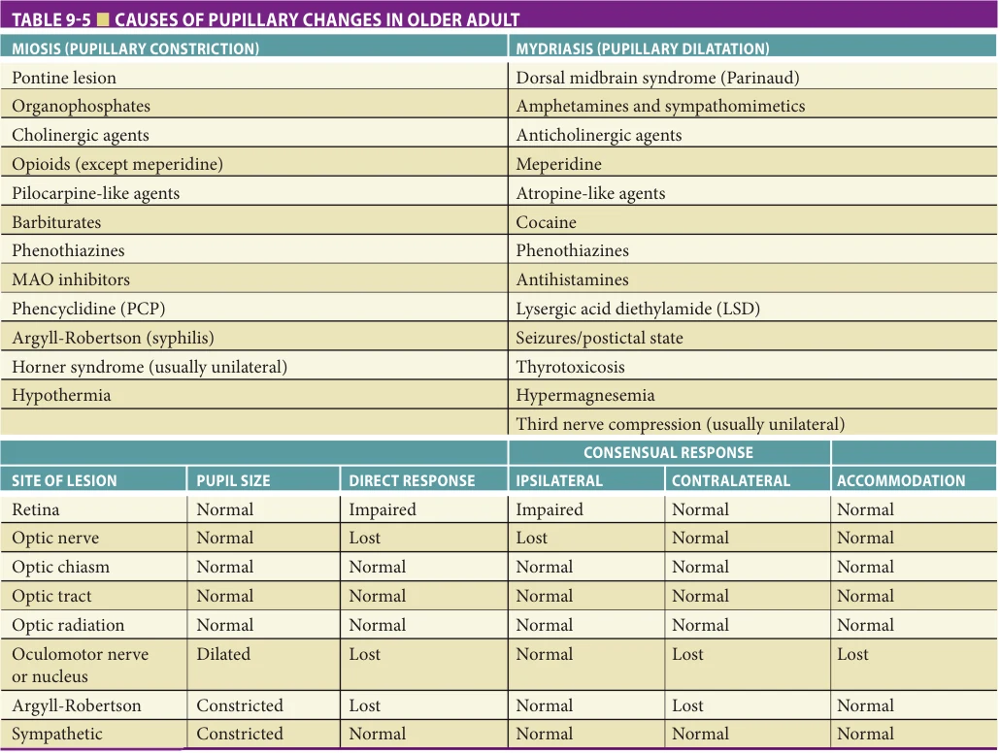

*Table 9-5. Causes of pupillary changes in older adult. Printed p. 143.*

The clinician should be concerned when an older patient exhibits new-onset diplopia, pupillary asymmetry, nystagmus (Table 9-6), or extraocular movement disorders. Ptosis (drooping of the upper lid) can be caused by a number of disorders (Table 9-7). Isolated abducens palsies may be a sign of elevated intracranial pressure since the sixth nerve has the longest intracranial course.

Cranial nerve V: trigeminal The trigeminal nerve is divided into three divisions: ophthalmic, maxillary, and mandibular. The first two divisions are pure sensory nerves mediating facial and corneal sensation. The third division carries both sensory fibers and innervates the muscles of mastication. The corneal reflex is mediated by the ophthalmic division and can be tested by lightly stimulating the cornea with a wisp of cotton. When the cornea on one side is stimulated, both eyes should close. Facial sensation is tested with a safety pin or cold handle of a tuning fork. Motor function is tested by asking the patient to bite down or open the jaw against resistance. Tumors of the middle fossa and in the cerebellopontine angle may compress the fifth cranial nerve and produce a cranial nerve syndrome with decreased corneal reflex and sensory loss on the ipsilateral face. Tic douloureux (trigeminal neuralgia) is a paroxysmal pain disorder triggered by

touching sensitive zones usually within the mandibular division. The cause may be idiopathic, due to compressive lesions or demyelination at the root entry zone.

Cranial nerve VII: facial The facial nerve supplies the facial musculature, lacrimal and salivary glands, and taste fibers of the anterior tongue. The motor function is tested by asking the patient to wrinkle their forehead, close their eyes, and smile. Unilateral weakness may cause a flattening of the nasolabial fold. If very weak, the patient may experience drooling. The eyelid is usually not severely affected with central lesions and the upper forehead is spared. In peripheral lesions such as Bell palsy (Table 9-8), patients are unable to close their eye or wrinkle their forehead. The facial nerve also innervates the stapedius muscle of the middle ear which helps to modulate tympanic membrane vibration. This motor branch can be damaged during closed head trauma leading to hyperacusis, an increased perception of sound. The sense of taste is not often tested, but can be done at the bedside using sugar, salt, or lemon juice. The patient is asked to stick their tongue out and a small amount of solution is placed on one side of the tongue. The patient is asked to describe the taste, and then allowed to drink some water before the next solution is applied.

**[p. 144]**

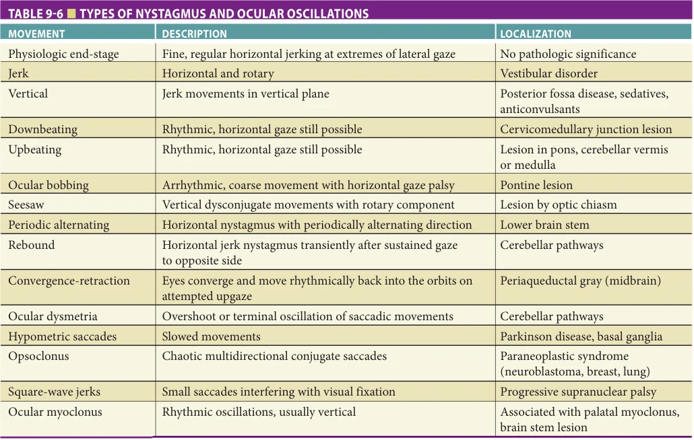

*Table 9-6. Types of nystagmus and ocular oscillations. Printed p. 144.*

Cranial nerve VIII: cochlear and vestibular Hearing and vestibular function are mediated by the eighth cranial nerve. Evaluation of hearing at the bedside is sometimes difficult. Use of a 512-Hz tuning fork can help discriminate conduction from sensorineural hearing loss. The Rinne test is done by placing a vibrating tuning fork on the mastoid process. As soon as the patient is unable to detect sound, the tuning fork is moved to a position near the external auditory canal. If the patient has normal hearing, air conduction should be better than bone conduction. If the patient has conduction

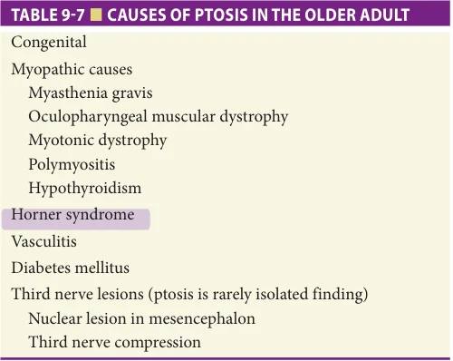

*Table 9-7. Causes of ptosis in the older adult. Printed p. 144.*

deafness, the sound will not be heard because of pathology in the middle ear. In nerve deafness, air conduction is better than bone conduction, but both will be reduced. The Weber test looks for lateralization. The tuning fork is placed in the middle of the skull and the patient is asked to decide where they best hear the sound. In normal hearing, the sound is heard equally in both ears. In conduction deafness, vibrations are best heard in the abnormal ear. In nerve deafness, the sound is best appreciated in the normal ear. Decreased hearing for high-pitched sounds and lack of perception of background noise are common findings in normal aging and by themselves should not be considered a pathologic finding. Sensorineural deafness

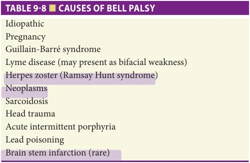

*Table 9-8. Causes of Bell palsy. Printed p. 144.*

**[p. 145]**

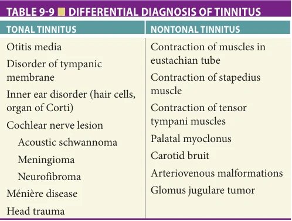

*Table 9-9. Differential diagnosis of tinnitus. Printed p. 145.*

is characterized by loss of high-pitched sounds while conduction deafness is characterized by loss of low-pitched sounds. Tinnitus or ringing in the ears is a common symptom in adults. Tonal tinnitus is subjective and heard only by the patient. Nontonal tinnitus is more objective because in certain circumstances, the tinnitus can be heard by the examiner. The differential diagnosis of tinnitus is presented in Table 9-9.

Vestibular lesions produce nystagmus and vertigo. Vestibular nystagmus is horizontal or combined

horizontal-rotatory and is typically accompanied by vertigo and nausea, whereas lesions disrupting vestibular connections in the central nervous system can produce nystagmus in any direction but are usually not associated with vertiginous or nauseous sensations. When characterizing nystagmus, only the fast component should be described. The complaint of dizziness in older adults is not uncommon; however, the examiner must determine whether the dizzy patient is experiencing light-headedness or true vertigo. If true vertigo is present, then the clinician should further discern whether it is peripheral (vestibular) or central (brain stem) in origin as well as associated features (Table 9-10). Causes of vertigo associated with vestibular disease include benign positional vertigo, Meniere syndrome, and trauma.

Cranial nerves IX and X: glossopharyngeal and vagus The ninth and tenth cranial nerves control pharyngeal and laryngeal function, taste, and the gag reflex. Glossopharyngeal lesions cause asymmetric elevation of the palate and deviation of the uvula. Hoarseness, aphonia, and dysphagia occur with vagus nerve lesions. In normal aging, the gag reflex can be reduced and, when accompanied by a decrease in the cough reflex, can result in difficulty handling bronchial secretions. Glossopharyngeal neuralgia is a rare paroxysmal pain syndrome involving the posterior pharynx or tonsils usually triggered by excessively hot or cold foods or liquids.

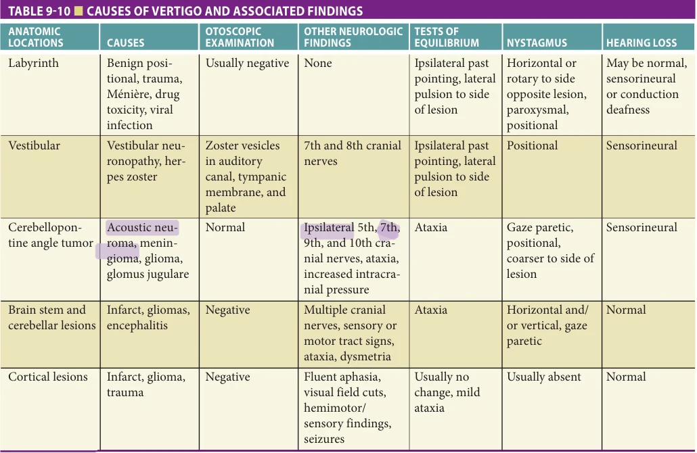

*Table 9-10. Causes of vertigo and associated findings. Printed p. 145.*

**[p. 146]**

Cranial nerve XI: accessory nerve The spinal accessory nerve innervates the upper half of the trapezius and the sternocleidomastoid muscle. In normal older adults, frank weakness of the trapezius or sternocleidomastoid muscle is not a typical finding and, if present, should be investigated further. A delayed shrug may be an indication of a mild ipsilateral hemiparesis.

Cranial nerve XII: hypoglossal The hypoglossal nerve innervates the tongue. Patients are asked to stick their tongue out; deviation to either side implies a lesion on the side of deviation. The tongue should also be examined for atrophy and spontaneous muscle contractions (fasciculation) suggesting upper motor neuron disease. Fasciculation is best detected on the lateral aspects of the tongue. Tongue weakness is also common in pseudobulbar palsy.

Motor System Examination Muscle bulk, strength, tone, and coordination are assessed as part of the motor system examination.

Muscle bulk Muscle bulk is examined by visual inspection and palpation. Muscle wasting may occur with disuse; muscle, nerve, or spinal disease; and in generalized weight loss secondary to malnutrition, systemic illness, or advanced brain diseases. Mild muscular wasting without associated weakness can be encountered in normal aging most commonly involving the intrinsic hand and foot muscles, calf, and shoulder girdle muscles.

Muscle tone Muscle tone may be increased or decreased in neurologic disorders. Muscle tone is decreased in muscle and peripheral nerve disease, with cerebellar disorders, early in the course of many choreiform disorders, and acutely following an upper motor neuron lesion. Increased muscle tone is encountered in spasticity with pyramidal tract lesions and rigidity with extrapyramidal disorders. Cogwheel rigidity of Parkinson disease is best palpated when manipulating the distal limbs, usually in a circular motion. “Gegenhalten” refers to the active resistance to movement encountered in advanced brain diseases. In order to optimize the diagnostic yield of the muscular tone examination, the clinician should distract the patient while the examination is performed. For example, the clinician could ask the patient to perform circulatory movements with the right hand as if he “is washing a window” while he is examining the muscular tone on the left arm. By this means, a more accurate representation of the tone is obtained. This is particularly useful in patients with Parkinson disease, when the examiner is testing for cogwheel rigidity. Since rigidity is recognized as one of the cardinal motor symptoms in Parkinson disease, performing an optimal muscular tone examination increases the diagnostic yield of this disease.

Strength Strength is graded as 0 (no evidence of muscle contraction), 1 (muscle contraction without movement of the limb), 2 (limb movement after gravity eliminated), 3 (limb movement against gravity), 4 (limb movement against partial resistance), or 5 (normal strength). Distal

weakness is most indicative of peripheral neuropathies, whereas proximal weakness is more consistent with primary muscle disease. In aging, mild generalized weakness may occur; however, focal weakness is indicative of a neuropathologic process. Focal weakness often is subtle and may be detected only with careful examination. Hemiparesis occurs with lesions of the pyramidal system. When testing strength, the examiner should attempt to isolate individual muscles (thumb abduction) rather than testing whole groups (hand grip) to detect subtle signs of weakness. A pronator drift is seen with mild forms of weakness. When testing for muscular strength, the examiner should be familiarized with functional motor weakness. Known as the “Hoover test”, this sign is the most useful to examine for functional weakness. When performing this test, the clinician should ask the patient to raise the affected leg without resistance. If a discrepancy is observed between voluntary hip extension (which is weak) and involuntary hip extension when the opposite hip is being flexed against resistance (which is normal), this finding would point toward a diagnosis of functional weakness.

Abnormal movements During the interview and examination, the clinician should be observant for any movement that is not purposeful including tremor, chorea, dyskinesias, and ballismus. Tremor is usually described as action (associated with a movement) or rest (disappears with movement of affected extremities). “Essential” tremor is a usually benign hereditary condition associated with movement or sustained posture and may involve arms, legs, head, chin, or voice. Essential tremors often improve after drinking small amounts of alcohol.

Sensory Examination Primary modalities, including light touch and temperature are tested to assess sensory function. Sensory examination is quite subjective, and it is important to consider the consistency of responses and how sensory complaints relate to other signs and symptoms. Peripheral causes of sensory loss typically present bilaterally and are largely symmetric. Unilateral sensory loss occurs with lesions of primary sensory cortex or its projections.

Light touch Evaluation of light touch is not particularly helpful in discriminating pathology but is useful in defining the presence or loss of sensation. Lightly stroking the fingers or a wisp of cotton across the skin may help elicit dermatomal patterns of sensory loss for further evaluation.

Pain and temperature Pain and temperature sensation is carried by small unmyelinated fibers. Pain can be assessed with the use of a disposable safety pin while temperature can be assessed with the handle of the reflex hammer or tuning fork. The loss of pain sensation due to a metabolic or toxic peripheral neuropathy typically follows a stocking glove pattern, while lesions due to a radiculopathy follow a defined dermatome.

**[p. 147]**

Vibration Vibration is carried by large, myelinated fibers and is assessed with a 128-Hz tuning fork. The tuning fork should be struck and placed on a bony prominence. Causes of pathologic decreased vibratory sensation include peripheral neuropathies, diabetes, tabes dorsalis, vitamin B12 deficiency, and myelopathies.

Position Proprioception is assessed by having the patient close their eyes and the examiner gently moves toes or fingers in the vertical plane. Skin proprioception can be assessed by lightly stroking the skin in an up or down fashion. The Romberg sign is performed to assess the integrity of the dorsal columns. The patient is asked to stand with their feet together and eyes closed. The presence of a sway suggests a positive test. If the problem is due to a proprioceptive deficit, the patient is able to correct themselves with their eyes open. Position sense loss can be caused by peripheral neuropathies, diabetes, tabes dorsalis, vitamin B12 deficiency, and myelopathies.

Cerebellar Examination Cerebellar function and coordination may be disrupted by many types of motor and sensory abnormalities. Tests of coordination include rapid alternating movements, fine finger movements, finger-to-nose movements, and heelknee-shin maneuvers. During aging, there is an overall decrease in speed of coordinated movements that is of no pathologic consequence. However, gross abnormalities in cerebellar function are not anticipated and should be evaluated thoroughly (Table 9-11).

When unilateral cerebellar dysfunction is present, patient will overshoot target but may improve after a few trials. Dysdiadochokinesis occurs when the patient is asked to rapidly change hand or finger movements; difficulties in maintaining smooth movements are characteristic. Cerebellar lesions can also affect muscle tone causing hypotonia. Cerebellar tremors tend to be coarse and irregular, worsening in the terminal one-third of a movement.

Gait and Station Gate and posture depend on motor, sensory, and cerebellar function. In normal aging, posture becomes more flexed,

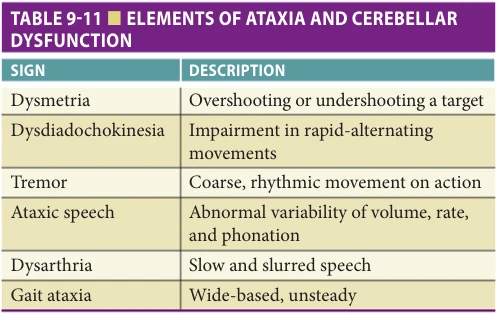

*Table 9-11. Elements of ataxia and cerebellar dysfunction. Printed p. 147.*

slowed, and may have a slightly unsteady quality. When assessing gait in the older adult, it is important to recognize gait abnormalities that may be secondary to joint pain and arthritic conditions. Gait is assessed by having the patient walk straight for at least 10 yd, making a turn, and maneuvering in a tight corridor. It is important to note the presence of arm swing and the distance of the stride. The patient should also be asked to tandem walk, walk on their toes and heels and if possible, walk up a few steps. Postural stability is assessed by asking the patient to stand with their shoulder-width apart. A forceful pull is given to their shoulders and the righting response is assessed. The clinician should be prepared to catch the patient. One or two steps of retropulsion are considered normal. Table 9-12 lists common causes of gait disturbance in the older adult.

Muscle Stretch Reflexes Decreased muscle stretch reflexes are found in muscle, peripheral nerve, and nerve root disorders, while increased reflexes occur with upper motor neuron lesions. Lateralized hyperactive reflexes in conjunction with spasticity and the Babinski sign are indicative of a contralateral lesion of the pyramidal system. In aging, deep tendon reflexes tend to become hypoactive. Ankle reflexes may be absent in normal aging, but knee reflexes persist. Reflexes are initially hyperactive in cervical and lumbar spondylosis; however, in advanced cases, absent or diminished reflexes may be found as nerve roots become compromised.

Pathologic and Primitive Reflexes The Babinski sign is dorsiflexion of the great toe with plantar stimulation. It is produced by upper motor neuron lesions. The grasp reflex (involuntary gripping of objects in or near the patient’s hand) occurs in patients with advanced brain disease and with lesions restricted to the medial frontal lobes. The sucking reflex (sucking movements of the lips, tongue, and jaw elicited by stimulation of the lips) occurs in patients with frontal lobe and diffuse brain dysfunction.

The palmomental reflex (ipsilateral contraction of the mentalis muscle in response to stroking of the thenar eminence of the hand) can be seen in normal-aged individuals and may be regarded as pathologic when it is unilateral or when it does not fatigue with repeated palmar stimulation. The glabellar reflex (Myerson sign) is elicited by tapping the patient between the eyes. After a few blinks the patient should suppress further blinking. Patients with Parkinson disease and other basal ganglia disorders will continue to blink.

Higher Cortical Function Cortical sensory modalities, including two-point discrimination, graphesthesia, and stereognosis should be assessed. Two-point discrimination is best performed with calipers. Graphesthesia is performed with the patient’s eyes closed

**[p. 148]**

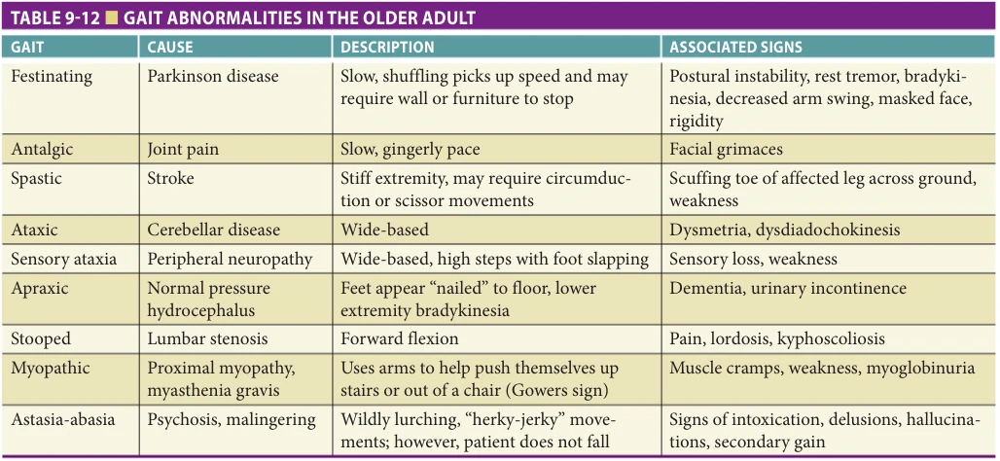

*Table 9-12. Gait abnormalities in the older adult. Printed p. 148.*

and numbers are traced onto the palm with the back of the reflex hammer. Stereognosis is also performed with the patient’s eyes closed. Common objects are placed into the patients’ hand and they are allowed to move them about without using the other hand. Deficits imply dysfunction in the contralateral parietal lobe. Cortical sensory function should be assessed independently for each upper extremity. It is important to first assess primary sensory modalities. In the presence of prominent sensory loss, cortical sensory function cannot be assessed.

Neurovascular Assessment Examination of the vascular system, including auscultation for cranial and carotid bruits, palpation of peripheral pulses, and assessment of blood pressure (lying, sitting, and standing), complements the neurologic examination and should be performed on every patient.

## CONCLUSION

A variety of neurologic disorders (eg, stroke, Parkinson disease, Alzheimer disease) preferentially present in older adults. A comprehensive mental status and neurologic examination should be performed in every patient to document changes in neurologic function (ie, memory/ cognition, behavior/personality, cranial nerves, motor function, and sensory perception) associated with pathologic conditions that affect the nervous system and distinguish them from the functional changes associated with normal aging. Limited memory and cognitive function changes occur as one age. Subtle changes in memory that do not interfere with normal functioning in society and that do not impair activities of daily living occur in normal aging. More significant declines in memory and cognitive function can be encountered in dementia (Table 9-13).

Altered cognitive function in the setting of a clear sensorium is consistent with dementia secondary to a neurodegenerative process or medical illness. Dementias (eg, Alzheimer disease, frontotemporal dementias, dementia with Lewy bodies) are characterized by a specific constellation of signs and symptoms. In Alzheimer disease the individual typically exhibits limited insight into their cognitive deficits that involve memory, language, and visuospatial skills. Patients with frontotemporal dementias present with a predominance of features consistent with frontal and/or temporal degeneration. These individuals exhibit early changes in behavior and personality, such as social inappropriateness, disinhibition, apathy, perseveration, and oral/dietary changes. Other accompanying features may include language/ speech impairment, executive dysfunction, and preserved posterior functions (eg, visuospatial ability, calculations). In dementia with Lewy bodies, patients may exhibit fluctuating cognition, recurrent well-formed and detailed visual hallucinations, and extrapyramidal signs consistent with parkinsonism. Dementia can occur as a consequence of other neurologic and medical illnesses such as cerebrovascular disease, vitamin B12 deficiency, hypothyroidism, Parkinson disease, and meningoencephalitis.

Delirium on the other hand causes alteration in sensorium and level of consciousness and is usually due to medications (Table 9-14), infection, head injury, or metabolic derangements. Associated features include disruption of sleep-wake cycle, intermittent drowsiness and agitation, restlessness, emotional lability, and frank psychosis (hallucination, illusions, delusions). Symptoms of delirium are often worse at night and occur in up to 20% of hospitalized patients. The risk increases in the older adult and the longer the hospital stay. Predisposing factors include advanced

**[p. 149]**

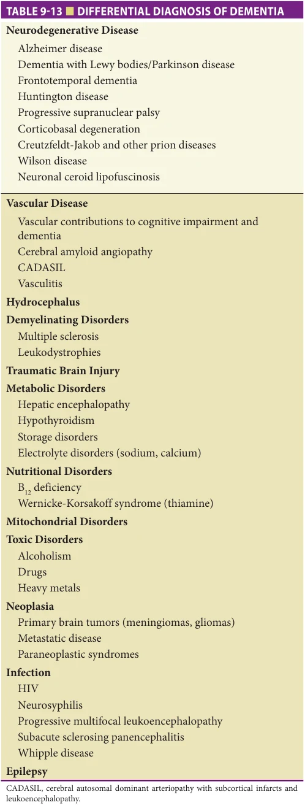

*Table 9-13. Differential diagnosis of dementia. Printed p. 149.*

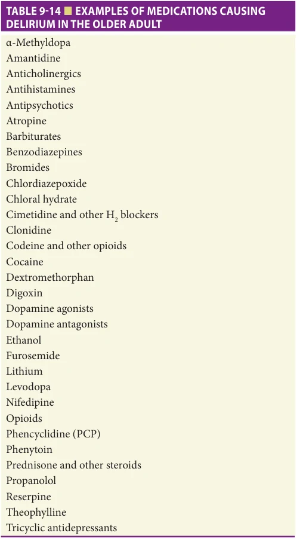

*Table 9-14. Examples of medications causing delirium in the older adult. Printed p. 149.*

age, dementia, impaired physical or mental health, sensory deprivation (poor vision or hearing), and placement in intensive care units.

A functional decline in some aspects of cranial nerve function (eg, vision, hearing, vestibular function, taste, and smell) can be anticipated in normal aging and should be distinguished from pathologic conditions afflicting the nervous system. Similarly, older individuals experience decreased mobility as they age. Subtle changes in gait, posture, coordination, and strength are expected concomitants of aging. However, more profound changes that significantly alter mobility and/or present as focal weakness or impaired coordination should alert the clinician to the possibility of a neuropathologic disorder.

Alterations in sensory perception can be indicative of neuropsychiatric dysfunction. Subtle deficits in vibration and other primary sensory modalities may be encountered in normal aging. However, marked deficits in sensory

**[p. 150]**

function are suggestive of neurologic disease and require further diagnostic testing.

In conclusion, neurologic findings of normal aging include subtle declines in cognitive function, mildly impaired motor function, and altered sensory perceptions. However, exaggerated impairments in cognitive, behavioral, motor, and sensory function suggest the onset of neurologic diseases that commonly afflict the older adult. A comprehensive mental status and neurologic examination is the foundation

## FURTHER READING

Aminoff MJ, Josephson SA. Neurology and General

Medicine. 5th ed. New York, NY: Academic Press; 2014. Burns A, Lawlor B, Craig S. Assessment Scales in Old Age

Psychiatry. 2nd ed. London, UK: Martin Dunitz; 2004. Claussen CF, Pandey A. Neurootological differentiations in

endogenous tinnitus. Int Tinnitus J. 2009;15:174–184. Cummings JL. The Neuropsychiatry of Alzheimer’s Disease and

Related Dementias. London, UK: Martin Dunitz; 2003. Galvin JE, Powlishta KK, Wilkins K, et al. Predictors of

preclinical Alzheimer disease and dementia: a clinicopathologic study. Arch Neurol. 2005;62:758–765. Galvin JE, Roe C, Coats M, et al. The AD8: a brief infor-

mant interview to detect dementia. Neurology. 2005; 65:559–564. Galvin JE. The Quick Dementia Rating System (QDRS):

a rapid dementia staging tool. Alzheimer Dem (DADM). 2015;1:249–259. Galvin JE. Using informant and performance screen-

ing methods to detect mild cognitive impairment and dementia. Curr Rep Gerontol. 2018;7:19–25. Goodwin VA, Abbott RA, Whear R, et al. Multiple com-

ponent interventions for preventing falls and fall-related injuries among older people: a systematic review and meta-analysis. BMC Geriatr. 2014;14:15. Graff-Radford J, Jones DT, Graff-Radford NR. Pathophysiol-

ogy of language, speech and emotions in neurodegenerative disease. Parkinsonism Relat Disord. 2014;20(suppl 1): S49–S53. Jones HR, Srinivasan J, Allman GJ, Baker RA. Netter’s

Neurology. 2nd ed. Philadelphia, PA: Elsevier Saunders; 2011.

for identifying neuropathologic conditions that necessitate further laboratory and imaging investigation.

## ACKNOWLEDGMENTS

This chapter was supported by grants from the National Institute on Aging (R01 AG071514, R01 NS101483, and R01 AG069765), the Anne and Leo Albert Charitable Trust, and the Harry T. Mangurian Foundation.

Karantzoulis S, Galvin JE. Distinguishing Alzheimer’s

disease from other major forms of dementia. Expert Rev Neurother. 2011;11:1579–1591. Massano J, Bhatia KP. Clinical approach to Parkinson’s

disease: features, diagnosis, and principles of management. Cold Spring Harb Perspect Med. 2012;2(6):a008870. Nelson PT, Alafuzoff I, Bigio EH, et al. Correlation of

Alzheimer disease neuropathologic changes with cognitive status: a review of the literature. J Neuropathol Exp Neurol. 2012;71:362–381. O’Brien M. Aids to Examination of the Peripheral Nervous

System. London, UK: Saunders Ltd; 2010. Posner JB, Saper CB, Schiff N, Plum F. Plum and Posner’s

Diagnosis of Stupor and Coma. 4th ed. New York, NY: Oxford University Press; 2007. Robins Wahlin RB, Byrne GJ. Personality changes in

Alzheimer’s disease: a systematic review. Int J Geriatr Psychiatry. 2011;26:1019–1029. Ropper A, Samuels M. Adams and Victor’s Principle of

Neurology. 10th ed. New York, NY: McGraw-Hill Professional; 2014. Salthouse TA. Trajectories of normal cognitive aging.

Psychol Aging. 2019;34(1):17–24. Seraji-Bzorgzad N, Paulson H, Heidebrink J. Neurologic

examination in the elderly. Handb Clin Neurol. 2019; 167:73–88. Stone J, Zeman A, Sharpe M. Functional weakness and

sensory disturbance. J Neurol Neurosurg Psychiatry. 2002;73:241–245. Weiner RD, Blazer DG, Steffens DC. Essentials of Geriatric

Psychiatry. 2nd ed. Arlington, VA: APA Publishing; 2012.
