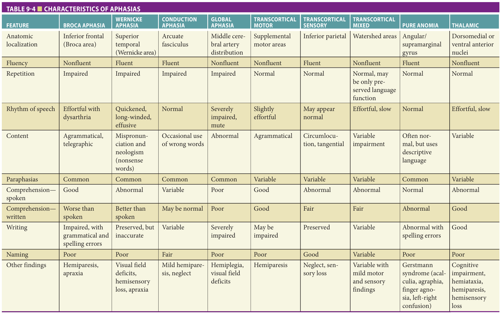

Study summary of Chapter 9 - Mental Status and Neurologic Examination; the book and the full chapter are the reference.

# Chapter 9 Study: Mental Status and Neurologic Examination

## Summary

**Normal aging versus disease**
- Combine a detailed history with a comprehensive examination; obtain collateral history from a reliable informant when cognition or affect may compromise the account (p133–135).
- Slower processing and retrieval can accompany aging, while new learning remains possible. Delayed word recall helps distinguish cognitive impairment from normal aging (p134).
- Distal vibration loss, reduced Achilles reflexes and restricted upward gaze may occur with aging; mild muscle wasting without focal signs need not signify disease (p133–134).
- An extensor plantar response is not normal aging: it indicates upper motor neuron pathology (p133–134).

**Mental status assessment**
- Assess observation, cognition, function and neuropsychiatric status together; patient denial or lack of awareness makes collateral information valuable (p135).
- Altered alertness accompanies cognitive deficits and an underlying medical illness that is almost always treatable; investigate it rather than attributing it to age (p133).
- Test language through spontaneous speech, comprehension, repetition, naming, reading and writing (p133).
- Animal fluency: approximately **18** animals in **1 minute** is normal; fewer than **14** is abnormal. The test is sensitive but lacks specificity (p141).

**Neurologic examination**
- Examine cranial nerves, strength, coordination, sensation, tendon and pathologic reflexes, and neurovascular status; inspect the head and neck as well (p142).
- Test smell with familiar odors such as coffee or vanilla, each nostril separately; avoid complex perfumes or noxious ammonia (p142).
- Review gait and station alongside strength, joint disease, sensation and coordination. Medication adverse effects and interactions are significant contributors to falls (p134).

**Clinical use & exam traps**
- History and examination should generate the diagnostic hypotheses that guide laboratory, imaging and specialized studies (p133).
- Do not confuse slow processing with inability to learn, or a diminished ankle reflex with a pathologic plantar response (p134).
- Subtle age-associated memory changes do not impair normal social functioning or daily activities; more substantial cognitive decline requires evaluation (p148).

## Exam-cited book images

Book images cited by past exams. Tap an image to zoom.

## Table 9-4 — book image

[2026-Jun Q41](?chapter=bank&q=mcq-6885558109e8e77f5cee7a87)

## Exam questions

Past-exam questions linked to this chapter (3):

- [2026-Jun Q41](?chapter=bank&q=mcq-6885558109e8e77f5cee7a87)
- [2025-Jun Q16](?chapter=bank&q=mcq-c9d51b9f2f9b51f0a157938b)
- [2025-Jun Q34](?chapter=bank&q=mcq-b636980ea067e5dc8b2d57c5)
